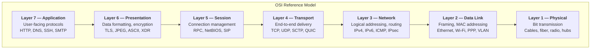
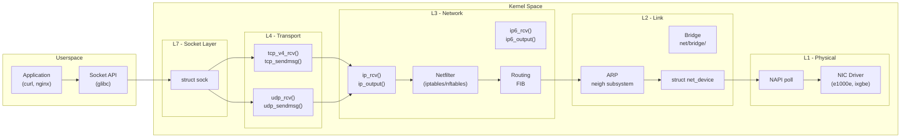

# The OSI Model

## Introduction

The **Open Systems Interconnection (OSI) model** is the foundational conceptual framework for understanding network communication. Developed by the International Organization for Standardization (ISO) in 1984, it divides network communication into seven distinct layers, each with specific responsibilities. While the modern Internet predominantly uses the TCP/IP model, the OSI model remains the standard vocabulary for network engineers, security professionals, and Linux kernel developers when discussing where problems occur and how protocols interact.

Understanding the OSI model is critical for Linux networking because the kernel's networking stack directly maps to these layers. When you configure `iptables` rules, you're operating at Layer 3/4. When you set up a VLAN, you're working at Layer 2. When you plug in a fiber cable, you're dealing with Layer 1.

## The Seven Layers



| Layer | Name | PDU | Key Protocols | Linux Components |
|-------|------|-----|---------------|-----------------|
| 7 | Application | Data | HTTP, DNS, SSH, SMTP, FTP | Userspace applications, `glibc`, `libcurl` |
| 6 | Presentation | Data | TLS/SSL, XDR, MIME | OpenSSL, GnuTLS, kernel crypto API |
| 5 | Session | Data | RPC, NetBIOS, SIP | `rpcbind`, kernel RPC modules |
| 4 | Transport | Segment (TCP) / Datagram (UDP) | TCP, UDP, SCTP | `net/ipv4/tcp*.c`, `net/ipv4/udp.c` |
| 3 | Network | Packet | IPv4, IPv6, ICMP, ARP | `net/ipv4/ip_input.c`, `net/ipv6/`, routing table |
| 2 | Data Link | Frame | Ethernet, 802.1Q, Wi-Fi | NIC drivers, `net/bridge/`, MAC table |
| 1 | Physical | Bit | Electrical signals, light | PHY drivers, SFP modules, cables |

## Layer-by-Layer Deep Dive

### Layer 1 — Physical Layer

The Physical layer handles the raw transmission of bits over a physical medium. It defines electrical voltages, pin layouts, cable specifications, and wireless frequencies.

**Key concepts:**
- **Signaling**: How 1s and 0s are represented electrically (e.g., Manchester encoding for Ethernet)
- **Medium types**: Copper (Cat5e/Cat6/Cat6a), fiber optic (single-mode/multi-mode), wireless (2.4 GHz, 5 GHz, 6 GHz)
- **Topology**: Bus, star, ring, mesh

**Linux relevance**: NIC drivers interact with PHY hardware through the **MDIO bus**. The `ethtool` command exposes Layer 1 parameters:

```bash
# Check physical link status and speed
$ ethtool eth0
Settings for eth0:
    Supported ports: [ TP ]
    Supported link modes:   10baseT/Half 10baseT/Full
                            100baseT/Half 100baseT/Full
                            1000baseT/Full
    Supported pause frame use: No
    Supports auto-negotiation: Yes
    Advertised link modes:  10baseT/Half 10baseT/Full
                            100baseT/Half 100baseT/Full
                            1000baseT/Full
    Speed: 1000Mb/s
    Duplex: Full
    Auto-negotiation: on
    Link detected: yes

# View PHY-level diagnostics (fiber modules)
$ ethtool -m eth0
    Identifier: 0x03 (SFP)
    Connector: 0x07 (LC)
    Transceiver type: 1000BASE-LX
    Wavelength: 1310 nm
    Vendor: FINISAR CORP.
```

### Layer 2 — Data Link Layer

The Data Link layer provides node-to-node transfer between directly connected devices. It is subdivided into two sublayers by IEEE:

- **LLC (Logical Link Control)** — IEEE 802.2: Multiplexing, flow control
- **MAC (Media Access Control)** — IEEE 802.3: Physical addressing, channel access

**Key concepts:**
- **MAC addresses**: 48-bit hardware identifiers (e.g., `00:1a:2b:3c:4d:5e`)
- **Frames**: Ethernet II frames have a 14-byte header (destination MAC, source MAC, EtherType) and 4-byte FCS trailer
- **VLAN tagging**: IEEE 802.1Q inserts a 4-byte tag into the frame header
- **Switching**: MAC address learning and forwarding decisions

**Linux implementation:**

```bash
# View MAC address table of a Linux bridge
$ bridge fdb show dev br0
33:33:00:00:00:01 master br0 permanent
01:00:5e:00:00:01 master br0 permanent
aa:bb:cc:dd:ee:ff master br0
a2:9f:8e:7d:6c:5b vlan 100 master br0

# Create and configure a VLAN interface
$ ip link add link eth0 name eth0.100 type vlan id 100
$ ip link set eth0.100 up
$ ip addr add 10.100.0.1/24 dev eth0.100

# View Ethernet frame statistics
$ ip -s link show eth0
2: eth0: <BROADCAST,MULTICAST,UP,LOWER_UP> mtu 1500 qdisc fq_codel state UP
    link/ether 00:1a:2b:3c:4d:5e brd ff:ff:ff:ff:ff:ff
    RX: bytes  packets  errors  dropped missed  mcast
    184329561  1234567  0       0       0       5432
    TX: bytes  packets  errors  dropped carrier collsns
    98765432   654321   0       0       0       0
```

The Linux kernel's bridge implementation (`net/bridge/`) operates at Layer 2, performing MAC learning and frame forwarding entirely in kernel space.

### Layer 3 — Network Layer

The Network layer handles **logical addressing** and **routing** — determining the best path for data to reach its destination across multiple hops.

**Key concepts:**
- **IP addressing**: IPv4 (32-bit) and IPv6 (128-bit) logical addresses
- **Routing**: Forwarding decisions based on routing tables
- **Fragmentation**: Breaking packets that exceed the MTU
- **ICMP**: Error reporting and diagnostic messages (ping, traceroute)

**Linux routing table:**

```bash
# View the routing table
$ ip route show
default via 192.168.1.1 dev eth0 proto dhcp metric 100
10.0.0.0/8 via 10.255.0.1 dev tun0 proto static
172.16.0.0/12 via 10.255.0.1 dev tun0 proto static
192.168.1.0/24 dev eth0 proto kernel scope link src 192.168.1.50

# Look up which route a destination uses
$ ip route get 8.8.8.8
8.8.8.8 via 192.168.1.1 dev eth0 src 192.168.1.50 uid 1000
    cache

# View ARP/neighbor cache (Layer 2 ↔ Layer 3 mapping)
$ ip neigh show
192.168.1.1 dev eth0 lladdr aa:bb:cc:dd:ee:ff REACHABLE
192.168.1.100 dev eth0 lladdr 11:22:33:44:55:66 STALE
```

The kernel's routing subsystem uses the **Forwarding Information Base (FIB)** for fast lookups. Advanced setups use policy-based routing with multiple routing tables:

```bash
# Create a custom routing table
echo "100 custom" >> /etc/iproute2/rt_tables
ip route add default via 10.0.0.1 table custom
ip rule add from 192.168.2.0/24 table custom
```

### Layer 4 — Transport Layer

The Transport layer provides **end-to-end communication** between applications. The two primary protocols are TCP and UDP.

**TCP (Transmission Control Protocol):**
- Connection-oriented, reliable, ordered delivery
- Three-way handshake: SYN → SYN-ACK → ACK
- Flow control via sliding window
- Congestion control: cubic (Linux default), BBR, Reno

**UDP (User Datagram Protocol):**
- Connectionless, unreliable, no ordering
- Low overhead, suitable for real-time applications

**Linux TCP/UDP internals:**

```bash
# View TCP connection states
$ ss -t state established
Recv-Q Send-Q  Local Address:Port  Peer Address:Port
0      0       192.168.1.50:22     10.0.0.5:54321
0      128     192.168.1.50:443    203.0.113.10:49152

# View TCP socket details (congestion control, window sizes)
$ ss -ti dst 10.0.0.5
ESTAB  0  0  192.168.1.50:ssh  10.0.0.5:54321
    cubic wscale:7,7 rto:204 rtt:1.5/0.75 ato:40 mss:1448
    cwnd:10 ssthresh:7 bytes_sent:12345 bytes_acked:12345

# Check current congestion control algorithm
$ sysctl net.ipv4.tcp_congestion_control
net.ipv4.tcp_congestion_control = cubic

# View UDP statistics
$ ss -u -a
State  Recv-Q  Send-Q  Local Address:Port  Peer Address:Port
UNCONN 0       0       0.0.0.0:53          0.0.0.0:*
UNCONN 0       0       0.0.0.0:68          0.0.0.0:*
```

### Layer 5 — Session Layer

The Session layer manages **sessions** — establishing, maintaining, and terminating connections between applications. In practice, this layer is often merged with Layer 7 in the TCP/IP model.

**Linux examples:**
- **RPC (Remote Procedure Call)**: `rpcbind`, NFS client/server sessions
- **SIP (Session Initiation Protocol)**: VoIP call management
- **Unix domain sockets**: Local IPC sessions

```bash
# View active RPC sessions
$ rpcinfo -p
   program vers proto   port  service
    100000    4   tcp    111  portmapper
    100000    3   tcp    111  portmapper
    100005    3   tcp  20048  mountd
    100003    3   tcp   2049  nfs
```

### Layer 6 — Presentation Layer

The Presentation layer handles **data formatting, encryption, and compression**. It ensures data sent by one system's application layer can be read by another's.

**Key responsibilities:**
- **Encryption/Decryption**: TLS terminates here (or at Layer 5/7 depending on the model)
- **Serialization**: XDR (used by NFS), ASN.1, Protocol Buffers
- **Character encoding**: UTF-8, ASCII, EBCDIC
- **Compression**: gzip, brotli

**Linux implementation:**

```bash
# TLS session details (Layer 6 encryption)
$ openssl s_client -connect example.com:443 -brief
CONNECTION ESTABLISHED
Protocol version: TLSv1.3
Ciphersuite: TLS_AES_256_GCM_SHA384
Peer certificate: CN=example.com
Verification: OK

# Kernel-level TLS (kTLS) offloads encryption to the kernel
$ cat /proc/net/tls_stat
TlsCurrTxSw           0
TlsCurrRxSw           0
TlsCurrTxDevice       2
TlsDecryptFail        0
```

### Layer 7 — Application Layer

The Application layer is where **user-facing protocols** operate. This is where HTTP, DNS, SSH, SMTP, and all application protocols reside.

**Linux application layer tools:**

```bash
# HTTP request with curl
$ curl -v https://example.com/
> GET / HTTP/2
> Host: example.com
> User-Agent: curl/8.4.0
< HTTP/2 200
< content-type: text/html

# DNS query
$ dig example.com A +short
93.184.216.34

# SMTP test
$ telnet smtp.example.com 25
220 smtp.example.com ESMTP
EHLO test
250-smtp.example.com Hello
```

## Encapsulation and Decapsulation

As data travels down the OSI stack from sender to receiver, each layer **adds its own header** (and sometimes trailer). This process is called **encapsulation**. At the receiving end, each layer **strips** its corresponding header — **decapsulation**.

```mermaid
graph TB
    subgraph "Sender — Encapsulation"
        A1["Application Data"] --> A2["+ Layer 6 Header"]
        A2 --> A3["+ Layer 5 Header"]
        A3 --> A4["+ TCP Header = Segment"]
        A4 --> A5["+ IP Header = Packet"]
        A5 --> A6["+ Ethernet Header + FCS = Frame"]
        A6 --> A7["Convert to Bits"]
    end

    subgraph "Receiver — Decapsulation"
        B7["Bits received"] --> B6["Parse Ethernet Header"]
        B6 --> B5["Parse IP Header"]
        B5 --> B4["Parse TCP Header"]
        B4 --> B3["Strip Layer 5 Header"]
        B3 --> B2["Strip Layer 6 Header"]
        B2 --> B1["Application Data"]
    end
```



**Practical example — an HTTP request encapsulation:**

```
┌─────────────────────────────────────────────────────────┐
│ Layer 7: GET /index.html HTTP/1.1\r\nHost: example.com │  ← Application Data
├─────────────────────────────────────────────────────────┤
│ Layer 4: TCP Header (src_port=49152, dst_port=80,       │  ← Segment
│          seq=..., ack=..., flags=PSH|ACK, win=65535)    │
├─────────────────────────────────────────────────────────┤
│ Layer 3: IP Header (ver=4, ihl=5, ttl=64,              │  ← Packet
│          src=192.168.1.50, dst=93.184.216.34,          │
│          proto=TCP, len=...)                            │
├─────────────────────────────────────────────────────────┤
│ Layer 2: Ethernet Header (dst=aa:bb:cc:dd:ee:ff,       │  ← Frame
│          src=00:1a:2b:3c:4d:5e, type=0x0800)           │
│          + FCS Trailer (4 bytes)                        │
└─────────────────────────────────────────────────────────┘
```

Each layer only needs to understand its own header. The rest is opaque payload. This **layered abstraction** is what allows independent protocol development.

## Linux Networking Stack Mapping

The Linux kernel networking stack doesn't perfectly mirror the OSI model, but the mapping is close:



**Key receive path (`ip_rcv` → application):**

1. NIC receives frame → DMA to ring buffer → hardware interrupt
2. Driver schedules **NAPI** softirq → `net_rx_action()`
3. `ip_rcv()` → Netfilter PREROUTING → routing decision (local vs forward)
4. `tcp_v4_rcv()` → socket buffer → wake up application `recv()`

**Key transmit path (application → NIC):**

1. Application calls `send()` → `tcp_sendmsg()` → builds TCP segments
2. `ip_output()` → Netfilter POSTROUTING → `neigh_resolve_output()` (ARP)
3. `dev_queue_xmq()` → QDisc → NIC driver `ndo_start_xmit()`

**Useful kernel tracing:**

```bash
# Trace the network receive path
$ sudo bpftrace -e 'kprobe:ip_rcv { printf("ip_rcv: %s\n", comm); }'

# View Netfilter hook points
$ sudo nft list ruleset

# View the kernel's network buffer usage
$ cat /proc/net/snmp | grep -A1 Ip
Ip: Forwarding DefaultTTL InReceives InHdrErrors
Ip: 1 64 12345678 0
```

## Key Differences: OSI vs. TCP/IP Model

| Aspect | OSI Model | TCP/IP Model |
|--------|-----------|--------------|
| Layers | 7 | 4 (or 5) |
| Development | ISO (theoretical) | DoD/DARPA (practical) |
| Layer 7-5 | Separate Application, Presentation, Session | Combined into Application |
| Layer 3 | Network (IP only) | Internet (IP, ICMP, ARP) |
| Strictness | Strict layering | More flexible boundaries |
| Usage | Teaching, troubleshooting | Actual Internet implementation |

In practice, most Linux engineers use a **hybrid model** — OSI layer numbers for troubleshooting discussions, TCP/IP architecture for implementation understanding.

## Further Reading

- [The Linux Kernel Documentation](https://docs.kernel.org/)
- [LWN.net - Linux and free software news](https://lwn.net/)
- [GNU Project Documentation](https://www.gnu.org/doc/doc.html)
- [GNU Manuals](https://www.gnu.org/manual/manual.html)
- [Free Software Directory](https://directory.fsf.org/wiki/Main_Page)
- [Planet GNU](https://planet.gnu.org/)
- [Free Software Books](https://www.gnu.org/doc/other-free-books.html)

- [RFC 1122 — Requirements for Internet Hosts](https://www.rfc-editor.org/rfc/rfc1122)
- [Linux Kernel Networking Documentation](https://www.kernel.org/doc/html/latest/networking/)
- [Understanding the Linux Kernel Network Stack (Netflix)](https://netflixtechblog.com/)
- [Wireshark Display Filter Reference](https://www.wireshark.org/docs/dfref/)
- [Linux net/ source code](https://github.com/torvalds/linux/tree/master/net)

## Related Topics

- [Network Fundamentals](./fundamentals.md) — Broader overview of networking concepts
- [TCP/IP Suite](./tcpip-suite.md) — Deep dive into TCP/IP protocol family
- [IP Addressing and Subnetting](./ip-addressing.md) — Layer 3 addressing in detail
- [DHCP](./dhcp.md) — Automatic IP configuration
- [Network Troubleshooting](./troubleshooting.md) — Practical debugging using OSI layers
- [Packet Capture](./packet-capture.md) — Inspecting frames and packets at each layer
