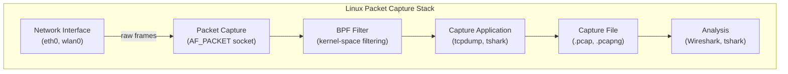
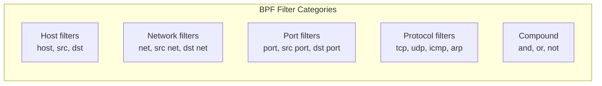
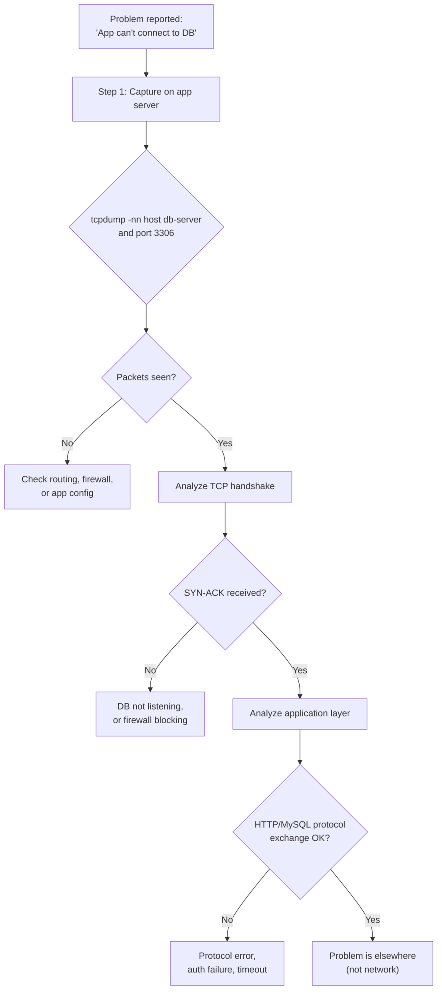

# Packet Capture and Analysis

## Introduction

Packet capture is the art of intercepting and analyzing network traffic at the bit level. It is the most powerful tool in a network engineer's arsenal for diagnosing complex issues, understanding protocol behavior, detecting security threats, and verifying application behavior. Linux provides excellent packet capture tools — from the ubiquitous `tcpdump` to the versatile `tshark` (Wireshark's command-line companion). This chapter covers capture techniques, filter syntax, analysis workflows, and practical debugging scenarios.

## Packet Capture Fundamentals

### How Packet Capture Works



**Capture modes:**
- **Promiscuous mode**: NIC receives all frames on the wire, not just those addressed to it
- **Monitor mode**: Wireless NIC captures all radio frames (802.11)

```bash
# Enable promiscuous mode
$ ip link set eth0 promisc on

# Verify
$ ip link show eth0 | grep PROMISC
2: eth0: <BROADCAST,MULTICAST,PROMISC,UP,LOWER_UP>

# Check capture capabilities
$ getpcaps $(pidof tcpdump)
```

## tcpdump

`tcpdump` is the standard command-line packet capture tool on Linux. It uses the `libpcap` library and BPF (Berkeley Packet Filter) for efficient kernel-space filtering.

### Basic Usage

```bash
# Capture on default interface (requires root)
$ tcpdump
tcpdump: verbose output suppressed, use -v for details
listening on eth0, link-type EN10MB (Ethernet), capture size 262144 bytes
12:00:00.123456 IP 192.168.1.50.22 > 10.0.0.5.54321: Flags [P.], seq 1:100, ack 1, win 501
12:00:00.123789 IP 10.0.0.5.54321 > 192.168.1.50.22: Flags [.], ack 100, win 65535

# Capture on specific interface
$ tcpdump -i eth0

# Capture on all interfaces
$ tcpdump -i any

# Verbose output (more detail)
$ tcpdump -v -i eth0

# Very verbose (maximum detail)
$ tcpdump -vvv -i eth0

# Don't resolve hostnames (faster)
$ tcpdump -n -i eth0

# Don't resolve hostnames or port names
$ tcpdump -nn -i eth0

# Show absolute sequence numbers
$ tcpdump -S -i eth0

# Show hex and ASCII dump
$ tcpdump -X -i eth0

# Limit packet count
$ tcpdump -c 100 -i eth0

# Write to file
$ tcpdump -w capture.pcap -i eth0

# Read from file
$ tcpdump -r capture.pcap
```

### BPF Filter Syntax

BPF filters are applied in **kernel space**, making them very efficient — uninteresting packets are dropped before reaching userspace.



**Host filters:**

```bash
# Capture traffic to/from a specific host
$ tcpdump -nn host 192.168.1.100

# Traffic from a specific source
$ tcpdump -nn src 192.168.1.100

# Traffic to a specific destination
$ tcpdump -nn dst 8.8.8.8

# Traffic between two hosts
$ tcpdump -nn host 192.168.1.100 and host 10.0.0.5
```

**Network filters:**

```bash
# Traffic from a subnet
$ tcpdump -nn src net 192.168.1.0/24

# Traffic to a subnet
$ tcpdump -nn dst net 10.0.0.0/8

# Traffic within a subnet
$ tcpdump -nn net 172.16.0.0/12
```

**Port filters:**

```bash
# Traffic on a specific port
$ tcpdump -nn port 80

# Traffic from a specific source port
$ tcpdump -nn src port 443

# Traffic to a specific destination port
$ tcpdump -nn dst port 22

# Traffic on a range of ports
$ tcpdump -nn portrange 8000-9000
```

**Protocol filters:**

```bash
# Only TCP traffic
$ tcpdump -nn tcp

# Only UDP traffic
$ tcpdump -nn udp

# Only ICMP traffic
$ tcpdump -nn icmp

# Only ARP traffic
$ tcpdump -nn arp

# Only IPv6 traffic
$ tcpdump -nn ip6

# VLAN-tagged traffic
$ tcpdump -nn vlan
```

**TCP flag filters:**

```bash
# SYN packets (new connections)
$ tcpdump -nn 'tcp[tcpflags] & (tcp-syn) != 0'

# SYN-ACK packets (connection accepted)
$ tcpdump -nn 'tcp[tcpflags] & (tcp-syn|tcp-ack) == (tcp-syn|tcp-ack)'

# RST packets (connection reset)
$ tcpdump -nn 'tcp[tcpflags] & (tcp-rst) != 0'

# FIN packets (connection closing)
$ tcpdump -nn 'tcp[tcpflags] & (tcp-fin) != 0'

# Only SYN (no ACK) — new connection attempts
$ tcpdump -nn 'tcp[tcpflags] == tcp-syn'
```

**Compound filters:**

```bash
# AND
$ tcpdump -nn 'host 192.168.1.100 and port 443'

# OR
$ tcpdump -nn 'port 80 or port 443'

# NOT
$ tcpdump -nn 'not port 22'

# Complex filter: HTTP traffic from a specific host, excluding SSH
$ tcpdump -nn 'src host 192.168.1.100 and (port 80 or port 443) and not port 22'

# Capture DNS queries and responses
$ tcpdump -nn 'port 53'

# Capture DHCP traffic
$ tcpdump -nn 'port 67 or port 68'

# Capture traffic with specific payload content
$ tcpdump -nn 'tcp port 80 and tcp[((tcp[12:1] & 0xf0) >> 2):4] = 0x47455420'
# This matches "GET " at the start of HTTP payload
```

### Advanced tcpdump Techniques

```bash
# Rotate capture files (useful for long captures)
$ tcpdump -w /tmp/capture.pcap -C 100 -W 10 -i eth0
# -C 100 = 100 MB per file
# -W 10  = maximum 10 files (then overwrite)

# Rotate by time
$ tcpdump -w /tmp/capture.pcap -G 3600 -W 24 -i eth0
# -G 3600 = new file every 3600 seconds (1 hour)
# -W 24   = maximum 24 files

# Capture with timestamp precision
$ tcpdump -tt -nn -i eth0   # Unix timestamp
1705123456.123456 IP 192.168.1.50.22 > 10.0.0.5.54321: ...

$ tcpdump -ttt -nn -i eth0  # Delta from previous packet
0.000123 IP 192.168.1.50.22 > 10.0.0.5.54321: ...

# Capture only headers (no payload)
$ tcpdump -s 96 -i eth0

# Capture full packets (default: 262144 bytes)
$ tcpdump -s 0 -i eth0

# Capture with immediate mode (no buffering)
$ tcpdump -U -w - -i eth0 | tee capture.pcap | tcpdump -r -

# Print packet numbers
$ tcpdump -# -nn -i eth0
```

## tshark — Wireshark's Command-Line Companion

`tshark` is Wireshark's CLI counterpart. It provides Wireshark's full dissection and display filter capabilities from the command line.

### Basic Usage

```bash
# Install
$ apt install tshark   # Debian/Ubuntu
$ dnf install wireshark-cli   # RHEL/Fedora

# Capture on an interface
$ tshark -i eth0

# Capture with verbose output
$ tshark -i eth0 -V

# Capture to file (pcapng format)
$ tshark -i eth0 -w capture.pcapng

# Read from file
$ tshark -r capture.pcap

# Limit capture count
$ tshark -i eth0 -c 100

# Don't resolve names
$ tshark -i eth0 -n
```

### Display Filters (Wireshark Syntax)

Unlike tcpdump's BPF filters (capture-time), tshark supports **display filters** (post-capture analysis). Display filters use a different, more powerful syntax.

| Filter | Description |
|--------|-------------|
| `ip.addr == 192.168.1.100` | Any traffic involving this IP |
| `ip.src == 192.168.1.100` | Source IP |
| `ip.dst == 8.8.8.8` | Destination IP |
| `tcp.port == 443` | TCP port 443 |
| `tcp.flags.syn == 1` | SYN flag set |
| `tcp.flags.rst == 1` | RST flag set |
| `http.request.method == "GET"` | HTTP GET requests |
| `http.response.code == 200` | HTTP 200 responses |
| `dns.qry.name == "example.com"` | DNS queries for example.com |
| `tls.handshake.type == 1` | TLS Client Hello |
| `frame.len > 1000` | Packets larger than 1000 bytes |
| `tcp.analysis.retransmission` | TCP retransmissions |
| `tcp.analysis.zero_window` | TCP zero window |

```bash
# Capture HTTP requests
$ tshark -i eth0 -Y "http.request"

# Capture DNS queries
$ tshark -i eth0 -Y "dns.qry.name"

# Capture TLS handshakes
$ tshark -i eth0 -Y "tls.handshake"

# Capture traffic to/from specific host
$ tshark -i eth0 -Y "ip.addr == 192.168.1.100"

# Capture TCP retransmissions
$ tshark -i eth0 -Y "tcp.analysis.retransmission"

# Capture with specific fields
$ tshark -i eth0 -Y "http.request" -T fields \
    -e frame.time -e ip.src -e http.host -e http.request.method -e http.request.uri

# Output as JSON
$ tshark -r capture.pcap -Y "http.request" -T json

# Output as CSV
$ tshark -r capture.pcap -Y "http.request" -T fields \
    -e frame.number -e frame.time -e ip.src -e ip.dst -e http.host -e http.request.uri \
    -E header=y -E separator=,
```

### tshark Analysis Examples

```bash
# Top talkers (IP addresses by packet count)
$ tshark -r capture.pcap -q -z conv,ip
===================================================================
IPv4 Conversations
Filter:<No Filter>
                       |       <-      | |       ->      | |     Total     |
                       | Frames  Bytes | | Frames  Bytes | | Frames  Bytes |
192.168.1.50 <-> 8.8.8.8     50   5000      50   5000      100  10000

# HTTP requests summary
$ tshark -r capture.pcap -q -z http,tree
===================================================================
HTTP/Packet Counter
Topic / Item          Count         Average
HTTP Requests         50
  GET                 40
  POST                10
HTTP Responses        50
  2xx                 45
  4xx                 5

# DNS query statistics
$ tshark -r capture.pcap -q -z dns,tree

# TCP stream statistics
$ tshark -r capture.pcap -q -z conv,tcp

# Follow a specific TCP stream
$ tshark -r capture.pcap -q -z follow,tcp,ascii,0
# (0 = stream index)

# Expert info (warnings, errors, notes)
$ tshark -r capture.pcap -q -z expert
Expert Info (Severity/Summary/Group):
  Warning/Sequence number out-of-order/TCP
  Warning/Previous segment not captured/TCP
  Note/TCP Retransmission/TCP
```

## Wireshark (GUI)

While CLI tools are essential for servers, Wireshark's GUI is invaluable for deep analysis.

```bash
# Install Wireshark
$ apt install wireshark
$ usermod -aG wireshark $USER   # Allow non-root capture

# Launch with a capture file
$ wireshark capture.pcap

# Capture from CLI and open in Wireshark
$ sudo tcpdump -i eth0 -w /tmp/capture.pcap -c 1000 port 80
$ wireshark /tmp/capture.pcap &
```

**Wireshark key features:**
- **Protocol dissection**: Automatic parsing of hundreds of protocols
- **Stream following**: Reassemble TCP/UDP streams
- **Statistics**: Conversations, endpoints, protocol hierarchy
- **IO graphs**: Visualize traffic patterns over time
- **Expert analysis**: Automatic detection of anomalies

## Capture Analysis Techniques

### Analyzing TCP Connections

```bash
# Capture the TCP three-way handshake
$ tcpdump -nn 'tcp[tcpflags] == tcp-syn or tcp[tcpflags] & (tcp-syn|tcp-ack) == (tcp-syn|tcp-ack)' \
    -c 3 -i eth0 host 192.168.1.100 and port 80

12:00:00.000000 IP 192.168.1.100.49152 > 10.0.0.1.80: Flags [S], seq 1000, win 65535
12:00:00.001234 IP 10.0.0.1.80 > 192.168.1.100.49152: Flags [S.], seq 2000, ack 1001, win 65535
12:00:00.001345 IP 192.168.1.100.49152 > 10.0.0.1.80: Flags [.], ack 2001, win 65535

# Analyze TCP handshake with tshark
$ tshark -r capture.pcap -Y "tcp.flags.syn == 1 or (tcp.flags.syn == 1 and tcp.flags.ack == 1)" \
    -T fields -e frame.time -e ip.src -e ip.dst -e tcp.srcport -e tcp.dstport -e tcp.flags
```

### Analyzing HTTP Traffic

```bash
# Capture HTTP requests and responses
$ tshark -i eth0 -Y "http" -T fields \
    -e frame.time_relative -e ip.src -e ip.dst -e http.request.method \
    -e http.host -e http.request.uri -e http.response.code -e http.content_type

# Extract HTTP URLs from a capture
$ tshark -r capture.pcap -Y "http.request" -T fields -e http.host -e http.request.uri | sort -u

# Find slow HTTP responses
$ tshark -r capture.pcap -Y "http.response" -T fields \
    -e frame.time -e ip.src -e http.response.code -e http.time

# Extract files transferred over HTTP
$ tshark -r capture.pcap --export-objects http,./extracted_files/
```

### Analyzing DNS Traffic

```bash
# Capture all DNS traffic
$ tshark -i eth0 -Y "dns" -T fields \
    -e frame.time -e ip.src -e ip.dst -e dns.qry.name -e dns.qry.type \
    -e dns.resp.name -e dns.a

# Find DNS failures (NXDOMAIN)
$ tshark -r capture.pcap -Y "dns.flags.rcode != 0" \
    -T fields -e frame.time -e ip.src -e dns.qry.name -e dns.flags.rcode

# DNS query rate (queries per second)
$ tshark -r capture.pcap -q -z io,stat,1,"COUNT(dns.qry)frame(dns.qry)"
```

### Analyzing TLS Handshakes

```bash
# Capture TLS handshakes
$ tshark -i eth0 -Y "tls.handshake" -T fields \
    -e frame.time -e ip.src -e ip.dst -e tls.handshake.type \
    -e tls.handshake.ciphersuite -e tls.handshake.version

# Find TLS errors
$ tshark -r capture.pcap -Y "tls.alert_message"

# Extract TLS certificates
$ tshark -r capture.pcap -Y "tls.handshake.type == 11" \
    -T fields -e x509sat.utf8String -e x509ce.validity.notAfter
```

## Capture File Management

### File Formats

| Format | Extension | Description |
|--------|-----------|-------------|
| **pcap** | `.pcap` | Classic format, widely compatible |
| **pcapng** | `.pcapng` | Modern format, supports multiple interfaces, metadata |
| **snoop** | `.snoop` | Solaris format |
| **erf** | `.erf` | Endace format |

```bash
# Convert between formats
$ editcap -F pcapng capture.pcap capture.pcapng
$ editcap -F pcap capture.pcapng capture.pcap

# Merge multiple capture files
$ mergecap -w merged.pcap file1.pcap file2.pcap file3.pcap

# Split a large capture file
$ editcap -c 10000 large.pcap split.pcap
# Creates split_00000.pcap, split_00001.pcap, etc. (10000 packets each)

# Split by time
$ editcap -i 60 large.pcap split.pcap
# Creates one file per 60-second interval

# Sanitize capture (remove sensitive data)
$ tracepkt -z capture.pcap   # or use tcpdump with -s to limit payload
```

### Capture Security and Privacy

```bash
# NEVER capture passwords in production without authorization!
# Captures may contain sensitive data (credentials, PII, tokens)

# Capture only headers (no payload) for analysis without sensitive data
$ tcpdump -s 96 -w headers.pcap -i eth0

# Capture specific non-sensitive traffic
$ tcpdump -w dns-only.pcap -i eth0 port 53

# Encrypt captures for storage
$ gpg -c capture.pcap
$ gpg capture.pcap.gpg   # Decrypt

# Securely delete captures
$ shred -vfz -n 3 capture.pcap
```

## Advanced Capture Scenarios

### Remote Capture

```bash
# Capture on a remote server and pipe to local Wireshark
$ ssh root@server "tcpdump -i eth0 -w - port 80" | wireshark -k -i -

# Using tshark remotely
$ ssh root@server "tshark -i eth0 -w - -f 'port 443'" > remote.pcap

# Capture on a remote interface with socat
# On server:
$ socat TCP-LISTEN:1234,reuseaddr,fork SYSTEM:"tcpdump -i eth0 -w - port 80"
# On client:
$ socat TCP:server:1234 - | wireshark -k -i -
```

### Capture in Containers and Namespaces

```bash
# Capture in a network namespace
$ ip netns exec myns tcpdump -i eth0 -nn

# Capture traffic from a Docker container
$ nsenter -t $(docker inspect -f '{{.State.Pid}}' container_name) -n tcpdump -i eth0

# Capture on a veth pair
$ tcpdump -i veth12345 -nn

# Capture on a bridge interface
$ tcpdump -i br0 -nn
```

### Capture Filter Examples for Common Protocols

```bash
# SSH brute force detection
$ tcpdump -nn 'tcp dst port 22 and tcp[tcpflags] == tcp-syn' -c 100

# ARP spoofing detection
$ tcpdump -nn arp | grep "is-at"

# DHCP activity
$ tcpdump -nn 'port 67 or port 68' -e

# NTP traffic
$ tcpdump -nn 'port 123 and udp'

# BGP sessions
$ tcpdump -nn 'tcp port 179'

# OSPF packets
$ tcpdump -nn 'ip proto 89'

# ICMP types
$ tcpdump -nn 'icmp[0] == 8'   # Echo request
$ tcpdump -nn 'icmp[0] == 0'   # Echo reply
$ tcpdump -nn 'icmp[0] == 3'   # Destination unreachable
$ tcpdump -nn 'icmp[0] == 11'  # Time exceeded (traceroute)

# Multicast traffic
$ tcpdump -nn 'dst net 224.0.0.0/4'

# Broadcast traffic
$ tcpdump -nn 'broadcast'

# Fragmented packets
$ tcpdump -nn 'ip[6:2] & 0x3fff != 0'
```

## Capture Performance Considerations

```bash
# Check for dropped packets
$ tcpdump -i eth0 -c 10000 2>&1 | grep dropped
10000 packets captured
10000 packets received by filter
0 packets dropped by kernel

# If drops occur:
# 1. Use BPF filters to reduce traffic volume
$ tcpdump -i eth0 -s 96 port 80   # Capture headers only on port 80

# 2. Increase buffer size
$ tcpdump -i eth0 -B 4096 -w capture.pcap   # 4 MB buffer

# 3. Write to /dev/shm (RAM disk) for fast I/O
$ tcpdump -i eth0 -w /dev/shm/capture.pcap

# 4. Use ring buffer for continuous capture
$ tcpdump -i eth0 -w /tmp/capture.pcap -C 100 -W 10

# Monitor capture statistics
$ tshark -i eth0 -q -z io,stat,1
```

## Putting It All Together — Debugging Workflow



## Further Reading

- [tcpdump Man Page](https://man7.org/linux/man-pages/man1/tcpdump.1.html)
- [tshark Man Page](https://www.wireshark.org/docs/man-pages/tshark.html)
- [Wireshark Display Filter Reference](https://www.wireshark.org/docs/dfref/)
- [BPF Filter Syntax](https://biot.com/capstats/bpf.html)
- [Chris Sanders — Practical Packet Analysis](https://nostarch.com/packetanalysis3)
- [Laura Chappell — Wireshark Network Analysis](https://www.chappell-university.com/)
- [Wireshark Sample Captures](https://wiki.wireshark.org/SampleCaptures)

## Related Topics

- [OSI Model](./osi-model.md) — Understanding what each layer shows in captures
- [Network Troubleshooting](./troubleshooting.md) — When to use packet capture
- [HTTP and HTTPS](./http.md) — HTTP protocol details for analysis
- [VPN](./vpn.md) — Capturing encrypted tunnel traffic
- [Routing Protocols](./routing-protocols.md) — Analyzing OSPF and BGP packets
- [IP Addressing](./ip-addressing.md) — Understanding captured IP headers
