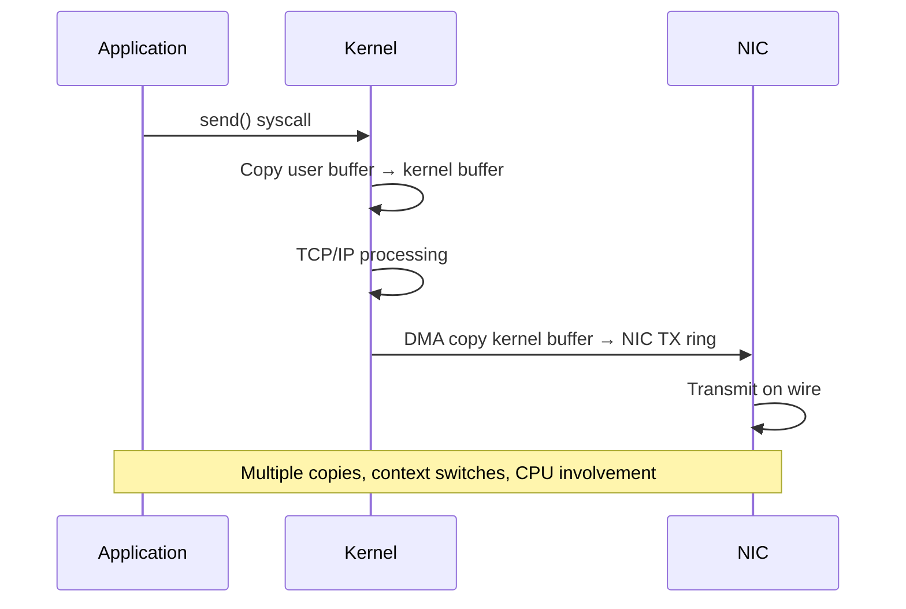
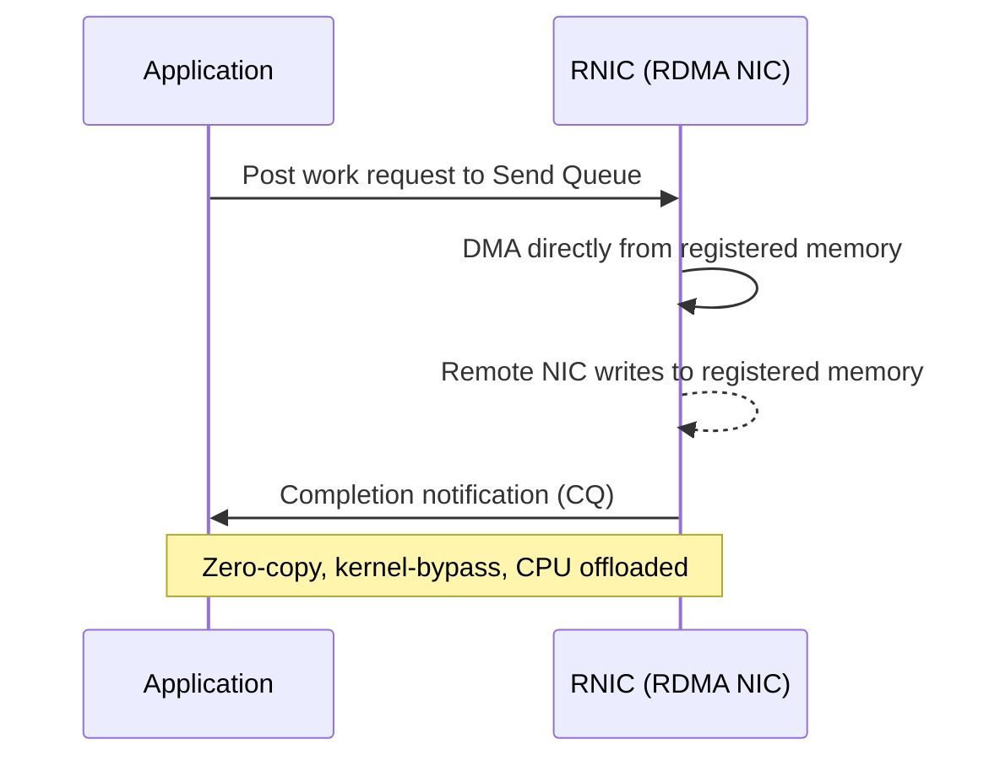
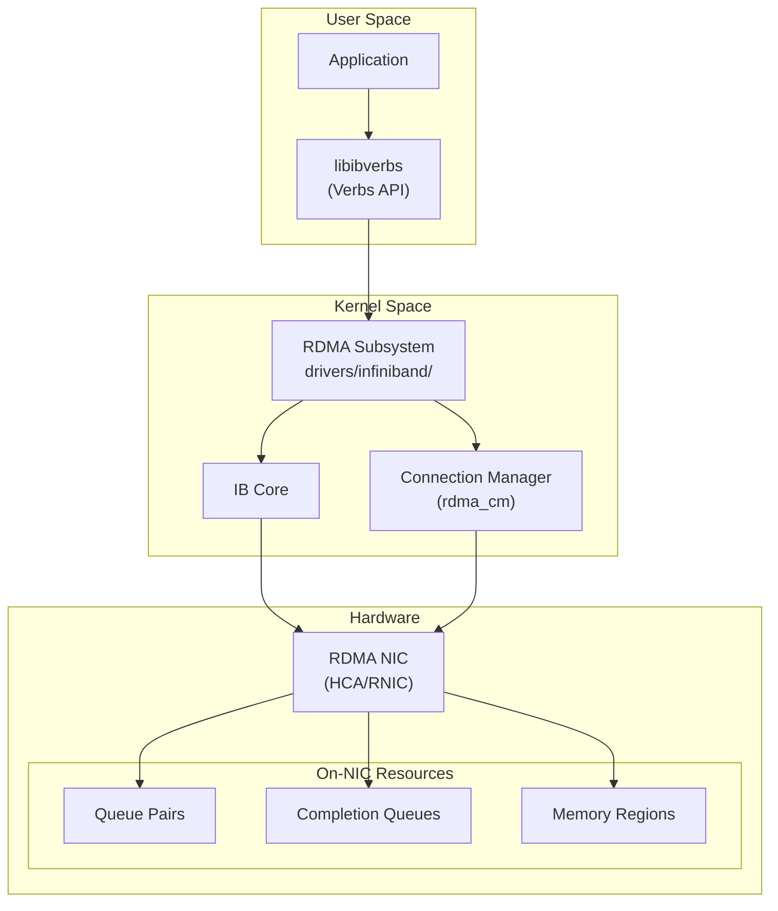
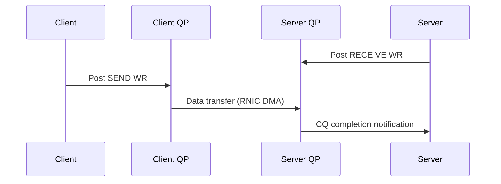
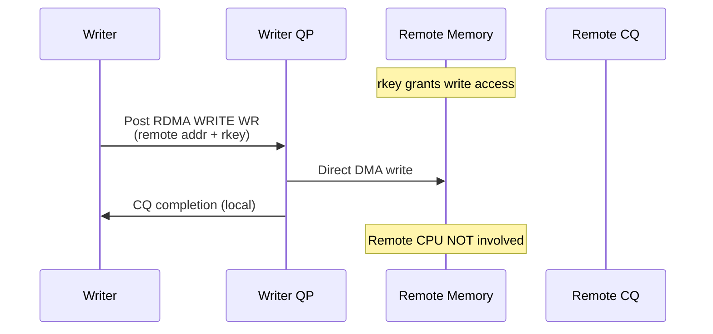
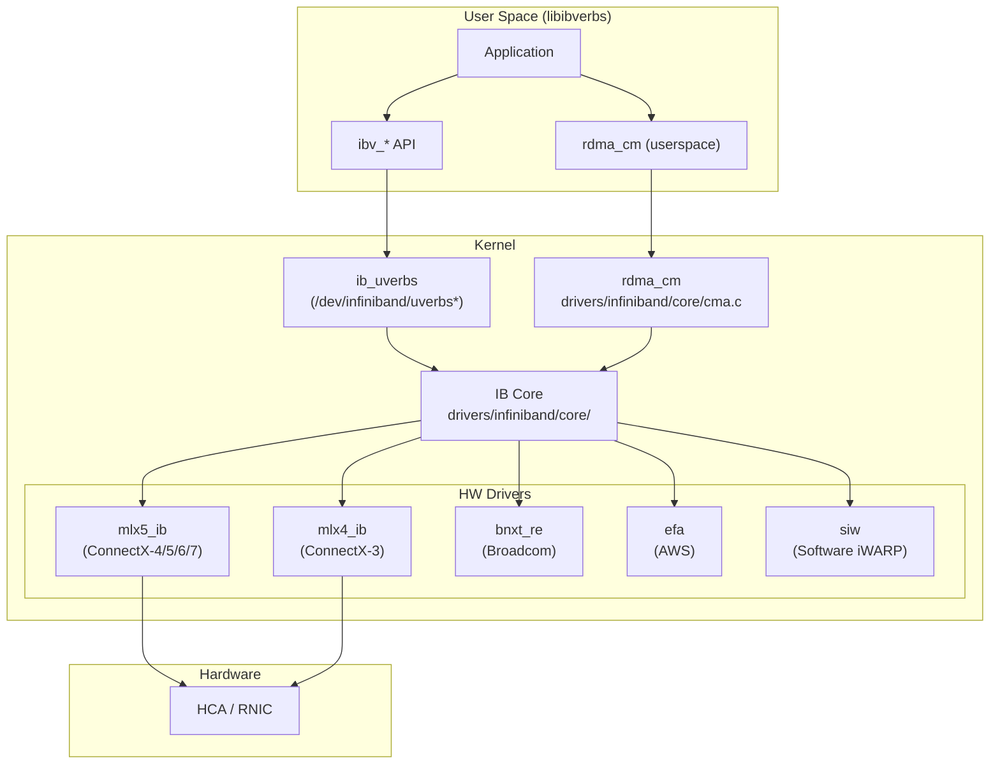

# Remote Direct Memory Access (RDMA)

## Introduction

Remote Direct Memory Access (RDMA) is a technology that allows one computer to directly access the memory of another computer without involving either operating system's kernel or CPU. This kernel-bypass approach eliminates the overhead of traditional network I/O — copying data between user buffers, kernel buffers, and NIC buffers — achieving latencies as low as 1–2 microseconds and throughput exceeding 200 Gbps on modern hardware.

RDMA is the backbone of high-performance computing (HPC), AI/ML training clusters, financial trading systems, and high-performance storage fabrics. Linux has first-class RDMA support through the `rdma-core` userspace library and the in-kernel RDMA subsystem.

## RDMA vs Traditional Networking

Traditional TCP/IP networking involves multiple data copies and context switches:



RDMA eliminates these steps by allowing the NIC (RNIC) to read/write application memory directly:



## Core Architecture

### Components



### Queue Pairs (QP)

Every RDMA endpoint uses a **Queue Pair**, consisting of:

- **Send Queue (SQ)**: Work requests to send data or perform RDMA operations
- **Receive Queue (RQ)**: Buffers posted to receive incoming messages

A QP is the fundamental communication channel. Two endpoints each create a QP and connect them. The RNIC processes work requests from the SQ asynchronously, without CPU involvement.

### Completion Queues (CQ)

When work requests finish, the RNIC posts a **Work Completion (WC)** entry to the Completion Queue. Applications poll the CQ to determine when operations are done. A single CQ can serve multiple QPs.

### Memory Registration

Before RDMA operations can access application memory, it must be **registered** with the RNIC:

1. `ibv_reg_mr()` pins physical pages and creates a **Memory Region (MR)**
2. The RNIC receives a **lkey** (local key) for local access and **rkey** (remote key) for remote access
3. Registration establishes DMA mappings so the NIC can perform zero-copy transfers

Memory registration is expensive (involves pinning pages and IOMMU setup). Applications typically register large buffers once and reuse them.

## RDMA Operations

| Operation | Description | Use Case |
|-----------|-------------|----------|
| **SEND/RECEIVE** | Two-sided messaging; sender posts SEND, receiver posts RECEIVE | Control messages, request/response |
| **RDMA WRITE** | One-sided; write directly to remote memory without remote CPU | Data push, storage writes |
| **RDMA READ** | One-sided; read directly from remote memory | Data pull, storage reads |
| **Atomic** | Compare-and-swap or fetch-and-add on remote memory | Distributed locks, counters |

### SEND/RECEIVE Flow



### RDMA WRITE Flow



## RDMA Transports

Linux supports three RDMA transport protocols:

### InfiniBand

- **Native RDMA transport** over dedicated fabric
- Bandwidth: SDR (2.5 Gbps) through NDR (400 Gbps) and XDR (800 Gbps)
- Subnet Manager (SM) manages routing and topology
- Lossless by design with credit-based flow control
- See [InfiniBand](../storage/infiniband.md) for detailed coverage

### RoCE (RDMA over Converged Ethernet)

- **RoCE v1**: RDMA over Ethernet at Layer 2 (no IP routing)
- **RoCE v2**: RDMA over UDP/IP at Layer 3 (routable)
- Uses standard Ethernet infrastructure with DCB/PFC for lossless behavior
- Most common RDMA transport in data centers

```bash
# Configure RoCE v2 on Linux
# Install required packages
sudo apt install rdma-core ibverbs-utils perftest

# Check RDMA devices
ibv_devices
ibv_devinfo -d mlx5_0

# Assign IP to RoCE-capable interface
sudo ip addr add 192.168.100.1/24 dev enp1s0f0
sudo ip link set enp1s0f0 up
```

### iWARP (Internet Wide Area RDMA Protocol)

- RDMA over TCP/IP
- Works over existing TCP infrastructure without special switch configuration
- Higher latency than RoCE due to TCP overhead
- Better for WAN/metro deployments

```bash
# iWARP modules
sudo modprobe iw_cxgb4    # Chelsio T4/T5/T6
sudo modprobe iw_nes       # NetEffect NE020
sudo modprobe siw          # Software iWARP (for testing)
```

## Linux RDMA Stack



### Key Kernel Paths

| Path | Purpose |
|------|---------|
| `drivers/infiniband/core/` | Core RDMA subsystem |
| `drivers/infiniband/core/uverbs_main.c` | Userspace verbs interface |
| `drivers/infiniband/core/cma.c` | RDMA Connection Manager |
| `drivers/infiniband/hw/mlx5/` | Mellanox ConnectX driver |
| `include/rdma/ib_verbs.h` | Core verbs header |
| `include/rdma/rdma_cm.h` | Connection Manager API |

## Configuration

### Installing RDMA Packages

```bash
# Debian/Ubuntu
sudo apt install rdma-core ibverbs-utils infiniband-diags \
    rdmacm-utils perftest opensm

# RHEL/CentOS/Fedora
sudo dnf install rdma-core libibverbs-utils infiniband-diags \
    librdmacm-utils perftest opensm

# Install MLNX_OFED (Mellanox) for latest drivers
# Download from https://network.nvidia.com/products/infiniband-drivers/linux/mlnx_ofed/
sudo ./mlnxofedinstall --add-kernel-support
```

### Loading Kernel Modules

```bash
# Core RDMA modules
sudo modprobe ib_core
sudo modprobe ib_uverbs
sudo modprobe rdma_cm
sudo modprobe rdma_ucm
sudo modprobe ib_cm
sudo modprobe ib_umad

# For Mellanox ConnectX-4/5/6/7
sudo modprobe mlx5_core
sudo modprobe mlx5_ib

# For RoCE
sudo modprobe mlx5_core
sudo modprobe rpcrdma        # NFS over RDMA
sudo modprobe svcrdma         # NFS server over RDMA
```

### Verifying RDMA Devices

```bash
# List available RDMA devices
$ ibv_devices
    device           node GUID
    ------           ----------------
    mlx5_0           0002c90300abcdef
    mlx5_1           0002c90300abcdef

# Detailed device information
$ ibv_devinfo -d mlx5_0
hca_id: mlx5_0
        transport:                      InfiniBand (0)
        fw_ver:                         16.35.2000
        node_guid:                      0002c903:00abcdef
        sys_image_guid:                 0002c903:00abcdef
        vendor_id:                      0x02c9
        vendor_part_id:                 4119
        hw_ver:                         0x0
        phys_port_cnt:                  1
        port:   1
                state:                  PORT_ACTIVE (4)
                max_mtu:                4096 (5)
                active_mtu:             4096 (5)
                sm_lid:                 0
                port_lid:               0
                port_lmc:               0x00
                link_layer:             Ethernet

# Check RDMA link status
rdma link show
rdma link show dev mlx5_0
```

### Configuring RoCE v2

```bash
# Check current RoCE mode
sudo cma_roce_mode -d mlx5_0 -P 1

# Set RoCE mode to v2 only
sudo cma_roce_mode -d mlx5_0 -P 1 -M 2

# Configure DSCP for RoCE traffic
echo "dscp" | sudo tee /sys/class/infiniband/mlx5_0/ports/1/gid_attrs/types/0
```

### PFC (Priority Flow Control) for Lossless RoCE

```bash
# Install Linux Traffic Control utilities
sudo apt install iproute2

# Configure PFC on priority 3 (common for RoCE)
sudo mlnx_qos -i enp1s0f0 --pfc 0,0,0,1,0,0,0,0

# Set DSCP-to-priority mapping
sudo mlnx_qos -i enp1s0f0 --dscp2prio 26,3

# Verify configuration
sudo mlnx_qos -i enp1s0f0
```

## RDMA Connection Manager (rdma_cm)

The `rdma_cm` library provides a connection-oriented interface similar to sockets:

```c
/* RDMA CM client connection example */
#include <rdma/rdma_cma.h>
#include <rdma/rdma_verbs.h>

struct rdma_cm_id *conn;
struct rdma_event_channel *ec;
struct sockaddr_in addr;

/* Create event channel */
ec = rdma_create_event_channel();
rdma_create_id(ec, &conn, NULL, RDMA_PS_TCP);

/* Resolve address and route */
memset(&addr, 0, sizeof(addr));
addr.sin_family = AF_INET;
addr.sin_port = htons(7471);
inet_pton(AF_INET, "192.168.100.2", &addr.sin_addr);

rdma_resolve_addr(conn, NULL, (struct sockaddr *)&addr, 2000);
/* Wait for RDMA_CM_EVENT_ADDR_RESOLVED */

rdma_resolve_route(conn, 2000);
/* Wait for RDMA_CM_EVENT_ROUTE_RESOLVED */

/* Create QP, connect */
struct rdma_conn_param param = {};
rdma_connect(conn, &param);
/* Wait for RDMA_CM_EVENT_ESTABLISHED */
```

## Performance Benchmarking

The `perftest` suite provides standard RDMA benchmarks:

```bash
# Build perftest (usually pre-packaged)
sudo apt install perftest

# RDMA Write latency test
# Server:
ib_write_lat -d mlx5_0 -a
# Client:
ib_write_lat -d mlx5_0 192.168.100.2

# RDMA Write bandwidth test
# Server:
ib_write_bw -d mlx5_0 -a
# Client:
ib_write_bw -d mlx5_0 192.168.100.2 --report_gbits

# RDMA Read latency
ib_read_lat -d mlx5_0 -a
ib_read_lat -d mlx5_0 192.168.100.2

# SEND/RECEIVE latency
ib_send_lat -d mlx5_0 -a
ib_send_lat -d mlx5_0 192.168.100.2

# Bidirectional bandwidth
ib_write_bw -d mlx5_0 -a --bidir
ib_write_bw -d mlx5_0 192.168.100.2 --bidir --report_gbits

# Atomic operations latency
ib_atomic_lat -d mlx5_0 -a
ib_atomic_lat -d mlx5_0 192.168.100.2
```

### Sample Performance Numbers

| Operation | Latency (μs) | Bandwidth (Gbps) |
|-----------|:------------:|:-----------------:|
| RDMA Write | ~1.0–1.5 | 100–200 |
| RDMA Read | ~1.5–2.0 | 100–200 |
| SEND/RECEIVE | ~1.2–1.8 | 90–190 |
| Atomic CAS | ~1.5–2.5 | N/A |

*Values for ConnectX-6 Dx, 100 GbE RoCE v2, typical single-stream.*

## Performance Tuning

### IRQ Affinity

```bash
# Set IRQ affinity for RDMA NIC interrupts
# Distribute across NUMA-local CPUs
sudo set_irq_affinity.sh mlx5_0

# Manual IRQ affinity
for irq in $(grep mlx5 /proc/interrupts | awk '{print $1}' | tr -d ':'); do
    echo $((irq % $(nproc))) | sudo tee /proc/irq/$irq/smp_affinity_list
done
```

### Memory Tuning

```bash
# Increase locked memory limits
echo "* soft memlock unlimited" | sudo tee -a /etc/security/limits.conf
echo "* hard memlock unlimited" | sudo tee -a /etc/security/limits.conf

# Or per-user
echo "myuser soft memlock unlimited" | sudo tee -a /etc/security/limits.conf

# Verify
ulimit -l
# Should show "unlimited"

# Pin NUMA memory for RDMA buffers
numactl --cpunodebind=0 --membind=0 ./my_rdma_app
```

### Ring Buffer and Queue Depth

```bash
# Increase NIC ring buffer
sudo ethtool -G enp1s0f0 rx 4096 tx 4096

# Increase RDMA completion queue size
# Set via application or verbs API:
# ibv_create_cq(ctx, max_cqe, ...)
```

### Congestion Management (RoCE)

```bash
# Enable ECN marking
sudo mlnx_qos -i enp1s0f0 --ecn 0,0,0,1,0,0,0,0

# Configure DCQCN (Data Center QCN)
sudo mlxconfig -d mlx5_0 set LINK_TYPE_P1=2

# Monitor congestion events
sudo perfquery -a -x | grep -i congst
```

## Use Cases

### NFS over RDMA

```bash
# Server: enable NFS over RDMA
sudo modprobe svcrdma
echo "rdma 20049" | sudo tee /proc/fs/nfsd/portlist

# /etc/exports
/data/share  192.168.100.0/24(rw,sync,no_root_squash)

# Client: mount with RDMA
sudo modprobe rpcrdma
sudo mount -o rdma,port=20049 192.168.100.2:/data/share /mnt/nfs
```

### iSCSI Extensions for RDMA (iSER)

```bash
# iSER allows iSCSI to use RDMA transport
# Server (target) with LIO
targetcli
/> /iscsi create iqn.2024-01.com.example:target0
/> /iscsi/iqn.2024-01.com.example:target0/tpg1 create ib=mlx5_0

# Client (initiator)
iscsiadm -m discovery -t sendtargets -p 192.168.100.2
iscsiadm -m node -T iqn.2024-01.com.example:target0 --login
```

### Storage: NVMe over Fabrics with RDMA

See [NVMe over Fabrics](../storage/nvme-of.md) for NVMe-oF RDMA transport configuration.

## Monitoring and Debugging

```bash
# Monitor RDMA counters
rdma counter show

# Per-device statistics
cat /sys/class/infiniband/mlx5_0/ports/1/counters/port_rcv_data
cat /sys/class/infiniband/mlx5_0/ports/1/counters/port_xmit_data

# Check for errors
cat /sys/class/infiniband/mlx5_0/ports/1/counters/port_rcv_errors
cat /sys/class/infiniband/mlx5_0/ports/1/counters/port_xmit_discards

# Detailed link status
ibstat mlx5_0
ibstatus mlx5_0

# InfiniBand diagnostics
ibping -S          # Server
ibping -c 10 -L 0  # Client

# ibdiagnet - fabric diagnostics
ibdiagnet -r

# Trace RDMA operations with bpftrace
sudo bpftrace -e 'kprobe:ib_create_cq { printf("CQ created by %s\n", comm); }'

# Monitor RDMA connection events
sudo bpftrace -e 'kprobe:cma_connect_cb { printf("Connection event\n"); }'
```

## Troubleshooting

### Common Issues

**No RDMA devices found:**
```bash
# Check if modules are loaded
lsmod | grep -E "mlx5|ib_core|rdma"

# Check PCI devices
lspci | grep -i mellanox

# Reload drivers
sudo modprobe -r mlx5_ib mlx5_core && sudo modprobe mlx5_core mlx5_ib
```

**Link not active:**
```bash
# Check physical link
ibstatus

# Check cable/transceiver
ethtool -m enp1s0f0

# Verify firmware version
mlxfwmanager --query
```

**RDMA operations fail with "connection refused":**
```bash
# Check if RDMA CM service is listening
rdma_res show

# Verify IP address is assigned to RDMA-capable interface
ip addr show enp1s0f0

# Check firewall rules (RDMA CM uses standard TCP/UDP ports)
sudo iptables -L -n
```

**Memory registration failures:**
```bash
# Check locked memory limits
ulimit -l

# Increase in /etc/security/limits.conf
# user soft memlock unlimited
# user hard memlock unlimited

# Check IOMMU settings
dmesg | grep -i iommu
# If needed, disable IOMMU: intel_iommu=off in kernel cmdline
```

**Poor RoCE performance:**
```bash
# Check PFC counters
sudo mlnx_qos -i enp1s0f0
ethtool -S enp1s0f0 | grep -i pfc

# Verify no packet drops
ethtool -S enp1s0f0 | grep -i drop

# Check for pause frames
ethtool -S enp1s0f0 | grep -i pause
```

## References

- Linux kernel RDMA subsystem: `drivers/infiniband/`
- `rdma-core` project: <https://github.com/linux-rdma/rdma-core>
- `libibverbs` API documentation: `man ibv_reg_mr`, `man ibv_create_qp`
- `rdma_cm` API: `man rdma_connect`, `man rdma_resolve_addr`
- OFED documentation: <https://www.openfabrics.org/>
- NVIDIA MLNX_OFED: <https://network.nvidia.com/products/infiniband-drivers/linux/mlnx_ofed/>
- perftest suite: <https://github.com/linux-rdma/perftest>
- InfiniBand Trade Association: <https://www.infinibandta.org/>
- Red Hat RDMA Guide: <https://docs.redhat.com/en/documentation/red_hat_enterprise_linux/9/html/configuring_infiniband_and_rdma_networks>
- "InfiniBand Network Architecture" by Intel Press
- DigitalOcean RDMA Explained: <https://www.digitalocean.com/community/conceptual-articles/rdma-high-performance-networking>
