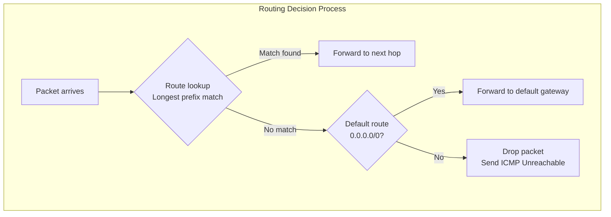
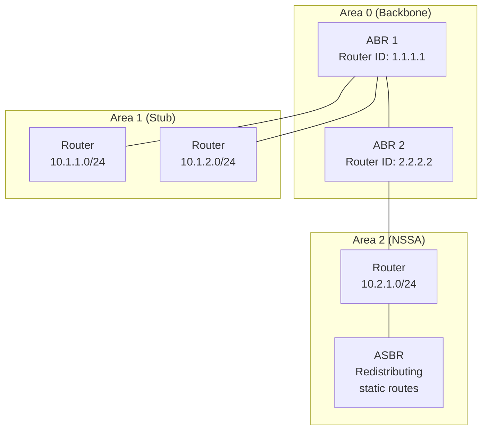
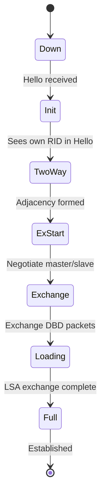
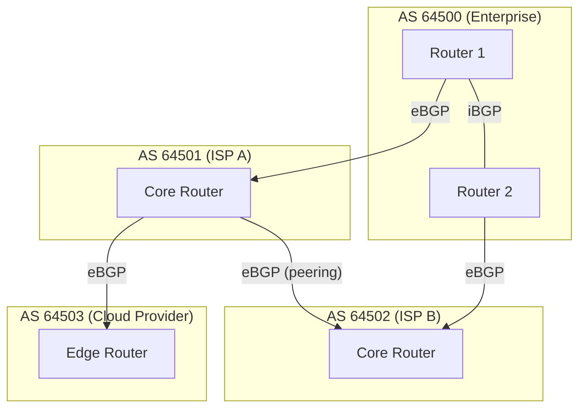
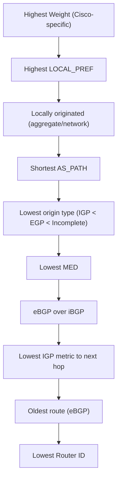

# BGP and OSPF: Routing Protocols

## Introduction

Routing protocols enable routers to share information about network reachability and select optimal paths for forwarding packets. Without routing protocols, every route would need to be manually configured — a nightmare at scale. This chapter covers the two most important routing protocols: **OSPF** (Open Shortest Path First) for interior routing within an organization, and **BGP** (Border Gateway Protocol) for routing between organizations and across the Internet. Understanding these protocols is essential for Linux network engineers working in data centers, cloud environments, and service provider networks.

## How Routing Works

Every router maintains a **routing table** — a list of known networks and the best next hop to reach them. Routing protocols populate these tables automatically by exchanging information with neighboring routers.



**Route sources and administrative distance:**

| Source | AD | Description |
|--------|----|-------------|
| Directly connected | 0 | Interface is up with IP |
| Static route | 1 | Manually configured |
| eBGP | 20 | External BGP |
| OSPF | 110 | OSPF intra/inter-area |
| iBGP | 200 | Internal BGP |
| Unknown | 255 | Never used |

```bash
# View Linux routing table
$ ip route show
default via 192.168.1.1 dev eth0 proto dhcp metric 100
10.0.0.0/8 via 10.255.0.1 dev tun0 proto static metric 50
192.168.1.0/24 dev eth0 proto kernel scope link src 192.168.1.50

# Route lookup for a specific destination
$ ip route get 8.8.8.8
8.8.8.8 via 192.168.1.1 dev eth0 src 192.168.1.50 uid 1000
    cache
```

## Distance Vector vs Link State

| Property | Distance Vector (e.g., RIP) | Link State (e.g., OSPF) | Path Vector (e.g., BGP) |
|----------|---------------------------|------------------------|------------------------|
| Knowledge | Neighbors only | Full topology | Full AS path |
| Algorithm | Bellman-Ford | Dijkstra (SPF) | Best path selection |
| Convergence | Slow (count to infinity) | Fast | Moderate |
| Loop prevention | Split horizon, poison reverse | SPF tree | AS_PATH |
| Scalability | Low | Medium | Very high |
| Metric | Hop count | Cost (bandwidth) | Policy-based |

## OSPF — Open Shortest Path First

**OSPF** (RFC 2328 for v2, RFC 5340 for v3) is a link-state routing protocol that uses Dijkstra's Shortest Path First algorithm. It is the most widely used interior gateway protocol (IGP) in enterprise and data center networks.

### Key Concepts

- **Areas**: OSPF divides networks into areas to limit the scope of link-state advertisements (LSAs) and reduce computation
- **Router ID**: A 32-bit identifier (usually an IP address) that uniquely identifies each router
- **Cost**: Metric based on interface bandwidth (reference bandwidth / interface bandwidth)
- **LSA Types**: Different types of link-state advertisements for different purposes
- **DR/BDR**: Designated Router and Backup Designated Router on multi-access networks

### OSPF Area Design



**Area types:**

| Type | Description | LSA Types Allowed |
|------|-------------|-------------------|
| **Normal** | Carries all LSA types | 1, 2, 3, 4, 5 |
| **Stub** | No external routes | 1, 2, 3 |
| **Totally Stubbly** | Only default route from ABR | 1, 2, 3 (default only) |
| **NSSA** | Stub with external routes injected locally | 1, 2, 3, 7 |

### OSPF LSA Types

| LSA | Name | Originator | Scope | Description |
|-----|------|-----------|-------|-------------|
| 1 | Router LSA | Every router | Area | Router's links and costs |
| 2 | Network LSA | DR | Area | Multi-access network members |
| 3 | Summary LSA | ABR | Area | Inter-area routes |
| 4 | ASBR Summary LSA | ABR | Area | Route to ASBR |
| 5 | External LSA | ASBR | Domain | External routes (redistributed) |
| 7 | NSSA External LSA | ASBR (NSSA) | NSSA | External routes in NSSA |

### OSPF Neighbor States



### OSPF Configuration with FRRouting (FRR)

FRRouting (FRR) is the standard routing suite on Linux, used by Cumulus Linux, SONiC, and many network OS distributions.

```bash
# Install FRR
$ apt install frr
$ dnf install frr

# Enable OSPF daemon
$ sed -i 's/ospfd=no/ospfd=yes/' /etc/frr/daemons
$ systemctl restart frr
```

```
! /etc/frr/frr.conf — OSPF Router Configuration
!
router ospf
    ospf router-id 1.1.1.1
    !
    ! Advertise networks into OSPF
    network 10.0.1.0/24 area 0
    network 10.0.2.0/24 area 0
    network 192.168.1.0/24 area 1
    !
    ! Area configuration
    area 1 stub
    !
    ! Default route redistribution
    default-information originate always
    !
    ! Passive interfaces (don't send Hellos)
    passive-interface eth0
    !
    ! OSPF timers
    timers throttle spf 50 100 5000
    timers throttle lsa all 50 100 5000
```

```bash
# OSPF operational commands
$ vtysh -c "show ip ospf neighbor"
Neighbor ID     Pri State           Dead Time Address         Interface
2.2.2.2           1 Full/DR         00:00:38  10.0.1.2        eth1
3.3.3.3           1 Full/BDR        00:00:35  10.0.2.2        eth2

$ vtysh -c "show ip ospf database"
                OSPF Router with ID (1.1.1.1)

                Router Link States (Area 0)
Link ID         ADV Router      Age  Seq#       Cksum  Link count
1.1.1.1         1.1.1.1           45 0x80000005 0x1234 3
2.2.2.2         2.2.2.2           42 0x80000004 0x5678 2

$ vtysh -c "show ip ospf route"
O   10.0.1.0/24 [110/10] via 10.0.1.2, eth1, 00:05:00
O   10.0.2.0/24 [110/20] via 10.0.1.2, eth1, 00:05:00
O IA 192.168.1.0/24 [110/30] via 10.0.1.2, eth1, 00:05:00

$ vtysh -c "show ip ospf interface eth1"
eth1 is up
  Internet Address 10.0.1.1/24, Area 0.0.0.0
  Router ID 1.1.1.1, Network Type BROADCAST, Cost: 10
  Transmit Delay is 1 sec, State DR, Priority 1
  Designated Router (ID) 1.1.1.1, Interface Address 10.0.1.1
  Backup Designated Router (ID) 2.2.2.2, Interface Address 10.0.1.2
  Timer intervals configured, Hello 10, Dead 40, Wait 40, Retransmit 5
```

### OSPF Cost Calculation

```
Cost = Reference Bandwidth / Interface Bandwidth

Default reference bandwidth: 100 Mbps (10^8)

Interface          Bandwidth    Cost
FastEthernet       100 Mbps     1
GigabitEthernet    1 Gbps       1 (problem: same as FE!)
10 GigabitEthernet 10 Gbps      1 (same!)

# Fix: Increase reference bandwidth for modern networks
router ospf
    auto-cost reference-bandwidth 100000   # 100 Gbps

# Now:
# 1 Gbps  → cost = 100000/1000 = 100
# 10 Gbps → cost = 100000/10000 = 10
# 100 Gbps → cost = 100000/100000 = 1
```

## BGP — Border Gateway Protocol

**BGP** (RFC 4271) is the routing protocol that makes the Internet work. It is a **path vector** protocol that exchanges routing information between **Autonomous Systems (AS)** — independently operated networks.

### Key Concepts

- **Autonomous System (AS)**: A network under single administrative control (e.g., AS15169 = Google)
- **ASN**: 16-bit (1–65535) or 32-bit (1.0–65535.65535) AS number
- **eBGP**: External BGP between different ASes
- **iBGP**: Internal BGP within the same AS
- **Peering**: BGP session between two routers
- **NLRI**: Network Layer Reachability Information (the routes)

### BGP in the Internet



### BGP Path Selection Algorithm

When BGP receives multiple routes to the same destination, it uses a deterministic selection process:



| Attribute | Type | Description | Scope |
|-----------|------|-------------|-------|
| **Weight** | Well-known discretionary | Local to router (Cisco) | Local |
| **LOCAL_PREF** | Well-known discretionary | Preferred exit from AS | iBGP |
| **AS_PATH** | Well-known mandatory | List of ASes traversed | Global |
| **ORIGIN** | Well-known mandatory | IGP(i), EGP(e), Incomplete(?) | Global |
| **MED** | Optional non-transitive | Suggested inbound metric | eBGP neighbor |
| **NEXT_HOP** | Well-known mandatory | Next hop IP address | Global |
| **COMMUNITY** | Optional transitive | Route tagging (e.g., no-export) | Global |

### BGP Configuration with FRR

```
! /etc/frr/frr.conf — BGP Configuration
!
router bgp 64500
    bgp router-id 10.0.0.1
    !
    ! iBGP within the AS
    neighbor ibgp-peer peer-group
    neighbor ibgp-peer remote-as 64500
    neighbor ibgp-peer update-source lo
    neighbor 10.0.0.2 peer-group ibgp-peer
    !
    ! eBGP to ISP
    neighbor 203.0.113.1 remote-as 64501
    neighbor 203.0.113.1 description "ISP A - Primary"
    neighbor 203.0.113.1 password "bgp-password"
    !
    ! eBGP to ISP B
    neighbor 198.51.100.1 remote-as 64502
    neighbor 198.51.100.1 description "ISP B - Backup"
    !
    ! Address family IPv4
    address-family ipv4 unicast
        ! Announce our prefix
        network 192.168.0.0/16
        !
        ! iBGP: reflect routes
        neighbor ibgp-peer next-hop-self
        neighbor ibgp-peer route-reflector-client
        !
        ! eBGP: filter and policy
        neighbor 203.0.113.1 prefix-list ISP-A-IN in
        neighbor 203.0.113.1 prefix-list MY-NETWORKS out
        neighbor 203.0.113.1 route-map SET-LOCAL-PREF in
    exit-address-family
!
! Prefix lists
ip prefix-list MY-NETWORKS seq 10 permit 192.168.0.0/16
ip prefix-list ISP-A-IN seq 10 permit 0.0.0.0/0 le 24
!
! Route maps
route-map SET-LOCAL-PREF permit 10
    set local-preference 200
!
route-map SET-LOCAL-PREF permit 20
    set local-preference 100
```

```bash
# BGP operational commands
$ vtysh -c "show ip bgp summary"
BGP router identifier 10.0.0.1, local AS number 64500
Neighbor        V    AS MsgRcvd MsgSent   TblVer  InQ OutQ Up/Down  State/PfxRcd
203.0.113.1     4  64501   12345   12344       50    0    0 5d12h         850
198.51.100.1    4  64502   12300   12300       50    0    0 5d12h         845

$ vtysh -c "show ip bgp"
BGP table version is 50, local router ID is 10.0.0.1
Status codes: s suppressed, d damped, h history, * valid, > best, i - internal
Origin codes: i - IGP, e - EGP, ? - incomplete

   Network          Next Hop            Metric LocPrf Weight Path
*> 0.0.0.0/0        203.0.113.1                           0 64501 i
*                   198.51.100.1                          0 64502 i
*> 192.168.0.0/16   0.0.0.0                  0         32768 i
*> 10.0.0.0/8       203.0.113.1                            0 64501 64510 i

$ vtysh -c "show ip bgp neighbors 203.0.113.1"
BGP neighbor is 203.0.113.1, remote AS 64501, local AS 64500
  BGP version 4, remote router ID 203.0.113.1
  BGP state = Established, up for 5d12h
  Hold time is 180, keepalive interval is 60 seconds
  Neighbor capabilities:
    4 Byte ASN: advertised and received
    Route refresh: advertised and received
    Address family IPv4 Unicast: advertised and received
  Message statistics:
    Inq depth is 0
    Outq depth is 0
                         Sent       Rcvd
    Opens:                  1          1
    Notifications:          0          0
    Updates:              120        850
    Keepalives:          12344      12345
    Route Refresh:          0          0
    Capability:             0          0
    Total:              12465      13196
```

### BGP Community Attributes

Communities are route tags used for policy control:

| Community | Meaning |
|-----------|---------|
| `65535:0` | GRACEFUL_SHUTDOWN |
| `65535:65281` | NO_EXPORT (don't advertise to eBGP peers) |
| `65535:65282` | NO_ADVERTISE (don't advertise to any peer) |
| `65535:65283` | NO_EXPORT_SUBCONFED |
| Provider-specific | Traffic engineering communities |

```
! Set community on incoming routes
route-map SET-COMMUNITY permit 10
    match ip address prefix-list CUSTOMER-ROUTES
    set community 64500:1000
    set local-preference 150

! Match community for filtering
ip community-list standard PEER-ROUTES permit 64500:2000
route-map FILTER-PEERS deny 10
    match community PEER-ROUTES
```

## OSPF vs BGP

| Feature | OSPF | BGP |
|---------|------|-----|
| Type | Link-state (IGP) | Path vector (EGP) |
| Algorithm | Dijkstra SPF | Best path selection |
| Metric | Cost (bandwidth) | Policy-based (attributes) |
| Convergence | Fast (sub-second) | Slow (minutes) |
| Scalability | Thousands of routes | Internet-scale (900,000+ routes) |
| Transport | IP protocol 89 | TCP port 179 |
| Authentication | MD5, SHA | MD5, TCP-AO |
| Use case | Enterprise/data center internal | Internet, multi-homed, transit |
| Standards | RFC 2328 (v2), RFC 5340 (v3) | RFC 4271, RFC 4760 (MP-BGP) |

## Linux Routing with iproute2

```bash
# Add a static route
$ ip route add 10.0.0.0/8 via 10.255.0.1 dev tun0

# Add a route with specific metric
$ ip route add 10.0.0.0/8 via 10.255.0.1 metric 200

# Policy routing — multiple routing tables
$ echo "100 isp1" >> /etc/iproute2/rt_tables
$ echo "200 isp2" >> /etc/iproute2/rt_tables

$ ip route add default via 203.0.113.1 table isp1
$ ip route add default via 198.51.100.1 table isp2

$ ip rule add from 192.168.1.0/24 table isp1
$ ip rule add from 192.168.2.0/24 table isp2

# View all routing tables
$ ip route show table all
```

## Further Reading

- [RFC 2328 — OSPF Version 2](https://www.rfc-editor.org/rfc/rfc2328)
- [RFC 5340 — OSPF for IPv6](https://www.rfc-editor.org/rfc/rfc5340)
- [RFC 4271 — A Border Gateway Protocol 4 (BGP-4)](https://www.rfc-editor.org/rfc/rfc4271)
- [RFC 4760 — Multiprotocol Extensions for BGP-4](https://www.rfc-editor.org/rfc/rfc4760)
- [FRRouting Documentation](https://docs.frrouting.org/)
- [BGP Best Path Selection (Cisco)](https://www.cisco.com/c/en/us/support/docs/ip/border-gateway-protocol-bgp/13753-25.html)
- [Hurricane Electric BGP Toolkit](https://bgp.he.net/)
- [RIPE NCC Routing Information](https://www.ripe.net/)

## Related Topics

- [IP Addressing](./ip-addressing.md) — Address planning for routing
- [IPv6](./ipv6.md) — OSPFv3 and MP-BGP for IPv6
- [OSI Model](./osi-model.md) — Routing at Layer 3
- [VPN](./vpn.md) — Dynamic routing over tunnels
- [Network Troubleshooting](./troubleshooting.md) — Debugging routing issues
- [Packet Capture](./packet-capture.md) — Analyzing OSPF and BGP packets
