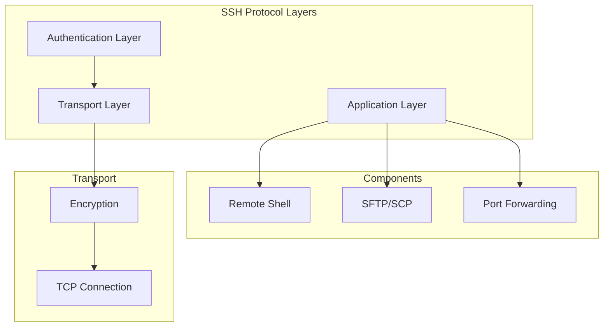
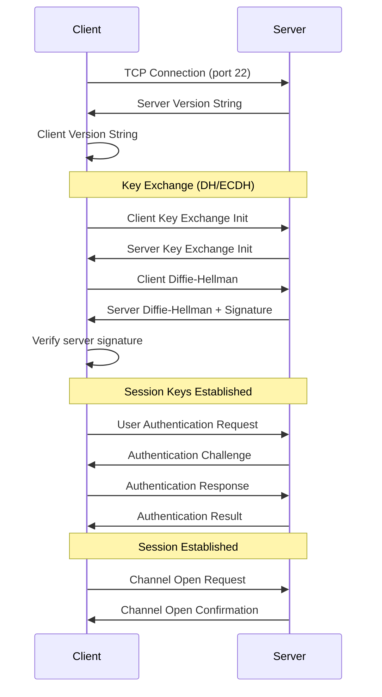
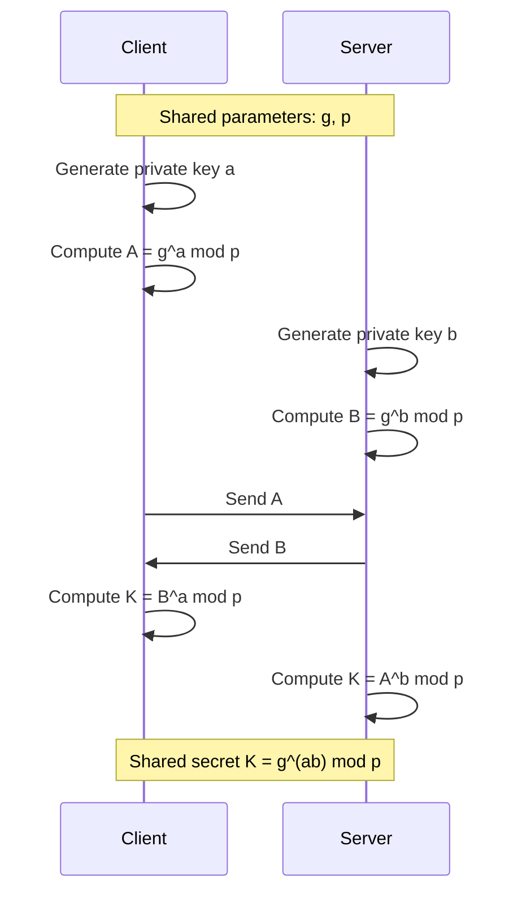
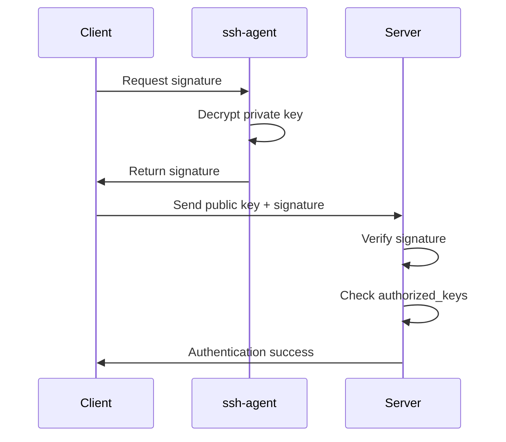

# SSH: Secure Shell

## Introduction

SSH (Secure Shell) is a cryptographic network protocol for secure communication over an unsecured network. It provides encrypted remote shell access, file transfer, and tunneling capabilities. SSH replaced insecure protocols like Telnet and rlogin, becoming the standard for remote server administration.

This chapter covers SSH architecture, key exchange, authentication methods, configuration, and advanced features like port forwarding and agent forwarding.

## SSH Architecture

### Protocol Layers

SSH operates in three layers:



### SSH Connection Process



## Key Exchange

### Diffie-Hellman Key Exchange

SSH uses Diffie-Hellman (DH) or Elliptic Curve Diffie-Hellman (ECDH) for key exchange:



### Modern Key Exchange Algorithms

| Algorithm | Key Size | Security Level | Status |
|-----------|----------|----------------|--------|
| `curve25519-sha256` | 256-bit | High | Recommended |
| `ecdh-sha2-nistp256` | 256-bit | High | Good |
| `ecdh-sha2-nistp384` | 384-bit | High | Good |
| `diffie-hellman-group16-sha512` | 4096-bit | High | Good |
| `diffie-hellman-group14-sha256` | 2048-bit | Medium | Acceptable |
| `diffie-hellman-group1-sha1` | 1024-bit | Low | Deprecated |

### Server Host Keys

The server proves its identity using host keys:

```bash
# View server host key fingerprints
$ ssh-keygen -lf /etc/ssh/ssh_host_ed25519_key.pub
256 SHA256:abc123... root@server (ED25519)

$ ssh-keygen -lf /etc/ssh/ssh_host_rsa_key.pub
3072 SHA256:def456... root@server (RSA)
```

## Authentication Methods

### Password Authentication

```bash
# Connect with password
$ ssh user@server
user@server's password: ****

# Disable password authentication (server-side)
# /etc/ssh/sshd_config
PasswordAuthentication no
```

### Public Key Authentication



#### Generating Key Pairs

```bash
# Generate Ed25519 key (recommended)
$ ssh-keygen -t ed25519 -C "user@example.com"
Generating public/private ed25519 key pair.
Enter file in which to save the key (/home/user/.ssh/id_ed25519):
Enter passphrase (empty for no passphrase):
Enter same passphrase again:
Your identification has been saved in /home/user/.ssh/id_ed25519
Your public key has been saved in /home/user/.ssh/id_ed25519.pub

# Generate RSA key (4096 bits)
$ ssh-keygen -t rsa -b 4096 -C "user@example.com"

# Generate ECDSA key
$ ssh-keygen -t ecdsa -b 521 -C "user@example.com"
```

#### Key Types Comparison

| Type | Key Size | Security | Performance | Status |
|------|----------|----------|-------------|--------|
| Ed25519 | 256-bit | Very High | Fast | Recommended |
| RSA | 3072+ bits | High | Slower | Good |
| ECDSA | 256/384/521-bit | High | Fast | Good |
| DSA | 1024-bit | Low | — | Deprecated |

#### Deploying Public Keys

```bash
# Copy public key to server
$ ssh-copy-id user@server
/usr/bin/ssh-copy-id: INFO: attempting to log in with the new key(s)
/usr/bin/ssh-copy-id: INFO: 1 key(s) installed are now installed
Number of key(s) added: 1

# Manual deployment
$ cat ~/.ssh/id_ed25519.pub | ssh user@server "mkdir -p ~/.ssh && cat >> ~/.ssh/authorized_keys"

# Set correct permissions
$ chmod 700 ~/.ssh
$ chmod 600 ~/.ssh/authorized_keys
```

### SSH Agent

ssh-agent manages private keys in memory:

```bash
# Start ssh-agent
$ eval $(ssh-agent)
Agent pid 12345

# Add key to agent
$ ssh-add ~/.ssh/id_ed25519
Enter passphrase for /home/user/.ssh/id_ed25519:
Identity added: /home/user/.ssh/id_ed25519 (user@example.com)

# List keys in agent
$ ssh-add -l
256 SHA256:abc123 user@example.com (ED25519)

# Remove all keys
$ ssh-add -D

# Use agent forwarding
$ ssh -A user@server
```

### Certificate-Based Authentication

SSH certificates provide scalable authentication:

```bash
# Generate CA key
$ ssh-keygen -t ed25519 -f ca_key -C "SSH CA"

# Sign a user key
$ ssh-keygen -s ca_key -I "user@example.com" \
    -n user -V +52w ~/.ssh/id_ed25519.pub

# Sign a host key
$ ssh-keygen -s ca_key -I "server.example.com" \
    -h -V +52w /etc/ssh/ssh_host_ed25519_key.pub

# Configure client to trust CA
# ~/.ssh/known_hosts
@cert-authority *.example.com ssh-ed25519 AAAA...

# Configure server to accept certificates
# /etc/ssh/sshd_config
TrustedUserCAKeys /etc/ssh/ca_key.pub
```

## SSH Configuration

### Client Configuration

```bash
# ~/.ssh/config
Host *
    ServerAliveInterval 60
    ServerAliveCountMax 3
    AddKeysToAgent yes
    IdentityFile ~/.ssh/id_ed25519

Host server1
    HostName 192.168.1.10
    User admin
    Port 22
    IdentityFile ~/.ssh/server1_key

Host server2
    HostName server2.example.com
    User deploy
    Port 2222
    ProxyJump bastion.example.com

Host bastion
    HostName bastion.example.com
    User admin
    DynamicForward 1080

Host *.internal.example.com
    ProxyJump bastion.example.com
    User admin
```

### Server Configuration

```bash
# /etc/ssh/sshd_config
Port 22
AddressFamily inet
ListenAddress 0.0.0.0

# Authentication
PermitRootLogin no
PubkeyAuthentication yes
PasswordAuthentication no
PermitEmptyPasswords no
ChallengeResponseAuthentication no

# Security
MaxAuthTries 3
MaxSessions 10
LoginGraceTime 60

# Allow specific users
AllowUsers admin deploy
AllowGroups sshusers

# Logging
SyslogFacility AUTH
LogLevel VERBOSE

# Session
ClientAliveInterval 300
ClientAliveCountMax 2
TCPKeepAlive yes

# SFTP subsystem
Subsystem sftp /usr/lib/openssh/sftp-server
```

### Applying Configuration

```bash
# Validate configuration
$ sudo sshd -t

# Reload configuration
$ sudo systemctl reload sshd

# Check configuration
$ sudo sshd -T

# View effective configuration for a host
$ ssh -G server1
```

## SSH Tunneling

### Local Port Forwarding

Forward a local port to a remote service:


```bash
# Forward local port 8080 to remote port 80
$ ssh -L 8080:localhost:80 user@server

# Forward to a different host through SSH server
$ ssh -L 8080:internal-server:80 user@bastion

# Bind to specific interface
$ ssh -L 0.0.0.0:8080:localhost:80 user@server

# Background mode
$ ssh -f -N -L 8080:localhost:80 user@server
```

### Remote Port Forwarding

Forward a remote port to a local service:


```bash
# Forward remote port 8080 to local port 3000
$ ssh -R 8080:localhost:3000 user@server

# Allow remote to bind to external interfaces
$ ssh -R 0.0.0.0:8080:localhost:3000 user@server

# Gateway ports (server config)
# /etc/ssh/sshd_config
GatewayPorts yes
```

### Dynamic Port Forwarding (SOCKS Proxy)

Create a SOCKS proxy:

```bash
# Create SOCKS5 proxy on local port 1080
$ ssh -D 1080 user@server

# Background mode
$ ssh -f -N -D 1080 user@server

# Use with curl
$ curl --socks5-hostname localhost:1080 https://example.com

# Use with browser (Firefox)
# Settings → Network → Manual Proxy → SOCKS Host: localhost, Port: 1080
```

### SSH ProxyJump

Jump through intermediate hosts:

```bash
# Direct proxy jump
$ ssh -J bastion.example.com user@internal-server

# Multiple jumps
$ ssh -J bastion1.example.com,bastion2.example.com user@internal-server

# Using config
# ~/.ssh/config
Host internal
    HostName internal-server.example.com
    ProxyJump bastion.example.com
```

### SSH ProxyCommand

Use older proxy method:

```bash
# Using netcat
$ ssh -o ProxyCommand="ssh bastion nc %h %p" user@internal-server

# Using socat
$ ssh -o ProxyCommand="ssh bastion socat - TCP:%h:%p" user@internal-server
```

## File Transfer

### SCP (Secure Copy)

```bash
# Copy file to remote
$ scp file.txt user@server:/path/to/destination/

# Copy file from remote
$ scp user@server:/path/to/file.txt ./

# Copy directory recursively
$ scp -r directory/ user@server:/path/to/destination/

# Copy with specific port
$ scp -P 2222 file.txt user@server:/path/

# Copy between two remote servers
$ scp user1@server1:/path/file.txt user2@server2:/path/
```

### SFTP (SSH File Transfer Protocol)

```bash
# Start SFTP session
$ sftp user@server

# SFTP commands
sftp> ls                    # List remote files
sftp> lls                   # List local files
sftp> cd /path              # Change remote directory
sftp> lcd /path             # Change local directory
sftp> get file.txt          # Download file
sftp> put file.txt          # Upload file
sftp> get -r directory/     # Download directory
sftp> put -r directory/     # Upload directory
sftp> mkdir dirname         # Create remote directory
sftp> rm file.txt           # Delete remote file
sftp> exit                  # Exit SFTP
```

### rsync over SSH

```bash
# Sync directory to remote
$ rsync -avz -e ssh /local/path/ user@server:/remote/path/

# Sync from remote
$ rsync -avz -e ssh user@server:/remote/path/ /local/path/

# Dry run (show what would be transferred)
$ rsync -avzn -e ssh /local/path/ user@server:/remote/path/

# Exclude patterns
$ rsync -avz -e ssh --exclude='*.log' /local/path/ user@server:/remote/path/

# Delete files not in source
$ rsync -avz -e ssh --delete /local/path/ user@server:/remote/path/
```

## SSH Security Best Practices

### Server Hardening

```bash
# /etc/ssh/sshd_config
# Disable root login
PermitRootLogin no

# Use only SSH protocol 2
Protocol 2

# Disable password authentication
PasswordAuthentication no
ChallengeResponseAuthentication no

# Limit users and groups
AllowUsers admin deploy
AllowGroups sshusers

# Strong algorithms
KexAlgorithms curve25519-sha256,curve25519-sha256@libssh.org
Ciphers chacha20-poly1305@openssh.com,aes256-gcm@openssh.com
MACs hmac-sha2-512-etm@openssh.com,hmac-sha2-256-etm@openssh.com
HostKeyAlgorithms ssh-ed25519,rsa-sha2-512,rsa-sha2-256

# Rate limiting
MaxStartups 10:30:60
MaxAuthTries 3
LoginGraceTime 30

# Logging
LogLevel VERBOSE
```

### Fail2Ban Integration

```bash
# Install fail2ban
$ sudo apt install fail2ban

# Configure SSH jail
# /etc/fail2ban/jail.local
[sshd]
enabled = true
port = ssh
filter = sshd
logpath = /var/log/auth.log
maxretry = 3
bantime = 3600
findtime = 600

# Start fail2ban
$ sudo systemctl start fail2ban

# Check banned IPs
$ sudo fail2ban-client status sshd
```

### Port Knocking

```bash
# Install knockd
$ sudo apt install knockd

# Configure /etc/knockd.conf
[options]
    logfile = /var/log/knockd.log

[openSSH]
    sequence    = 7000,8000,9000
    seq_timeout = 10
    command     = /sbin/iptables -A INPUT -s %IP% -p tcp --dport 22 -j ACCEPT
    tcpflags    = syn

[closeSSH]
    sequence    = 9000,8000,7000
    seq_timeout = 10
    command     = /sbin/iptables -D INPUT -s %IP% -p tcp --dport 22 -j ACCEPT
    tcpflags    = syn

# Knock sequence
$ knock server 7000 8000 9000
$ ssh user@server
```

## SSH Multiplexing

### ControlMaster

Reuse SSH connections:

```bash
# ~/.ssh/config
Host *
    ControlMaster auto
    ControlPath ~/.ssh/sockets/%r@%h-%p
    ControlPersist 600

# Create socket directory
$ mkdir -p ~/.ssh/sockets

# First connection creates the socket
$ ssh user@server

# Subsequent connections reuse it (instant)
$ ssh user@server
$ scp file.txt user@server:/path/
$ sftp user@server
```

## Troubleshooting SSH

### Verbose Mode

```bash
# Level 1 verbosity
$ ssh -v user@server

# Level 2 verbosity
$ ssh -vv user@server

# Level 3 verbosity (maximum)
$ ssh -vvv user@server
```

### Common Issues

```bash
# Permission denied (publickey)
$ chmod 700 ~/.ssh
$ chmod 600 ~/.ssh/id_ed25519
$ chmod 644 ~/.ssh/id_ed25519.pub
$ chmod 600 ~/.ssh/authorized_keys

# Host key verification failed
$ ssh-keygen -R server
$ ssh-keygen -f ~/.ssh/known_hosts -R server

# Connection refused
$ sudo systemctl status sshd
$ sudo netstat -tlnp | grep 22

# Connection timeout
$ ping server
$ telnet server 22
```

### Debugging Server-Side

```bash
# Run sshd in debug mode
$ sudo /usr/sbin/sshd -d

# Check auth logs
$ sudo journalctl -u sshd -f
$ sudo tail -f /var/log/auth.log
```

## References

- [The Linux Kernel Documentation](https://docs.kernel.org/)
- [LWN.net - Linux and free software news](https://lwn.net/)
- [GNU Project Documentation](https://www.gnu.org/doc/doc.html)
- [GNU Manuals](https://www.gnu.org/manual/manual.html)
- [Free Software Directory](https://directory.fsf.org/wiki/Main_Page)
- [Planet GNU](https://planet.gnu.org/)
- [Free Software Books](https://www.gnu.org/doc/other-free-books.html)

1. **RFC 4251** — The Secure Shell (SSH) Protocol Architecture
2. **RFC 4252** — The Secure Shell (SSH) Authentication Protocol
3. **RFC 4253** — The Secure Shell (SSH) Transport Layer Protocol
4. **RFC 4254** — The Secure Shell (SSH) Connection Protocol
5. **OpenSSH Documentation** — [www.openssh.com/manual.html](https://www.openssh.com/manual.html)
6. *SSH, The Secure Shell: The Definitive Guide* by Daniel Barrett et al.

## Related Topics

- [Network Fundamentals](fundamentals.md) — OSI model and network basics
- [TLS](tls.md) — Transport Layer Security
- [DNS](dns.md) — Domain Name System
- [TCP/IP Suite](tcpip-suite.md) — TCP/IP protocol details
