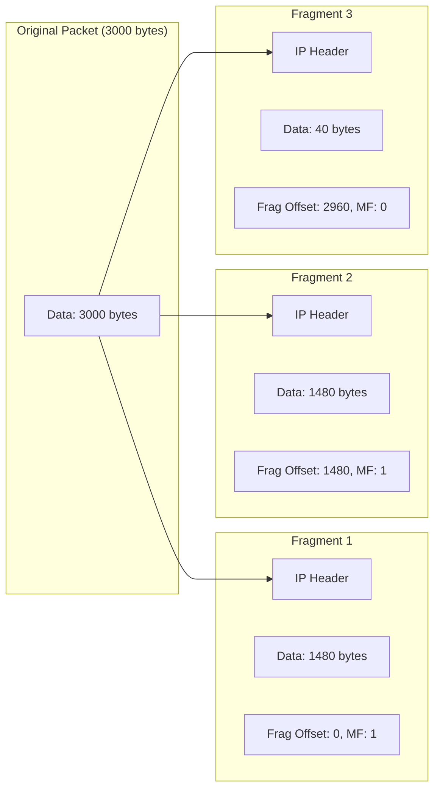
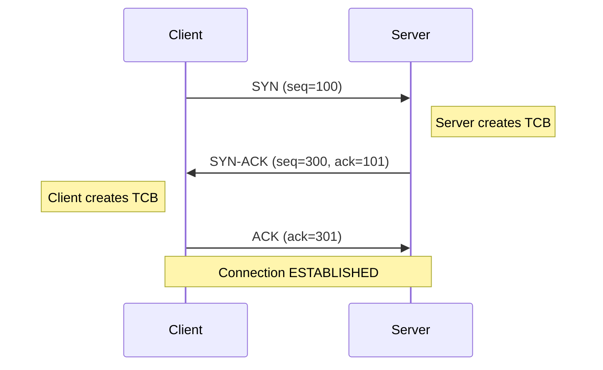
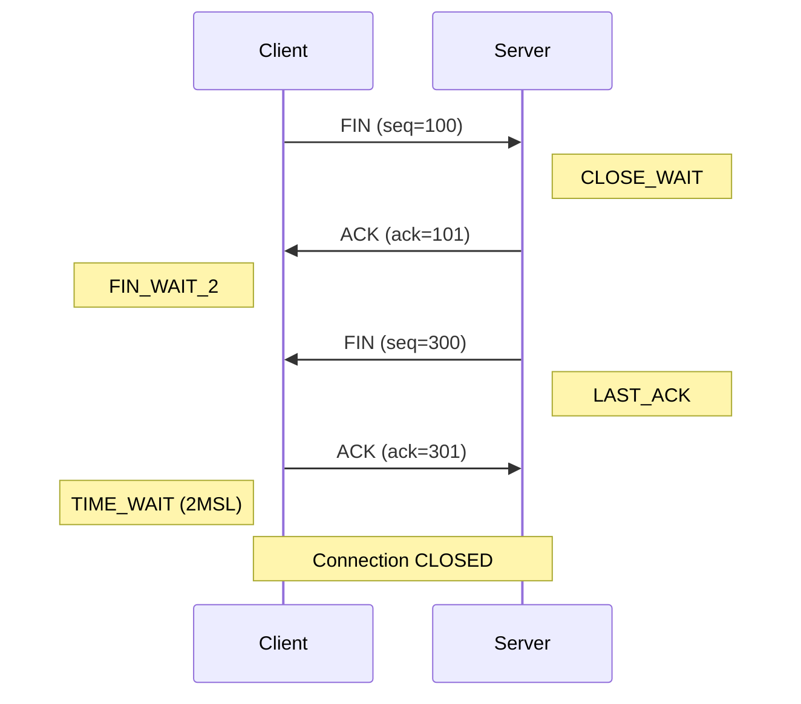
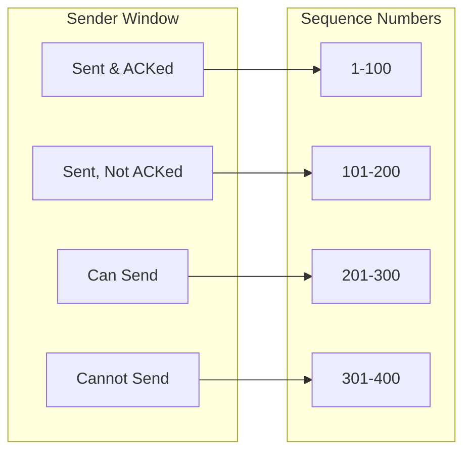
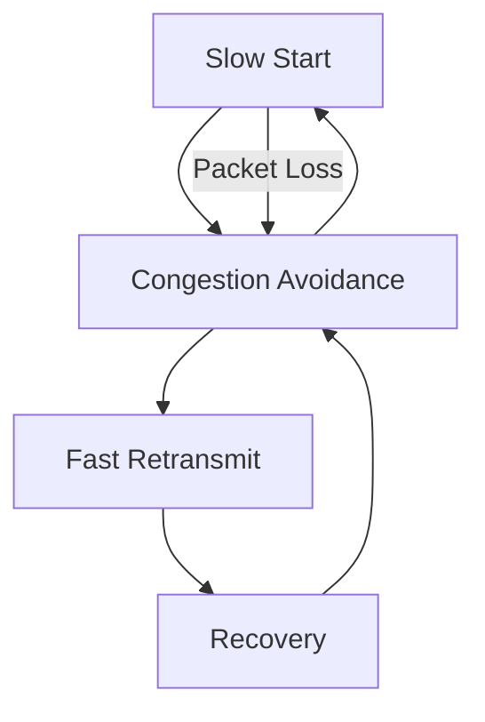
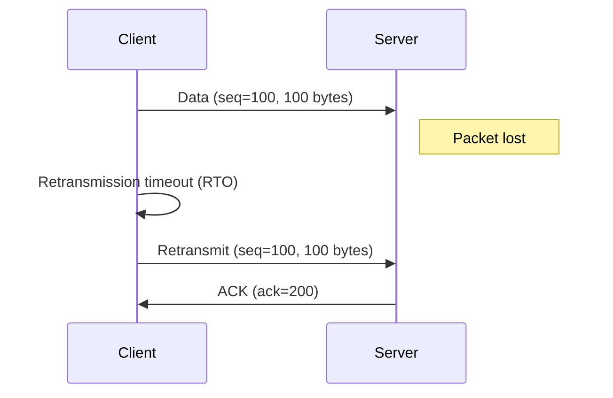
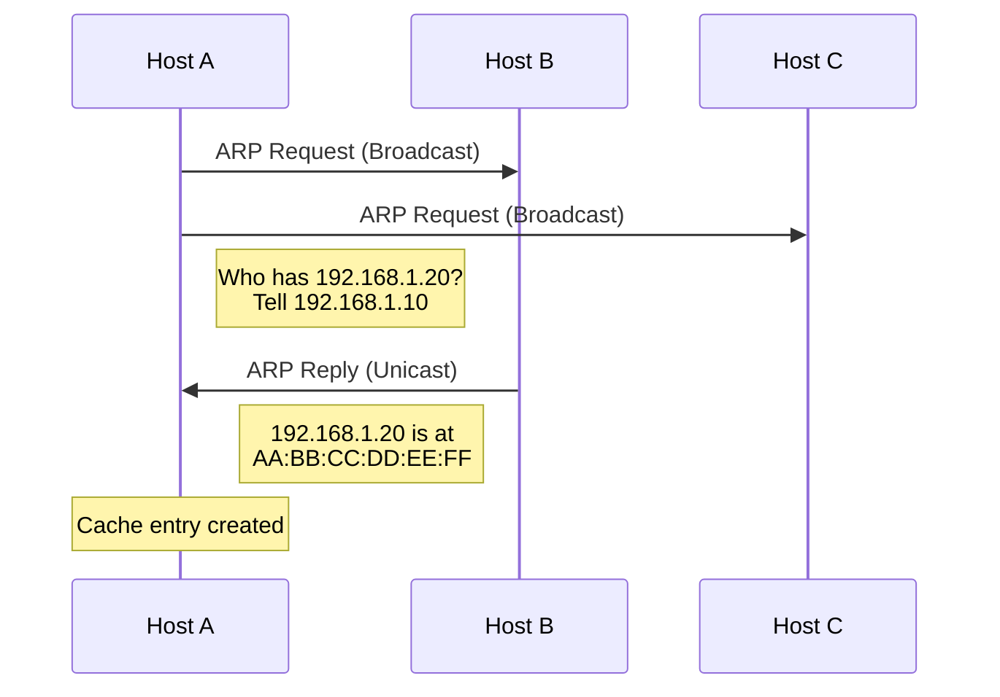
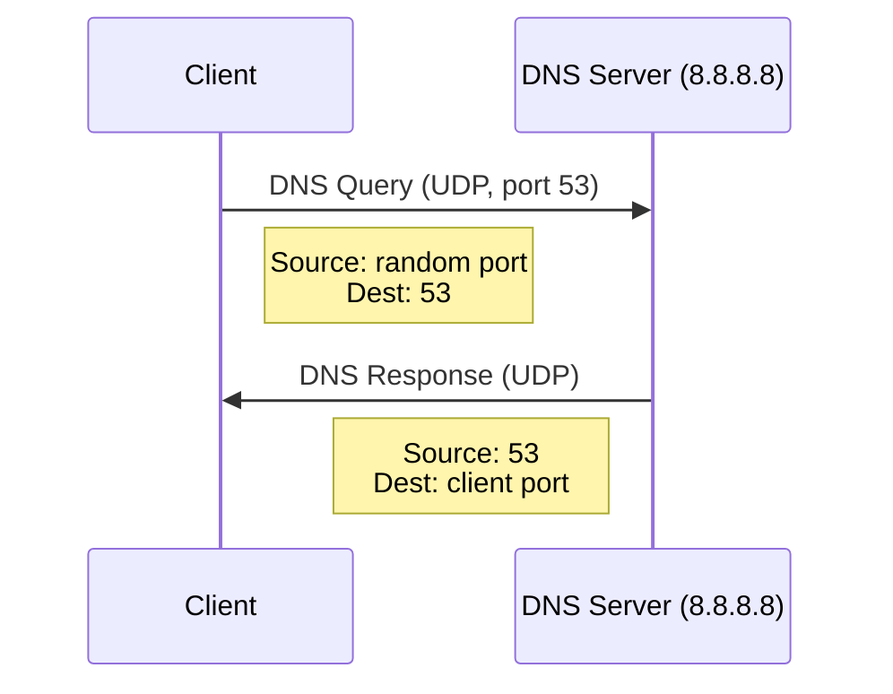
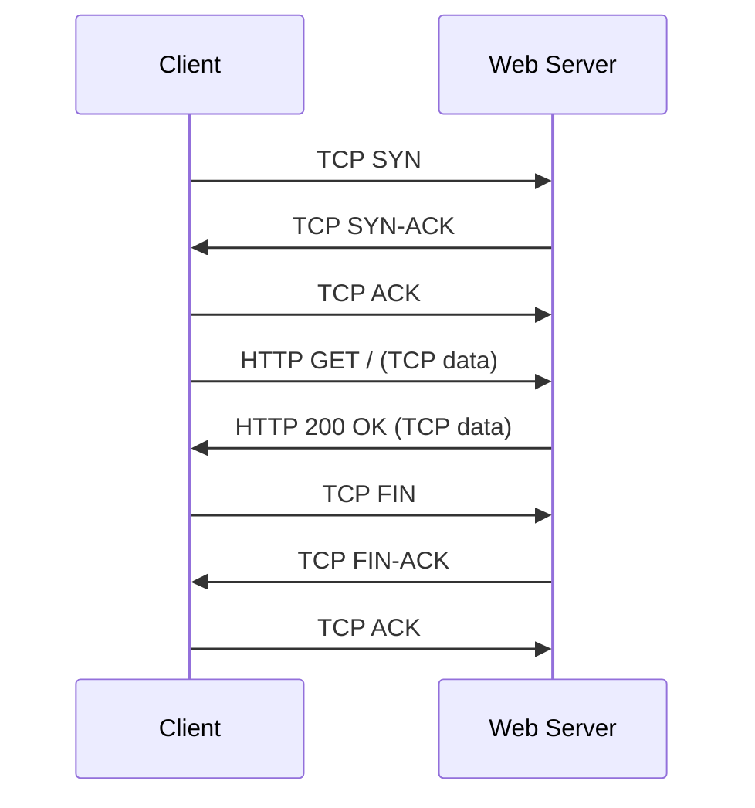
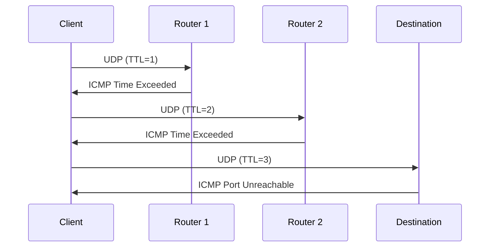

# TCP/IP Suite Deep Dive

## Introduction

The TCP/IP protocol suite is the foundation of modern networking. This chapter provides a deep dive into the core protocols — IP, TCP, UDP, ICMP, and ARP — examining their packet formats, operations, and how they interact to enable reliable network communication.

## Internet Protocol (IP)

### IPv4 Header

The IPv4 header is 20-60 bytes long:

```
 0                   1                   2                   3
 0 1 2 3 4 5 6 7 8 9 0 1 2 3 4 5 6 7 8 9 0 1 2 3 4 5 6 7 8 9 0 1
+-+-+-+-+-+-+-+-+-+-+-+-+-+-+-+-+-+-+-+-+-+-+-+-+-+-+-+-+-+-+-+-+
|Version|  IHL  |Type of Service|          Total Length         |
+-+-+-+-+-+-+-+-+-+-+-+-+-+-+-+-+-+-+-+-+-+-+-+-+-+-+-+-+-+-+-+-+
|         Identification        |Flags|      Fragment Offset    |
+-+-+-+-+-+-+-+-+-+-+-+-+-+-+-+-+-+-+-+-+-+-+-+-+-+-+-+-+-+-+-+-+
|  Time to Live |    Protocol   |         Header Checksum       |
+-+-+-+-+-+-+-+-+-+-+-+-+-+-+-+-+-+-+-+-+-+-+-+-+-+-+-+-+-+-+-+-+
|                       Source Address                          |
+-+-+-+-+-+-+-+-+-+-+-+-+-+-+-+-+-+-+-+-+-+-+-+-+-+-+-+-+-+-+-+-+
|                    Destination Address                        |
+-+-+-+-+-+-+-+-+-+-+-+-+-+-+-+-+-+-+-+-+-+-+-+-+-+-+-+-+-+-+-+-+
|                    Options                    |    Padding    |
+-+-+-+-+-+-+-+-+-+-+-+-+-+-+-+-+-+-+-+-+-+-+-+-+-+-+-+-+-+-+-+-+
```

**Key fields:**

| Field | Bits | Description |
|-------|------|-------------|
| Version | 4 | IP version (4 for IPv4) |
| IHL | 4 | Internet Header Length (in 32-bit words) |
| Type of Service | 8 | QoS and ECN flags |
| Total Length | 16 | Total packet size in bytes |
| Identification | 16 | Fragment identification |
| Flags | 3 | DF (Don't Fragment), MF (More Fragments) |
| Fragment Offset | 13 | Fragment position in original packet |
| Time to Live | 8 | Hop limit (decremented at each router) |
| Protocol | 8 | Transport protocol (6=TCP, 17=UDP, 1=ICMP) |
| Header Checksum | 16 | Header integrity check |

### IP Fragmentation

When a packet exceeds the MTU (Maximum Transmission Unit), it must be fragmented:



```bash
# Check MTU of interface
$ ip link show eth0 | grep mtu
2: eth0: <BROADCAST,MULTICAST,UP,LOWER_UP> mtu 1500

# Set MTU
$ sudo ip link set eth0 mtu 9000

# Path MTU Discovery
$ ping -c 4 -M do -s 1472 8.8.8.8
PING 8.8.8.8 (8.8.8.8) 1472(1500) bytes of data.
1480 bytes from 8.8.8.8: icmp_seq=1 ttl=117 time=5.43 ms
```

### IPv6 Header

IPv6 simplifies the header to a fixed 40 bytes:

```
+-+-+-+-+-+-+-+-+-+-+-+-+-+-+-+-+-+-+-+-+-+-+-+-+-+-+-+-+-+-+-+-+
|Version| Traffic Class |           Flow Label                  |
+-+-+-+-+-+-+-+-+-+-+-+-+-+-+-+-+-+-+-+-+-+-+-+-+-+-+-+-+-+-+-+-+
|         Payload Length        |  Next Header  |   Hop Limit   |
+-+-+-+-+-+-+-+-+-+-+-+-+-+-+-+-+-+-+-+-+-+-+-+-+-+-+-+-+-+-+-+-+
|                                                               |
+                                                               +
|                                                               |
+                         Source Address                        +
|                                                               |
+                                                               +
|                                                               |
+-+-+-+-+-+-+-+-+-+-+-+-+-+-+-+-+-+-+-+-+-+-+-+-+-+-+-+-+-+-+-+-+
|                                                               |
+                                                               +
|                                                               |
+                      Destination Address                      +
|                                                               |
+                                                               +
|                                                               |
+-+-+-+-+-+-+-+-+-+-+-+-+-+-+-+-+-+-+-+-+-+-+-+-+-+-+-+-+-+-+-+-+
```

## Transmission Control Protocol (TCP)

### TCP Header

The TCP header is 20-60 bytes:

```
 0                   1                   2                   3
 0 1 2 3 4 5 6 7 8 9 0 1 2 3 4 5 6 7 8 9 0 1 2 3 4 5 6 7 8 9 0 1
+-+-+-+-+-+-+-+-+-+-+-+-+-+-+-+-+-+-+-+-+-+-+-+-+-+-+-+-+-+-+-+-+
|          Source Port          |       Destination Port        |
+-+-+-+-+-+-+-+-+-+-+-+-+-+-+-+-+-+-+-+-+-+-+-+-+-+-+-+-+-+-+-+-+
|                        Sequence Number                        |
+-+-+-+-+-+-+-+-+-+-+-+-+-+-+-+-+-+-+-+-+-+-+-+-+-+-+-+-+-+-+-+-+
|                    Acknowledgment Number                      |
+-+-+-+-+-+-+-+-+-+-+-+-+-+-+-+-+-+-+-+-+-+-+-+-+-+-+-+-+-+-+-+-+
|  Data |       |C|E|U|A|P|R|S|F|                               |
| Offset| Rsrvd |W|C|R|C|S|S|Y|I|            Window             |
|       |       |R|E|G|K|H|T|N|N|                               |
+-+-+-+-+-+-+-+-+-+-+-+-+-+-+-+-+-+-+-+-+-+-+-+-+-+-+-+-+-+-+-+-+
|           Checksum            |         Urgent Pointer        |
+-+-+-+-+-+-+-+-+-+-+-+-+-+-+-+-+-+-+-+-+-+-+-+-+-+-+-+-+-+-+-+-+
|                    Options                    |    Padding    |
+-+-+-+-+-+-+-+-+-+-+-+-+-+-+-+-+-+-+-+-+-+-+-+-+-+-+-+-+-+-+-+-+
```

### TCP Three-Way Handshake



### TCP Four-Way Teardown



### TCP Flags

| Flag | Bit | Description |
|------|-----|-------------|
| CWR | 0 | Congestion Window Reduced |
| ECE | 1 | ECN-Echo |
| URG | 2 | Urgent pointer valid |
| ACK | 3 | Acknowledgment number valid |
| PSH | 4 | Push data to application |
| RST | 5 | Reset connection |
| SYN | 6 | Synchronize sequence numbers |
| FIN | 7 | End of data |

### TCP Flow Control

TCP uses a sliding window for flow control:



**Window scaling** allows windows larger than 65,535 bytes:

```bash
# Check window scaling
$ sysctl net.ipv4.tcp_window_scaling
net.ipv4.tcp_window_scaling = 1

# View current window size
$ ss -t -i | grep -o 'wscale:[^ ]*'
wscale:7,7
```

### TCP Congestion Control

TCP congestion control prevents network congestion:



**Algorithms:**

- **Reno**: Classic algorithm with fast retransmit and recovery
- **CUBIC**: Default in Linux, cubic growth function
- **BBR**: Bottleneck bandwidth and RTT-based

```bash
# Check current congestion control
$ sysctl net.ipv4.tcp_congestion_control
net.ipv4.tcp_congestion_control = cubic

# Change to BBR
$ sudo sysctl -w net.ipv4.tcp_congestion_control=bbr

# Load BBR module
$ sudo modprobe tcp_bbr
```

### TCP Retransmission

TCP retransmits lost packets:



```bash
# Check retransmission statistics
$ nstat | grep -i retrans
TcpRetransSegs    123    0.0
TcpExtTCPSlowStartRetrans    45    0.0

# Monitor retransmissions in real-time
$ ss -t -i | grep -i retrans
```

## User Datagram Protocol (UDP)

### UDP Header

The UDP header is a fixed 8 bytes:

```
 0                   1                   2                   3
 0 1 2 3 4 5 6 7 8 9 0 1 2 3 4 5 6 7 8 9 0 1 2 3 4 5 6 7 8 9 0 1
+-+-+-+-+-+-+-+-+-+-+-+-+-+-+-+-+-+-+-+-+-+-+-+-+-+-+-+-+-+-+-+-+
|          Source Port          |       Destination Port        |
+-+-+-+-+-+-+-+-+-+-+-+-+-+-+-+-+-+-+-+-+-+-+-+-+-+-+-+-+-+-+-+-+
|            Length             |           Checksum            |
+-+-+-+-+-+-+-+-+-+-+-+-+-+-+-+-+-+-+-+-+-+-+-+-+-+-+-+-+-+-+-+-+
```

### UDP Characteristics

- **Connectionless**: No handshake or teardown
- **Unreliable**: No delivery guarantee
- **No ordering**: Packets may arrive out of order
- **Message-oriented**: Preserves message boundaries
- **Low overhead**: 8-byte header vs TCP's 20+ bytes

### UDP Use Cases

| Application | Why UDP? |
|-------------|----------|
| DNS | Small queries, quick response |
| DHCP | Broadcast, no connection |
| VoIP | Low latency, tolerates loss |
| Video streaming | Real-time, tolerates loss |
| Gaming | Low latency critical |
| SNMP | Simple queries |

## ICMP (Internet Control Message Protocol)

### ICMP Header

```
 0                   1                   2                   3
 0 1 2 3 4 5 6 7 8 9 0 1 2 3 4 5 6 7 8 9 0 1 2 3 4 5 6 7 8 9 0 1
+-+-+-+-+-+-+-+-+-+-+-+-+-+-+-+-+-+-+-+-+-+-+-+-+-+-+-+-+-+-+-+-+
|     Type      |      Code     |          Checksum             |
+-+-+-+-+-+-+-+-+-+-+-+-+-+-+-+-+-+-+-+-+-+-+-+-+-+-+-+-+-+-+-+-+
|                     Rest of Header                            |
+-+-+-+-+-+-+-+-+-+-+-+-+-+-+-+-+-+-+-+-+-+-+-+-+-+-+-+-+-+-+-+-+
```

### ICMP Message Types

| Type | Name | Description |
|------|------|-------------|
| 0 | Echo Reply | Ping response |
| 3 | Destination Unreachable | Various error conditions |
| 4 | Source Quench | Congestion control (deprecated) |
| 5 | Redirect | Route change notification |
| 8 | Echo Request | Ping |
| 11 | Time Exceeded | TTL expired |

### Destination Unreachable Codes

| Code | Description |
|------|-------------|
| 0 | Network unreachable |
| 1 | Host unreachable |
| 2 | Protocol unreachable |
| 3 | Port unreachable |
| 4 | Fragmentation needed |
| 13 | Administratively prohibited |

## ARP (Address Resolution Protocol)

### ARP Packet Format

```
 0                   1                   2                   3
 0 1 2 3 4 5 6 7 8 9 0 1 2 3 4 5 6 7 8 9 0 1 2 3 4 5 6 7 8 9 0 1
+-+-+-+-+-+-+-+-+-+-+-+-+-+-+-+-+-+-+-+-+-+-+-+-+-+-+-+-+-+-+-+-+
|         Hardware Type         |         Protocol Type         |
+-+-+-+-+-+-+-+-+-+-+-+-+-+-+-+-+-+-+-+-+-+-+-+-+-+-+-+-+-+-+-+-+
|  HW Addr Len  | Proto Addr Len|           Operation          |
+-+-+-+-+-+-+-+-+-+-+-+-+-+-+-+-+-+-+-+-+-+-+-+-+-+-+-+-+-+-+-+-+
|                   Sender Hardware Address                     |
+                               +-+-+-+-+-+-+-+-+-+-+-+-+-+-+-+-+
|                               |     Sender Protocol Address   |
+-+-+-+-+-+-+-+-+-+-+-+-+-+-+-+-+-+-+-+-+-+-+-+-+-+-+-+-+-+-+-+-+
|                   Target Hardware Address                     |
+                               +-+-+-+-+-+-+-+-+-+-+-+-+-+-+-+-+
|                               |     Target Protocol Address   |
+-+-+-+-+-+-+-+-+-+-+-+-+-+-+-+-+-+-+-+-+-+-+-+-+-+-+-+-+-+-+-+-+
```

### ARP Operation



### ARP Cache Management

```bash
# View ARP cache
$ ip neigh show
192.168.1.1 dev eth0 lladdr 00:11:22:33:44:55 REACHABLE
192.168.1.20 dev eth0 lladdr AA:BB:CC:DD:EE:FF STALE

# ARP cache states
# PERMANENT - Static entry, never expires
# NOARP - No ARP resolution needed
# REACHABLE - Recently confirmed
# STALE - May be outdated
# DELAY - Waiting for upper-layer confirmation
# INCOMPLETE - ARP request sent, no reply yet
# FAILED - ARP resolution failed

# Add static entry
$ sudo ip neigh add 192.168.1.100 lladdr 00:11:22:33:44:55 dev eth0

# Delete entry
$ sudo ip neigh del 192.168.1.100 dev eth0

# Flush cache
$ sudo ip neigh flush all
```

## Protocol Interactions

### DNS over UDP



### HTTP over TCP



### Traceroute using ICMP and UDP



## Protocol Analysis with tcpdump

### Capturing Specific Protocols

```bash
# Capture TCP traffic
$ sudo tcpdump -i eth0 tcp

# Capture UDP traffic
$ sudo tcpdump -i eth0 udp

# Capture ICMP traffic
$ sudo tcpdump -i eth0 icmp

# Capture ARP traffic
$ sudo tcpdump -i eth0 arp

# Capture specific TCP flags
$ sudo tcpdump -i eth0 'tcp[tcpflags] & (tcp-syn) != 0'
$ sudo tcpdump -i eth0 'tcp[tcpflags] & (tcp-rst) != 0'

# Capture DNS queries
$ sudo tcpdump -i eth0 port 53
```

### Packet Dissection

```bash
# Verbose output with packet details
$ sudo tcpdump -i eth0 -vv -c 5 port 80

# Show hex dump
$ sudo tcpdump -i eth0 -X -c 5 port 80

# Show ASCII
$ sudo tcpdump -i eth0 -A -c 5 port 80
```

## Protocol Statistics

```bash
# View IP statistics
$ cat /proc/net/snmp | grep -A1 Ip

# View TCP statistics
$ cat /proc/net/snmp | grep -A1 Tcp

# View UDP statistics
$ cat /proc/net/snmp | grep -A1 Udp

# View ICMP statistics
$ cat /proc/net/snmp | grep -A1 Icmp

# Detailed TCP statistics
$ cat /proc/net/netstat | head -2
```

## References

- [The Linux Kernel Documentation](https://docs.kernel.org/)
- [LWN.net - Linux and free software news](https://lwn.net/)
- [GNU Project Documentation](https://www.gnu.org/doc/doc.html)
- [GNU Manuals](https://www.gnu.org/manual/manual.html)
- [Free Software Directory](https://directory.fsf.org/wiki/Main_Page)
- [Planet GNU](https://planet.gnu.org/)
- [Free Software Books](https://www.gnu.org/doc/other-free-books.html)

1. **RFC 791** — Internet Protocol
2. **RFC 793** — Transmission Control Protocol
3. **RFC 768** — User Datagram Protocol
4. **RFC 792** — Internet Control Message Protocol
5. **RFC 826** — Ethernet Address Resolution Protocol
6. **RFC 5681** — TCP Congestion Control
7. *TCP/IP Illustrated, Volume 1* by W. Richard Stevens
8. *TCP/IP Illustrated, Volume 2* by Gary R. Wright and W. Richard Stevens

## Related Topics

- [Network Fundamentals](fundamentals.md) — OSI model and network basics
- [DNS](dns.md) — Domain Name System
- [SSH](ssh.md) — Secure Shell
- [TLS](tls.md) — Transport Layer Security
- [Kernel TCP/IP Implementation](../kernel/networking/tcpip.md) — How the kernel implements TCP/IP
