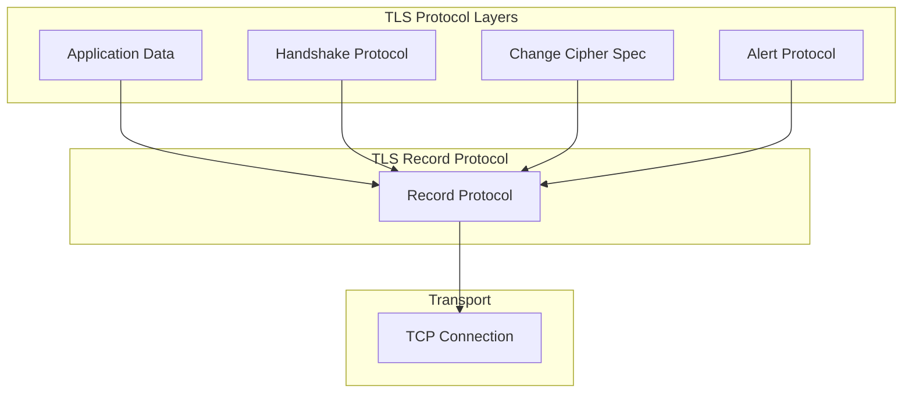
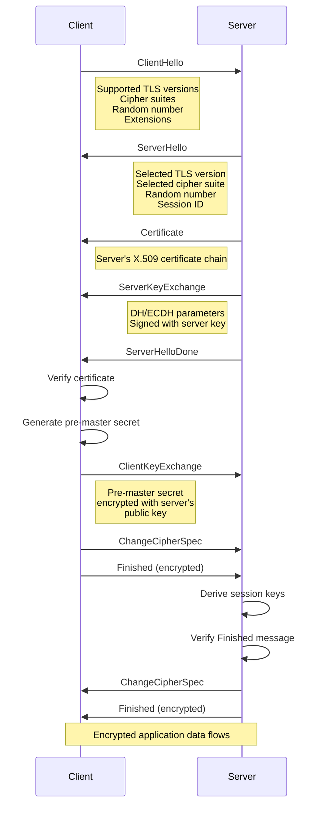
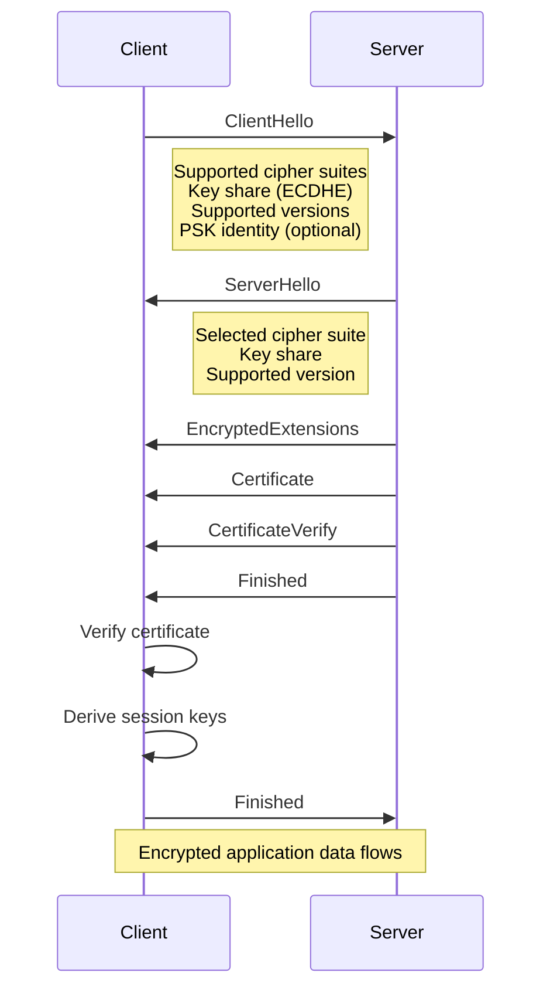
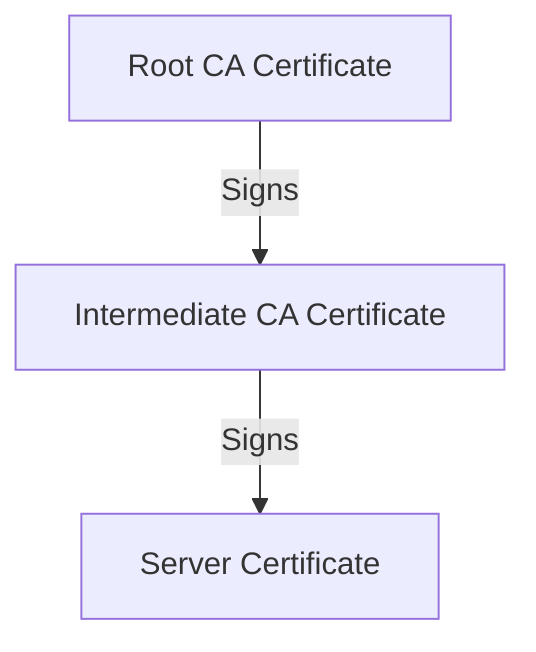
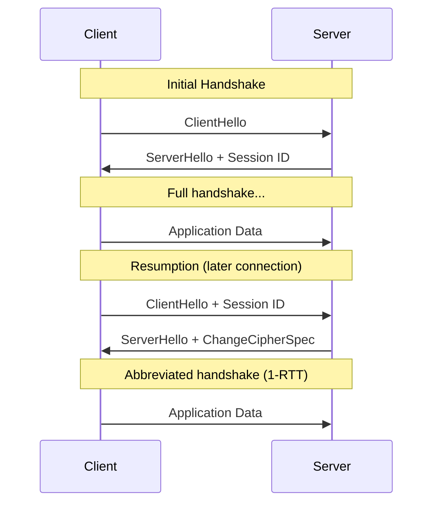
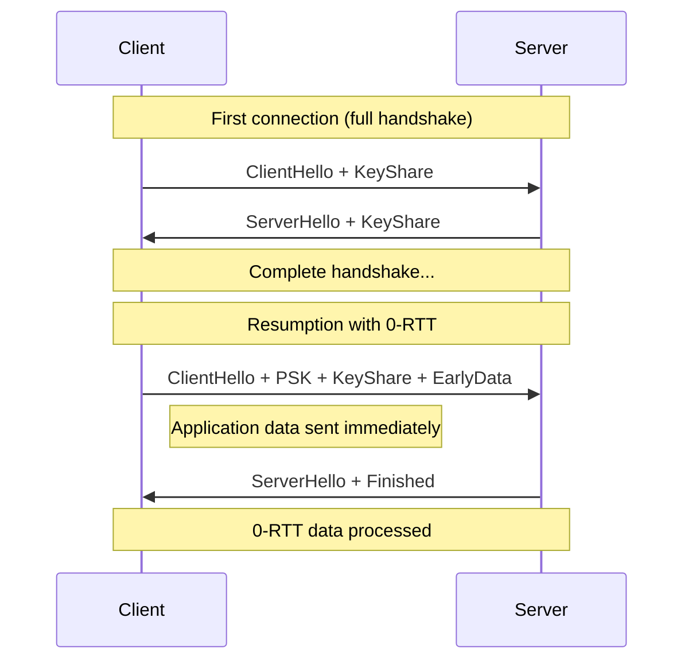

# TLS/SSL: Transport Layer Security

## Introduction

TLS (Transport Layer Security) and its predecessor SSL (Secure Sockets Layer) are cryptographic protocols that provide secure communication over a network. TLS is the foundation of HTTPS, secure email, VPNs, and many other applications. This chapter covers the TLS handshake, certificates, cipher suites, and practical OpenSSL usage.

## TLS Protocol Overview

### Protocol Stack



### TLS Versions

| Version | Year | Status | Key Features |
|---------|------|--------|--------------|
| SSL 2.0 | 1995 | Insecure | Deprecated |
| SSL 3.0 | 1996 | Insecure | Deprecated (POODLE) |
| TLS 1.0 | 1999 | Deprecated | RFC 2246 |
| TLS 1.1 | 2006 | Deprecated | RFC 4346 |
| TLS 1.2 | 2008 | Current | RFC 5246, AEAD ciphers |
| TLS 1.3 | 2018 | Recommended | RFC 8446, 0-RTT, faster handshake |

## TLS Handshake

### TLS 1.2 Handshake



### TLS 1.3 Handshake

TLS 1.3 simplifies the handshake to one round-trip:



**Key differences in TLS 1.3:**
- Only AEAD cipher suites
- No RSA key exchange (only (EC)DHE)
- 0-RTT resumption
- Encrypted certificate exchange
- Removed insecure features

## Certificates

### X.509 Certificate Structure

```
Certificate:
    Data:
        Version: 3 (0x2)
        Serial Number: 1234567890 (0x499602d2)
        Signature Algorithm: sha256WithRSAEncryption
        Issuer: CN = Let's Encrypt Authority X3, O = Let's Encrypt, C = US
        Validity
            Not Before: Jan  1 00:00:00 2024 GMT
            Not After : Mar 31 23:59:59 2024 GMT
        Subject: CN = example.com
        Subject Public Key Info:
            Public Key Algorithm: rsaEncryption
                RSA Public-Key: (2048 bit)
        X509v3 extensions:
            X509v3 Subject Alternative Name:
                DNS:example.com, DNS:www.example.com
            X509v3 Basic Constraints:
                CA:FALSE
            X509v3 Key Usage:
                Digital Signature, Key Encipherment
    Signature Algorithm: sha256WithRSAEncryption
```

### Certificate Chain



**Root CAs** are pre-installed in operating systems and browsers:
- Let's Encrypt
- DigiCert
- GlobalSign
- Comodo

### Let's Encrypt (ACME)

```bash
# Install certbot
$ sudo apt install certbot

# Obtain certificate (standalone)
$ sudo certbot certonly --standalone -d example.com -d www.example.com

# Using nginx plugin
$ sudo certbot --nginx -d example.com

# Using webroot
$ sudo certbot certonly --webroot -w /var/www/html -d example.com

# Certificate locations
/etc/letsencrypt/live/example.com/fullchain.pem   # Certificate + chain
/etc/letsencrypt/live/example.com/privkey.pem     # Private key
/etc/letsencrypt/live/example.com/cert.pem        # Certificate only
/etc/letsencrypt/live/example.com/chain.pem       # Chain only

# Auto-renewal
$ sudo certbot renew --dry-run
$ sudo systemctl enable certbot.timer
```

## Cipher Suites

### Cipher Suite Components

A cipher suite specifies four algorithms:

```
TLS_ECDHE_RSA_WITH_AES_256_GCM_SHA384
│    │      │      │      │   │    │
│    │      │      │      │   │    └─ PRF Hash
│    │      │      │      │   └─ AEAD Mode
│    │      │      │      └─ AES Key Size
│    │      │      └─ Symmetric Encryption
│    │      └─ Authentication
│    └─ Key Exchange
└─ Protocol
```

### TLS 1.2 Cipher Suites

| Suite | Key Exchange | Authentication | Encryption | Status |
|-------|--------------|----------------|------------|--------|
| `ECDHE-RSA-AES256-GCM-SHA384` | ECDHE | RSA | AES-256-GCM | Secure |
| `ECDHE-RSA-AES128-GCM-SHA256` | ECDHE | RSA | AES-128-GCM | Secure |
| `ECDHE-ECDSA-AES256-GCM-SHA384` | ECDHE | ECDSA | AES-256-GCM | Secure |
| `DHE-RSA-AES256-GCM-SHA384` | DHE | RSA | AES-256-GCM | Secure |
| `RSA-AES256-GCM-SHA384` | RSA | RSA | AES-256-GCM | Avoid |
| `ECDHE-RSA-AES256-SHA` | ECDHE | RSA | AES-256-CBC | Avoid |

### TLS 1.3 Cipher Suites

TLS 1.3 only supports five cipher suites:

```
TLS_AES_128_GCM_SHA256
TLS_AES_256_GCM_SHA384
TLS_CHACHA20_POLY1305_SHA256
TLS_AES_128_CCM_SHA256
TLS_AES_128_CCM_8_SHA256
```

## OpenSSL Commands

### Certificate Operations

```bash
# View certificate details
$ openssl x509 -in cert.pem -text -noout

# View certificate expiry
$ openssl x509 -in cert.pem -enddate -noout
notAfter=Mar 31 23:59:59 2024 GMT

# View certificate fingerprint
$ openssl x509 -in cert.pem -fingerprint -noout
SHA1 Fingerprint=AA:BB:CC:DD:EE:FF...

# Convert DER to PEM
$ openssl x509 -inform DER -in cert.der -out cert.pem

# Convert PEM to DER
$ openssl x509 -outform DER -in cert.pem -out cert.der

# Create PKCS12 bundle
$ openssl pkcs12 -export -in cert.pem -inkey key.pem -out bundle.p12
```

### Key Operations

```bash
# Generate RSA private key
$ openssl genrsa -out private.key 4096

# Generate EC private key
$ openssl ecparam -genkey -name prime256v1 -out ec_private.key

# Extract public key
$ openssl rsa -in private.key -pubout -out public.key

# View key details
$ openssl rsa -in private.key -text -noout

# Encrypt private key
$ openssl rsa -in private.key -aes256 -out private_enc.key

# Decrypt private key
$ openssl rsa -in private_enc.key -out private.key
```

### CSR (Certificate Signing Request)

```bash
# Generate CSR
$ openssl req -new -key private.key -out request.csr

# Generate CSR with subject
$ openssl req -new -key private.key -out request.csr \
    -subj "/C=US/ST=State/L=City/O=Organization/CN=example.com"

# Generate CSR with SAN
$ openssl req -new -key private.key -out request.csr \
    -config <(cat <<EOF
[req]
default_bits = 2048
prompt = no
default_md = sha256
distinguished_name = dn
req_extensions = v3_req

[dn]
C = US
ST = State
L = City
O = Organization
CN = example.com

[v3_req]
subjectAltName = @alt_names

[alt_names]
DNS.1 = example.com
DNS.2 = www.example.com
EOF
)

# Verify CSR
$ openssl req -in request.csr -text -noout

# Self-sign a certificate
$ openssl x509 -req -in request.csr -signkey private.key -out cert.pem -days 365
```

### TLS Connection Testing

```bash
# Test TLS connection
$ openssl s_client -connect example.com:443

# Test with specific TLS version
$ openssl s_client -connect example.com:443 -tls1_2
$ openssl s_client -connect example.com:443 -tls1_3

# Test with SNI
$ openssl s_client -connect example.com:443 -servername example.com

# Show certificate chain
$ openssl s_client -connect example.com:443 -showcerts

# Test STARTTLS
$ openssl s_client -connect mail.example.com:587 -starttls smtp

# Show session details
$ openssl s_client -connect example.com:443 -sess_out session.pem

# Resume session
$ openssl s_client -connect example.com:443 -sess_in session.pem
```

### Certificate Verification

```bash
# Verify certificate against CA bundle
$ openssl verify -CAfile ca-bundle.crt cert.pem

# Verify certificate chain
$ openssl verify -CAfile ca.pem -untrusted intermediate.pem cert.pem

# Check certificate matches private key
$ openssl x509 -noout -modulus -in cert.pem | openssl md5
$ openssl rsa -noout -modulus -in private.key | openssl md5

# Check certificate matches CSR
$ openssl req -noout -modulus -in request.csr | openssl md5
```

## TLS Configuration

### Nginx TLS Configuration

```nginx
# /etc/nginx/sites-available/example.com
server {
    listen 443 ssl http2;
    server_name example.com;

    # Certificate and key
    ssl_certificate /etc/letsencrypt/live/example.com/fullchain.pem;
    ssl_certificate_key /etc/letsencrypt/live/example.com/privkey.pem;

    # TLS version
    ssl_protocols TLSv1.2 TLSv1.3;

    # Cipher suites
    ssl_ciphers ECDHE-ECDSA-AES128-GCM-SHA256:ECDHE-RSA-AES128-GCM-SHA256:ECDHE-ECDSA-AES256-GCM-SHA384:ECDHE-RSA-AES256-GCM-SHA384;
    ssl_prefer_server_ciphers off;

    # OCSP Stapling
    ssl_stapling on;
    ssl_stapling_verify on;
    ssl_trusted_certificate /etc/letsencrypt/live/example.com/chain.pem;

    # Session caching
    ssl_session_cache shared:SSL:10m;
    ssl_session_timeout 1d;
    ssl_session_tickets off;

    # Security headers
    add_header Strict-Transport-Security "max-age=63072000; includeSubDomains; preload";
    add_header X-Content-Type-Options nosniff;
    add_header X-Frame-Options DENY;
}

# HTTP to HTTPS redirect
server {
    listen 80;
    server_name example.com;
    return 301 https://$host$request_uri;
}
```

### Apache TLS Configuration

```apache
# /etc/apache2/sites-available/example.com.conf
<VirtualHost *:443>
    ServerName example.com

    SSLEngine on
    SSLCertificateFile /etc/letsencrypt/live/example.com/cert.pem
    SSLCertificateKeyFile /etc/letsencrypt/live/example.com/privkey.pem
    SSLCertificateChainFile /etc/letsencrypt/live/example.com/chain.pem

    # TLS configuration
    SSLProtocol all -SSLv3 -TLSv1 -TLSv1.1
    SSLCipherSuite ECDHE-ECDSA-AES128-GCM-SHA256:ECDHE-RSA-AES128-GCM-SHA256:ECDHE-ECDSA-AES256-GCM-SHA384:ECDHE-RSA-AES256-GCM-SHA384
    SSLHonorCipherOrder off

    # OCSP Stapling
    SSLUseStapling on
    SSLStaplingCache "shmcb:logs/ssl_stapling(128000)"
</VirtualHost>
```

## Certificate Pinning

### HTTP Public Key Pinning (HPKP)

HPKP is deprecated but worth understanding:

```bash
# HPKP header (deprecated)
# Public-Key-Pins: pin-sha256="base64=="; max-age=5184000
```

### Certificate Transparency

```bash
# Check CT logs
$ curl -s "https://crt.sh/?q=example.com&output=json" | jq .

# Monitor CT logs for your domain
$ watch -n 3600 'curl -s "https://crt.sh/?q=example.com&output=json" | jq length'
```

### Expect-CT Header

```bash
# Expect-CT header
# Expect-CT: max-age=86400, enforce, report-uri="https://example.com/report"
```

## TLS Performance

### Session Resumption



### TLS 1.3 0-RTT



**Warning**: 0-RTT data is vulnerable to replay attacks.

## Troubleshooting TLS

### Common Issues

```bash
# Certificate expired
$ echo | openssl s_client -connect example.com:443 2>/dev/null | \
    openssl x509 -noout -dates
notBefore=Jan  1 00:00:00 2024 GMT
notAfter=Mar 31 23:59:59 2024 GMT

# Certificate name mismatch
$ echo | openssl s_client -connect example.com:443 2>/dev/null | \
    openssl x509 -noout -text | grep -A1 "Subject Alternative Name"

# Self-signed certificate
$ echo | openssl s_client -connect example.com:443 2>&1 | \
    grep "verify return code"

# Protocol version mismatch
$ openssl s_client -connect example.com:443 -tls1
```

### Debugging Commands

```bash
# Full TLS debug
$ openssl s_client -connect example.com:443 -debug

# Show all ciphers
$ openssl ciphers -v 'HIGH:!aNULL:!MD5'

# Test specific cipher
$ openssl s_client -connect example.com:443 -cipher ECDHE-RSA-AES256-GCM-SHA384

# Check OCSP response
$ openssl s_client -connect example.com:443 -status

# Test with specific SNI
$ openssl s_client -connect example.com:443 -servername example.com

# Using nmap
$ nmap --script ssl-enum-ciphers -p 443 example.com

# Using sslyze
$ sslyze --regular example.com
```

## Security Best Practices

### TLS Configuration Checklist

```bash
# 1. Use TLS 1.2 and 1.3 only
ssl_protocols TLSv1.2 TLSv1.3;

# 2. Use strong cipher suites
ssl_ciphers ECDHE-ECDSA-AES128-GCM-SHA256:ECDHE-RSA-AES128-GCM-SHA256:ECDHE-ECDSA-AES256-GCM-SHA384:ECDHE-RSA-AES256-GCM-SHA384;

# 3. Enable HSTS
add_header Strict-Transport-Security "max-age=63072000; includeSubDomains; preload";

# 4. Enable OCSP Stapling
ssl_stapling on;
ssl_stapling_verify on;

# 5. Disable session tickets (for forward secrecy)
ssl_session_tickets off;

# 6. Use strong DH parameters
ssl_dhparam /etc/ssl/dhparam.pem;
```

### Generate DH Parameters

```bash
# Generate strong DH parameters
$ openssl dhparam -out /etc/ssl/dhparam.pem 4096
```

## References

1. **RFC 8446** — The Transport Layer Security (TLS) Protocol Version 1.3
2. **RFC 5246** — The Transport Layer Security (TLS) Protocol Version 1.2
3. **RFC 6066** — Transport Layer Security (TLS) Extensions
4. **Let's Encrypt** — [letsencrypt.org](https://letsencrypt.org/)
5. **Mozilla SSL Configuration Generator** — [ssl-config.mozilla.org](https://ssl-config.mozilla.org/)
6. **SSL Labs** — [www.ssllabs.com/ssltest/](https://www.ssllabs.com/ssltest/)
7. **OpenSSL Documentation** — [www.openssl.org/docs/](https://www.openssl.org/docs/)

## Related Topics

- [Network Fundamentals](fundamentals.md) — OSI model and network basics
- [TCP/IP Suite](tcpip-suite.md) — TCP/IP protocol details
- [SSH](ssh.md) — Secure Shell
- [DNS](dns.md) — Domain Name System
