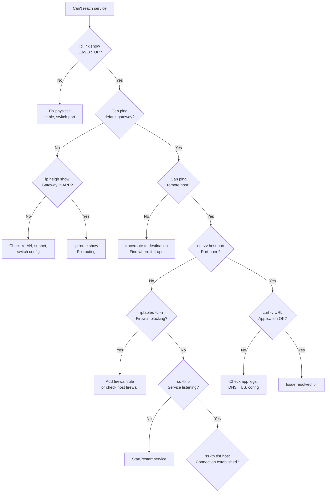

# Network Troubleshooting

## Introduction

Network troubleshooting is one of the most critical skills for Linux system administrators. When connectivity breaks, a systematic approach using the right tools saves hours of frustration. This chapter provides a structured methodology following the OSI model bottom-up, covering essential Linux networking tools: `ping`, `traceroute`, `ss`, `ip`, `tcpdump`, `dig`, and more. Each tool includes practical examples with real output, common failure patterns, and debugging strategies.

## Troubleshooting Methodology


**Golden rule**: Always start from Layer 1 and work up. The number of times a "network problem" turned out to be an unplugged cable is embarrassingly high.

## Layer 1 — Physical

```bash
# Check if the interface is up and has link
$ ip link show eth0
2: eth0: <BROADCAST,MULTICAST,UP,LOWER_UP> mtu 1500 qdisc fq_codel state UP
    link/ether 00:1a:2b:3c:4d:5e brd ff:ff:ff:ff:ff:ff

# Key flags to look for:
# UP          — interface is administratively enabled
# LOWER_UP    — physical link is detected (cable plugged in, signal present)
# If LOWER_UP is missing → physical problem (cable, switch port, NIC)

# Check link speed and duplex
$ ethtool eth0
Settings for eth0:
    Speed: 1000Mb/s
    Duplex: Full
    Auto-negotiation: on
    Link detected: yes

# Check for errors and dropped packets
$ ip -s link show eth0
    RX: bytes  packets  errors  dropped missed  mcast
    123456789  987654   0       0       0       1234
    TX: bytes  packets  errors  dropped carrier collsns
    98765432   654321   0       0       0       0

# High errors/drops = bad cable, bad NIC, or duplex mismatch
$ ethtool -S eth0 | grep -E "error|drop|crc"
rx_crc_errors: 0
rx_missed_errors: 0
tx_dropped: 0

# Check if interface is managed by NetworkManager
$ nmcli device status
DEVICE  TYPE      STATE      CONNECTION
eth0    ethernet  connected  Wired connection 1
```

**Common Layer 1 issues:**
- Cable unplugged or damaged
- Switch port disabled or in wrong VLAN
- SFP module incompatible
- Duplex mismatch (one side full, other half)
- MTU mismatch causing fragmentation

## Layer 2 — Data Link

```bash
# Check MAC address
$ ip link show eth0 | grep link/ether
    link/ether 00:1a:2b:3c:4d:5e brd ff:ff:ff:ff:ff:ff

# View ARP/neighbor cache (Layer 2 ↔ 3 mapping)
$ ip neigh show
192.168.1.1 dev eth0 lladdr aa:bb:cc:dd:ee:ff REACHABLE
192.168.1.100 dev eth0 lladdr 11:22:33:44:55:66 STALE

# ARP states:
# REACHABLE — confirmed within the last 30 seconds
# STALE     — entry exists but not confirmed recently
# DELAY     — was stale, waiting for confirmation
# FAILED    — ARP resolution failed
# PERMANENT — static entry

# Manually ping to refresh ARP
$ ping -c 1 192.168.1.1

# Check for duplicate MAC addresses (can cause intermittent issues)
$ arp -an | sort -t. -k5,5n

# View bridge forwarding table
$ bridge fdb show dev br0
$ bridge vlan show dev eth0

# Check VLAN configuration
$ ip -d link show eth0.100
4: eth0.100@eth0: <BROADCAST,MULTICAST,UP,LOWER_UP> mtu 1500
    link/ether 00:1a:2b:3c:4d:5e brd ff:ff:ff:ff:ff:ff
    vlan protocol 802.1Q id 100
```

## Layer 3 — Network (ping, ip route)

### ping

`ping` sends ICMP Echo Request packets and measures round-trip time.

```bash
# Basic ping
$ ping -c 4 8.8.8.8
PING 8.8.8.8 (8.8.8.8) 56(84) bytes of data.
64 bytes from 8.8.8.8: icmp_seq=1 ttl=116 time=12.3 ms
64 bytes from 8.8.8.8: icmp_seq=2 ttl=116 time=11.8 ms
64 bytes from 8.8.8.8: icmp_seq=3 ttl=116 time=12.1 ms
64 bytes from 8.8.8.8: icmp_seq=4 ttl=116 time=11.9 ms

--- 8.8.8.8 ping statistics ---
4 packets transmitted, 4 received, 0% packet loss, time 3004ms
rtt min/avg/max/mdev = 11.8/12.0/12.3/0.2 ms

# Ping with specific interface (multi-homed)
$ ping -I eth1 -c 4 10.0.0.1

# Ping with specific packet size (test MTU)
$ ping -M do -s 1472 -c 4 10.0.0.1
# -M do = set DF (Don't Fragment) bit
# -s 1472 = payload size (1472 + 8 ICMP + 20 IP = 1500 = standard MTU)

# If this fails but smaller works → MTU issue on the path
$ ping -M do -s 1400 -c 4 10.0.0.1   # Try smaller

# Flood ping (requires root, for testing only)
$ sudo ping -f 10.0.0.1

# Ping with timestamp
$ ping -D -c 4 8.8.8.8
[1705123456.123456] 64 bytes from 8.8.8.8: icmp_seq=1 ttl=116 time=12.3 ms

# IPv6 ping
$ ping6 -c 4 2001:4860:4860::8888
```

**Common ping failure patterns:**

| Symptom | Likely Cause |
|---------|-------------|
| `Network is unreachable` | No route to destination |
| `No route to host` | Destination unreachable (firewall or routing) |
| `Request timeout` | Packet dropped (firewall, routing loop) |
| `Destination Host Unreachable` | ARP failed, host down, or wrong subnet |
| High packet loss | Link quality, congestion, or routing instability |
| High latency | Long path, congestion, or satellite links |
| Intermittent failures | Flapping route, spanning tree, or duplex mismatch |

### ip route

```bash
# Full routing table
$ ip route show
default via 192.168.1.1 dev eth0 proto dhcp metric 100
10.0.0.0/8 via 10.255.0.1 dev tun0 proto static metric 50
172.16.0.0/12 via 10.255.0.1 dev tun0 proto static metric 50
192.168.1.0/24 dev eth0 proto kernel scope link src 192.168.1.50

# Look up route for a specific destination
$ ip route get 8.8.8.8
8.8.8.8 via 192.168.1.1 dev eth0 src 192.168.1.50 uid 1000
    cache

# Check routing for multiple destinations
$ for dest in 8.8.8.8 1.1.1.1 10.0.0.1 172.16.0.1 192.168.1.100; do
    echo -n "$dest: "
    ip route get "$dest" 2>&1 | head -1
done
8.8.8.8: 8.8.8.8 via 192.168.1.1 dev eth0
1.1.1.1: 1.1.1.1 via 192.168.1.1 dev eth0
10.0.0.1: 10.0.0.1 via 10.255.0.1 dev tun0
172.16.0.1: 172.16.0.1 via 10.255.0.1 dev tun0
192.168.1.100: 192.168.1.100 dev eth0 src 192.168.1.50

# View routing table with protocol information
$ ip route show proto static
$ ip route show proto dhcp
$ ip route show dev tun0

# Monitor route changes
$ ip monitor route
```

### traceroute

`traceroute` shows the path packets take to reach a destination.

```bash
# Standard traceroute (UDP probes)
$ traceroute 8.8.8.8
traceroute to 8.8.8.8 (8.8.8.8), 30 hops max, 60 byte packets
 1  192.168.1.1 (192.168.1.1)  1.234 ms  1.123 ms  1.089 ms
 2  10.10.0.1 (10.10.0.1)  5.678 ms  5.543 ms  5.432 ms
 3  203.0.113.1 (203.0.113.1)  12.345 ms  12.234 ms  12.123 ms
 4  * * *
 5  8.8.8.8 (8.8.8.8)  15.678 ms  15.543 ms  15.432 ms

# ICMP traceroute (more reliable through firewalls)
$ traceroute -I 8.8.8.8

# TCP traceroute (bypass UDP-blocking firewalls)
$ traceroute -T -p 443 8.8.8.8

# IPv6 traceroute
$ traceroute6 2001:4860:4860::8888

# MTR — combines ping and traceroute (best tool!)
$ mtr -c 100 -r 8.8.8.8
Start: 2024-01-15T12:00:00+0000
HOST: myserver              Loss%   Snt   Last   Avg  Best  Wrst StDev
  1. 192.168.1.1              0.0%   100    1.2   1.3   1.1   2.5   0.2
  2. 10.10.0.1                0.0%   100    5.4   5.6   5.2   8.1   0.5
  3. 203.0.113.1              0.0%   100   12.1  12.3  11.9  15.2   0.8
  4. ???                      100.0  100    0.0   0.0   0.0   0.0   0.0
  5. 8.8.8.8                  0.0%   100   15.4  15.6  15.1  18.3   0.6
```

**Reading traceroute output:**
- `*` = no response (firewall dropping ICMP, or router doesn't respond)
- Sudden latency jump = WAN link or congested hop
- Increasing loss = potential problem at that hop
- Loss at one hop but no loss at later hops = that hop deprioritizes ICMP (normal)

## Layer 4 — Transport (ss, netstat)

### ss — Socket Statistics

`ss` is the modern replacement for `netstat`, directly querying kernel socket information.

```bash
# View all TCP connections
$ ss -t state established
Recv-Q  Send-Q   Local Address:Port    Peer Address:Port
0       0        192.168.1.50:22       10.0.0.5:54321
0       128      192.168.1.50:443      203.0.113.10:49152

# View listening ports
$ ss -tlnp
State    Recv-Q  Send-Q  Local Address:Port  Peer Address:Port  Process
LISTEN   0       128     0.0.0.0:22          0.0.0.0:*          users:(("sshd",pid=1234,fd=3))
LISTEN   0       511     0.0.0.0:80          0.0.0.0:*          users:(("nginx",pid=5678,fd=6))
LISTEN   0       128     0.0.0.0:443         0.0.0.0:*          users:(("nginx",pid=5678,fd=7))
LISTEN   0       128     [::]:22             [::]:*             users:(("sshd",pid=1234,fd=4))

# Show UDP sockets
$ ss -ulnp
State    Recv-Q  Send-Q  Local Address:Port  Peer Address:Port  Process
UNCONN   0       0       0.0.0.0:53          0.0.0.0:*          users:(("named",pid=9012,fd=512))
UNCONN   0       0       0.0.0.0:68          0.0.0.0:*          users:(("dhclient",pid=3456,fd=6))

# Filter by destination
$ ss -tn dst 10.0.0.5

# Filter by port
$ ss -tn sport = :443

# Show TCP socket details (timers, congestion control)
$ ss -ti state established
ESTAB  0  0  192.168.1.50:22  10.0.0.5:54321
    cubic wscale:7,7 rto:204 rtt:1.5/0.75 ato:40 mss:1448
    pmtu:1500 rcvmss:1448 advmss:1448
    cwnd:10 ssthresh:7 bytes_sent:12345 bytes_acked:12345
    bytes_received:6789 segs_out:100 segs_in:98
    send 77.3Mbps pacing_rate 154.5Mbps
    lastsnd:200 lastrcv:200 lastack:200

# Count connections by state
$ ss -tan | awk 'NR>1 {print $1}' | sort | uniq -c | sort -rn
    15 ESTAB
     3 TIME-WAIT
     1 LISTEN
     1 CLOSE-WAIT

# Check for connection leaks (many TIME-WAIT or CLOSE-WAIT)
$ ss -tan state time-wait | wc -l
$ ss -tan state close-wait | wc -l

# View Unix domain sockets
$ ss -xlp
```

### Port Connectivity Testing

```bash
# Test if a remote port is open with bash (no tools needed)
$ (echo >/dev/tcp/8.8.8.8/53) && echo "Port open" || echo "Port closed"

# Using nc (netcat)
$ nc -zv 192.168.1.1 22
Connection to 192.168.1.1 22 port [tcp/ssh] succeeded!

# nc with timeout
$ nc -zv -w 3 10.0.0.1 443

# Test multiple ports
$ nc -zv 192.168.1.1 22 80 443 3306

# Using nmap for port scanning
$ nmap -sT -p 22,80,443 192.168.1.1
PORT    STATE SERVICE
22/tcp  open  ssh
80/tcp  open  http
443/tcp open  https

# Check what's using a port
$ ss -tlnp | grep :80
LISTEN  0  511  0.0.0.0:80  0.0.0.0:*  users:(("nginx",pid=5678,fd=6))

# Or with lsof
$ lsof -i :80
COMMAND  PID  USER  FD  TYPE  DEVICE  SIZE/OFF NODE NAME
nginx   5678  root   6u  IPv4  12345   0t0      TCP *:http (LISTEN)
nginx   5679  www    6u  IPv4  12345   0t0      TCP *:http (LISTEN)
```

## Layer 7 — Application (DNS, HTTP)

### DNS Debugging

```bash
# Basic DNS lookup
$ dig example.com A +short
93.184.216.34

# Full DNS query with all details
$ dig example.com A
;; ->>HEADER<<- opcode: QUERY, status: NOERROR, id: 12345
;; flags: qr rd ra; QUERY: 1, ANSWER: 1, AUTHORITY: 0, ADDITIONAL: 0

;; QUESTION SECTION:
;example.com.                   IN      A

;; ANSWER SECTION:
example.com.            86400   IN      A       93.184.216.34

;; Query time: 23 msec
;; SERVER: 8.8.8.8#53(8.8.8.8)

# Query specific DNS server
$ dig @1.1.1.1 example.com A +short

# Check reverse DNS
$ dig -x 8.8.8.8 +short
dns.google.

# Check NS records
$ dig example.com NS +short
a.iana-servers.net.
b.iana-servers.net.

# Check MX records
$ dig example.com MX +short
10 mail.example.com.

# Trace full DNS resolution path
$ dig example.com +trace

# Check if DNS is the problem
$ ping 8.8.8.8        # Test IP connectivity
$ dig @8.8.8.8 example.com   # Test DNS specifically
$ curl -v https://example.com/  # Test full HTTP stack

# DNS server used by the system
$ resolvectl status
DNS Servers: 8.8.8.8
             8.8.4.4
DNS Domain: example.com

# Check /etc/resolv.conf
$ cat /etc/resolv.conf
nameserver 8.8.8.8
nameserver 8.8.4.4
search example.com

# Flush DNS cache (systemd-resolved)
$ resolvectl flush-caches
```

### HTTP Debugging

```bash
# Full HTTP debug with curl
$ curl -vvv https://example.com/
* Trying 93.184.216.34:443...
* Connected to example.com (93.184.216.34) port 443
* ALPN: curl offers h2,http/1.1
* TLSv1.3 (OUT), TLS handshake, Client hello (1):
* TLSv1.3 (IN), TLS handshake, Server hello (2):
* TLSv1.3 (IN), TLS handshake, Encrypted Extensions (8):
* TLSv1.3 (IN), TLS handshake, Certificate (11):
* TLSv1.3 (IN), TLS handshake, CERT verify (15):
* TLSv1.3 (IN), TLS handshake, Finished (20):
* TLSv1.3 (OUT), TLS handshake, Finished (20):
* SSL connection using TLSv1.3 / TLS_AES_256_GCM_SHA384
> GET / HTTP/2
> Host: example.com
> User-Agent: curl/8.4.0
> Accept: */*
>
< HTTP/2 200
< content-type: text/html; charset=UTF-8
< content-length: 1256

# Check HTTP response timing
$ curl -w "\nDNS:       %{time_namelookup}s\nConnect:   %{time_connect}s\nTLS:       %{time_appconnect}s\nTTFB:      %{time_starttransfer}s\nTotal:     %{time_total}s\n" \
    -o /dev/null -s https://example.com/
DNS:       0.012s
Connect:   0.045s
TLS:       0.123s
TTFB:      0.234s
Total:     0.456s

# Test HTTP methods
$ curl -X OPTIONS -v https://api.example.com/ 2>&1 | grep "allow:"
$ curl -X POST -d '{"key":"value"}' -H "Content-Type: application/json" https://api.example.com/
```

## iptables / nftables Debugging

```bash
# View all firewall rules with packet/byte counters
$ iptables -L -n -v --line-numbers
Chain INPUT (policy DROP 123 packets, 45678 bytes)
num   pkts bytes target   prot opt in   out   source       destination
1     1000  123K ACCEPT   all  --  lo   *     0.0.0.0/0    0.0.0.0/0
2     5000  567K ACCEPT   tcp  --  eth0 *     0.0.0.0/0    0.0.0.0/0   tcp dpt:22
3      500   34K ACCEPT   tcp  --  eth0 *     0.0.0.0/0    0.0.0.0/0   tcp dpt:80
4      200   15K ACCEPT   tcp  --  eth0 *     0.0.0.0/0    0.0.0.0/0   tcp dpt:443
5       12    78 DROP     all  --  eth0 *     0.0.0.0/0    0.0.0.0/0

# Check NAT rules
$ iptables -t nat -L -n -v

# Watch packets in real-time (DEBUGGING ONLY — high CPU usage!)
$ iptables -A INPUT -p tcp --dport 80 -j LOG --log-prefix "HTTP_DEBUG: "
$ tail -f /var/log/kern.log | grep HTTP_DEBUG

# nftables equivalent
$ nft list ruleset
$ nft monitor   # Real-time rule changes

# Check conntrack (connection tracking)
$ conntrack -L
$ conntrack -C   # Count of tracked connections
$ conntrack -E   # Real-time events
```

## Comprehensive Troubleshooting Flowchart



## Common Problems and Solutions

### Problem: DNS Resolution Fails

```bash
# Diagnose
$ ping 8.8.8.8              # IP connectivity OK?
$ dig @8.8.8.8 example.com  # External DNS works?
$ dig example.com            # System DNS fails?
$ cat /etc/resolv.conf       # Check config

# Fix
$ echo "nameserver 8.8.8.8" > /etc/resolv.conf
$ systemctl restart systemd-resolved
```

### Problem: Connection Reset by Peer

```bash
# Check for RST packets
$ tcpdump -i eth0 'tcp[tcpflags] & (tcp-rst) != 0' -n

# Common causes:
# - Server process crashed or not listening
# - Firewall sending RST
# - Connection timeout
# - TLS handshake failure
```

### Problem: Intermittent Connectivity

```bash
# Run MTR for extended period
$ mtr -c 1000 -r -i 1 8.8.8.8

# Check for interface errors
$ watch -n 1 'ip -s link show eth0 | grep -A2 RX'

# Check for spanning tree topology changes (switch logs)
# Check for routing flaps
$ ip monitor route
```

### Problem: Slow Network

```bash
# Test bandwidth
$ iperf3 -c iperf.he.net    # Public iPerf3 server

# Check for packet loss
$ ping -c 1000 8.8.8.8 | tail -3

# Check TCP retransmissions
$ ss -ti state established | grep retrans

# Check interface speed
$ ethtool eth0 | grep Speed

# Check MTU issues
$ ping -M do -s 1472 -c 4 10.0.0.1
```

## Useful One-Liners

```bash
# Find all established connections to port 443
$ ss -tn state established dst :443

# Count connections per IP
$ ss -tn state established | awk 'NR>1{print $5}' | cut -d: -f1 | sort | uniq -c | sort -rn

# Monitor bandwidth per interface
$ watch -n 1 'ip -s link show eth0 | grep -A1 "RX\|TX"'

# Find which process is using a port
$ fuser 80/tcp 2>/dev/null && echo "Port 80 in use"

# Check if a host is reachable on multiple ports
$ for port in 22 80 443; do
    nc -zv -w2 10.0.0.1 $port 2>&1
done

# View network namespace connections
$ ip netns list
$ ip netns exec myns ip addr show

# Check system-wide network statistics
$ netstat -s | head -30
$ ss -s
```

## Further Reading

- [The Linux Kernel Documentation](https://docs.kernel.org/)
- [LWN.net - Linux and free software news](https://lwn.net/)
- [GNU Project Documentation](https://www.gnu.org/doc/doc.html)
- [GNU Manuals](https://www.gnu.org/manual/manual.html)
- [Free Software Directory](https://directory.fsf.org/wiki/Main_Page)
- [Planet GNU](https://planet.gnu.org/)
- [Free Software Books](https://www.gnu.org/doc/other-free-books.html)

- [Linux Network Administrators Guide](https://tldp.org/LDP/nag2/)
- [iproute2 Documentation](https://man7.org/linux/man-pages/man8/ip.8.html)
- [ss(8) Man Page](https://man7.org/linux/man-pages/man8/ss.8.html)
- [MTR — Network Diagnostic Tool](https://www.bitwizard.nl/mtr/)
- [Brendan Gregg — Linux Network Performance Tools](https://www.brendangregg.com/linuxperf.html)
- [Practical Packet Analysis (Chris Sanders)](https://nostarch.com/packetanalysis3)

## Related Topics

- [OSI Model](./osi-model.md) — Layer-by-layer troubleshooting framework
- [IP Addressing](./ip-addressing.md) — Subnet and routing issues
- [DNS](./dns.md) — Name resolution debugging
- [DHCP](./dhcp.md) — IP configuration problems
- [Packet Capture](./packet-capture.md) — Deep packet analysis
- [Firewall Configuration](../security/) — iptables and nftables
