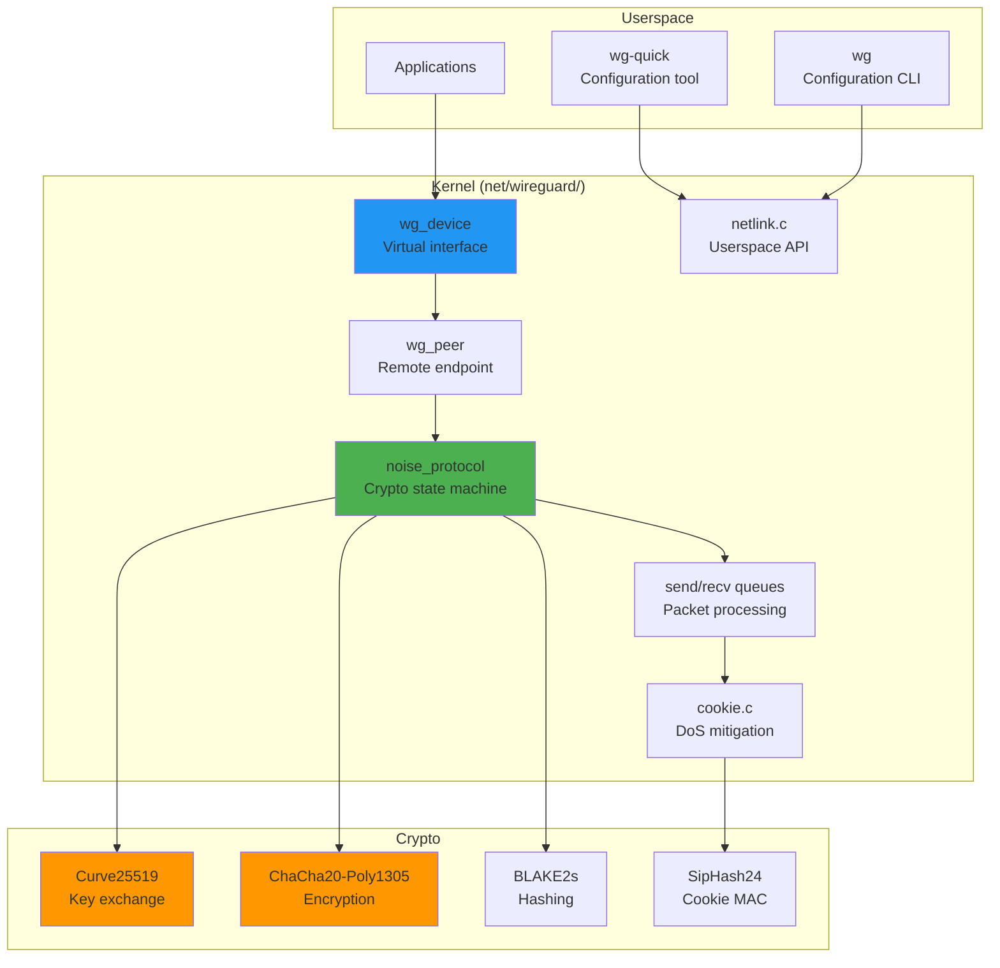
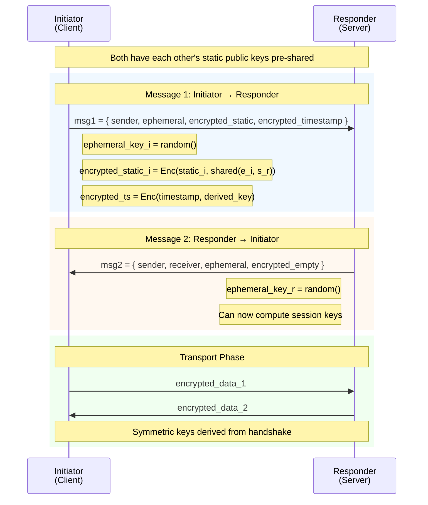
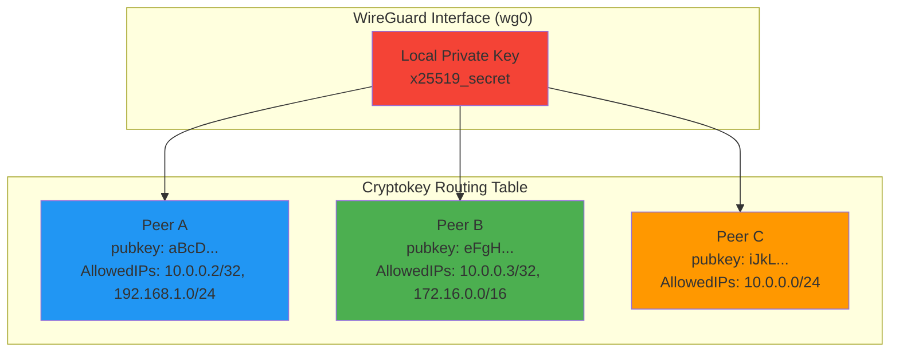
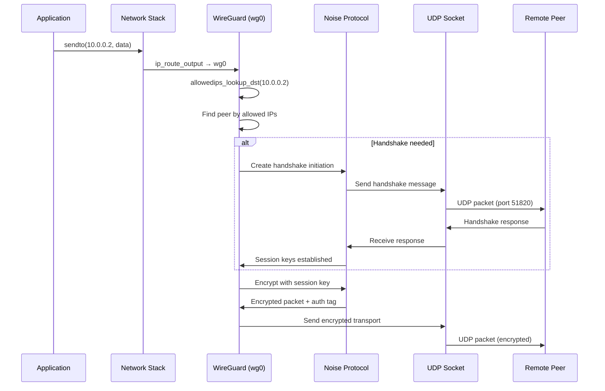
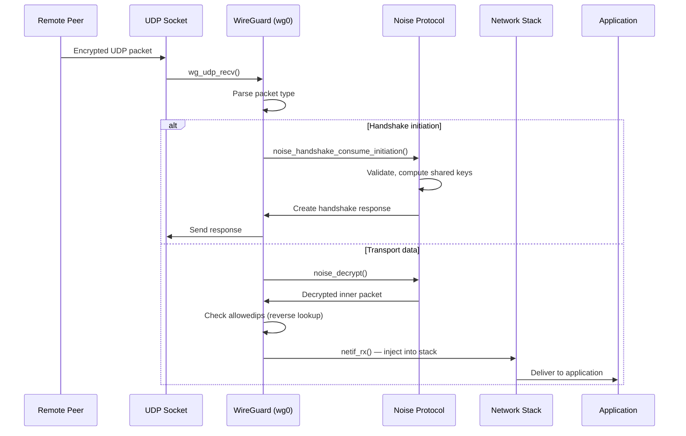
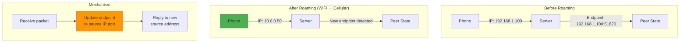
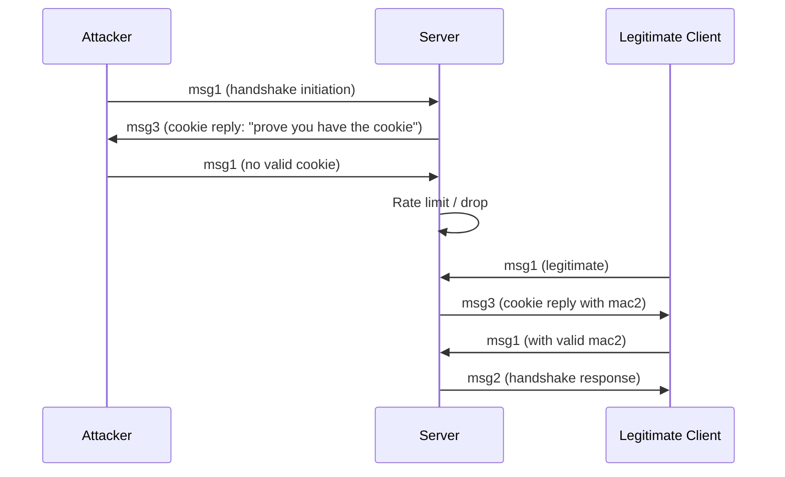
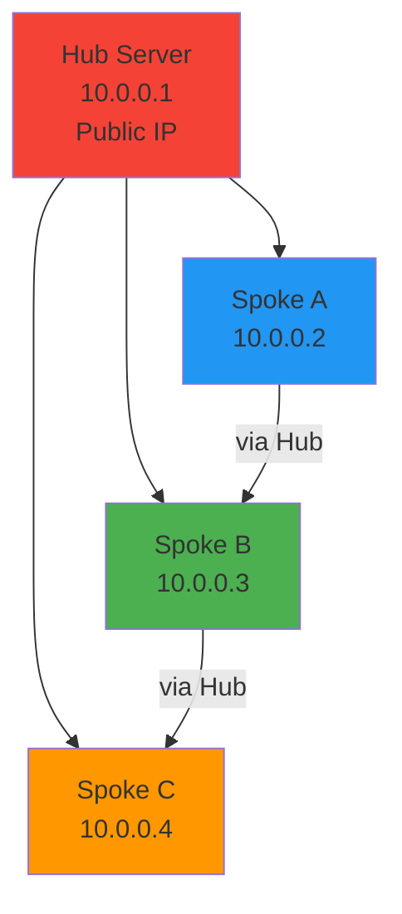
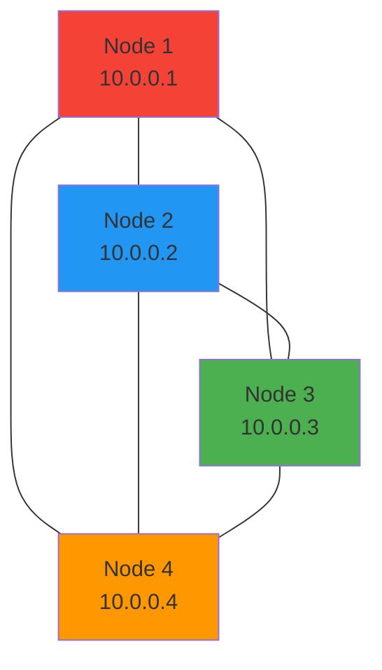

# WireGuard VPN Deep Dive

## Introduction

WireGuard is a modern VPN protocol and implementation that aims to be simpler, faster, and more secure than IPsec and OpenVPN. Written by Jason A. Donenfeld, it was merged into the Linux kernel in version 5.6 (March 2020) and consists of only ~4,000 lines of kernel code — compared to OpenVPN's ~100,000 lines or IPsec's ~600,000 lines.

WireGuard's design philosophy is radical simplicity: fixed cryptographic primitives, no negotiation of algorithms, no certificate management, and a protocol so clean it fits on a T-shirt. Despite its simplicity, it provides strong security guarantees through the Noise Protocol Framework and supports seamless roaming across network changes.

## Architecture

### WireGuard in the Kernel



### WireGuard Source Code Structure

```
net/wireguard/
├── main.c              # Module init, netdevice ops
├── device.c            # wg_device lifecycle
├── peer.c              # Peer management
├── netlink.c           # Netlink API (wg tool interface)
├── noise.c             # Noise Protocol state machine
├── handshake.c         # Handshake message processing
├── cookie.c            # Cookie-based DoS protection
├── messages.h          # Message format definitions
├── send.c              # Packet encryption and sending
├── receive.c           # Packet decryption and receiving
├── queueing.c          # Per-peer packet queues
├── timers.c            # Keepalive, rekey, handshake timeouts
├── allowedips.c        # Cryptokey routing trie
├── socket.c            # UDP socket handling
├── ratelimiter.c       # Under-load rate limiting
└── selftest/           # Crypto self-tests
```

## The Noise Protocol Framework

WireGuard uses the **Noise IKpsk2** handshake pattern, which provides:
- **Identity hiding** of the initiator
- **Perfect forward secrecy**
- **Resistance to key-compromise impersonation**
- **Zero round-trip** data transmission after handshake

### Noise IKpsk2 Handshake

The handshake name encodes its properties:
- **I** = Initiator's static key is **I**mmediately transmitted
- **K** = **K**nown static key (responder's key is pre-shared)
- **psk2** = Pre-shared key mixed at position **2**



### Handshake State Machine

```c
// Simplified from net/wireguard/noise.c
// The Noise handshake progresses through states:

enum noise_state {
    HANDSHAKE_ZEROED,        // Initial state
    HANDSHAKE_CREATED_INITIATION,  // Message 1 created
    HANDSHAKE_CONSUMED_INITIATION, // Message 1 received
    HANDSHAKE_CREATED_RESPONSE,    // Message 2 created
    HANDSHAKE_CONSUMED_RESPONSE,   // Message 2 received
};
```

### Cryptographic Primitives

WireGuard uses exactly **four** cryptographic primitives — no algorithm negotiation:

| Primitive | Purpose | Property |
|-----------|---------|----------|
| **Curve25519** | Key exchange (X25519) | ECDH, 128-bit security |
| **ChaCha20-Poly1305** | Authenticated encryption | AEAD, 256-bit key |
| **BLAKE2s** | Key derivation, hashing | Faster than SHA-256 |
| **SipHash24** | Cookie generation MAC | 128-bit key, fast |

```c
// From net/wireguard/noise.c (simplified)

// Key derivation using BLAKE2s
static void kdf(u8 *first_dst, u8 *second_dst, u8 *third_dst,
                const u8 *data, size_t first_len, size_t second_len,
                size_t third_len, const u8 chaining_key[NOISE_HASH_LEN])
{
    u8 output[BLAKE2S_HASH_SIZE + 1];

    // BLAKE2s(chaining_key || 0x01)
    blake2s(output, data, NULL, first_len + 1,
            sizeof(data), 0);
    memcpy(first_dst, output, first_len);

    // BLAKE2s(chaining_key || 0x02)
    blake2s(output, data, NULL, second_len + 1,
            sizeof(data), 0);
    memcpy(second_dst, output, second_len);

    // BLAKE2s(chaining_key || 0x03)
    blake2s(output, data, NULL, third_len + 1,
            sizeof(data), 0);
    memcpy(third_dst, output, third_len);
}
```

## Cryptokey Routing

WireGuard's routing model is fundamentally different from traditional VPNs. Instead of routing based on IP prefixes, it uses **cryptokey routing** — each peer is identified by its public key, and allowed IPs are associated with that key.

### Cryptokey Routing Table



### AllowedIPs Trie

The allowed IPs are stored in a **trie** (prefix tree) for efficient longest-prefix matching:

```c
// From net/wireguard/allowedips.c
// Each node in the trie represents a bit in the IP address

struct allowedips_node {
    struct allowedips_node __rcu *bit[2];  // 0-child and 1-child
    struct wg_peer __rcu *peer;
    struct rcu_head rcu;
    u8 cidr;         // Prefix length
    u8 bit_at_a;     // Which byte to check
    u8 bit_at_b;     // Which bit in that byte
    bool is_secondary;  // For roaming support
};

// Lookup: find peer for a given destination IP
struct wg_peer *allowedips_lookup_dst(struct allowedips *table,
                                       struct sk_buff *skb)
{
    // Traverse the trie using bits of the destination IP
    // Returns the peer with the longest matching prefix
}
```

### Configuration Example

```bash
# Create WireGuard interface
sudo ip link add wg0 type wireguard

# Configure the interface
sudo wg set wg0 \
    listen-port 51820 \
    private-key /etc/wireguard/private.key \
    peer "aBcDeFgHiJkLmNoPqRsTuVwXyZ..." \
        endpoint 203.0.113.1:51820 \
        allowed-ips 10.0.0.2/32,192.168.1.0/24 \
        persistent-keepalive 25

# Add IP address
sudo ip addr add 10.0.0.1/24 dev wg0
sudo ip link set wg0 up

# View configuration
sudo wg show
# interface: wg0
#   public key: <local_pubkey>
#   private key: (hidden)
#   listening port: 51820
#
# peer: aBcDeFgHiJkLmNoPqRsTuVwXyZ...
#   endpoint: 203.0.113.1:51820
#   allowed ips: 10.0.0.2/32, 192.168.1.0/24
#   latest handshake: 1 minute, 23 seconds ago
#   transfer: 1.48 GiB received, 3.12 GiB sent
```

### wg-quick Configuration File

```ini
# /etc/wireguard/wg0.conf
[Interface]
Address = 10.0.0.1/24
ListenPort = 51820
PrivateKey = <base64_private_key>
DNS = 1.1.1.1, 8.8.8.8

# Optional: run commands on up/down
PostUp = iptables -A FORWARD -i wg0 -j ACCEPT; iptables -t nat -A POSTROUTING -o eth0 -j MASQUERADE
PostDown = iptables -D FORWARD -i wg0 -j ACCEPT; iptables -t nat -D POSTROUTING -o eth0 -j MASQUERADE

[Peer]
PublicKey = <base64_public_key>
AllowedIPs = 10.0.0.2/32, 192.168.1.0/24
Endpoint = 203.0.113.1:51820
PersistentKeepalive = 25

[Peer]
PublicKey = <another_public_key>
AllowedIPs = 10.0.0.3/32, 172.16.0.0/16
Endpoint = 198.51.100.1:51820
```

```bash
# Start WireGuard with wg-quick
sudo wg-quick up wg0

# Stop
sudo wg-quick down wg0

# Enable at boot
sudo systemctl enable wg-quick@wg0
```

## Packet Flow

### Sending a Packet



### Receiving a Packet



### Message Types

WireGuard has exactly **four** message types:

```c
// From include/uapi/linux/wireguard.h

#define WG_MSG_HANDSHAKE_INITIATION 1  // Type 1: Handshake initiation
#define WG_MSG_HANDSHAKE_RESPONSE   2  // Type 2: Handshake response
#define WG_MSG_HANDSHAKE_COOKIE     3  // Type 3: Cookie reply (DoS protection)
#define WG_MSG_TRANSPORT_DATA       4  // Type 4: Transport data
```

#### Message 1: Handshake Initiation

```c
struct message_handshake_initiation {
    struct message_header header;     // type = 1, 3 reserved bytes
    __le32 sender_index;              // Random index for lookup
    u8 unencrypted_ephemeral[32];     // Curve25519 ephemeral public key
    u8 encrypted_static[32 + 16];     // Encrypted static public key + AEAD tag
    u8 encrypted_timestamp[12 + 16];  // Encrypted timestamp + AEAD tag
    u8 mac1[16];                      // MAC of message using static key
    u8 mac2[16];                      // MAC using cookie (if known)
} __packed;
```

#### Message 4: Transport Data

```c
struct message_data {
    struct message_header header;     // type = 4
    __le32 key_idx;                   // Session key index
    __le64 counter;                   // Nonce counter (anti-replay)
    u8 encrypted_data[];              // Encrypted inner IP packet
    // Poly1305 authentication tag appended
} __packed;
```

## Roaming Support

WireGuard's most innovative feature is seamless roaming — connections survive IP address changes without any tunnel renegotiation.

### How Roaming Works



### Roaming Implementation

```c
// From net/wireguard/receive.c (simplified)
// When a packet is received, the endpoint is updated

static void wg_packet_consume_data(struct sk_buff *skb)
{
    struct wg_peer *peer;

    // Find peer by the message's key index
    peer = index_hashtable_lookup(&wg->index_hashtable,
                                   INDEX_HASHTABLE_KEYPAIR,
                                   message->key_idx);

    // CRITICAL: Update the endpoint to the source of this packet
    // This is what enables roaming — the peer's endpoint
    // is always the last address we received from
    wg_socket_set_peer_endpoint(peer, skb);

    // Decrypt and process the packet
    wg_noise_consume_data(&peer->handshake, skb);
}
```

The key insight: **there is no separate "roaming" protocol**. Each incoming packet naturally updates the peer's endpoint. If the peer changes IP addresses, the next packet from the new address updates the stored endpoint. Responses automatically go to the new address.

### Keepalive and Roaming Detection

```c
// From net/wireguard/timers.c

// Persistent keepalive timer
// Sends periodic keepalive packets to maintain NAT mappings
// and detect peer reachability

static void wg_expired_send_keepalive(struct timer_list *timer)
{
    struct wg_peer *peer = from_timer(peer, timer, timer_send_keepalive);

    // Send an empty encrypted packet
    wg_packet_send_keepalive(peer);

    // Reschedule if persistent keepalive is set
    if (peer->persistent_keepalive_interval)
        mod_timer(&peer->timer_send_keepalive,
                  jiffies + peer->persistent_keepalive_interval);
}

// Handshake timeout: if no response, retry
static void wg_expired_retransmit_handshake(struct timer_list *timer)
{
    struct wg_peer *peer = from_timer(peer, timer, timer_retransmit_handshake);

    if (peer->timer_handshake_attempts <= MAX_TIMER_HANDSHAKES) {
        wg_packet_send_queued_handshake_initiation(peer, true);
        ++peer->timer_handshake_attempts;
    }
}
```

## DoS Protection

WireGuard includes built-in DoS protection through cookie-based mechanisms.

### Cookie Mechanism



### Rate Limiting Under Load

```c
// From net/wireguard/ratelimiter.c

// When the system is under load, WireGuard rate-limits
// handshake initiation messages to prevent CPU exhaustion

#define PACKETS_PER_SECOND    20
#define PACKETS_BURSTABLE     5
#define TOKEN_MAX             (PACKETS_BURSTABLE * NSEC_PER_SEC / PACKETS_PER_SECOND)

// Token bucket rate limiter
bool wg_ratelimiter_allow(struct sk_buff *skb, struct net *net)
{
    struct ratelimiter_entry *entry;

    // Lookup source IP in rate limiter
    entry = ratelimiter_lookup(skb, net);
    if (!entry)
        return false;

    // Check if tokens are available
    spin_lock_bh(&entry->lock);
    entry->tokens += ktime_get_ns() - entry->last_time;
    entry->last_time = ktime_get_ns();
    entry->tokens = min_t(u64, entry->tokens, TOKEN_MAX);

    if (entry->tokens >= NSEC_PER_SEC / PACKETS_PER_SECOND) {
        entry->tokens -= NSEC_PER_SEC / PACKETS_PER_SECOND;
        spin_unlock_bh(&entry->lock);
        return true;
    }

    spin_unlock_bh(&entry->lock);
    return false;  // Rate limited
}
```

## Performance Characteristics

### WireGuard vs Other VPNs

```mermaid
graph LR
    subgraph "Throughput (Gbps)"
        WG[WireGuard: ~3-10]
        IPSEC[IPsec: ~2-8]
        OPENVPN[OpenVPN: ~0.3-1]
    end

    subgraph "Latency Overhead"
        WG_LAT[WireGuard: +1-5ms]
        IPSEC_LAT[IPsec: +2-10ms]
        OPENVPN_LAT[OpenVPN: +5-30ms]
    end

    subgraph "CPU Usage"
        WG_CPU[WireGuard: Low<br>(ChaCha20 SIMD)]
        IPSEC_CPU[IPsec: Medium<br>(AES-NI)]
        OPENVPN_CPU[OpenVPN: High<br>(OpenSSL overhead)]
    end

    style WG fill:#4CAF50
    style WG_LAT fill:#4CAF50
    style WG_CPU fill:#4CAF50
```

### Performance Optimization

WireGuard achieves high performance through:

1. **SIMD-accelerated crypto** — ChaCha20 uses AVX2/AVX-512 on x86, NEON on ARM
2. **No allocations in hot path** — Pre-allocated packet pools
3. **Parallel processing** — Per-peer queues with work queues
4. **Zero-copy where possible** — Direct skb manipulation

```c
// From net/wireguard/send.c — SIMD crypto usage
static void wg_encrypt(struct message_data *dst, struct sk_buff *skb,
                        struct noise_keypair *keypair)
{
    // ChaCha20-Poly1305 with SIMD acceleration
    // The kernel's chacha20poly1305 library uses:
    // - AVX-512 on capable x86 CPUs
    // - AVX2 on older x86
    // - NEON on ARM64
    chacha20poly1305_encrypt(dst->encrypted_data,
                              skb->data, skb->len,
                              NULL, 0,
                              dst->counter,
                              keypair->sending.key);
}
```

## WireGuard Network Topologies

### Point-to-Point

```ini
# Simplest: two machines connected directly
# Server (203.0.113.1)
[Interface]
Address = 10.0.0.1/24
ListenPort = 51820
PrivateKey = <server_key>

[Peer]
PublicKey = <client_key>
AllowedIPs = 10.0.0.2/32
```

### Hub and Spoke



### Full Mesh



## WireGuard and Namespaces

WireGuard interfaces can be moved between network namespaces, enabling clean container VPN setups:

```bash
# Create WireGuard interface in default namespace
sudo ip link add wg0 type wireguard
sudo wg set wg0 private-key /etc/wireguard/key listen-port 51820

# Move to container's network namespace
sudo ip link set wg0 netns <container_pid>

# Inside the container namespace:
# wg0 is now the container's VPN interface
ip link set wg0 up
ip addr add 10.0.0.2/24 dev wg0
ip route add default dev wg0
```

### Docker + WireGuard

```bash
# Run WireGuard in a Docker container
docker run -d \
    --name wireguard \
    --cap-add NET_ADMIN \
    --cap-add SYS_MODULE \
    -v /lib/modules:/lib/modules \
    -v /etc/wireguard:/etc/wireguard \
    -p 51820:51820/udp \
    linuxserver/wireguard

# Or using network namespace sharing:
docker run -d --network container:wireguard myapp
```

## Advanced: WireGuard + BPF

WireGuard's clean architecture makes it easy to combine with BPF programs:

```c
// Attach XDP to WireGuard interface for packet filtering
// This runs BEFORE WireGuard decrypts

// tc BPF on wg0 for post-decryption filtering
// This runs AFTER WireGuard decrypts

// Use case: Filter VPN traffic at the WireGuard layer
SEC("tc")
int wg_filter(struct __sk_buff *skb)
{
    void *data = (void *)(long)skb->data;
    void *data_end = (void *)(long)skb->data_end;

    // Parse inner IP packet (after WireGuard decryption)
    struct iphdr *ip = data;
    if ((void *)(ip + 1) > data_end)
        return TC_ACT_OK;

    // Block certain destinations
    if (ip->daddr == 0x0A000001)  // 10.0.0.1
        return TC_ACT_SHOT;

    return TC_ACT_OK;
}
```

## Security Considerations

### Key Management

```bash
# Generate keys
wg genkey | tee private.key | wg pubkey > public.key

# Generate preshared key (for additional security)
wg genpsk > preshared.key

# Key rotation is handled automatically:
# - Data keys rotate every 2^64 packets or 120 seconds
# - Handshake keys rotate every 120 seconds
# - No manual key rotation needed
```

### Formal Verification

WireGuard's Noise protocol has been formally verified:

- **Tamarin prover** — Verified the cryptographic protocol
- **Verifpal** — Additional protocol verification
- **ProVerif** — Verified privacy properties

The formal verification confirms:
- Secrecy of static private keys
- Forward secrecy of session keys
- Resistance to key-compromise impersonation
- Identity hiding of the initiator

## Kernel Source References

| File | Description |
|------|-------------|
| `net/wireguard/main.c` | Module entry point |
| `net/wireguard/device.c` | Network device operations |
| `net/wireguard/noise.c` | Noise protocol implementation |
| `net/wireguard/handshake.c` | Handshake message processing |
| `net/wireguard/allowedips.c` | Cryptokey routing trie |
| `net/wireguard/send.c` | Packet encryption and sending |
| `net/wireguard/receive.c` | Packet decryption and receiving |
| `net/wireguard/timers.c` | Keepalive and rekey timers |
| `net/wireguard/cookie.c` | DoS protection cookies |
| `net/wireguard/netlink.c` | Userspace netlink API |
| `include/uapi/linux/wireguard.h` | Userspace API header |

## Further Reading

- [WireGuard Official Website](https://www.wireguard.com/)
- [WireGuard Paper](https://www.wireguard.com/papers/wireguard.pdf)
- [Noise Protocol Framework](https://noiseprotocol.org/noise.html)
- [WireGuard Kernel Source](https://git.zx2c4.com/wireguard-linux/)
- [WireGuard Tools](https://git.zx2c4.com/wireguard-tools/)
- [Formal Verification](https://www.wireguard.com/formal-verification/)
- Kernel source: `net/wireguard/`
