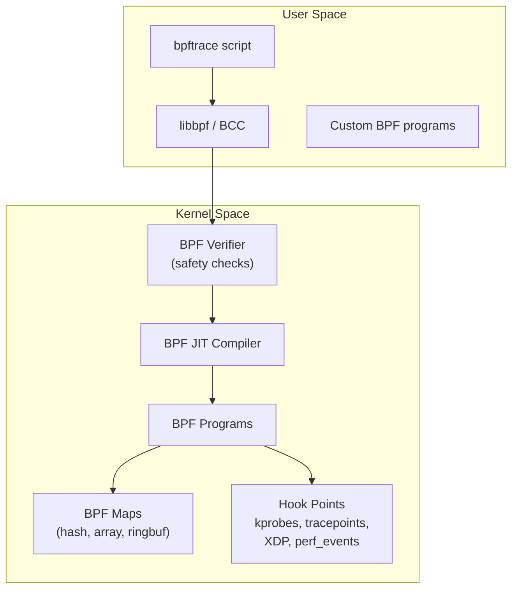
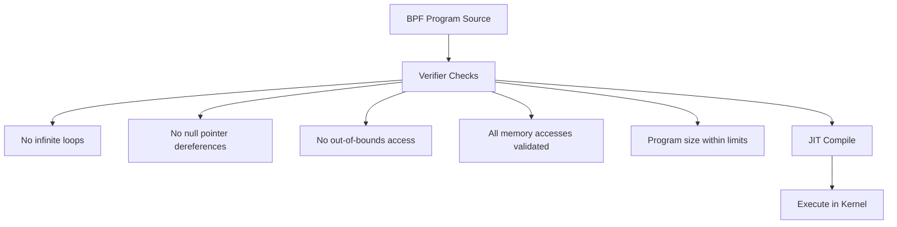

# BPF and bpftrace

## Introduction

BPF (Berkeley Packet Filter) has evolved from a simple packet filter into a powerful, general-purpose execution engine in the Linux kernel. Modern eBPF (extended BPF) enables safe, efficient, programmable tracing and observability without modifying kernel code or loading kernel modules.

`bpftrace` is a high-level tracing language built on eBPF, inspired by awk and DTrace. It enables powerful one-liners and custom scripts for tracing network, disk, scheduler, and application behavior.

## BPF Architecture



### BPF Program Types

| Type | Hook Point | Use Case |
|------|------------|----------|
| kprobe/kretprobe | Kernel functions | Function entry/exit tracing |
| tracepoint | Static kernel tracepoints | Structured event tracing |
| uprobe/uretprobe | User-space functions | Application tracing |
| XDP | Network driver | High-performance packet processing |
| perf_event | Performance counters | CPU/memory profiling |
| raw_tracepoint | Raw tracepoint args | Low-overhead tracing |
| LSM | Linux Security Module | Security policy |

## bpftrace One-Liners

### System Call Tracing

```bash
# Trace all open() syscalls
bpftrace -e 'tracepoint:syscalls:sys_enter_openat { printf("%s %s\n", comm, str(args->filename)); }'
# cat /etc/hostname
# sshd /etc/ssh/sshd_config
# nginx /var/log/nginx/access.log

# Count syscalls by process
bpftrace -e 'tracepoint:raw_syscalls:sys_enter { @[comm] = count(); }'
# @[sshd]: 1234
# @[nginx]: 5678
# @[mysqld]: 9012

# Syscall latency histogram
bpftrace -e '
tracepoint:raw_syscalls:sys_enter { @start[args->id] = nsecs; }
tracepoint:raw_syscalls:sys_exit /@start[args->id]/ {
    @usecs[comm] = hist((nsecs - @start[args->id]) / 1000);
    delete(@start[args->id]);
}'
```

### Disk I/O Tracing

```bash
# Trace block I/O with latency
bpftrace -e '
tracepoint:block:block_rq_issue { @start[args->dev] = nsecs; }
tracepoint:block:block_rq_complete /@start[args->dev]/ {
    @usecs[args->dev] = hist((nsecs - @start[args->dev]) / 1000);
    delete(@start[args->dev]);
}'

# I/O size distribution
bpftrace -e '
tracepoint:block:block_rq_issue {
    @bytes[args->rwbs] = hist(args->bytes / 1024);
}'

# I/O by process
bpftrace -e '
tracepoint:block:block_rq_issue {
    @[comm, args->rwbs] = count();
}'

# Disk IOPS over time
bpftrace -e '
tracepoint:block:block_rq_complete {
    @iops = count();
}
interval:s:1 {
    print(@iops);
    clear(@iops);
}'
```

### Network Tracing

```bash
# Trace TCP connections
bpftrace -e '
kprobe:tcp_connect {
    printf("TCP connect: %s (pid=%d)\n", comm, pid);
}'

# TCP retransmissions
bpftrace -e '
kprobe:tcp_retransmit_skb {
    @[comm, kstack] = count();
}'

# Count packets by protocol
bpftrace -e '
tracepoint:net:netif_receive_skb {
    @proto[((struct sk_buff *)args->skb)->protocol] = count();
}'

# DNS queries (UDP port 53)
bpftrace -e '
kprobe:udp_sendmsg {
    $sk = (struct sock *)arg0;
    if ($sk->__sk_common.skc_dport == htons(53)) {
        printf("DNS query from %s (pid=%d)\n", comm, pid);
    }
}'
```

### Scheduler Tracing

```bash
# Context switches by process
bpftrace -e '
tracepoint:sched:sched_switch {
    @[args->prev_comm] = count();
}'

# Scheduler latency (run queue wait time)
bpftrace -e '
tracepoint:sched:sched_wakeup {
    @qtime[args->pid] = nsecs;
}
tracepoint:sched:sched_switch /@qtime[args->next_pid]/ {
    @usecs[args->next_comm] = hist((nsecs - @qtime[args->next_pid]) / 1000);
    delete(@qtime[args->next_pid]);
}'

# CPU time per process
bpftrace -e '
tracepoint:sched:sched_switch {
    @cputime[args->prev_comm] += nsecs;
    @oncpu[args->next_pid] = nsecs;
}
END {
    clear(@oncpu);
}'
```

### Memory Tracing

```bash
# Page allocation by process
bpftrace -e '
tracepoint:kmem:mm_page_alloc {
    @[comm, kstack] = count();
}'

# OOM kills
bpftrace -e '
tracepoint:oom:oom_score_adj_update {
    printf("OOM adj: pid=%d comm=%s score=%d\n", args->pid, comm, args->oom_score_adj);
}'

# Page cache misses
bpftrace -e '
tracepoint:filemap:mm_filemap_add_to_page_cache {
    @[comm, str(args->folio->mapping->host->i_sb->s_id)] = count();
}'
```

## bpftrace Scripts

### Disk Latency Heat Map

```bash
#!/usr/bin/env bpftrace
// disk-latency.bt
// Disk I/O latency heat map

tracepoint:block:block_rq_issue {
    @start[args->dev, args->sector] = nsecs;
}

tracepoint:block:block_rq_complete /@start[args->dev, args->sector]/ {
    $latency = (nsecs - @start[args->dev, args->sector]) / 1000;
    @usecs = hist($latency);
    delete(@start[args->dev, args->sector]);
}

interval:s:1 {
    print(@usecs);
    clear(@usecs);
}
```

### TCP Connection Tracer

```bash
#!/usr/bin/env bpftrace
// tcp-connect.bt
// Trace TCP connections with latency

kprobe:tcp_connect {
    @start[pid] = nsecs;
    @pid_to_comm[pid] = comm;
}

kretprobe:tcp_connect /@start[pid]/ {
    $latency = (nsecs - @start[pid]) / 1000;
    printf("%-16s %-6d %d μs\n", @pid_to_comm[pid], pid, $latency);
    delete(@start[pid]);
    delete(@pid_to_comm[pid]);
}
```

### Function Latency Tracer

```bash
#!/usr/bin/env bpftrace
// funclatency.bt
// Trace function latency

kprobe:ext4_file_read { @start[tid] = nsecs; }
kretprobe:ext4_file_read /@start[tid]/ {
    @us = hist((nsecs - @start[tid]) / 1000);
    delete(@start[tid]);
}
```

## BCC Tools

BCC (BPF Compiler Collection) provides ready-made BPF tools:

```bash
# Install BCC tools
apt install bpfcc-tools   # Debian/Ubuntu
yum install bcc-tools      # RHEL/CentOS

# I/O latency histogram
biolatency-bpfcc
# Tracing block device I/O... Hit Ctrl-C to end.
# ^C
#      usecs          : count    distribution
#         0 -> 1      : 0       |                                        |
#         2 -> 3      : 1234    |*********                               |
#         4 -> 7      : 5678    |****************************************|
#         8 -> 15     : 2345    |*****************                       |
#        16 -> 31     : 1234    |*********                               |
#        32 -> 63     : 567     |****                                   |
#        64 -> 127    : 234     |**                                      |
#       128 -> 255    : 123     |*                                       |

# I/O size distribution
bitesize-bpfcc
# Tracing block device I/O sizes... Hit Ctrl-C to end.

# Runqlat - scheduler run queue latency
runqlat-bpfcc
# Tracing run queue latency... Hit Ctrl-C to end.
#      usecs          : count    distribution
#         0 -> 1      : 5678    |****************************************|
#         2 -> 3      : 1234    |********                                |
#         4 -> 7      : 567     |****                                   |
#         8 -> 15     : 234     |**                                      |

# TCP connection tracer
tcpconnect-bpfcc
# PID    COMM         IP SADDR            DADDR            DPORT
# 1234   curl         4  192.168.1.1      93.184.216.34    443

# execsnoop - trace new processes
execsnoop-bpfcc
# PCOMM            PID    PPID   RET ARGS
# ls               5678   1234     0 /bin/ls -la
# cat              9012   1234     0 /etc/hostname

# opensnoop - trace file opens
opensnoop-bpfcc
# PID    COMM               FD ERR PATH
# 1234   nginx               5   0 /etc/nginx/nginx.conf
# 5678   mysqld              3   0 /var/lib/mysql/ibdata1

# cachestat - page cache hit rate
cachestat-bpfcc
# HITS   MISSES  DIRTIES HITRATIO   BUFFERS_MB  CACHED_MB
# 12345  123     456     99.01%     123         12345
```

## BPF Safety

The BPF verifier ensures programs are safe:



## References

- [bpftrace Documentation](https://github.com/bpftrace/bpftrace)
- [BCC Documentation](https://github.com/iovisor/bcc)
- [eBPF Documentation](https://ebpf.io/)
- Gregg, B. *BPF Performance Tools*. Addison-Wesley.

## Further Reading

- <https://ebpf.io/> - eBPF project documentation
- <https://github.com/bpftrace/bpftrace> - bpftrace on GitHub
- <https://github.com/iovisor/bcc> - BCC on GitHub
- <https://www.brendangregg.com/bpf-performance-tools-book.html> - BPF Performance Tools book

## Related Topics

- [Observability Overview](overview.md)
- [Tracepoints](tracepoints.md)
- [Kprobes](kprobes.md)
- [I/O Performance](../performance/io.md)
