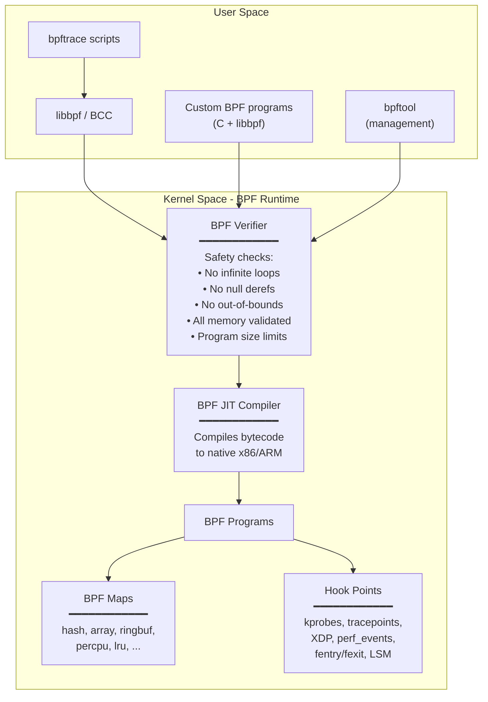
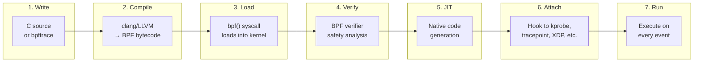
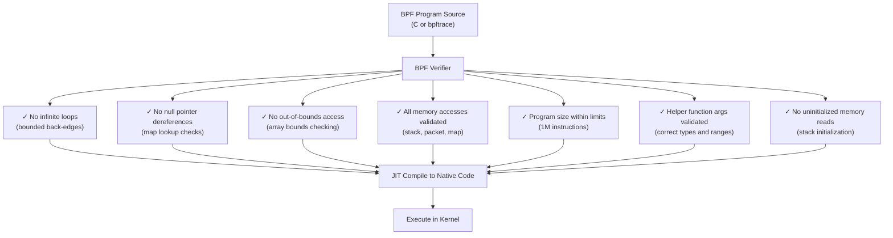

# BPF and bpftrace

## Introduction

BPF (Berkeley Packet Filter) has evolved from a simple packet filter into a powerful, general-purpose execution engine in the Linux kernel. Modern eBPF (extended BPF) enables safe, efficient, programmable tracing and observability without modifying kernel code or loading kernel modules.

`bpftrace` is a high-level tracing language built on eBPF, inspired by awk and DTrace. It enables powerful one-liners and custom scripts for tracing network, disk, scheduler, and application behavior.

This page covers BPF architecture, bpftrace syntax and one-liners, BPF map types, BCC tools, tracepoint usage, and real-world observability recipes.

## BPF Architecture



### BPF Program Lifecycle



### BPF Program Types

| Type | Hook Point | Use Case | Kernel Version |
|------|------------|----------|----------------|
| `kprobe` / `kretprobe` | Kernel functions | Function entry/exit tracing | 3.19+ |
| `tracepoint` | Static kernel tracepoints | Structured event tracing | 4.7+ |
| `uprobe` / `uretprobe` | User-space functions | Application tracing | 4.18+ |
| `XDP` | Network driver | High-performance packet processing | 4.8+ |
| `perf_event` | Performance counters | CPU/memory profiling | 4.9+ |
| `raw_tracepoint` | Raw tracepoint args | Low-overhead tracing | 4.17+ |
| `LSM` | Linux Security Module | Security policy enforcement | 5.7+ |
| `fentry` / `fexit` | Kernel functions (BTF) | Fast function tracing | 5.5+ |
| `tp_btf` | BTF-aware tracepoints | Typed tracepoint access | 5.6+ |
| `cgroup/sock` | cgroup socket | Network policy | 4.12+ |
| `sched_*` | Scheduler events | Scheduling policy | 5.6+ |

## BPF Maps

Maps are the primary data structure for BPF programs. They allow BPF programs to store and share data.

### Map Types

| Type | Description | Use Case |
|------|-------------|----------|
| `BPF_MAP_TYPE_HASH` | Key-value hash table | General lookups, counters |
| `BPF_MAP_TYPE_ARRAY` | Fixed-size array | Per-CPU stats, histograms |
| `BPF_MAP_TYPE_PERCPU_HASH` | Per-CPU hash table | High-throughput counters |
| `BPF_MAP_TYPE_PERCPU_ARRAY` | Per-CPU array | Per-CPU statistics |
| `BPF_MAP_TYPE_RINGBUF` | Ring buffer | Event streaming to user space |
| `BPF_MAP_TYPE_LRU_HASH` | LRU-evicting hash | Bounded-size caches |
| `BPF_MAP_TYPE_STACK_TRACE` | Stack trace storage | Profiling, flame graphs |
| `BPF_MAP_TYPE_QUEUE` | FIFO queue | Event buffering |
| `BPF_MAP_TYPE_STACK` | LIFO stack | State tracking |
| `BPF_MAP_TYPE_DEVMAP` | Device map | XDP packet forwarding |
| `BPF_MAP_TYPE_CPUMAP` | CPU map | XDP CPU redirection |

### Map Operations in BPF C

```c
#include <linux/bpf.h>
#include <bpf/bpf_helpers.h>

// Define a hash map
struct {
    __uint(type, BPF_MAP_TYPE_HASH);
    __uint(max_entries, 10240);
    __type(key, u32);      // PID
    __type(value, u64);    // byte count
} bytes_by_pid SEC(".maps");

// Define a per-CPU array
struct {
    __uint(type, BPF_MAP_TYPE_PERCPU_ARRAY);
    __uint(max_entries, 256);
    __type(key, u32);
    __type(value, u64);
} per_cpu_stats SEC(".maps");

// Define a ring buffer for events
struct event {
    u32 pid;
    char comm[16];
    u64 bytes;
};

struct {
    __uint(type, BPF_MAP_TYPE_RINGBUF);
    __uint(max_entries, 256 * 1024);
} events SEC(".maps");

SEC("kprobe/vfs_read")
int trace_vfs_read(struct pt_regs *ctx)
{
    u32 pid = bpf_get_current_pid_tgid() >> 32;
    u64 bytes = PT_REGS_PARM3(ctx);

    // Update hash map
    u64 *val = bpf_map_lookup_elem(&bytes_by_pid, &pid);
    if (val) {
        __sync_fetch_and_add(val, bytes);
    } else {
        bpf_map_update_elem(&bytes_by_pid, &pid, &bytes, BPF_ANY);
    }

    // Submit event to ring buffer
    struct event *e = bpf_ringbuf_reserve(&events, sizeof(*e), 0);
    if (e) {
        e->pid = pid;
        bpf_get_current_comm(&e->comm, sizeof(e->comm));
        e->bytes = bytes;
        bpf_ringbuf_submit(e, 0);
    }

    return 0;
}
```

### Map Management with bpftool

```bash
# List all maps
bpftool map list
# 1: hash  name bytes_by_pid  flags 0x0
#     key 4B  value 8B  max_entries 10240  memlock 270336B
# 2: percpu_array  name per_cpu_stats  flags 0x0
#     key 4B  value 8B  max_entries 256  memlock 65536B

# Dump map contents
bpftool map dump name bytes_by_pid
# key: 00 00 04 d2  value: 00 00 00 00 00 0f 42 40
# Found 1 element

# Read specific key
bpftool map lookup name bytes_by_pid key 1234

# Update map
bpftool map update name bytes_by_pid key 1234 value 0

# Pin map to filesystem (persistent)
bpftool map pin name bytes_by_pid /sys/fs/bpf/bytes_by_pid

# Show map memory usage
bpftool map show id 1
```

## bpftrace Language Reference

### One-Liners Cheat Sheet

#### System Calls

```bash
# Trace all open() syscalls with filename
bpftrace -e 'tracepoint:syscalls:sys_enter_openat { printf("%s %s\n", comm, str(args->filename)); }'

# Count syscalls by process
bpftrace -e 'tracepoint:raw_syscalls:sys_enter { @[comm] = count(); }'

# Syscall latency histogram
bpftrace -e '
tracepoint:raw_syscalls:sys_enter { @start[args->id] = nsecs; }
tracepoint:raw_syscalls:sys_exit /@start[args->id]/ {
    @usecs[comm] = hist((nsecs - @start[args->id]) / 1000);
    delete(@start[args->id]);
}'

# Count syscalls by type
bpftrace -e 'tracepoint:raw_syscalls:sys_enter { @[args->id] = count(); }'

# Trace failed syscalls
bpftrace -e 'tracepoint:raw_syscalls:sys_exit /args->ret < 0/ {
    printf("%s[%d] syscall %d returned %d\n", comm, pid, args->id, args->ret);
}'
```

#### Disk I/O

```bash
# Block I/O latency histogram
bpftrace -e '
tracepoint:block:block_rq_issue { @start[args->dev] = nsecs; }
tracepoint:block:block_rq_complete /@start[args->dev]/ {
    @usecs[args->dev] = hist((nsecs - @start[args->dev]) / 1000);
    delete(@start[args->dev]);
}'

# I/O size distribution
bpftrace -e 'tracepoint:block:block_rq_issue { @bytes[args->rwbs] = hist(args->bytes / 1024); }'

# I/O by process
bpftrace -e 'tracepoint:block:block_rq_issue { @[comm, args->rwbs] = count(); }'

# Disk IOPS over time
bpftrace -e '
tracepoint:block:block_rq_complete { @iops = count(); }
interval:s:1 { print(@iops); clear(@iops); }'

# I/O throughput (KB/s) over time
bpftrace -e '
tracepoint:block:block_rq_complete { @kb = sum(args->nr_sector * 512 / 1024); }
interval:s:1 { print(@kb); clear(@kb); }'
```

#### Network

```bash
# TCP connections with destination
bpftrace -e 'kprobe:tcp_connect {
    $sk = (struct sock *)arg0;
    printf("%-16s %-6d -> %s:%d\n", comm, pid,
        ntop($sk->__sk_common.skc_daddr),
        ntohs($sk->__sk_common.skc_dport));
}'

# TCP retransmissions by process
bpftrace -e 'kprobe:tcp_retransmit_skb { @[comm, kstack] = count(); }'

# Packets per protocol
bpftrace -e 'tracepoint:net:netif_receive_skb {
    @proto[((struct sk_buff *)args->skb)->protocol] = count();
}'

# DNS queries (UDP port 53)
bpftrace -e 'kprobe:udp_sendmsg {
    $sk = (struct sock *)arg0;
    if ($sk->__sk_common.skc_dport == htons(53)) {
        printf("DNS query from %s (pid=%d)\n", comm, pid);
    }
}'

# TCP connection count by state
bpftrace -e 'kprobe:tcp_set_state { @state[args->newstate] = count(); }'
```

#### Scheduler

```bash
# Context switches by process
bpftrace -e 'tracepoint:sched:sched_switch { @[args->prev_comm] = count(); }'

# Scheduler latency (run queue wait time)
bpftrace -e '
tracepoint:sched:sched_wakeup { @qtime[args->pid] = nsecs; }
tracepoint:sched:sched_switch /@qtime[args->next_pid]/ {
    @usecs[args->next_comm] = hist((nsecs - @qtime[args->next_pid]) / 1000);
    delete(@qtime[args->next_pid]);
}'

# CPU time per process
bpftrace -e '
tracepoint:sched:sched_switch {
    @cputime[args->prev_comm] += nsecs - @oncpu[args->prev_pid];
    @oncpu[args->next_pid] = nsecs;
}'

# Off-CPU time (time spent sleeping/blocking)
bpftrace -e '
tracepoint:sched:sched_switch /args->prev_state != 0/ {
    @offcpu[args->prev_comm] = count();
}'
```

#### Memory

```bash
# Page allocation by process
bpftrace -e 'tracepoint:kmem:mm_page_alloc { @[comm, kstack] = count(); }'

# OOM kills
bpftrace -e 'tracepoint:oom:oom_score_adj_update {
    printf("OOM adj: pid=%d comm=%s score=%d\n", args->pid, comm, args->oom_score_adj);
}'

# Page cache activity
bpftrace -e 'tracepoint:filemap:mm_filemap_add_to_page_cache {
    @[comm] = count();
}'

# Kernel slab allocation sizes
bpftrace -e 'kprobe:__kmalloc { @sizes[comm] = hist(arg0); }'
```

### bpftrace Script Syntax

```bash
#!/usr/bin/env bpftrace

// Variables
$x = 1;                          // Local variable
@y = 10;                         // Global variable (map)
@start[tid] = nsecs;             // Per-thread map
@[key] = count();                // Map with auto-key

// Probes
kprobe:func_name { }             // Kernel function entry
kretprobe:func_name { }          // Kernel function return
uprobe:/path/bin:func { }        // User function entry
uretprobe:/path/bin:func { }     // User function return
tracepoint:category:event { }    // Tracepoint
software:event:count { }         // Software events
hardware:event:count { }         // Hardware events
interval:s:N { }                 // Timer (every N seconds)
profile:hz:99 { }                // Sampling at 99 Hz
BEGIN { }                        // Script start
END { }                          // Script end

// Map operations
@[key] = count();                // Increment counter
@[key] = sum(value);             // Add to sum
@[key] = hist(value);            // Histogram
@[key] = lhist(value, min, max, step);  // Linear histogram
@[key] = min(value);             // Track minimum
@[key] = max(value);             // Track maximum
@[key] = avg(value);             // Track average
print(@map);                     // Print map
clear(@map);                     // Clear map
delete(@map[key]);               // Delete key

// Built-in variables
pid                              // Process ID
tid                              // Thread ID
uid                              // User ID
comm                             // Process name
nsecs                            // Nanoseconds since boot
elapsed                          // Nanoseconds since script start
kstack                           // Kernel stack trace
ustack                           // User stack trace
arg0..arg9                       // Function arguments
retval                           // Return value (kretprobe)
func                             // Function name
probe                            // Full probe name
curtask                          // Current task_struct pointer
cgroup                           // cgroup ID

// Built-in functions
printf("format", args...)        // Print formatted
time("format")                   // Print timestamp
str(ptr)                         // Read string from pointer
ntop(ip)                         // Convert IP to string
kaddr("symbol")                  // Kernel symbol address
uaddr("symbol")                  // User symbol address
reg("regname")                   // Read register
signal("SIGTERM")                // Send signal
system("cmd")                    // Run shell command
cat("/proc/...")                 // Read file
buf(ptr, len)                    // Read buffer
```

## bpftrace Scripts

### Disk Latency Heat Map

```bash
#!/usr/bin/env bpftrace
// disk-latency.bt — Disk I/O latency histogram

tracepoint:block:block_rq_issue {
    @start[args->dev, args->sector] = nsecs;
}

tracepoint:block:block_rq_complete /@start[args->dev, args->sector]/ {
    $latency = (nsecs - @start[args->dev, args->sector]) / 1000;
    @usecs = hist($latency);
    delete(@start[args->dev, args->sector]);
}

interval:s:1 {
    print(@usecs);
    clear(@usecs);
}
```

### TCP Connection Tracer

```bash
#!/usr/bin/env bpftrace
// tcp-connect.bt — Trace TCP connections with latency

kprobe:tcp_connect {
    @start[pid] = nsecs;
    @pid_to_comm[pid] = comm;
}

kretprobe:tcp_connect /@start[pid]/ {
    $latency = (nsecs - @start[pid]) / 1000;
    printf("%-16s %-6d %d μs\n", @pid_to_comm[pid], pid, $latency);
    delete(@start[pid]);
    delete(@pid_to_comm[pid]);
}
```

### Function Latency Tracer

```bash
#!/usr/bin/env bpftrace
// funclatency.bt — Trace function latency

kprobe:ext4_file_read { @start[tid] = nsecs; }
kretprobe:ext4_file_read /@start[tid]/ {
    @us = hist((nsecs - @start[tid]) / 1000);
    delete(@start[tid]);
}
```

### Process Execution Logger

```bash
#!/usr/bin/env bpftrace
// execsnoop.bt — Trace all process executions

tracepoint:syscalls:sys_enter_execve {
    printf("%-16s %-6d %s\n", comm, pid, str(args->filename));
}
```

### Slow VFS Operations

```bash
#!/usr/bin/env bpftrace
// vfs-slow.bt — Trace VFS operations taking > 10ms

kprobe:vfs_read  { @start[tid, "read"]  = nsecs; }
kprobe:vfs_write { @start[tid, "write"] = nsecs; }
kprobe:vfs_open  { @start[tid, "open"]  = nsecs; }

kretprobe:vfs_read /@start[tid, "read"]/ {
    $dur = (nsecs - @start[tid, "read"]) / 1000000;
    if ($dur > 10) {
        printf("SLOW read: %s[%d] %d ms\n", comm, pid, $dur);
    }
    delete(@start[tid, "read"]);
}

kretprobe:vfs_write /@start[tid, "write"]/ {
    $dur = (nsecs - @start[tid, "write"]) / 1000000;
    if ($dur > 10) {
        printf("SLOW write: %s[%d] %d ms\n", comm, pid, $dur);
    }
    delete(@start[tid, "write"]);
}

kretprobe:vfs_open /@start[tid, "open"]/ {
    $dur = (nsecs - @start[tid, "open"]) / 1000000;
    if ($dur > 10) {
        printf("SLOW open: %s[%d] %d ms\n", comm, pid, $dur);
    }
    delete(@start[tid, "open"]);
}
```

## BCC Tools

BCC (BPF Compiler Collection) provides ready-made BPF tools:

```bash
# Install BCC tools
apt install bpfcc-tools   # Debian/Ubuntu
yum install bcc-tools      # RHEL/CentOS

# ──── I/O Tools ────

# I/O latency histogram
biolatency-bpfcc
#      usecs          : count    distribution
#         0 -> 1      : 0       |                                        |
#         2 -> 3      : 1234    |*********                               |
#         4 -> 7      : 5678    |****************************************|

# I/O size distribution
bitesize-bpfcc

# Block I/O tracing
biosnoop-bpfcc
# TIME     COMM         PID   DISK  T  SECTOR     BYTES   LAT(ms)
# 0.000    mysqld       1234  sda   R  12345678   4096    0.12

# ──── Process Tools ────

# Trace new processes
execsnoop-bpfcc
# PCOMM            PID    PPID   RET ARGS
# ls               5678   1234     0 /bin/ls -la

# Trace file opens
opensnoop-bpfcc
# PID    COMM               FD ERR PATH
# 1234   nginx               5   0 /etc/nginx/nginx.conf

# Process exit events
exitsnoop-bpfcc
# PCOMM            PID    PPID   EXIT_CODE  DURATION(ms)

# ──── Network Tools ────

# TCP connection tracer
tcpconnect-bpfcc
# PID    COMM         IP SADDR            DADDR            DPORT
# 1234   curl         4  192.168.1.1      93.184.216.34    443

# TCP life (connections with duration)
tcplife-bpfcc
# PID    COMM         LADDR           LPORT RADDR           RPORT TX_KB RX_KB MS

# TCP retransmissions
tcpretrans-bpfcc
# PID    COMM         LADDR           LPORT RADDR           RPORT  STATE

# ──── Scheduler Tools ────

# Run queue latency
runqlat-bpfcc
#      usecs          : count    distribution
#         0 -> 1      : 5678    |****************************************|
#         2 -> 3      : 1234    |********                                |

# Off-CPU time
offcputime-bpfcc -f 10

# ──── Memory Tools ────

# Page cache hit rate
cachestat-bpfcc
# HITS   MISSES  DIRTIES HITRATIO   BUFFERS_MB  CACHED_MB
# 12345  123     456     99.01%     123         12345

# Memory slab allocator
slabratetop-bpfcc

# ──── CPU Profiling ────

# CPU profiling (for flame graphs)
profile-bpfcc -af 99 > out.stacks
# Then: flamegraph.pl out.stacks > flamegraph.svg
```

## BPF Safety

The BPF verifier ensures programs are safe before they execute:



### BPF Limitations

- **No unbounded loops**: The verifier ensures all loops terminate (use `bpf_loop()` helper for bounded iteration).
- **Stack limit**: 512 bytes per BPF program stack.
- **Instruction limit**: 1 million instructions per program (since 5.2).
- **No sleep**: BPF programs cannot sleep or block (except in specific contexts like `bpf_timer`).
- **Limited recursion**: No direct recursion; use `bpf_tail_call()` for chaining programs.
- **No dynamic memory allocation**: Use maps for data storage.

## BPF in the Kernel: Tracing Hooks

### Tracepoints

```bash
# List available tracepoints
ls /sys/kernel/debug/tracing/events/
# block/  ext4/  kmem/  net/  oom/  sched/  syscalls/  ...

# List tracepoint format
cat /sys/kernel/debug/tracing/events/sched/sched_switch/format
# name: sched_switch
# ID: 281
# format:
#   field:unsigned short common_type;       offset:0;  size:2;
#   field:unsigned char common_flags;       offset:2;  size:1;
#   field:int common_pid;                  offset:4;  size:4;
#   field:char prev_comm[16];              offset:8;  size:16;
#   field:pid_t prev_pid;                  offset:24; size:4;
#   field:int prev_prio;                   offset:28; size:4;
#   field:long prev_state;                 offset:32; size:8;
#   field:char next_comm[16];              offset:40; size:16;
#   field:pid_t next_pid;                  offset:56; size:4;

# Use with bpftrace
bpftrace -e 'tracepoint:sched:sched_switch {
    printf("%s -> %s\n", args->prev_comm, args->next_comm);
}'
```

### XDP (eXpress Data Path)

XDP programs run at the network driver level, before the kernel networking stack:

```c
// xdp_drop.c — Drop packets from specific IP
#include <linux/bpf.h>
#include <bpf/bpf_helpers.h>

SEC("xdp")
int xdp_drop_prog(struct xdp_md *ctx) {
    void *data = (void *)(long)ctx->data;
    void *data_end = (void *)(long)ctx->data_end;

    struct ethhdr *eth = data;
    if ((void *)(eth + 1) > data_end)
        return XDP_PASS;

    // ... parse IP header, check source IP ...
    // If matching: return XDP_DROP;
    return XDP_PASS;
}
char _license[] SEC("license") = "GPL";
```

### LSM (Linux Security Module) Programs

```c
// lsm_example.c — Deny specific syscalls for a process
SEC("lsm/bprm_check_security")
int BPF_PROG(deny_exec, struct linux_binprm *bprm) {
    char comm[16];
    bpf_get_current_comm(&comm, sizeof(comm));

    // Block execution of "malware" (example)
    if (comm[0] == 'm' && comm[1] == 'a' && comm[2] == 'l')
        return -EPERM;

    return 0;
}
```

## Real-World Observability Recipes

### Recipe 1: Finding the Source of Disk I/O

```bash
# Step 1: Identify high I/O process
iotop -aoP

# Step 2: Trace I/O with file details
bpftrace -e '
tracepoint:block:block_rq_issue /pid == 1234/ {
    printf("%-16s %-6d %s %s %d bytes sector %d\n",
        comm, pid, args->rwbs,
        str(((struct block_device *)args->bd)->bd_disk->disk_name),
        args->bytes, args->sector);
}'

# Step 3: Correlate with VFS calls
bpftrace -e '
kprobe:vfs_read /pid == 1234/ {
    printf("vfs_read: %s bytes=%d\n",
        str(((struct file *)arg0)->f_path.dentry->d_name.name), arg2);
}'
```

### Recipe 2: Network Latency Analysis

```bash
# Step 1: Measure TCP connect latency
bpftrace -e '
kprobe:tcp_connect { @start[pid] = nsecs; }
kretprobe:tcp_connect /@start[pid]/ {
    @connect_us = hist((nsecs - @start[pid]) / 1000);
    delete(@start[pid]);
}'

# Step 2: Measure TCP RTT
bpftrace -e '
kprobe:tcp_rcv_established {
    $sk = (struct sock *)arg0;
    @rtt_us = hist($sk->srtt_us >> 3);
}'

# Step 3: Trace retransmissions with stack
bpftrace -e '
kprobe:tcp_retransmit_skb {
    printf("RETRANS: %s[%d] %s\n", comm, pid, kstack);
}'
```

### Recipe 3: Lock Contention Analysis

```bash
# Trace mutex contention
bpftrace -e '
kprobe:mutex_lock_slowpath {
    @contention[comm, kstack] = count();
    @wait_time[comm] = hist(arg1);
}'

# Trace spinlock contention
bpftrace -e '
kprobe:queued_spin_lock_slowpath {
    @contention[comm, kstack] = count();
}'
```

### Recipe 4: Page Cache Effectiveness

```bash
# Measure page cache hit vs miss
bpftrace -e '
kprobe:add_to_page_cache_lru { @misses[comm] = count(); }
kprobe:mark_page_accessed { @hits[comm] = count(); }
interval:s:5 {
    printf("\nPage cache activity:\n");
    print(@hits);
    print(@misses);
    clear(@hits);
    clear(@misses);
}'
```

## Building BPF Programs with libbpf

### Minimal BPF Program

```c
// minimal.bpf.c
#include <linux/bpf.h>
#include <bpf/bpf_helpers.h>

SEC("tracepoint/syscalls/sys_enter_write")
int trace_write(struct trace_event_raw_sys_enter *ctx) {
    u32 pid = bpf_get_current_pid_tgid() >> 32;
    bpf_printk("write from pid %d\n", pid);
    return 0;
}

char LICENSE[] SEC("license") = "GPL";
```

### User-Space Loader

```c
// minimal.c
#include <stdio.h>
#include <unistd.h>
#include <bpf/libbpf.h>
#include "minimal.skel.h"

int main() {
    struct minimal_bpf *skel = minimal_bpf__open_and_load();
    minimal_bpf__attach(skel);

    printf("Tracing write() calls... Ctrl-C to end.\n");
    while (1) {
        sleep(1);
    }

    minimal_bpf__destroy(skel);
    return 0;
}
```

### Build with libbpf-tools

```bash
# Build with clang
clang -g -O2 -target bpf -D__TARGET_ARCH_x86 \
    -I/usr/include/x86_64-linux-gnu \
    -c minimal.bpf.c -o minimal.bpf.o

# Generate skeleton
bpftool gen skeleton minimal.bpf.o > minimal.skel.h

# Compile user-space
gcc -o minimal minimal.c -lbpf -lelf -lz
```

## References

- [bpftrace Documentation](https://github.com/bpftrace/bpftrace)
- [BCC Documentation](https://github.com/iovisor/bcc)
- [eBPF Documentation](https://ebpf.io/)
- Gregg, B. *BPF Performance Tools: Linux System and Application Observability* (2019).
- [libbpf Documentation](https://libbpf.readthedocs.io/)

## Further Reading

- [The Linux Kernel Documentation](https://docs.kernel.org/)
- [LWN.net - Linux and free software news](https://lwn.net/)
- [GNU Project Documentation](https://www.gnu.org/doc/doc.html)
- [GNU Manuals](https://www.gnu.org/manual/manual.html)
- [Free Software Directory](https://directory.fsf.org/wiki/Main_Page)
- [Planet GNU](https://planet.gnu.org/)
- [Free Software Books](https://www.gnu.org/doc/other-free-books.html)

- <https://ebpf.io/> — eBPF project documentation
- <https://github.com/bpftrace/bpftrace> — bpftrace on GitHub
- <https://github.com/iovisor/bcc> — BCC on GitHub
- <https://www.brendangregg.com/bpf-performance-tools-book.html> — BPF Performance Tools book
- <https://www.brendangregg.com/ebpf.html> — eBPF tracing tools
- <https://libbpf.readthedocs.io/> — libbpf documentation

## Related Topics

- [Observability Overview](overview.md)
- [Tracepoints](tracepoints.md)
- [Kprobes](kprobes.md)
- [I/O Performance](../performance/io.md)
- [eBPF](../debugging/ebpf.md)
