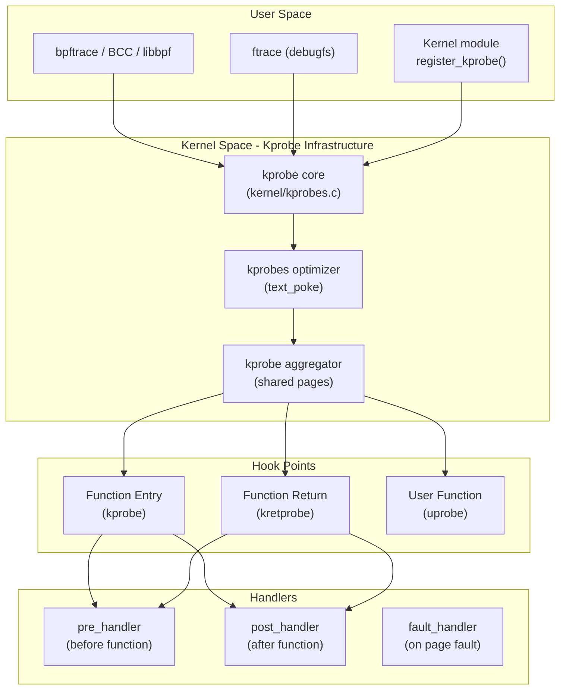
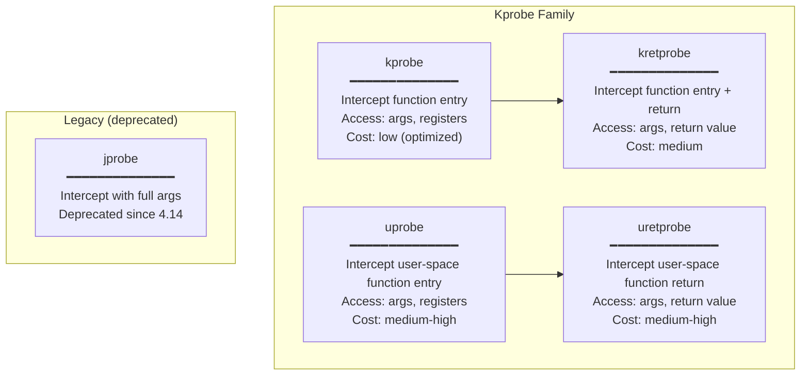
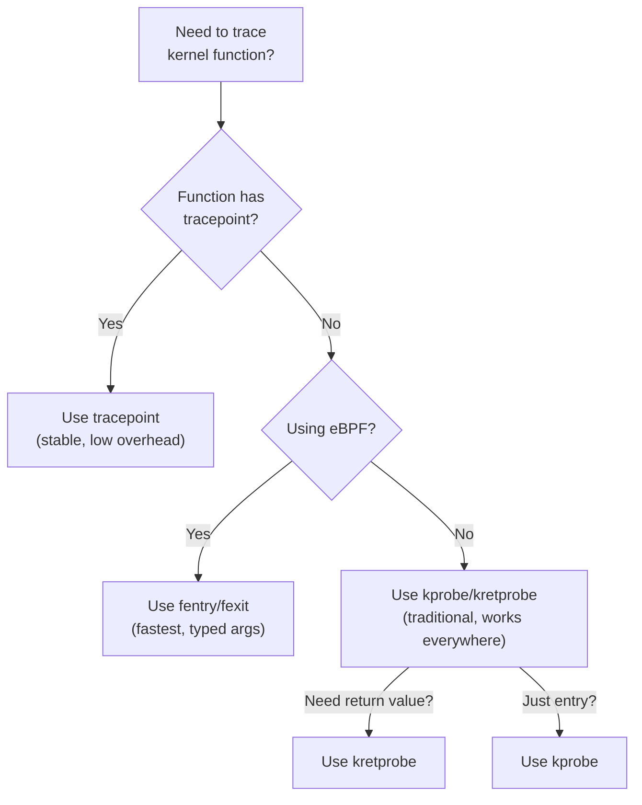

# Kprobes

## Introduction

Kprobes (kernel probes) is a dynamic tracing mechanism that allows you to intercept virtually any kernel function call at runtime. Unlike tracepoints (which are statically placed by kernel developers), kprobes can probe **any** kernel function—even internal ones not exported to modules.

Kprobes are essential for debugging kernel issues, understanding internal behavior, and tracing functions that don't have tracepoints. Combined with eBPF, kprobes form the backbone of modern Linux observability.

## Architecture Overview



### How Kprobes Work Internally

When you register a kprobe on a kernel function:

1. **Instruction replacement**: The kernel saves the original instruction at the probe address and replaces it with a breakpoint instruction (`int3` on x86, `brk` on ARM64).
2. **Trap handler**: When the CPU executes the breakpoint, it traps into the kernel's breakpoint handler.
3. **Pre-handler execution**: The handler looks up the kprobe for that address and calls the registered `pre_handler`.
4. **Single-step**: The original instruction is executed (either via hardware single-step or an emulation).
5. **Post-handler execution**: The `post_handler` is called after the original instruction.
6. **Resume**: Normal execution continues.

For **optimized kprobes** (when the instruction at the probe point is a `nop` or `mov r,r`), the kernel replaces it with a `jmp` directly to the handler, avoiding the expensive breakpoint trap.

## Kprobe Types



### kprobe

A **kprobe** intercepts execution at the beginning of a kernel function:

```c
// Kprobe handler function
static int handler_pre(struct kprobe *p, struct pt_regs *regs)
{
    // On x86_64, function arguments are in registers:
    // regs->di = first argument
    // regs->si = second argument
    // regs->dx = third argument
    // regs->cx = fourth argument
    // regs->r8 = fifth argument
    // regs->r9 = sixth argument
    printk(KERN_INFO "Function called: %s\n", p->symbol_name);
    return 0;
}

static void handler_post(struct kprobe *p, struct pt_regs *regs,
                         unsigned long flags)
{
    // Called after the probed instruction executes
    // regs->ax = return value on x86_64
}

static struct kprobe kp = {
    .symbol_name = "do_sys_open",
};

static int __init kprobe_init(void)
{
    kp.pre_handler = handler_pre;
    kp.post_handler = handler_post;
    kp.fault_handler = handler_fault;
    int ret = register_kprobe(&kp);
    if (ret < 0) {
        pr_err("register_kprobe failed: %d\n", ret);
        return ret;
    }
    pr_info("kprobe registered at %p\n", kp.addr);
    return 0;
}

static void __exit kprobe_exit(void)
{
    unregister_kprobe(&kp);
    pr_info("kprobe unregistered\n");
}
```

### kretprobe

A **kretprobe** intercepts both function entry and return, capturing the return value:

```c
static int handler_entry(struct kretprobe_instance *ri, struct pt_regs *regs)
{
    // Called at function entry
    // Can store data in ri->data for use in return handler
    unsigned long *start_time = (unsigned long *)ri->data;
    *start_time = ktime_get_ns();
    return 0;
}

static int handler_ret(struct kretprobe_instance *ri, struct pt_regs *regs)
{
    // Called at function return
    // regs_return_value(regs) gets the return value
    unsigned long *start_time = (unsigned long *)ri->data;
    unsigned long duration = ktime_get_ns() - *start_time;
    int ret = regs_return_value(regs);

    printk(KERN_INFO "do_sys_open returned: %d (took %lu ns)\n",
           ret, duration);
    return 0;
}

static struct kretprobe krp = {
    .kp.symbol_name = "do_sys_open",
    .handler = handler_ret,
    .entry_handler = handler_entry,
    .data_size = sizeof(unsigned long),  // size of per-instance data
    .maxactive = 20,  // max concurrent instances (0 = num_possible_cpus * 2)
};

static int __init kretprobe_init(void)
{
    int ret = register_kretprobe(&krp);
    if (ret < 0) {
        pr_err("register_kretprobe failed: %d\n", ret);
        return ret;
    }
    pr_info("kretprobe registered at %p\n", krp.kp.addr);
    return 0;
}
```

The `maxactive` parameter controls how many concurrent instances can exist. When a function is called while all instances are busy, the kretprobe is silently skipped for that call. Setting it to 0 uses the default of `num_possible_cpus() * 2`.

### Uprobes: User-Space Probes

Uprobes extend the kprobe mechanism to user-space applications. They can probe any instruction in any shared library or executable:

```bash
# Using bpftrace (simplest approach)
bpftrace -e 'uprobe:/usr/lib/libc.so.6:open { printf("open(%s)\n", str(arg0)); }'

# Using ftrace
echo 'p:myuprobe /usr/lib/libc.so.6:open' > /sys/kernel/debug/tracing/uprobe_events
echo 1 > /sys/kernel/debug/tracing/events/uprobes/myuprobe/enable
cat /sys/kernel/debug/tracing/trace_pipe
```

### uretprobes

Uretprobes capture the return value of user-space functions:

```bash
# Using bpftrace
bpftrace -e '
uprobe:/usr/lib/libc.so.6:malloc {
    @start[tid] = nsecs;
}
uretprobe:/usr/lib/libc.so.6:malloc /@start[tid]/ {
    $dur = nsecs - @start[tid];
    printf("malloc(%d) = %p (%d ns)\n", arg0, retval, $dur);
    delete(@start[tid]);
}'
```

## Using Kprobes with ftrace

### Listing Available Functions

```bash
# List all kernel functions available for kprobes
cat /sys/kernel/debug/tracing/available_filter_functions | wc -l
# 65432

# Show first 20 functions
cat /sys/kernel/debug/tracing/available_filter_functions | head -20
# __traceiter_initcall_level
# __traceiter_initcall_start
# __traceiter_cpuhp_enter
# __traceiter_cpuhp_exit
# do_sys_open
# do_sys_openat2
# __x64_sys_openat
# vfs_read
# vfs_write
# tcp_connect
# tcp_sendmsg

# Search for specific functions
cat /sys/kernel/debug/tracing/available_filter_functions | grep -i "open"
# do_sys_open
# do_sys_openat2
# __x64_sys_openat
# ...

# Count functions matching a pattern
cat /sys/kernel/debug/tracing/available_filter_functions | grep -c "tcp_"
# 87

# List kprobe blacklist (functions that cannot be probed)
cat /sys/kernel/debug/tracing/kprobes_blacklist | head -10
# ffffffff81000000 ffffffff81000050 __switch_to
# ffffffff81000100 ffffffff81000200 native_flush_tlb_one_user
```

### Setting Kprobes via ftrace

```bash
# ──── Add a kprobe ────
# Syntax: p[:EVENT] [MOD:]SYM[+0xOFFS]|MEM_ADDR [FETCHARGS]
echo 'p:myprobe do_sys_open dfd=%di filename=%si flags=%dx mode=%cx' \
    > /sys/kernel/debug/tracing/kprobe_events

# Add a kprobe with string dereference
echo 'p:myprobe2 do_sys_openat2 dfd=%di filename=+0(%si):string flags=%dx' \
    > /sys/kernel/debug/tracing/kprobe_events

# Add a kretprobe
echo 'r:myret do_sys_open ret=$retval' \
    > /sys/kernel/debug/tracing/kprobe_events

# Add kprobe with stack trace
echo 'p:myprobe3 do_sys_open' \
    > /sys/kernel/debug/tracing/kprobe_events

# ──── Enable the kprobe ────
echo 1 > /sys/kernel/debug/tracing/events/kprobes/myprobe/enable

# ──── View events ────
cat /sys/kernel/debug/tracing/trace_pipe | head -10
# cat-1234  [000] d... 12345.678901: myprobe: (do_sys_open+0x0/0x100)
#              dfd=0xffffff9c filename=0x7fff5678 flags=0x0 mode=0x0

# View with stack traces
echo 1 > /sys/kernel/debug/tracing/options/stacktrace
cat /sys/kernel/debug/tracing/trace_pipe | head -30

# ──── Disable ────
echo 0 > /sys/kernel/debug/tracing/events/kprobes/myprobe/enable

# ──── Remove kprobe ────
echo -:myprobe >> /sys/kernel/debug/tracing/kprobe_events
echo -:myret >> /sys/kernel/debug/tracing/kprobe_events
```

### kprobe Event Format

```bash
# View kprobe event format
cat /sys/kernel/debug/tracing/events/kprobes/myprobe/format
# name: myprobe
# ID: 1234
# format:
#   field:unsigned short common_type;       offset:0;  size:2;
#   field:unsigned char common_flags;       offset:2;  size:1;
#   field:unsigned char common_preempt_count; offset:3; size:1;
#   field:int common_pid;                  offset:4;  size:4;
#
#   field:unsigned long __probe_ip;        offset:8;  size:8;
#   field:int dfd;                         offset:16; size:8;
#   field:char * filename;                offset:24; size:8;
#   field:int flags;                      offset:32; size:8;
#   field:int mode;                       offset:40; size:8;
#
# print fmt: "(%p) dfd=0x%lx filename=0x%lx flags=0x%lx mode=0x%lx", ...
```

### Fetch Arguments Reference

The ftrace kprobe syntax supports rich argument fetching:

```bash
# Register arguments (x86_64 ABI)
%di    # 1st argument
%si    # 2nd argument
%dx    # 3rd argument
%cx    # 4th argument
%r8    # 5th argument
%r9    # 6th argument
%ax    # Return value (for kretprobe: $retval)

# Memory dereference
+0(%si)          # Dereference pointer at offset 0 from %si
+4(%si):x32      # Read 32-bit value at offset 4
+0(%si):string   # Read null-terminated string

# Sizes
:x8     # 8-bit
:x16    # 16-bit
:x32    # 32-bit
:x64    # 64-bit (default for registers)
:s64    # Signed 64-bit

# Special
$retval          # Return value (kretprobe only)
+0(%si):string   # Read string from pointer
+0(%si):symbol   # Resolve kernel symbol
```

## Using Kprobes with bpftrace

### Basic Kprobe Tracing

```bash
# Trace a kernel function with arguments
bpftrace -e 'kprobe:do_sys_openat2 { printf("open: %s\n", str(arg1)); }'

# Count function calls by process
bpftrace -e 'kprobe:vfs_read { @[comm] = count(); }'

# Function latency with kretprobe
bpftrace -e '
kprobe:ext4_file_read { @start[tid] = nsecs; }
kretprobe:ext4_file_read /@start[tid]/ {
    @us = hist((nsecs - @start[tid]) / 1000);
    delete(@start[tid]);
}'

# Trace with kernel stack trace
bpftrace -e 'kprobe:vfs_read { @[kstack] = count(); }'
```

### Network Function Tracing

```bash
# Trace TCP connect with destination IP and port
bpftrace -e '
kprobe:tcp_connect {
    $sk = (struct sock *)arg0;
    printf("TCP connect: %s -> %s:%d\n",
        ntop($sk->__sk_common.skc_family, $sk->__sk_common.skc_rcv_saddr),
        ntop($sk->__sk_common.skc_family, $sk->__sk_common.skc_daddr),
        ntohs($sk->__sk_common.skc_dport));
}'

# Count TCP retransmissions by process
bpftrace -e 'kprobe:tcp_retransmit_skb { @[comm, kstack] = count(); }'

# Trace socket creation
bpftrace -e '
kprobe:__sys_socket {
    printf("socket(%d, %d, %d) by %s[%d]\n",
        arg0, arg1, arg2, comm, pid);
}'
```

### File System Tracing

```bash
# Trace all file opens with path
bpftrace -e '
kprobe:do_sys_openat2 {
    printf("%-16s %-6d %s\n", comm, pid, str(arg1));
}'
# cat             1234   /etc/hostname
# nginx           5678   /var/log/nginx/access.log
# mysqld          9012   /var/lib/mysql/ibdata1

# Trace VFS read/write with file info
bpftrace -e '
kprobe:vfs_read {
    $file = (struct file *)arg0;
    printf("%-16s %-6d read %s\n", comm, pid,
        str($file->f_path.dentry->d_name.name));
}'

# Trace ext4 operations with latency
bpftrace -e '
kprobe:ext4_file_write_iter { @start[tid] = nsecs; }
kretprobe:ext4_file_write_iter /@start[tid]/ {
    @lat_us = hist((nsecs - @start[tid]) / 1000);
    delete(@start[tid]);
}'
```

### Memory Tracing

```bash
# Trace large kmalloc allocations
bpftrace -e '
kprobe:__kmalloc /arg0 > 1048576/ {
    printf("%-16s %-6d alloc %d bytes\n", comm, pid, arg0);
}'

# Trace page allocations with order
bpftrace -e '
kprobe:__alloc_pages {
    printf("%-16s order=%d gfp=0x%x\n", comm, arg1, arg0);
}'

# Track memory allocation sizes
bpftrace -e '
kprobe:__kmalloc {
    @bytes[comm] = sum(arg0);
    @count[comm] = count();
}'
```

### Scheduler Tracing

```bash
# Trace context switches with reason
bpftrace -e '
kprobe:schedule {
    @[kstack] = count();
}'

# Trace wakeups
bpftrace -e '
kprobe:try_to_wake_up {
    @wakeup_by[comm] = count();
}'
```

## Using Kprobes with BCC

```bash
# Install BCC tools (Debian/Ubuntu)
apt install bpfcc-tools

# Install BCC tools (RHEL/Fedora)
yum install bcc-tools

# ──── Ready-made kprobe tools ────

# Trace file opens
opensnoop-bpfcc
# PID    COMM               FD ERR PATH
# 1234   nginx               5   0 /etc/nginx/nginx.conf
# 5678   mysqld              3   0 /var/lib/mysql/ibdata1

# Trace new processes
execsnoop-bpfcc
# PCOMM            PID    PPID   RET ARGS
# ls               5678   1234     0 /bin/ls -la
# cat              9012   1234     0 /etc/hostname

# Trace TCP connections
tcpconnect-bpfcc
# PID    COMM         IP SADDR            DADDR            DPORT
# 1234   curl         4  192.168.1.1      93.184.216.34    443

# Trace block I/O with latency
biolatency-bpfcc
# Tracing block device I/O... Hit Ctrl-C to end.
# ^C
#      usecs          : count    distribution
#         0 -> 1      : 0       |                                        |
#         2 -> 3      : 1234    |*********                               |
#         4 -> 7      : 5678    |****************************************|

# Trace VFS operations
filetop-bpfcc
# PID    COMM             READS  WRITES R_Kb    W_Kb    T FILE
# 1234   mysqld           567    0      2345    0       R ibdata1

# Function latency histogram
funclatency-bpfcc -i 1 vfs_read
# Tracing vfs_read... Hit Ctrl-C to end.
#      usecs          : count    distribution
#         0 -> 1      : 2345    |****************************************|
#         2 -> 3      : 1234    |********************                    |
#         4 -> 7      : 567     |**********                              |
```

## Kprobes vs Tracepoints

| Feature | Kprobes | Tracepoints | fentry/fexit |
|---------|---------|-------------|--------------|
| **Stability** | Function may change | Stable API (maintained) | Function may change |
| **Coverage** | Any kernel function | Only defined points | Most kernel functions |
| **Overhead** | Slightly higher | Lower | Lowest (trampoline) |
| **Arguments** | Must know register layout | Well-defined schema | Typed arguments |
| **Maintenance** | May break on kernel update | Maintained by developers | May break on kernel update |
| **Blacklist** | Some functions blocked | N/A | Fewer restrictions |
| **Best for** | Debugging, exploration | Production monitoring | BPF-based tracing |

### When to Use Which



## Kprobe Module Example: Complete Tracer

```c
// kprobe_example.c — Trace open() calls with timing
#include <linux/kernel.h>
#include <linux/module.h>
#include <linux/kprobes.h>
#include <linux/ktime.h>

static struct kretprobe open_kretprobe;

struct open_data {
    ktime_t start;
    char filename[256];
};

/* Entry handler: record start time */
static int entry_handler(struct kretprobe_instance *ri, struct pt_regs *regs)
{
    struct open_data *data = (struct open_data *)ri->data;
    data->start = ktime_get();

    /* Copy filename from userspace (arg1 on x86_64) */
    if (strncpy_from_user(data->filename,
                          (const char __user *)regs->si,
                          sizeof(data->filename) - 1) < 0)
        data->filename[0] = '\0';

    return 0;
}

/* Return handler: calculate duration */
static int ret_handler(struct kretprobe_instance *ri, struct pt_regs *regs)
{
    struct open_data *data = (struct open_data *)ri->data;
    s64 duration_us = ktime_us_delta(ktime_get(), data->start);
    int ret = regs_return_value(regs);

    if (duration_us > 1000) {  /* Log only slow opens (>1ms) */
        pr_info("slow open: %s -> fd=%d (%lld us)\n",
                data->filename, ret, duration_us);
    }
    return 0;
}

static struct kretprobe open_kretprobe = {
    .kp.symbol_name = "do_sys_openat2",
    .handler = ret_handler,
    .entry_handler = entry_handler,
    .data_size = sizeof(struct open_data),
    .maxactive = 64,
};

static int __init tracer_init(void)
{
    int ret = register_kretprobe(&open_kretprobe);
    if (ret < 0) {
        pr_err("Failed to register kretprobe: %d\n", ret);
        return ret;
    }
    pr_info("Open tracer loaded\n");
    return 0;
}

static void __exit tracer_exit(void)
{
    unregister_kretprobe(&open_kretprobe);
    pr_info("Open tracer unloaded\n");
}

module_init(tracer_init);
module_exit(tracer_exit);
MODULE_LICENSE("GPL");
MODULE_DESCRIPTION("Slow open() tracer using kretprobe");
```

## Uprobes: User-Space Probing

### Using ftrace for Uprobes

```bash
# ──── Trace a user-space function ────
# Add uprobe event
echo 'p:myuprobe /usr/lib/libc.so.6:open' \
    > /sys/kernel/debug/tracing/uprobe_events

# Enable
echo 1 > /sys/kernel/debug/tracing/events/uprobes/myuprobe/enable

# View
cat /sys/kernel/debug/tracing/trace_pipe
# bash-1234  [000] .... 12345.678901: myuprobe: (0x7f1234567890)

# Remove
echo -:myuprobe >> /sys/kernel/debug/tracing/uprobe_events
```

### Using bpftrace for Uprobes

```bash
# Trace C library open() with filename
bpftrace -e '
uprobe:/usr/lib/libc.so.6:open {
    printf("open(%s) by %s[%d]\n", str(arg0), comm, pid);
}'

# Trace bash readline
bpftrace -e '
uprobe:/usr/bin/bash:readline {
    printf("bash readline: pid=%d\n", pid);
}'

# Trace malloc with size and latency
bpftrace -e '
uprobe:/usr/lib/libc.so.6:malloc {
    @start[tid] = nsecs;
    @size[tid] = arg0;
}
uretprobe:/usr/lib/libc.so.6:malloc /@start[tid]/ {
    printf("malloc(%d) = %p (%d ns)\n", @size[tid], retval,
           nsecs - @start[tid]);
    delete(@start[tid]);
    delete(@size[tid]);
}'

# Trace SSL writes (encrypted content)
bpftrace -e '
uprobe:/usr/lib/libssl.so.3:SSL_write {
    printf("SSL_write fd=%d len=%d by %s[%d]\n",
        arg0, arg2, comm, pid);
}'
```

### Uprobe Limitations

- Requires debug symbols or symbol table for function addresses
- Higher overhead than kprobes (page fault on first hit)
- Cannot probe stripped binaries without symbol information
- PID namespace filtering may be needed for system-wide probes

## ftrace Integration

### Function Tracing

```bash
# ──── Function tracer ────
echo function > /sys/kernel/debug/tracing/current_tracer
echo 'do_sys_open' > /sys/kernel/debug/tracing/set_ftrace_filter
echo 1 > /sys/kernel/debug/tracing/tracing_on
cat /sys/kernel/debug/tracing/trace_pipe | head -20

# ──── Function graph tracer (shows call tree) ────
echo function_graph > /sys/kernel/debug/tracing/current_tracer
echo 'do_sys_open' > /sys/kernel/debug/tracing/set_graph_function
cat /sys/kernel/debug/tracing/trace_pipe | head -30
#  CPU)               |  do_sys_open() {
#  CPU)               |    do_filp_open() {
#  CPU)               |      path_openat() {
#  CPU)   1.234 us    |        getname_flags();
#  CPU)               |        link_path_walk() {
#  CPU)   0.567 us    |          inode_permission();
#  CPU)   0.123 us    |          walk_component();
#  CPU)   2.345 us    |        }
#  CPU)   5.678 us    |      }
#  CPU)   7.890 us    |    }
#  CPU)   9.012 us    |  }

# ──── Filters ────
echo 'vfs_*' > /sys/kernel/debug/tracing/set_ftrace_filter  # by name
echo 1234 > /sys/kernel/debug/tracing/set_ftrace_pid        # by PID
echo 0 > /sys/kernel/debug/tracing/tracing_cpu              # by CPU

# ──── Function latency tracking ────
echo function_graph > /sys/kernel/debug/tracing/current_tracer
echo 1000 > /sys/kernel/debug/tracing/tracing_thresh  # only > 1µs
```

## Practical Real-World Examples

### Example 1: Debugging Slow File I/O

```bash
# Step 1: Find which process has high I/O
iotop -aoP
#   PID  PRIO  USER     DISK READ  DISK WRITE  COMMAND
#  1234  be/4  mysql    450.00 M/s  180.00 M/s  mysqld

# Step 2: Trace the specific I/O operations
bpftrace -e '
kprobe:vfs_read /pid == 1234/ {
    @start[tid] = nsecs;
    @file[tid] = str(((struct file *)arg0)->f_path.dentry->d_name.name);
}
kretprobe:vfs_read /@start[tid]/ {
    $dur = (nsecs - @start[tid]) / 1000;
    @slow_reads[@file[tid]] = hist($dur);
    delete(@start[tid]);
    delete(@file[tid]);
}'

# Step 3: Identify the slow file
# @slow_reads[ibdata1]:
# [0, 1)         1234 |****************************************|
# [1, 2)          567 |********************                    |
# [2, 4)          234 |**********                              |
# [4, 8)          123 |*****                                   |
# [8, 16)          56 |***                                     |
# [16, 32)         12 |*                                       |
```

### Example 2: Tracing Network Connection Failures

```bash
# Trace TCP connect failures
bpftrace -e '
kprobe:tcp_connect {
    @start[pid] = nsecs;
}
kretprobe:tcp_connect /@start[pid]/ {
    $ret = retval;
    if ($ret != 0) {
        printf("FAIL: %s[%d] tcp_connect returned %d (%d us)\n",
            comm, pid, $ret, (nsecs - @start[pid]) / 1000);
    }
    delete(@start[pid]);
}'

# Trace DNS resolution failures
bpftrace -e '
kprobe:getaddrinfo {
    @start[tid] = nsecs;
}
kretprobe:getaddrinfo /@start[tid]/ {
    if (retval != 0) {
        printf("DNS FAIL: %s[%d] getaddrinfo returned %d (%d us)\n",
            comm, pid, retval, (nsecs - @start[tid]) / 1000);
    }
    delete(@start[tid]);
}'
```

### Example 3: Memory Leak Investigation

```bash
# Track kmalloc/kfree imbalance
bpftrace -e '
kprobe:__kmalloc {
    @allocs[arg0, kstack] = count();
    @alloc_bytes[comm] = sum(arg0);
}
kprobe:kfree {
    @frees[kstack] = count();
}'

# After running, compare @allocs vs @frees to find unmatched allocations

# Track page allocation by process
bpftrace -e '
kprobe:__alloc_pages {
    @pages[comm] = count();
    @order[comm] = lhist(arg1, 0, 10, 1);  # allocation order
}'
```

### Example 4: Kernel Function Call Graph

```bash
# Trace a function and all its callees (using function_graph)
echo function_graph > /sys/kernel/debug/tracing/current_tracer
echo 'tcp_sendmsg' > /sys/kernel/debug/tracing/set_graph_function
echo 1 > /sys/kernel/debug/tracing/tracing_on
cat /sys/kernel/debug/tracing/trace_pipe
#  CPU)               |  tcp_sendmsg() {
#  CPU)               |    lock_sock_nested() {
#  CPU)   0.123 us    |      _raw_spin_lock_bh();
#  CPU)   0.456 us    |    }
#  CPU)               |    tcp_push() {
#  CPU)               |      __tcp_push_pending_frames() {
#  CPU)   0.789 us    |        tcp_write_xmit();
#  CPU)   1.234 us    |      }
#  CPU)   1.567 us    |    }
#  CPU)   2.345 us    |  }
```

## Kprobe Limitations and Pitfalls

### Functions That Cannot Be Probed

```bash
# Check kprobe blacklist
cat /sys/kernel/debug/tracing/kprobes_blacklist

# Common blacklisted functions:
# - __switch_to (context switch, too sensitive)
# - Functions in entry/exit code paths
# - Functions with inline assembly that breaks single-step
# - Functions marked with NOKPROBE_SYMBOL()
```

### Inlined Functions

Functions marked `inline` or `__always_inline` by the compiler don't exist as separate symbols. The compiler may also inline small functions even without explicit marking. You cannot probe inlined functions.

```bash
# Check if a function exists in the symbol table
grep "do_sys_open" /proc/kallsyms
# ffffffff81234567 T do_sys_open

# If not found, it may be inlined
```

### Kernel Version Stability

Kprobes hook into specific function addresses. When the kernel is updated:
- Function signatures may change (different arguments)
- Functions may be renamed or removed
- Inlining decisions may change
- Always verify function existence on the target kernel

### Overhead Considerations

| Probe Type | Overhead per Hit | Notes |
|------------|-----------------|-------|
| Optimized kprobe | ~0.5 µs | When instruction can be replaced with jmp |
| Regular kprobe | ~2-5 µs | Uses int3 breakpoint trap |
| kretprobe | ~3-8 µs | Entry + return handling |
| uprobe | ~5-20 µs | Page fault on first access, then fast |

## Advanced: Kprobes with eBPF (fentry/fexit)

Modern kernels (5.5+) support `fentry` and `fexit` BPF program types, which are faster alternatives to kprobes for BPF-based tracing:

```c
// fentry program (attached via libbpf)
SEC("fentry/vfs_read")
int BPF_PROG(trace_vfs_read_entry, struct file *file, char *buf,
             size_t count, loff_t *pos)
{
    // Typed arguments — no register decoding needed
    bpf_printk("vfs_read: %s count=%zu\n",
               file->f_path.dentry->d_name.name, count);
    return 0;
}

// fexit program (with return value)
SEC("fexit/vfs_read")
int BPF_PROG(trace_vfs_read_exit, struct file *file, char *buf,
             size_t count, loff_t *pos, ssize_t ret)
{
    // ret is the return value
    if (ret < 0)
        bpf_printk("vfs_read failed: %zd\n", ret);
    return 0;
}
```

### fentry vs kprobe (BPF)

| Aspect | kprobe (BPF) | fentry/fexit (BPF) |
|--------|-------------|-------------------|
| Kernel version | 4.18+ | 5.5+ |
| Arguments | Raw registers (arg0..arg5) | Typed parameters |
| Overhead | ~2-5 µs | ~0.3-1 µs |
| Attachment | Kallsyms lookup | BTF-based |
| CO-RE support | Limited | Full |

## References

- [Kprobes Documentation](https://www.kernel.org/doc/html/latest/trace/kprobes.html)
- [ftrace Documentation](https://www.kernel.org/doc/html/latest/trace/ftrace.html)
- [Kprobes Whitepaper](https://www.kernel.org/doc/html/latest/trace/kprobes.html)
- Gregg, B. *BPF Performance Tools: Linux System and Application Observability* (2019).

## Further Reading

- [The Linux Kernel Documentation](https://docs.kernel.org/)
- [LWN.net - Linux and free software news](https://lwn.net/)
- [GNU Project Documentation](https://www.gnu.org/doc/doc.html)
- [GNU Manuals](https://www.gnu.org/manual/manual.html)
- [Free Software Directory](https://directory.fsf.org/wiki/Main_Page)
- [Planet GNU](https://planet.gnu.org/)
- [Free Software Books](https://www.gnu.org/doc/other-free-books.html)

- <https://www.kernel.org/doc/html/latest/trace/kprobes.html> — Kernel kprobes documentation
- <https://man7.org/linux/man-pages/man2/perf_event_open.2.html> — perf_event_open
- <https://lwn.net/Articles/132196/> — Kprobes introduction (LWN)
- <https://www.brendangregg.com/ebpf.html> — eBPF tracing tools
- <https://github.com/bpftrace/bpftrace> — bpftrace on GitHub
- <https://github.com/iovisor/bcc> — BCC on GitHub

## Related Topics

- [Observability Overview](overview.md)
- [BPF and bpftrace](bpf-bpftrace.md)
- [Tracepoints](tracepoints.md)
- [ftrace](../debugging/ftrace.md)
- [eBPF](../debugging/ebpf.md)
