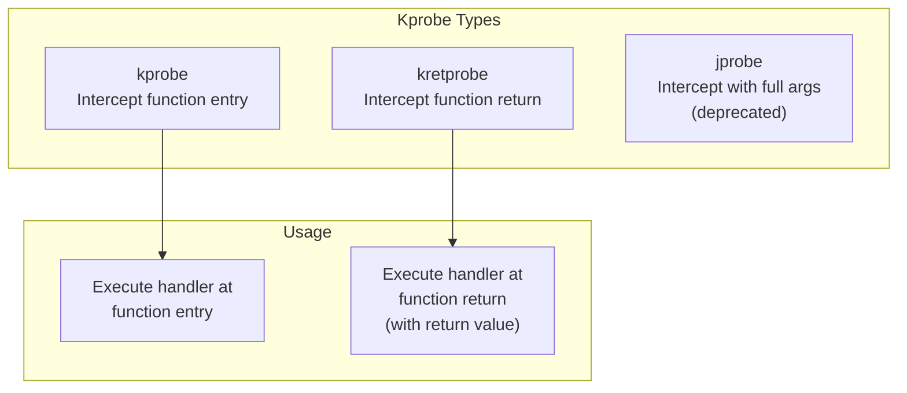

# Kprobes

## Introduction

Kprobes (kernel probes) is a dynamic tracing mechanism that allows you to intercept virtually any kernel function call at runtime. Unlike tracepoints (which are statically placed by kernel developers), kprobes can probe **any** kernel function—even internal ones not exported to modules.

Kprobes are essential for debugging kernel issues, understanding internal behavior, and tracing functions that don't have tracepoints.

## Kprobe Types



### kprobe

A **kprobe** intercepts execution at the beginning of a kernel function:

```c
// Kprobe handler function
static int handler_pre(struct kprobe *p, struct pt_regs *regs)
{
    // regs->di = first argument (x86_64)
    // regs->si = second argument
    // regs->dx = third argument
    printk(KERN_INFO "Function called: %s\n", p->symbol_name);
    return 0;
}

static struct kprobe kp = {
    .symbol_name = "do_sys_open",
};

static int __init kprobe_init(void)
{
    kp.pre_handler = handler_pre;
    register_kprobe(&kp);
    return 0;
}
```

### kretprobe

A **kretprobe** intercepts both function entry and return, capturing the return value:

```c
static int handler_entry(struct kretprobe_instance *ri, struct pt_regs *regs)
{
    // Called at function entry
    return 0;
}

static int handler_ret(struct kretprobe_instance *ri, struct pt_regs *regs)
{
    // Called at function return
    // regs->ax = return value (x86_64)
    int ret = regs_return_value(regs);
    printk(KERN_INFO "Function returned: %d\n", ret);
    return 0;
}

static struct kretprobe krp = {
    .kp.symbol_name = "do_sys_open",
    .handler = handler_ret,
    .entry_handler = handler_entry,
    .maxactive = 20,
};
```

## Using Kprobes with ftrace

### Listing Available Functions

```bash
# List all kernel functions available for kprobes
cat /sys/kernel/debug/tracing/available_filter_functions | head -20
# __traceiter_initcall_level
# __traceiter_initcall_start
# __traceiter_cpuhp_enter
# __traceiter_cpuhp_exit
# do_sys_open
# do_sys_openat2
# __x64_sys_openat
# vfs_read
# vfs_write
# tcp_connect
# tcp_sendmsg

# Search for specific functions
cat /sys/kernel/debug/tracing/available_filter_functions | grep -i "open"
# do_sys_open
# do_sys_openat2
# __x64_sys_openat
# ...
```

### Setting Kprobes via ftrace

```bash
# Add a kprobe for a function
echo 'p:myprobe do_sys_open dfd=%di filename=%si flags=%dx mode=%cx' \
    > /sys/kernel/debug/tracing/kprobe_events

# Add a kretprobe
echo 'r:myret do_sys_open ret=$retval' \
    > /sys/kernel/debug/tracing/kprobe_events

# Enable the kprobe
echo 1 > /sys/kernel/debug/tracing/events/kprobes/myprobe/enable

# View events
cat /sys/kernel/debug/tracing/trace_pipe | head -10
# cat-1234  [000] d... 12345.678901: myprobe: do_sys_open dfd=0xffffff9c filename=0x7fff5678 flags=0x0 mode=0x0

# Disable
echo 0 > /sys/kernel/debug/tracing/events/kprobes/myprobe/enable

# Remove kprobe
echo -:myprobe >> /sys/kernel/debug/tracing/kprobe_events
```

### kprobe Event Format

```bash
# View kprobe event format
cat /sys/kernel/debug/tracing/events/kprobes/myprobe/format
# name: myprobe
# ID: 1234
# format:
# 	field:unsigned short common_type;       offset:0;  size:2;
# 	field:unsigned char common_flags;       offset:2;  size:1;
# 	field:unsigned char common_preempt_count; offset:3; size:1;
# 	field:int common_pid;                  offset:4;  size:4;
#
# 	field:unsigned long __probe_ip;        offset:8;  size:8;
# 	field:int dfd;                         offset:16; size:8;
# 	field:char * filename;                offset:24; size:8;
# 	field:int flags;                      offset:32; size:8;
# 	field:int mode;                       offset:40; size:8;
#
# print fmt: "(%p) dfd=0x%lx filename=0x%lx flags=0x%lx mode=0x%lx", ...
```

## Using Kprobes with bpftrace

```bash
# Trace a kernel function
bpftrace -e 'kprobe:do_sys_openat2 { printf("open: %s\n", str(arg1)); }'

# Count function calls
bpftrace -e 'kprobe:vfs_read { @[comm] = count(); }'

# Function latency with kretprobe
bpftrace -e '
kprobe:ext4_file_read { @start[tid] = nsecs; }
kretprobe:ext4_file_read /@start[tid]/ {
    @us = hist((nsecs - @start[tid]) / 1000);
    delete(@start[tid]);
}'

# Trace with arguments
bpftrace -e '
kprobe:tcp_connect {
    $sk = (struct sock *)arg0;
    printf("TCP connect: %s -> %s:%d\n",
        ntop($sk->__sk_common.skc_family, $sk->__sk_common.skc_rcv_saddr),
        ntop($sk->__sk_common.skc_family, $sk->__sk_common.skc_daddr),
        ntohs($sk->__sk_common.skc_dport));
}'
```

## Kprobes vs Tracepoints

| Feature | Kprobes | Tracepoints |
|---------|---------|-------------|
| Stability | Function may change | Stable API |
| Coverage | Any kernel function | Only defined points |
| Overhead | Slightly higher | Lower |
| Arguments | Must know register layout | Well-defined |
| Maintenance | May break on kernel update | Maintained by developers |
| Best for | Debugging, exploration | Production monitoring |

## Uprobes: User-Space Probes

Uprobes extend kprobes to user-space applications:

```bash
# Trace a user-space function
bpftrace -e '
uprobe:/usr/lib/libc.so.6:open {
    printf("open(%s)\n", str(arg0));
}'

# Trace with bpftrace
bpftrace -e '
uprobe:/usr/bin/bash:readline {
    printf("bash readline: pid=%d\n", pid);
}'

# Using ftrace
echo 'p:myuprobe /usr/bin/bash:readline' > /sys/kernel/debug/tracing/uprobe_events
echo 1 > /sys/kernel/debug/tracing/events/uprobes/myuprobe/enable
cat /sys/kernel/debug/tracing/trace_pipe
```

## ftrace Integration

### Function Tracing

```bash
# Enable function tracer
echo function > /sys/kernel/debug/tracing/current_tracer

# Set filter for specific functions
echo 'do_sys_open' > /sys/kernel/debug/tracing/set_ftrace_filter

# Enable tracing
echo 1 > /sys/kernel/debug/tracing/tracing_on

# View trace
cat /sys/kernel/debug/tracing/trace_pipe | head -20

# Function graph tracer
echo function_graph > /sys/kernel/debug/tracing/current_tracer
echo 'do_sys_open' > /sys/kernel/debug/tracing/set_graph_function
cat /sys/kernel/debug/tracing/trace_pipe | head -30
#  CPU)               |  do_sys_open() {
#  CPU)               |    do_filp_open() {
#  CPU)               |      path_openat() {
#  CPU)   1.234 us    |        getname_flags();
#  CPU)               |        link_path_walk() {
#  CPU)   0.567 us    |          inode_permission();
#  CPU)   0.123 us    |          walk_component();
#  CPU)   2.345 us    |        }
#  CPU)   5.678 us    |      }
#  CPU)   7.890 us    |    }
#  CPU)   9.012 us    |  }
```

### Function Tracing Filters

```bash
# Filter by function name
echo 'vfs_*' > /sys/kernel/debug/tracing/set_ftrace_filter

# Filter by PID
echo 1234 > /sys/kernel/debug/tracing/set_ftrace_pid

# Filter by CPU
echo 0 > /sys/kernel/debug/tracing/tracing_cpu
```

## Practical Examples

### Trace Open Files

```bash
# Trace all file opens with kprobe
bpftrace -e '
kprobe:do_sys_openat2 {
    printf("%-16s %-6d %s\n", comm, pid, str(arg1));
}'
# cat             1234   /etc/hostname
# nginx           5678   /var/log/nginx/access.log
# mysqld          9012   /var/lib/mysql/ibdata1
```

### Trace Network Connections

```bash
# Trace TCP connect with destination
bpftrace -e '
kprobe:tcp_connect {
    $sk = (struct sock *)arg0;
    printf("%-16s %-6d connect -> %s:%d\n",
        comm, pid,
        ntop($sk->__sk_common.skc_daddr),
        ntohs($sk->__sk_common.skc_dport));
}'
```

### Trace Memory Allocation

```bash
# Trace large kmalloc allocations
bpftrace -e '
kprobe:__kmalloc /arg0 > 1048576/ {
    printf("%-16s %-6d alloc %d bytes\n", comm, pid, arg0);
}'
```

## Kprobe Limitations

- Functions must exist in the kernel symbol table
- Inlined functions cannot be probed
- Function signatures may change between kernel versions
- Some functions are blacklisted for safety
- Overhead is higher than tracepoints

## References

- [Kprobes Documentation](https://www.kernel.org/doc/html/latest/trace/kprobes.html)
- [ftrace Documentation](https://www.kernel.org/doc/html/latest/trace/ftrace.html)
- [Kprobes Whitepaper](https://www.kernel.org/doc/html/latest/trace/kprobes.html)

## Further Reading

- <https://www.kernel.org/doc/html/latest/trace/kprobes.html> - Kernel kprobes documentation
- <https://man7.org/linux/man-pages/man2/perf_event_open.2.html> - perf_event_open
- <https://lwn.net/Articles/132196/> - Kprobes introduction

## Related Topics

- [Observability Overview](overview.md)
- [BPF and bpftrace](bpf-bpftrace.md)
- [Tracepoints](tracepoints.md)
