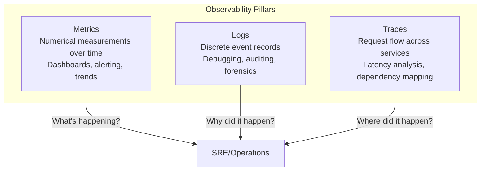
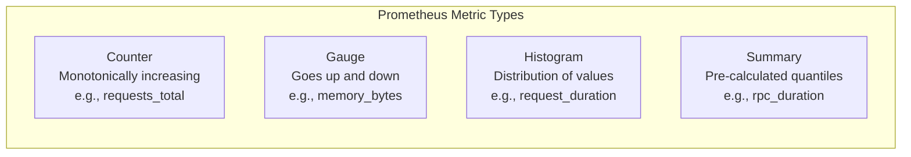
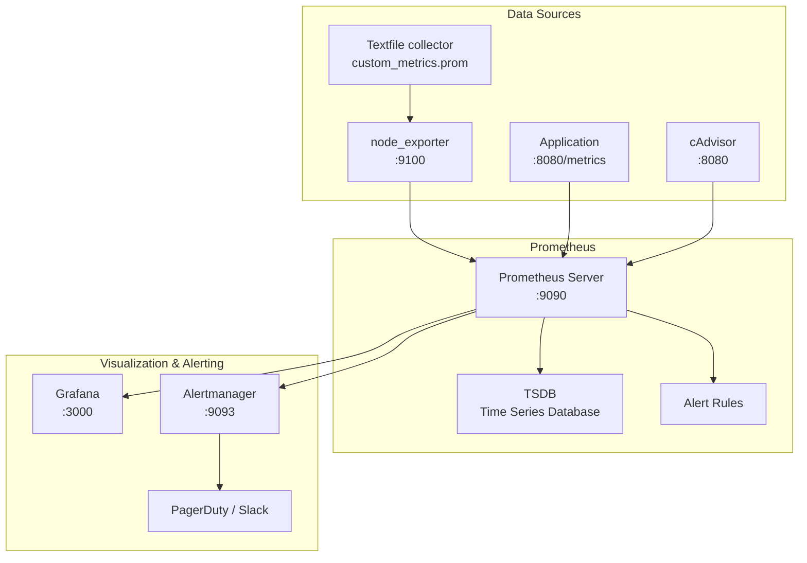

# Metrics Collection

## Introduction

Metrics collection is the foundation of monitoring and observability. Unlike logs (which record discrete events) and traces (which follow individual requests), metrics provide **aggregated numerical measurements** over time. They're efficient to store, fast to query, and ideal for dashboards and alerting.

This chapter covers `node_exporter` for system metrics, the textfile collector for custom metrics, Prometheus exposition format, and advanced metrics patterns.

## The Three Pillars of Observability



| Aspect | Metrics | Logs | Traces |
|--------|---------|------|--------|
| Data type | Numerical (counters, gauges) | Text (structured/unstructured) | Spans with timing |
| Volume | Low (pre-aggregated) | High (per-event) | Medium (per-request) |
| Query | PromQL, SQL | grep, Elasticsearch | Jaeger, Zipkin |
| Storage | TSDB (Prometheus, InfluxDB) | Elasticsearch, Loki | Jaeger, Tempo |
| Best for | Dashboards, alerting | Debugging, auditing | Latency analysis |

## Metrics Data Model

### Metric Types



| Type | Description | Example | Reset Behavior |
|------|-------------|---------|----------------|
| counter | Monotonically increasing value | `http_requests_total` | Resets to 0 on restart |
| gauge | Value that can go up or down | `memory_usage_bytes` | No reset |
| histogram | Distribution of values in buckets | `http_request_duration_seconds` | Resets on restart |
| summary | Similar to histogram, calculated quantiles | `rpc_duration_seconds` | Resets on restart |

### Labels and Dimensions

```bash
# Labels add dimensions to metrics
# Without labels:
http_requests_total 12345

# With labels:
http_requests_total{method="GET", endpoint="/api/users", status="200"} 12345
http_requests_total{method="POST", endpoint="/api/users", status="201"} 678
http_requests_total{method="GET", endpoint="/api/users", status="500"} 3

# Label cardinality matters:
# Good: endpoint="/api/users" (hundreds of endpoints)
# Bad: user_id="12345" (millions of users → high cardinality)
```

### Naming Conventions

```bash
# Prometheus naming: snake_case with unit suffix
# Good:
node_cpu_seconds_total
http_request_duration_seconds
disk_reads_completed_total
memory_usage_bytes

# Bad:
nodeCpuSecondsTotal    # camelCase
http_request_duration  # missing unit
diskReadsCompleted     # camelCase
mem_usage              # abbreviated
```

## node_exporter

`node_exporter` is the standard Prometheus exporter for Linux system metrics. It reads from `/proc`, `/sys`, and other kernel interfaces to expose hundreds of metrics.

### Installation and Configuration

```bash
# Download and install
wget https://github.com/prometheus/node_exporter/releases/download/v1.7.0/node_exporter-1.7.0.linux-amd64.tar.gz
tar xvf node_exporter-1.7.0.linux-amd64.tar.gz
cp node_exporter-1.7.0.linux-amd64/node_exporter /usr/local/bin/

# Create systemd service
cat > /etc/systemd/system/node_exporter.service << 'EOF'
[Unit]
Description=Node Exporter
After=network.target

[Service]
Type=simple
User=node_exporter
ExecStart=/usr/local/bin/node_exporter \
    --collector.cpu \
    --collector.meminfo \
    --collector.diskstats \
    --collector.filesystem \
    --collector.netdev \
    --collector.loadavg \
    --collector.textfile.directory=/var/lib/node_exporter/textfile_collector
Restart=always

[Install]
WantedBy=multi-user.target
EOF

# Create user and enable
useradd --no-create-home --shell /bin/false node_exporter
systemctl daemon-reload
systemctl enable node_exporter
systemctl start node_exporter
```

### Available Collectors

```bash
# List all collectors
node_exporter --collectors.enabled
# cpu
# diskstats
# filesystem
# loadavg
# meminfo
# netdev
# netstat
# textfile
# ...

# Disable specific collectors
node_exporter --no-collector.wifi --no-collector.infiniband

# Enable specific collectors
node_exporter --collector.cpu --collector.meminfo --collector.diskstats
```

### Exposed Metrics

```bash
# View all metrics
curl -s http://localhost:9100/metrics | head -50
# HELP node_cpu_seconds_total Seconds the CPUs spent in each mode.
# TYPE node_cpu_seconds_total counter
# node_cpu_seconds_total{cpu="0",mode="idle"} 123456.78
# node_cpu_seconds_total{cpu="0",mode="system"} 23456.78
# node_cpu_seconds_total{cpu="0",mode="user"} 56789.01
#
# HELP node_memory_MemAvailable_bytes Memory information field MemAvailable_bytes.
# TYPE node_memory_MemAvailable_bytes gauge
# node_memory_MemAvailable_bytes 1.9922944e+10
#
# HELP node_disk_reads_completed_total The total number of reads completed successfully.
# TYPE node_disk_reads_completed_total counter
# node_disk_reads_completed_total{device="sda"} 123456
#
# HELP node_filesystem_size_bytes Filesystem size in bytes.
# TYPE node_filesystem_size_bytes gauge
# node_filesystem_size_bytes{device="/dev/sda1",fstype="ext4",mountpoint="/"} 5.36870912e+11
```

### Key Metrics Categories

```bash
# CPU metrics
curl -s http://localhost:9100/metrics | grep node_cpu
# node_cpu_seconds_total{cpu="0",mode="idle"} 123456.78
# node_cpu_seconds_total{cpu="0",mode="iowait"} 1234.56
# node_cpu_seconds_total{cpu="0",mode="irq"} 12.34
# node_cpu_seconds_total{cpu="0",mode="nice"} 0
# node_cpu_seconds_total{cpu="0",mode="softirq"} 56.78
# node_cpu_seconds_total{cpu="0",mode="steal"} 0
# node_cpu_seconds_total{cpu="0",mode="system"} 23456.78
# node_cpu_seconds_total{cpu="0",mode="user"} 56789.01

# Memory metrics
curl -s http://localhost:9100/metrics | grep node_memory
# node_memory_MemTotal_bytes 3.4359738368e+10
# node_memory_MemFree_bytes 2.048576e+09
# node_memory_MemAvailable_bytes 1.9922944e+10
# node_memory_Buffers_bytes 6.5432e+08
# node_memory_Cached_bytes 1.823456e+10
# node_memory_SwapTotal_bytes 8.589934592e+09
# node_memory_SwapFree_bytes 8.589934592e+09
# node_memory_Dirty_bytes 1.23456e+08

# Disk metrics
curl -s http://localhost:9100/metrics | grep node_disk
# node_disk_reads_completed_total{device="sda"} 123456
# node_disk_read_bytes_total{device="sda"} 1.2345678e+10
# node_disk_writes_completed_total{device="sda"} 567890
# node_disk_write_bytes_total{device="sda"} 4.5678901e+10
# node_disk_io_time_seconds_total{device="sda"} 6789.01

# Network metrics
curl -s http://localhost:9100/metrics | grep node_network
# node_network_receive_bytes_total{device="eth0"} 1.2345678901e+10
# node_network_transmit_bytes_total{device="eth0"} 2.3456789012e+10
# node_network_receive_packets_total{device="eth0"} 12345678
# node_network_receive_drop_total{device="eth0"} 1234
```

## Textfile Collector

The textfile collector allows you to expose custom metrics from scripts:

### Setting Up

```bash
# Create textfile directory
mkdir -p /var/lib/node_exporter/textfile_collector
chown node_exporter:node_exporter /var/lib/node_exporter/textfile_collector

# Configure node_exporter to read from it
node_exporter --collector.textfile.directory=/var/lib/node_exporter/textfile_collector
```

### Writing Custom Metrics

```bash
#!/bin/bash
# /usr/local/bin/custom_metrics.sh
# Collect custom metrics and write to textfile

OUTPUT="/var/lib/node_exporter/textfile_collector/custom_metrics.prom"
TEMP="${OUTPUT}.$$"

# MySQL connections
MYSQL_CONN=$(mysql -e "SHOW STATUS LIKE 'Threads_connected';" -N 2>/dev/null | awk '{print $2}')
echo "mysql_connections_total ${MYSQL_CONN:-0}" > "$TEMP"

# MySQL queries per second
MYSQL_QPS=$(mysql -e "SHOW STATUS LIKE 'Queries';" -N 2>/dev/null | awk '{print $2}')
echo "mysql_queries_total ${MYSQL_QPS:-0}" >> "$TEMP"

# Custom application metric
APP_QUEUE=$(curl -s http://localhost:8080/metrics/queue_size 2>/dev/null || echo "0")
echo "app_queue_size ${APP_QUEUE}" >> "$TEMP"

# SSL certificate expiry
for domain in example.com api.example.com; do
    EXPIRY=$(echo | openssl s_client -servername "$domain" -connect "$domain":443 2>/dev/null | \
        openssl x509 -noout -enddate 2>/dev/null | cut -d= -f2)
    if [ -n "$EXPIRY" ]; then
        EXPIRY_EPOCH=$(date -d "$EXPIRY" +%s)
        CURRENT_EPOCH=$(date +%s)
        DAYS_LEFT=$(( (EXPIRY_EPOCH - CURRENT_EPOCH) / 86400 ))
        echo "ssl_certificate_expiry_days{domain=\"${domain}\"} ${DAYS_LEFT}" >> "$TEMP"
    fi
done

# RAID status
if [ -f /proc/mdstat ]; then
    DEGRADED=$(grep -c '\[_\]' /proc/mdstat || echo "0")
    echo "md_array_degraded ${DEGRADED}" >> "$TEMP"
fi

# Move atomically
mv "$TEMP" "$OUTPUT"
```

```bash
# Make executable and schedule
chmod +x /usr/local/bin/custom_metrics.sh
# Add to crontab
echo "*/5 * * * * root /usr/local/bin/custom_metrics.sh" > /etc/cron.d/custom_metrics
```

### Prometheus Exposition Format

```
# HELP mysql_connections_total Current MySQL connections
# TYPE mysql_connections_total gauge
mysql_connections_total 42

# HELP mysql_queries_total Total MySQL queries
# TYPE mysql_queries_total counter
mysql_queries_total 1234567

# HELP app_queue_size Application queue size
# TYPE app_queue_size gauge
app_queue_size 1234

# HELP ssl_certificate_expiry_days Days until SSL certificate expires
# TYPE ssl_certificate_expiry_days gauge
ssl_certificate_expiry_days{domain="example.com"} 45
ssl_certificate_expiry_days{domain="api.example.com"} 12

# HELP md_array_degraded Number of degraded RAID arrays
# TYPE md_array_degraded gauge
md_array_degraded 0
```

## Advanced Textfile Metrics

### Histogram from Script

```bash
#!/bin/bash
# Collect latency histogram from application logs
OUTPUT="/var/lib/node_exporter/textfile_collector/latency_histogram.prom"
TEMP="${OUTPUT}.$$"

# Parse application logs for latency
HIST=$(awk '/latency_ms/ {
    ms = $NF
    if (ms < 10) b1++
    else if (ms < 50) b2++
    else if (ms < 100) b3++
    else if (ms < 500) b4++
    else b5++
    total++
    sum += ms
} END {
    print "# HELP app_request_latency_ms Request latency in milliseconds"
    print "# TYPE app_request_latency_ms histogram"
    print "app_request_latency_ms_bucket{le=\"10\"} " b1
    print "app_request_latency_ms_bucket{le=\"50\"} " b1+b2
    print "app_request_latency_ms_bucket{le=\"100\"} " b1+b2+b3
    print "app_request_latency_ms_bucket{le=\"500\"} " b1+b2+b3+b4
    print "app_request_latency_ms_bucket{le=\"+Inf\"} " total
    print "app_request_latency_ms_sum " sum
    print "app_request_latency_ms_count " total
}' /var/log/app/access.log 2>/dev/null)

echo "$HIST" > "$TEMP"
mv "$TEMP" "$OUTPUT"
```

### Multi-Value Metrics

```bash
#!/bin/bash
# Multiple related metrics in one file
OUTPUT="/var/lib/node_exporter/textfile_collector/raid.prom"
TEMP="${OUTPUT}.$$"

echo "# HELP md_array_info RAID array information" > "$TEMP"
echo "# TYPE md_array_info gauge" >> "$TEMP"

for md in /dev/md*; do
    [ -b "$md" ] || continue
    INFO=$(mdadm --detail "$md" 2>/dev/null)
    LEVEL=$(echo "$INFO" | grep "Raid Level" | awk '{print $NF}')
    STATE=$(echo "$INFO" | grep "State :" | awk '{print $NF}')
    ACTIVE=$(echo "$INFO" | grep "Active Devices" | awk '{print $NF}')
    TOTAL=$(echo "$INFO" | grep "Total Devices" | awk '{print $NF}')
    
    echo "md_array_info{device=\"${md}\",level=\"${LEVEL}\",state=\"${STATE}\"} 1" >> "$TEMP"
    echo "md_array_active_devices{device=\"${md}\"} ${ACTIVE}" >> "$TEMP"
    echo "md_array_total_devices{device=\"${md}\"} ${TOTAL}" >> "$TEMP"
done

mv "$TEMP" "$OUTPUT"
```

## node_exporter Custom Collector

For more complex metrics, write a custom collector in Python:

```python
#!/usr/bin/env python3
# /usr/local/bin/custom_collector.py

import time
import subprocess
import json

def collect():
    """Collect custom metrics."""
    metrics = []
    
    # Docker container stats
    try:
        result = subprocess.run(
            ['docker', 'stats', '--no-stream', '--format', 
             '{{.Name}} {{.CPUPerc}} {{.MemUsage}}'],
            capture_output=True, text=True, timeout=10
        )
        for line in result.stdout.strip().split('\n'):
            parts = line.split()
            if len(parts) >= 2:
                name = parts[0]
                cpu = float(parts[1].rstrip('%'))
                metrics.append(f'docker_cpu_percent{{container="{name}"}} {cpu}')
    except Exception:
        pass
    
    # Write to textfile
    output = '\n'.join(metrics) + '\n'
    with open('/var/lib/node_exporter/textfile_collector/docker.prom', 'w') as f:
        f.write(output)

if __name__ == '__main__':
    while True:
        collect()
        time.sleep(30)
```

## PromQL Query Examples

### Basic Queries

```promql
# CPU usage percentage (rate over 5 minutes)
100 - (avg by(instance) (rate(node_cpu_seconds_total{mode="idle"}[5m])) * 100)

# Memory usage percentage
(1 - node_memory_MemAvailable_bytes / node_memory_MemTotal_bytes) * 100

# Disk usage percentage
(1 - node_filesystem_avail_bytes{mountpoint="/"} / node_filesystem_size_bytes{mountpoint="/"}) * 100

# Network receive rate (bytes/sec)
rate(node_network_receive_bytes_total{device="eth0"}[5m])

# Disk I/O utilization (percentage of time doing I/O)
rate(node_disk_io_time_seconds_total{device="sda"}[5m]) * 100

# Load average (1 minute)
node_load1
```

### Advanced Queries

```promql
# Top 5 processes by CPU usage (requires process_exporter)
topk(5, rate(process_cpu_seconds_total[5m]))

# Memory pressure (available < 10%)
node_memory_MemAvailable_bytes / node_memory_MemTotal_bytes < 0.1

# Disk will be full in 24 hours (predictive)
predict_linear(node_filesystem_avail_bytes{mountpoint="/"}[1h], 24*3600) < 0

# Network error rate
rate(node_network_receive_errs_total{device="eth0"}[5m]) > 0

# Container restart count (Kubernetes)
increase(kube_pod_container_status_restarts_total[1h]) > 3

# P99 latency from histogram
histogram_quantile(0.99, rate(http_request_duration_seconds_bucket[5m]))

# Error rate percentage
sum(rate(http_requests_total{status=~"5.."}[5m])) / sum(rate(http_requests_total[5m])) * 100
```

## Alerting Rules

```yaml
# /etc/prometheus/rules/node_alerts.yml
groups:
  - name: node_alerts
    rules:
      # High CPU usage
      - alert: HighCPUUsage
        expr: 100 - (avg by(instance) (rate(node_cpu_seconds_total{mode="idle"}[5m])) * 100) > 80
        for: 5m
        labels:
          severity: warning
        annotations:
          summary: "High CPU usage on {{ $labels.instance }}"
          description: "CPU usage is above 80% for 5 minutes"

      # Low disk space
      - alert: LowDiskSpace
        expr: (1 - node_filesystem_avail_bytes{mountpoint="/"} / node_filesystem_size_bytes{mountpoint="/"}) * 100 > 90
        for: 5m
        labels:
          severity: critical
        annotations:
          summary: "Low disk space on {{ $labels.instance }}"
          description: "Disk usage is above 90%"

      # High memory usage
      - alert: HighMemoryUsage
        expr: (1 - node_memory_MemAvailable_bytes / node_memory_MemTotal_bytes) * 100 > 90
        for: 5m
        labels:
          severity: warning
        annotations:
          summary: "High memory usage on {{ $labels.instance }}"

      # Network errors
      - alert: NetworkErrors
        expr: rate(node_network_receive_errs_total[5m]) > 0
        for: 10m
        labels:
          severity: warning
        annotations:
          summary: "Network errors on {{ $labels.device }}"

      # Certificate expiring
      - alert: CertificateExpiring
        expr: ssl_certificate_expiry_days < 30
        for: 1d
        labels:
          severity: warning
        annotations:
          summary: "SSL certificate for {{ $labels.domain }} expires in {{ $value }} days"
```

## Prometheus Architecture



## Prometheus Configuration

```yaml
# /etc/prometheus/prometheus.yml
global:
  scrape_interval: 15s
  evaluation_interval: 15s

rule_files:
  - "rules/*.yml"

alerting:
  alertmanagers:
    - static_configs:
        - targets: ['localhost:9093']

scrape_configs:
  # Node exporter
  - job_name: 'node'
    static_configs:
      - targets: ['localhost:9100']
        labels:
          env: 'production'
          dc: 'us-east-1'

  # Application metrics
  - job_name: 'myapp'
    metrics_path: '/metrics'
    static_configs:
      - targets: ['localhost:8080']

  # cAdvisor (container metrics)
  - job_name: 'cadvisor'
    static_configs:
      - targets: ['localhost:8080']

  # Kubernetes pods (auto-discovery)
  - job_name: 'kubernetes-pods'
    kubernetes_sd_configs:
      - role: pod
    relabel_configs:
      - source_labels: [__meta_kubernetes_pod_annotation_prometheus_io_scrape]
        action: keep
        regex: true
```

## Grafana Dashboard Queries

```json
{
  "panels": [
    {
      "title": "CPU Usage",
      "type": "timeseries",
      "targets": [
        {
          "expr": "100 - (avg by(instance) (rate(node_cpu_seconds_total{mode=\"idle\"}[5m])) * 100)",
          "legendFormat": "{{ instance }}"
        }
      ]
    },
    {
      "title": "Memory Usage",
      "type": "gauge",
      "targets": [
        {
          "expr": "(1 - node_memory_MemAvailable_bytes / node_memory_MemTotal_bytes) * 100",
          "legendFormat": "Used"
        }
      ]
    },
    {
      "title": "Disk I/O",
      "type": "timeseries",
      "targets": [
        {
          "expr": "rate(node_disk_read_bytes_total{device=\"sda\"}[5m])",
          "legendFormat": "Read {{ device }}"
        },
        {
          "expr": "rate(node_disk_write_bytes_total{device=\"sda\"}[5m])",
          "legendFormat": "Write {{ device }}"
        }
      ]
    }
  ]
}
```

## Best Practices

```bash
# 1. Use consistent naming conventions
# Good: http_requests_total, node_cpu_seconds_total
# Bad: httpReqTotal, cpuTime

# 2. Include units in metric names
# Good: node_memory_bytes, http_request_duration_seconds
# Bad: node_memory, http_request_duration

# 3. Use labels for dimensions
# Good: node_cpu_seconds_total{cpu="0",mode="idle"}
# Bad: node_cpu0_idle_seconds_total

# 4. Avoid high-cardinality labels
# Bad: http_requests_total{user_id="12345"} (millions of users)
# Good: http_requests_total{endpoint="/api/users"}

# 5. Atomic file writes for textfile collector
# Write to temp file, then mv (atomic on same filesystem)

# 6. Use appropriate metric types
# Counter: for things that only increase (requests, errors)
# Gauge: for things that fluctuate (temperature, queue size)
# Histogram: for distributions (latency, request size)
```

## Additional Exporters

| Exporter | Metrics | Port |
|----------|---------|------|
| node_exporter | System metrics (CPU, memory, disk, network) | 9100 |
| process_exporter | Per-process metrics | 9256 |
| blackbox_exporter | Probe endpoints (HTTP, TCP, ICMP, DNS) | 9115 |
| mysqld_exporter | MySQL metrics | 9104 |
| postgres_exporter | PostgreSQL metrics | 9187 |
| redis_exporter | Redis metrics | 9121 |
| nginx_exporter | Nginx metrics | 9113 |
| kafka_exporter | Kafka metrics | 9308 |
| cadvisor | Container metrics | 8080 |
| kube-state-metrics | Kubernetes object metrics | 8080 |

### Blackbox Exporter Example

```yaml
# /etc/prometheus/blackbox.yml
modules:
  http_2xx:
    prober: http
    timeout: 5s
    http:
      valid_http_versions: ["HTTP/1.1", "HTTP/2.0"]
      valid_status_codes: [200]
      method: GET
      follow_redirects: true

  tcp_connect:
    prober: tcp
    timeout: 5s

  icmp:
    prober: icmp
    timeout: 5s

# Prometheus scrape config for blackbox
scrape_configs:
  - job_name: 'blackbox'
    metrics_path: /probe
    params:
      module: [http_2xx]
    static_configs:
      - targets:
          - https://example.com
          - https://api.example.com/health
    relabel_configs:
      - source_labels: [__address__]
        target_label: __param_target
      - source_labels: [__param_target]
        target_label: instance
      - target_label: __address__
        replacement: localhost:9115
```

## References

- [node_exporter Documentation](https://prometheus.io/docs/guides/node-exporter/)
- [Prometheus Exposition Format](https://prometheus.io/docs/instrumenting/exposition_formats/)
- [Prometheus Best Practices](https://prometheus.io/docs/practices/naming/)

## Further Reading

- [The Linux Kernel Documentation](https://docs.kernel.org/)
- [LWN.net - Linux and free software news](https://lwn.net/)
- [GNU Project Documentation](https://www.gnu.org/doc/doc.html)
- [GNU Manuals](https://www.gnu.org/manual/manual.html)
- [Free Software Directory](https://directory.fsf.org/wiki/Main_Page)
- [Planet GNU](https://planet.gnu.org/)
- [Free Software Books](https://www.gnu.org/doc/other-free-books.html)

- <https://prometheus.io/docs/guides/node-exporter/> - node_exporter guide
- <https://github.com/prometheus/node_exporter> - node_exporter on GitHub
- <https://prometheus.io/docs/practices/> - Prometheus best practices

## Related Topics

- [Observability Overview](overview.md)
- [Prometheus and Grafana](prometheus-grafana.md)
- [proc Filesystem](proc.md)
