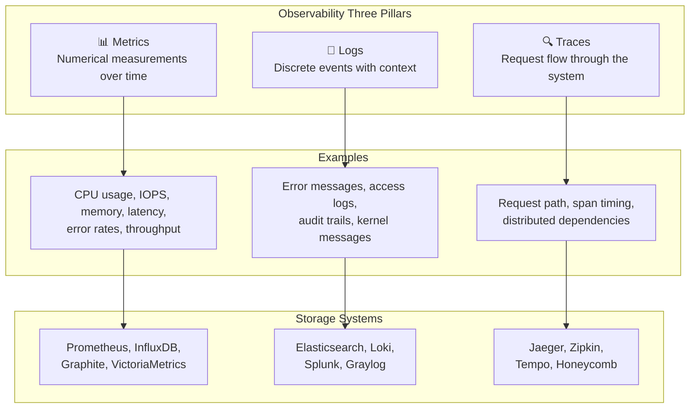
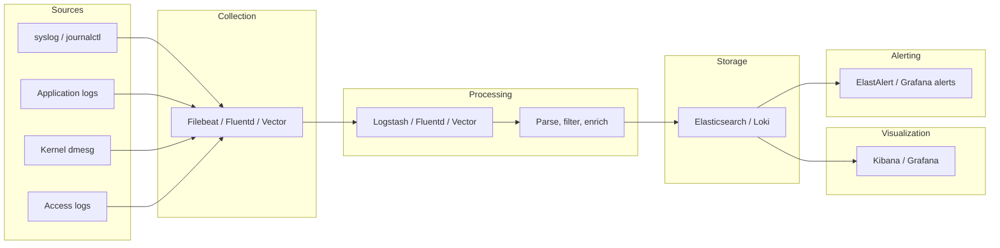
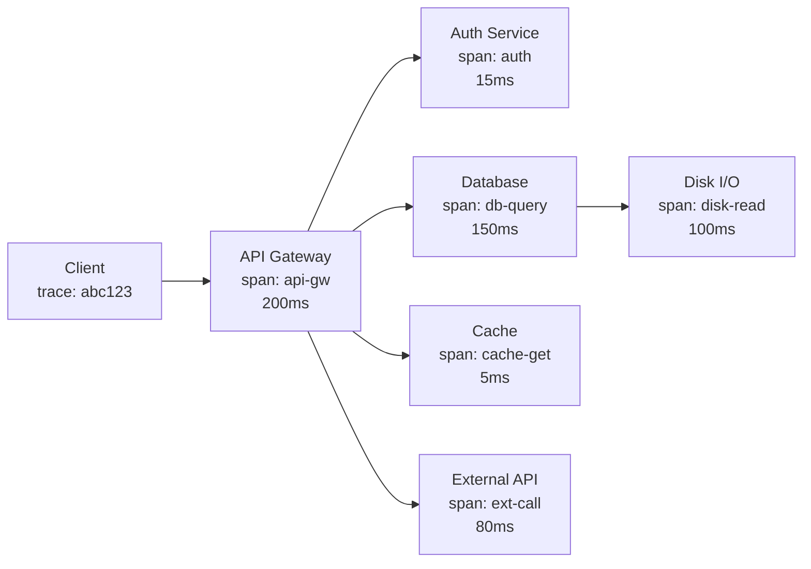
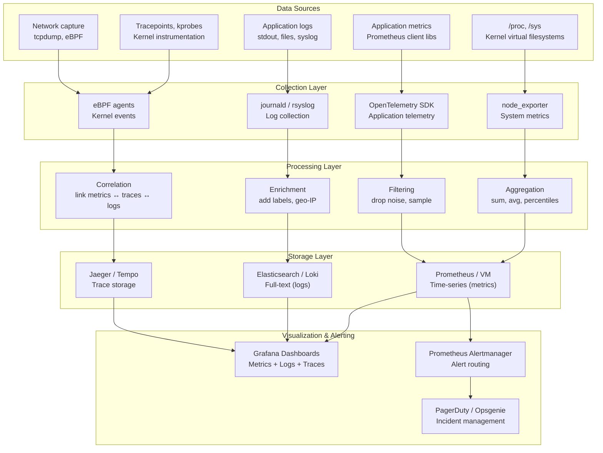
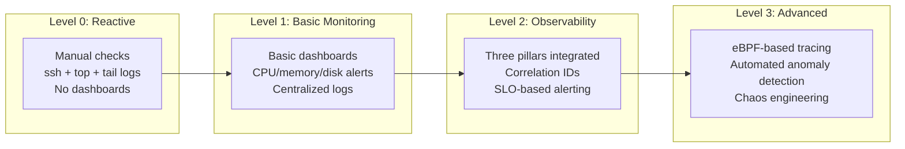

# Observability Overview

## Introduction

Observability is the ability to understand the internal state of a system purely from its external outputs. In control theory, a system is "observable" if its complete internal state can be determined from its output over time. In the Linux and software engineering context, observability refers to the practice of instrumenting systems so that you can ask arbitrary questions about their behavior—without having to predict those questions in advance.

This is the critical distinction between **observability** and **monitoring**. Monitoring asks "is the system healthy?" against a predefined set of dashboards and alerts. Observability asks "why is this request slow for this specific user at this specific time?"—a question you could not have predicted.

Modern Linux systems generate vast amounts of observability data. The challenge is not collecting data—it's extracting meaningful insights from it. This chapter provides the foundational framework for Linux observability.

## The Three Pillars

Observability is conventionally built on three pillars: **metrics**, **logs**, and **traces**. Together, they provide the visibility needed to diagnose performance issues, detect anomalies, and understand system behavior.



### Pillar Comparison

| Aspect | Metrics | Logs | Traces |
|--------|---------|------|--------|
| **Data type** | Numeric time series | Text/structured events | Graph of spans |
| **Volume** | Low (aggregated) | High (per-event) | Medium (per-request) |
| **Granularity** | Aggregated | Per-event | Per-request |
| **Storage** | TSDB (Prometheus) | Log store (Elasticsearch) | Trace store (Jaeger) |
| **Query language** | PromQL, SQL | Full-text, SQL | Trace ID lookup |
| **Best for** | Dashboards, alerting | Debugging, auditing | Distributed debugging |
| **Retention** | Months to years | Days to months | Days to weeks |
| **Cardinality** | Low-medium | High | High |
| **Cost** | Low | High | Medium |

### When to Use Which Pillar

- **Metrics** when you need to understand trends, set alerts, and answer "how much" or "how fast" questions over time.
- **Logs** when you need to debug a specific error, audit who did what, or investigate a one-time event.
- **Traces** when you need to understand why a specific request was slow as it traveled through multiple services.

## Metrics

Metrics are numerical measurements collected at regular intervals. They are the backbone of operational dashboards and alerting systems.

### Kernel Data Sources for Metrics

The kernel exposes rich metric data through virtual filesystems:

```bash
# CPU utilization (from /proc/stat)
cat /proc/stat | head -1
# cpu  123456789 7890 23456789 8901234567 67890 0 12345 0 0 0
# Fields: user nice system idle iowait irq softirq steal guest guest_nice

# Memory usage (from /proc/meminfo)
grep -E "MemTotal|MemFree|MemAvailable|Buffers|Cached|Dirty|Slab" /proc/meminfo
# MemTotal:       32768000 kB
# MemFree:         2048576 kB
# MemAvailable:   19922944 kB
# Buffers:          654320 kB
# Cached:         18234560 kB
# Dirty:            123456 kB
# Slab:            1567890 kB

# Disk I/O (from /proc/diskstats)
cat /proc/diskstats | grep sda
#   8 0 sda 123456 789 12345678 9012 567890 123 45678901 2345 0 6789 11357
# Fields: major minor name reads_merged reads_completed sectors_read read_time_ms
#         writes_merged writes_completed sectors_written write_time_ms
#         io_in_progress io_time_ms weighted_io_time_ms

# Network (from /proc/net/dev)
cat /proc/net/dev | grep eth0
# eth0: 1234567890 1234567 0 0 0 0 0 0 2345678901 2345678 0 0 0 0 0 0

# Load average (from /proc/loadavg)
cat /proc/loadavg
# 5.67 4.32 3.21 4/1234 5678
# 1-min 5-min 15-min running/total last_pid
```

### The USE Method

Brendan Gregg's **USE Method** (Utilization, Saturation, Errors) provides a systematic approach to checking every resource:

```bash
# ──── CPU ────
# Utilization: percentage of time CPU is busy
mpstat -P ALL 1
# Saturation: run queue length (processes waiting)
vmstat 1    # watch the 'r' column
# Errors: machine check exceptions
perf stat -e machine-check-exceptions -- sleep 10

# ──── Memory ────
# Utilization: used / total
free -m
# Saturation: pages swapping in/out
vmstat 1    # watch 'si' and 'so' columns
# Errors: OOM kills
dmesg | grep -i "out of memory"

# ──── Disk ────
# Utilization: % time disk is busy
iostat -xz 1
# Saturation: average queue depth
iostat -xz 1    # watch 'avgqu-sz'
# Errors: device errors, SMART data
smartctl -a /dev/sda
dmesg | grep -i "error\|fail\|reset" | grep -i "sd\|nvme"

# ──── Network ────
# Utilization: bandwidth used / capacity
sar -n DEV 1
# Saturation: overflows, drops
netstat -s | grep -i "overflow\|drop\|prune"
# Errors: packet errors, CRC errors
ip -s link show eth0
```

### The RED Method

For microservices, Tom Wilkie's **RED Method** focuses on request-driven services:

- **R**ate — requests per second
- **E**rrors — number of failed requests
- **D**uration — distribution of request latency (typically p50, p95, p99)

```bash
# Rate: requests/second from nginx access log
awk '{print $4}' /var/log/nginx/access.log | cut -d: -f1-2 | uniq -c

# Errors: HTTP 5xx responses
awk '$9 >= 500 {count++} END {print count}' /var/log/nginx/access.log

# Duration: from application metrics (Prometheus example)
# http_request_duration_seconds{quantile="0.99"}
```

### Metrics Collection Tools

```bash
# ──── node_exporter (Prometheus) ────
# Exposes system metrics as Prometheus-compatible HTTP endpoint
node_exporter \
    --collector.cpu \
    --collector.meminfo \
    --collector.diskstats \
    --collector.filesystem \
    --collector.netdev \
    --collector.loadavg \
    --collector.systemd \
    --web.listen-address=:9100

# Example output at http://localhost:9100/metrics:
# node_cpu_seconds_total{cpu="0",mode="idle"} 123456.78
# node_cpu_seconds_total{cpu="0",mode="user"} 12345.67
# node_memory_MemAvailable_bytes 19922944000
# node_memory_MemTotal_bytes 32768000000
# node_disk_reads_completed_total{device="sda"} 123456
# node_filesystem_avail_bytes{mountpoint="/"} 50000000000

# ──── collectd ────
collectd -C /etc/collectd/collectd.conf -f
# Supports many plugins: cpu, memory, disk, network, etc.

# ──── telegraf (InfluxDB) ────
telegraf --config /etc/telegraf/telegraf.conf
# Agent-based collection with input/output plugin architecture

# ──── sysstat (sar, iostat, mpstat) ────
# Classic Linux performance monitoring
sar -u 1 10        # CPU utilization, 1-second intervals, 10 samples
sar -r 1 10        # Memory utilization
sar -d 1 10        # Disk activity
sar -n DEV 1 10    # Network device statistics
```

### Prometheus Query Examples (PromQL)

```promql
# CPU utilization by mode (5-minute rate)
100 * (1 - rate(node_cpu_seconds_total{mode="idle"}[5m]))

# Memory utilization percentage
100 * (1 - node_memory_MemAvailable_bytes / node_memory_MemTotal_bytes)

# Disk I/O utilization (from node_disk_io_time_seconds_total)
rate(node_disk_io_time_seconds_total[5m]) * 100

# Request rate (RED method)
rate(http_requests_total[5m])

# Error rate percentage
100 * rate(http_requests_total{status=~"5.."}[5m]) / rate(http_requests_total[5m])

# 99th percentile latency
histogram_quantile(0.99, rate(http_request_duration_seconds_bucket[5m]))

# Alert rule: fire if CPU > 90% for 5 minutes
# ALERT HighCPU
#   IF 100 * (1 - rate(node_cpu_seconds_total{mode="idle"}[5m])) > 90
#   FOR 5m
#   LABELS { severity = "critical" }
#   ANNOTATIONS { summary = "High CPU usage on {{ $labels.instance }}" }
```

## Logs

Logs record discrete events with timestamps and context. They are the most verbose but also the most detailed observability signal.

### Kernel Logging (printk / dmesg)

The kernel uses `printk` to write messages to a ring buffer:

```bash
# Read kernel ring buffer
dmesg

# Follow new messages in real time
dmesg -w

# Filter by severity level
dmesg -l err,crit,alert,emerg

# With human-readable timestamps
dmesg -T

# JSON output (useful for log aggregation)
dmesg -J

# Example output:
# [Mon Jul 21 10:00:00 2026] eth0: Link is Up at 10000 Mbps, full duplex
# [Mon Jul 21 10:00:01 2026] EXT4-fs (sda1): mounted filesystem with ordered data mode
# [Mon Jul 21 10:05:00 2026] Out of memory: Killed process 1234 (mysqld)
```

### Systemd Journal (journalctl)

```bash
# All logs from a specific service
journalctl -u sshd --since "1 hour ago"

# Kernel messages only
journalctl -k

# Follow logs in real time
journalctl -f

# Filter by priority
journalctl -p err

# Filter by PID
journalctl _PID=1234

# Disk usage of journal
journalctl --disk-usage

# Vacuum old journal entries
journalctl --vacuum-time=7d
journalctl --vacuum-size=500M

# JSON output for structured processing
journalctl -o json -u nginx --since "1 hour ago"
```

### Application Logging

```bash
# Tail access log
tail -f /var/log/nginx/access.log
# 192.168.1.1 - - [21/Jul/2026:10:00:00 +0800] "GET /index.html HTTP/1.1" 200 1234

# Tail error log
tail -f /var/log/nginx/error.log

# Parse and count status codes
awk '{print $9}' /var/log/nginx/access.log | sort | uniq -c | sort -rn
#  15678 200
#   1234 304
#    567 404
#     12 500
```

### Structured Logging

Modern applications use structured logging (JSON) for machine-parseable events:

```json
{"timestamp": "2026-07-21T10:00:00.123Z", "level": "error", "service": "api-gateway", "message": "Connection timeout to upstream", "host": "db-01.internal", "port": 5432, "duration_ms": 5000, "request_id": "abc-123-def", "trace_id": "trace-xyz-789", "user_id": "user-42"}
{"timestamp": "2026-07-21T10:00:00.456Z", "level": "info", "service": "api-gateway", "message": "Request completed", "method": "GET", "path": "/api/v1/users", "status": 200, "duration_ms": 45, "request_id": "req-789", "trace_id": "trace-xyz-789"}
```

Benefits of structured logging:
- Machine-parseable without regex
- Consistent field names across services
- Enables powerful queries (e.g., "all errors for user_id=user-42")
- Correlation via trace_id spans the entire request

### Log Aggregation Pipeline



## Traces

Traces follow a request as it flows through distributed services. They are essential for understanding latency in microservice architectures.

### Trace Components

- **Trace**: A complete request path through the system, identified by a unique trace ID
- **Span**: A single operation within a trace (with start time, duration, and metadata)
- **Context**: Metadata propagated between services (trace ID, span ID, baggage)



### Trace Example (Jaeger/OpenTelemetry Format)

```json
{
  "traceID": "abc123def456789",
  "spans": [
    {
      "spanID": "span001",
      "parentSpanID": "",
      "operationName": "GET /api/users",
      "serviceName": "api-gateway",
      "startTime": 1626784800000000,
      "duration": 200000,
      "tags": {
        "http.method": "GET",
        "http.status_code": 200,
        "http.url": "/api/users",
        "net.peer.ip": "10.0.0.1"
      }
    },
    {
      "spanID": "span002",
      "parentSpanID": "span001",
      "operationName": "SELECT * FROM users WHERE id = ?",
      "serviceName": "database",
      "startTime": 1626784800050000,
      "duration": 150000,
      "tags": {
        "db.system": "postgresql",
        "db.statement": "SELECT * FROM users WHERE id = ?"
      }
    }
  ]
}
```

### OpenTelemetry Instrumentation

OpenTelemetry is the standard for instrumenting applications:

```bash
# Auto-instrumentation (no code changes)
# For Python:
pip install opentelemetry-distro opentelemetry-exporter-otlp
opentelemetry-bootstrap -a install
opentelemetry-instrument python app.py

# For Java:
java -javaagent:opentelemetry-javaagent.jar \
    -Dotel.service.name=my-service \
    -Dotel.exporter.otlp.endpoint=http://jaeger:4317 \
    -jar my-app.jar

# For Go:
# Import go.opentelemetry.io/otel and instrument manually
```

## Linux Observability Tools

### Traditional Tools (Always Available)

```bash
# ──── Process Monitoring ────
top / htop / atop          # Real-time process monitoring
ps auxf                    # Process tree
pgrep -af pattern          # Find processes by name/pattern

# ──── Memory ────
free -m                    # Memory summary
vmstat 1                   # Virtual memory stats (per-second)
slabtop                    # Kernel slab allocator usage
pmap -x <pid>              # Process memory map

# ──── CPU ────
mpstat -P ALL 1            # Per-CPU utilization
pidstat -u 1               # Per-process CPU usage
perf stat ./workload       # Hardware counter profiling

# ──── Disk I/O ────
iostat -xz 1               # Extended disk I/O statistics
iotop -aoP                 # Per-process I/O (requires root)
blktrace -d /dev/sda -o - | blkparse -i -  # Block I/O tracing

# ──── Network ────
ss -tunapl                 # Socket statistics (replaces netstat)
ip -s link show            # Interface statistics
sar -n DEV 1               # Network device throughput
tcpdump -i eth0 port 80    # Packet capture

# ──── System-wide ────
sar -u -r -d -n DEV 1 10   # Comprehensive system activity
uptime                     # Load average
dmesg -T | tail -50        # Recent kernel messages
```

### Modern Tools (BPF-based)

```bash
# ──── bpftrace (high-level tracing language) ────
bpftrace -e 'tracepoint:syscalls:sys_enter_openat { printf("%s %s\n", comm, str(args->filename)); }'
bpftrace -e 'kprobe:vfs_read { @bytes[comm] = sum(arg2); }'

# ──── BCC tools (ready-made BPF tools) ────
execsnoop-bpfcc            # Trace new processes
opensnoop-bpfcc            # Trace file opens
biolatency-bpfcc           # Block I/O latency histogram
tcplife-bpfcc              # TCP session tracer
runqlat-bpfcc              # Scheduler run queue latency
cachestat-bpfcc            # Page cache hit rate
profile-bpfcc              # CPU profiling (flame graphs)

# ──── bpftool (BPF program management) ────
bpftool prog list          # List loaded BPF programs
bpftool map list           # List BPF maps
bpftool prog show id 123   # Show BPF program details
```

### Observability Platforms

```bash
# ──── Metrics ────
Prometheus                 # Time-series database + PromQL
VictoriaMetrics            # High-performance Prometheus alternative
InfluxDB                   # Time-series database

# ──── Visualization ────
Grafana                    # Dashboard and visualization
Kibana                     # Elasticsearch visualization

# ──── Distributed Tracing ────
Jaeger                     # Distributed tracing (Uber)
Zipkin                     # Distributed tracing (Twitter)
Tempo                      # Grafana tracing backend

# ──── Log Aggregation ────
Elasticsearch              # Full-text search and analytics
Loki                       # Lightweight log aggregation (Grafana)
Fluentd / Vector           # Log collection and routing
```

## Observability Pipeline Architecture



## Practical Observability Scenarios

### Scenario 1: "The server is slow"

Systematic approach using the three pillars:

```bash
# Step 1: Check metrics (what's the overall picture?)
uptime
# 10:00:00 up 30 days, load average: 28.50, 15.20, 8.30
# Load is increasing — something is consuming CPU or waiting on I/O

# Step 2: Identify the resource
vmstat 1 5
# procs -----------memory---------- ---swap-- -----io---- -system-- ------cpu-----
#  r  b   swpd   free   buff  cache   si   so    bi    bo   in   cs us sy wa st
# 28  5      0  1024M  2048M 16384M    0    0   100  5000  8000 15000 80 10 8  2
# High 'r' (run queue), high 'wa' (I/O wait) — disk I/O problem

# Step 3: Identify the process
iotop -aoP
# Total DISK READ:       500.00 M/s | Total DISK WRITE:      200.00 M/s
#   PID  PRIO  USER     DISK READ  DISK WRITE  COMMAND
#  1234  be/4  mysql    450.00 M/s  180.00 M/s  mysqld

# Step 4: Check logs for errors
journalctl -u mysqld --since "30 minutes ago" | grep -i "error\|slow\|lock"
# Jul 21 09:45:00 db mysqld[1234]: [ERROR] InnoDB: Lock wait timeout exceeded

# Step 5: Trace the specific slow queries (detailed view)
# Enable MySQL slow query log or use bpftrace:
bpftrace -e 'kprobe:vfs_read /comm == "mysqld"/ { @bytes = sum(arg2); }'
```

### Scenario 2: "Network latency is high"

```bash
# Step 1: Check network metrics
sar -n DEV 1 5
# rxpck/s   txpck/s   rxkB/s   txkB/s   rxcmp/s   txcmp/s   rxmcst/s
# 150000    120000    45000    30000    0         0         5000

# Step 2: Check for drops
ip -s link show eth0
# RX:  bytes  packets  errors  dropped   missed   mcast
#      ...    ...      0       1234      0        ...
# TX:  bytes  packets  errors  dropped   carrier  collisions
#      ...    ...      0       567       0        0

# Step 3: Trace TCP retransmissions
bpftrace -e 'kprobe:tcp_retransmit_skb { @[kstack] = count(); }'

# Step 4: Check connection states
ss -s
# Total: 5678
# TCP:   4567 (estab 3456, closed 789, orphaned 12, timewait 234)

# Step 5: Trace DNS latency
bpftrace -e '
kprobe:udp_sendmsg /arg2 == 53/ { @start[tid] = nsecs; }
kretprobe:udp_sendmsg /@start[tid]/ {
    @dns_us = hist((nsecs - @start[tid]) / 1000);
    delete(@start[tid]);
}'
```

### Scenario 3: "Memory usage is growing"

```bash
# Step 1: Check overall memory
free -m
#               total    used    free   shared  buff/cache   available
# Mem:         32000   28000    1024      256        2976        3744
# Swap:         8192    2048    6144

# Step 2: Check for OOM events
dmesg | grep -i "oom\|out of memory"

# Step 3: Identify memory consumers
ps aux --sort=-rss | head -20

# Step 4: Check process memory details
cat /proc/1234/status | grep -E "VmRSS|VmSize|VmSwap|RssAnon|RssFile"
# VmRSS:   8234567 kB
# RssAnon: 7234567 kB  (heap — growing)
# RssFile:  500000 kB  (shared libraries)
# VmSwap:  1000000 kB  (swapped out)

# Step 5: Trace memory allocations
bpftrace -e '
tracepoint:kmem:mm_page_alloc {
    @pages[comm] = count();
}
interval:s:5 {
    print(@pages);
    clear(@pages);
}'

# Step 6: Check slab allocator
slabtop -o | head -20
#  OBJS ACTIVE  USE OBJ SIZE  SLABS OBJ/SLAB CACHE SIZE NAME
# 567890  567890 100%    0.57K  35494       16    567904K dentry
# 234567  234567 100%    0.19K  11170       21     44680K kernfs_node_cache
```

## The /proc and /sys Filesystems

These virtual filesystems are the primary interface between user space and kernel observability data:

```bash
# /proc — Process and kernel statistics
/proc/stat              # CPU statistics
/proc/meminfo           # Memory statistics
/proc/diskstats         # Disk I/O statistics
/proc/net/dev           # Network interface statistics
/proc/net/tcp           # TCP connection table
/proc/loadavg           # Load average
/proc/uptime            # System uptime
/proc/interrupts        # Interrupt counters
/proc/softirqs          # Soft interrupt counters
/proc/<pid>/status      # Process status
/proc/<pid>/maps        # Process memory map
/proc/<pid>/io          # Process I/O statistics
/proc/<pid>/fd/         # Open file descriptors

# /sys — Device and kernel configuration
/sys/class/net/eth0/statistics/   # Network device stats
/sys/block/sda/stat               # Block device stats
/sys/devices/system/cpu/          # CPU information
/sys/kernel/debug/                # Debug filesystem (tracing)
```

## Best Practices

### 1. Start with Metrics, Drill Down with Logs and Traces

Metrics give you the big picture. When something looks wrong, drill into logs for that time period. When you need to understand a specific slow request, look at its trace.

### 2. Use Structured Logging

```bash
# BAD: unstructured
logger "Error: connection failed to db-01 port 5432"

# GOOD: structured JSON
logger -p local0.info '{"event":"connection_failed","host":"db-01","port":5432,"duration_ms":5000,"error":"timeout"}'
```

### 3. Implement Correlation IDs

Every request should get a unique trace ID that propagates through all services, appearing in metrics labels, log entries, and trace spans.

### 4. Set Meaningful Alerts

```yaml
# BAD: alert on raw CPU percentage
- alert: HighCPU
  expr: node_cpu_seconds_total > 90

# GOOD: alert on meaningful symptoms
- alert: HighErrorRate
  expr: rate(http_requests_total{status=~"5.."}[5m]) / rate(http_requests_total[5m]) > 0.05
  for: 5m
  annotations:
    summary: "Error rate > 5% for 5 minutes"
```

### 5. Use the Right Tool for the Job

| Question | Tool |
|----------|------|
| Is the system healthy? | Prometheus + Grafana dashboard |
| Why is this request slow? | Distributed tracing (Jaeger) |
| What error occurred? | Log aggregation (Elasticsearch/Loki) |
| Which process is using all CPU? | `top`, `pidstat`, `profile-bpfcc` |
| Why did the kernel panic? | `dmesg`, `crash`, `kdump` |
| Who opened this file? | `opensnoop-bpfcc`, audit log |
| What's causing disk I/O? | `biolatency-bpfcc`, `iotop` |

## Observability Maturity Model



## References

- Gregg, B. *Systems Performance: Enterprise and the Cloud*, 2nd Edition (2020).
- Gregg, B. *BPF Performance Tools: Linux System and Application Observability* (2019).
- [Observability Engineering](https://www.oreilly.com/library/view/observability-engineering/9781492076438/) — Charity Majors, Liz Fong-Jones, George Miranda.
- [USE Method](https://www.brendangregg.com/usemethod.html) — Brendan Gregg.
- [RED Method](https://www.weave.works/blog/the-red-method-key-metrics-for-microservices-architecture/) — Tom Wilkie.
- [The Linux Kernel Documentation](https://docs.kernel.org/)
- [proc(5) man page](https://man7.org/linux/man-pages/man5/proc.5.html)

## Further Reading

- [The Linux Kernel Documentation](https://docs.kernel.org/)
- [LWN.net - Linux and free software news](https://lwn.net/)
- [GNU Project Documentation](https://www.gnu.org/doc/doc.html)
- [GNU Manuals](https://www.gnu.org/manual/manual.html)
- [Free Software Directory](https://directory.fsf.org/wiki/Main_Page)
- [Planet GNU](https://planet.gnu.org/)
- [Free Software Books](https://www.gnu.org/doc/other-free-books.html)

- <https://www.brendangregg.com/linuxperf.html> — Linux performance tools map
- <https://prometheus.io/docs/introduction/overview/> — Prometheus documentation
- <https://grafana.com/docs/> — Grafana documentation
- <https://opentelemetry.io/docs/> — OpenTelemetry documentation
- <https://ebpf.io/> — eBPF project documentation
- <https://github.com/bpftrace/bpftrace> — bpftrace on GitHub

## Related Topics

- [proc Filesystem](proc.md) — Deep dive into /proc
- [sysfs](sysfs.md) — The /sys filesystem
- [BPF and bpftrace](bpf-bpftrace.md) — Modern kernel tracing
- [Kprobes](kprobes.md) — Dynamic kernel probes
- [Metrics Collection](metrics.md) — Prometheus and metrics
- [Prometheus and Grafana](prometheus-grafana.md) — Dashboard setup
- [Tracepoints](tracepoints.md) — Static kernel tracepoints
