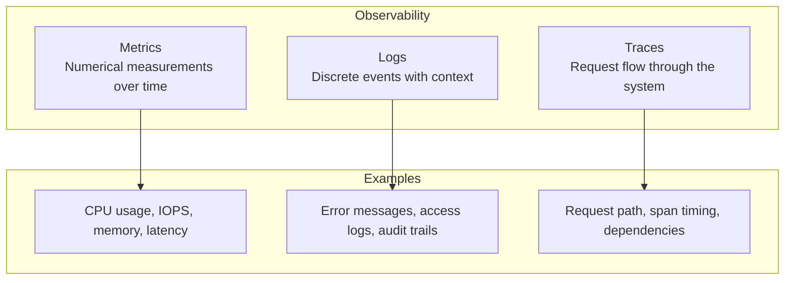
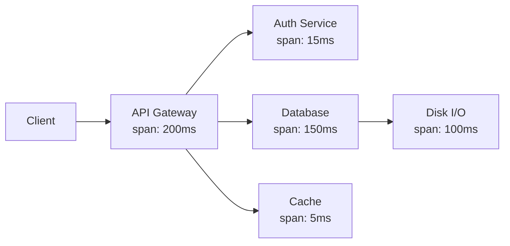
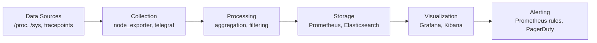

# Observability Overview

## Introduction

Observability is the ability to understand the internal state of a system from its external outputs. In Linux, this is built on three pillars: **metrics**, **logs**, and **traces**. Together, they provide the visibility needed to diagnose performance issues, detect anomalies, and understand system behavior.

Modern Linux systems generate vast amounts of observability data. The challenge is not collecting data—it's extracting meaningful insights from it. This chapter provides the foundational framework for Linux observability.

## The Three Pillars



### Pillar Comparison

| Aspect | Metrics | Logs | Traces |
|--------|---------|------|--------|
| Data type | Numeric time series | Text/structured events | Graph of spans |
| Volume | Low | High | Medium |
| Granularity | Aggregated | Per-event | Per-request |
| Storage | TSDB (Prometheus) | Log store (Elasticsearch) | Trace store (Jaeger) |
| Query | PromQL, SQL | Full-text, SQL | Trace ID lookup |
| Best for | Dashboards, alerting | Debugging, auditing | Distributed debugging |

## Metrics

Metrics are numerical measurements collected at regular intervals:

```bash
# CPU utilization (from /proc/stat)
cat /proc/stat | head -1
# cpu  123456 7890 234567 89012345 6789 0 1234 0 0 0

# Memory usage (from /proc/meminfo)
grep MemAvailable /proc/meminfo
# MemAvailable:   19922944 kB

# Disk I/O (from /proc/diskstats)
cat /proc/diskstats | grep sda
#   8 0 sda 123456 789 12345678 9012 567890 123 45678901 2345 0 6789 11357

# Network (from /proc/net/dev)
cat /proc/net/dev | grep eth0
# eth0: 1234567890 1234567 0 0 0 0 0 0 2345678901 2345678 0 0 0 0 0 0
```

### Metrics Collection Tools

```bash
# node_exporter (Prometheus)
node_exporter --collector.cpu --collector.meminfo --collector.diskstats
# Exposes metrics at http://localhost:9100/metrics

# Example output
# node_cpu_seconds_total{cpu="0",mode="idle"} 123456.78
# node_memory_MemAvailable_bytes 19922944000
# node_disk_reads_completed_total{device="sda"} 123456

# collectd
collectd -C /etc/collectd/collectd.conf -f

# telegraf
telegraf --config /etc/telegraf/telegraf.conf
```

## Logs

Logs record discrete events with timestamps and context:

```bash
# System logs
journalctl -u sshd --since "1 hour ago"
# Jul 21 10:00:00 server sshd[1234]: Accepted publickey for user from 192.168.1.1
# Jul 21 10:05:00 server sshd[5678]: Connection closed by 192.168.1.2

# Kernel logs
dmesg -T | tail -20
# [Mon Jul 21 10:00:00 2026] eth0: Link is Up at 10000 Mbps, full duplex
# [Mon Jul 21 10:00:01 2026] EXT4-fs (sda1): mounted filesystem with ordered data mode

# Application logs
tail -f /var/log/nginx/access.log
# 192.168.1.1 - - [21/Jul/2026:10:00:00 +0800] "GET /index.html HTTP/1.1" 200 1234
```

### Structured Logging

```json
{"timestamp": "2026-07-21T10:00:00Z", "level": "error", "service": "api", "message": "Connection timeout", "host": "db-01", "duration_ms": 5000}
{"timestamp": "2026-07-21T10:00:01Z", "level": "info", "service": "api", "message": "Request completed", "method": "GET", "path": "/users", "status": 200, "duration_ms": 45}
```

## Traces

Traces follow a request as it flows through distributed services:



### Trace Components

- **Trace**: A complete request path through the system
- **Span**: A single operation within a trace (with start/end time)
- **Context**: Metadata propagated between services (trace ID, span ID)

```bash
# Example trace (Jaeger format)
{
  "traceID": "abc123def456",
  "spans": [
    {
      "spanID": "span001",
      "operationName": "GET /api/users",
      "startTime": 1626784800000000,
      "duration": 200000,
      "tags": {"http.method": "GET", "http.status_code": 200}
    }
  ]
}
```

## Linux Observability Tools

### Traditional Tools

```bash
# System-wide
top / htop          # Process monitoring
vmstat              # Virtual memory
iostat              # Disk I/O
mpstat              # CPU
sar                 # System activity reporter
netstat / ss        # Network connections

# Per-process
strace              # System call tracing
ltrace              # Library call tracing
perf                # CPU profiling

# Network
tcpdump             # Packet capture
wireshark           # Packet analysis
```

### Modern Tools

```bash
# BPF-based (safe, efficient, programmable)
bpftrace            # High-level tracing language
bcc-tools           # BPF Compiler Collection tools
bpftool             # BPF program management

# Observability platforms
Prometheus          # Metrics collection
Grafana             # Visualization
Jaeger              # Distributed tracing
Elasticsearch       # Log aggregation
```

## The USE Method for Observability

```bash
# CPU
# Utilization: mpstat -P ALL 1
# Saturation: vmstat 1 (r column)
# Errors: perf stat

# Memory
# Utilization: free -m
# Saturation: vmstat 1 (si/so columns)
# Errors: dmesg | grep -i oom

# Disk
# Utilization: iostat -xz 1
# Saturation: iostat -xz 1 (avgqu-sz)
# Errors: smartctl -a /dev/sda

# Network
# Utilization: sar -n DEV 1
# Saturation: netstat -s | grep overflow
# Errors: ip -s link show eth0
```

## Observability Pipeline



## References

- Gregg, B. *Systems Performance: Enterprise and the Cloud*, 2nd Edition.
- [Observability Engineering](https://www.oreilly.com/library/view/observability-engineering/9781492076438/)
- [USE Method](https://www.brendangregg.com/usemethod.html)
- [RED Method](https://www.weave.works/blog/the-red-method-key-metrics-for-microservices-architecture/)

## Further Reading

- <https://www.brendangregg.com/linuxperf.html> - Linux performance tools
- <https://prometheus.io/docs/introduction/overview/> - Prometheus documentation
- <https://grafana.com/docs/> - Grafana documentation
- <https://opentelemetry.io/docs/> - OpenTelemetry

## Related Topics

- [proc Filesystem](proc.md)
- [sysfs](sysfs.md)
- [BPF and bpftrace](bpf-bpftrace.md)
- [Metrics Collection](metrics.md)
- [Prometheus and Grafana](prometheus-grafana.md)
