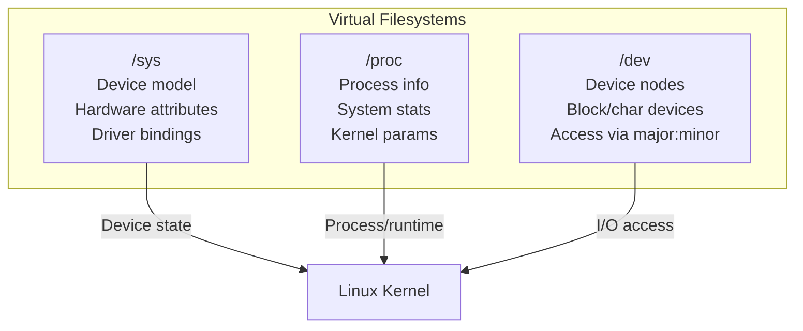

# sysfs for Observability

## Introduction

sysfs (`/sys`) is a virtual filesystem that exports kernel data structures, their attributes, and the linkages between them to userspace. Unlike `/proc`, which focuses on process and system statistics, `/sys` exposes the **device model**—hardware devices, buses, drivers, and their configuration.

sysfs is essential for hardware observability: understanding what devices are present, how they're configured, and what state they're in.

## sysfs Structure

```bash
ls /sys/
# block/  bus/  class/  dev/  devices/  firmware/  fs/  kernel/  module/  power/
```

### Top-Level Directories

| Directory | Purpose |
|-----------|---------|
| `/sys/block/` | Block devices (disks, partitions) |
| `/sys/bus/` | Bus types (PCI, USB, SCSI) |
| `/sys/class/` | Device classes (net, block, tty) |
| `/sys/devices/` | Device tree (physical hierarchy) |
| `/sys/firmware/` | Firmware interfaces (ACPI, DMI) |
| `/sys/fs/` | Filesystem information |
| `/sys/kernel/` | Kernel configuration |
| `/sys/module/` | Loaded kernel modules |
| `/sys/power/` | Power management |

### sysfs vs procfs vs devtmpfs



| Filesystem | Mount Point | Content | Interface |
|-----------|-------------|---------|-----------|
| sysfs | `/sys` | Device model, buses, drivers | read/write text files |
| procfs | `/proc` | Processes, memory, network stats | read/write text files |
| devtmpfs | `/dev` | Device nodes (block, char) | open/read/write/ioctl |
| debugfs | `/sys/kernel/debug` | Kernel debugging | read/write text files |
| tracefs | `/sys/kernel/tracing` | Tracing (ftrace, tracepoints) | read/write text files |

## /sys/devices: Device Tree

The `/sys/devices/` directory mirrors the physical hardware hierarchy:

```bash
# Physical device tree
ls /sys/devices/
# LNXSYSTM:00  pci0000:00  platform  pnp0  system  virtual

# PCI devices
ls /sys/devices/pci0000:00/
# 0000:00:00.0  0000:00:01.0  0000:00:02.0  0000:00:14.0  0000:00:16.0
# 0000:00:17.0  0000:00:1f.2  ...

# Specific PCI device
ls /sys/devices/pci0000:00/0000:00:17.0/
# ata1  ata2  ata3  ata4  class  config  device  driver  enable
# irq   local_cpulist  local_cpus  msix_bus  msix_irqs  numa_node
# power/  resource  resource0  subsystem  subsystem_device  subsystem_vendor
# uevent  vendor

# Device class and vendor
cat /sys/devices/pci0000:00/0000:00:17.0/class
# 0x010601  (SATA controller)
cat /sys/devices/pci0000:00/0000:00:17.0/vendor
# 0x8086  (Intel)
cat /sys/devices/pci0000:00/0000:00:17.0/device
# 0xa282
```

### NVMe Device Tree

```bash
# NVMe device path
ls /sys/devices/pci0000:40/0000:40:01.1/0000:41:00.0/
# address  class  config  device  driver  enable  firmware_node
# iommu/  iommu_group/  nvme  power/  resource  resource0  subsystem
# subsystem_device  subsystem_vendor  uevent  vendor

# NVMe controller
ls /sys/devices/pci0000:40/0000:40:01.1/0000:41:00.0/nvme/nvme0/
# address  cntlid  firmware_rev  hwmoni  model  ng0  serial
# state  subsystem  transport  uevent

cat /sys/devices/pci0000:40/0000:40:01.1/0000:41:00.0/nvme/nvme0/model
# Samsung SSD 970 EVO Plus 2TB

cat /sys/devices/pci0000:40/0000:40:01.1/0000:41:00.0/nvme/nvme0/state
# live

# NVMe namespace info
ls /sys/devices/pci0000:40/0000:40:01.1/0000:41:00.0/nvme/nvme0/nvme0n1/
# alignment_offset  badblocks  capability  dev  device  discard_alignment
# ext_range  holders  inflight  integrity  mq  nguid  nsid  partition
# partitions  queue  range  removable  ro  size  start  stat  subsystem
# uevent  wwid

# NVMe namespace ID
cat /sys/devices/pci0000:40/0000:40:01.1/0000:41:00.0/nvme/nvme0/nvme0n1/nsid
# 1
```

### USB Device Tree

```bash
# USB device hierarchy
ls /sys/bus/usb/devices/
# 1-0:1.0  1-1  1-1:1.0  1-1:1.1  usb1  usb2

# USB device details
cat /sys/bus/usb/devices/1-1/idVendor
# 046d
cat /sys/bus/usb/devices/1-1/idProduct
# c077
cat /sys/bus/usb/devices/1-1/manufacturer
# Logitech
cat /sys/bus/usb/devices/1-1/product
# USB Optical Mouse
cat /sys/bus/usb/devices/1-1/speed
# 1.5

# USB device speed (1.5/12/480/5000/10000/20000)
cat /sys/bus/usb/devices/1-2/speed
# 480

# USB power management
cat /sys/bus/usb/devices/1-1/power/control
# auto
cat /sys/bus/usb/devices/1-1/power/autosuspend
# 2
```

### GPU Device Tree

```bash
# GPU device (NVIDIA example)
ls /sys/class/drm/
# card0  card0-HDMI-A-1  card0-DP-1  renderD128  version

# GPU vendor and device
cat /sys/class/drm/card0/device/vendor
# 0x10de (NVIDIA)
cat /sys/class/drm/card0/device/device
# 0x2684

# GPU power state
cat /sys/class/drm/card0/device/power/runtime_status
# active

# GPU clock speed (if exposed by driver)
cat /sys/class/drm/card0/gt_cur_freq_mhz 2>/dev/null || echo "N/A"
```

## /sys/class: Device Classes

`/sys/class/` provides a class-based view of devices (easier to navigate than the physical tree):

```bash
# Network interfaces
ls /sys/class/net/
# eth0  eth1  lo

# Block devices
ls /sys/class/block/
# loop0  loop1  nvme0n1  nvme0n1p1  sda  sda1  sda2

# SCSI devices
ls /sys/class/scsi_device/
# 0:0:0:0  0:0:1:0  1:0:0:0

# TTY devices
ls /sys/class/tty/
# console  tty0  tty1  ...  ttyS0  ttyS1  pts/  ptmx

# USB devices
ls /sys/class/usb/
# usb0  usb1  usb2

# Power supply
ls /sys/class/power_supply/
# AC0  BAT0

# Thermal zones
ls /sys/class/thermal/
# cooling_device0  thermal_zone0  thermal_zone1
```

### Network Device Information

```bash
# Network device details
ls /sys/class/net/eth0/
# addr_assign_type  carrier  device  duplex  flags  ifindex
# iflink  link_mode  mtu  name_assign_type  operstate  power/
# queues/  speed  statistics/  subsystem  tx_queue_len  type  uevent

# Link state
cat /sys/class/net/eth0/operstate
# up

# Speed (Mbps)
cat /sys/class/net/eth0/speed
# 10000

# Duplex
cat /sys/class/net/eth0/duplex
# full

# MTU
cat /sys/class/net/eth0/mtu
# 1500

# MAC address
cat /sys/class/net/eth0/address
# 00:11:22:33:44:55

# Statistics
ls /sys/class/net/eth0/statistics/
# collisions  multicast  rx_bytes  rx_compressed  rx_crc_errors
# rx_dropped  rx_errors  rx_fifo_errors  rx_frame_errors  rx_length_errors
# rx_missed_errors  rx_nohandler  rx_over_errors  rx_packets
# tx_aborted_errors  tx_bytes  tx_carrier_errors  tx_compressed
# tx_dropped  tx_errors  tx_fifo_errors  tx_heartbeat_errors
# tx_packets  tx_window_errors

cat /sys/class/net/eth0/statistics/rx_bytes
# 12345678901
cat /sys/class/net/eth0/statistics/rx_dropped
# 1234

# Network queue configuration
ls /sys/class/net/eth0/queues/
# rx-0  rx-1  rx-2  rx-3  tx-0  tx-1  tx-2  tx-3

# Queue IRQ affinity
cat /sys/class/net/eth0/queues/rx-0/rps_cpus
# 00000001

# Queue byte queue limits (BQL)
ls /sys/class/net/eth0/queues/tx-0/byte_queue_limits/
# hold_time  inflight  limit  limit_max  limit_min
cat /sys/class/net/eth0/queues/tx-0/byte_queue_limits/limit
# 15360
```

### Block Device Information

```bash
# Block device details
ls /sys/block/sda/
# alignment_offset  bdi  capability  dev  device  discard_alignment
# events  events_async  events_poll_msecs  ext_range  hidden  holders
# inflight  integrity  mq  partitions  queue  range  removable  ro
# size  slaves  stat  subsystem  uevent

# Device size (sectors)
cat /sys/block/sda/size
# 976773168

# Queue parameters
ls /sys/block/sda/queue/
# add_random  discard_max_bytes  hw_sector_size  max_hw_sectors_kb
# max_sectors_kb  max_segment_size  max_segments  minimum_io_size
# nomerges  nr_requests  optimal_io_size  physical_block_size
# read_ahead_kb  rotational  scheduler  write_cache  write_same_max_bytes

# I/O scheduler
cat /sys/block/sda/queue/scheduler
# [mq-deadline] kyber bfq none

# Rotational (0 = SSD, 1 = HDD)
cat /sys/block/sda/queue/rotational
# 0

# Sector sizes
cat /sys/block/sda/queue/logical_block_size
# 512
cat /sys/block/sda/queue/physical_block_size
# 512

# Queue depth
cat /sys/block/sda/queue/nr_requests
# 256

# Disk statistics (I/O counters)
cat /sys/block/sda/stat
#  123456  789  12345678  456  789012  345  12345678  901  0  234  567
# Fields: read_ios read_merges read_sectors read_ticks
#         write_ios write_merges write_sectors write_ticks
#         in_flight io_ticks weighted_io_ticks

# Partition info
ls /sys/block/sda/sda1/
# alignment_offset  dev  discard_alignment  holders  inflight  integrity
# partitions  ro  size  start  stat  subsystem  uevent
cat /sys/block/sda/sda1/start
# 2048
cat /sys/block/sda/sda1/size
# 976771072

# Device mapper (LVM, LUKS)
ls /sys/block/dm-0/
# alignment_offset  capability  dev  dm  ext_range  holders  inflight
# mq  partitions  queue  range  removable  ro  size  slaves  stat
# subsystem  uevent

# DM device details
cat /sys/block/dm-0/dm/name
# ubuntu--vg-ubuntu--lv
cat /sys/block/dm-0/dm/uuid
# LVM-abc123def456
cat /sys/block/dm-0/dm/suspended
# 0
```

## /sys/bus: Bus Information

```bash
# Available bus types
ls /sys/bus/
# acpi  container  cpu  edac  event_source  generic  hdaudio
# i2c  isa  machinecheck  mce  mdio_bus  media  memory
# mmc  node  nvme  pci  pcmcia  platform  scsi  serio  usb  virtio

# PCI devices
lspci | head -10
# 00:00.0 Host bridge: Intel Corporation Xeon E3-1200 v5/E3-1500 v5/6th Gen Core ...
# 00:01.0 PCI bridge: Intel Corporation Xeon E3-1200 v5/E3-1500 v5/6th Gen Core ...
# 00:14.0 USB controller: Intel Corporation 100 Series/C230 Series Chipset Family USB 3.0

# SCSI devices
ls /sys/bus/scsi/devices/
# 0:0:0:0  0:0:1:0  1:0:0:0

# USB devices
lsusb
# Bus 002 Device 001: ID 1d6b:0003 Linux Foundation 3.0 root hub
# Bus 001 Device 002: ID 046d:c077 Logitech, Inc. M105 Optical Mouse

# I2C devices (sensors, EEPROMs)
ls /sys/bus/i2c/devices/
# 0-0048  0-0049  0-004a  0-004b  i2c-0  i2c-1

# Platform devices (embedded controllers, SoC peripherals)
ls /sys/bus/platform/devices/
# ACPI0003:00  PNP0103:00  PNP0C04:00  alarmtimer  ...

# Virtio devices (VMs, containers)
ls /sys/bus/virtio/devices/
# virtio0  virtio1  virtio2

# NVMe devices
ls /sys/bus/nvme/devices/
# nvme0  nvme1
```

### PCI Device Deep Dive

```bash
# PCI configuration space (readable via sysfs)
cat /sys/devices/pci0000:00/0000:00:17.0/config | xxd | head -10
# 00000000: 8680 82a2 0704 1000 0001 0601 0000 0000

# PCI resource allocation
cat /sys/devices/pci0000:00/0000:00:17.0/resource
# 0x00000000df200000 0x00000000df207fff 0x0000000000140204
# 0x0000000000000000 0x0000000000000000 0x0000000000000000
# ...

# PCI BAR (Base Address Register)
cat /sys/devices/pci0000:00/0000:00:17.0/resource0 | xxd | head -5

# PCI link speed and width
cat /sys/devices/pci0000:00/0000:00:01.0/0000:01:00.0/current_link_speed
# 8.0 GT/s PCIe
cat /sys/devices/pci0000:00/0000:00:01.0/0000:01:00.0/current_link_width
# 16

# PCI power management
cat /sys/devices/pci0000:00/0000:00:17.0/power/runtime_status
# active
cat /sys/devices/pci0000:00/0000:00:17.0/power/control
# auto

# MSI/MSI-X interrupt info
cat /sys/devices/pci0000:00/0000:00:17.0/msi_irqs/
# 34  35  36  37
```

## uevent Files

Every device in sysfs has a `uevent` file that contains device attributes:

```bash
# View device uevent
cat /sys/block/sda/uevent
# MAJOR=8
# MINOR=0
# DEVNAME=sda
# DEVTYPE=disk

# View NVMe uevent
cat /sys/class/nvme/nvme0/uevent
# MAJOR=10
# MINOR=154
# DEVNAME=nvme0

# Trigger uevent (re-add device)
echo add > /sys/block/sda/uevent

# Network device uevent
cat /sys/class/net/eth0/uevent
# INTERFACE=eth0
# IFINDEX=2
```

## Power Management

```bash
# Device power state
cat /sys/devices/pci0000:00/0000:00:17.0/power/runtime_status
# active

cat /sys/devices/pci0000:00/0000:00:17.0/power/control
# auto  (or "on" to prevent runtime PM)

# CPU frequency
cat /sys/devices/system/cpu/cpu0/cpufreq/scaling_governor
# performance

cat /sys/devices/system/cpu/cpu0/cpufreq/scaling_cur_freq
# 2500000  (kHz)

# CPU idle states
cat /sys/devices/system/cpu/cpu0/cpuidle/state0/name
# POLL
cat /sys/devices/system/cpu/cpu0/cpuidle/state0/usage
# 1234567

# Thermal zones
cat /sys/class/thermal/thermal_zone0/temp
# 42000  (millidegrees Celsius = 42°C)

cat /sys/class/thermal/thermal_zone0/type
# acpitz

# CPU temperature (via hwmon)
cat /sys/class/hwmon/hwmon0/temp1_input
# 42000  (millidegrees)

# Fan speed
cat /sys/class/hwmon/hwmon1/fan1_input
# 1200  (RPM)

# Battery (laptops)
cat /sys/class/power_supply/BAT0/status
# Discharging
cat /sys/class/power_supply/BAT0/capacity
# 85
cat /sys/class/power_supply/BAT0/energy_now
# 42000000  (µWh)
```

## Kernel Module Information

```bash
# List loaded modules via sysfs
ls /sys/module/
# ahci  btrfs  dm_crypt  ext4  kvm  nvme  xfs  ...

# Module parameters
ls /sys/module/nvme_core/parameters/
# default_ps_max_latency_us  io_timeout  max_retries  multipath

cat /sys/module/nvme_core/parameters/default_ps_max_latency_us
# 100000

# Module information
cat /sys/module/nvme_core/version
# 1.0

# Module refcount
cat /sys/module/nvme_core/refcnt
# 3

# Module sections (debugging)
ls /sys/module/nvme_core/sections/
# .data  .rodata  .text  __ksymtab  __ksymtab_gpl

# Module parameters (read-write)
cat /sys/module/kvm/parameters/halt_poll_ns
# 500000
echo 0 > /sys/module/kvm/parameters/halt_poll_ns
```

## /sys/fs: Filesystem Information

```bash
# cgroup information
ls /sys/fs/cgroup/
# blkio  cpu,cpuacct  cpuset  devices  freezer  memory  net_cls,net_prio  pids

# cgroup v2
ls /sys/fs/cgroup/
# cgroup.controllers  cgroup.procs  cgroup.subtree_control
# cpu.max  memory.max  io.max  pids.max

# ext4 filesystem features
cat /sys/fs/ext4/sda1/options
# has_journal ...

# FUSE connections
ls /sys/fs/fuse/connections/

# Btrfs filesystem info
ls /sys/fs/btrfs/
# features  UUID

# Filesystem features
cat /sys/fs/ext4/sda1/mb_groups
```

## /sys/kernel: Kernel Configuration

```bash
# Kernel configuration (if available)
ls /sys/kernel/
# config  debug  fscaps  mm  notes  profiling  security  slab  tracing  uevent_seqnum

# Kernel parameters via sysctl
ls /sys/kernel/mm/
# hugepages  ksm  transparent_hugepage

# Huge pages
cat /sys/kernel/mm/hugepages/hugepages-2048kB/nr_hugepages
# 0
echo 1024 > /sys/kernel/mm/hugepages/hugepages-2048kB/nr_hugepages

# KSM (Kernel Same-page Merging)
cat /sys/kernel/mm/ksm/run
# 0
echo 1 > /sys/kernel/mm/ksm/run
cat /sys/kernel/mm/ksm/pages_shared
# 0
cat /sys/kernel/mm/ksm/pages_sharing
# 0

# Transparent Huge Pages
cat /sys/kernel/mm/transparent_hugepage/enabled
# [always] madvise never
cat /sys/kernel/mm/transparent_hugepage/defrag
# [always] madvise never

# Kernel security
ls /sys/kernel/security/
# ima  lockdown  lsm  selinux  yama

# IMA (Integrity Measurement Architecture)
cat /sys/kernel/security/ima/ascii_runtime_measurements
# PCR  ...

# Lockdown status
cat /sys/kernel/security/lockdown
# [none] integrity confidentiality
```

## /sys/firmware: Firmware Interfaces

```bash
# ACPI tables
ls /sys/firmware/acpi/tables/
# DSDT  FACP  FACS  HPET  MCFG  SSDT1  SSDT2

# ACPI DSDT (Differentiated System Description Table)
cat /sys/firmware/acpi/tables/DSDT > dsdt.dat
iasl -d dsdt.dat  # Disassemble

# SMBIOS/DMI information
ls /sys/firmware/dmi/tables/
# entry_point  smbios

# DMI system info (alternative to dmidecode)
cat /sys/class/dmi/id/board_name
# X570 AORUS MASTER
cat /sys/class/dmi/id/sys_vendor
# Gigabyte Technology Co., Ltd.
cat /sys/class/dmi/id/product_name
# X570 AORUS MASTER

# EFI variables
ls /sys/firmware/efi/efivars/
# Boot0000-8be4df61-93ca-11d2-aa0d-00e098032b8c
# BootOrder-8be4df61-93ca-11d2-aa0d-00e098032b8c
# Timeout-8be4df61-93ca-11d2-aa0d-00e098032b8c

# EFI runtime services
ls /sys/firmware/efi/runtime-map/
# 0  1  2  3  ...
```

## Practical Examples

### Hardware Inventory Script

```bash
#!/bin/bash
echo "=== CPU ==="
lscpu | grep -E "Model name|CPU\(s\)|Thread|Core|Socket"

echo "=== Memory ==="
free -h | head -2

echo "=== Disks ==="
for disk in /sys/block/sd* /sys/block/nvme*; do
    [ -d "$disk" ] || continue
    name=$(basename $disk)
    size=$(cat $disk/size 2>/dev/null)
    rotational=$(cat $disk/queue/rotational 2>/dev/null)
    echo "$name: $(( size * 512 / 1073741824 )) GB (rotational=$rotational)"
done

echo "=== Network ==="
for iface in /sys/class/net/*; do
    [ -d "$iface" ] || continue
    name=$(basename $iface)
    [ "$name" = "lo" ] && continue
    speed=$(cat $iface/speed 2>/dev/null || echo "N/A")
    state=$(cat $iface/operstate 2>/dev/null)
    echo "$name: ${speed}Mbps ($state)"
done
```

### PCI Device Enumeration

```bash
#!/bin/bash
echo "=== PCI Devices ==="
for dev in /sys/bus/pci/devices/*; do
    [ -d "$dev" ] || continue
    vendor=$(cat $dev/vendor 2>/dev/null)
    device=$(cat $dev/device 2>/dev/null)
    class=$(cat $dev/class 2>/dev/null)
    driver=$(readlink $dev/driver 2>/dev/null | xargs basename)
    printf "%s %s class=%s driver=%s\n" \
        "$(basename $dev)" "$vendor:$device" "$class" "${driver:-none}"
done
```

### Temperature Monitor

```bash
#!/bin/bash
for zone in /sys/class/thermal/thermal_zone*; do
    [ -d "$zone" ] || continue
    type=$(cat $zone/type 2>/dev/null)
    temp=$(cat $zone/temp 2>/dev/null)
    if [ -n "$temp" ]; then
        celsius=$((temp / 1000))
        echo "$type: ${celsius}°C"
    fi
done

# Via hwmon
for hwmon in /sys/class/hwmon/hwmon*; do
    [ -d "$hwmon" ] || continue
    name=$(cat $hwmon/name 2>/dev/null)
    for temp in $hwmon/temp*_input; do
        [ -f "$temp" ] || continue
        val=$(cat $temp 2>/dev/null)
        label=$(echo $temp | sed 's/_input/_label/')
        lbl=$(cat $label 2>/dev/null || basename $temp _input)
        echo "$name/$lbl: $((val / 1000))°C"
    done
done
```

### Network Device Monitor

```bash
#!/bin/bash
# Monitor network interface statistics from sysfs
IFACE=${1:-eth0}
STATS=/sys/class/net/$IFACE/statistics

echo "Monitoring $IFACE (Ctrl+C to stop)"
echo "Time | RX bytes | TX bytes | RX pkts | TX pkts | RX drops | TX drops"
echo "-----|----------|----------|---------|---------|----------|--------"

while true; do
    rx_bytes=$(cat $STATS/rx_bytes)
    tx_bytes=$(cat $STATS/tx_bytes)
    rx_pkts=$(cat $STATS/rx_packets)
    tx_pkts=$(cat $STATS/tx_packets)
    rx_drops=$(cat $STATS/rx_dropped)
    tx_drops=$(cat $STATS/tx_dropped)
    echo "$(date +%H:%M:%S) | $rx_bytes | $tx_bytes | $rx_pkts | $tx_pkts | $rx_drops | $tx_drops"
    sleep 1
done
```

### NVMe Health Monitor

```bash
#!/bin/bash
for nvme in /sys/class/nvme/nvme*; do
    [ -d "$nvme" ] || continue
    name=$(basename $nvme)
    model=$(cat $nvme/model 2>/dev/null)
    serial=$(cat $nvme/serial 2>/dev/null)
    state=$(cat $nvme/state 2>/dev/null)
    fw=$(cat $nvme/firmware_rev 2>/dev/null)
    echo "=== $name ==="
    echo "  Model: $model"
    echo "  Serial: $serial"
    echo "  Firmware: $fw"
    echo "  State: $state"
done
```

## sysfs Permissions and Security

```bash
# sysfs is mounted as read-only by default for most files
# Some files are writable (device control, parameters)

# Read-only files (most attributes)
cat /sys/class/net/eth0/address
# 00:11:22:33:44:55

# Writable files (device control)
echo 1 > /proc/sys/net/ipv4/ip_forward  # Not sysfs, but similar pattern
echo 256 > /sys/block/sda/queue/nr_requests

# sysfs permissions
ls -la /sys/class/net/eth0/address
# -r--r--r-- 1 root root 4096 Jan  1 00:00 /sys/class/net/eth0/address

ls -la /sys/class/net/eth0/mtu
# -rw-r--r-- 1 root root 4096 Jan  1 00:00 /sys/class/net/eth0/mtu

# udev rules for sysfs permissions
# /etc/udev/rules.d/99-custom.rules
# SUBSYSTEM=="net", KERNEL=="eth0", MODE="0660", GROUP="netdev"
```

## References

- [sysfs Documentation](https://www.kernel.org/doc/html/latest/filesystems/sysfs.html)
- [Linux Device Model](https://www.kernel.org/doc/html/latest/driver-api/driver-model/)
- [udev Documentation](https://www.kernel.org/doc/html/latest/admin-guide/udev.html)

## Further Reading

- [The Linux Kernel Documentation](https://docs.kernel.org/)
- [LWN.net - Linux and free software news](https://lwn.net/)
- [GNU Project Documentation](https://www.gnu.org/doc/doc.html)
- [GNU Manuals](https://www.gnu.org/manual/manual.html)
- [Free Software Directory](https://directory.fsf.org/wiki/Main_Page)
- [Planet GNU](https://planet.gnu.org/)
- [Free Software Books](https://www.gnu.org/doc/other-free-books.html)

- <https://www.kernel.org/doc/html/latest/filesystems/sysfs.html> - sysfs kernel documentation
- <https://www.kernel.org/doc/html/latest/driver-api/> - Driver API documentation
- <https://man7.org/linux/man-pages/man5/sysfs.5.html> - sysfs(5)

## Related Topics

- [Observability Overview](overview.md)
- [proc Filesystem](proc.md)
- [BPF and bpftrace](bpf-bpftrace.md)
