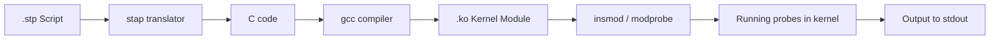
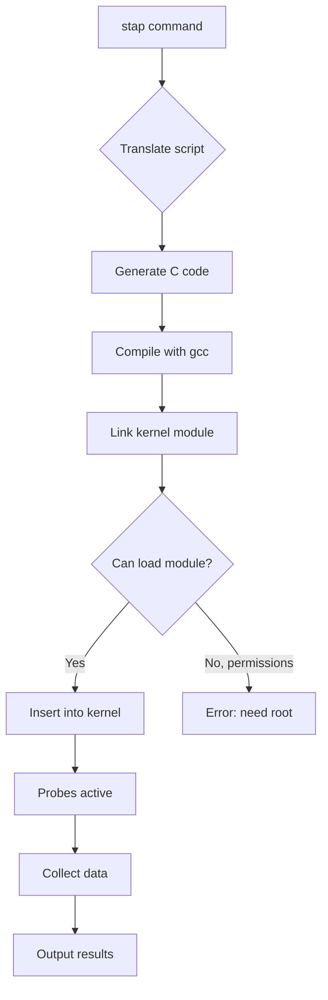
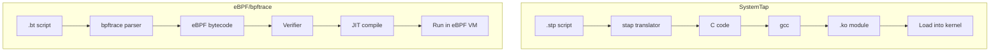

# SystemTap: Kernel and User-Space Tracing

## Introduction

SystemTap is a scripting-based dynamic instrumentation framework for Linux. It allows administrators and developers to write scripts that probe kernel and user-space events, extract data, and generate reports—all without modifying or recompiling the kernel. Think of it as a programmable `strace` on steroids, capable of probing any kernel function, tracing any system call, and aggregating data in real time.

SystemTap was developed by Red Hat in 2005 and has been part of the Linux ecosystem for nearly two decades. While modern tools like **eBPF/bpftrace** are gaining ground, SystemTap remains a powerful option, especially on RHEL-based systems where it is well-supported.

## How SystemTap Works

SystemTap scripts are compiled into kernel modules that are loaded into the running kernel. The compilation process:





### SystemTap Translator Pipeline

1. **Parse**: The `.stp` script is parsed into an AST.
2. **Elaborate**: Tapset functions and probe aliases are resolved.
3. **Translate**: The AST is converted to C code.
4. **Compile**: GCC compiles the C code into a kernel module.
5. **Run**: The module is loaded and probes are activated.

## SystemTap Script Structure

### Basic Script Anatomy

```stap
#!/usr/bin/stap

/* Global variables */
global count, total_time

/* Probe: fires when the event occurs */
probe begin {
    printf("Starting trace...\n")
}

probe syscall.open {
    count++
    printf("open(%s) by pid %d\n", filename, pid())
}

probe syscall.open.return {
    total_time += gettimeofday_us() - @entry(gettimeofday_us())
}

probe end {
    printf("Total opens: %d\n", count)
    printf("Total time: %d us\n", total_time)
}
```

### Script Sections

A SystemTap script can contain:

```stap
/* 1. Probe definitions */
probe <point> { <handler> }

/* 2. Global variables */
global my_var

/* 3. Function definitions */
function my_func(arg1: string, arg2: long) {
    return arg1 . " " . string(arg2)
}

/* 4. Embedded C (for advanced operations) */
%{
#include <linux/sched.h>
%}
```

## Probe Points

Probe points define the events that trigger probe handlers. They follow the naming convention `subsystem.event[.qualifier]`.

### Kernel Probes

```stap
/* Function probes */
probe kernel.function("sys_open")          /* Function entry */
probe kernel.function("sys_open").return   /* Function return */
probe kernel.function("vfs_read").call     /* Function call */
probe kernel.function("vfs_read").inline   /* Inlined instances */

/* Statement probes */
probe kernel.statement("do_sys_open@fs/open.c:1105")  /* Specific line */

/* Module-specific probes */
probe kernel.function("ext4_create").call   /* ext4 module */
probe module("ext4").function("*")          /* All ext4 functions */

/* Timer probes */
probe timer.ms(100)      /* Every 100 milliseconds */
probe timer.s(1)         /* Every second */
probe timer.us(10)       /* Every 10 microseconds */

/* Scheduler probes */
probe scheduler.ctxswitch     /* Context switch */
probe scheduler.process_exit  /* Process exit */
probe scheduler.wakeup        /* Process wakeup */

/* I/O probes */
probe ioblock.request         /* Block I/O request */
probe ioscheduler.enqueue     /* I/O scheduler enqueue */
```

### User-Space Probes (uprobes)

```stap
/* Probe a user-space function */
probe process("/usr/bin/python3").function("PyEval_EvalFrameEx") {
    printf("Python executing in pid %d\n", pid())
}

/* Probe a shared library */
probe process("/lib/x86_64-linux-gnu/libc.so.6").function("malloc") {
    printf("malloc(%d) in pid %d\n", $size, pid())
}

/* Probe by PID */
probe process(1234).function("main") {
    printf("main() called in pid 1234\n")
}

/* User-space statement */
probe process("/usr/bin/myapp").statement("main@myapp.c:42") {
    printf("Reached line 42\n")
}
```

### Probe Aliases and Tapsets

Tapsets are reusable libraries of probe definitions and helper functions:

```stap
/* /usr/share/systemtap/tapset/network.stp (simplified) */
probe netfilter.ip.local_in = kernel.function("ip_local_deliver") {
    dev_name = $skb->dev->name
    saddr = format_ipaddr($skb->network_header->saddr, "IPv4")
    daddr = format_ipaddr($skb->network_header->daddr, "IPv4")
}

/* User script using the tapset */
probe netfilter.ip.local_in {
    printf("Packet %s -> %s on %s\n", saddr, daddr, dev_name)
}
```

## SystemTap Examples

### Example 1: Trace System Calls

```stap
#!/usr/bin/stap
/* Trace all system calls for a specific process */

probe syscall.* {
    if (pid() == target()) {
        printf("%s(%s) = %s\n", name, argstr, retstr)
    }
}

probe begin {
    printf("Tracing pid %d...\n", target())
}
```

Usage:
```bash
stap -x 1234 syscall_trace.stp
```

### Example 2: Profile Function Latency

```stap
#!/usr/bin/stap
/* Profile the latency of a kernel function */

global latencies

probe kernel.function("do_sys_open") {
    start = gettimeofday_us()
}

probe kernel.function("do_sys_open").return {
    elapsed = gettimeofday_us() - start
    latencies <<< elapsed
}

probe end {
    printf("=== do_sys_open latency (us) ===\n")
    printf("  count: %d\n", @count(latencies))
    printf("  min:   %d\n", @min(latencies))
    printf("  max:   %d\n", @max(latencies))
    printf("  avg:   %d\n", @avg(latencies))
    printf("  stddev:%d\n", @stddev(latencies))
    printf("\nHistogram:\n")
    print(@hist_linear(latencies, 0, 1000, 100))
}
```

### Example 3: File I/O Top

```stap
#!/usr/bin/stap
/* Show top files by I/O bytes */

global bytes_read, bytes_write

probe vfs.read {
    bytes_read[filename] += $count
}

probe vfs.write {
    bytes_write[filename] += $count
}

probe timer.s(5) {
    printf("\n%-50s %10s %10s\n", "FILE", "READ", "WRITE")
    printf("%-50s %10s %10s\n", "----", "----", "-----")
    foreach (fn in bytes_read-) {
        printf("%-50s %10d %10d\n", fn, bytes_read[fn], 
               bytes_write[fn] ?: 0)
    }
    delete bytes_read
    delete bytes_write
}
```

### Example 4: Scheduler Analysis

```stap
#!/usr/bin/stap
/* Analyze context switch patterns */

global switch_count, wait_times

probe scheduler.ctxswitch {
    if (prev_pid != 0) {
        switch_count[prev_comm]++
    }
}

probe scheduler.process_exit {
    switch_count[execname()]++
}

probe timer.s(10) {
    printf("\n=== Context switches (top 20) ===\n")
    foreach ([comm] in switch_count- limit 20) {
        printf("%-20s %d\n", comm, switch_count[comm])
    }
    delete switch_count
}
```

### Example 5: Network Packet Analysis

```stap
#!/usr/bin/stap
/* Monitor network packets by protocol */

global pkt_count, pkt_bytes

probe netdev.receive {
    pkt_count["rx"]++
    pkt_bytes["rx"] += length
}

probe netdev.transmit {
    pkt_count["tx"]++
    pkt_bytes["tx"] += length
}

probe timer.s(1) {
    printf("RX: %d pkts, %d KB\n", 
           pkt_count["rx"], pkt_bytes["rx"] / 1024)
    printf("TX: %d pkts, %d KB\n", 
           pkt_count["tx"], pkt_bytes["tx"] / 1024)
    printf("---\n")
    delete pkt_count
    delete pkt_bytes
}
```

### Example 6: User-Space Tracing

```stap
#!/usr/bin/stap
/* Trace memory allocations in a C++ application */

probe process("/usr/bin/myapp").function("operator new") {
    printf("new(%d) at %s:%d\n", $size, probefunc(), usraddr($$caller))
}

probe process("/usr/bin/myapp").function("operator delete") {
    printf("delete(%p)\n", $ptr)
}
```

## Aggregation and Statistics

SystemTap provides built-in statistical operations:

```stap
global stats, histogram

/* Statistical aggregation */
probe kernel.function("vfs_read") {
    stats <<< $count
}

/* At end, print statistics */
probe end {
    printf("Count: %d\n", @count(stats))
    printf("Sum:   %d\n", @sum(stats))
    printf("Min:   %d\n", @min(stats))
    printf("Max:   %d\n", @max(stats))
    printf("Avg:   %d\n", @avg(stats))
    printf("Stddev:%d\n", @stddev(stats))
    
    /* Histograms */
    print(@hist_log(stats))        /* Logarithmic */
    print(@hist_linear(stats, 0, 10000, 1000))  /* Linear */
}
```

## SystemTap vs eBPF/bpftrace

The modern alternative to SystemTap is **eBPF** (extended Berkeley Packet Filter) and its front-end **bpftrace**.

### Architecture Comparison



### Feature Comparison

| Feature | SystemTap | bpftrace/eBPF |
|---------|-----------|---------------|
| **Safety** | Kernel module — can crash | Verifier — safe by design |
| **Startup time** | Slow (compile + load) | Fast (JIT) |
| **Privilege** | Root only | Root (or CAP_BPF) |
| **Kernel dependency** | Kernel headers needed | BTF preferred |
| **Scripting language** | Custom (.stp) | AWK-like (.bt) |
| **Maps** | Global variables | BPF maps |
| **Output** | stdout | stdout, perf |
| **Overhead** | Higher (kernel module) | Lower (in-kernel JIT) |
| **Ecosystem** | Mature, Red Hat supported | Growing rapidly |
| **User-space probes** | Yes (uprobes) | Yes (uprobes) |

### When to Choose SystemTap

- You need to probe deep kernel internals that eBPF can't access.
- You're on RHEL/CentOS with kernel debuginfo packages available.
- You need complex script logic that's difficult in bpftrace.
- You're already invested in SystemTap tapsets.

### When to Choose bpftrace/eBPF

- Safety is paramount (production systems).
- You need fast startup and low overhead.
- You want to avoid kernel module loading.
- You're targeting upstream kernels without debuginfo.

### Equivalent Examples

**SystemTap:**
```stap
probe syscall.open { printf("open: %s\n", filename) }
```

**bpftrace:**
```
tracepoint:syscalls:sys_enter_openat { printf("open: %s\n", str(args->filename)); }
```

## Running SystemTap Scripts

### Prerequisites

```bash
# Install SystemTap and kernel debuginfo (RHEL/CentOS)
yum install systemtap kernel-debuginfo-$(uname -r)

# Install on Debian/Ubuntu
apt install systemtap systemtap-runtime

# Verify installation
stap -e 'probe begin { printf("OK\n") exit() }'
```

### Execution Modes

```bash
# Run a script
stap script.stp

# With arguments
stap -Gvar1=value script.stp

# Target a specific process
stap -x 1234 script.stp

# Limit execution time
stap -e 'probe timer.s(5) { printf("done\n") exit() }'

# Cross-instrumentation (run on different kernel)
stap --remote server script.stp

# Compile to module (no runtime stap needed)
stap -p4 -m myprobe script.stp  # Generate myprobe.ko
staprun myprobe.ko                # Run the module

# Verbose output
stap -v script.stp
```

### Safety and Limitations

```bash
# SystemTap has built-in safety mechanisms:
# - Maximum number of concurrent probes
# - Timeout on probe handlers
# - Memory limits
# - Recursive probe depth limits

# Check for errors before running
stap -p1 script.stp  # Parse only
stap -p2 script.stp  # Elaborate
stap -p3 script.stp  # Translate to C
stap -p4 script.stp  # Compile module
```

## Production Use

### Monitoring Script for Production

```stap
#!/usr/bin/stap
/* Production-safe: low overhead, bounded output */

global io_latency, count

probe ioblock.request {
    start[argdev, sector] = gettimeofday_us()
}

probe ioblock.request {
    if (start[argdev, sector]) {
        lat = gettimeofday_us() - start[argdev, sector]
        if (lat > 10000)  /* Only log > 10ms */
            printf("SLOW I/O: dev=%d sector=%d latency=%d us\n",
                   argdev, sector, lat)
        io_latency <<< lat
        delete start[argdev, sector]
    }
}

probe timer.s(60) {
    if (@count(io_latency) > 0) {
        printf("I/O summary: count=%d avg=%dus max=%dus\n",
               @count(io_latency), @avg(io_latency), @max(io_latency))
        clear(io_latency)
    }
}
```

## Further Reading

- [SystemTap Language Reference](https://sourceware.org/systemtap/langref/) — Official language reference
- [SystemTap Tapset Reference](https://sourceware.org/systemtap/tapsets/) — Built-in tapsets
- [SystemTap Beginner's Guide](https://sourceware.org/systemtap/SystemTap_Beginners_Guide/) — Getting started
- [LWN: SystemTap](https://lwn.net/Articles/157860/) — Early SystemTap overview
- [bpftrace reference](https://github.com/bpftrace/bpftrace/blob/master/docs/reference_guide.md) — bpftrace docs (comparison)
- [man7.org: stap](https://man7.org/linux/man-pages/man1/stap.1.html) — stap man page
- [LWN: SystemTap vs eBPF](https://lwn.net/Articles/753321/) — Comparison discussion
- [SystemTap Wiki](https://sourceware.org/systemtap/wiki) — Community resources
