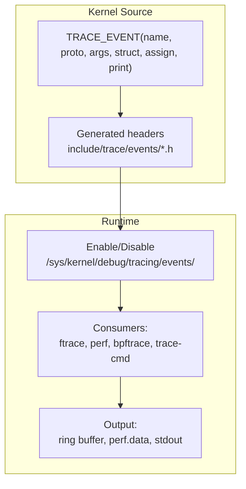

# Tracepoints

## Introduction

Tracepoints are static instrumentation points placed at strategic locations in the Linux kernel source code. Unlike kprobes (which can dynamically probe any kernel function), tracepoints are **statically defined** by kernel developers at well-known locations. They provide structured, stable, low-overhead tracing for kernel events.

Tracepoints are the backbone of Linux observability—tools like `perf`, `bpftrace`, `trace-cmd`, and `ftrace` all use tracepoints.

## Tracepoint Architecture



### How Tracepoints Work

1. Kernel developers define tracepoints using `TRACE_EVENT()` macros
2. The build system generates the necessary code
3. At runtime, tracepoints are no-ops when disabled (zero overhead)
4. When enabled, they write structured data to the kernel ring buffer
5. Consumers read events from the ring buffer

## Listing Tracepoints

```bash
# List all available tracepoints
ls /sys/kernel/debug/tracing/events/
# alarmtimer  block  ext4  irq  kmem  net  oom  sched  syscalls  task ...

# Count tracepoints
find /sys/kernel/debug/tracing/events -name "enable" | wc -l
# 1234

# List tracepoints in a category
ls /sys/kernel/debug/tracing/events/block/
# block_bio_backmerge    block_bio_queue      block_rq_complete
# block_bio_bounce       block_bio_remap      block_rq_insert
# block_bio_complete     block_getrq          block_rq_issue
# block_bio_frontmerge   block_plug           block_rq_remap
# block_dirty_buffer     block_rq_abort       block_sleeprq
# block_touch_buffer     block_rq_requeue     block_split
#                        block_unplug

# View tracepoint format
cat /sys/kernel/debug/tracing/events/block/block_rq_issue/format
# name: block_rq_issue
# ID: 1234
# format:
# 	field:unsigned short common_type;    offset:0;   size:2;
# 	field:unsigned char common_flags;    offset:2;   size:1;
# 	field:unsigned char common_preempt_count; offset:3; size:1;
# 	field:int common_pid;                offset:4;   size:4;
#
# 	field:dev_t dev;                     offset:8;   size:4;
# 	field:sector_t sector;              offset:16;  size:8;
# 	field:unsigned int nr_sector;        offset:24;  size:4;
# 	field:unsigned int bytes;            offset:28;  size:4;
# 	field:char rwbs[8];                  offset:32;  size:8;
# 	field:char comm[16];                 offset:40;  size:16;
# 	field:__data_loc char[] cmd;        offset:56;  size:4;
#
# print fmt: "%d,%d %s %u (%s) %llu + %u [%s]", ...
```

## Enabling and Disabling Tracepoints

### Via sysfs

```bash
# Enable a specific tracepoint
echo 1 > /sys/kernel/debug/tracing/events/block/block_rq_issue/enable

# Disable
echo 0 > /sys/kernel/debug/tracing/events/block/block_rq_issue/enable

# Enable all tracepoints in a category
echo 1 > /sys/kernel/debug/tracing/events/block/enable

# Enable all tracepoints (DANGEROUS - massive overhead!)
echo 1 > /sys/kernel/debug/tracing/events/enable
```

### Via trace-cmd

```bash
# Record tracepoint events
trace-cmd record -e block:block_rq_issue -e block:block_rq_complete -e sched:sched_switch sleep 10

# Report
trace-cmd report | head -20
# CPU: 0
#  TASK-PID     CPU#  TIMESTAMP     FUNCTION
#     bash-1234  [000] 12345.678901: block_rq_issue: 8,0 WS 0 () 12345678 + 8 [bash]
#     bash-1234  [000] 12345.679012: sched_switch: prev_comm=bash prev_pid=1234 ...
#  <idle>-0     [000] 12345.680000: block_rq_complete: 8,0 WS () 12345678 + 8 [0]

# Record with specific filter
trace-cmd record -e 'block:block_rq_issue --filter rwbs ~ "W"' sleep 10
```

### Via ftrace

```bash
# Enable tracepoint via ftrace
echo block_rq_issue > /sys/kernel/debug/tracing/set_event

# Or with category
echo "block:block_rq_issue" > /sys/kernel/debug/tracing/set_event

# Multiple events
echo "block:block_rq_issue block:block_rq_complete" > /sys/kernel/debug/tracing/set_event

# View trace
cat /sys/kernel/debug/tracing/trace_pipe | head -20
# <...>-1234  [001] d... 12345.678901: block_rq_issue: 8,0 WS 0 () 12345678 + 8 [dd]
# <...>-1234  [001] d... 12345.680000: block_rq_complete: 8,0 WS () 12345678 + 8 [0]
```

## Common Tracepoint Categories

### Scheduler Tracepoints

```bash
# Context switches
cat /sys/kernel/debug/tracing/events/sched/sched_switch/format
# Tracepoint: sched_switch
# Fields: prev_comm, prev_pid, prev_prio, prev_state, next_comm, next_pid, next_prio

# Trace context switches
trace-cmd record -e sched:sched_switch sleep 5
trace-cmd report | head -20

# Wakeup events
trace-cmd record -e sched:sched_wakeup sleep 5
```

### Block I/O Tracepoints

```bash
# Block I/O request issue
cat /sys/kernel/debug/tracing/events/block/block_rq_issue/format
# Fields: dev, sector, nr_sector, bytes, rwbs, comm, cmd

# Block I/O completion
cat /sys/kernel/debug/tracing/events/block/block_rq_complete/format
# Fields: dev, sector, nr_sector, bytes, rwbs, error

# Trace I/O with latency
trace-cmd record -e block:block_rq_issue -e block:block_rq_complete sleep 10
```

### Network Tracepoints

```bash
# Network receive
cat /sys/kernel/debug/tracing/events/net/netif_receive_skb/format
# Fields: skbaddr, len, name

# TCP tracepoints
ls /sys/kernel/debug/tracing/events/tcp/
# tcp_connect  tcp_destroy_sock  tcp_probe  tcp_receive_reset
# tcp_retransmit_skb  tcp_retransmit_syn_recv  tcp_send_reset
# tcp_set_state  tcp_rcv_space_adjust

# Trace TCP retransmissions
trace-cmd record -e tcp:tcp_retransmit_skb sleep 30
```

### Memory Tracepoints

```bash
# Page allocation
ls /sys/kernel/debug/tracing/events/kmem/
# kmalloc  kfree  mm_page_alloc  mm_page_free  ...

# OOM events
ls /sys/kernel/debug/tracing/events/oom/
# oom_score_adj_update  mark_victim  oom_reaper_reaped_task

# Trace page allocation
trace-cmd record -e kmem:mm_page_alloc sleep 5
```

### Syscall Tracepoints

```bash
# All syscall entry/exit
ls /sys/kernel/debug/tracing/events/syscalls/
# sys_enter_open  sys_exit_open  sys_enter_read  sys_exit_read  ...

# Trace specific syscall
trace-cmd record -e syscalls:sys_enter_openat sleep 5
trace-cmd report | head -10
# bash-1234  [000] 12345.678: sys_enter_openat: dfd: 0xffffff9c filename: "/etc/hostname" flags: 0x0 mode: 0x0
```

## trace-cmd: Advanced Usage

### Record with Filters

```bash
# Filter by process name
trace-cmd record -e 'sched:sched_switch --filter prev_comm == "mysqld"' sleep 10

# Filter by PID
trace-cmd record -e 'sched:sched_switch --filter prev_pid == 1234' sleep 10

# Filter by field value
trace-cmd record -e 'block:block_rq_issue --filter bytes > 4096' sleep 10

# Multiple filters (AND)
trace-cmd record -e 'block:block_rq_issue --filter rwbs ~ "W" && bytes > 4096' sleep 10
```

### Record with Triggers

```bash
# Enable tracepoint with trigger (snapshot on event)
echo 'block:block_rq_issue:stacktrace' > /sys/kernel/debug/tracing/events/block/block_rq_issue/trigger

# Count trigger
echo 'block:block_rq_issue:count()' > /sys/kernel/debug/tracing/events/block/block_rq_issue/trigger
```

### trace-cmd Profile

```bash
# Profile function calls and tracepoint events
trace-cmd profile -e sched:sched_switch -e block:block_rq_issue sleep 10

# Output includes function counts and latency
```

## Tracepoint Event Format

### Understanding Event Fields

```bash
# View event format
cat /sys/kernel/debug/tracing/events/sched/sched_switch/format
# name: sched_switch
# ID: 259
# format:
# 	field:unsigned short common_type;       offset:0;  size:2;  signed:0;
# 	field:unsigned char common_flags;       offset:2;  size:1;  signed:0;
# 	field:unsigned char common_preempt_count; offset:3; size:1; signed:0;
# 	field:int common_pid;                  offset:4;  size:4;  signed:1;
#
# 	field:char prev_comm[16];              offset:8;  size:16; signed:0;
# 	field:pid_t prev_pid;                  offset:24; size:4;  signed:1;
# 	field:int prev_prio;                   offset:28; size:4;  signed:1;
# 	field:long prev_state;                 offset:32; size:8;  signed:1;
# 	field:char next_comm[16];              offset:40; size:16; signed:0;
# 	field:pid_t next_pid;                  offset:56; size:4;  signed:1;
# 	field:int next_prio;                   offset:60; size:4;  signed:1;
#
# print fmt: "prev_comm=%s prev_pid=%d prev_prio=%d prev_state=%s%s ==> next_comm=%s next_pid=%d next_prio=%d", ...
```

## Performance Overhead

```bash
# Disabled tracepoints: zero overhead (NOP instruction)
# Enabled tracepoints: ~100-500ns per event
# BPF attached: ~1-5μs per event (includes BPF program execution)

# Measure overhead
perf stat -e cycles,instructions -- sleep 5  # Baseline
echo 1 > /sys/kernel/debug/tracing/events/sched/sched_switch/enable
perf stat -e cycles,instructions -- sleep 5  # With tracepoint enabled
echo 0 > /sys/kernel/debug/tracing/events/sched/sched_switch/enable
```

## References

- [Linux Tracepoint Documentation](https://www.kernel.org/doc/html/latest/trace/tracepoints.html)
- [trace-cmd Documentation](https://man7.org/linux/man-pages/man1/trace-cmd.1.html)
- [ftrace Documentation](https://www.kernel.org/doc/html/latest/trace/ftrace.html)

## Further Reading

- [The Linux Kernel Documentation](https://docs.kernel.org/)
- [GNU Project Documentation](https://www.gnu.org/doc/doc.html)
- [GNU Manuals](https://www.gnu.org/manual/manual.html)
- [Free Software Directory](https://directory.fsf.org/wiki/Main_Page)
- [Planet GNU](https://planet.gnu.org/)
- [Free Software Books](https://www.gnu.org/doc/other-free-books.html)

- <https://www.kernel.org/doc/html/latest/trace/tracepoints.html> - Tracepoint kernel documentation
- <https://man7.org/linux/man-pages/man1/trace-cmd-record.1.html> - trace-cmd record
- <https://lwn.net/Articles/379903/> - Tracepoints introduction

## Related Topics

- [Observability Overview](overview.md)
- [BPF and bpftrace](bpf-bpftrace.md)
- [Kprobes](kprobes.md)
