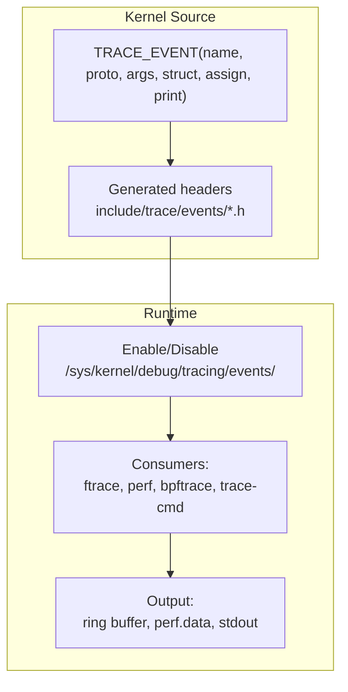
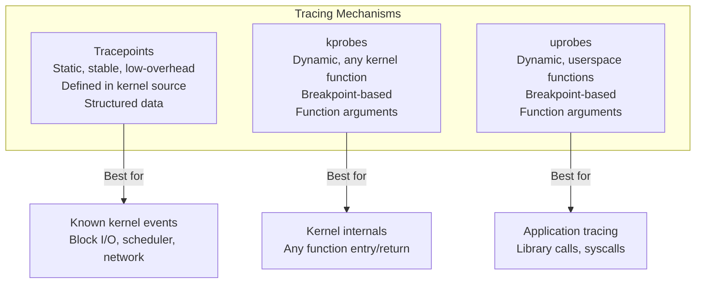

# Tracepoints

## Introduction

Tracepoints are static instrumentation points placed at strategic locations in the Linux kernel source code. Unlike kprobes (which can dynamically probe any kernel function), tracepoints are **statically defined** by kernel developers at well-known locations. They provide structured, stable, low-overhead tracing for kernel events.

Tracepoints are the backbone of Linux observability—tools like `perf`, `bpftrace`, `trace-cmd`, and `ftrace` all use tracepoints.

## Tracepoint Architecture



### How Tracepoints Work

1. Kernel developers define tracepoints using `TRACE_EVENT()` macros
2. The build system generates the necessary code
3. At runtime, tracepoints are no-ops when disabled (zero overhead)
4. When enabled, they write structured data to the kernel ring buffer
5. Consumers read events from the ring buffer

### Tracepoint vs kprobe vs uprobe



| Feature | Tracepoints | kprobes | uprobes |
|---------|-------------|---------|---------|
| Definition | Static (kernel source) | Dynamic (any function) | Dynamic (userspace) |
| Stability | Stable API | Tied to kernel version | Tied to binary |
| Overhead | Near-zero when disabled | Breakpoint overhead | Breakpoint overhead |
| Data format | Structured fields | Raw function args | Raw function args |
| Filter | Built-in field filtering | BPF filtering | BPF filtering |
| Permission | Usually root | Root | Root or ptrace |

## Listing Tracepoints

```bash
# List all available tracepoints
ls /sys/kernel/debug/tracing/events/
# alarmtimer  block  ext4  irq  kmem  net  oom  sched  syscalls  task ...

# Count tracepoints
find /sys/kernel/debug/tracing/events -name "enable" | wc -l
# 1234

# List tracepoints in a category
ls /sys/kernel/debug/tracing/events/block/
# block_bio_backmerge    block_bio_queue      block_rq_complete
# block_bio_bounce       block_bio_remap      block_rq_insert
# block_bio_complete     block_getrq          block_rq_issue
# block_bio_frontmerge   block_plug           block_rq_remap
# block_dirty_buffer     block_rq_abort       block_sleeprq
# block_touch_buffer     block_rq_requeue     block_split
#                        block_unplug

# View tracepoint format
cat /sys/kernel/debug/tracing/events/block/block_rq_issue/format
# name: block_rq_issue
# ID: 1234
# format:
# 	field:unsigned short common_type;    offset:0;   size:2;
# 	field:unsigned char common_flags;    offset:2;   size:1;
# 	field:unsigned char common_preempt_count; offset:3; size:1;
# 	field:int common_pid;                offset:4;   size:4;
#
# 	field:dev_t dev;                     offset:8;   size:4;
# 	field:sector_t sector;              offset:16;  size:8;
# 	field:unsigned int nr_sector;        offset:24;  size:4;
# 	field:unsigned int bytes;            offset:28;  size:4;
# 	field:char rwbs[8];                  offset:32;  size:8;
# 	field:char comm[16];                 offset:40;  size:16;
# 	field:__data_loc char[] cmd;        offset:56;  size:4;
#
# print fmt: "%d,%d %s %u (%s) %llu + %u [%s]", ...
```

## Enabling and Disabling Tracepoints

### Via sysfs

```bash
# Enable a specific tracepoint
echo 1 > /sys/kernel/debug/tracing/events/block/block_rq_issue/enable

# Disable
echo 0 > /sys/kernel/debug/tracing/events/block/block_rq_issue/enable

# Enable all tracepoints in a category
echo 1 > /sys/kernel/debug/tracing/events/block/enable

# Enable all tracepoints (DANGEROUS - massive overhead!)
echo 1 > /sys/kernel/debug/tracing/events/enable
```

### Via trace-cmd

```bash
# Record tracepoint events
trace-cmd record -e block:block_rq_issue -e block:block_rq_complete -e sched:sched_switch sleep 10

# Report
trace-cmd report | head -20
# CPU: 0
#  TASK-PID     CPU#  TIMESTAMP     FUNCTION
#     bash-1234  [000] 12345.678901: block_rq_issue: 8,0 WS 0 () 12345678 + 8 [bash]
#     bash-1234  [000] 12345.679012: sched_switch: prev_comm=bash prev_pid=1234 ...
#  <idle>-0     [000] 12345.680000: block_rq_complete: 8,0 WS () 12345678 + 8 [0]

# Record with specific filter
trace-cmd record -e 'block:block_rq_issue --filter rwbs ~ "W"' sleep 10
```

### Via ftrace

```bash
# Enable tracepoint via ftrace
echo block_rq_issue > /sys/kernel/debug/tracing/set_event

# Or with category
echo "block:block_rq_issue" > /sys/kernel/debug/tracing/set_event

# Multiple events
echo "block:block_rq_issue block:block_rq_complete" > /sys/kernel/debug/tracing/set_event

# View trace
cat /sys/kernel/debug/tracing/trace_pipe | head -20
# <...>-1234  [001] d... 12345.678901: block_rq_issue: 8,0 WS 0 () 12345678 + 8 [dd]
# <...>-1234  [001] d... 12345.680000: block_rq_complete: 8,0 WS () 12345678 + 8 [0]
```

### Via perf

```bash
# Record tracepoint events with perf
perf record -e block:block_rq_issue -e block:block_rq_complete -a sleep 10

# Report
perf report --stdio | head -20

# Stat (count events)
perf stat -e block:block_rq_issue -e block:block_rq_complete -a sleep 10
# Performance counter stats for 'system wide':
#     1,234  block:block_rq_issue
#     1,230  block:block_rq_complete

# Record with call graph
perf record -g -e block:block_rq_issue -a sleep 10
perf script | head -30
```

## Common Tracepoint Categories

### Scheduler Tracepoints

```bash
# Context switches
cat /sys/kernel/debug/tracing/events/sched/sched_switch/format
# Tracepoint: sched_switch
# Fields: prev_comm, prev_pid, prev_prio, prev_state, next_comm, next_pid, next_prio

# Trace context switches
trace-cmd record -e sched:sched_switch sleep 5
trace-cmd report | head -20

# Wakeup events
trace-cmd record -e sched:sched_wakeup sleep 5

# Scheduler latency analysis
trace-cmd record -e sched:sched_switch -e sched:sched_wakeup sleep 10
trace-cmd report | awk '/sched_wakeup/ && /next_comm="mysqld"/ { print }'

# CPU migration
trace-cmd record -e sched:sched_migrate_task sleep 5
# Shows when processes move between CPUs
```

### Block I/O Tracepoints

```bash
# Block I/O request issue
cat /sys/kernel/debug/tracing/events/block/block_rq_issue/format
# Fields: dev, sector, nr_sector, bytes, rwbs, comm, cmd

# Block I/O completion
cat /sys/kernel/debug/tracing/events/block/block_rq_complete/format
# Fields: dev, sector, nr_sector, bytes, rwbs, error

# Trace I/O with latency
trace-cmd record -e block:block_rq_issue -e block:block_rq_complete sleep 10

# Calculate I/O latency from trace
trace-cmd report | awk '
/block_rq_issue/ { start[$6] = $4 }
/block_rq_complete/ && start[$6] { 
    latency = $4 - start[$6]
    printf "%s sector=%s latency=%.3fms\n", $1, $6, latency * 1000
    delete start[$6]
}'

# Block I/O request merging
trace-cmd record -e block:block_bio_backmerge -e block:block_bio_frontmerge sleep 10

# I/O scheduler events
ls /sys/kernel/debug/tracing/events/block/
# block_rq_issue, block_rq_complete, block_rq_insert, block_rq_requeue
```

### Network Tracepoints

```bash
# Network receive
cat /sys/kernel/debug/tracing/events/net/netif_receive_skb/format
# Fields: skbaddr, len, name

# TCP tracepoints
ls /sys/kernel/debug/tracing/events/tcp/
# tcp_connect  tcp_destroy_sock  tcp_probe  tcp_receive_reset
# tcp_retransmit_skb  tcp_retransmit_syn_recv  tcp_send_reset
# tcp_set_state  tcp_rcv_space_adjust

# Trace TCP retransmissions
trace-cmd record -e tcp:tcp_retransmit_skb sleep 30

# TCP state changes
trace-cmd record -e tcp:tcp_set_state sleep 10
# Shows: TCP_ESTABLISHED, TCP_CLOSE, TCP_SYN_SENT, etc.

# Network device events
trace-cmd record -e net:netif_receive_skb -e net:net_dev_xmit sleep 5

# NAPI events
ls /sys/kernel/debug/tracing/events/napi/
# napi_poll
trace-cmd record -e napi:napi_poll sleep 5

# Socket events
ls /sys/kernel/debug/tracing/events/sock/
# inet_sock_set_state  sock_rcvqueue_full  sock_send_length
```

### Memory Tracepoints

```bash
# Page allocation
ls /sys/kernel/debug/tracing/events/kmem/
# kmalloc  kfree  mm_page_alloc  mm_page_free  ...

# OOM events
ls /sys/kernel/debug/tracing/events/oom/
# oom_score_adj_update  mark_victim  oom_reaper_reaped_task

# Trace page allocation
trace-cmd record -e kmem:mm_page_alloc sleep 5

# Track memory allocations by size
trace-cmd record -e kmem:kmalloc sleep 5
trace-cmd report | awk '/kmalloc/ { print $NF }' | sort -n | tail -20

# Compaction events
ls /sys/kernel/debug/tracing/events/compaction/
# mm_compaction_begin  mm_compaction_end  mm_compaction_migratepages

# Huge page events
ls /sys/kernel/debug/tracing/events/huge_memory/
# mm_collapse_huge_page  mm_khugepaged_scan_pmd
```

### Syscall Tracepoints

```bash
# All syscall entry/exit
ls /sys/kernel/debug/tracing/events/syscalls/
# sys_enter_open  sys_exit_open  sys_enter_read  sys_exit_read  ...

# Trace specific syscall
trace-cmd record -e syscalls:sys_enter_openat sleep 5
trace-cmd report | head -10
# bash-1234  [000] 12345.678: sys_enter_openat: dfd: 0xffffff9c filename: "/etc/hostname" flags: 0x0 mode: 0x0

# Trace all openat syscalls
trace-cmd record -e syscalls:sys_enter_openat -e syscalls:sys_exit_openat sleep 5

# Trace write syscalls (file I/O)
trace-cmd record -e syscalls:sys_enter_write sleep 5

# Filter by process
trace-cmd record -e 'syscalls:sys_enter_openat --filter pid == 1234' sleep 5
```

### Filesystem Tracepoints

```bash
# ext4 tracepoints
ls /sys/kernel/debug/tracing/events/ext4/
# ext4_da_write_begin  ext4_da_write_end  ext4_sync_file_enter
# ext4_sync_file_exit  ext4_journal_start  ext4_journal_stop

# Trace ext4 writes
trace-cmd record -e ext4:ext4_da_write_begin -e ext4:ext4_da_write_end sleep 5

# VFS tracepoints
ls /sys/kernel/debug/tracing/events/filemap/
# mm_filemap_add_to_page_cache  mm_filemap_delete_from_page_cache

# Trace page cache operations
trace-cmd record -e filemap:mm_filemap_add_to_page_cache sleep 5

# Btrfs tracepoints
ls /sys/kernel/debug/tracing/events/btrfs/
# btrfs_transaction_commit  btrfs_sync_file  btrfs_cow_block
```

### IRQ and Interrupt Tracepoints

```bash
# IRQ tracepoints
ls /sys/kernel/debug/tracing/events/irq/
# irq_handler_entry  irq_handler_exit  softirq_entry  softirq_exit
# softirq_raise  irq_matrix_alloc  irq_matrix_free

# Trace IRQ handlers
trace-cmd record -e irq:irq_handler_entry -e irq:irq_handler_exit sleep 5

# Softirq tracing
trace-cmd record -e irq:softirq_entry -e irq:softirq_exit sleep 5
trace-cmd report | awk '/softirq/ { print }' | head -20

# IRQ latency analysis
trace-cmd record -e irq:irq_handler_entry -e irq:irq_handler_exit \
    --filter irq == 34 sleep 10
```

## trace-cmd: Advanced Usage

### Record with Filters

```bash
# Filter by process name
trace-cmd record -e 'sched:sched_switch --filter prev_comm == "mysqld"' sleep 10

# Filter by PID
trace-cmd record -e 'sched:sched_switch --filter prev_pid == 1234' sleep 10

# Filter by field value
trace-cmd record -e 'block:block_rq_issue --filter bytes > 4096' sleep 10

# Multiple filters (AND)
trace-cmd record -e 'block:block_rq_issue --filter rwbs ~ "W" && bytes > 4096' sleep 10

# Filter with string matching
trace-cmd record -e 'block:block_rq_issue --filter comm ~ "dd"' sleep 10
```

### Record with Triggers

```bash
# Enable tracepoint with trigger (snapshot on event)
echo 'block:block_rq_issue:stacktrace' > /sys/kernel/debug/tracing/events/block/block_rq_issue/trigger

# Count trigger
echo 'block:block_rq_issue:count()' > /sys/kernel/debug/tracing/events/block/block_rq_issue/trigger

# Trace with snapshot trigger
echo 'block:block_rq_issue:snapshot' > /sys/kernel/debug/tracing/events/block/block_rq_issue/trigger

# Enable trigger on first N events
echo 'block:block_rq_issue:enable_event(sched:sched_switch):count(10)' > /sys/kernel/debug/tracing/events/block/block_rq_issue/trigger
```

### trace-cmd Profile

```bash
# Profile function calls and tracepoint events
trace-cmd profile -e sched:sched_switch -e block:block_rq_issue sleep 10

# Output includes function counts and latency
```

### trace-cmd Stream

```bash
# Stream events in real-time (like trace_pipe)
trace-cmd stream -e sched:sched_switch -e block:block_rq_issue
```

## Tracepoint Event Format

### Understanding Event Fields

```bash
# View event format
cat /sys/kernel/debug/tracing/events/sched/sched_switch/format
# name: sched_switch
# ID: 259
# format:
# 	field:unsigned short common_type;       offset:0;  size:2;  signed:0;
# 	field:unsigned char common_flags;       offset:2;  size:1;  signed:0;
# 	field:unsigned char common_preempt_count; offset:3; size:1; signed:0;
# 	field:int common_pid;                  offset:4;  size:4;  signed:1;
#
# 	field:char prev_comm[16];              offset:8;  size:16; signed:0;
# 	field:pid_t prev_pid;                  offset:24; size:4;  signed:1;
# 	field:int prev_prio;                   offset:28; size:4;  signed:1;
# 	field:long prev_state;                 offset:32; size:8;  signed:1;
# 	field:char next_comm[16];              offset:40; size:16; signed:0;
# 	field:pid_t next_pid;                  offset:56; size:4;  signed:1;
# 	field:int next_prio;                   offset:60; size:4;  signed:1;
#
# print fmt: "prev_comm=%s prev_pid=%d prev_prio=%d prev_state=%s%s ==> next_comm=%s next_pid=%d next_prio=%d", ...
```

## bpftrace with Tracepoints

### One-Liners

```bash
# Count syscalls by type
bpftrace -e 'tracepoint:raw_syscalls:sys_enter { @[comm] = count(); }'

# Histogram of block I/O sizes
bpftrace -e 'tracepoint:block:block_rq_issue { @bytes = hist(args->bytes); }'

# Trace TCP connections
bpftrace -e 'tracepoint:tcp:tcp_set_state { printf("%s %s -> %s\n", comm, ntop(args->saddr), ntop(args->daddr)); }'

# Trace OOM kills
bpftrace -e 'tracepoint:oom:mark_victim { printf("OOM victim: %s (pid %d)\n", comm, pid); }'

# Trace context switches by process
bpftrace -e 'tracepoint:sched:sched_switch { @[args->prev_comm] = count(); }'

# Trace file opens with filename
bpftrace -e 'tracepoint:syscalls:sys_enter_openat { printf("%s opened %s\n", comm, str(args->filename)); }'

# Trace page faults
bpftrace -e 'tracepoint:exceptions:page_fault_user { @[comm, ustack(5)] = count(); }'

# Trace IRQ latency
bpftrace -e '
tracepoint:irq:irq_handler_entry { @start[args->irq] = nsecs; }
tracepoint:irq:irq_handler_exit /@start[args->irq]/ { 
    @usecs = hist((nsecs - @start[args->irq]) / 1000); 
    delete(@start[args->irq]); 
}'
```

### bpftrace Scripts

```bpftrace
#!/usr/local/bin/bpftrace
// /usr/local/bin/io_latency.bt
// Trace block I/O latency distribution

tracepoint:block:block_rq_issue {
    @start[args->dev, args->sector] = nsecs;
}

tracepoint:block:block_rq_complete
/@start[args->dev, args->sector]/ {
    $latency = (nsecs - @start[args->dev, args->sector]) / 1000;
    @usecs = hist($latency);
    @bytes[args->rwbs] = hist(args->nr_sector * 512);
    delete(@start[args->dev, args->sector]);
}

END {
    clear(@start);
}
```

```bpftrace
#!/usr/local/bin/bpftrace
// /usr/local/bin/tcp_retransmits.bt
// Trace TCP retransmissions with details

tracepoint:tcp:tcp_retransmit_skb {
    printf("RETRANSMIT: %s:%d -> %s:%d (%s)\n",
        ntop(args->saddr), args->sport,
        ntop(args->daddr), args->dport,
        comm);
    @[comm] = count();
}
```

## Performance Overhead

```bash
# Disabled tracepoints: zero overhead (NOP instruction)
# Enabled tracepoints: ~100-500ns per event
# BPF attached: ~1-5μs per event (includes BPF program execution)

# Measure overhead
perf stat -e cycles,instructions -- sleep 5  # Baseline
echo 1 > /sys/kernel/debug/tracing/events/sched/sched_switch/enable
perf stat -e cycles,instructions -- sleep 5  # With tracepoint enabled
echo 0 > /sys/kernel/debug/tracing/events/sched/sched_switch/enable
```

### Overhead Comparison

| Method | Per-event Overhead | Notes |
|--------|-------------------|-------|
| Disabled tracepoint | 0 ns | NOP instruction |
| Enabled tracepoint (no reader) | ~100 ns | Conditional check + NOP |
| Enabled tracepoint (ftrace) | ~200-500 ns | Ring buffer write |
| Enabled tracepoint (perf) | ~200-500 ns | Perf ring buffer |
| BPF on tracepoint | ~1-5 μs | BPF program execution |
| kprobe (dynamic) | ~1-3 μs | Breakpoint + BPF |

### Minimizing Overhead

```bash
# 1. Use filters to reduce event volume
trace-cmd record -e 'block:block_rq_issue --filter bytes > 65536' sleep 10

# 2. Use triggers instead of continuous recording
echo 'block:block_rq_issue:count()' > /sys/kernel/debug/tracing/events/block/block_rq_issue/trigger

# 3. Record for short durations
trace-cmd record -e sched:sched_switch sleep 1  # 1 second only

# 4. Use per-CPU buffers (reduce contention)
echo 8192 > /sys/kernel/debug/tracing/buffer_size_kb

# 5. Filter by CPU
trace-cmd record -e sched:sched_switch --cpus 0,1 sleep 10
```

## Tracepoint API (Kernel Programming)

For kernel developers, tracepoints are defined using macros and connected to probes at runtime.

### Defining Tracepoints

Tracepoints are defined in header files using `DECLARE_TRACE()` or the more powerful `TRACE_EVENT()` macro:

```c
/* include/trace/events/subsys.h */
#undef TRACE_SYSTEM
#define TRACE_SYSTEM subsys

#if !defined(_TRACE_SUBSYS_H) || defined(TRACE_HEADER_MULTI_READ)
#define _TRACE_SUBSYS_H

#include <linux/tracepoint.h>

DECLARE_TRACE(subsys_eventname,
    TP_PROTO(int firstarg, struct task_struct *p),
    TP_ARGS(firstarg, p));

#endif

/* Must be outside protection */
#include <trace/define_trace.h>
```

### TRACE_EVENT Macro (Recommended)

The `TRACE_EVENT()` macro provides a richer interface with structured data:

```c
/* include/trace/events/block.h */
TRACE_EVENT(block_rq_issue,

    TP_PROTO(struct request *rq),

    TP_ARGS(rq),

    TP_STRUCT__entry(
        __field(  dev_t,  dev           )
        __field(  sector_t, sector       )
        __field(  unsigned int, nr_sector )
        __field(  unsigned int, bytes     )
        __array(  char,   rwbs,   8     )
        __array(  char,   comm,   16    )
        __dynamic_array(char, cmd, rq->cmd_len)
    ),

    TP_fast_assign(
        __entry->dev       = rq->rq_disk ? disk_devt(rq->rq_disk) : 0;
        __entry->sector    = blk_rq_pos(rq);
        __entry->nr_sector = blk_rq_sectors(rq);
        __entry->bytes     = blk_rq_bytes(rq);
        blk_fill_rwbs(__entry->rwbs, rq->cmd_flags);
        memcpy(__entry->comm, current->comm, TASK_COMM_LEN);
        memcpy(__entry->cmd, rq->cmd, rq->cmd_len);
    ),

    TP_printk("%d,%d %s %u (%s) %llu + %u [%s]",
        MAJOR(__entry->dev), MINOR(__entry->dev),
        __entry->rwbs, __entry->bytes,
        __entry->cmd, (unsigned long long)__entry->sector,
        __entry->nr_sector, __entry->comm)
);
```

### Using Tracepoints in Code

```c
/* subsys/file.c */
#include <trace/events/subsys.h>

#define CREATE_TRACE_POINTS
DEFINE_TRACE(subsys_eventname);

void somefct(void)
{
    /* ... */
    trace_subsys_eventname_tp(arg, task);
    /* ... */
}
```

- `DECLARE_TRACE()` creates `trace_subsys_eventname_tp()` (note the `_tp` suffix)
- `TRACE_EVENT()` creates `trace_subsys_eventname()` (no suffix) and exposes it in `/sys/kernel/tracing/events/`
- `CREATE_TRACE_POINTS` should appear in exactly ONE source file

### Connecting Probes (Runtime)

```c
/* Register a probe function */
register_trace_subsys_eventname(my_probe_func, my_data);

/* Unregister */
unregister_trace_subsys_eventname(my_probe_func, my_data);

/* Wait for all probe callers to finish (required before module unload) */
tracepoint_synchronize_unregister();
```

### Conditional Tracepoint Calls

For expensive parameter computation:

```c
if (trace_foo_bar_enabled()) {
    int i, tot = 0;
    for (i = 0; i < count; i++)
        tot += calculate_nuggets();
    trace_foo_bar_tp(tot);
}
```

The `trace_<tracepoint>_enabled()` function uses **static keys** (jump labels) to avoid conditional branch overhead when the tracepoint is disabled.

### Tracepoints in Header Files

```c
/* In header: use tracepoint_enabled() (lightweight) */
#include <tracepoint-defs.h>

DECLARE_TRACEPOINT(foo_bar);

static inline void some_inline_function(void)
{
    if (tracepoint_enabled(foo_bar))
        do_trace_foo_bar_wrapper(args);
}

/* In C file: actual trace call */
void do_trace_foo_bar_wrapper(args)
{
    trace_foo_bar_tp(args);
}
```

### Exporting Tracepoints for Modules

```c
/* For use in kernel modules */
EXPORT_TRACEPOINT_SYMBOL_GPL(subsys_eventname);
/* or */
EXPORT_TRACEPOINT_SYMBOL(subsys_eventname);
```

### Naming Convention

Tracepoint names are global to the kernel: `subsys_event` format (e.g., `sched_switch`, `block_rq_issue`, `tcp_retransmit_skb`). The naming scheme limits collisions between subsystems.

## Practical Tracepoint Recipes

### Recipe: I/O Latency Monitoring

```bash
#!/bin/bash
# Monitor block I/O latency in real-time
echo "Monitoring I/O latency (Ctrl+C to stop)"
trace-cmd stream -e block:block_rq_issue -e block:block_rq_complete | \
    awk '
    /block_rq_issue/ { start[$6] = $4 }
    /block_rq_complete/ && start[$6] {
        latency = ($4 - start[$6]) * 1000
        if (latency > 10) printf "SLOW I/O: sector=%s latency=%.2fms\n", $6, latency
        delete start[$6]
    }'
```

### Recipe: Network Connection Tracking

```bash
#!/bin/bash
# Track new TCP connections
trace-cmd stream -e tcp:tcp_set_state | \
    awk '/TCP_SYN_SENT/ { 
        gsub(/.*saddr=/, ""); gsub(/ daddr.*/, "")
        print strftime("%H:%M:%S"), "NEW CONN:", $0 
    }'
```

### Recipe: Scheduler Analysis

```bash
#!/bin/bash
# Find processes with most context switches
trace-cmd record -e sched:sched_switch sleep 10
trace-cmd report | awk '/sched_switch/ { count[$1]++ } END {
    for (p in count) printf "%6d %s\n", count[p], p
}' | sort -rn | head -20
```

### Recipe: OOM Investigation

```bash
#!/bin/bash
# Monitor OOM events and memory pressure
trace-cmd stream -e oom:mark_victim -e oom:oom_score_adj_update | \
    awk '/mark_victim/ { print "OOM VICTIM:", $0 }
         /oom_score_adj/ { print "SCORE CHANGE:", $0 }'
```

## References

- [Linux Tracepoint Documentation](https://www.kernel.org/doc/html/latest/trace/tracepoints.html)
- [trace-cmd Documentation](https://man7.org/linux/man-pages/man1/trace-cmd.1.html)
- [ftrace Documentation](https://www.kernel.org/doc/html/latest/trace/ftrace.html)

## Further Reading

- [The Linux Kernel Documentation](https://docs.kernel.org/)
- [GNU Project Documentation](https://www.gnu.org/doc/doc.html)
- [GNU Manuals](https://www.gnu.org/manual/manual.html)
- [Free Software Directory](https://directory.fsf.org/wiki/Main_Page)
- [Planet GNU](https://planet.gnu.org/)
- [Free Software Books](https://www.gnu.org/doc/other-free-books.html)

- <https://www.kernel.org/doc/html/latest/trace/tracepoints.html> - Tracepoint kernel documentation
- <https://man7.org/linux/man-pages/man1/trace-cmd-record.1.html> - trace-cmd record
- <https://lwn.net/Articles/379903/> - Tracepoints introduction
- [Kernel documentation: Using Tracepoints](https://docs.kernel.org/trace/tracepoints.html) — Official kernel tracepoint API documentation
- <https://lwn.net/Articles/381064/> - TRACE_EVENT macro details
- <https://lwn.net/Articles/383362/> - Tracepoint design

## Related Topics

- [Observability Overview](overview.md)
- [BPF and bpftrace](bpf-bpftrace.md)
- [Kprobes](kprobes.md)
