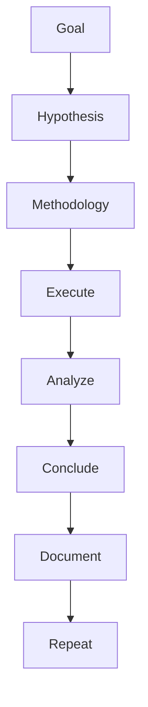
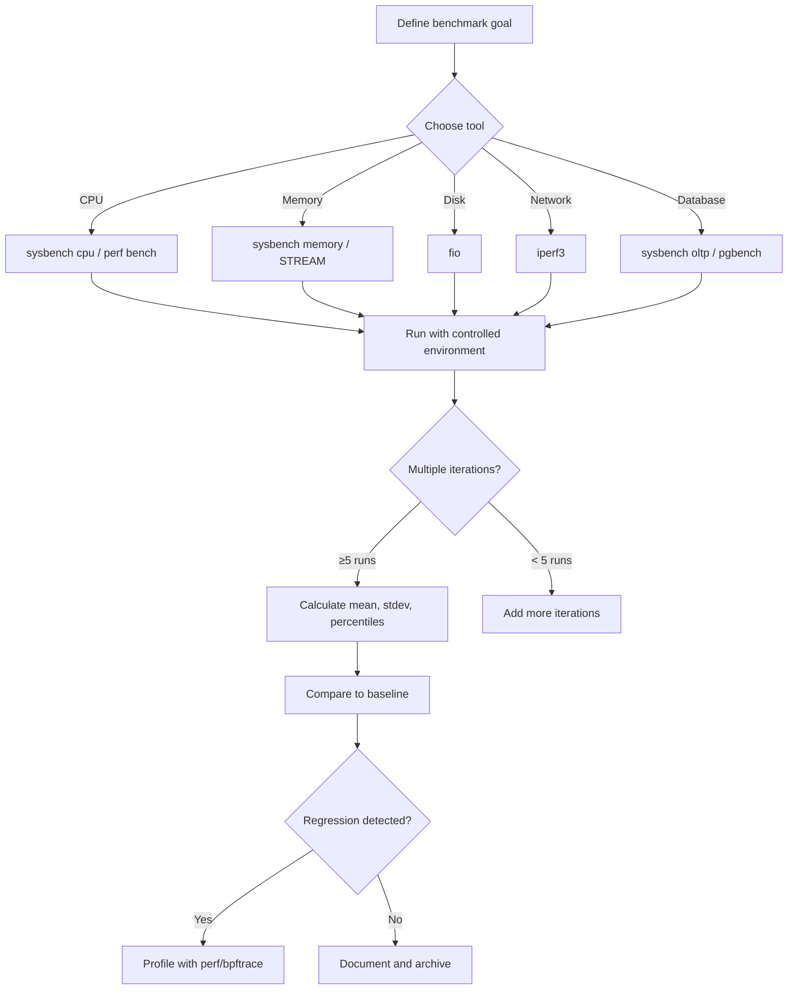

# Benchmarking

## Introduction

Benchmarking is the systematic measurement of system performance under controlled conditions. It's essential for capacity planning, hardware evaluation, performance regression detection, and optimization validation. This chapter covers the major Linux benchmarking tools: `sysbench`, `fio`, `iperf3`, `perf bench`, and the Phoronix Test Suite.

## Benchmarking Methodology

### Principles



1. **Define the goal**: What question are you answering?
2. **Control variables**: Change one thing at a time
3. **Warm up**: Run preliminary iterations to reach steady state
4. **Repeat**: Run multiple iterations for statistical significance
5. **Report**: Include methodology, raw data, and analysis

### Common Pitfalls

- **Cold cache**: First runs may be slower due to cache warming
- **Background noise**: Other processes affecting results
- **Thermal throttling**: CPU/GPU reducing frequency due to heat
- **Power management**: CPUs reducing frequency during idle periods
- **Filesystem caching**: Buffered I/O results not reflecting disk performance

## sysbench

`sysbench` is a multi-threaded benchmark tool for CPU, memory, I/O, and database workloads.

### CPU Benchmark

```bash
# CPU benchmark (compute primes)
sysbench cpu --cpu-max-prime=20000 --threads=32 --time=60 run
# CPU speed:
#     events per second:  1234.56
#
# General statistics:
#     total time:                          60.0005s
#     total number of events:              74074
#
# Latency (ms):
#          min:                                    12.34
#          avg:                                    25.89
#          max:                                    45.67
#          95th percentile:                        32.12
#          sum:                               1912345.67

# Single-threaded CPU benchmark
sysbench cpu --cpu-max-prime=20000 --threads=1 --time=60 run
```

### Memory Benchmark

```bash
# Memory bandwidth test
sysbench memory --memory-block-size=1M --memory-total-size=100G --threads=4 run
# Total operations: 102400 (12345.67 per second)
# 102400.00 MiB transferred (12345.67 MiB/sec)
#
# Latency (ms):
#          min:                                    0.01
#          avg:                                    0.32
#          max:                                    1.23

# Memory latency test
sysbench memory --memory-block-size=4K --memory-total-size=1G --memory-oper=read --threads=1 run
```

### I/O Benchmark

```bash
# File I/O benchmark
sysbench fileio --file-total-size=10G --file-test-mode=rndrw --time=60 \
    --file-num=64 --file-extra-flags=direct --threads=4 prepare

sysbench fileio --file-total-size=10G --file-test-mode=rndrw --time=60 \
    --file-num=64 --file-extra-flags=direct --threads=4 run
# File operations:
#     reads/s:                      12345.67
#     writes/s:                     5678.90
#     fsyncs/s:                     1234.56
#
# Throughput:
#     read, MiB/s:                  48.23
#     written, MiB/s:               22.18

sysbench fileio --file-total-size=10G cleanup

# Different I/O modes:
# seqrd  - sequential read
# seqwr  - sequential write
# rndrd  - random read
# rndwr  - random write
# rndrw  - random read/write
```

### MySQL Benchmark

```bash
# Prepare test database
sysbench oltp_read_write --mysql-host=localhost --mysql-user=root \
    --mysql-password=secret --mysql-db=sbtest \
    --table-size=1000000 --tables=10 --threads=16 prepare

# Run benchmark
sysbench oltp_read_write --mysql-host=localhost --mysql-user=root \
    --mysql-password=secret --mysql-db=sbtest \
    --table-size=1000000 --tables=16 --threads=16 --time=300 run
# SQL statistics:
#     queries performed:
#         read:                            1234567
#         write:                           345678
#         other:                           567890
#         total:                           2148135
#     transactions:                        123456 (411.52 per sec.)
#     queries:                             2148135 (7157.34 per sec.)
#     ignored errors:                      0      (0.00 per sec.)
#     reconnects:                          0      (0.00 per sec.)
#
# Latency (ms):
#          min:                                    1.23
#          avg:                                    38.89
#          max:                                    234.56
#          95th percentile:                        56.78

# Cleanup
sysbench oltp_read_write --mysql-host=localhost --mysql-user=root \
    --mysql-password=secret --mysql-db=sbtest cleanup
```

## fio

`fio` is the most flexible and widely-used I/O benchmarking tool:

### Basic fio Tests

```bash
# Sequential read
fio --name=seqread --filename=/dev/sda --rw=read --bs=1M \
    --ioengine=io_uring --direct=1 --size=1G --numjobs=1 --runtime=60

# Random 4K read (high IOPS)
fio --name=randread --filename=/dev/nvme0n1 --rw=randread --bs=4k \
    --ioengine=io_uring --direct=1 --iodepth=32 --numjobs=4 --runtime=60

# Random 4K write
fio --name=randwrite --filename=/dev/nvme0n1 --rw=randwrite --bs=4k \
    --ioengine=io_uring --direct=1 --iodepth=32 --numjobs=4 --runtime=60

# Mixed random read/write (70/30)
fio --name=randrw --filename=/dev/sda --rw=randrw --rwmixread=70 --bs=4k \
    --ioengine=io_uring --direct=1 --iodepth=16 --numjobs=4 --runtime=60
```

### fio Job Files

```ini
; comprehensive-test.fio
[global]
ioengine=io_uring
direct=1
size=10G
runtime=120
time_based
group_reporting
percentile_list=1:5:10:20:30:40:50:60:70:80:90:95:99:99.5:99.9:99.95:99.99

[seq-read-1m]
rw=read
bs=1M
numjobs=1
filename=/dev/sda

[rand-read-4k-qd1]
rw=randread
bs=4k
iodepth=1
numjobs=1
filename=/dev/nvme0n1

[rand-read-4k-qd32]
rw=randread
bs=4k
iodepth=32
numjobs=4
filename=/dev/nvme0n1

[rand-write-4k-qd32]
rw=randwrite
bs=4k
iodepth=32
numjobs=4
filename=/dev/nvme0n1
```

```bash
fio comprehensive-test.fio
```

## iperf3

`iperf3` measures network throughput:

```bash
# Server
iperf3 -s -p 5201

# Client - TCP
iperf3 -c 192.168.1.100 -p 5201 -t 30 -P 4
# [SUM]   0.00-30.00  sec   132 GBytes  37.8 Gbits/sec

# Client - UDP
iperf3 -c 192.168.1.100 -u -b 10G -t 30
# [  5]   0.00-30.00  sec  33.0 GBytes  9.45 Gbits/sec  0.005 ms  0/2345678 (0%)

# Client - Reverse (server sends)
iperf3 -c 192.168.1.100 -R

# Client - Bidirectional
iperf3 -c 192.168.1.100 --bidir

# Client - Parallel streams
iperf3 -c 192.168.1.100 -P 8

# JSON output
iperf3 -c 192.168.1.100 -J > result.json
```

## perf bench

`perf bench` provides built-in micro-benchmarks:

```bash
# List available benchmarks
perf bench all
# sched  - Scheduler benchmarks
# mem    - Memory benchmarks
# numa   - NUMA benchmarks
# futex  - Futex benchmarks
# epoll  - Epoll benchmarks
# all    - All benchmarks

# Scheduler benchmarks
perf bench sched messaging -g 8 -l 10000
# 8 sender threads and 8 receiver threads, 10000 messages
# Total time: 0.123456 sec

perf bench sched pipe -l 100000
# 100000 operations in 0.234567 sec = 2.345 usec/op

# Memory benchmarks
perf bench mem memcpy -s 1024MB -l 1000
# 1024MB memcpy in 0.567890 sec = 1803.23 MB/sec

perf bench mem memset -s 1024MB -l 1000
# 1024MB memset in 0.456789 sec = 2241.45 MB/sec

# NUMA benchmarks
perf bench numa mem -p 4 -t 4 -s 1024MB -m 2GB
# 4 threads, 4 processes, 1024MB per thread, 2GB total

# Futex benchmarks
perf bench futex hash
perf bench futex wake
perf bench futex requeue
```

## Phoronix Test Suite

The Phoronix Test Suite is a comprehensive, open-source benchmarking platform:

```bash
# Install
apt install phoronix-test-suite   # Debian/Ubuntu
yum install phoronix-test-suite   # RHEL/CentOS

# List available tests
phoronix-test-suite list-available-suites
# pts/server-suite        - Server Performance Tests
# pts/desktop-suite       - Desktop Performance Tests
# pts/storage-suite       - Storage Performance Tests
# pts/network-suite       - Network Performance Tests

# Run a test suite
phoronix-test-suite run pts/server-suite

# Run individual tests
phoronix-test-suite run pts/compress-7zip
phoronix-test-suite run pts/openssl
phoronix-test-suite run pts/nginx
phoronix-test-suite run pts/fio

# Compare results
phoronix-test-suite merge-results result1.xml result2.xml

# View results
phoronix-test-suite show-result
```

## Benchmark Comparison Framework

### Building a Test Harness

```bash
#!/bin/bash
# benchmark-harness.sh

set -e

RESULTS_DIR="benchmark-results/$(date +%Y%m%d-%H%M%S)"
mkdir -p "$RESULTS_DIR"

echo "=== System Info ===" | tee "$RESULTS_DIR/system-info.txt"
uname -a >> "$RESULTS_DIR/system-info.txt"
lscpu >> "$RESULTS_DIR/system-info.txt"
free -h >> "$RESULTS_DIR/system-info.txt"
cat /proc/meminfo >> "$RESULTS_DIR/system-info.txt"

echo "=== CPU Benchmark ===" | tee -a "$RESULTS_DIR/results.txt"
sysbench cpu --cpu-max-prime=20000 --threads=$(nproc) --time=60 run \
    >> "$RESULTS_DIR/results.txt" 2>&1

echo "=== Memory Benchmark ===" | tee -a "$RESULTS_DIR/results.txt"
sysbench memory --memory-block-size=1M --memory-total-size=100G \
    --threads=$(nproc) --time=60 run \
    >> "$RESULTS_DIR/results.txt" 2>&1

echo "=== Disk Benchmark ===" | tee -a "$RESULTS_DIR/results.txt"
fio --name=seqread --filename=/dev/sda --rw=read --bs=1M \
    --ioengine=io_uring --direct=1 --size=1G --numjobs=1 \
    --output="$RESULTS_DIR/fio-seqread.txt"

fio --name=randread --filename=/dev/sda --rw=randread --bs=4k \
    --ioengine=io_uring --direct=1 --iodepth=32 --numjobs=4 \
    --output="$RESULTS_DIR/fio-randread.txt"

echo "=== Network Benchmark ===" | tee -a "$RESULTS_DIR/results.txt"
iperf3 -c 192.168.1.100 -t 30 -P 4 -J > "$RESULTS_DIR/iperf3.json"

echo "Results saved to $RESULTS_DIR"
```

## Best Practices

```bash
# 1. Warm up before measuring
for i in $(seq 1 3); do
    fio --name=warmup --filename=/dev/sda --rw=randread --bs=4k \
        --ioengine=io_uring --direct=1 --runtime=10 --time_based
done

# 2. Run multiple iterations
for i in $(seq 1 5); do
    echo "=== Iteration $i ==="
    fio --name=test-$i --filename=/dev/sda --rw=randread --bs=4k \
        --ioengine=io_uring --direct=1 --runtime=60 --time_based \
        --output-format=json >> results.json
done

# 3. Control environment
# - Disable frequency scaling
for cpu in /sys/devices/system/cpu/cpu*/cpufreq/scaling_governor; do
    echo performance > $cpu
done

# - Disable NUMA balancing
echo 0 > /proc/sys/kernel/numa_balancing

# - Drop caches
echo 3 > /proc/sys/vm/drop_caches

# - Stop unnecessary services
systemctl stop cron atd
```

## Benchmark Analysis Workflow



## Statistical Analysis of Benchmark Results

Raw benchmark numbers are meaningless without statistical analysis:

### Calculating Variability

```bash
#!/bin/bash
# bench-stats.sh — Run benchmark N times and compute statistics
TOOL="sysbench cpu --cpu-max-prime=20000 --threads=$(nproc) --time=30"
RUNS=10
RESULTS=()

for i in $(seq 1 $RUNS); do
    RESULT=$($TOOL run 2>/dev/null | grep "events per second" | awk '{print $NF}')
    RESULTS+=($RESULT)
    echo "Run $i: $RESULT events/sec"
done

# Calculate mean
MEAN=$(echo "${RESULTS[@]}" | tr ' ' '\n' | awk '{sum+=$1} END {printf "%.2f", sum/NR}')

# Calculate standard deviation
STDEV=$(echo "${RESULTS[@]}" | tr ' ' '\n' | awk -v mean=$MEAN '{sum+=($1-mean)^2} END {printf "%.2f", sqrt(sum/NR)}')

# Calculate coefficient of variation
CV=$(echo "scale=2; $STDEV / $MEAN * 100" | bc)

echo ""
echo "=== Results ==="
echo "Mean: $MEAN events/sec"
echo "StdDev: $STDEV"
echo "CV: $CV%"

if (( $(echo "$CV > 5" | bc -l) )); then
    echo "WARNING: High variability (CV > 5%). Check for interference."
fi
```

### Interpreting Results

| Coefficient of Variation | Interpretation |
|------------------------|----------------|
| < 2% | Excellent — very stable |
| 2-5% | Good — acceptable noise |
| 5-10% | Fair — investigate interference |
| > 10% | Poor — results unreliable |

## Active Benchmarking

Brendan Gregg's **Active Benchmarking** methodology emphasizes understanding *why*
numbers are what they are, not just *what* they are:

```bash
# Step 1: Run benchmark and profile simultaneously
perf record -F 99 -a -g -- sysbench cpu --cpu-max-prime=20000 --threads=4 --time=30 run

# Step 2: Generate flame graph
perf script | stackcollapse-perf.pl | flamegraph.pl > bench_flame.svg

# Step 3: Identify where time is spent
# If 60% of samples are in sysbench_prime(), the benchmark is CPU-bound
# If 30% are in kernel, investigate syscalls

# Step 4: Use perf stat for hardware counters
perf stat -a -- sysbench cpu --cpu-max-prime=20000 --threads=4 --time=30 run
# 1,234,567,890  instructions   # IPC = 1.23
# 1,000,000,000  cycles
#     5,678,901  cache-misses   # 2.34%
#   243,567,890  cache-references
```

## Database Benchmarking

### pgbench (PostgreSQL)

```bash
# Initialize pgbench database
pgbench -i -s 100 mydb  # Scale factor 100 = ~10M rows

# Run benchmark
pgbench -c 32 -j 8 -T 300 mydb
# transaction type: TPC-B (sort of)
# scaling factor: 100
# query mode: simple
# number of clients: 32
# number of threads: 8
# duration: 300 s
# number of transactions actually processed: 456789
# latency average = 21.024 ms
# tps = 1522.345678 (including connections establishing)
# tps = 1523.456789 (excluding connections establishing)

# Custom SQL benchmark
pgbench -c 32 -j 8 -T 300 -f my_query.sql mydb
```

### MySQL Benchmark with sysbench

```bash
# Prepare
sysbench oltp_read_write --mysql-host=localhost --mysql-user=root \
    --mysql-db=sbtest --table-size=10000000 --tables=10 --threads=32 prepare

# Read-write benchmark
sysbench oltp_read_write --mysql-host=localhost --mysql-user=root \
    --mysql-db=sbtest --table-size=10000000 --tables=10 --threads=32 \
    --time=300 --report-interval=10 run

# Read-only benchmark
sysbench oltp_read_only --mysql-host=localhost --mysql-user=root \
    --mysql-db=sbtest --table-size=10000000 --tables=10 --threads=32 \
    --time=300 run

# Point select benchmark (simple lookups)
sysbench oltp_point_select --mysql-host=localhost --mysql-user=root \
    --mysql-db=sbtest --table-size=10000000 --tables=10 --threads=64 \
    --time=300 run
```

## Micro-Benchmarks

### lmbench

```bash
# Install lmbench
apt install lmbench

# Run all benchmarks
lmbench_all

# Key results:
# - Context switch latency: 2-5 μs
# - Pipe latency: 3-8 μs
# - Socket latency: 10-30 μs
# - Memory read latency: varies by cache level
```

### stress-ng

```bash
# Install
apt install stress-ng

# CPU stress test
stress-ng --cpu $(nproc) --timeout 60s --metrics-brief
# stress-ng: info:  [1234] dispatching hogs: 32 cpu
# stress-ng: info:  [1234] stressor      bogo ops real time  usr time  sys time
# stress-ng: info:  [1234] cpu           1234567   60.00s   1890.56s   12.34s

# Memory stress test
stress-ng --vm 4 --vm-bytes 2G --timeout 60s --metrics-brief

# Disk I/O stress test
stress-ng --iomix 4 --timeout 60s --metrics-brief

# All-round system stress
stress-ng --cpu 8 --vm 2 --vm-bytes 1G --io 4 --timeout 300s
```

## Benchmark Automation

### Benchmark CI Pipeline

```yaml
# .github/workflows/benchmark.yml
name: Performance Benchmark
on: [push, pull_request]

jobs:
  benchmark:
    runs-on: ubuntu-latest
    steps:
      - uses: actions/checkout@v4
      - name: Install tools
        run: sudo apt install -y sysbench fio iperf3
      - name: CPU benchmark
        run: sysbench cpu --cpu-max-prime=20000 --threads=$(nproc) --time=30 run > cpu.txt
      - name: Memory benchmark
        run: sysbench memory --memory-block-size=1M --memory-total-size=10G --threads=$(nproc) run > mem.txt
      - name: Upload results
        uses: actions/upload-artifact@v3
        with:
          name: benchmark-results
          path: '*.txt'
```

### Regression Detection

```bash
#!/bin/bash
# detect-regression.sh — Compare current benchmark to baseline
BASELINE="$1"
CURRENT="$2"
THRESHOLD=10  # 10% regression threshold

if [[ -z "$BASELINE" || -z "$CURRENT" ]]; then
    echo "Usage: $0 <baseline.json> <current.json>"
    exit 1
fi

# Compare fio results
BASELINE_IOPS=$(jq '.jobs[0].read.iops' "$BASELINE")
CURRENT_IOPS=$(jq '.jobs[0].read.iops' "$CURRENT")

DELTA=$(echo "scale=2; ($CURRENT_IOPS - $BASELINE_IOPS) / $BASELINE_IOPS * 100" | bc)

echo "Baseline IOPS: $BASELINE_IOPS"
echo "Current IOPS:  $CURRENT_IOPS"
echo "Delta:         $DELTA%"

if (( $(echo "$DELTA < -$THRESHOLD" | bc -l) )); then
    echo "REGRESSION DETECTED: ${DELTA}% drop in IOPS"
    exit 1
fi

echo "No regression detected."
```

## Benchmark Anti-Patterns

### Anti-Pattern: Benchmarking the Cache, Not the Device

```bash
# DON'T: Benchmark buffered I/O (measures page cache speed)
fio --name=bad --filename=/tmp/test --rw=read --bs=1M --size=1G
# Result: 10 GB/s (RAM speed, not disk speed!)

# DO: Use direct I/O to bypass page cache
fio --name=good --filename=/dev/sda --rw=read --bs=1M --size=1G --direct=1
# Result: 550 MB/s (actual disk speed)
```

### Anti-Pattern: Single Run

```bash
# DON'T: Trust a single benchmark run
fio --name=once --rw=randread --bs=4k --direct=1 --runtime=5
# Could be affected by background tasks, thermal throttling, etc.

# DO: Multiple runs with warm-up
for i in $(seq 1 5); do
    fio --name=run-$i --rw=randread --bs=4k --direct=1 \
        --runtime=60 --time_based --output-format=json >> results.json
done
```

### Anti-Pattern: Wrong Block Size

```bash
# DON'T: Use 4K for sequential throughput test
fio --name=bad --rw=read --bs=4k --direct=1 --size=1G
# Tests IOPS, not bandwidth

# DO: Match block size to workload
fio --name=throughput --rw=read --bs=1M --direct=1 --size=1G   # Throughput
fio --name=iops --rw=randread --bs=4k --direct=1 --size=1G     # IOPS
fio --name=database --rw=randread --bs=8k --direct=1 --size=1G  # Database
```

## References

- [fio Documentation](https://fio.readthedocs.io/)
- [sysbench Documentation](https://github.com/akopytov/sysbench)
- [Phoronix Test Suite](https://www.phoronix-test-suite.com/)
- [iperf3 Documentation](https://iperf.fr/iperf-doc.php)
- Gregg, B. *Systems Performance: Enterprise and the Cloud*, 2nd Edition (2020).
- [Active Benchmarking — Brendan Gregg](https://www.brendangregg.com/activebenchmarking.html)
- [Evaluating the Evaluation: A Benchmarking Checklist — Brendan Gregg](https://www.brendangregg.com/blog/2018-06-30/benchmarking-checklist.html)

## Further Reading

- [The Linux Kernel Documentation](https://docs.kernel.org/)
- [LWN.net — Linux and free software news](https://lwn.net/)
- [GNU Project Documentation](https://www.gnu.org/doc/doc.html)
- [GNU Manuals](https://www.gnu.org/manual/manual.html)
- [Free Software Directory](https://directory.fsf.org/wiki/Main_Page)
- [Planet GNU](https://planet.gnu.org/)
- [Free Software Books](https://www.gnu.org/doc/other-free-books.html)
- <https://www.brendangregg.com/linuxperf.html> — Linux performance tools
- <https://github.com/akopytov/sysbench> — sysbench on GitHub
- <https://openbenchmarking.org/> — Open benchmarking results
- <https://www.brendangregg.com/blog/2018-06-30/benchmarking-checklist.html> — Benchmarking checklist

## Related Topics

- [Performance Overview](overview.md)
- [I/O Performance](io.md)
- [CPU Performance](cpu.md)
- [Network Performance](network.md)
- [Memory Performance](memory.md)
- [NUMA Optimization](numa.md)
