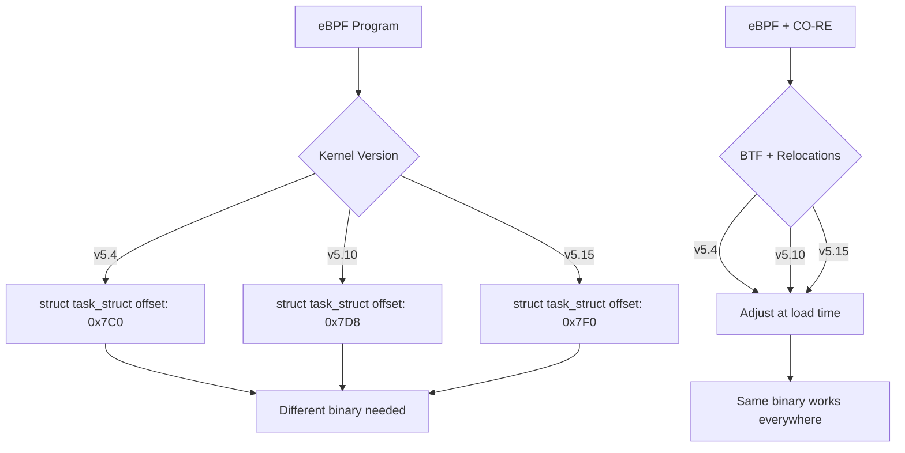
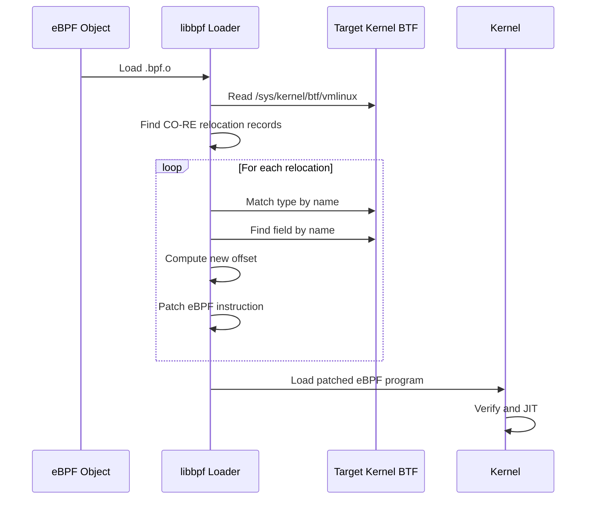

# BPF CO-RE: Compile Once – Run Everywhere

## Introduction

BPF CO-RE (Compile Once – Run Everywhere) is a technology that allows eBPF programs
to be compiled once and run on different kernel versions without recompilation. Before
CO-RE, eBPF programs had to be compiled against the exact kernel headers of the target
system, making them fragile across kernel upgrades. CO-RE solves this through BPF Type
Format (BTF) metadata and a relocation mechanism that adjusts field offsets at load time.

## The Problem CO-RE Solves



Without CO-RE, developers had to either:
1. Compile eBPF programs on each target system
2. Use raw offset calculations and hope for the best
3. Use BCC (compile at runtime) with its startup overhead

## BTF: BPF Type Format

BTF is a compact encoding of C type information, embedded in the kernel:

```mermaid
graph LR
    A[Kernel Source] --> B[pahole tool]
    B --> C[DWARF debug info]
    C --> D[BTF encoding]
    D --> E[/sys/kernel/btf/vmlinux]
    E --> F[eBPF loader]
    F --> G[Field relocation]
```

### BTF Structure

BTF encodes types as a series of type entries:

```c
/* Simplified BTF type encoding */
enum btf_kind {
    BTF_KIND_UNKN = 0,
    BTF_KIND_INT = 1,
    BTF_KIND_PTR = 2,
    BTF_KIND_ARRAY = 3,
    BTF_KIND_STRUCT = 4,
    BTF_KIND_UNION = 5,
    BTF_KIND_ENUM = 6,
    BTF_KIND_FWD = 7,
    BTF_KIND_TYPEDEF = 8,
    BTF_KIND_VOLATILE = 9,
    BTF_KIND_CONST = 10,
    BTF_KIND_RESTRICT = 11,
    BTF_KIND_FUNC = 12,
    BTF_KIND_FUNC_PROTO = 13,
    BTF_KIND_VAR = 14,
    BTF_KIND_DATASEC = 15,
};

struct btf_type {
    __u32 name_off;    /* Offset into string table */
    /* "info" contains kind (bits 0-4), kind_flag (bit 5), vlen (bits 16-31) */
    __u32 info;
    union {
        __u32 size;    /* Size of type (for struct/union/int) */
        __u32 type;    /* Referenced type ID (for ptr/const/volatile) */
    };
};

/* Struct member */
struct btf_member {
    __u32 name_off;    /* Member name offset */
    __u32 type;        /* Member type ID */
    __u32 offset;      /* Bit offset within struct */
};
```

### BTF in the Kernel

```bash
# Check if BTF is available
ls -la /sys/kernel/btf/vmlinux

# Verify BTF is enabled in kernel
cat /proc/config.gz | gunzip | grep CONFIG_DEBUG_INFO_BTF
# CONFIG_DEBUG_INFO_BTF=y

# Dump BTF for a specific type
bpftool btf dump file /sys/kernel/btf/vmlinux format c | grep -A 20 "struct task_struct"
```

## CO-RE Relocations

CO-RE uses three types of relocations embedded in the eBPF object file:

### Field Offset Relocations

```c
/* eBPF program accessing a struct field */
SEC("tracepoint/sched/sched_switch")
int handle_sched_switch(struct trace_event_raw_sched_switch *ctx)
{
    struct task_struct *next = ctx->next_task;
    /* This field access triggers a CO-RE relocation */
    int pid = BPF_CORE_READ(next, pid);
    /* The loader adjusts 'pid' offset based on target kernel's BTF */
    return 0;
}
```

The relocation record in the eBPF object:

```c
struct bpf_core_relo {
    __u32 insn_off;      /* Instruction offset to patch */
    __u32 type_id;       /* BTF type ID */
    __u32 access_str_off;/* Access string (e.g., "pid") */
    enum bpf_core_relo_kind kind;
};

enum bpf_core_relo_kind {
    BPF_CORE_FIELD_BYTE_OFFSET = 0,
    BPF_CORE_FIELD_BYTE_SIZE = 1,
    BPF_CORE_FIELD_EXISTS = 5,
    BPF_CORE_FIELD_LSHIFT_U64 = 6,
    BPF_CORE_FIELD_RSHIFT_U64 = 7,
    /* ... additional kinds up to BPF_CORE_FIELD_SIZED (11) */
};
```

### Type Existence Relocations

```c
/* Check if a struct/field exists in the running kernel */
SEC("tp/syscalls/sys_enter_read")
int handle_read(struct trace_event_raw_sys_enter *ctx)
{
    /* BPF_CORE_READ_INTO checks field existence */
    if (bpf_core_field_exists(struct task_struct, __state)) {
        /* Kernel >= 5.14: uses __state */
        BPF_CORE_READ_INTO(&state, task, __state);
    } else {
        /* Older kernel: uses state */
        BPF_CORE_READ_INTO(&state, task, state);
    }
    return 0;
}
```

### Type Size Relocations

```c
/* Use type size from target kernel */
SEC("kprobe/do_sys_open")
int handle_open(struct pt_regs *ctx)
{
    struct task_struct *task = (void *)bpf_get_current_task();
    /* Size of task_struct may differ across kernels */
    __u32 size = bpf_core_type_size(struct task_struct);
    /* 'size' is resolved at load time */
    return 0;
}
```

## libbpf CO-RE API

### BPF_CORE_READ()

```c
#include <bpf/bpf_helpers.h>
#include <bpf/bpf_core_read.h>

SEC("kprobe/do_sys_openat2")
int BPF_KPROBE(do_sys_openat2, int dfd, const char *filename,
               struct open_how *how)
{
    struct task_struct *task = (void *)bpf_get_current_task();

    /* CO-RE: read comm across any kernel version */
    char comm[16];
    BPF_CORE_READ_INTO(comm, task, comm);

    /* CO-RE: read parent pid */
    int ppid = BPF_CORE_READ(task, real_parent, tgid);

    /* CO-RE: read filename from user pointer */
    char fname[256];
    bpf_probe_read_user_str(fname, sizeof(fname), filename);

    bpf_printk("openat2: %s (comm=%s, ppid=%d)", fname, comm, ppid);
    return 0;
}
```

### BPF_CORE_READ_INTO()

```c
/* Read into a local variable */
int pid;
BPF_CORE_READ_INTO(&pid, task, pid);

/* Nested access */
int grandparent_pid;
BPF_CORE_READ_INTO(&grandparent_pid, task, real_parent, real_parent, tgid);
```

### bpf_core_field_exists()

```c
SEC("kprobe/...")
int BPF_KPROBE(handle_func)
{
    struct task_struct *task = (void *)bpf_get_current_task();

    /* Kernel >= 5.14 renamed 'state' to '__state' */
    if (bpf_core_field_exists(task->__state)) {
        /* Use __state (newer kernel) */
        __u32 state = BPF_CORE_READ(task, __state);
        /* ... */
    } else {
        /* Use state (older kernel) */
        long state = BPF_CORE_READ(task, state);
        /* ... */
    }

    return 0;
}
```

### bpf_core_type_exists()

```c
/* Check if a type exists at all */
if (bpf_core_type_exists(struct trace_event_raw_sched_switch)) {
    /* Type exists - use it */
} else {
    /* Type doesn't exist - use alternative */
}
```

## Build System

### Makefile for CO-RE Programs

```makefile
# Makefile for BPF CO-RE programs
CLANG ?= clang
BPFTOOL ?= bpftool

BPF_CFLAGS := -g -O2 -target bpf -D__TARGET_ARCH_x86

# vmlinux.h: kernel type definitions from BTF
VMLINUX_H := vmlinux.h

# Generate vmlinux.h from running kernel
$(VMLINUX_H):
	$(BPFTOOL) btf dump file /sys/kernel/btf/vmlinux format c > $@

# Compile eBPF program
%.bpf.o: %.bpf.c $(VMLINUX_H)
	$(CLANG) $(BPF_CFLAGS) -c $< -o $@

# Generate skeleton (auto-attach helpers)
%.skel.h: %.bpf.o
	$(BPFTOOL) gen skeleton $< > $@

# Compile user-space loader
%: %.c %.skel.h
	$(CC) -g -O2 -Wall $< -lbpf -lelf -lz -o $@

clean:
	rm -f *.o *.skel.h vmlinux.h
```

### Generating vmlinux.h

```bash
# Generate vmlinux.h from running kernel's BTF
bpftool btf dump file /sys/kernel/btf/vmlinux format c > vmlinux.h

# Or from a specific kernel build
bpftool btf dump file /path/to/vmlinux format c > vmlinux.h
```

### vmlinux.h Content

```c
/* Auto-generated - DO NOT EDIT */
struct task_struct {
    struct thread_info thread_info;
    unsigned int __state;
    /* ... all fields from running kernel's BTF ... */
};

struct pid_namespace {
    struct kref kref;
    unsigned int level;
    struct pid_namespace *parent;
    /* ... */
};
```

## BPF Skeleton

The skeleton provides auto-generated code for loading and attaching:

```c
/* Auto-generated from task_struct.bpf.o */
#include "task_struct.skel.h"

int main(void)
{
    struct task_struct_bpf *skel;
    int err;

    /* Open and load with CO-RE relocations */
    skel = task_struct_bpf__open_and_load();
    if (!skel) {
        fprintf(stderr, "Failed to open BPF skeleton\n");
        return 1;
    }

    /* Auto-attach to tracepoints/kprobes */
    err = task_struct_bpf__attach(skel);
    if (err) {
        fprintf(stderr, "Failed to attach BPF program\n");
        return 1;
    }

    /* Read output from perf buffer */
    /* ... */

    task_struct_bpf__destroy(skel);
    return 0;
}
```

## CO-RE Relocation Process



## Advanced CO-RE Patterns

### Handling Struct Renames

```c
/* Handle struct field renames across kernel versions */
SEC("kprobe/...")
int handle_func(struct pt_regs *ctx)
{
    struct task_struct *task = (void *)bpf_get_current_task();

    /* In 5.14+, 'state' was renamed to '__state' */
    if (bpf_core_field_exists(task->__state)) {
        /* New kernel */
        __u32 state;
        BPF_CORE_READ_INTO(&state, task, __state);
        /* Process state */
    } else {
        /* Old kernel */
        long state;
        BPF_CORE_READ_INTO(&state, task, state);
        /* Process state */
    }

    return 0;
}
```

### Handling Struct Relocations

```c
/* Read a field that may be in different locations */
SEC("kprobe/...")
int handle_func(struct pt_regs *ctx)
{
    struct file *file;
    /* ... get file pointer ... */

    /* In newer kernels, f_path.dentry exists */
    /* In older kernels, f_dentry exists directly */
    struct dentry *dentry;
    if (bpf_core_field_exists(file->f_path.dentry)) {
        BPF_CORE_READ_INTO(&dentry, file, f_path, dentry);
    } else {
        BPF_CORE_READ_INTO(&dentry, file, f_dentry);
    }

    return 0;
}
```

### Type Graph Matching

```c
/* CO-RE can match types across renames and splits */
/* If a struct is renamed, CO-RE uses the type graph to find it */

/* In the eBPF object, reference the type as it existed at compile time */
/* CO-RE will find the equivalent type in the target kernel */
```

## BTF Generation from Module BTFs

Linux 5.11+ supports module BTFs for kernel modules:

```bash
# List all BTF objects
ls /sys/kernel/btf/

# vmlinux (main kernel)
# plus module BTFs:
# nf_conntrack
# ip_tables
# ...

# bpftool can merge module BTFs
bpftool btf dump file /sys/kernel/btf/nf_conntrack format c
```

## Performance Considerations

| Aspect | Without CO-RE | With CO-RE |
|--------|-------------|-----------|
| Compilation target | Per-kernel | Single binary |
| Load time | Fast (pre-resolved) | Slightly slower (relocations) |
| Runtime overhead | None | None (relocations are load-time) |
| Portability | Low | High |

## Debugging CO-RE

### Verifying Relocations

```bash
# Check relocation records in eBPF object
bpftool btf dump file my_prog.bpf.o format raw

# Check if BTF is available
bpftool feature probe kernel | grep btf

# Debug libbpf loading
LIBBPF_DEBUG=1 ./my_prog
```

### Common Issues

```c
/* PROBLEM: Using raw offsets instead of CO-RE */
/* BAD */
int pid = *(int *)(task + 0x7C0);  /* Hardcoded offset */

/* GOOD: Use CO-RE */
int pid = BPF_CORE_READ(task, pid);  /* Relocated at load time */
```

### CO-RE Feature Probe

```bash
# Check CO-RE support
bpftool feature probe kernel | grep -E "btf|core"

# Output:
# btf: yes
# btf_func: yes
# btf_decl_tag: yes
# btf_type_tag: yes
```

## Kernel Configuration

```
CONFIG_DEBUG_INFO_BTF=y       # Required for BTF generation
CONFIG_DEBUG_INFO_BTF_MODULES=y  # Module BTFs (5.11+)
CONFIG_BPF_JIT=y              # JIT compilation
CONFIG_BPF_SYSCALL=y          # BPF syscall support
CONFIG_MODULES=y              # Kernel module support
```

## Tools

### bpftool

```bash
# Inspect BTF
bpftool btf dump file /sys/kernel/btf/vmlinux format c

# Show CO-RE relocations in a program
bpftool prog show id 42

# List loaded programs with CO-RE info
bpftool prog list
```

### pahole

```bash
# Generate BTF from DWARF
pahole --btf_encode_force -j vmlinux

# Show struct layout
pahole -C task_struct vmlinux
```

## Cross-References

- [eBPF](ebpf.md) - eBPF fundamentals
- [BPF/BPFtrace](../../observability/bpf-bpftrace.md) - BPF observability
- [Kprobes](../../observability/kprobes.md) - Kernel probes
- [Tracepoints](../../observability/tracepoints.md) - Static tracepoints
- [ftrace](ftrace.md) - Function tracing
- [Kernel Debugging](kernel-debugging.md) - General debugging techniques

## Further Reading

- [BPF CO-RE reference guide](https://nakryiko.com/posts/bpf-core-reference-guide/)
- [BPF CO-RE: Compile Once – Run Everywhere (Alexei Starovoitov)](https://www.usenix.org/conference/lisa19/presentation/starovoitov)
- [libbpf-bootstrap](https://github.com/libbpf/libbpf-bootstrap)
- [BTF specification](https://www.kernel.org/doc/html/latest/bpf/btf.html)
- [Andrii Nakryiko's CO-RE blog series](https://nakryiko.com/posts/bpf-core-reference-guide/)
- [pahole tool](https://github.com/acmel/dwarves)
- [bpftool documentation](https://www.kernel.org/doc/html/latest/bpf/bpftool.html)
- [eBPF CO-RE talk (eBPF Summit)](https://www.youtube.com/watch?v=118a1w3PTao)
