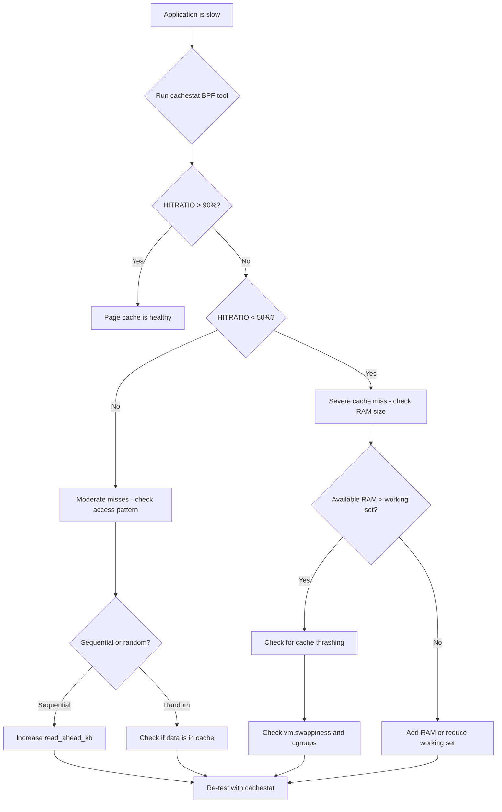
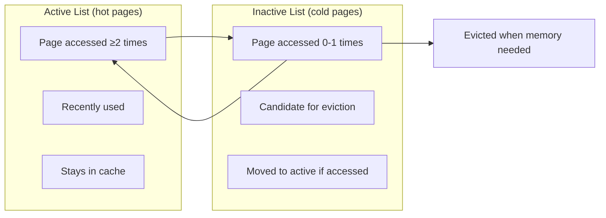

# Cachestat — Page Cache Statistics

Cachestat is a mechanism for observing Linux **page cache** behavior in real
time.  It tells you which pages of a file are cached in RAM and how the cache
is being used — critical information for performance tuning, debugging I/O
bottlenecks, and understanding memory pressure.

---

## 1. Background: The Page Cache

The Linux page cache is an in-memory cache of file data.  When a process reads
a file, the kernel first checks the page cache:

```
Process read() → VFS → page cache hit? → return cached data
                                  miss → read from disk → cache it → return
```

Understanding cache behavior is essential because:

* **Cache hits** = fast (nanoseconds, memory speed)
* **Cache misses** = slow (milliseconds, disk speed)
* The ratio of hits to misses determines I/O performance

---

## 2. The `cachestat()` Syscall (Linux 6.5+)

### 2.1 Overview

The `cachestat()` syscall was added by Fenghua Yu in Linux 6.5 (August 2023).
It provides per-file page cache statistics without scanning the entire page
cache.

```c
#include <sys/syscall.h>
#include <unistd.h>

struct cachestat_range {
    __u64 off;    /* start offset (in pages) */
    __u64 len;    /* number of pages */
};

struct cachestat {
    __u64 nr_cache;      /* pages in cache */
    __u64 nr_dirty;      /* dirty pages in cache */
    __u64 nr_writeback;  /* pages being written back */
    __u64 nr_evicted;    /* pages evicted since last call */
    __u64 nr_recently_evicted; /* recently evicted pages */
};

int cachestat(int fd, struct cachestat_range *cstat_range,
              struct cachestat *cstat, unsigned int flags);
```

### 2.2 Arguments

| Argument | Meaning |
|---|---|
| `fd` | Open file descriptor |
| `cstat_range` | Range of pages to query (NULL = entire file) |
| `cstat` | Output: cache statistics |
| `flags` | Must be 0 (reserved for future use) |

### 2.3 Example

```c
#include <fcntl.h>
#include <stdio.h>
#include <sys/syscall.h>
#include <unistd.h>

int main(void)
{
    int fd = open("/var/log/syslog", O_RDONLY);
    if (fd < 0) return 1;

    struct cachestat cs;
    int ret = syscall(SYS_cachestat, fd, NULL, &cs, 0);
    if (ret < 0) {
        perror("cachestat");
        return 1;
    }

    printf("Cached pages:     %llu\n", cs.nr_cache);
    printf("Dirty pages:      %llu\n", cs.nr_dirty);
    printf("Writeback pages:  %llu\n", cs.nr_writeback);
    printf("Evicted pages:    %llu\n", cs.nr_evicted);

    close(fd);
    return 0;
}
```

### 2.4 Output Fields

| Field | Meaning |
|---|---|
| `nr_cache` | Total pages currently in the page cache |
| `nr_dirty` | Modified pages not yet written to disk |
| `nr_writeback` | Pages currently being flushed to disk |
| `nr_evicted` | Pages removed from cache since last call |
| `nr_recently_evicted` | Pages evicted recently (within eviction window) |

### 2.5 Advantages Over Older Methods

| Method | Scope | Speed | Accuracy |
|---|---|---|---|
| `mincore()` | Per-range, binary | Slow for large files | Exact per-page |
| `/proc/PID/pagemap` | Per-process | Slow | Exact |
| `fincore` | Per-file | Medium | Exact |
| **`cachestat()`** | Per-file or range | **Fast** | **Exact** |

`cachestat()` is implemented by walking the file's `address_space` radix tree,
which is much faster than scanning `/proc` or using `mincore()`.

---

## 3. `fincore` — Userspace Tool

`fincore` (file core) is a command-line tool that shows which pages of a file
are in the page cache.

### 3.1 Usage

```bash
# Install
sudo apt install linux-tools-common   # Debian/Ubuntu
sudo yum install util-linux           # RHEL/Fedora

# Check if a file is cached
fincore /var/log/syslog
```

### 3.2 Output

```
pages   size     total  cached  percent  filename
  512    4K      2.0M   1.2M     60.0%   /var/log/syslog
```

| Column | Meaning |
|---|---|
| `pages` | Total pages in the file |
| `size` | Page size |
| `total` | Total file size |
| `cached` | Bytes currently in page cache |
| `percent` | Cache hit ratio |
| `filename` | File being queried |

### 3.3 Behind the Scenes

`fincore` uses `mincore()` to check each page:

```c
unsigned char *vec = malloc((st.st_size + PAGE_SIZE - 1) / PAGE_SIZE);
mincore(addr, st.st_size, vec);

for (i = 0; i < nr_pages; i++) {
    if (vec[i] & 1)
        cached_pages++;
}
```

For large files, this is slow because `mincore()` must walk the page tables.
`cachestat()` avoids this overhead.

---

## 4. Mincore Syscall

`mincore()` is the older interface (since Linux 2.3.99) for querying page
cache status:

```c
#include <sys/mman.h>

int mincore(void *addr, size_t length, unsigned char *vec);
```

### 4.1 How It Works

1. The address range must be mapped (via `mmap()`).
2. For each page, `vec[i]` is set to 1 if the page is in cache, 0 otherwise.

### 4.2 Limitations

* Requires `mmap()` — cannot query arbitrary files without mapping them.
* Scans page tables — O(n) in the number of pages.
* No dirty/writeback information.
* Requires read access to the file.

---

## 5. Page Cache Monitoring Tools

### 5.1 `/proc/meminfo`

```bash
grep -i cache /proc/meminfo
```

Output:

```
Cached:          4096000 kB
Buffers:          128000 kB
SwapCached:            0 kB
```

### 5.2 `/proc/vmstat`

```bash
grep -E "pgpg|pswp|pgfault|pgmajfault" /proc/vmstat
```

| Counter | Meaning |
|---|---|
| `pgpgin` | Pages read from disk |
| `pgpgout` | Pages written to disk |
| `pswpin` | Pages swapped in |
| `pswpout` | Pages swapped out |
| `pgfault` | Minor page faults (cache hit or new allocation) |
| `pgmajfault` | Major page faults (disk read required) |

### 5.3 `vmstat` (Brendan Gregg's cachestat BPF tool)

Before the `cachestat()` syscall, Brendan Gregg created a BPF-based
`cachestat` tool in bcc:

```bash
sudo cachestat 1    # sample every 1 second
```

Output:

```
    HITS   MISSES  DIRTIES  HITRATIO  BUFFERS_MB  CACHED_MB
  123456     1234     5678     99.0%         128       4096
```

| Column | Meaning |
|---|---|
| `HITS` | Cache hits per interval |
| `MISSES` | Cache misses per interval |
| `DIRTIES` | Pages dirtied per interval |
| `HITRATIO` | `HITS / (HITS + MISSES)` |
| `BUFFERS_MB` | Buffer cache size |
| `CACHED_MB` | Page cache size |

### 5.4 BPF Tracepoints

The kernel exposes page cache events via tracepoints:

```bash
# Trace page cache hits
sudo bpftrace -e 'tracepoint:filemap:mm_filemap_add_to_page_cache { @[comm] = count(); }'

# Trace page cache misses (major faults)
sudo bpftrace -e 'tracepoint:exceptions:page_fault_user { @[comm] = count(); }'
```

---

## 6. Page Cache Behavior

### 6.1 Read Ahead

When the kernel detects sequential access, it **read-ahead** — pre-loading
pages into the cache before they're requested:

```bash
# Check read-ahead setting
cat /sys/block/sda/queue/read_ahead_kb
# Default: 128 (KB)

# Increase for sequential workloads
echo 2048 > /sys/block/sda/queue/read_ahead_kb
```

### 6.2 Write-back

Dirty pages are written to disk by the `bdflush` / `writeback` threads:

```bash
# Dirty page settings
cat /proc/sys/vm/dirty_ratio           # % of RAM before forced writeback
cat /proc/sys/vm/dirty_background_ratio # % of RAM before background writeback
cat /proc/sys/vm/dirty_expire_centisecs # max age of dirty pages (centiseconds)
```

### 6.3 Eviction

When memory is needed, the kernel evicts clean (non-dirty) pages first:

* **LRU-like** — recently used pages survive; cold pages are evicted.
* **Inactive list** — pages not accessed recently.
* **Active list** — pages accessed at least twice.
* **Cgroups** — memory cgroups have their own LRU lists.

---

## 7. Practical Use Cases

### 7.1 Database Tuning

```bash
# Check if database files are cached
fincore /var/lib/mysql/ibdata1
fincore /var/lib/mysql/mydb/users.ibd

# If cache hit ratio is low, increase RAM or tune innodb_buffer_pool_size
```

### 7.2 Web Server Optimization

```bash
# Check if static assets are cached
find /var/www -type f -name "*.js" -exec fincore {} \;

# Pre-warm cache
cat /var/www/static/*.js > /dev/null
```

### 7.3 Identifying I/O Bottlenecks

```bash
# High major fault rate = disk-bound workload
watch -n 1 'grep pgmajfault /proc/vmstat'

# Use cachestat BPF tool for real-time view
sudo cachestat-bpfcc 1
```

### 7.4 Monitoring with `cachestat()` Syscall

```c
/* Monitor cache usage over time */
while (1) {
    cachestat(fd, NULL, &cs, 0);
    printf("Cached: %llu  Dirty: %llu  Evicted: %llu\n",
           cs.nr_cache, cs.nr_dirty, cs.nr_evicted);
    sleep(1);
}
```

---

## 8. Performance Impact

Querying page cache statistics is not free:

| Method | Overhead | Notes |
|---|---|---|
| `mincore()` | Medium-High | Walks page tables |
| `/proc/*/pagemap` | High | Per-process, sequential read |
| `fincore` | Medium | Uses `mincore()` |
| `cachestat()` | **Low** | Walks radix tree directly |
| BPF tracepoints | Near-zero | Event-driven |

For production monitoring, prefer `cachestat()` or BPF-based tools.

---

## 9. Kernel Configuration

```
CONFIG_CACHESTAT_SYSCALL=y   # Enable cachestat() syscall (6.5+)
```

The syscall is available on x86_64, ARM64, and other architectures.

---

## 10. Further Reading

* **LWN: [The cachestat() syscall](https://lwn.net/Articles/936574/)**
* **Brendan Gregg: [Cachestat](https://www.brendangregg.com/Perf/bcc_cachestat.html)**
* **Documentation: `Documentation/filesystems/cachestat.rst`**
* **man page: `man 2 cachestat`**
* **Source: `mm/filemap.c` — `cachestat()` implementation**
* **BPF tools: `tools/cachestat` in the bcc repository**

---

## 11. Cache Analysis Workflow



## 12. Advanced Page Cache Analysis

### Per-File Cache Analysis with bpftrace

```bash
# Which files are being added to cache?
sudo bpftrace -e '
tracepoint:filemap:mm_filemap_add_to_page_cache {
    @files[args->inode] = count();
    @by_comm[comm] = count();
}
'

# Cache miss rate per process
sudo bpftrace -e '
BEGIN { printf("Tracking page cache misses...\n"); }
tracepoint:filemap:mm_filemap_add_to_page_cache {
    @misses[comm] = count();
}
interval:s:5 {
    print(@misses);
    clear(@misses);
}
'

# Page eviction tracking
sudo bpftrace -e '
tracepoint:vmscan:mm_shrink_slab_start {
    @evictions[comm] = count();
}
interval:s:10 {
    printf("=== Evictions per process (10s) ===\n");
    print(@evictions);
    clear(@evictions);
}
'
```

### Cache Pressure Analysis

```bash
# Monitor cache pressure over time
watch -n 1 'grep -E "Cached|Buffers|Dirty|Writeback|Active\(file\)|Inactive\(file\)" /proc/meminfo'

# Cache pressure ratio
# = (Active(file) + Inactive(file)) / MemTotal
# Low ratio = most RAM used by apps, little cache
# High ratio = most RAM used by cache

# Using sar for historical cache stats
sar -r 1 5
# kbmemfree kbmemused  %memused  kbbuffers  kbcached  %commit  kbactive  kbinact
#   2048576  30719424     93.75     654320  18234560    49.56  12345678  18765432
```

### Cache Warming Strategies

```bash
# Pre-warm cache for database files
find /var/lib/mysql -name "*.ibd" -exec cat {} > /dev/null \;

# Pre-warm with vmtouch (more control)
vmtouch -t /var/lib/mysql/mydb/*.ibd    # Touch (load into cache)
vmtouch -e /var/lib/mysql/mydb/*.ibd    # Evict from cache
vmtouch -v /var/lib/mysql/mydb/*.ibd    # Show cache status

# Install vmtouch
apt install vmtouch

# Systematic cache warming script
#!/bin/bash
# warm-cache.sh — Pre-load critical files into page cache
CRITICAL_FILES=(
    "/var/lib/mysql/ibdata1"
    "/var/lib/mysql/ib_logfile0"
    "/var/www/static/*.js"
    "/var/www/static/*.css"
)
for pattern in "${CRITICAL_FILES[@]}"; do
    for f in $pattern; do
        [[ -f "$f" ]] && vmtouch -t "$f"
    done
done
echo "Cache warming complete"
vmtouch /var/lib/mysql/ | tail -1
```

### Monitoring Cache Behavior During Workload

```bash
# Full cache monitoring dashboard
#!/bin/bash
# cache-monitor.sh — Real-time cache monitoring
while true; do
    clear
    echo "=== Page Cache Status ($(date)) ==="
    echo ""
    grep -E "Cached:|Buffers:|Dirty:|Writeback:" /proc/meminfo
    echo ""
    echo "=== Cache Hit Rate ==="
    grep -E "pgpgin|pgpgout|pswpin|pswpout|pgfault|pgmajfault" /proc/vmstat
    echo ""
    echo "=== Per-Device Read Ahead ==="
    for dev in /sys/block/*/queue/read_ahead_kb; do
        echo "$(dirname $(dirname $dev)): $(cat $dev) KB"
    done
    sleep 2
done
```

## 13. Cache Behavior for Specific Workloads

### Database Workloads

```bash
# PostgreSQL: Check shared buffer cache vs page cache
# shared_buffers = 8GB → PostgreSQL manages its own cache
# effective_cache_size = 24GB → estimates OS page cache

# Monitor PostgreSQL cache hit ratio
psql -c "SELECT
dbname,
blks_hit,
blks_read,
round(blks_hit * 100.0 / (blks_hit + blks_read), 2) as cache_hit_ratio
FROM pg_stat_database
WHERE blks_hit + blks_read > 0;"

# If cache_hit_ratio < 99%, increase shared_buffers
# Also check OS page cache for WAL files
fincore /var/lib/postgresql/data/pg_wal/*
```

### Web Server Workloads

```bash
# Nginx: Static file serving
# Check if static files are cached
find /var/www -name "*.html" -o -name "*.js" -o -name "*.css" | \
    xargs fincore 2>/dev/null | awk '$5 > 0 {print "Cached:", $6}'

# Pre-warm frequently accessed files
for f in /var/www/html/index.html /var/www/static/app.js; do
    cat "$f" > /dev/null 2>&1
done

# Monitor cache usage for Nginx open_file_cache
curl -s http://localhost/nginx_status
# Active connections: 1234
# Reading: 5  Writing: 12  Waiting: 1317
```

### Virtual Machine Host Caching

```bash
# For KVM hosts, check host page cache vs guest disk cache
# Guest disk cache mode affects host caching:
# cache=none → O_DIRECT, bypasses host page cache
# cache=writeback → uses host page cache
# cache=writethrough → read cache, no write cache

# Check QEMU disk cache setting
ps aux | grep qemu | grep -oP 'cache=\w+'

# Monitor host cache for guest disk images
fincore /var/lib/libvirt/images/*.qcow2
```

## 14. Page Cache Internals

### LRU List Structure

The kernel maintains two LRU (Least Recently Used) lists for page cache:



```bash
# View LRU list sizes
grep -E "Active\(file\)|Inactive\(file\)" /proc/meminfo
# Active(file):   12345678 kB  ← hot file pages
# Inactive(file): 18765432 kB  ← cold file pages

# Ratio of active to inactive indicates cache efficiency
# Active/Inactive > 1 → most pages are hot (good)
# Active/Inactive < 1 → many cold pages (may need more RAM)
```

### Cgroup Memory and Page Cache

```bash
# Per-cgroup cache stats
cat /sys/fs/cgroup/myapp/memory.stat | grep -E "cache|pgfault|pgmajfault"
# cache 123456789
# pgfault 345678
# pgmajfault 1234

# High pgmajfault in cgroup = cache misses for that workload
# Solutions:
# 1. Increase cgroup memory limit
# 2. Reduce other cgroup cache usage
# 3. Use memory.min to protect cache

echo 8G > /sys/fs/cgroup/myapp/memory.min  # Protect 8GB from reclaim
```

## 15. Further Reading

* **LWN: [The cachestat() syscall](https://lwn.net/Articles/936574/)**
* **Brendan Gregg: [Cachestat](https://www.brendangregg.com/Perf/bcc_cachestat.html)**
* **Documentation: `Documentation/filesystems/cachestat.rst`**
* **man page: `man 2 cachestat`**
* **Source: `mm/filemap.c` — `cachestat()` implementation**
* **BPF tools: `tools/cachestat` in the bcc repository**
* Gregg, B. *Systems Performance: Enterprise and the Cloud*, 2nd Edition (2020).
* [vmtouch — Virtual Memory Touch](https://hoytech.com/vmtouch/)

## Cross-References

* [Page Cache](../kernel/memory/page-cache.md) — the page cache subsystem
* [Page Reclaim](../kernel/memory/reclaim.md) — LRU and eviction
* [Writeback](../kernel/memory/writeback.md) — dirty page flushing
* [Swap](../kernel/memory/swap.md) — when pages go to disk
* [BPF](../kernel/bpf/index.md) — programmable kernel tracing
* [I/O Schedulers](../kernel/block/io-schedulers.md) — disk I/O scheduling
* [Memory Performance](memory.md)
* [I/O Performance](io.md)
* [Kernel Tuning Parameters](kernel-params.md)
