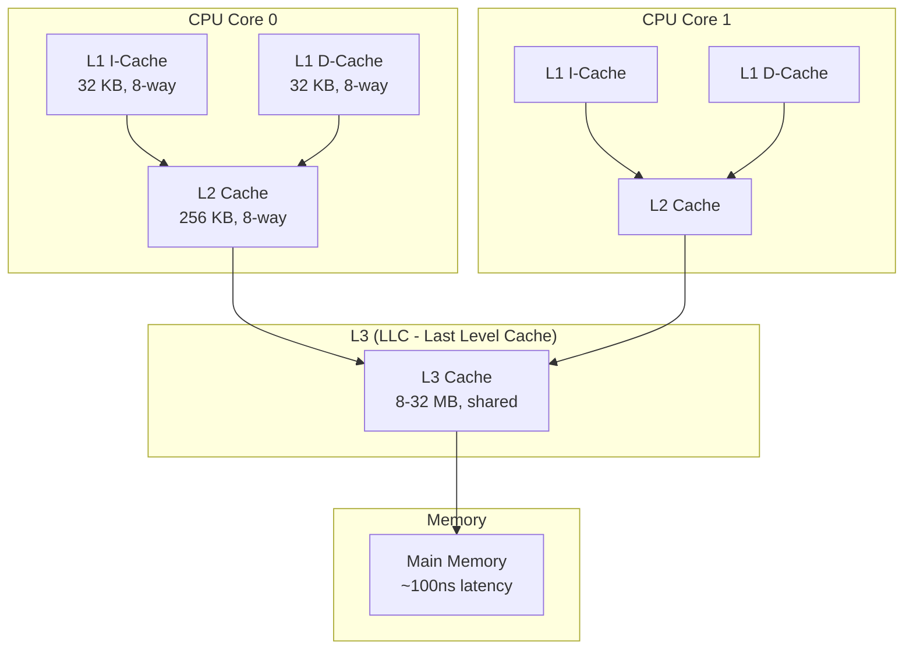
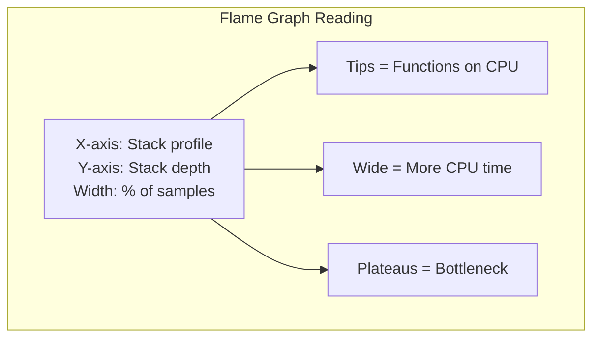

# CPU Performance

## Introduction

CPU performance analysis in Linux goes far beyond watching `top` output. Understanding CPU microarchitecture, cache hierarchies, NUMA effects, scheduler latency, and profiling tools is essential for diagnosing performance problems and optimizing applications.

This chapter covers `perf` for CPU profiling, flame graphs for visualization, CPU cache behavior, NUMA effects, and scheduler latency analysis.

## CPU Architecture for Performance Engineers

### Cache Hierarchy



### Memory Latency Hierarchy

| Level | Typical Latency | Typical Size |
|-------|----------------|--------------|
| L1 Cache | ~1 ns (4 cycles) | 32-64 KB |
| L2 Cache | ~4 ns (12 cycles) | 256 KB - 1 MB |
| L3 Cache | ~12 ns (40 cycles) | 4-32 MB |
| Local DRAM | ~60 ns (200 cycles) | 16-512 GB |
| Remote DRAM (NUMA) | ~120 ns (400 cycles) | Varies |

### CPU Topology

```bash
# View CPU topology
lscpu
# Architecture:        x86_64
# CPU op-mode(s):      32-bit, 64-bit
# Byte Order:          Little Endian
# CPU(s):              32
# On-line CPU(s) list: 0-31
# Thread(s) per core:  2
# Core(s) per socket:  8
# Socket(s):           2
# NUMA node(s):        2
# Vendor ID:           GenuineIntel
# CPU family:          6
# Model:               85
# Model name:          Intel(R) Xeon(R) Gold 6248 CPU @ 2.50GHz
# Stepping:            7
# CPU MHz:             2500.000
# CPU max MHz:         3900.0000
# CPU min MHz:         1000.0000
# BogoMIPS:            5000.00
# L1d cache:           32K
# L1i cache:           32K
# L2 cache:            1024K
# L3 cache:            27648K
# NUMA node0 CPU(s):   0-7,16-23
# NUMA node1 CPU(s):   8-15,24-31

# Detailed CPU info
cat /proc/cpuinfo | head -30

# Cache hierarchy
getconf -a | grep CACHE
# LEVEL1_ICACHE_SIZE                 32768
# LEVEL1_ICACHE_ASSOC               8
# LEVEL1_DCACHE_SIZE                 32768
# LEVEL1_DCACHE_ASSOC               8
# LEVEL2_CACHE_SIZE                  1048576
# LEVEL2_CACHE_ASSOC                16
# LEVEL3_CACHE_SIZE                  28311552
# LEVEL3_CACHE_ASSOC                11
```

## perf: Linux Profiling

`perf` is the standard Linux profiling tool, providing CPU performance counter access and sampling-based profiling.

### perf stat: Hardware Counters

```bash
# Count hardware events for a command
perf stat ls -la /tmp
#  Performance counter stats for 'ls -la /tmp':
#
#          3.45 msec task-clock                       #    0.832 CPUs utilized
#             1      context-switches                 #  289.855 /sec
#             0      cpu-migrations                   #    0.000 /sec
#           123      page-faults                      # 35.652K/sec
#     8,234,567      cycles                           # 2.387 GHz
#    12,345,678      instructions                     # 1.50  insn per cycle
#     2,345,678      branches                         # 679.727 M/sec
#        45,678      branch-misses                    # 1.95% of all branches
#       567,890      cache-misses                     # 4.60% of all cache refs
#    12,345,678      cache-references                 # 3.578 G/sec

# System-wide profiling for 10 seconds
perf stat -a sleep 10

# Per-CPU profiling
perf stat -e cycles,instructions,cache-misses -a -A sleep 5
# Performance counter stats for 'system wide':
#
# CPU0       12,345,678,901      cycles
# CPU0       10,234,567,890      instructions
# CPU0           12,345,678      cache-misses
# CPU1       11,234,567,890      cycles
# CPU1        9,876,543,210      instructions
# CPU1           11,234,567      cache-misses

# Group events (counted simultaneously)
perf stat -e '{cycles,instructions,cache-references,cache-misses}' -a sleep 5
```

### perf record and perf report

```bash
# Record CPU profile with call graph
perf record -F 99 -a -g -- sleep 30
# [ perf record: Woken up 1 times to write data ]
# [ perf record: Captured and wrote 12.345 MB perf.data (123456 samples) ]

# Report (text mode)
perf report --stdio | head -40
# Overhead  Command      Shared Object           Symbol
# ........  ...........  ......................  .........................
#
#    15.23%  mysqld       mysqld                  [.] row_search_mvcc
#            |
#            ---row_search_mvcc
#               |--75.23%-- ha_innobase::index_read
#               |          handler::ha_index_read_map
#               |          JOIN_TAB_SCAN::next
#               |--18.45%-- ha_innobase::general_fetch
#               |--6.32%-- rec_get_offsets_func
#
#    10.45%  kswapd0      [kernel.kallsyms]       [k] shrink_page_list
#     8.90%  mysqld       mysqld                  [.] buf_page_get_gen
#     7.12%  kworker/0:1  [kernel.kallsyms]       [k] psi_group_change

# Interactive report
perf report
```

### Flame Graphs

Flame graphs visualize CPU profiles, showing which code paths consume the most CPU time:

```bash
# Generate flame graph
perf record -F 99 -a -g -- sleep 30
perf script | stackcollapse-perf.pl | flamegraph.pl > flamegraph.svg

# Or with Brendan Gregg's tools
git clone https://github.com/brendangregg/FlameGraph
perf script | ./FlameGraph/stackcollapse-perf.pl | ./FlameGraph/flamegraph.pl > flamegraph.svg

# Off-CPU flame graph (time spent blocked, not on CPU)
perf record -e sched:sched_switch -a -g -- sleep 30
# Note: Off-CPU analysis is better done with bpftrace
```

### Flame Graph Interpretation



## CPU Cache Performance

### Cache Misses

```bash
# Count cache misses
perf stat -e L1-dcache-loads,L1-dcache-load-misses,\
LLC-loads,LLC-load-misses -- sleep 5
#     1,234,567,890  L1-dcache-loads
#        12,345,678  L1-dcache-load-misses     # 1.00% of all L1-dcache hits
#       567,890,123  LLC-loads
#        23,456,789  LLC-load-misses            # 4.13% of all LLC loads

# Cache miss latency (using perf mem)
perf mem record -- sleep 5
perf mem report --stdio | head -20
# Overhead       Samples  Memory access
# 45.23%        12345    L1 or L1 hit
# 25.67%         7890    L2 or L2 hit
# 12.34%         3456    LLC or LLC hit
#  8.90%         2345    Local RAM or RAM hit
#  4.56%         1234    Remote RAM (1 hop)
#  3.30%          890    Remote RAM (2+ hops)
```

### Cache Optimization Patterns

```bash
# Bad: Array of Structures (AoS) - poor cache utilization
struct particle {
    float x, y, z;     // Position
    float vx, vy, vz;  // Velocity
    float mass;
    char type;
};
struct particle particles[1000000];
// Accessing only position wastes cache lines

# Good: Structure of Arrays (SoA) - better cache utilization
struct particles {
    float *x, *y, *z;     // Position arrays
    float *vx, *vy, *vz;  // Velocity arrays
    float *mass;
    char *type;
};
// Iterating over x[] is cache-friendly
```

### perf c2c: Cache-to-Cache

```bash
# Detect false sharing and cache contention
perf c2c record -a -- sleep 10
perf c2c report --stdio | head -30
# Shared Data Cache Line Table
# Total records       : 123456
# Locked Load/Store   : 0
# Load HITMs on local : 45678
# Load HITMs on remote: 12345
```

## NUMA Effects

NUMA (Non-Uniform Memory Access) has a significant impact on CPU performance. Accessing memory on a remote NUMA node can be 2x slower than local access.

### NUMA Topology

```bash
# View NUMA topology
numactl --hardware
# available: 2 nodes (0-1)
# node 0 cpus: 0 1 2 3 4 5 6 7 16 17 18 19 20 21 22 23
# node 0 size: 32768 MB
# node 0 free: 12345 MB
# node 1 cpus: 8 9 10 11 12 13 14 15 24 25 26 27 28 29 30 31
# node 1 size: 32768 MB
# node 1 free: 23456 MB
# node distances:
# node   0   1
#   0:  10  21
#   1:  21  10

# NUMA memory policy for a process
numactl --cpunodebind=0 --membind=0 ./myapp

# NUMA statistics
numastat
# node0           node1
# numa_hit        12345678      9876543
# numa_miss          12345         56789
# numa_foreign       56789         12345
# interleave_hit    123456        123456
# local_node      12345678      9876543
# other_node         12345         56789
```

### NUMA Performance Impact

```bash
# Measure NUMA impact with perf
perf stat -e node-loads,node-load-misses,node-stores,node-store-misses -- sleep 5
#     1,234,567,890  node-loads
#        56,789,012  node-load-misses     # 4.60% (remote access)

# Or with numastat
numastat -p mysqld
# Per-node process memory usage (in MBs)
# PID             Node 0  Node 1    Total
# --------------- ------  ------  -------
# 1234 (mysqld)    8234    1234     9468
# Total            8234    1234     9468
# mysqld is running mostly on node 0 - good!
```

## Scheduler Latency

### Understanding Scheduling

```bash
# View scheduler statistics
cat /proc/schedstat
# version 15
# timestamp 4294967295
# cpu0 0 0 0 0 0 0 12345678 23456789 3456789
# cpu1 0 0 0 0 0 0 98765432 87654321 76543210

# Process scheduling info
cat /proc/1234/sched
# mysqld (1234, #threads: 42)
# -------------------------------------------------------------------
# se.exec_start                                :    1234567.890123
# se.sum_exec_runtime                          :    234567.890123
# se.nr_migrations                             :    1234
# nr_switches                                  :    567890
# nr_voluntary_switches                        :    456789
# nr_involuntary_switches                      :    111101
# se.statistics.wait_sum                       :    34567.890123
# se.statistics.wait_count                     :    567890
# se.statistics.iowait_sum                     :    12345.678901
# se.statistics.iowait_count                   :    23456
```

### Scheduling Latency with perf

```bash
# Trace scheduling events
perf record -e sched:sched_switch -a -- sleep 10
perf script | head -20
# kworker/0:1  1234 [000] 12345.678901: sched:sched_switch: prev_comm=kworker/0:1
#   prev_pid=1234 prev_prio=120 prev_state=S ==> next_comm=swapper/0 next_pid=0

# Measure scheduling latency
perf sched record -- sleep 10
perf sched latency --sort max
#   Task                  |  Runtime ms  |  Switches  |  Max Lat  |  Avg Lat
#   ----------------------+--------------+------------+-----------+----------
#   mysqld (1234)         | 1234.567     |   56789    |    5.23ms |    0.12ms
#   apache2 (5678)        |  567.890     |   34567    |    3.45ms |    0.08ms
#   kswapd0 (42)          |  123.456     |    1234    |   12.34ms |    0.56ms

# Scheduling latency histogram
perf sched map | head -30
#  *CPU0  *CPU1  *CPU2  *CPU3
#  kswapd apache mysql  idle
#  kswapd apache mysql  idle
#  mysql  apache kswapd idle
```

### Scheduling Domains and Affinity

```bash
# View scheduling domains
cat /proc/sys/kernel/sched_domain/cpu0/domain0/name
# SMT

cat /proc/sys/kernel/sched_domain/cpu0/domain1/name
# MC

cat /proc/sys/kernel/sched_domain/cpu0/domain2/name
# DIE

# Set CPU affinity for a process
taskset -c 0-3 ./myapp          # Run on CPUs 0-3
taskset -p 0xf 1234             # Set affinity for PID 1234

# View current affinity
taskset -p 1234
# pid 1234's current affinity mask: f

# cpuset cgroup for isolation
mkdir /sys/fs/cgroup/cpuset/myapp
echo 0-3 > /sys/fs/cgroup/cpuset/myapp/cpuset.cpus
echo 0 > /sys/fs/cgroup/cpuset/myapp/cpuset.mems
echo 1234 > /sys/fs/cgroup/cpuset/myapp/cgroup.procs
```

## CPU Frequency and Power

```bash
# View current CPU frequency
cat /proc/cpuinfo | grep "cpu MHz" | head -4
# cpu MHz         : 2500.000
# cpu MHz         : 3200.000  # Turbo active

# CPU frequency scaling
cat /sys/devices/system/cpu/cpu0/cpufreq/scaling_governor
# performance

# Available governors
cat /sys/devices/system/cpu/cpu0/cpufreq/scaling_available_governors
# performance powersave

# Set governor (for all CPUs)
for cpu in /sys/devices/system/cpu/cpu*/cpufreq/scaling_governor; do
    echo performance > $cpu
done

# View CPU idle states
cat /sys/devices/system/cpu/cpu0/cpuidle/state0/name
# POLL
cat /sys/devices/system/cpu/cpu0/cpuidle/state1/name
# C1
cat /sys/devices/system/cpu/cpu0/cpuidle/state2/name
# C6
```

## References

- Gregg, B. *Systems Performance: Enterprise and the Cloud*, 2nd Edition.
- [perf Wiki](https://perf.wiki.kernel.org/)
- [Intel Performance Counter Monitor](https://github.com/intel/pcm)
- [NUMA Deep Dive](https://frankdenneman.nl/2016/07/07/numa-deep-dive-part-1-uma-numa/)

## Further Reading

- [The Linux Kernel Documentation](https://docs.kernel.org/)
- [LWN.net - Linux and free software news](https://lwn.net/)
- [GNU Project Documentation](https://www.gnu.org/doc/doc.html)
- [GNU Manuals](https://www.gnu.org/manual/manual.html)
- [Free Software Directory](https://directory.fsf.org/wiki/Main_Page)
- [Planet GNU](https://planet.gnu.org/)
- [Free Software Books](https://www.gnu.org/doc/other-free-books.html)

- <https://www.brendangregg.com/perf.html> - perf examples
- <https://www.brendangregg.com/FlameGraphs/cpuflamegraphs.html> - CPU flame graphs
- <https://easyperf.net/> - Performance optimization resources
- <https://man7.org/linux/man-pages/man1/perf.1.html> - perf man page

## Related Topics

- [Performance Overview](overview.md)
- [NUMA Optimization](numa.md)
- [Memory Performance](memory.md)
- [Benchmarking](benchmarking.md)
