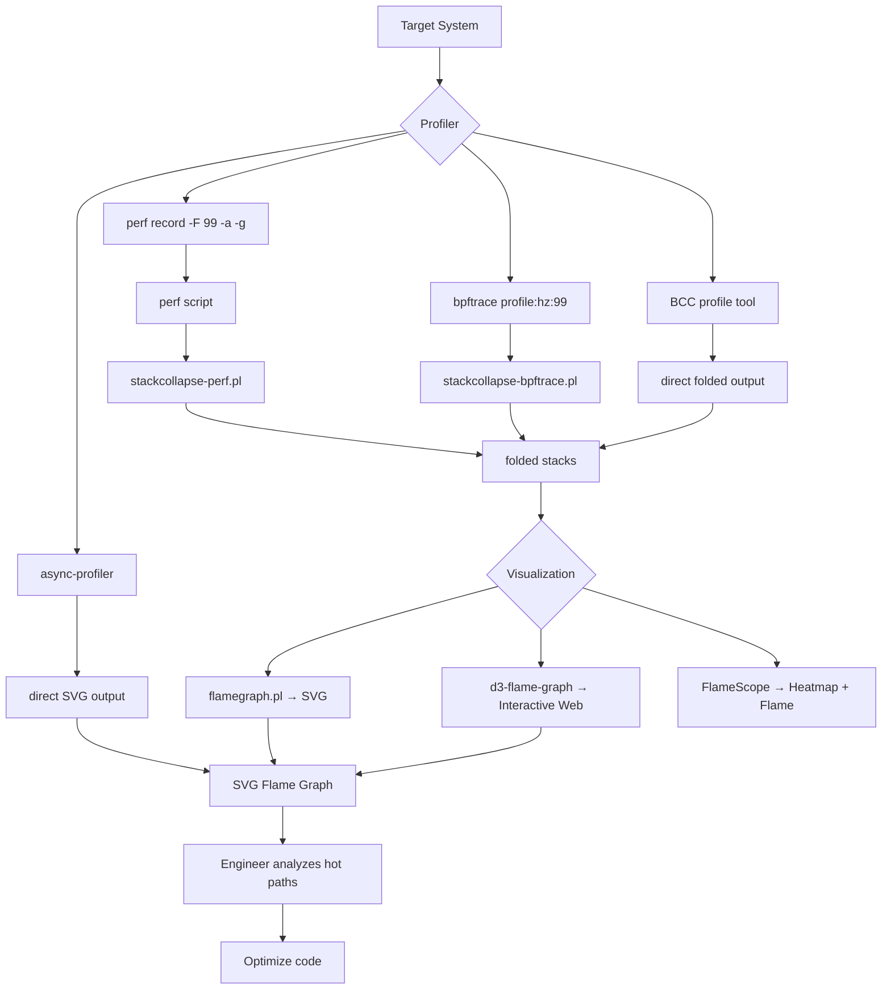
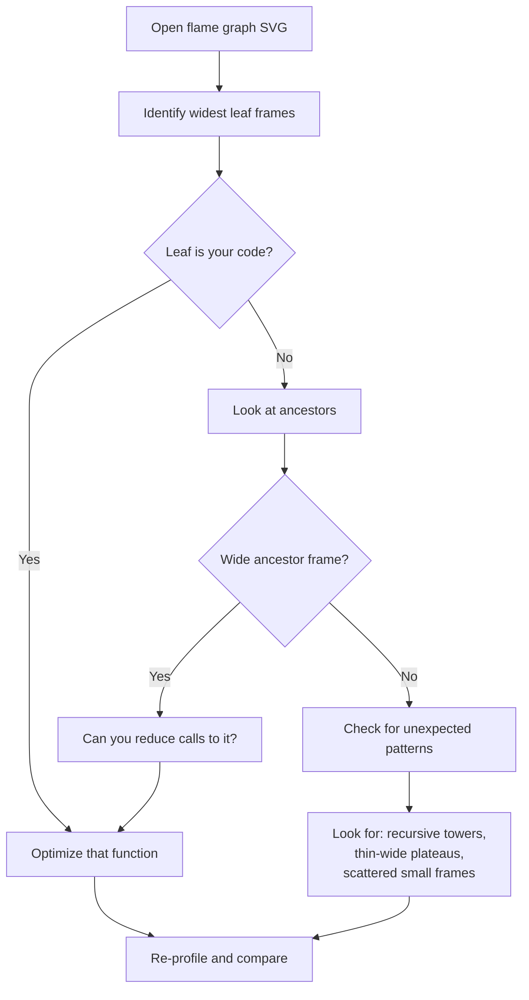
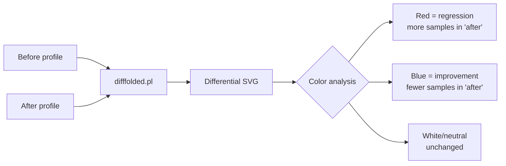

# Flame Graphs for Performance Analysis

## Introduction

Flame graphs are a visualization technique for hierarchical data, most commonly used
to visualize stack traces collected by CPU profilers. Created by Brendan Gregg at
Netflix in 2011, flame graphs have become the de facto standard for identifying
hot code-paths in software performance analysis. They transform thousands of lines
of profiling data into an interactive SVG that makes performance bottlenecks
immediately visible.

The key insight of flame graphs is that **width represents frequency** — wider
frames in the graph consumed more CPU samples, making them the primary targets
for optimization. Unlike traditional "top N" profiler reports, flame graphs preserve
the full call stack context, allowing engineers to understand *why* a function is
hot, not just *that* it is hot.

## Architecture Overview

```
┌─────────────────────────────────────────────────────────┐
│                   Flame Graph Pipeline                   │
│                                                         │
│  ┌──────────┐    ┌──────────────┐    ┌───────────────┐ │
│  │ Profiler │───▶│ Stack Trace  │───▶│ Folding Script│ │
│  │ (perf,   │    │ Output       │    │ (stackcollapse│ │
│  │ bpftrace,│    │              │    │  -*.pl)       │ │
│  │ DTrace)  │    │              │    │               │ │
│  └──────────┘    └──────────────┘    └───────┬───────┘ │
│                                              │         │
│                                              ▼         │
│                                      ┌───────────────┐ │
│                                      │ flamegraph.pl │ │
│                                      │               │ │
│                                      │  Produces SVG │ │
│                                      └───────┬───────┘ │
│                                              │         │
│                                              ▼         │
│                                      ┌───────────────┐ │
│                                      │  Interactive  │ │
│                                      │  SVG Output   │ │
│                                      └───────────────┘ │
└─────────────────────────────────────────────────────────┘
```

## Understanding Flame Graphs

### How to Read a Flame Graph

- **X-axis**: Alphabetical stack trace ordering (left to right). The width of each
  frame shows the proportion of total samples that had that function in the stack.
- **Y-axis**: Stack depth (bottom to top). The bottom is the root (e.g., `_start`),
  and the top is the function that was running on-CPU when sampled.
- **Color**: Typically random warm colors (or a consistent hue). Color has no special
  meaning in standard flame graphs — it is aesthetic only.

```
┌──────────────────────────────────────────────────────────┐
│ Top of stack (on-CPU when sampled)                       │
│                                                          │
│  ┌─────────┐  ┌──────┐  ┌────────────────┐              │
│  │ func_D  │  │func_E│  │    func_F      │  ← leaf     │
│  ├─────────┴──┴──────┴──┴────────────────┤    frames    │
│  │            func_B                     │              │
│  ├──────────────────┬────────────────────┤              │
│  │      func_A      │      func_C       │              │
│  ├──────────────────┴────────────────────┤              │
│  │              main                     │              │
│  ├───────────────────────────────────────┤              │
│  │             _start                    │  ← root      │
│  └───────────────────────────────────────┘              │
│                                                          │
│  ◀──── width = proportion of total samples ────▶        │
└──────────────────────────────────────────────────────────┘
```

### Frame Semantics

Each rectangle (frame) represents a function that appeared in a stack trace sample.
The width is proportional to how many samples included that function. Two critical
concepts:

1. **Leaf frames** (top edge): Functions that were executing on-CPU when the sample
   was taken. These are the direct consumers of CPU time.
2. **Ancestor frames** (below): Functions that called the leaf. A wide ancestor
   means its callees (children) collectively consumed significant CPU time.

## Types of Flame Graphs

### CPU Flame Graphs

The most common type. Show where CPU time is being spent. Generated from
sampling-based profilers that capture on-CPU stack traces.

### Off-CPU Flame Graphs

Show where threads are *sleeping* (blocked off-CPU). Useful for identifying
lock contention, I/O waits, and scheduling delays. Generated by tracing
scheduler `sched_switch` events and measuring the duration of off-CPU time.

### Memory Flame Graphs

Show allocations and their call stacks. Can be split into:

- **Allocation flame graphs**: Show which code paths allocate memory (count or bytes).
- **Leak flame graphs**: Show allocated-but-never-freed memory.

### Differential Flame Graphs

Compare two profiles side-by-side, highlighting the *difference* between them.
Useful for A/B testing or regression analysis: "What changed between version X
and version Y?"

### Hot/Cold Flame Graphs

Overlay a "cold" baseline (normal execution) against a "hot" (regressed) profile.
The cold frames are shown in blue, hot frames in red, making regressions
immediately visible.

### AI/GPU Flame Graphs

Emerging application: visualizing GPU kernel execution, AI model inference
latency, and hardware accelerator utilization. Brendan Gregg has extended
the concept to cover CUDA and AI workload analysis.

## Generating Flame Graphs with Linux perf

### Prerequisites

```bash
# Install perf (Debian/Ubuntu)
sudo apt-get install linux-tools-$(uname -r)

# Install FlameGraph tools
git clone https://github.com/brendangregg/FlameGraph.git
export PATH=$PATH:$(pwd)/FlameGraph
```

### Step-by-Step: CPU Flame Graph

#### Step 1: Record Profile Data

```bash
# Record at 99 Hz (avoid lock-step with timer ticks) for 30 seconds
sudo perf record -F 99 -a -g -- sleep 30

# Record a specific process
sudo perf record -F 99 -p <PID> -g -- sleep 30

# Record with call-graph dwarf (better for user-space stacks)
sudo perf record -F 99 -a -g --call-graph dwarf -- sleep 30
```

**Key flags:**
- `-F 99`: Sample at 99 Hz (prime number avoids aliasing with periodic events)
- `-a`: System-wide (all CPUs)
- `-g`: Record call graphs (stack traces)
- `--call-graph dwarf`: Use DWARF unwinding (more reliable for user-space)
- `--call-graph lbr`: Use Last Branch Records (Intel CPUs, very low overhead)

#### Step 2: Generate the Flame Graph

```bash
# Method 1: Using perf script + stackcollapse + flamegraph (three-step)
sudo perf script | stackcollapse-perf.pl | flamegraph.pl > cpu-flame.svg

# Method 2: With folded output (useful for further analysis)
sudo perf script | stackcollapse-perf.pl > out.folded
flamegraph.pl out.folded > cpu-flame.svg

# Method 3: Filter by process name
sudo perf script | stackcollapse-perf.pl | grep 'nginx' | flamegraph.pl > nginx.svg
```

#### Step 3: View the Result

```bash
# Open in browser
xdg-open cpu-flame.svg

# Or serve via HTTP for remote viewing
python3 -m http.server 8080
# Navigate to http://localhost:8080/cpu-flame.svg
```

### Advanced perf Flame Graph Options

#### Kernel-Only Flame Graph

```bash
sudo perf record -F 99 -a -g -- sleep 30
sudo perf script | stackcollapse-perf.pl --kernel | flamegraph.pl > kernel.svg
```

#### User-Space-Only Flame Graph

```bash
sudo perf script | stackcollapse-perf.pl --user | flamegraph.pl > user.svg
```

#### System-Wide with PID/TID Filtering

```bash
# Include tid and pid columns in output
sudo perf script -F comm,pid,tid,cpu,time,event,ip,sym,dso,trace | \
    stackcollapse-perf.pl --tid | flamegraph.pl > thread-flame.svg
```

#### Frequency Flame Graphs (counting occurrences, not CPU time)

```bash
# Record with software event counting
sudo perf record -e cpu-clock -a -g -- sleep 30
sudo perf script | stackcollapse-perf.pl | flamegraph.pl --countname events > freq.svg
```

## Flame Graphs with bpftrace

bpftrace provides a more programmable way to collect stack traces for flame graphs:

```bash
# CPU flame graph for all processes
sudo bpftrace -e 'profile:hz:99 { @[kstack, ustack] = count(); }' | \
    stackcollapse-bpftrace.pl | flamegraph.pl > bpftrace-cpu.svg

# On-CPU flame graph for a specific PID
sudo bpftrace -e 'profile:hz:99 /pid == 1234/ { @[kstack, ustack] = count(); }' | \
    stackcollapse-bpftrace.pl | flamegraph.pl > pid-cpu.svg

# Off-CPU flame graph (block I/O latency)
sudo bpftrace -e '
tracepoint:sched:sched_switch {
    @offcpu[args->prev_pid] = nsecs;
}
tracepoint:sched:sched_switch /@offcpu[args->next_pid]/ {
    @usleep[args->next_comm, kstack, ustack] = hist((nsecs - @offcpu[args->next_pid]) / 1000);
    delete(@offcpu[args->next_pid]);
}' > off-cpu-data.txt
```

## Flame Graphs with BCC Tools

BCC provides ready-made tools that generate folded output suitable for flame graphs:

```bash
# Using BCC's profile tool
sudo /usr/share/bcc/tools/profile -F 99 -af 30 | flamegraph.pl > bcc-cpu.svg

# Memory allocation flame graph (using memleak)
sudo /usr/share/bcc/tools/memleak -p <PID> --combined-only 30 | \
    flamegraph.pl --color=mem --title="Memory Allocations" > mem.svg

# Off-CPU time flame graph
sudo /usr/share/bcc/tools/offcputime -df -p <PID> 30 | \
    flamegraph.pl --color=io --title="Off-CPU Time" > offcpu.svg
```

## The Folding Mechanism

The `stackcollapse-*.pl` scripts transform multi-line stack traces into single
"folded" lines. This is the key data format for flame graph generation:

```
# Input (from perf script):
program 1234 [001] 12345.678: cpu-clock:
        ffffffff81234567 function_a+0x17
        ffffffff81234890 function_b+0x40
        ffffffff81234abc function_c+0x10

# Output (folded format):
program;function_c;function_b;function_a 1
```

Each line is a semicolon-delimited stack trace followed by a sample count.
Multiple identical stacks are aggregated, making the data compact.

### Available Folding Scripts

| Script | Input Source |
|--------|-------------|
| `stackcollapse-perf.pl` | Linux perf `perf script` output |
| `stackcollapse-bpftrace.pl` | bpftrace output |
| `stackcollapse-stap.pl` | SystemTap output |
| `stackcollapse-elfutils.pl` | elfutils `eu-stack` output |
| `stackcollapse-gdb.pl` | GDB thread stacks |
| `stackcollapse-instruments.pl` | Apple Instruments |
| `stackcollapse-jstack.pl` | Java `jstack` output |
| `stackcollapse-ndprof.pl` | .NET profiling |
| `stackcollapse-pyro.pl` | Pyroscope profiler |
| `stackcollapse-vtune.pl` | Intel VTune |

## Java and Mixed-Mode Flame Graphs

Java applications run on the JVM, which compiles bytecode to native code via JIT.
This creates a challenge: stack traces may show JIT-compiled symbols or interpreter
frames, and inlining can obscure the original call chain.

### Java Flame Graph with perf + perf-map-agent

```bash
# 1. Ensure Java emits frame pointers
export JAVA_TOOL_OPTIONS="-XX:+PreserveFramePointer"

# 2. Install perf-map-agent for symbol resolution
git clone https://github.com/jvm-profiling-tools/perf-map-agent
cd perf-map-agent && cmake . && make

# 3. Record profile
sudo perf record -F 99 -a -g -- sleep 30

# 4. Generate Java symbol map
sudo ./perf-map-agent/bin/create-java-perf-map.sh <JAVA_PID>

# 5. Generate flame graph
sudo perf script | stackcollapse-perf.pl | flamegraph.pl \
    --color=java --title="Java CPU Flame Graph" > java-flame.svg
```

### Async-Profiler (Modern Alternative)

```bash
# Async-profiler produces flame graph SVG directly
./profiler.sh -d 30 -f cpu-flame.svg <PID>

# Off-CPU analysis
./profiler.sh -d 30 -e wall -f wall-flame.svg <PID>

# Allocation profiling
./profiler.sh -d 30 -e alloc -f alloc-flame.svg <PID>
```

## Differential Flame Graphs

Differential flame graphs compare two profiles to highlight changes:

```bash
# Generate folded stacks for both profiles
sudo perf record -F 99 -a -g -- sleep 30  # Before change
sudo perf script | stackcollapse-perf.pl > before.folded

# ... apply change ...

sudo perf record -F 99 -a -g -- sleep 30  # After change
sudo perf script | stackcollapse-perf.pl > after.folded

# Generate differential flame graph
difffolded.pl before.folded after.folded | flamegraph.pl \
    --title="Differential Flame Graph" > diff.svg
```

In differential mode:
- **Red frames**: More samples in the "after" profile (regression)
- **Blue frames**: More samples in the "before" profile (improvement)
- **Neutral frames**: Same in both profiles

## Flame Scope

FlameScope is a companion tool (also by Brendan Gregg) that provides a
subsecond-offset heatmap view alongside flame graphs. It allows you to:

1. Visualize time-varying behavior as a heatmap
2. Select a time range of interest
3. Generate a flame graph for only that range

This is invaluable for distinguishing between:
- **Steady-state behavior**: Normal execution patterns
- **Transient spikes**: Bursts of CPU activity that may indicate problems

```bash
# Install FlameScope
git clone https://github.com/Netflix/flamescope
cd flamescope
pip install -r requirements.txt
python app.py
# Upload perf.data files via the web interface
```

## Best Practices

### Sampling Rate

- **99 Hz** is recommended for CPU flame graphs (avoids lock-step with 100 Hz timer ticks)
- Higher rates (e.g., 499 Hz, 999 Hz) provide more detail but increase overhead
- For short-lived events, consider higher rates or event-based tracing

### Collection Duration

- **30-60 seconds** is typical for steady-state analysis
- For intermittent problems, collect longer (minutes to hours)
- Use subsecond offset heatmaps (FlameScope) to find the interesting intervals

### Call Graph Method

| Method | Overhead | Accuracy | Best For |
|--------|----------|----------|----------|
| Frame pointers (`-g`) | Low | Good (if available) | C/C++ with `-fno-omit-frame-pointer` |
| DWARF (`--call-graph dwarf`) | Medium | High | Most user-space applications |
| LBR (`--call-graph lbr`) | Very low | Limited depth (16-32) | Quick kernel profiling |
| ORC (kernel 4.14+) | Low | High | Kernel stacks (x86-64) |

### Common Pitfalls

1. **Missing symbols**: Ensure debug symbols are installed. On Debian/Ubuntu:
   `apt-get install <package>-dbg` or use `debuginfod`.
2. **Truncated stacks**: DWARF may fail to unwind through JIT-compiled code.
   Use async-profiler for Java, or perf-map-agent.
3. **Biased flame graphs**: If the workload is not representative during profiling,
   the flame graph will show misleading results. Ensure the target workload is
   actively running.
4. **Overhead on production**: Sampling at 99 Hz is generally safe (< 1% overhead).
   Avoid high-frequency tracing in production without testing first.

## Interactive SVG Features

Generated SVG flame graphs from `flamegraph.pl` are interactive:

- **Mouse over a frame**: Shows function name, sample count, and percentage
- **Click on a frame**: Zooms in to show only that frame and its callees
- **Search (Ctrl+F)**: Highlights matching frames across the entire graph
- **Reset zoom**: Click the background to reset

## Architecture Diagram: End-to-End Workflow



## Flame Graph vs. Other Visualizations

| Visualization | Strength | Weakness |
|---------------|----------|----------|
| **Flame Graph** | Shows hierarchical call stacks, width = frequency | Can be cluttered for very deep stacks |
| **Icicle Graph** | Inverted flame graph (root at top) | Same data, different orientation |
| **Sunburst** | Radial view of call hierarchy | Hard to compare widths accurately |
| **Call Graph (DOT)** | Shows individual call paths | Gets very messy with many paths |
| **Tree Map** | Good for nested proportions | Loses temporal/sequential context |
| **Heat Map** | Shows distribution over time | Doesn't show call hierarchy |

## Flame Graphs for Non-CPU Analysis

### Disk I/O Flame Graphs

```bash
# Trace block I/O with stack traces
sudo bpftrace -e 'tracepoint:block:block_rq_issue { @[kstack, ustack] = count(); }' | \
    stackcollapse-bpftrace.pl | flamegraph.pl --color=io > disk-io.svg
```

### Network Flame Graphs

```bash
# Trace TCP retransmits with stacks
sudo bpftrace -e 'kprobe:tcp_retransmit_skb { @[kstack] = count(); }' | \
    stackcollapse-bpftrace.pl | flamegraph.pl --color=network > retransmit.svg
```

### Lock Contention Flame Graphs

```bash
# Trace mutex contention
sudo bpftrace -e 'kprobe:mutex_lock_slowpath { @[kstack, ustack] = count(); }' | \
    stackcollapse-bpftrace.pl | flamegraph.pl --color=lock > contention.svg
```

## Tools Comparison

| Tool | Language | Overhead | Output | Best For |
|------|----------|----------|--------|----------|
| `perf record` + FlameGraph | C/Perl | Low | SVG | General CPU profiling |
| `bpftrace` | BPF/awk | Very low | Text → SVG | Custom event tracing |
| `BCC profile` | Python/BPF | Low | Folded → SVG | Quick system-wide profiling |
| `async-profiler` | Java agent | Low | Direct SVG | Java/JVM profiling |
| `pyroscope` | Go | Low | Web UI | Continuous profiling |
| `Parca` | Go | Low | Web UI | Continuous profiling, eBPF |
| `VTune` | C++ | Medium | GUI | Intel-specific deep analysis |

## Analyzing Flame Graphs: A Systematic Approach

Reading a flame graph effectively requires a structured methodology, not just
casual browsing. Follow this workflow to extract actionable insights.

### Step-by-Step Analysis Workflow



### Common Flame Graph Patterns

**Pattern 1: Single Hot Function**
A single wide leaf frame dominates. This is the easiest case — optimize that function directly.

**Pattern 2: Wide Ancestor, Thin Leaves**
A wide parent with many thin children indicates the function is called frequently
but each call is cheap. Consider batching or reducing call frequency.

**Pattern 3: Recursive Tower**
A tall, narrow tower of repeated function names indicates unbounded recursion.
This is usually a bug (missing base case) or needs iteration instead.

**Pattern 4: Scattered Hot Paths**
Many unrelated paths each consume moderate CPU. This suggests the workload itself
is CPU-bound across many code paths — no single optimization will help much.
Consider algorithmic changes.

**Pattern 5: Kernel Dominance**
If kernel frames are wide but user frames are thin, the application is making
expensive system calls. Investigate syscall frequency and batching.

### Interpreting Differential Flame Graphs



When analyzing differentials:
1. Start with the widest **red** frames — these are the regressions
2. Trace upward to understand the call chain that increased
3. Check if the increase is in a new code path or an existing one that became hotter
4. Look for **blue** frames that shrank — these are optimizations that worked

## Flame Graphs for Specific Workloads

### Database Workload Analysis

```bash
# Profile MySQL/MariaDB for 60 seconds
sudo perf record -F 99 -a -g -- sleep 60
sudo perf script | stackcollapse-perf.pl | \
    grep -E 'mysql|innodb|ha_' | flamegraph.pl \
    --color=hot --title="MySQL CPU Flame Graph" > mysql.svg

# Profile PostgreSQL query execution
sudo perf record -F 99 -p $(pgrep -o postgres) -g -- sleep 60
sudo perf script | stackcollapse-perf.pl | flamegraph.pl \
    --color=green --title="PostgreSQL CPU" > pg.svg
```

### Container and Kubernetes Profiling

```bash
# Profile a specific container by cgroup
CONTAINER_ID=$(docker inspect --format '{{.Id}}' my_container)
sudo perf record -F 99 -a -g -- sleep 30
sudo perf script | stackcollapse-perf.pl | \
    grep "$CONTAINER_ID" | flamegraph.pl > container.svg

# Profile all containers with process filtering
sudo perf record -F 99 -a -g -- sleep 30
sudo perf script | stackcollapse-perf.pl | \
    grep -E 'dockerd|containerd|runc' | flamegraph.pl > k8s.svg
```

### Python Application Profiling

Python applications require special handling because the CPython interpreter
obscures the actual Python call stack:

```bash
# Using perf with Python symbol resolution
# 1. Ensure Python frame pointers
export PYTHONFAULTHANDLER=1

# 2. Record profile
sudo perf record -F 99 -p <PID> -g -- sleep 30

# 3. Use perf-map-agent for Python symbol maps
# Or use py-spy (Rust-based, no instrumentation needed)
py-spy record -o flame.svg --pid <PID> --duration 30

# Alternative: Austin (C-based Python sampler)
austin -o austin.prof -p <PID>
# Convert to flame graph
python -m austin.format austin.prof | flamegraph.pl > python.svg
```

### Rust and Go Applications

Rust and Go typically have good frame pointer support:

```bash
# Go (default: frame pointers since Go 1.21)
sudo perf record -F 99 -p <PID> -g -- sleep 30
sudo perf script | stackcollapse-perf.pl | flamegraph.pl > go.svg

# Go with runtime annotations
# Use runtime/pprof for built-in profiling
curl http://localhost:6060/debug/pprof/profile?seconds=30 > go.prof

# Rust (compile with frame pointers)
# In Cargo.toml:
# [profile.release]
# frame-pointer = true
sudo perf record -F 99 -p <PID> -g -- sleep 30
sudo perf script | stackcollapse-perf.pl | flamegraph.pl > rust.svg
```

## Continuous Profiling with Flame Graphs

Continuous profiling collects flame graphs periodically in production, enabling
historical comparison and regression detection.

### Architecture

```mermaid
flowchart TD
    A[Production Servers] -->|pprof/perf| B[Agent/Collector]
    B --> C[Storage Backend
         (S3, GCS, local)]
    C --> D[Continuous Profiling UI
         (Pyroscope, Parca,
          Grafana Phlare)]
    D --> E[Diff views]
    D --> F[Flame graph timeline]
    D --> G[Function-level trends]
```

### Pyroscope Setup

```bash
# Run Pyroscope agent (eBPF-based, no code changes)
docker run -d --name pyroscope \
    --privileged \
    -v /proc:/host/proc:ro \
    -v /sys:/host/sys:ro \
    pyroscope/pyroscope:latest \
    agent --server-address=http://pyroscope-server:4040

# Or with SDK instrumentation (Go example)
import "github.com/pyroscope-io/client/pyroscope"

pyroscope.Start(pyroscope.Config{
    ApplicationName: "myapp",
    ServerAddress:   "http://pyroscope-server:4040",
})
```

### Grafana Pyroscope Integration

```bash
# Configure Grafana data source:
# Type: Pyroscope
# URL: http://pyroscope:4040
# Then use "Explore" to view flame graphs with:
# - Time-range selection
# - Diff mode (compare two time ranges)
# - Top table view
```

## Performance Impact of Flame Graph Collection

Understanding the overhead of profiling is critical for production use:

| Collection Method | CPU Overhead | Memory Overhead | Data Rate |
|-------------------|-------------|-----------------|----------|
| `perf record -F 99` | < 0.5% | ~10 MiB/min | Low |
| `perf record -F 999` | ~2-5% | ~100 MiB/min | Medium |
| `bpftrace profile:hz:99` | < 0.3% | ~5 MiB/min | Low |
| `async-profiler` (itimer) | < 1% | ~20 MiB/min | Low |
| `py-spy` (process attach) | ~1-3% | N/A (streaming) | Low |

**Rule of thumb**: 99 Hz sampling adds negligible overhead for most workloads.
Going above 499 Hz is rarely justified outside of short investigative sessions.

## Flame Graph Accessibility

### Generating Text-Based Flame Graphs

For terminal-only environments, text-based alternatives exist:

```bash
# Using inferno (Rust-based FlameGraph implementation)
cargo install inferno

# Generate text table from folded stacks
cat out.folded | inferno-collapse-perf | inferno-flamegraph > flame.svg

# Using Brendan Gregg's stackcount for text output
sudo /usr/share/bcc/tools/stackcount -f -p <PID> function_name
# Outputs folded-format text suitable for offline analysis
```

### Embedding Flame Graphs in Reports

```bash
# Convert SVG to PNG for inclusion in PDFs
rsvg-convert flame.svg -o flame.png

# Or use Inkscape for high-quality export
inkscape flame.svg --export-filename=flame.pdf

# Generate a summary alongside the flame graph
sudo perf report --stdio --sort symbol --percent-limit 1 | head -30 > summary.txt
```

## References

- Brendan Gregg, "Flame Graphs," https://www.brendangregg.com/flamegraphs.html
- Brendan Gregg, "CPU Flame Graphs," https://www.brendangregg.com/FlameGraphs/cpuflamegraphs.html
- Brendan Gregg, "BPF Performance Tools" (Addison-Wesley, 2019), Chapter 6
- Brendan Gregg, "Systems Performance" 2nd Edition (Addison-Wesley, 2020), Chapter 2
- FlameGraph repository: https://github.com/brendangregg/FlameGraph
- FlameScope repository: https://github.com/Netflix/flamescope
- Linux perf wiki: https://perf.wiki.kernel.org/
- Brendan Gregg, "Linux perf Examples," https://www.brendangregg.com/perf.html
