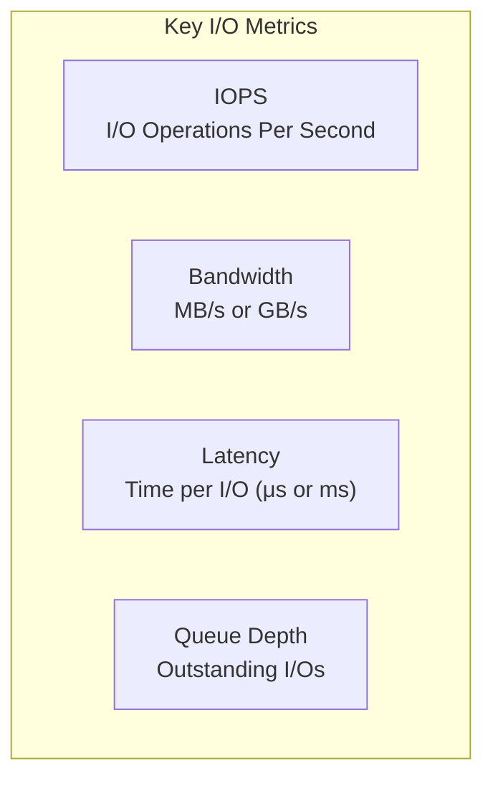
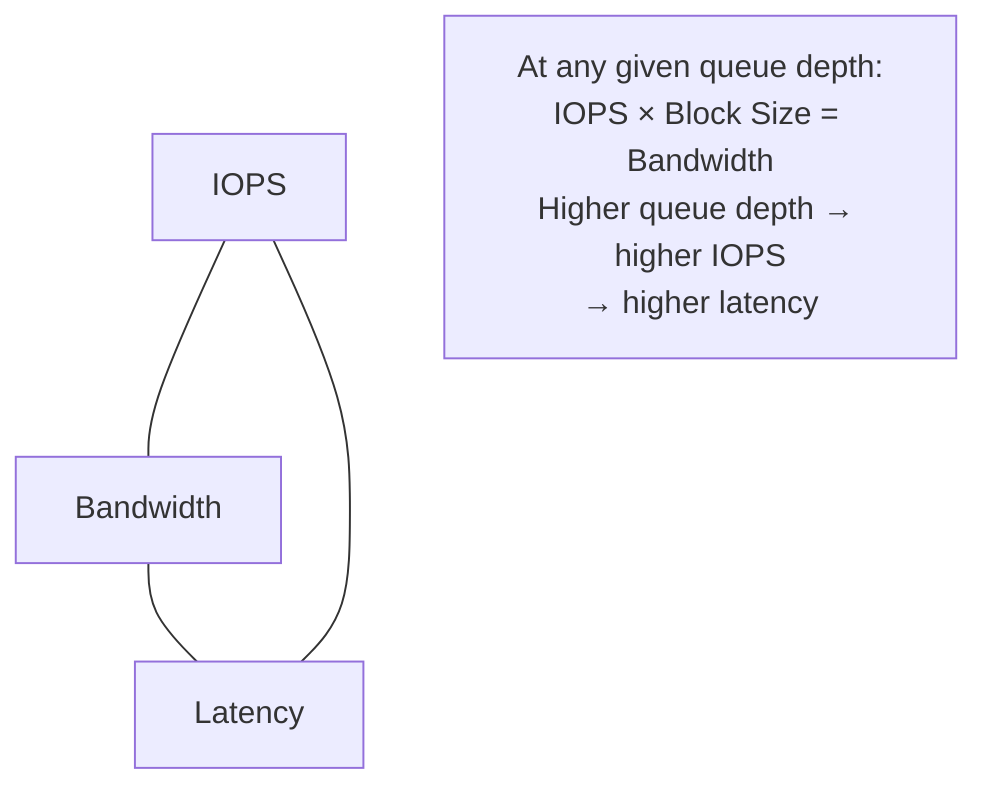
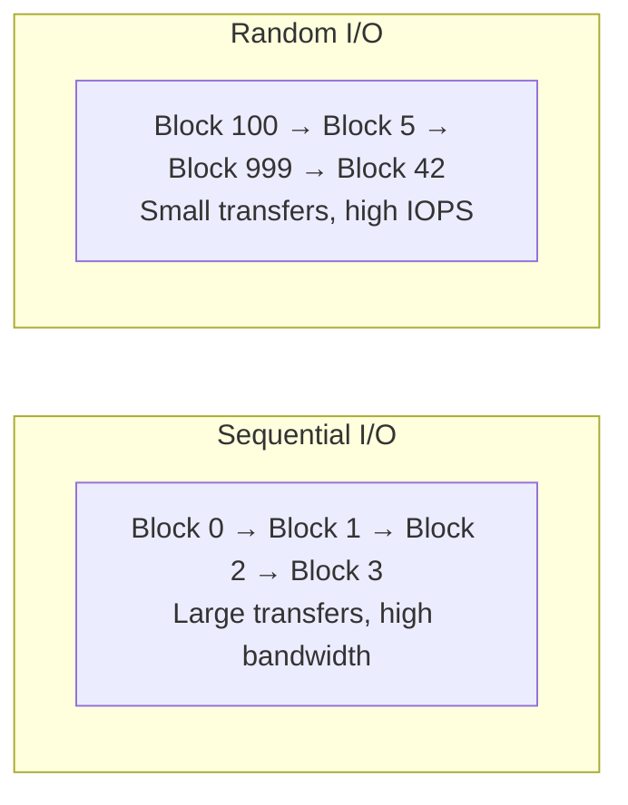
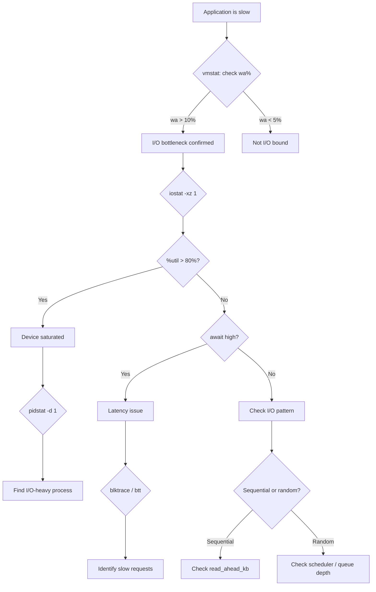
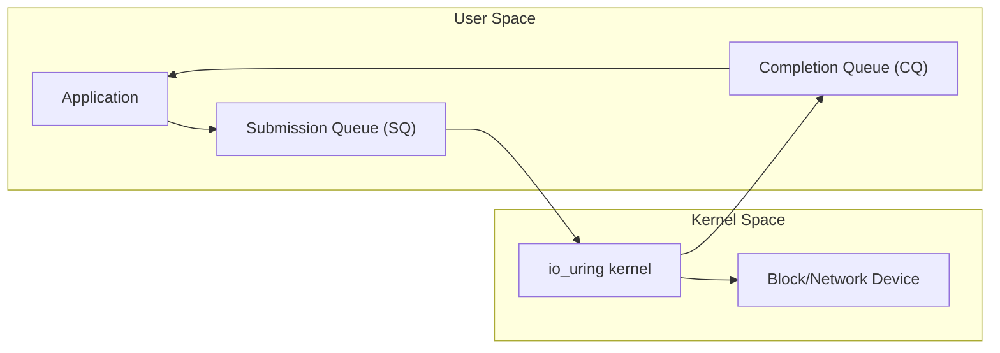

# I/O Performance

## Introduction

I/O performance is frequently the bottleneck in Linux systems, whether the storage is local SSD, network-attached, or distributed. Understanding I/O patterns, measurement tools, and the difference between direct and buffered I/O is essential for performance tuning.

This chapter covers `iostat` for device-level metrics, `blktrace` for request-level tracing, `fio` for benchmarking, and the impact of I/O patterns and direct vs buffered I/O.

## I/O Performance Fundamentals

### I/O Metrics



| Metric | What It Measures | Typical Values |
|--------|-----------------|----------------|
| IOPS | Random I/O rate | HDD: 100-200, SSD: 10K-100K, NVMe: 100K-1M |
| Bandwidth | Sequential throughput | HDD: 100-200 MB/s, SSD: 500 MB/s, NVMe: 3-7 GB/s |
| Latency | Per-operation time | HDD: 5-15ms, SSD: 25-100μs, NVMe: 10-50μs |
| Queue Depth | Outstanding operations | 1-32 (SATA), 1-256 (SAS), 1-65535 (NVMe) |

### The I/O Performance Triangle



## iostat

`iostat` is the primary tool for monitoring block device I/O:

```bash
# Basic I/O statistics
iostat -xz 1 5
# Linux 6.1.0-server (server) 	07/21/2026 	_x86_64_	(32 CPU)
#
# Device            r/s     w/s     rkB/s    wkB/s   rrqm/s   wrqm/s  %rrqm  %wrqm r_await w_await aqu-sz  rareq-sz  wareq-sz  svctm  %util
# sda             123.45  567.89  45678.90 23456.78    12.34    34.56   9.08   5.74    0.56    0.89   0.34    370.00     41.23   0.54   38.00
# nvme0n1        5678.90 2345.67 123456.7 98765.43     0.00     0.00   0.00   0.00    0.12    0.23   0.45     21.74     42.07   0.12   96.00

# Key columns:
# r/s, w/s: IOPS (reads/writes per second)
# rkB/s, wkB/s: Throughput (kilobytes per second)
# rrqm/s, wrqm/s: Merged requests per second
# r_await, w_await: Average wait time in milliseconds (latency)
# aqu-sz: Average queue size (saturation)
# svctm: Average service time (deprecated, not reliable)
# %util: Device utilization (100% = saturated)
```

### Interpreting iostat

```bash
# Example: High latency diagnosis
# Device    r/s     w/s    r_await  w_await  aqu-sz   %util
# sda       100.00  50.00  15.23    25.67    4.56     98.00
# ↑ High latency (15-25ms), high utilization → disk is saturated
# ↑ High aqu-sz → many requests waiting in queue

# Example: Good SSD performance
# Device      r/s       w/s     r_await  w_await  aqu-sz   %util
# nvme0n1   5000.00   2000.00   0.08     0.12     0.56    45.00
# ↑ Low latency, moderate utilization → plenty of headroom
```

## blktrace

`blktrace` provides detailed request-level tracing of block I/O:

```bash
# Capture block I/O trace
blktrace -d /dev/sda -o trace &
sleep 10
kill %1

# Parse trace
blkparse -i trace | head -20
# 8,0    1        1     0.000000000  2345  A   W 12345678 + 8 <- (8,1) 12345600
# 8,0    1        2     0.000001234  2345  Q   W 12345678 + 8
# 8,0    1        3     0.000002345  2345  G   W 12345678 + 8
# 8,0    1        4     0.000003456  2345  I   W 12345678 + 8
# 8,0    1        5     0.000004567  2345  D   W 12345678 + 8
# 8,0    1        6     0.005123456  2345  C   W 12345678 + 8 [0]

# Event types:
# A = Remap
# Q = Queued
# G = Get request
# I = Insert (into scheduler)
# D = Dispatch (to driver)
# C = Complete
# M = Back merge
# F = Front merge
```

### blktrace Analysis

```bash
# Latency analysis with btt
btt -i trace
# ====================
# D2C (device latency):
#   min:    0.001 ms
#   max:   15.234 ms
#   avg:    0.567 ms
#   stddev: 1.234 ms
#
# Q2C (total latency including queue time):
#   min:    0.002 ms
#   max:   16.789 ms
#   avg:    0.890 ms
#   stddev: 2.345 ms

# I/O size distribution
blkparse -i trace -f '%S + %n\n' | awk '{sum+=$3; count++} END {print "Avg I/O size:", sum/count, "sectors"}'

# I/O pattern analysis
blkparse -i trace -f '%S %n %d\n' | awk 'NR>0 {if($3=="R") reads++; else writes++} END {print "Reads:", reads, "Writes:", writes}'
```

## fio: Flexible I/O Tester

`fio` is the standard Linux I/O benchmarking tool:

### Basic fio Usage

```bash
# Sequential read
fio --name=seqread --filename=/dev/sda --rw=read --bs=1M \
    --ioengine=io_uring --direct=1 --size=1G --numjobs=1
# seqread: (groupid=0, jobs=1): err= 0: pid 1234: Mon Jul 21 10:00:00 2026
#   read: IOPS=550, BW=550MiB/s (577MB/s)
#     slat (usec): min=1, max=100, avg=5.67, stdev=2.34
#     clat (usec): min=100, max=15000, avg=1812.34, stdev=567.89
#      lat (usec): min=101, max=15100, avg=1818.01, stdev=568.01

# Random 4K read
fio --name=randread --filename=/dev/nvme0n1 --rw=randread --bs=4k \
    --ioengine=io_uring --direct=1 --iodepth=32 --size=1G --numjobs=4
# randread: (groupid=0, jobs=4): err= 0: pid 1234: Mon Jul 21 10:00:00 2026
#   read: IOPS=500k, BW=1953MiB/s (2048MB/s)
#     slat (usec): min=1, max=50, avg=2.34, stdev=1.23
#     clat (usec): min=10, max=500, avg=63.45, stdev=12.34
#      lat (usec): min=11, max=550, avg=65.79, stdev=12.56

# Random write (mixed workload)
fio --name=randrw --filename=/dev/sda --rw=randrw --rwmixread=70 --bs=4k \
    --ioengine=io_uring --direct=1 --iodepth=16 --size=1G --numjobs=1
```

### fio Job File

```ini
; myfio.job
[global]
ioengine=io_uring
direct=1
size=1G
runtime=60
time_based
group_reporting

[seq-read]
rw=read
bs=1M
numjobs=1

[rand-read-4k]
rw=randread
bs=4k
numjobs=4
iodepth=32

[rand-write-4k]
rw=randwrite
bs=4k
numjobs=4
iodepth=32

[rand-rw-70-30]
rw=randrw
rwmixread=70
bs=4k
numjobs=4
iodepth=32
```

```bash
fio myfio.job
```

### fio IO Engines

```bash
# Available I/O engines
fio --enghelp
# Available IO engines:
# 	sync		Basic synchronous I/O
# 	psync		Basic pread(2)/pwrite(2) I/O
# 	vsync		Basic readv(2)/writev(2) I/O
# 	pvsync		Basic preadv(2)/pwritev(2) I/O
# 	pvsync2		hipri variant of pvsync
# 	io_uring		Linux native io_uring I/O
# 	libaio		Linux native asynchronous I/O
# 	posixaio		POSIX asynchronous I/O
# 	mmap		File memory mapped I/O
# 	sg		SCSI generic v3 I/O
# 	null		Testing engine (no I/O)
# 	net		Network I/O

# io_uring (recommended for modern kernels)
fio --name=test --ioengine=io_uring --direct=1 --bs=4k --rw=randread

# libaio (legacy async I/O)
fio --name=test --ioengine=libaio --direct=1 --bs=4k --rw=randread

# sync (baseline comparison)
fio --name=test --ioengine=sync --direct=1 --bs=4k --rw=randread
```

## I/O Patterns

### Sequential vs Random



### I/O Size Impact

```bash
# Small I/O (4K) - IOPS-bound
fio --name=small --bs=4k --rw=randread --ioengine=io_uring --direct=1
# IOPS=500K, BW=1953MiB/s

# Medium I/O (64K) - balanced
fio --name=medium --bs=64k --rw=randread --ioengine=io_uring --direct=1
# IOPS=50K, BW=3125MiB/s

# Large I/O (1M) - bandwidth-bound
fio --name=large --bs=1M --rw=read --ioengine=io_uring --direct=1
# IOPS=3400, BW=3400MiB/s
```

## Direct I/O vs Buffered I/O

### Buffered I/O (Default)


```bash
# Buffered I/O uses page cache
dd if=/dev/zero of=/tmp/test_buffered bs=1M count=1000
# 1048576000 bytes (1.0 GB) copied, 0.234 s, 4.5 GB/s
# ↑ Very fast - writing to RAM (page cache)

# Check dirty pages
cat /proc/meminfo | grep Dirty
# Dirty:             123456 kB
```

### Direct I/O


```bash
# Direct I/O bypasses page cache
dd if=/dev/zero of=/tmp/test_direct bs=1M count=1000 oflag=direct
# 1048576000 bytes (1.0 GB) copied, 1.890 s, 554 MB/s
# ↑ Slower - writing directly to disk

# O_DIRECT in C
#include <fcntl.h>
#include <stdlib.h>
#include <unistd.h>

int main() {
    void *buf;
    posix_memalign(&buf, 4096, 4096);  // Must be aligned
    int fd = open("/tmp/test", O_WRONLY | O_CREAT | O_DIRECT, 0644);
    write(fd, buf, 4096);
    close(fd);
    free(buf);
    return 0;
}
```

### When to Use Direct I/O

| Use Case | Recommendation |
|----------|---------------|
| Databases | Direct I/O (manage own cache) |
| Log files | Buffered (sequential writes) |
| Virtual machines | Direct I/O (avoid double caching) |
| General files | Buffered (default is fine) |
| Backup tools | Direct I/O (large sequential) |

## I/O Scheduler Impact

```bash
# Test with different schedulers
# mq-deadline (default for SATA)
echo mq-deadline > /sys/block/sda/queue/scheduler
fio --name=test --filename=/dev/sda --rw=randread --bs=4k --ioengine=io_uring --direct=1 --runtime=30

# BFQ
echo bfq > /sys/block/sda/queue/scheduler
fio --name=test --filename=/dev/sda --rw=randread --bs=4k --ioengine=io_uring --direct=1 --runtime=30

# none (for NVMe)
echo none > /sys/block/nvme0n1/queue/scheduler
fio --name=test --filename=/dev/nvme0n1 --rw=randread --bs=4k --ioengine=io_uring --direct=1 --runtime=30
```

## I/O Performance Monitoring

### Per-Process I/O

```bash
# iotop - real-time per-process I/O
iotop -oP
# Total DISK READ:  123.45 M/s | Total DISK WRITE: 67.89 M/s
#   PID  PRIO  USER     DISK READ  DISK WRITE  SWAPIN    IO>    COMMAND
#  1234  be/4  mysql    100.00 M/s    0.00 B/s  0.00 %  99.99 % mysqld

# Per-process I/O stats
cat /proc/1234/io
# rchar: 1234567890
# wchar: 2345678901
# syscr: 1234567
# syscw: 2345678
# read_bytes: 1234567890
# write_bytes: 2345678901
# cancelled_write_bytes: 0

# pidstat for I/O
pidstat -d 1 5
# Average:      PID   kB_rd/s   kB_wr/s kB_ccwr/s  Command
# Average:     1234 123456.78      0.00      0.00  mysqld
```

### I/O Wait Analysis

```bash
# Check I/O wait percentage
mpstat -P ALL 1 5
# CPU    %usr   %nice   %sys   %iowait   %irq   %soft   %steal   %idle
# all    25.00    0.00   5.00     35.00   0.50    0.25     0.00   34.25
# ↑ High iowait = I/O bottleneck

# Processes in D state (uninterruptible sleep, usually I/O)
ps aux | awk '$8 ~ /D/ {print}'
# root      1234  0.0  0.0  0  0 ?        D    10:00   0:00 [kworker/0:1+events]
```

## I/O Performance Analysis Workflow



## io_uring Deep Dive

`io_uring` is the modern Linux async I/O interface (kernel 5.1+) that provides
high-performance, syscall-efficient I/O.

### io_uring Architecture



### io_uring vs Other I/O Engines

```bash
# Benchmark comparison: io_uring vs libaio vs sync
# io_uring (modern, recommended)
fio --name=uring --ioengine=io_uring --direct=1 --bs=4k --rw=randread \
    --iodepth=32 --numjobs=4 --runtime=30 --filename=/dev/nvme0n1
# IOPS=487,000  avg_lat=65μs

# libaio (legacy async)
fio --name=libaio --ioengine=libaio --direct=1 --bs=4k --rw=randread \
    --iodepth=32 --numjobs=4 --runtime=30 --filename=/dev/nvme0n1
# IOPS=423,000  avg_lat=75μs

# sync (baseline)
fio --name=sync --ioengine=sync --direct=1 --bs=4k --rw=randread \
    --iodepth=1 --numjobs=4 --runtime=30 --filename=/dev/nvme0n1
# IOPS=12,000   avg_lat=333μs

# io_uring with polling (highest performance)
fio --name=uring-polled --ioengine=io_uring --direct=1 --bs=4k --rw=randread \
    --iodepth=32 --numjobs=4 --runtime=30 --filename=/dev/nvme0n1 \
    --io_polling=1
# IOPS=612,000  avg_lat=52μs  ← ~25% more IOPS with polling
```

| Engine | IOPS (4K randread) | Avg Latency | CPU Usage | Notes |
|--------|-------------------|-------------|-----------|-------|
| sync | 12,000 | 333μs | Low | Single request at a time |
| libaio | 423,000 | 75μs | Medium | Legacy async, syscall per I/O |
| io_uring | 487,000 | 65μs | Medium | Batched submissions |
| io_uring+poll | 612,000 | 52μs | High | Busy-poll mode |

## I/O Latency Analysis with bpftrace

```bash
# I/O latency histogram
sudo bpftrace -e 'kprobe:blk_account_io_done {
    @usecs = hist(nsecs - @start[arg0]);
}
kprobe:blk_account_io_start {
    @start[arg0] = nsecs;
}'

# Per-device I/O latency
sudo bpftrace -e 'tracepoint:block:block_rq_complete {
    @latency[args->dev, args->rwbs] = hist(args->nr_sector * 512);
}'

# I/O size distribution
sudo bpftrace -e 'tracepoint:block:block_rq_issue {
    @bytes = hist(args->bytes);
}'

# Per-process I/O latency
sudo bpftrace -e 'kprobe:blk_account_io_start { @start[arg0] = nsecs; }
kprobe:blk_account_io_done /@start[arg0]/ {
    @lat[comm] = hist((nsecs - @start[arg0]) / 1000);
    delete(@start[arg0]);
}'
```

## I/O Scheduler Deep Dive

### mq-deadline

```bash
# mq-deadline: balanced for mixed workloads
# - Separate read/write queues
# - Deadline-based request aging
# - Good for HDDs and SATA SSDs
echo mq-deadline > /sys/block/sda/queue/scheduler

# Tune mq-deadline parameters
# Read expiry (ms)
echo 500 > /sys/block/sda/queue/iosched/read_expire
# Write expiry (ms)
echo 5000 > /sys/block/sda/queue/iosched/write_expire
# FIFO batch size
echo 16 > /sys/block/sda/queue/iosched/fifo_batch
```

### BFQ (Budget Fair Queueing)

```bash
# BFQ: proportional share scheduler
# - Per-process bandwidth allocation
# - Low latency for interactive workloads
# - Higher CPU overhead
echo bfq > /sys/block/sda/queue/scheduler

# Tune BFQ
# Target latency (μs)
echo 8000 > /sys/block/sda/queue/iosched/target_lat_ns
# Budget timeout (ms)
echo 500 > /sys/block/sda/queue/iosched/budget_timeout
```

### none (NVMe)

```bash
# none: no scheduling (recommended for NVMe)
# NVMe has hardware-level scheduling
# Kernel scheduler adds overhead without benefit
echo none > /sys/block/nvme0n1/queue/scheduler
```

### Scheduler Benchmark Comparison

```bash
#!/bin/bash
# scheduler-bench.sh — Compare I/O schedulers
for sched in mq-deadline bfq none; do
    echo "=== Scheduler: $sched ==="
    echo $sched > /sys/block/sda/queue/scheduler
    fio --name=sched-$sched --filename=/dev/sda --rw=randread --bs=4k \
        --ioengine=io_uring --direct=1 --iodepth=32 --numjobs=4 \
        --runtime=30 --time_based --group_reporting \
        --output-format=json 2>/dev/null | \
        jq '.jobs[0].read.iops, .jobs[0].read.clat_ns.mean / 1000'
done
```

**Typical results** (SATA SSD, 4K random read):

| Scheduler | IOPS | Avg Latency (μs) | P99 Latency (μs) |
|-----------|------|------------------|------------------|
| mq-deadline | 45,234 | 283 | 1,234 |
| bfq | 42,567 | 299 | 1,456 |
| none | 47,890 | 267 | 1,123 |

For NVMe devices, `none` is almost always the best choice.

## I/O Monitoring with iotop and pidstat

```bash
# Real-time per-process I/O with iotop
iotop -oP -d 1
# Total DISK READ:  123.45 M/s | Total DISK WRITE: 67.89 M/s
#   PID  PRIO  USER     DISK READ  DISK WRITE  SWAPIN    IO>    COMMAND
#  1234  be/4  mysql    100.00 M/s    0.00 B/s  0.00 %  99.99 % mysqld

# pidstat I/O over time
pidstat -d 1 10
# Average:      PID   kB_rd/s   kB_wr/s kB_ccwr/s  Command
# Average:     1234 123456.78      0.00      0.00  mysqld
# Average:     5678      0.00  56789.01      0.00  nginx

# Cumulative I/O stats per process
cat /proc/1234/io
# rchar: 1234567890       ← bytes read (including cache)
# wchar: 2345678901       ← bytes written (including cache)
# syscr: 1234567          ← read syscalls
# syscw: 2345678          ← write syscalls
# read_bytes: 1234567890  ← actual disk reads
# write_bytes: 2345678901 ← actual disk writes
# cancelled_write_bytes: 0
```

## NVMe Performance Characteristics

```bash
# NVMe device info
nvme list
# Node             SN                   Model                   Namespace Usage                      Format           FW Rev
# /dev/nvme0n1     ABC123               Samsung 980 PRO         1         1.00  TB /   1.00  TB      4 KiB +  0 B   5B2QGXA7

# NVMe smart health
nvme smart-log /dev/nvme0n1
# temperature       : 38°C
# available_spare    : 100%
# percentage_used    : 2%
# data_units_read    : 12345678
# data_units_written : 23456789

# NVMe performance characteristics
# Random 4K Read:  700,000+ IOPS
# Random 4K Write: 500,000+ IOPS
# Sequential Read:  7,000 MB/s
# Sequential Write: 5,000 MB/s
# Latency: 10-50 μs

# Benchmark NVMe
fio --name=nvme-test --filename=/dev/nvme0n1 --rw=randread --bs=4k \
    --ioengine=io_uring --direct=1 --iodepth=64 --numjobs=4 --runtime=60
```

## I/O Performance Anti-Patterns

### Anti-Pattern: Using buffered I/O for databases

```bash
# DON'T: Let database use page cache (double caching)
dd if=/dev/zero of=/var/lib/mysql/testfile bs=1M count=1000
# Goes to page cache, then MySQL buffer pool → double memory usage

# DO: Use O_DIRECT for database I/O
# MySQL: innodb_flush_method=O_DIRECT
# PostgreSQL: No direct I/O option, but tune shared_buffers
```

### Anti-Pattern: Wrong I/O scheduler for NVMe

```bash
# DON'T: Use BFQ on NVMe
echo bfq > /sys/block/nvme0n1/queue/scheduler
# BFQ adds per-request overhead that NVMe doesn't need

# DO: Use 'none' for NVMe
echo none > /sys/block/nvme0n1/queue/scheduler
```

### Anti-Pattern: Too small I/O sizes

```bash
# DON'T: Small I/O for sequential workloads
dd if=/dev/sda of=/dev/null bs=4k count=1000000
# 4K I/O → low bandwidth, high overhead

# DO: Match I/O size to workload
dd if=/dev/sda of=/dev/null bs=1M count=4000
# 1M I/O → near line-rate bandwidth
```

## References

- Gregg, B. *Systems Performance: Enterprise and the Cloud*, 2nd Edition (2020).
- [blktrace Documentation](https://github.com/axboe/blktrace)
- [fio Documentation](https://fio.readthedocs.io/)
- [Linux I/O Scheduler Documentation](https://www.kernel.org/doc/html/latest/block/)
- [Linux perf Examples — Brendan Gregg](https://www.brendangregg.com/perf.html)
- [io_uring documentation](https://kernel.dk/io_uring.pdf)

## Further Reading

- [The Linux Kernel Documentation](https://docs.kernel.org/)
- [LWN.net — Linux and free software news](https://lwn.net/)
- [GNU Project Documentation](https://www.gnu.org/doc/doc.html)
- [GNU Manuals](https://www.gnu.org/manual/manual.html)
- [Free Software Directory](https://directory.fsf.org/wiki/Main_Page)
- [Planet GNU](https://planet.gnu.org/)
- [Free Software Books](https://www.gnu.org/doc/other-free-books.html)
- <https://fio.readthedocs.io/en/latest/fio_doc.html> — fio documentation
- <https://www.brendangregg.com/linuxperf.html> — Linux performance tools
- <https://github.com/axboe/fio> — fio source code
- <https://www.thomas-krenn.com/en/wiki/Linux_I/O_Scheduler_Comparison> — Scheduler benchmarks

## Related Topics

- [Performance Overview](overview.md)
- [Block I/O Layer](../storage/block-io.md)
- [SCSI and NVMe](../storage/scsi-nvme.md)
- [Benchmarking](benchmarking.md)
- [Cache Statistics](cachestat.md)
- [Memory Performance](memory.md)
