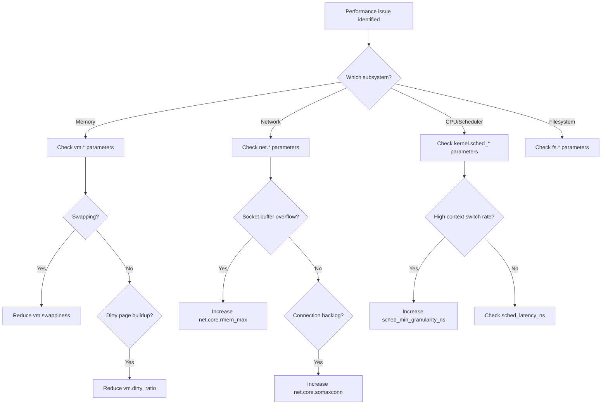

# Kernel Tuning Parameters

## Introduction

Linux exposes hundreds of tunable parameters through `/proc/sys` and `sysctl`. These parameters control virtual memory behavior, networking stack configuration, scheduler policies, and more. Proper tuning can significantly improve performance for specific workloads, but incorrect settings can degrade performance or cause instability.

## sysctl: Kernel Parameter Management

```bash
# View all parameters
sysctl -a | wc -l
# 1234

# View specific parameter
sysctl net.ipv4.tcp_congestion_control
# net.ipv4.tcp_congestion_control = cubic

# Set parameter (runtime, lost on reboot)
sysctl -w net.ipv4.tcp_congestion_control=bbr

# Persist across reboots
echo "net.ipv4.tcp_congestion_control = bbr" >> /etc/sysctl.d/99-tuning.conf
sysctl -p /etc/sysctl.d/99-tuning.conf

# View parameter description
sysctl -w -e net.ipv4.tcp_congestion_control=bbr
```

## Virtual Memory Parameters

### Dirty Page Control

```bash
# vm.dirty_ratio: % of system memory that can be dirty before sync
sysctl vm.dirty_ratio
# 20

# vm.dirty_background_ratio: % before background writeback starts
sysctl vm.dirty_background_ratio
# 10

# For low-latency databases (reduce dirty pages)
sysctl -w vm.dirty_ratio=5
sysctl -w vm.dirty_background_ratio=2

# Or use absolute values (bytes)
sysctl -w vm.dirty_bytes=268435456       # 256 MB
sysctl -w vm.dirty_background_bytes=67108864  # 64 MB

# vm.dirty_expire_centisecs: how old dirty pages get before writeback
sysctl vm.dirty_expire_centisecs
# 3000  (30 seconds)

# vm.dirty_writeback_centisecs: how often writeback thread wakes
sysctl vm.dirty_writeback_centisecs
# 500  (5 seconds)
```

### Swap Control

```bash
# vm.swappiness: tendency to swap vs drop page cache (0-100)
sysctl vm.swappiness
# 60

# Lower for databases (prefer page cache drop)
sysctl -w vm.swappiness=10

# Disable swap entirely
swapoff -a

# vm.vfs_cache_pressure: reclaim dentry/inode caches
sysctl vm.vfs_cache_pressure
# 100

# Lower = keep metadata caches longer
sysctl -w vm.vfs_cache_pressure=50
```

### Memory Overcommit

```bash
# vm.overcommit_memory
# 0 = heuristic (default)
# 1 = always overcommit
# 2 = don't overcommit (strict accounting)
sysctl vm.overcommit_memory
# 0

# For strict accounting (prevent OOM)
sysctl -w vm.overcommit_memory=2
sysctl -w vm.overcommit_ratio=80  # % of RAM for overcommit

# vm.min_free_kbytes: minimum free memory
sysctl vm.min_free_kbytes
# 67584

# Increase for safety on high-memory systems
sysctl -w vm.min_free_kbytes=262144  # 256 MB
```

### Huge Pages

```bash
# vm.nr_hugepages: number of 2MB huge pages
sysctl vm.nr_hugepages
# 0

sysctl -w vm.nr_hugepages=1024  # Allocate 2GB of huge pages

# vm.hugetlb_shm_group: group allowed to use hugetlbfs
sysctl vm.hugetlb_shm_group
# 0
```

## Network Parameters

### TCP/IP Stack

```bash
# Connection backlog
sysctl net.core.somaxconn
# 4096
sysctl -w net.core.somaxconn=65535

# SYN backlog
sysctl net.ipv4.tcp_max_syn_backlog
# 4096
sysctl -w net.ipv4.tcp_max_syn_backlog=65535

# Socket buffer sizes
sysctl net.core.rmem_max
# 212992
sysctl -w net.core.rmem_max=16777216
sysctl -w net.core.wmem_max=16777216
sysctl -w net.core.rmem_default=262144
sysctl -w net.core.wmem_default=262144

# TCP buffer auto-tuning
sysctl net.ipv4.tcp_rmem
# 4096 131072 6291456
sysctl -w net.ipv4.tcp_rmem="4096 262144 16777216"
sysctl -w net.ipv4.tcp_wmem="4096 262144 16777216"

# Congestion control
sysctl net.ipv4.tcp_congestion_control
# cubic
sysctl -w net.ipv4.tcp_congestion_control=bbr

# TCP keepalive
sysctl -w net.ipv4.tcp_keepalive_time=600
sysctl -w net.ipv4.tcp_keepalive_intvl=30
sysctl -w net.ipv4.tcp_keepalive_probes=3

# TIME_WAIT
sysctl -w net.ipv4.tcp_tw_reuse=1
sysctl -w net.ipv4.tcp_fin_timeout=30

# TCP window scaling
sysctl net.ipv4.tcp_window_scaling
# 1

# TCP timestamps
sysctl net.ipv4.tcp_timestamps
# 1

# Selective ACK
sysctl net.ipv4.tcp_sack
# 1

# Fast open
sysctl net.ipv4.tcp_fastopen
# 0
sysctl -w net.ipv4.tcp_fastopen=3
```

### Network Device Queue

```bash
# Netdev budget (softirq processing)
sysctl net.core.netdev_budget
# 300
sysctl -w net.core.netdev_budget=600

sysctl net.core.netdev_budget_usecs
# 2000
sysctl -w net.core.netdev_budget_usecs=4000

# Netdev max backlog
sysctl net.core.netdev_max_backlog
# 1000
sysctl -w net.core.netdev_max_backlog=5000
```

## Scheduler Parameters

### CFS (Completely Fair Scheduler)

```bash
# Scheduler latency (target preemption period)
sysctl kernel.sched_latency_ns
# 24000000  (24ms)

sysctl -w kernel.sched_latency_ns=6000000  # 6ms (more responsive)

# Minimum granularity
sysctl kernel.sched_min_granularity_ns
# 3000000  (3ms)

sysctl -w kernel.sched_min_granularity_ns=1000000  # 1ms

# Wake-up granularity
sysctl kernel.sched_wakeup_granularity_ns
# 4000000  (4ms)

sysctl -w kernel.sched_wakeup_granularity_ns=1000000  # 1ms

# Migration cost
sysctl kernel.sched_migration_cost_ns
# 500000  (0.5ms)
```

### RT (Real-Time) Scheduler

```bash
# RT scheduling period
sysctl kernel.sched_rt_period_us
# 1000000  (1 second)

# RT runtime per period
sysctl kernel.sched_rt_runtime_us
# 950000  (0.95 seconds)

# Allow RT tasks to run indefinitely (dangerous!)
sysctl -w kernel.sched_rt_runtime_us=-1
```

## Filesystem Parameters

```bash
# File-max: maximum open files system-wide
sysctl fs.file-max
# 9223372036854775807

# Inotify limits
sysctl fs.inotify.max_user_watches
# 8192
sysctl -w fs.inotify.max_user_watches=524288

sysctl fs.inotify.max_user_instances
# 128
sysctl -w fs.inotify.max_user_instances=1024

# AIO limits
sysctl fs.aio-max-nr
# 65536
sysctl -w fs.aio-max-nr=1048576

# Pipe size
sysctl fs.pipe-max-size
# 1048576
```

## Kernel Parameters

```bash
# PID max
sysctl kernel.pid_max
# 32768
sysctl -w kernel.pid_max=4194304

# Threads max
sysctl kernel.threads-max
# 63564
sysctl -w kernel.threads-max=4194304

# Message queues
sysctl kernel.msgmax
# 8192
sysctl kernel.msgmnb
# 16384
sysctl kernel.msgmni
# 32000

# Shared memory
sysctl kernel.shmmax
# 18446744073692774399
sysctl kernel.shmall
# 18446744073692774399

# Semaphore limits
sysctl kernel.sem
# 250 32000 32 128
# semmsl  semmns  semopm  semmni
```

## Security Parameters

```bash
# IP forwarding
sysctl net.ipv4.ip_forward
# 0
sysctl -w net.ipv4.ip_forward=1

# SYN cookies (SYN flood protection)
sysctl net.ipv4.tcp_syncookies
# 1

# Reverse path filtering
sysctl net.ipv4.conf.all.rp_filter
# 1

# ICMP redirects
sysctl net.ipv4.conf.all.accept_redirects
# 0

# Disable IPv6 if not needed
sysctl -w net.ipv6.conf.all.disable_ipv6=1
```

## Persisting sysctl Changes

```bash
# Method 1: /etc/sysctl.conf
echo "vm.swappiness = 10" >> /etc/sysctl.conf
sysctl -p

# Method 2: /etc/sysctl.d/ (recommended)
cat > /etc/sysctl.d/99-custom-tuning.conf << 'EOF'
# Virtual Memory
vm.swappiness = 10
vm.dirty_ratio = 5
vm.dirty_background_ratio = 2
vm.vfs_cache_pressure = 50

# Network
net.core.somaxconn = 65535
net.core.rmem_max = 16777216
net.core.wmem_max = 16777216
net.ipv4.tcp_congestion_control = bbr
net.ipv4.tcp_keepalive_time = 600

# Scheduler
kernel.sched_latency_ns = 6000000
kernel.sched_min_granularity_ns = 1000000
EOF

sysctl -p /etc/sysctl.d/99-custom-tuning.conf
```

## Tuning Profiles

### Database Server

```bash
# /etc/sysctl.d/99-database.conf
vm.swappiness = 1
vm.dirty_ratio = 5
vm.dirty_background_ratio = 2
vm.dirty_expire_centisecs = 500
vm.dirty_writeback_centisecs = 100
vm.vfs_cache_pressure = 50
vm.overcommit_memory = 2
vm.overcommit_ratio = 80
kernel.sched_latency_ns = 6000000
```

### Web Server

```bash
# /etc/sysctl.d/99-webserver.conf
net.core.somaxconn = 65535
net.ipv4.tcp_max_syn_backlog = 65535
net.core.rmem_max = 16777216
net.core.wmem_max = 16777216
net.ipv4.tcp_congestion_control = bbr
net.ipv4.tcp_tw_reuse = 1
net.ipv4.tcp_fin_timeout = 15
net.ipv4.tcp_fastopen = 3
fs.file-max = 2097152
```

### High-Performance Computing

```bash
# /etc/sysctl.d/99-hpc.conf
vm.swappiness = 0
kernel.sched_latency_ns = 1000000
kernel.sched_min_granularity_ns = 500000
kernel.sched_wakeup_granularity_ns = 500000
kernel.numa_balancing = 0
```

## Performance Analysis Workflow for Kernel Tuning



## Parameter Impact Reference

### High-Impact Parameters

These parameters have the most significant effect on performance:

| Parameter | Default | Recommended | Impact |
|-----------|---------|-------------|--------|
| `vm.swappiness` | 60 | 1-10 (DB) | Controls swap aggressiveness |
| `vm.dirty_ratio` | 20 | 5 (DB) | Max dirty page percentage |
| `net.core.somaxconn` | 4096 | 65535 | Connection backlog limit |
| `net.ipv4.tcp_congestion_control` | cubic | bbr | Congestion algorithm |
| `kernel.sched_latency_ns` | 24ms | 6ms | Scheduler preemption period |
| `net.core.rmem_max` | 208KB | 16MB | Max socket receive buffer |
| `vm.vfs_cache_pressure` | 100 | 50 | Metadata cache retention |
| `fs.file-max` | varies | 2097152 | Max open files system-wide |

### Medium-Impact Parameters

| Parameter | Default | Recommended | Impact |
|-----------|---------|-------------|--------|
| `vm.dirty_background_ratio` | 10 | 2 (DB) | Background writeback threshold |
| `net.ipv4.tcp_tw_reuse` | 0 | 1 | Reuse TIME_WAIT sockets |
| `net.ipv4.tcp_fin_timeout` | 60 | 15-30 | FIN_WAIT_2 timeout |
| `net.ipv4.tcp_keepalive_time` | 7200 | 600 | Keepalive probe interval |
| `kernel.pid_max` | 32768 | 4194304 | Maximum PID value |
| `fs.inotify.max_user_watches` | 8192 | 524288 | File watch limit |

## Kernel Tuning Validation

### Before/After Comparison Script

```bash
#!/bin/bash
# validate-tuning.sh — Measure impact of sysctl changes

echo "=== Baseline (before tuning) ==="
# CPU benchmark
sysbench cpu --cpu-max-prime=20000 --threads=$(nproc) --time=10 run 2>/dev/null \
    | grep "events per second"

# Memory benchmark
sysbench memory --memory-block-size=1M --memory-total-size=10G \
    --threads=$(nproc) --time=10 run 2>/dev/null \
    | grep -oP '[\d.]+(?= MiB/sec)'

# Network (if iperf3 server available)
# iperf3 -c server -t 5 -J 2>/dev/null | jq '.end.sum_sent.bits_per_second'

echo ""
echo "=== Current sysctl settings ==="
sysctl vm.swappiness vm.dirty_ratio net.core.somaxconn \
    net.ipv4.tcp_congestion_control kernel.sched_latency_ns

echo ""
echo "=== System state ==="
free -h | head -2
vmstat 1 3 | tail -3
```

### Monitoring sysctl Changes

```bash
# Watch for runtime sysctl changes
sudo inotifywait -m -e modify /proc/sys/

# Or use auditd to track sysctl changes
auditctl -w /proc/sys/ -p wa -k sysctl_change
ausearch -k sysctl_change
```

## Container-Specific Tuning

```bash
# Cgroup v2 memory tuning
echo 10G > /sys/fs/cgroup/myapp/memory.max
echo 8G > /sys/fs/cgroup/myapp/memory.high
# memory.high = soft limit (triggers reclaim)
# memory.max = hard limit (OOM if exceeded)

# Cgroup v2 CPU tuning
echo "50000 100000" > /sys/fs/cgroup/myapp/cpu.max
# 50% of one CPU (50ms per 100ms period)

# Cgroup v2 I/O tuning
echo "100:104857600" > /sys/fs/cgroup/myapp/io.max
# 100 MB/s read limit on device 100

# Network namespace tuning (per-container)
ip netns exec mycontainer sysctl -w net.core.somaxconn=65535
ip netns exec mycontainer sysctl -w net.ipv4.tcp_congestion_control=bbr
```

## Kernel Command Line Tuning

Some parameters can only be set at boot:

```bash
# Edit /etc/default/grub
GRUB_CMDLINE_LINUX="
  transparent_hugepage=madvise
  intel_pstate=active
  mitigations=off
  isolcpus=2-7
  nohz_full=2-7
  rcu_nocbs=2-7
  hugepagesz=2M
  hugepages=1024
"

# Update GRUB
update-grub
reboot

# Verify after boot
cat /proc/cmdline
```

| Parameter | Effect | Use Case |
|-----------|--------|----------|
| `transparent_hugepage=madvise` | THP only when requested | Database servers |
| `intel_pstate=active` | Intel CPU frequency scaling | Modern Intel CPUs |
| `mitigations=off` | Disable CPU vulnerability mitigations | Trusted environments only |
| `isolcpus=2-7` | Isolate CPUs from scheduler | Real-time workloads |
| `nohz_full=2-7` | Disable timer ticks on CPUs | Low-latency applications |
| `rcu_nocbs=2-7` | Offload RCU callbacks | Real-time isolation |

## References

- [sysctl.conf(5) man page](https://man7.org/linux/man-pages/man5/sysctl.conf.5.html)
- [Linux Kernel Documentation](https://www.kernel.org/doc/html/latest/admin-guide/sysctl/)
- [Red Hat Performance Tuning Guide](https://access.redhat.com/documentation/en-us/red_hat_enterprise_linux/9/html/monitoring_and_managing_system_status_and_performance/)
- Gregg, B. *Systems Performance: Enterprise and the Cloud*, 2nd Edition (2020).
- [Percona Linux OS Tuning for MySQL](https://www.percona.com/blog/linux-os-tuning-for-mysql-database-performance/)

## Further Reading

- [The Linux Kernel Documentation](https://docs.kernel.org/)
- [LWN.net — Linux and free software news](https://lwn.net/)
- [GNU Project Documentation](https://www.gnu.org/doc/doc.html)
- [GNU Manuals](https://www.gnu.org/manual/manual.html)
- [Free Software Directory](https://directory.fsf.org/wiki/Main_Page)
- [Planet GNU](https://planet.gnu.org/)
- [Free Software Books](https://www.gnu.org/doc/other-free-books.html)
- <https://www.kernel.org/doc/html/latest/admin-guide/sysctl/vm.html> — VM parameters
- <https://www.kernel.org/doc/html/latest/admin-guide/sysctl/net.html> — Network parameters
- <https://www.kernel.org/doc/html/latest/admin-guide/sysctl/kernel.html> — Kernel parameters

## Related Topics

- [Performance Overview](overview.md)
- [Network Performance](network.md)
- [Memory Performance](memory.md)
- [NUMA Optimization](numa.md)
- [I/O Performance](io.md)
- [Benchmarking](benchmarking.md)
