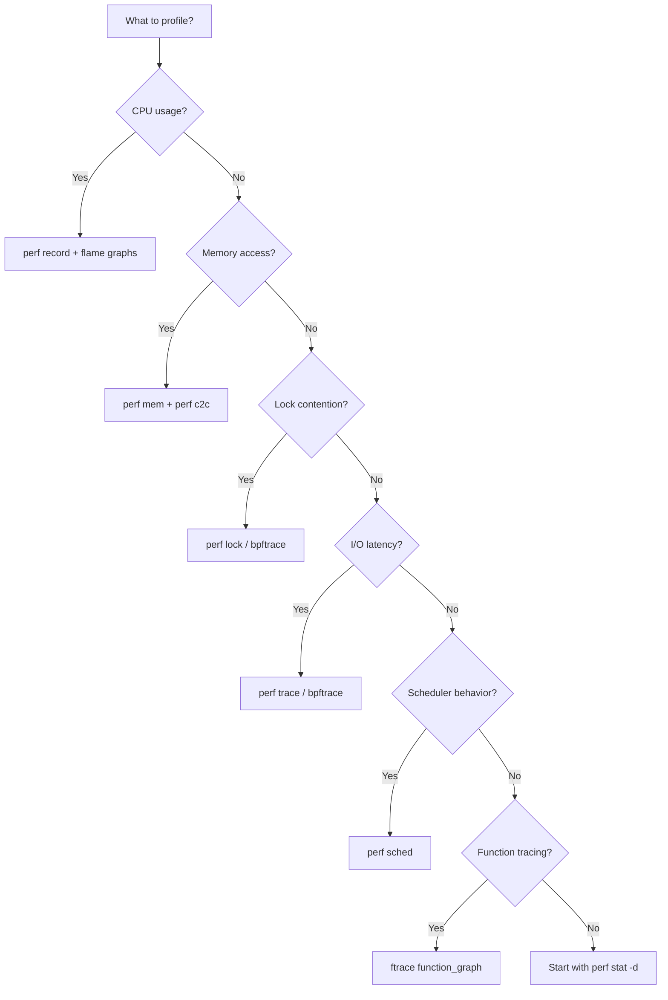

# Kernel Profiling

## Overview

Kernel profiling is the practice of measuring where the kernel (and userspace) spends CPU time, memory, and other resources. The primary profiling tool in Linux is **perf**, a powerful performance analysis toolkit built into the kernel.

Profiling helps identify bottlenecks, optimize code paths, and understand system behavior under real workloads.

> **See also:** [ftrace](./ftrace.md), [eBPF](./ebpf.md), [SystemTap](./systemtap.md)

---

## perf: The Linux Profiling Toolkit

### Architecture

perf uses **hardware performance counters** (PMU — Performance Monitoring Unit) and **software events** to collect samples:

```
┌──────────────────────────────────────────┐
│              Userspace                    │
│   perf record / perf report / perf stat  │
└──────────────────┬───────────────────────┘
                   │ perf_event_open() syscall
┌──────────────────▼───────────────────────┐
│           perf_event Subsystem            │
│   kernel/events/core.c                   │
│   ┌─────────────┐  ┌──────────────────┐ │
│   │ HW Counters │  │ SW Events        │ │
│   │ (PMU)       │  │ (sched, tracep.) │ │
│   └─────────────┘  └──────────────────┘ │
└──────────────────────────────────────────┘
```

### Prerequisites

```bash
# Install perf (Debian/Ubuntu)
sudo apt install linux-tools-common linux-tools-$(uname -r)

# Install perf (RHEL/Fedora)
sudo dnf install perf

# Verify
perf version
```

---

## perf record

### Basic CPU Profiling

```bash
# Profile the entire system for 10 seconds
sudo perf record -a -g -- sleep 10

# Profile a specific command
sudo perf record -g ./my_program

# Profile a specific process
sudo perf record -p <pid> -g -- sleep 30

# Profile with call graph (dwarf-based)
sudo perf record -a -g --call-graph dwarf -- sleep 10

# Profile with frame pointer call graph
sudo perf record -a -g --call-graph fp -- sleep 10
```

### Key Options

| Option                  | Description                              |
|------------------------|------------------------------------------|
| `-a`                   | System-wide (all CPUs)                   |
| `-g`                   | Record call graphs                       |
| `-p <pid>`             | Target specific process                  |
| `-t <tid>`             | Target specific thread                   |
| `-e <event>`           | Specify event (default: `cpu-cycles`)    |
| `-F <freq>`            | Sampling frequency (Hz)                  |
| `-c <count>`           | Sample every N events                    |
| `--call-graph dwarf`   | DWARF-based unwinding (most reliable)    |
| `--call-graph fp`      | Frame pointer unwinding (faster)         |
| `--call-graph lbr`     | Last Branch Record (Intel CPUs only)     |
| `-o <file>`            | Output file (default: `perf.data`)       |
| `-- sleep <N>`         | Record for N seconds                     |

### Event Selection

```bash
# Default: cpu-cycles
sudo perf record -a -- sleep 5

# Cache misses
sudo perf record -e cache-misses -a -- sleep 5

# Branch mispredictions
sudo perf record -e branch-misses -a -- sleep 5

# Context switches
sudo perf record -e context-switches -a -- sleep 5

# Page faults
sudo perf record -e page-faults -a -- sleep 5

# Multiple events
sudo perf record -e cycles,instructions,cache-misses -a -- sleep 5

# Tracepoint events
sudo perf record -e 'sched:sched_switch' -a -- sleep 5

# Software events
sudo perf record -e cpu-clock -a -- sleep 5
```

### List Available Events

```bash
# Hardware events
perf list hw

# Software events
perf list sw

# Tracepoints
perf list tracepoint

# All events
perf list

# PMU-specific events
perf list pmu
```

---

## perf report

### Interactive Report

```bash
# Default interactive view
sudo perf report

# With call graph
sudo perf report --call-graph

# Sort by overhead
sudo perf report --sort=dso,symbol

# Show specific fields
sudo perf report --stdio --sort comm,dso,symbol
```

### Report Options

| Option              | Description                              |
|---------------------|------------------------------------------|
| `--stdio`           | Text output (no TUI)                     |
| `--sort`            | Sort by fields (comm,dso,symbol,etc.)    |
| `--call-graph`      | Show call graph                          |
| `--percent-limit N` | Hide symbols below N% overhead           |
| `-n`                | Show sample counts                       |
| `--header`          | Show perf.data header info               |

### Reading the Output

```
# Overhead  Command      Shared Object        Symbol
# ........  ...........  ...................  ........................
    12.34%  my_program   libc-2.31.so         [.] __memcpy_avx2
     8.21%  my_program   my_program           [.] process_data
     5.67%  swapper      [kernel.kallsyms]    [k] schedule
     3.45%  my_program   my_program           [.] main
```

- **Overhead** — Percentage of samples in this symbol
- **`[.]`** — Userspace symbol
- **`[k]`** — Kernel symbol
- **`[g]`** — Guest kernel (virtualization)

---

## Flame Graphs

### What Are Flame Graphs?

Flame graphs visualize stack traces from profiling data. The x-axis shows the stack profile population (not time), and the y-axis shows stack depth. Wide frames represent functions that appear frequently in stack traces.

### Generating Flame Graphs

```bash
# 1. Record with call graphs
sudo perf record -a -g -- sleep 30

# 2. Generate folded stacks
sudo perf script | stackcollapse-perf.pl > out.folded

# 3. Generate SVG
flamegraph.pl out.folded > flamegraph.svg
```

### Installing FlameGraph Tools

```bash
git clone https://github.com/brendangregg/FlameGraph
cd FlameGraph
export PATH=$PATH:$(pwd)
```

### On-CPU vs. Off-CPU Flame Graphs

```bash
# On-CPU flame graph (where time is spent on CPU)
sudo perf record -a -g -F 99 -- sleep 30
sudo perf script | stackcollapse-perf.pl | flamegraph.pl > cpu.svg

# Off-CPU flame graph (where time is spent blocking)
# Requires BCC/bpftrace
sudo offcputime -f 30 | stackcollapse.pl | flamegraph.pl --color=io > offcpu.svg
```

### Differential Flame Graphs

Compare two profiles to find regressions:

```bash
# Record baseline
sudo perf record -a -g -- sleep 30
sudo perf script | stackcollapse-perf.pl > base.folded

# Record with changes applied
sudo perf record -a -g -- sleep 30
sudo perf script | stackcollapse-perf.pl > new.folded

# Generate differential graph
difffolded.pl base.folded new.folded | flamegraph.pl > diff.svg
```

---

## Hotspot Analysis

### Finding CPU Hotspots

```bash
# Top functions by CPU time
sudo perf top

# Or from a recording
sudo perf report --stdio --sort symbol --percent-limit 1
```

### perf annotate

Disassemble and annotate with sample counts:

```bash
# Annotate a specific function
sudo perf annotate process_data

# Output shows per-instruction sample counts:
#  Percent | Source code & Disassembly
#  --------+---------------------------
#    45.2% | mov    (%rsi),%rax
#    23.1% | mov    %rax,(%rdi)
#     8.4% | add    $0x8,%rsi
```

### perf stat

Count events instead of sampling:

```bash
# Basic statistics
sudo perf stat ./my_program

# System-wide stats
sudo perf stat -a -- sleep 10

# Custom events
sudo perf stat -e cycles,instructions,cache-misses,branch-misses ./my_program

# Per-CPU stats
sudo perf stat -a -A -- sleep 10

# Detailed stats (memory, cache, etc.)
sudo perf stat -d ./my_program
```

### Interpreting perf stat Output

```
     1,234,567,890  cycles
       987,654,321  instructions  # 0.80 insn per cycle (IPC)
        12,345,678  cache-misses  # 4.5% of all cache refs
         2,345,678  branch-misses # 2.1% of all branches
       5.012345678  seconds time elapsed
```

- **IPC (Instructions Per Cycle)** — Higher is better; <1.0 suggests memory stalls
- **Cache miss rate** — High values indicate memory bottlenecks
- **Branch miss rate** — High values suggest unpredictable branches

---

## Advanced Profiling Techniques

### Sampling Frequency Tuning

```bash
# High frequency (detailed but more overhead)
sudo perf record -F 10000 -a -g -- sleep 10

# Low frequency (less overhead, coarser)
sudo perf record -F 99 -a -g -- sleep 10

# Event-based (sample every N events)
sudo perf record -c 100000 -a -g -- sleep 10
```

### Profiling Specific Events

```bash
# Memory loads/stores
sudo perf record -e cpu/mem-loads/pp -a -- sleep 10
sudo perf record -e cpu/mem-stores/pp -a -- sleep 10

# LLC (Last Level Cache) misses
sudo perf record -e LLC-load-misses -a -- sleep 10

# NUMA events
sudo perf record -e node-loads -a -- sleep 10

# Scheduler events
sudo perf record -e 'sched:sched_switch' -a -- sleep 10

# Block I/O events
sudo perf record -e 'block:block_rq_complete' -a -- sleep 10
```

### Hardware Breakpoints

```bash
# Watch a memory address for reads
sudo perf record -e mem:0x7ffc12345678:r -p <pid> -- sleep 10

# Watch for writes
sudo perf record -e mem:0x7ffc12345678:w -p <pid> -- sleep 10
```

### Intel Processor Trace (PT)

```bash
# Record with Intel PT (full execution trace)
sudo perf record -e intel_pt// -a -- sleep 5

# Decode the trace
sudo perf script --itrace=i10us --ns
```

---

## perf scripting

### Custom Analysis with perf script

```bash
# Raw output
sudo perf script

# With specific fields
sudo perf script --header --fields comm,pid,tid,cpu,time,event,ip,sym,dso

# Filter by symbol
sudo perf script --symbol-filter my_function

# Python scripting
sudo perf script -s script.py
```

### Example Python Script

```python
# perf script -s analyze.py
from __future__ import print_function
import os, sys

def process_event(param_dict):
    event = param_dict['ev_name']
    comm = param_dict['comm']
    symbol = param_dict['symbol']
    print(f"{comm}: {event} in {symbol}")

def trace_end():
    print("Processing complete")
```

---

## Continuous Profiling

### perf in Production

```bash
# Low-overhead continuous profiling
sudo perf record -a -g -F 49 --call-graph dwarf \
     -o /var/log/perf/perf-$(date +%s).data -- sleep 300

# Rotate old profiles
find /var/log/perf -name 'perf-*.data' -mtime +7 -delete
```

### Integration with Monitoring

```bash
# Prometheus + perf_exporter
# Or use Parca, Pyroscope, or Datadog Continuous Profiler

# Generate profiles for cloud analysis
sudo perf record -a -g -F 99 -- sleep 60
sudo perf script > profile.txt
# Upload to profiling service
```

---

## Kernel-Specific Profiling

### Profiling Kernel Code Only

```bash
# Kernel symbols only
sudo perf record -a -g -K -- sleep 10

# Userspace symbols only
sudo perf record -a -g -U -- sleep 10
```

### Profiling Module Code

```bash
# Profile a specific kernel module
sudo perf record -e 'module:my_module:*' -- sleep 10

# Annotate kernel module
sudo perf annotate -m my_module
```

### Profiling Interrupt Handlers

```bash
# Record IRQ events
sudo perf record -e 'irq:*' -a -- sleep 10

# Profile specific interrupt
sudo perf record -e 'irq:irq_handler_entry' -a -- sleep 10
```

---

## Tools Built on perf

| Tool          | Description                              |
|---------------|------------------------------------------|
| `perf top`    | Real-time CPU profiling                  |
| `perf stat`   | Event counting                           |
| `perf bench`  | Kernel benchmarking                      |
| `perf lock`   | Lock contention analysis                 |
| `perf sched`  | Scheduler analysis                       |
| `perf mem`    | Memory access profiling                  |
| `perf trace`  | Syscall tracing (like strace)            |
| `perf kvm`    | KVM guest profiling                      |

---

## Common Workflows

### Finding CPU Bottlenecks

```bash
# Step 1: Quick overview
sudo perf top

# Step 2: Record detailed profile
sudo perf record -a -g -F 99 -- sleep 30

# Step 3: Analyze
sudo perf report --call-graph

# Step 4: Generate flame graph
sudo perf script | stackcollapse-perf.pl | flamegraph.pl > cpu.svg
```

### Finding Memory Bottlenecks

```bash
# Cache miss analysis
sudo perf stat -d -a -- sleep 10

# Detailed memory profiling
sudo perf record -e LLC-load-misses -a -g -- sleep 10
sudo perf report
```

### Finding I/O Bottlenecks

```bash
# Block I/O profiling
sudo perf record -e 'block:*' -a -- sleep 10
sudo perf script

# Off-CPU analysis (blocking time)
# Use bpftrace or bcc tools
```

---

## perf sched: Scheduler Profiling

`perf sched` analyzes scheduler behavior — context switches, run queue latency,
and task migration:

```bash
# Record scheduler events
sudo perf sched record -- sleep 5

# Show context switch summary
sudo perf sched latency

# Show per-task runtime histogram
sudo perf sched timehist

# Show migration map
sudo perf sched map

# Show worst-case latency
sudo perf sched latency --sort max
```

### Understanding Run Queue Latency

Run queue latency is the time a task waits in the run queue before getting CPU:

```bash
# Record with scheduler tracepoints
sudo perf record -e 'sched:sched_switch' -e 'sched:sched_wakeup' \
    -a -- sleep 10

# Use perf script to analyze
sudo perf script --sched-min-latency 1000
```

High run queue latency indicates CPU saturation — the system has more runnable
tasks than available CPUs.

---

## perf lock: Lock Contention Analysis

Lock contention is a common source of performance degradation in multi-threaded
applications:

```bash
# Record lock events
sudo perf lock record -- sleep 10

# Show lock contention summary
sudo perf lock report

# Show per-lock statistics
sudo perf lock report --sort acquired,contended

# Generate lock contention flame graph
sudo perf lock report --stdio | \
    stackcollapse-perf.pl | flamegraph.pl \
    --color=lock --title="Lock Contention" > lock.svg
```

### Using perf with Tracepoints for Lock Analysis

```bash
# Trace lock contention with call stacks
sudo perf record -e 'lock:lock_acquire' -e 'lock:lock_contended' \
    -e 'lock:lock_release' -a -g -- sleep 10

# Annotate contention points
sudo perf annotate
```

---

## perf mem: Memory Access Profiling

`perf mem` profiles memory loads and stores, showing latency and data source:

```bash
# Record memory access profile
sudo perf mem record -a -- sleep 10

# Show memory access report
sudo perf mem report --sort=mem,sym,dso

# Show memory access latency distribution
sudo perf mem report --data-type

# NUMA memory access analysis
sudo perf mem record -a -- sleep 10
sudo perf mem report --sort=mem,sym | grep -E 'local|remote'
```

### Memory Access Latency Breakdown

```
# perf mem report output:
# Overhead  Memory access         Symbol
# ........  ....................  ........................
#    45.2%  L1 or L1 hit          process_data
#    23.1%  L2 or L2 hit          hash_lookup
#    15.4%  LLC or LLC hit        binary_search
#     8.2%  Local RAM or RAM hit   alloc_buffer
#     4.1%  Remote RAM (1 hop)     cross_node_access
#     2.3%  Remote RAM (2 hops)    numa_misplaced
#     1.7%  I/O or N/A             disk_read
```

---

## perf with BPF Integration

Modern perf integrates with eBPF for enhanced analysis:

### perf + libbpf

```bash
# Record with BPF programs
sudo perf record -e 'bpf-output' -- sleep 10

# Use BPF scripts with perf
sudo perf trace --pf-count 'major-faults' -a -- sleep 10
```

### Using bpftrace as a perf Companion

```bash
# Tracepoint-based analysis
sudo bpftrace -e 'tracepoint:sched:sched_switch { @[comm] = count(); }'

# Profile with histograms
sudo bpftrace -e 'profile:hz:99 { @[kstack] = count(); }' | \
    stackcollapse-bpftrace.pl | flamegraph.pl > bpf-profile.svg

# Custom metric collection
sudo bpftrace -e '
tracepoint:block:block_rq_issue {
    @bytes[args->rwbs] = sum(args->bytes);
}
interval:s:5 {
    print(@bytes);
    clear(@bytes);
}'
```

---

## Continuous Profiling in Production

### Low-Overhead Continuous Collection

```bash
#!/bin/bash
# Production-safe profiling script
# Collects profiles at very low frequency (10 Hz) with minimal overhead

DURATION=300  # 5 minutes
OUTPUT_DIR=/var/log/perf/continuous
mkdir -p $OUTPUT_DIR

while true; do
    TIMESTAMP=$(date +%Y%m%d-%H%M%S)
    
    # Low-frequency sampling with dwarf unwinding
    sudo perf record -a -g -F 10 --call-graph dwarf \
        -o "$OUTPUT_DIR/perf-$TIMESTAMP.data" -- sleep $DURATION
    
    # Generate folded stacks for later analysis
    sudo perf script -i "$OUTPUT_DIR/perf-$TIMESTAMP.data" | \
        stackcollapse-perf.pl > "$OUTPUT_DIR/folded-$TIMESTAMP.txt"
    
    # Keep only last 24 hours of profiles
    find $OUTPUT_DIR -name 'perf-*.data' -mtime +1 -delete
    find $OUTPUT_DIR -name 'folded-*.txt' -mtime +1 -delete
    
    sleep 60  # Brief pause between collections
done
```

### Integration with Monitoring Systems

```bash
# Export perf metrics to Prometheus
# Use perf_exporter: https://github.com/hodgesds/perf-exporter

# Generate profiles for analysis tools
sudo perf record -a -g -F 49 --call-graph dwarf \
    --switch-output=signal -- sleep 300

# Send signal to rotate profile
sudo pkill -USR2 perf

# Upload to Pyroscope/Parca
# Use continuous profiling agents for automatic collection
```

---

## Kernel Profiling with ftrace

For tracing (rather than sampling), ftrace provides function-level tracing:

```bash
# Trace all function calls in a subsystem
echo function_graph > /sys/kernel/debug/tracing/current_tracer
echo 'ext4_*' > /sys/kernel/debug/tracing/set_graph_function

cat /sys/kernel/debug/tracing/trace_pipe

# Measure function duration
echo 1 > /sys/kernel/debug/tracing/tracing_on
# ... run workload ...
echo 0 > /sys/kernel/debug/tracing/tracing_on
cat /sys/kernel/debug/tracing/trace

# Trace specific tracepoints
echo 1 > /sys/kernel/debug/tracing/events/sched/sched_switch/enable
cat /sys/kernel/debug/tracing/trace_pipe
```

See also: [ftrace](./ftrace.md) for comprehensive ftrace documentation.

---

## Profiling Guidelines

### Choosing the Right Tool



### Sampling Rate Guidelines

| Use Case | Recommended Rate | Rationale |
|----------|-----------------|----------|
| General CPU profiling | 99 Hz | Low overhead, avoids timer aliasing |
| Short-duration analysis | 499 Hz | More detail for <5s captures |
| Production continuous | 10-49 Hz | Minimal overhead over long periods |
| Detailed function analysis | 999 Hz | High detail, accept ~2% overhead |
| Lock contention | Event-based | Don't sample; trace actual events |

### Statistical Significance

```bash
# Ensure enough samples for statistical confidence
# Rule of thumb: >1000 samples per function of interest

# At 99 Hz, a 30-second capture yields ~3000 samples total
# For a function consuming 5% of CPU: ~150 samples (marginal)
# For a function consuming 50% of CPU: ~1500 samples (good)

# For rare events (<1%), use longer capture or higher frequency
sudo perf record -F 999 -a -g -- sleep 120
```

### Avoiding Common Pitfalls

1. **Profiling the wrong workload**: Ensure the target workload is running
   during the entire capture. Use `perf stat` first to verify.
2. **Missing kernel symbols**: Install `linux-image-$(uname -r)-dbgsym`
   or enable `CONFIG_DEBUG_INFO`.
3. **Broken stack traces**: Use `--call-graph dwarf` instead of `-g`
   (frame pointers) for user-space code.
4. **Profiling idle systems**: An idle system shows scheduler code as the
   "hottest" — that's not useful. Always have a workload running.
5. **Over-interpreting small differences**: <5% differences between profiles
   are often noise. Look for >10% changes to identify real regressions.

---

## Further Reading

- [perf Wiki](https://perf.wiki.kernel.org/)
- [Brendan Gregg: Linux perf tools](https://www.brendangregg.com/perf.html)
- [Brendan Gregg: Flame Graphs](https://www.brendangregg.com/flamegraphs.html)
- [perf Tutorial](https://perf.wiki.kernel.org/index.php/Tutorial)
- [kernel.org: perf_event](https://www.kernel.org/doc/html/latest/admin-guide/perf/)
- [Intel Performance Counter Monitor](https://github.com/intel/pcm)
- **Systems Performance** — Brendan Gregg

> **Related topics:** [ftrace](./ftrace.md), [eBPF Profiling](./ebpf.md), [SystemTap](./systemtap.md), [CPU Performance Counters](./pmu.md)
