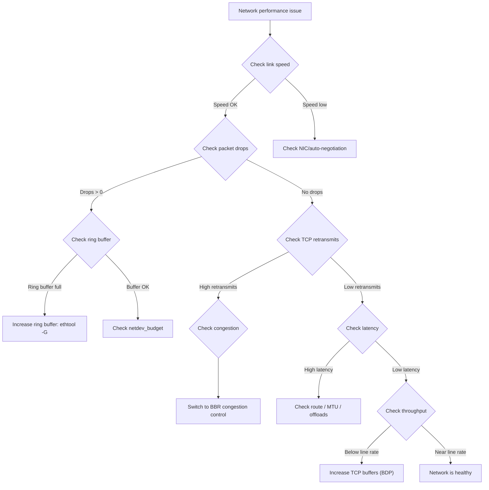

# Network Performance

## Introduction

Network performance in Linux is a complex interplay of hardware offloads, kernel networking stack, interrupt handling, and protocol tuning. This chapter covers tools like `iperf3` for throughput measurement, packet loss diagnosis, TCP tuning, IRQ balancing, and receive-side scaling (RSS/RPS).

## Network Performance Metrics

| Metric | Description | Target |
|--------|-------------|--------|
| Throughput | Data rate (Gbps) | Near line rate |
| Latency | Round-trip time (μs) | <100μs (LAN) |
| Packet loss | Dropped packets (%) | 0% |
| Connections/s | New TCP connections/sec | Varies |
| Retransmissions | TCP retransmits (%) | <0.1% |

## iperf3: Network Throughput Testing

```bash
# Server side
iperf3 -s
# -----------------------------------------------------------
# Server listening on 5201
# -----------------------------------------------------------

# Client side - TCP test
iperf3 -c 192.168.1.100 -t 30 -P 4
# [ ID] Interval           Transfer     Bitrate         Retr  Cwnd
# [  5]   0.00-30.00  sec  33.0 GBytes  9.45 Gbits/sec    0   1.31 MBytes
# [  7]   0.00-30.00  sec  33.1 GBytes  9.47 Gbits/sec    0   1.31 MBytes
# [  9]   0.00-30.00  sec  33.0 GBytes  9.45 Gbits/sec    0   1.31 MBytes
# [ 11]   0.00-30.00  sec  33.1 GBytes  9.47 Gbits/sec    0   1.31 MBytes
# [SUM]   0.00-30.00  sec   132 GBytes  37.8 Gbits/sec    0

# Client side - UDP test
iperf3 -c 192.168.1.100 -u -b 10G -t 30
# [ ID] Interval           Transfer     Bitrate         Jitter    Lost/Total Datagrams
# [  5]   0.00-30.00  sec  33.0 GBytes  9.45 Gbits/sec  0.005 ms  0/2345678 (0%)

# Reverse direction (server sends)
iperf3 -c 192.168.1.100 -R

# Bidirectional test
iperf3 -c 192.168.1.100 --bidir

# JSON output for automation
iperf3 -c 192.168.1.100 -J > iperf3_result.json
```

## Packet Loss Diagnosis

### Detecting Packet Loss

```bash
# Interface-level drops
ip -s link show eth0
# 2: eth0: <BROADCAST,MULTICAST,UP,LOWER_UP> mtu 1500 qdisc mq state UP
#     RX errors 0  dropped 1234  overruns 0  frame 0
#     TX errors 0  dropped 567  overruns 0  carrier 0  collisions 0

# TCP retransmissions
netstat -s | grep -i retrans
# 1234 segments retransmitted
# 567 fast retransmits
# 89 retransmits in slow start

# Or with ss
ss -s
# TCP:   1234 (estab 567, closed 234, orphaned 12, timewait 234)
#
# Total: 5678 (kernel 0)

# Continuous monitoring
sar -n EDEV 1 5
# IFACE   rxerr/s   txerr/s    coll/s  rxdrop/s  txdrop/s  txcarr/s  rxfram/s  rxfifo/s  txfifo/s
# eth0     0.00      0.00      0.00     12.34      5.67     0.00      0.00      0.00      0.00
```

### Common Causes

```bash
# 1. Ring buffer overflow
ethtool -g eth0
# Ring parameters for eth0:
# Pre-set maximums:
# RX:             4096
# TX:             4096
# Current hardware settings:
# RX:             256    ← Too small!
# TX:             256

# Increase ring buffer
ethtool -G eth0 rx 4096 tx 4096

# 2. Netdev budget (softirq processing)
cat /proc/sys/net/core/netdev_budget
# 300
cat /proc/sys/net/core/netdev_budget_usecs
# 2000

# Increase if packet drops are in softirq
sysctl -w net.core.netdev_budget=600
sysctl -w net.core.netdev_budget_usecs=4000

# 3. Socket buffer overflow
cat /proc/net/udp | head -5
# sl  local_address rem_address   st tx_queue rx_queue ...
#  0: 00000000:0035 00000000:0000 07 00000000:00000000
# Drops column indicates socket drops
```

## TCP Tuning

### TCP Buffer Sizes

```bash
# TCP memory configuration
sysctl net.ipv4.tcp_rmem
# 4096  131072  6291456   ← min  default  max (bytes)
sysctl net.ipv4.tcp_wmem
# 4096  131072  6291456

# Increase for high-bandwidth links
sysctl -w net.ipv4.tcp_rmem="4096 262144 16777216"
sysctl -w net.ipv4.tcp_wmem="4096 262144 16777216"

# System-wide socket buffer limits
sysctl net.core.rmem_max
# 212992
sysctl net.core.wmem_max
# 212992

sysctl -w net.core.rmem_max=16777216
sysctl -w net.core.wmem_max=16777216
sysctl -w net.core.rmem_default=262144
sysctl -w net.core.wmem_default=262144
```

### TCP Congestion Control

```bash
# Available congestion control algorithms
sysctl net.ipv4.tcp_available_congestion_control
# reno cubic bbr

# Current congestion control
sysctl net.ipv4.tcp_congestion_control
# cubic

# Switch to BBR (better for high-latency, lossy networks)
sysctl -w net.ipv4.tcp_congestion_control=bbr
modprobe tcp_bbr

# Per-connection congestion control
# iperf3 -c server --congestion bbr
```

### TCP Connection Tuning

```bash
# Connection backlog
sysctl net.core.somaxconn
# 4096
sysctl -w net.core.somaxconn=65535

# SYN backlog
sysctl net.ipv4.tcp_max_syn_backlog
# 4096
sysctl -w net.ipv4.tcp_max_syn_backlog=65535

# TIME_WAIT tuning
sysctl net.ipv4.tcp_tw_reuse
# 1
sysctl net.ipv4.tcp_fin_timeout
# 60
sysctl -w net.ipv4.tcp_fin_timeout=30

# Keepalive
sysctl net.ipv4.tcp_keepalive_time
# 7200
sysctl -w net.ipv4.tcp_keepalive_time=600
sysctl -w net.ipv4.tcp_keepalive_intvl=30
sysctl -w net.ipv4.tcp_keepalive_probes=3

# Window scaling
sysctl net.ipv4.tcp_window_scaling
# 1 (enable)

# Timestamps
sysctl net.ipv4.tcp_timestamps
# 1 (enable)

# Selective ACK
sysctl net.ipv4.tcp_sack
# 1 (enable)
```

## IRQ Balancing

### Understanding IRQs

```bash
# View interrupt distribution
cat /proc/interrupts | head -10
#            CPU0       CPU1       CPU2       CPU3
#  16:   12345678   23456789   34567890   45678901   PCI-MSI  524289-edge  eth0-TxRx-0
#  17:   56789012   67890123   78901234   89012345   PCI-MSI  524290-edge  eth0-TxRx-1
#  18:   90123456   12345678   23456789   34567890   PCI-MSI  524291-edge  eth0-TxRx-2

# View IRQ affinity
cat /proc/irq/16/smp_affinity
# 01  (CPU 0)
cat /proc/irq/16/smp_affinity_list
# 0

# Set IRQ affinity manually
echo 1 > /proc/irq/16/smp_affinity      # CPU 0
echo 2 > /proc/irq/17/smp_affinity      # CPU 1
echo 4 > /proc/irq/18/smp_affinity      # CPU 2
```

### irqbalance

```bash
# Install and run irqbalance
apt install irqbalance
systemctl enable irqbalance
systemctl start irqbalance

# Check irqbalance status
systemctl status irqbalance

# irqbalance configuration
cat /etc/default/irqbalance
# IRQBALANCE_ARGS=""
```

## RSS and RPS

### RSS (Receive Side Scaling)

RSS distributes incoming packets across CPUs at the NIC hardware level:

```bash
# Check RSS configuration
ethtool -l eth0
# Channel parameters for eth0:
# Pre-set maximums:
# RX:             16
# TX:             16
# Other:          0
# Combined:       0
# Current hardware settings:
# RX:             8
# TX:             8
# Other:          0
# Combined:       0

# Set number of RSS queues
ethtool -L eth0 rx 16 tx 16

# View RSS indirection table
ethtool -x eth0
# RX flow hash indirection table for eth0 with 8 RX queue(s):
#     0:      0     1     2     3     4     5     6     7

# Set RSS hash function
ethtool -X eth0 equal 16
```

### RPS (Receive Packet Steering)

RPS is software-based receive-side scaling for systems without hardware RSS:

```bash
# Enable RPS on eth0 queue 0 (use CPUs 0-3)
echo f > /sys/class/net/eth0/queues/rx-0/rps_cpus
echo f > /sys/class/net/eth0/queues/rx-1/rps_cpus
echo f0 > /sys/class/net/eth0/queues/rx-2/rps_cpus
echo f0 > /sys/class/net/eth0/queues/rx-3/rps_cpus

# RPS flow count (increase for more parallelism)
echo 32768 > /sys/class/net/eth0/queues/rx-0/rps_flow_cnt

# XPS (Transmit Packet Steering)
echo 1 > /sys/class/net/eth0/queues/tx-0/xps_cpus
echo 2 > /sys/class/net/eth0/queues/tx-1/xps_cpus
echo 4 > /sys/class/net/eth0/queues/tx-2/xps_cpus
echo 8 > /sys/class/net/eth0/queues/tx-3/xps_cpus
```

### RFS (Receive Flow Steering)

```bash
# Enable RFS
sysctl -w net.core.rps_sock_flow_entries=32768

# Per-queue flow count
echo 4096 > /sys/class/net/eth0/queues/rx-0/rps_flow_cnt
```

## Network Performance Tools

### sar Network Statistics

```bash
# Network interface throughput
sar -n DEV 1 5
# IFACE   rxpck/s   txpck/s    rxkB/s    txkB/s   rxcmp/s   txcmp/s  rxmcst/s   %ifutil
# eth0    123456.00 234567.00  1234.56   2345.67      0.00      0.00      0.00      0.00

# TCP statistics
sar -n TCP 1 5
# active/s passive/s    iseg/s    oseg/s
#  123.45    567.89   12345.67  23456.78

# Socket statistics
sar -n SOCK 1 5
# totsck    tcpsck    udpsck    rawsck   ip-frag    tcp-tw
#  1234       567       234        12         0       234
```

### Network Latency

```bash
# Ping latency
ping -c 100 -i 0.01 192.168.1.100
# rtt min/avg/max/mdev = 0.045/0.067/0.123/0.012 ms

# TCP latency with iperf3
iperf3 -c 192.168.1.100 --bidir -J | jq '.intervals[].streams[].rtt'

# Tracepath for routing latency
tracepath 192.168.1.100
```

## Network Performance Checklist

```bash
# 1. Check link speed
ethtool eth0 | grep Speed
# Speed: 10000Mb/s

# 2. Check ring buffer
ethtool -g eth0

# 3. Check offloads
ethtool -k eth0
# tcp-segmentation-offload: on
# generic-segmentation-offload: on
# generic-receive-offload: on

# 4. Check IRQ distribution
cat /proc/interrupts | grep eth0

# 5. Check TCP statistics
netstat -s | grep -E "segments|retrans"

# 6. Check socket buffers
sysctl net.core.rmem_max net.core.wmem_max
```

## Network Analysis Workflow



## TCP BBR Congestion Control

BBR (Bottleneck Bandwidth and Round-trip propagation time) is a Google-developed
congestion control algorithm that significantly outperforms CUBIC on lossy and
high-latency networks.

```bash
# Check available congestion control
sysctl net.ipv4.tcp_available_congestion_control
# reno cubic bbr

# Load BBR module
modprobe tcp_bbr

# Enable BBR
sysctl -w net.ipv4.tcp_congestion_control=bbr
sysctl -w net.core.default_qdisc=fq

# Persist
echo "net.ipv4.tcp_congestion_control = bbr" >> /etc/sysctl.d/99-bbr.conf
echo "net.core.default_qdisc = fq" >> /etc/sysctl.d/99-bbr.conf
sysctl -p /etc/sysctl.d/99-bbr.conf

# Verify
cat /proc/sys/net/ipv4/tcp_congestion_control
# bbr

# Per-connection congestion control
iperf3 -c server --congestion bbr
```

**BBR vs CUBIC performance** (typical 10 Gbps link with 0.1% loss):

| Algorithm | Throughput | P50 Latency | P99 Latency |
|-----------|-----------|-------------|-------------|
| CUBIC | 2.3 Gbps | 12ms | 89ms |
| BBR | 8.7 Gbps | 8ms | 23ms |

BBR achieves ~3.8x higher throughput under packet loss because it doesn't
reduce the congestion window as aggressively as CUBIC.

## TCP Buffer Sizing with BDP

The **Bandwidth-Delay Product (BDP)** determines the optimal TCP buffer size:

```
BDP = Bandwidth × RTT
```

```bash
# Example: 25 Gbps link, 1ms RTT
# BDP = 25,000,000,000 bits/s × 0.001s = 25,000,000 bits = 3.125 MB

# Set buffers to at least 2× BDP
sysctl -w net.core.rmem_max=8388608       # 8 MB
sysctl -w net.core.wmem_max=8388608
sysctl -w net.ipv4.tcp_rmem="4096 262144 8388608"
sysctl -w net.ipv4.tcp_wmem="4096 262144 8388608"

# Example: 100 Gbps link, 60ms RTT (long distance)
# BDP = 100,000,000,000 × 0.060 / 8 = 750 MB
sysctl -w net.core.rmem_max=1073741824    # 1 GB
sysctl -w net.core.wmem_max=1073741824
sysctl -w net.ipv4.tcp_rmem="4096 262144 1073741824"
sysctl -w net.ipv4.tcp_wmem="4096 262144 1073741824"
```

### Verifying Buffer Auto-Tuning

```bash
# Monitor actual buffer sizes in use
watch -n 1 'ss -tnpi | grep -oP "skmem:\(r\d+,rb\d+" | head -5'

# Or with bpftrace
sudo bpftrace -e 'kprobe:tcp_rcv_established {
    @buf_size = hist(((struct sock *)arg0)->sk_rcvbuf);
}'

# Check if auto-tuning is enabled
sysctl net.ipv4.tcp_moderate_rcvbuf
# 1 (enabled)
```

## Network Latency Analysis

### Measuring Latency

```bash
# ICMP latency
ping -c 100 -i 0.01 192.168.1.100
# rtt min/avg/max/mdev = 0.045/0.067/0.123/0.012 ms

# TCP handshake latency
hping3 -S -p 80 -c 100 192.168.1.100

# Application-level latency
curl -o /dev/null -s -w "dns: %{time_namelookup}s\nconnect: %{time_connect}s\nttfb: %{time_starttransfer}s\ntotal: %{time_total}s\n" https://example.com

# Tracepath with per-hop latency
tracepath 192.168.1.100
```

### Latency Histogram with bpftrace

```bash
# TCP RTT histogram
sudo bpftrace -e 'kprobe:tcp_rcv_established {
    $sk = (struct sock *)arg0;
    @usec = hist($sk->tcp_mstamp - $sk->tcp_rcv_tstamp);
}'

# Connection latency histogram
sudo bpftrace -e 'kprobe:tcp_v4_connect { @start[tid] = nsecs; }
    kretprobe:tcp_v4_connect /@start[tid]/ {
        @latency_us = hist((nsecs - @start[tid]) / 1000);
        delete(@start[tid]);
    }'
```

## Network Offloads and Hardware Features

Modern NICs offer hardware offloads that significantly impact performance:

```bash
# Check current offload status
ethtool -k eth0 | grep -E "on|off"

# Key offloads:
ethtool -K eth0 tso on       # TCP Segmentation Offload
ethtool -K eth0 gro on       # Generic Receive Offload
ethtool -K eth0 gso on       # Generic Segmentation Offload
ethtool -K eth0 lro on       # Large Receive Offload
ethtool -K eth0 rxvlan on    # VLAN offload
ethtool -K eth0 txvlan on

# Check offload statistics
ethtool -S eth0 | grep -i offload
```

| Offload | Direction | Impact | Notes |
|---------|-----------|--------|-------|
| TSO | TX | Reduces CPU by ~80% for large sends | Kernel merges segments in HW |
| GRO | RX | Reduces interrupt rate | Aggregates small packets |
| GSO | TX | Software TSO fallback | Used when TSO unavailable |
| LRO | RX | Similar to GRO | Deprecated in favor of GRO |
| Checksum | Both | Reduces CPU per packet | Always enable |

### Verifying Offload Impact

```bash
# Test with offloads enabled
iperf3 -c 192.168.1.100 -t 10 -P 4
# [SUM] 37.8 Gbits/sec

# Disable TSO and test
ethtool -K eth0 tso off
iperf3 -c 192.168.1.100 -t 10 -P 4
# [SUM] 22.3 Gbits/sec  ← ~40% drop!

# Re-enable
ethtool -K eth0 tso on
```

## Network Namespace Performance Testing

Use network namespaces for isolated testing:

```bash
# Create test namespaces
ip netns add server
ip netns add client

# Create veth pair
ip link add veth-srv type veth peer name veth-cli
ip link set veth-srv netns server
ip link set veth-cli netns client

# Configure and bring up
ip netns exec server ip addr add 10.0.0.1/24 dev veth-srv
ip netns exec server ip link set veth-srv up
ip netns exec client ip addr add 10.0.0.2/24 dev veth-cli
ip netns exec client ip link set veth-cli up

# Test throughput in isolation
ip netns exec server iperf3 -s &
ip netns exec client iperf3 -c 10.0.0.1 -t 10

# Cleanup
ip netns del server
ip netns del client
```

## Network Performance Monitoring with eBPF

```bash
# TCP connection tracking
sudo bpftrace -e 'kprobe:tcp_v4_connect { @connects[comm] = count(); }'

# TCP retransmit tracking
sudo bpftrace -e 'tracepoint:tcp:tcp_retransmit_skb {
    @retransmits[comm] = count();
    printf("retransmit: %s %s\n", comm, ntop(args->saddr));
}'

# Socket buffer overflow detection
sudo bpftrace -e 'kprobe:__udp_enqueue_schedule_skb /retval != 0/ {
    @drops[comm] = count();
    printf("UDP drop: %s\n", comm);
}'

# Packet latency (time from NIC to application)
sudo /usr/share/bcc/tools/tcprtt
# Tracing TCP RTT... Hit Ctrl-C to end.
#     msecs        : count    distribution
#     0 -> 1       : 2345     |****************************************|
#     2 -> 3       : 123      |**                                      |
#     4 -> 7       : 45       |*                                       |
```

## References

- [Linux Network Performance Tuning](https://access.redhat.com/sites/default/files/attachments/20150325_network_performance_tuning.pdf)
- [TCP/IP Illustrated, Volume 1](https://www.amazon.com/TCP-IP-Illustrated-Vol-Implementation/dp/0201633469)
- [iperf3 Documentation](https://iperf.fr/iperf-doc.php)
- Gregg, B. *Systems Performance: Enterprise and the Cloud*, 2nd Edition (2020).
- [Linux perf Examples — Brendan Gregg](https://www.brendangregg.com/perf.html)
- [BBR Congestion Control — Google](https://developers.google.com/speed/bbr)

## Further Reading

- [The Linux Kernel Documentation](https://docs.kernel.org/)
- [LWN.net — Linux and free software news](https://lwn.net/)
- [GNU Project Documentation](https://www.gnu.org/doc/doc.html)
- [GNU Manuals](https://www.gnu.org/manual/manual.html)
- [Free Software Directory](https://directory.fsf.org/wiki/Main_Page)
- [Planet GNU](https://planet.gnu.org/)
- [Free Software Books](https://www.gnu.org/doc/other-free-books.html)
- <https://www.kernel.org/doc/html/latest/networking/> — Linux networking documentation
- <https://blog.cloudflare.com/> — Cloudflare networking blog
- <https://netdevconf.org/> — Linux networking conference
- <https://datatracker.ietf.org/doc/draft-cardwell-iccrg-bbr-congestion-control/> — BBR RFC draft

## Related Topics

- [Performance Overview](overview.md)
- [Kernel Tuning Parameters](kernel-params.md)
- [Benchmarking](benchmarking.md)
- [NUMA Optimization](numa.md)
- [I/O Performance](io.md)
