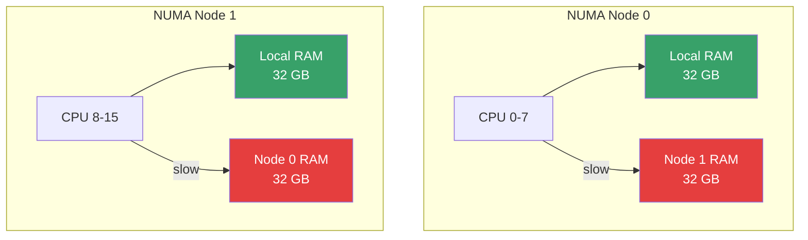
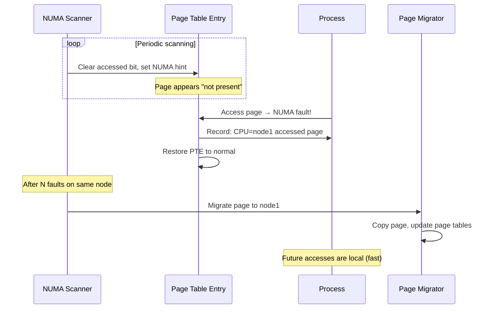
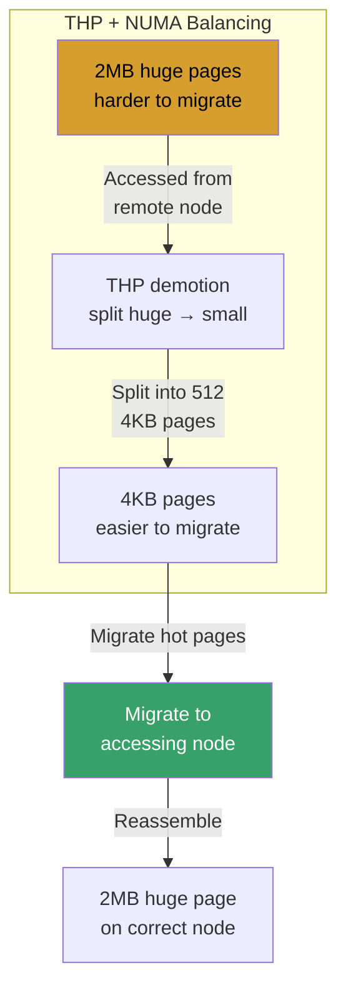
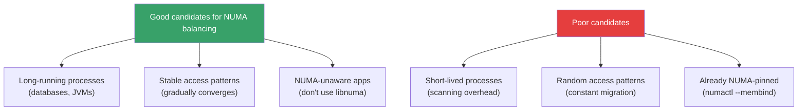
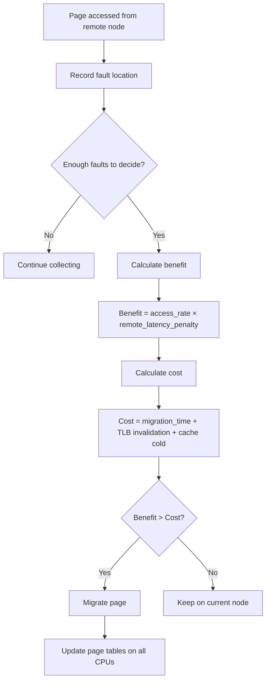
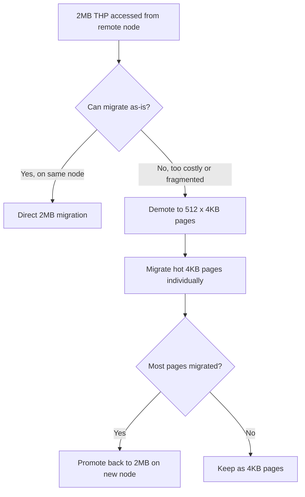

# NUMA Balancing: Automatic NUMA-Aware Memory Placement

## Introduction

NUMA (Non-Uniform Memory Access) balancing is a Linux kernel feature that automatically migrates memory pages to the NUMA node where they are most frequently accessed. Also known as **AutoNUMA** or **NUMA scanning**, this mechanism ensures that processes running on a specific CPU have their most-used data stored in the closest memory, minimizing expensive cross-node memory accesses.

On NUMA systems, accessing remote memory is 2-3x slower than local memory. NUMA balancing detects which pages a process accesses from which node and automatically moves hot pages to the accessing node, improving performance without requiring manual tuning.

Key properties:
- **Automatic** — no userspace configuration needed (enabled by default)
- **Page-granularity** — works at the page level (4KB, 2MB, 1GB)
- **Scan-based** — periodically scans page tables to detect access patterns
- **Migratory** — moves pages between NUMA nodes based on access frequency
- **Transparent** — processes are unaware of page migrations

## NUMA Architecture Recap



### Memory Access Latencies

| Access Type | Typical Latency | Relative Speed |
|-------------|----------------|----------------|
| Local (same node) | ~100 ns | 1x |
| Remote (1 hop) | ~200 ns | 0.5x |
| Remote (2+ hops) | ~300 ns | 0.3x |

## How NUMA Balancing Works

### PTE Scanning

NUMA balancing works by exploiting the **page table entry (PTE)** mechanism:

1. **Mark PTEs as inaccessible** — The kernel periodically clears the accessed/dirty bits and marks PTEs as not present (NUMA hint fault)
2. **Detect access faults** — When a process accesses the page, a NUMA hint fault occurs
3. **Record access location** — The fault handler records which CPU/node accessed the page
4. **Migrate if beneficial** — After enough data is collected, hot pages are migrated to the accessing node



### Scanning Rate and Heuristics

```c
/* Key kernel tunables */
// /proc/sys/kernel/numa_balancing_scan_delay_ms    — Initial delay before scanning (default: 1000)
// /proc/sys/kernel/numa_balancing_scan_period_min_ms — Minimum scan interval (default: 1000)
// /proc/sys/kernel/numa_balancing_scan_period_max_ms — Maximum scan interval (default: 60000)
// /proc/sys/kernel/numa_balancing_scan_size_mb      — MB scanned per scan (default: 256)
```

### Scanning Algorithm

```mermaid
flowchart TD
    START["NUMA scan triggered"] --> PICK["Pick next task to scan"]
    PICK --> RANGE["Scan task's address range<br/>(scan_size_mb per scan)"]
    RANGE --> CLEAR["Clear PTE accessed bits<br/>(set NUMA hint)"]
    CLEAR --> WAIT["Wait for hint faults"]
    WAIT --> COLLECT["Collect fault statistics<br/>(which node accessed)"]
    COLLECT --> DECIDE{"Enough data to<br/>migrate?"}
    DECIDE -->|"Yes, hot on different node"| MIGRATE["Migrate page"]
    DECIDE -->|"No, or already local"| NEXT["Move to next range"]
    MIGRATE --> NEXT
    NEXT --> PICK

    style START fill:#3182ce,color:#fff
    style MIGRATE fill:#e53e3e,color:#fff
```



## Kernel Tuning

### sysctl Parameters

```bash
# Enable/disable NUMA balancing (default: 1)
sysctl kernel.numa_balancing
# or
echo 1 > /proc/sys/kernel/numa_balancing

# Scan delay — wait before scanning a new task (ms)
sysctl kernel.numa_balancing_scan_delay_ms
# Default: 1000

# Minimum scan period (ms) — don't scan too frequently
sysctl kernel.numa_balancing_scan_period_min_ms
# Default: 1000

# Maximum scan period (ms) — scan at least this often
sysctl kernel.numa_balancing_scan_period_max_ms
# Default: 60000

# Amount of memory to scan per period (MB)
sysctl kernel.numa_balancing_scan_size_mb
# Default: 256

# Enable/disable NUMA balancing for promoted (huge) pages (since 5.18)
sysctl kernel.numa_balancing_promote_rate_limit_MBps
# Default: 65536
```

### Tuning for Different Workloads

```bash
# Database workload (stable, long-running)
# Reduce scanning frequency since access patterns are stable
echo 10000 > /proc/sys/kernel/numa_balancing_scan_period_min_ms
echo 120000 > /proc/sys/kernel/numa_balancing_scan_period_max_ms

# Web server (many short-lived processes)
# Increase scanning frequency for quick convergence
echo 500 > /proc/sys/kernel/numa_balancing_scan_period_min_ms
echo 10000 > /proc/sys/kernel/numa_balancing_scan_period_max_ms

# HPC workload (explicit NUMA pinning preferred)
# Disable automatic balancing, use numactl instead
echo 0 > /proc/sys/kernel/numa_balancing

# Large memory workload
# Increase scan size to cover more pages per scan
echo 512 > /proc/sys/kernel/numa_balancing_scan_size_mb
```

## NUMA Balancing and Huge Pages

### Transparent Huge Pages (THP) and NUMA



### Huge Page NUMA Tuning

```bash
# Enable THP NUMA scanning
echo always > /sys/kernel/mm/transparent_hugepage/enabled

# Control NUMA promotion (small → huge)
# Enable NUMA-aware promotion (default since 5.18)
echo 1 > /proc/sys/kernel/numa_balancing

# Control THP promotion rate limit (MB/s)
echo 65536 > /proc/sys/kernel/numa_balancing_promote_rate_limit_MBps

# Disable NUMA promotion (keep small pages)
echo 0 > /proc/sys/kernel/numa_balancing_promote_rate_limit_MBps

# Check NUMA balancing statistics
grep -i numa /proc/vmstat
```

## Manual NUMA Control

### numactl

```bash
# Install numactl
sudo apt install numactl        # Debian/Ubuntu
sudo dnf install numactl         # Fedora/RHEL

# Show NUMA topology
numactl --hardware
# available: 2 nodes (0-1)
# node 0 cpus: 0 1 2 3 4 5 6 7
# node 0 size: 32768 MB
# node 1 cpus: 8 9 10 11 12 13 14 15
# node 1 size: 32768 MB

# Bind process to node 0
numactl --cpunodebind=0 --membind=0 ./my_app

# Allow all nodes but prefer node 0
numactl --preferred=0 ./my_app

# Interleave memory across all nodes (good for large allocations)
numactl --interleave=all ./my_app

# Bind to specific CPUs
numactl --physcpubind=0-3 --membind=0 ./my_app
```

### NUMA Policies in Code

```c
#include <numaif.h>
#include <numa.h>
#include <stdlib.h>

int main(void)
{
    /* Initialize libnuma */
    if (numa_available() < 0) {
        fprintf(stderr, "NUMA not available\n");
        return 1;
    }

    /* Allocate on specific node */
    void *ptr = numa_alloc_onnode(1024 * 1024, 0);  /* Node 0 */
    if (!ptr) {
        perror("numa_alloc_onnode");
        return 1;
    }

    /* Set memory policy for a range */
    unsigned long nodemask = 1 << 0;  /* Node 0 */
    mbind(ptr, 1024 * 1024, MPOL_BIND, &nodemask,
          sizeof(nodemask) * 8, MPOL_MF_MOVE);

    /* Allocate with interleaved policy */
    void *interleaved = numa_alloc_interleaved(1024 * 1024);

    /* Get current node for a pointer */
    int node = -1;
    get_mempolicy(&node, NULL, 0, ptr, MPOL_F_NODE);
    printf("Page is on node: %d\n", node);

    numa_free(ptr, 1024 * 1024);
    numa_free(interleaved, 1024 * 1024);
    return 0;
}
```

### Compiling with libnuma

```bash
gcc -o numa_app numa_app.c -lnuma
```

## Monitoring NUMA Balancing

### vmstat NUMA Statistics

```bash
# Watch NUMA balancing activity
grep numa /proc/vmstat
# numa_pte_updates        — PTEs scanned
# numa_hint_faults        — NUMA hint faults generated
# numa_hint_faults_local  — Faults where page was already local
# numa_pages_migrated     — Pages migrated between nodes

# Watch in real-time
watch -n 1 'grep numa /proc/vmstat'

# Calculate migration rate
# numa_pages_migrated delta / time = pages migrated per second
```

### perf NUMA Analysis

```bash
# Record NUMA events
sudo perf record -e 'migrate:mm_migrate_pages' -a -- sleep 10

# NUMA memory access profiling
sudo perf mem record -a -- sleep 10
sudo perf mem report --sort=mem,sym

# NUMA hit/miss statistics
sudo perf stat -e 'node-loads,node-load-misses,node-stores,node-store-misses' -a -- sleep 10

# Show NUMA topology
lstopo                    # from hwloc package
numactl --hardware
```

### Monitoring Page Migration

```bash
# Watch page migrations in real-time
sudo perf trace -e 'migrate:mm_migrate_pages' -a

# Trace NUMA balancing decisions
sudo perf trace -e 'compaction:*' -e 'migrate:*' -a -- sleep 10

# Count migrations per NUMA node pair
sudo bpftrace -e '
tracepoint:migrate:mm_migrate_pages {
    @migrations[args->src_nid, args->dst_nid] = count();
}'
```

### NUMA Statistics in /proc

```bash
# Per-node memory statistics
cat /sys/devices/system/node/node0/meminfo
cat /sys/devices/system/node/node1/meminfo

# NUMA hit/miss counters
numastat

# Per-process NUMA stats
numastat -p <pid>

# Detailed NUMA miss info
numastat -c
```

## NUMA Balancing in Practice

### When NUMA Balancing Helps



### Benchmarking NUMA Impact

```bash
# Use numactl to measure local vs remote access
# Local access
numactl --cpunodebind=0 --membind=0 ./stream_benchmark
# Result: 50 GB/s

# Remote access
numactl --cpunodebind=0 --membind=1 ./stream_benchmark
# Result: 20 GB/s (2.5x slower)

# With NUMA balancing (no pinning)
numactl --cpunodebind=0 ./stream_benchmark
# After warmup: close to 50 GB/s (auto-migrated)

# Use Intel Memory Latency Checker
mlc --latency_matrix
```

### Database Tuning with NUMA

```bash
# PostgreSQL: configure for NUMA
# In postgresql.conf:
# huge_pages = try
# shared_buffers = 8GB

# Bind PostgreSQL to specific NUMA node
numactl --interleave=all postgres -D /var/lib/postgresql/data

# MySQL/MariaDB
numactl --interleave=all mysqld

# Redis
numactl --cpunodebind=0 --membind=0 redis-server
```

## NUMA Balancing vs Explicit Pinning

| Aspect | NUMA Balancing | Explicit Pinning (numactl) |
|--------|---------------|---------------------------|
| Configuration | Automatic | Manual |
| Adaptability | Adapts to changing patterns | Fixed policy |
| Overhead | Scanning + migration | None |
| Best for | General workloads | Known, stable workloads |
| Migration | Continuous | None |
| Predictability | Lower | Higher |

## Troubleshooting

### Common Issues

| Symptom | Cause | Solution |
|---------|-------|----------|
| High `numa_pages_migrated` | Excessive migration | Increase `scan_period_min_ms` |
| Poor performance on NUMA | Pages on wrong node | Check `numastat -p` for misses |
| High CPU from scanning | Scan rate too high | Increase `scan_period_min_ms`, decrease `scan_size_mb` |
| THP + NUMA conflicts | Huge page splitting | Tune `numa_balancing_promote_rate_limit_MBps` |
| Remote memory access | Process not NUMA-aware | Use `numactl --membind` or enable balancing |

### Debugging

```bash
# Check NUMA balancing is enabled
sysctl kernel.numa_balancing

# Check NUMA topology
lstopo-no-graphics

# Show per-node memory usage
numastat

# Show per-process NUMA allocation
numastat -p <process-name>

# Check NUMA hit/miss for a process
cat /proc/<pid>/numa_maps

# Monitor migration rate
watch -n 1 'grep numa_pages_migrated /proc/vmstat'

# Profile memory access patterns
sudo perf c2c record -a -- sleep 10
sudo perf c2c report
```

### Per-Process NUMA Maps

```bash
# View NUMA memory distribution for a process
cat /proc/<pid>/numa_maps
# Output:
# 00400000 default file=/usr/bin/my_app mapped=3 N0=3
# 00600000 default file=/usr/bin/my_app anon=1 dirty=1 N0=1
# 7f1234000000 default anon=1024 dirty=1024 N0=512 N1=512

# Interpret:
# N0=3     — 3 pages on node 0
# N1=512   — 512 pages on node 1
# default  — default memory policy
# anon=    — anonymous pages
# file=    — file-backed pages
```

## Kernel Source

### Key Files

```
mm/
├── memory-failure.c    # NUMA hint fault handling
├── migrate.c           # Page migration
├── mprotect.c          # NUMA PTE scanning
├── mempolicy.c         # NUMA memory policies
├── page_alloc.c        # NUMA-aware allocation
└── numa_balancing.c    # NUMA balancing core

kernel/
├── sched/fair.c        # NUMA balancing in scheduler
└── sched/numa.c        # NUMA task placement
```

### Key Kernel Functions

```c
/* NUMA balancing scan */
static void task_numa_work(struct callback_head *work)
{
    /* Scan task's address space for NUMA hints */
    /* Clear PTEs, set NUMA fault flags */
}

/* NUMA fault handler */
static int task_numa_fault(int last_cpupid, int mem_node, int pages,
                           int flags)
{
    /* Record which node accessed the page */
    /* Update NUMA statistics */
    /* Decide whether to migrate */
}

/* Page migration */
int migrate_pages(struct list_head *l, new_page_t get_new_page,
                  free_page_t put_new_page, unsigned long private,
                  enum migrate_mode mode, int reason)
{
    /* Move pages between NUMA nodes */
}
```


## NUMA Balancing Deep Dive: Migration Cost Model

The NUMA balancing subsystem decides whether to migrate a page based on a cost
model that weighs the benefit of local access against the cost of migration.

### Migration Decision Algorithm



The migration cost includes:
- **Copy cost**: copying the page content (~1 µs per 4KB page)
- **TLB invalidation**: shooting down TLBs on all CPUs that mapped the page
- **Cache warming**: the migrated page is cold on the destination node
- **Page table updates**: updating PTEs across all address spaces

### When Migration Hurts Performance

NUMA balancing can hurt performance when:

1. **False sharing**: Two threads on different nodes access the same cache line
   but different data. The page bounces between nodes.
2. **Read-mostly data**: Data accessed from many nodes but rarely written.
   Migration helps one node but hurts others.
3. **Short-lived processes**: The scanning overhead exceeds the benefit of
   optimization before the process exits.
4. **Thrashing**: Two nodes access the page at similar rates, causing constant
   migration.

```bash
# Detect NUMA thrashing
watch -n 1 'grep numa_pages_migrated /proc/vmstat'
# If the counter increases rapidly, pages are bouncing between nodes

# Mitigation: increase scan period to slow migration decisions
echo 30000 > /proc/sys/kernel/numa_balancing_scan_period_min_ms
```

## NUMA Balancing for Specific Workloads

### Virtual Machine Hosts

```bash
# For VM hosts, NUMA balancing competes with the guest's NUMA policy
# Best approach: disable NUMA balancing, use numactl for QEMU

# Disable NUMA balancing on the host
echo 0 > /proc/sys/kernel/numa_balancing

# Pin each VM to a NUMA node
numactl --cpunodebind=0 --membind=0 qemu-system-x86_64 ...
numactl --cpunodebind=1 --membind=1 qemu-system-x86_64 ...

# Or use libvirt NUMA tuning in domain XML:
# <numatune>
#   <memory mode='strict' nodeset='0'/>
# </numatune>
```

### Container Workloads

```bash
# For containers, NUMA balancing works at the host level
# The host kernel's NUMA balancing handles page placement

# Check NUMA distribution for a container's cgroup
cat /proc/$(docker inspect --format '{{.State.Pid}}' mycontainer)/numa_maps

# For Kubernetes, use topology manager
# In kubelet config:
# topologyManagerPolicy: single-numa-node
# topologyManagerScope: pod
```

### High-Performance Computing (HPC)

```bash
# HPC applications typically use explicit NUMA placement
# Disable NUMA balancing for maximum control
echo 0 > /proc/sys/kernel/numa_balancing

# Use numactl for MPI ranks
mpirun -np 8 numactl --cpunodebind=0 --membind=0 ./rank_0_3
mpirun -np 8 numactl --cpunodebind=1 --membind=1 ./rank_4_7

# Or use Intel MPI's built-in NUMA binding
I_MPI_PIN_DOMAIN=numa ./my_mpi_app
```

### Database Systems

```bash
# PostgreSQL: shared buffers benefit from NUMA-aware placement
# Option 1: interleave (good for read-heavy)
numactl --interleave=all postgres -D /data/pg

# Option 2: bind to single node (good for dedicated server)
numactl --cpunodebind=0 --membind=0 postgres -D /data/pg

# MySQL/InnoDB: innodb_numa_interleave=1
# In my.cnf:
# [mysqld]
# innodb_numa_interleave=1
```

## NUMA Profiling Tools

### numastat Deep Dive

```bash
# System-wide NUMA statistics
numastat
# node0         node1
# numa_hit       12345678   23456789   # Successful local allocations
# numa_miss       1234567    2345678   # Had to allocate on other node
# numa_foreign     2345678    1234567   # Other node's misses allocated here
# interleave_hit   100000     100000   # Interleaved allocations

# Per-process NUMA stats
numastat -p postgres
numastat -p java

# Show memory distribution per node
numastat -m
# Node 0 Total: 32768 MB
# Node 1 Total: 32768 MB

# Show NUMA miss details
numastat -c
```

### perf c2c (Cache-to-Cache)

`perf c2c` detects false sharing and NUMA contention:

```bash
# Record cache-to-cache transfers
sudo perf c2c record -a -- sleep 10

# Show NUMA contention report
sudo perf c2c report --stdio

# The report shows:
# - Cache lines with NUMA hits/misses
# - Which functions cause contention
# - NUMA node distribution per cache line

# Sort by NUMA misses
sudo perf c2c report --stdio --sort=pid,dso,symbol
```

### Intel Memory Latency Checker (MLC)

```bash
# Measure NUMA latency matrix
mlc --latency_matrix
# Local latency:  ~80 ns
# Remote latency: ~150 ns

# Measure bandwidth
mlc --bandwidth_matrix
# Local BW:  ~50 GB/s
# Remote BW: ~25 GB/s

# Inject idle latency (realistic measurement)
mlc --idle_latency_matrix
```

## Advanced NUMA Concepts

### NUMA Distance and Topology

```bash
# Show NUMA distance matrix
numactl --hardware
# node distances:
# node   0   1
#   0:  10  21
#   1:  21  10
# Distance 10 = local, 21 = remote (1 hop)

# Hardware topology
lstopo --of txt
# Shows physical layout:
# Package 0: cores 0-7, memory 32GB
# Package 1: cores 8-15, memory 32GB

# Show NUMA node details
cat /sys/devices/system/node/node0/cpulist
# 0-7
```

### NUMA-Aware Memory Allocation (C)

```c
#include <numa.h>
#include <numaif.h>
#include <stdio.h>
#include <stdlib.h>

int main(void)
{
    if (numa_available() < 0) {
        fprintf(stderr, "NUMA not available\n");
        return 1;
    }

    int max_node = numa_max_node();
    printf("NUMA nodes: %d\n", max_node + 1);

    /* Allocate on node 0 */
    void *local = numa_alloc_onnode(4096, 0);

    /* Allocate interleaved across all nodes */
    void *interleaved = numa_alloc_interleaved(4096);

    /* Allocate on current node */
    void *here = numa_alloc_local(4096);

    /* Set memory policy for a range */
    unsigned long nodemask = 1 << 1;  /* Node 1 */
    mbind(local, 4096, MPOL_BIND, &nodemask,
          sizeof(nodemask) * 8, MPOL_MF_MOVE);

    /* Get current node for a pointer */
    int node;
    get_mempolicy(&node, NULL, 0, local, MPOL_F_NODE);
    printf("Page on node: %d\n", node);

    numa_free(local, 4096);
    numa_free(interleaved, 4096);
    numa_free(here, 4096);
    return 0;
}
/* Compile: gcc -o numa_app numa_app.c -lnuma */
```

### NUMA and Transparent Huge Pages Interaction

When THP is enabled, NUMA balancing must handle huge pages specially:



```bash
# Check THP + NUMA statistics
grep -E 'thp|numa' /proc/vmstat
# numa_pte_updates
# numa_hint_faults
# numa_hint_faults_local
# numa_pages_migrated
# thp_fault_alloc
# thp_fault_fallback
# thp_collapse_alloc

# Disable NUMA promotion for THP (if causing issues)
echo 0 > /proc/sys/kernel/numa_balancing_promote_rate_limit_MBps
```
## Further Reading

- [Linux kernel NUMA documentation](https://www.kernel.org/doc/html/latest/mm/numa.html)
- [LWN: AutoNUMA](https://lwn.net/Articles/488709/)
- [LWN: NUMA balancing](https://lwn.net/Articles/524977/)
- [numactl(8) man page](https://man7.org/linux/man-pages/man8/numactl.8.html)
- [numa(3) man page](https://man7.org/linux/man-pages/man3/numa.3.html)
- [Brendan Gregg: NUMA analysis](https://www.brendangregg.com/numa.html)
- [Intel MLC (Memory Latency Checker)](https://www.intel.com/content/www/us/en/developer/articles/tool/intelr-memory-latency-checker.html)

## See Also

- [NUMA](./numa.md) — NUMA architecture overview
- [Huge Pages](../memory/huge-pages.md) — THP and NUMA interaction
- [Page Allocator](../memory/page-allocator.md) — NUMA-aware allocation
- [Scheduler CPU](./cpu.md) — scheduler and NUMA topology
- [Memory](./memory.md) — memory management overview
- [Kernel Parameters](./kernel-params.md) — sysctl tuning
