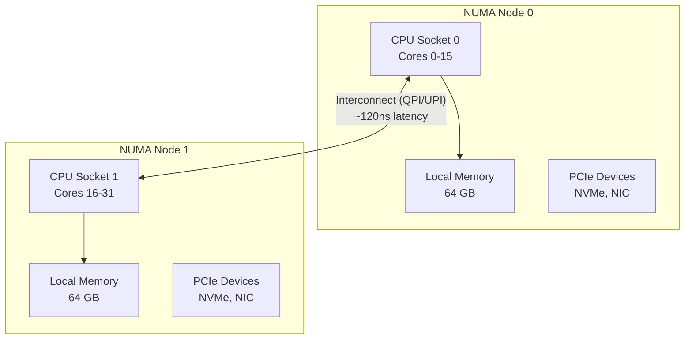
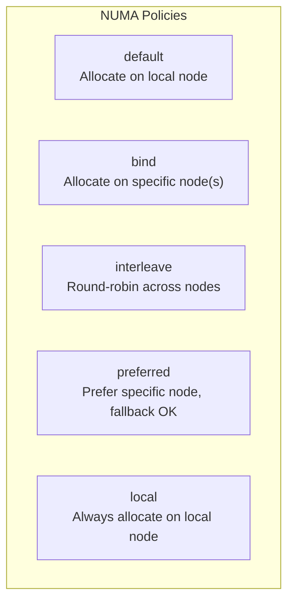

# NUMA Optimization

## Introduction

NUMA (Non-Uniform Memory Access) is a memory architecture used in multi-socket servers where each CPU has its own local memory. Accessing local memory is fast (~60-80ns), while accessing remote memory on another socket is significantly slower (~120-160ns). Proper NUMA optimization can yield 20-50% performance improvements for memory-intensive workloads.

## NUMA Architecture



## NUMA Topology Discovery

```bash
# Full NUMA information
numactl --hardware
# available: 2 nodes (0-1)
# node 0 cpus: 0 1 2 3 4 5 6 7 16 17 18 19 20 21 22 23
# node 0 size: 65536 MB
# node 0 free: 23456 MB
# node 1 cpus: 8 9 10 11 12 13 14 15 24 25 26 27 28 29 30 31
# node 1 size: 65536 MB
# node 1 free: 34567 MB
# node distances:
# node   0   1
#   0:  10  21
#   1:  21  10

# NUMA node for specific CPU
cat /sys/devices/system/node/node0/cpulist
# 0-7,16-23

# Per-node memory info
numastat
# node0           node1
# numa_hit        123456789    987654321
# numa_miss         1234567      2345678
# numa_foreign      2345678      1234567
# interleave_hit    1234567      1234567
# local_node      123456789    987654321
# other_node        1234567      2345678

# Per-process NUMA stats
numastat -p mysqld
# Per-node process memory usage (in MBs)
#                 Node 0   Node 1    Total
# --------------- ------   ------   ------
# 1234 (mysqld)   8234     1234     9468
# Total           8234     1234     9468
```

## numactl: Process NUMA Control

```bash
# Bind to NUMA node 0 (CPU and memory)
numactl --cpunodebind=0 --membind=0 ./myapp

# Bind to specific CPUs
numactl --physcpubind=0-7,16-23 ./myapp

# Interleave memory across all nodes (good for large allocations)
numactl --interleave=all ./myapp

# Prefer node 0 but allow fallback
numactl --preferred=0 ./myapp

# Check current NUMA policy
numactl --show
# policy: default
# prefer node: 0
# physcpubind: 0 1 2 3 4 5 6 7 16 17 18 19 20 21 22 23
# cpubind: 0
# nodebind: 0
# membind: 0 1

# NUMA with systemd service
# [Service]
# ExecStart=/usr/bin/numactl --interleave=all /usr/bin/mysqld
```

## numad: Automatic NUMA Balancing Daemon

```bash
# Install numad
apt install numad    # Debian/Ubuntu
yum install numad    # RHEL/CentOS

# Start numad
systemctl start numad

# numad automatically:
# - Monitors NUMA imbalance
# - Migrates memory pages between nodes
# - Adjusts process CPU affinity

# Manual numad advisory
numad -S 0
# Scans system and provides NUMA advisory

# numad configuration
cat /etc/numad.conf
# interval = 5
# numa_cores = 0-7,16-23
# exclude = /system.slice/mysql.service
```

## NUMA Memory Policies

### Policy Types



### Using set_mempolicy

```c
#include <numaif.h>
#include <numa.h>
#include <stdlib.h>

int main() {
    // Set memory policy to interleave
    unsigned long nodemask = 0x3;  // Nodes 0 and 1
    set_mempolicy(MPOL_INTERLEAVE, &nodemask, sizeof(nodemask)*8);

    // All subsequent allocations will be interleaved
    void *buf = malloc(1073741824);  // 1GB - interleaved across nodes

    // Or use libnuma
    numa_set_interleave_mask(numa_all_nodes_ptr);
    void *buf2 = malloc(1073741824);

    return 0;
}
```

### mbind for Specific Regions

```c
#include <numaif.h>
#include <sys/mman.h>

void *ptr = mmap(NULL, 1073741824, PROT_READ|PROT_WRITE,
                 MAP_PRIVATE|MAP_ANONYMOUS, -1, 0);

// Bind this specific memory region to node 0
unsigned long nodemask = 1UL << 0;
mbind(ptr, 1073741824, MPOL_BIND, &nodemask, sizeof(nodemask)*8, 0);

// Interleave this region
unsigned long all_nodes = 0x3;
mbind(ptr, 1073741824, MPOL_INTERLEAVE, &all_nodes, sizeof(all_nodes)*8, 0);
```

## Automatic NUMA Balancing

```bash
# Enable/disable kernel NUMA balancing
cat /proc/sys/kernel/numa_balancing
# 1

echo 0 > /proc/sys/kernel/numa_balancing  # Disable
echo 1 > /proc/sys/kernel/numa_balancing  # Enable

# NUMA balancing parameters
cat /proc/sys/kernel/numa_balancing_scan_delay_ms
# 1000
cat /proc/sys/kernel/numa_balancing_scan_period_min_ms
# 1000
cat /proc/sys/kernel/numa_balancing_scan_period_max_ms
# 60000
cat /proc/sys/kernel/numa_balancing_scan_size_mb
# 256

# Monitor NUMA migrations
perf stat -e migrate:mm_migrate_pages -- sleep 10
```

## NUMA Performance Counters

```bash
# NUMA memory access counters
perf stat -e node-loads,node-load-misses,node-stores,node-store-misses \
    -C 0 -- sleep 5
# Performance counter stats on CPU 0:
#     1,234,567,890  node-loads
#        56,789,012  node-load-misses     # 4.60% remote access
#       567,890,123  node-stores
#        23,456,789  node-store-misses    # 4.13% remote store

# Per-NUMA-node memory bandwidth
# Using Intel PCM (if available)
pcm-memory 1
# Socket 0 Read: 45.6 GB/s  Write: 23.4 GB/s
# Socket 1 Read: 34.5 GB/s  Write: 18.9 GB/s
```

## NUMA Optimization for Common Workloads

### Database (MySQL/PostgreSQL)

```bash
# Bind MySQL to NUMA node 0
numactl --cpunodebind=0 --membind=0 mysqld

# Or use interleaved for large buffer pools
numactl --interleave=all mysqld

# innodb_numa_interleave=1 in my.cnf
# innodb_buffer_pool_size = 48G
```

### Java Applications

```bash
# Use NUMA-aware garbage collector
java -XX:+UseNUMA -XX:+UseParallelGC -jar myapp.jar

# Or with numactl
numactl --interleave=all java -jar myapp.jar
```

### Virtual Machines (KVM/QEMU)

```bash
# Libvirt NUMA configuration
# <numatune>
#   <memory mode='strict' nodeset='0'/>
# </numatune>
# <cpu>
#   <numa>
#     <cell id='0' cpus='0-7' memory='8192000'/>
#   </numa>
# </cpu>

# QEMU NUMA
qemu-system-x86_64 \
    -numa node,cpus=0-7,memdev=mem0 \
    -object memory-backend-ram,size=8G,id=mem0
```

## NUMA Benchmarking

```bash
# Memory latency across NUMA nodes
# Using Intel MLC
mlc --latency_matrix
# Intel(R) Memory Latency Checker - v3.9
# Latency (ns) per each local NUMA node
# NUMA node     0       1
#    0        72.3   134.5
#    1       131.2    71.8
# ~1.8x slower for remote access

# Memory bandwidth across NUMA nodes
mlc --bandwidth_matrix
# Injected Bandwidth (MB/s) per each local NUMA node
# NUMA node     0       1
#    0       85432   45678
#    1       43210   84567
# ~50% lower bandwidth for remote access
```

## References

- [NUMA Deep Dive Series](https://frankdenneman.nl/2016/07/07/numa-deep-dive-part-1-uma-numa/)
- [numactl(8) man page](https://man7.org/linux/man-pages/man8/numactl.8.html)
- [Linux NUMA Documentation](https://www.kernel.org/doc/html/latest/vm/numa.html)

## Further Reading

- [The Linux Kernel Documentation](https://docs.kernel.org/)
- [LWN.net - Linux and free software news](https://lwn.net/)
- [GNU Project Documentation](https://www.gnu.org/doc/doc.html)
- [GNU Manuals](https://www.gnu.org/manual/manual.html)
- [Free Software Directory](https://directory.fsf.org/wiki/Main_Page)
- [Planet GNU](https://planet.gnu.org/)
- [Free Software Books](https://www.gnu.org/doc/other-free-books.html)

- <https://frankdenneman.nl/numa/> - NUMA deep dive series
- <https://www.intel.com/content/www/us/en/developer/articles/tool/intelr-memory-latency-checker.html> - Intel MLC
- <https://man7.org/linux/man-pages/man2/set_mempolicy.2.html> - set_mempolicy(2)

## Related Topics

- [CPU Performance](cpu.md)
- [Memory Performance](memory.md)
- [Kernel Tuning Parameters](kernel-params.md)
