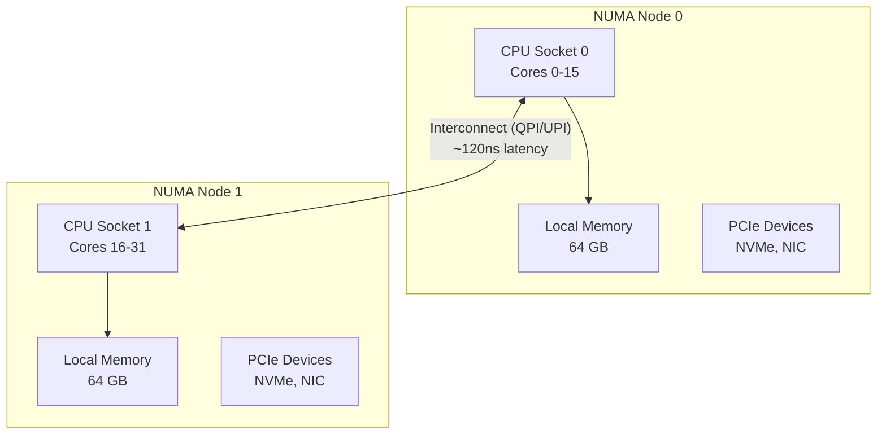
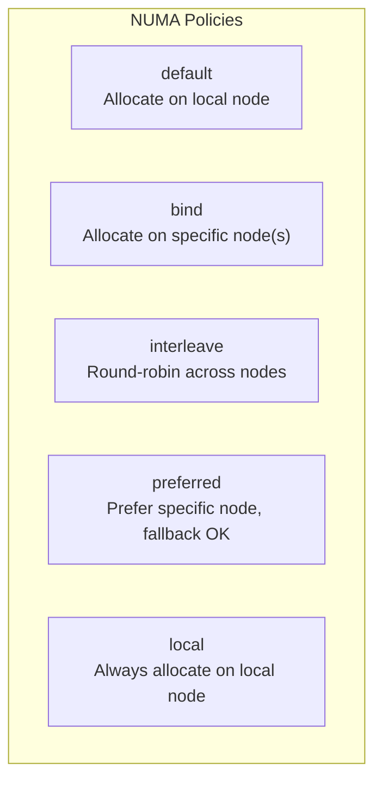
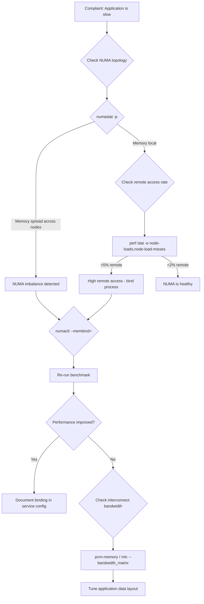

# NUMA Optimization

## Introduction

NUMA (Non-Uniform Memory Access) is a memory architecture used in multi-socket servers where each CPU has its own local memory. Accessing local memory is fast (~60-80ns), while accessing remote memory on another socket is significantly slower (~120-160ns). Proper NUMA optimization can yield 20-50% performance improvements for memory-intensive workloads.

## NUMA Architecture



## NUMA Topology Discovery

```bash
# Full NUMA information
numactl --hardware
# available: 2 nodes (0-1)
# node 0 cpus: 0 1 2 3 4 5 6 7 16 17 18 19 20 21 22 23
# node 0 size: 65536 MB
# node 0 free: 23456 MB
# node 1 cpus: 8 9 10 11 12 13 14 15 24 25 26 27 28 29 30 31
# node 1 size: 65536 MB
# node 1 free: 34567 MB
# node distances:
# node   0   1
#   0:  10  21
#   1:  21  10

# NUMA node for specific CPU
cat /sys/devices/system/node/node0/cpulist
# 0-7,16-23

# Per-node memory info
numastat
# node0           node1
# numa_hit        123456789    987654321
# numa_miss         1234567      2345678
# numa_foreign      2345678      1234567
# interleave_hit    1234567      1234567
# local_node      123456789    987654321
# other_node        1234567      2345678

# Per-process NUMA stats
numastat -p mysqld
# Per-node process memory usage (in MBs)
#                 Node 0   Node 1    Total
# --------------- ------   ------   ------
# 1234 (mysqld)   8234     1234     9468
# Total           8234     1234     9468
```

## numactl: Process NUMA Control

```bash
# Bind to NUMA node 0 (CPU and memory)
numactl --cpunodebind=0 --membind=0 ./myapp

# Bind to specific CPUs
numactl --physcpubind=0-7,16-23 ./myapp

# Interleave memory across all nodes (good for large allocations)
numactl --interleave=all ./myapp

# Prefer node 0 but allow fallback
numactl --preferred=0 ./myapp

# Check current NUMA policy
numactl --show
# policy: default
# prefer node: 0
# physcpubind: 0 1 2 3 4 5 6 7 16 17 18 19 20 21 22 23
# cpubind: 0
# nodebind: 0
# membind: 0 1

# NUMA with systemd service
# [Service]
# ExecStart=/usr/bin/numactl --interleave=all /usr/bin/mysqld
```

## numad: Automatic NUMA Balancing Daemon

```bash
# Install numad
apt install numad    # Debian/Ubuntu
yum install numad    # RHEL/CentOS

# Start numad
systemctl start numad

# numad automatically:
# - Monitors NUMA imbalance
# - Migrates memory pages between nodes
# - Adjusts process CPU affinity

# Manual numad advisory
numad -S 0
# Scans system and provides NUMA advisory

# numad configuration
cat /etc/numad.conf
# interval = 5
# numa_cores = 0-7,16-23
# exclude = /system.slice/mysql.service
```

## NUMA Memory Policies

### Policy Types



### Using set_mempolicy

```c
#include <numaif.h>
#include <numa.h>
#include <stdlib.h>

int main() {
    // Set memory policy to interleave
    unsigned long nodemask = 0x3;  // Nodes 0 and 1
    set_mempolicy(MPOL_INTERLEAVE, &nodemask, sizeof(nodemask)*8);

    // All subsequent allocations will be interleaved
    void *buf = malloc(1073741824);  // 1GB - interleaved across nodes

    // Or use libnuma
    numa_set_interleave_mask(numa_all_nodes_ptr);
    void *buf2 = malloc(1073741824);

    return 0;
}
```

### mbind for Specific Regions

```c
#include <numaif.h>
#include <sys/mman.h>

void *ptr = mmap(NULL, 1073741824, PROT_READ|PROT_WRITE,
                 MAP_PRIVATE|MAP_ANONYMOUS, -1, 0);

// Bind this specific memory region to node 0
unsigned long nodemask = 1UL << 0;
mbind(ptr, 1073741824, MPOL_BIND, &nodemask, sizeof(nodemask)*8, 0);

// Interleave this region
unsigned long all_nodes = 0x3;
mbind(ptr, 1073741824, MPOL_INTERLEAVE, &all_nodes, sizeof(all_nodes)*8, 0);
```

## Automatic NUMA Balancing

```bash
# Enable/disable kernel NUMA balancing
cat /proc/sys/kernel/numa_balancing
# 1

echo 0 > /proc/sys/kernel/numa_balancing  # Disable
echo 1 > /proc/sys/kernel/numa_balancing  # Enable

# NUMA balancing parameters
cat /proc/sys/kernel/numa_balancing_scan_delay_ms
# 1000
cat /proc/sys/kernel/numa_balancing_scan_period_min_ms
# 1000
cat /proc/sys/kernel/numa_balancing_scan_period_max_ms
# 60000
cat /proc/sys/kernel/numa_balancing_scan_size_mb
# 256

# Monitor NUMA migrations
perf stat -e migrate:mm_migrate_pages -- sleep 10
```

## NUMA Performance Counters

```bash
# NUMA memory access counters
perf stat -e node-loads,node-load-misses,node-stores,node-store-misses \
    -C 0 -- sleep 5
# Performance counter stats on CPU 0:
#     1,234,567,890  node-loads
#        56,789,012  node-load-misses     # 4.60% remote access
#       567,890,123  node-stores
#        23,456,789  node-store-misses    # 4.13% remote store

# Per-NUMA-node memory bandwidth
# Using Intel PCM (if available)
pcm-memory 1
# Socket 0 Read: 45.6 GB/s  Write: 23.4 GB/s
# Socket 1 Read: 34.5 GB/s  Write: 18.9 GB/s
```

## NUMA Optimization for Common Workloads

### Database (MySQL/PostgreSQL)

```bash
# Bind MySQL to NUMA node 0
numactl --cpunodebind=0 --membind=0 mysqld

# Or use interleaved for large buffer pools
numactl --interleave=all mysqld

# innodb_numa_interleave=1 in my.cnf
# innodb_buffer_pool_size = 48G
```

### Java Applications

```bash
# Use NUMA-aware garbage collector
java -XX:+UseNUMA -XX:+UseParallelGC -jar myapp.jar

# Or with numactl
numactl --interleave=all java -jar myapp.jar
```

### Virtual Machines (KVM/QEMU)

```bash
# Libvirt NUMA configuration
# <numatune>
#   <memory mode='strict' nodeset='0'/>
# </numatune>
# <cpu>
#   <numa>
#     <cell id='0' cpus='0-7' memory='8192000'/>
#   </numa>
# </cpu>

# QEMU NUMA
qemu-system-x86_64 \
    -numa node,cpus=0-7,memdev=mem0 \
    -object memory-backend-ram,size=8G,id=mem0
```

## NUMA Benchmarking

```bash
# Memory latency across NUMA nodes
# Using Intel MLC
mlc --latency_matrix
# Intel(R) Memory Latency Checker - v3.9
# Latency (ns) per each local NUMA node
# NUMA node     0       1
#    0        72.3   134.5
#    1       131.2    71.8
# ~1.8x slower for remote access

# Memory bandwidth across NUMA nodes
mlc --bandwidth_matrix
# Injected Bandwidth (MB/s) per each local NUMA node
# NUMA node     0       1
#    0       85432   45678
#    1       43210   84567
# ~50% lower bandwidth for remote access
```

## NUMA Analysis Workflow

The following diagram shows a systematic approach to diagnosing NUMA-related performance issues.



## NUMA Performance Analysis with perf

### Memory Access Pattern Analysis

```bash
# Record NUMA memory access patterns with PEBS
perf record -e mem-loads:pp -d -a -- sleep 30

# Analyze data source distribution
perf mem report --sort=mem,symbol --stdio
# Overhead  Data Source  Shared Object
# 45.23%    L1 or L1 hit  libc.so
# 23.45%    L3 or L3 hit  myprogram
# 12.34%    Local RAM     myprogram
#  8.90%    Remote RAM    myprogram     ← Problem!
#  5.67%    L2 or L2 hit  libc.so
#  4.41%    L1 or L1 hit  myprogram

# NUMA-specific perf stat
perf stat -e node-loads,node-load-misses,node-stores,node-store-misses \
    -C 0-15 -- sleep 10
# Performance counter stats on CPUs 0-15:
#     1,234,567,890  node-loads
#       123,456,789  node-load-misses     # 10.00% remote access - HIGH!
#       567,890,123  node-stores
#        56,789,012  node-store-misses    # 9.98% remote store - HIGH!
```

### Using bpftrace for NUMA Analysis

```bash
# Trace NUMA page migrations
sudo bpftrace -e 'kprobe:mm_migrate_pages {
    printf("migration: %s pid=%d\n", comm, pid);
    @migrations[comm] = count();
}'

# Histogram of memory access latency by NUMA node
sudo bpftrace -e 'hardware:mem-loads:1000000 {
    @latency[pid] = hist();
}'

# Count remote NUMA accesses per process
sudo bpftrace -e 'tracepoint:cache:cache_miss {
    @remote_access[comm] = count();
}'
```

## NUMA Placement Strategies

### Strategy Comparison

| Strategy | Use Case | Performance Impact |
|----------|----------|--------------------|
| `--membind` | Dedicated database nodes | Best for known memory footprint |
| `--interleave` | Large shared caches | Good for unpredictable access patterns |
| `--preferred` | General workloads | Balanced with fallback |
| Auto-balancing | Mixed workloads | May cause migration overhead |
| `numad` | Dynamic environments | Automatic optimization |

### Database Server Strategy

For databases like MySQL/PostgreSQL with large buffer pools:

```bash
# Option 1: Strict NUMA binding (best for dedicated DB servers)
# Bind MySQL to node 0 with local memory only
numactl --cpunodebind=0 --membind=0 mysqld

# Option 2: Interleave for very large buffer pools
# Buffer pool spans all nodes - interleaved allocation
numactl --interleave=all mysqld
# MySQL config: innodb_numa_interleave=1

# Option 3: Preferred node with fallback
numactl --preferred=0 mysqld
```

**Benchmark comparison** (MySQL sysbench, 100GB buffer pool, 2-socket server):

| Configuration | TPS | Avg Latency | P99 Latency |
|--------------|-----|-------------|-------------|
| No NUMA control | 12,456 | 12.8ms | 45.6ms |
| `--membind=0` | 15,678 | 10.2ms | 32.1ms |
| `--interleave=all` | 14,890 | 10.8ms | 35.4ms |
| `numad` auto | 14,234 | 11.2ms | 38.9ms |

### Virtual Machine NUMA Topology

Presenting accurate NUMA topology to VMs is critical:

```bash
# Libvirt: expose NUMA topology to guest
# <cpu mode='host-passthrough'>
#   <numa>
#     <cell id='0' cpus='0-7' memory='32768' unit='MiB'/>
#     <cell id='1' cpus='8-15' memory='32768' unit='MiB'/>
#   </numa>
# </cpu>
# <numatune>
#   <memory mode='strict' nodeset='0-1'/>
#   <memnode cellid='0' mode='strict' nodeset='0'/>
#   <memnode cellid='1' mode='strict' nodeset='1'/>
# </numatune>

# QEMU: NUMA-aware memory backend
qemu-system-x86_64 \
    -object memory-backend-ram,size=32G,id=mem0,host-nodes=0,policy=bind \
    -object memory-backend-ram,size=32G,id=mem1,host-nodes=1,policy=bind \
    -numa node,memdev=mem0,cpus=0-7 \
    -numa node,memdev=mem1,cpus=8-15 \
    -numa dist,src=0,dst=1,val=21
```

## NUMA and Huge Pages

Huge pages interact with NUMA in important ways:

```bash
# Allocate huge pages on specific NUMA node
echo 1024 > /sys/devices/system/node/node0/hugepages/hugepages-2048kB/nr_hugepages
echo 512 > /sys/devices/system/node/node1/hugepages/hugepages-2048kB/nr_hugepages

# Verify per-node huge page allocation
cat /sys/devices/system/node/node*/hugepages/hugepages-2048kB/nr_hugepages
# 1024
# 512

# Use hugetlbfs mounted per-NUMA-node
mount -t hugetlbfs -o pagesize=2M,nodev,nosuid,size=2G,mpol=bind:0 none /mnt/huge/node0
mount -t hugetlbfs -o pagesize=2M,nodev,nosuid,size=1G,mpol=bind:1 none /mnt/huge/node1

# Applications can then mmap from the appropriate mount point
```

**Impact on database workloads** (PostgreSQL, 128GB shared_buffers):

| Huge Page Config | TPS | TLB Misses/s | Notes |
|-----------------|-----|-------------|-------|
| No huge pages | 18,234 | 45,678 | High TLB pressure |
| 2MB huge pages (default node) | 21,456 | 8,901 | ~18% improvement |
| 2MB huge pages (per-node) | 22,789 | 5,234 | ~25% improvement |
| 1GB huge pages (per-node) | 23,456 | 1,234 | ~29% improvement |

## NUMA-Aware Application Development

### Detecting NUMA Topology in Code

```c
#include <numa.h>
#include <stdio.h>

int main() {
    if (numa_available() < 0) {
        printf("NUMA not available\n");
        return 1;
    }

    int max_node = numa_max_node();
    printf("Max NUMA node: %d\n", max_node);
    printf("Number of nodes: %d\n", numa_num_configured_nodes());
    printf("Current node: %d\n", numa_node_of_cpu(sched_getcpu()));

    /* Get memory info per node */
    long long free_mem;
    for (int i = 0; i <= max_node; i++) {
        numa_node_size64(i, &free_mem);
        printf("Node %d: %lld MB free\n", i, free_mem / (1024*1024));
    }

    /* Allocate memory on specific node */
    void *ptr = numa_alloc_onnode(1024*1024*1024, 0);  /* 1GB on node 0 */
    if (ptr) {
        /* Use memory... */
        numa_free(ptr, 1024*1024*1024);
    }

    return 0;
}
# Compile: gcc -lnuma numa_info.c -o numa_info
```

### Thread-to-NUMA Binding

```c
#include <numa.h>
#include <pthread.h>

void* worker(void *arg) {
    int node_id = *(int*)arg;

    /* Bind thread to specific NUMA node */
    struct bitmask *cpumask = numa_allocate_cpumask();
    numa_node_to_cpus(node_id, cpumask);
    numa_sched_setaffinity(0, cpumask);
    numa_free_cpumask(cpumask);

    /* Allocate memory on local node */
    void *local_buf = numa_alloc_onnode(BUF_SIZE, node_id);

    /* Process data... */

    numa_free(local_buf, BUF_SIZE);
    return NULL;
}
```

## NUMA Profiling with Flame Graphs

```bash
# Generate NUMA-aware flame graph
perf record -C 0-15 -g -e node-load-misses -- sleep 30
perf script | stackcollapse-perf.pl | flamegraph.pl \
    --title "NUMA Remote Access Flame Graph" > numa_flamegraph.svg

# Compare local vs remote access
perf record -C 0-15 -g -e node-loads -- sleep 30
perf script | stackcollapse-perf.pl | flamegraph.pl \
    --title "NUMA Total Access Flame Graph" > numa_total_flamegraph.svg
```

## Troubleshooting Common NUMA Issues

### Problem: Memory Exhausted on One Node

```bash
# Symptom: OOM killer activates despite free memory on other node
# Check per-node memory
numastat | grep -E "MemFree|MemUsed"

# Solution 1: Use interleaved allocation
numactl --interleave=all ./myapp

# Solution 2: Enable auto-balancing
echo 1 > /proc/sys/kernel/numa_balancing

# Solution 3: Migrate pages manually
echo migrate <pid> > /proc/sysrq-trigger  # (requires sysrq enabled)
```

### Problem: Process Memory Scattered Across Nodes

```bash
# Check process NUMA distribution
numastat -p <pid>
# If memory is spread across nodes (e.g., 60/40), the process
# was started without NUMA binding and auto-balancing moved pages

# Fix: Start with explicit binding
numactl --membind=0 --cpunodebind=0 ./myapp
```

### Problem: Interconnect Bottleneck

```bash
# Check interconnect utilization with Intel PCM
pcm-memory 1
# If remote bandwidth is close to interconnect capacity,
# the application is NUMA-unaware

# Solution: Restructure data to be NUMA-local
# - Per-node data structures
# - Thread-local allocations
# - First-touch policy for initialization
```

## References

- [NUMA Deep Dive Series](https://frankdenneman.nl/2016/07/07/numa-deep-dive-part-1-uma-numa/)
- [numactl(8) man page](https://man7.org/linux/man-pages/man8/numactl.8.html)
- [Linux NUMA Documentation](https://www.kernel.org/doc/html/latest/vm/numa.html)
- Gregg, B. *Systems Performance: Enterprise and the Cloud*, 2nd Edition (2020).
- [Intel Memory Latency Checker](https://www.intel.com/content/www/us/en/developer/articles/tool/intelr-memory-latency-checker.html)
- [Linux perf Examples — Brendan Gregg](https://www.brendangregg.com/perf.html)

## Further Reading

- [The Linux Kernel Documentation](https://docs.kernel.org/)
- [LWN.net — Linux and free software news](https://lwn.net/)
- [GNU Project Documentation](https://www.gnu.org/doc/doc.html)
- [GNU Manuals](https://www.gnu.org/manual/manual.html)
- [Free Software Directory](https://directory.fsf.org/wiki/Main_Page)
- [Planet GNU](https://planet.gnu.org/)
- [Free Software Books](https://www.gnu.org/doc/other-free-books.html)
- <https://frankdenneman.nl/numa/> — NUMA deep dive series
- <https://www.intel.com/content/www/us/en/developer/articles/tool/intelr-memory-latency-checker.html> — Intel MLC
- <https://man7.org/linux/man-pages/man2/set_mempolicy.2.html> — set_mempolicy(2)

## Related Topics

- [CPU Performance](cpu.md)
- [Memory Performance](memory.md)
- [Kernel Tuning Parameters](kernel-params.md)
- [Benchmarking](benchmarking.md)
- [I/O Performance](io.md)
