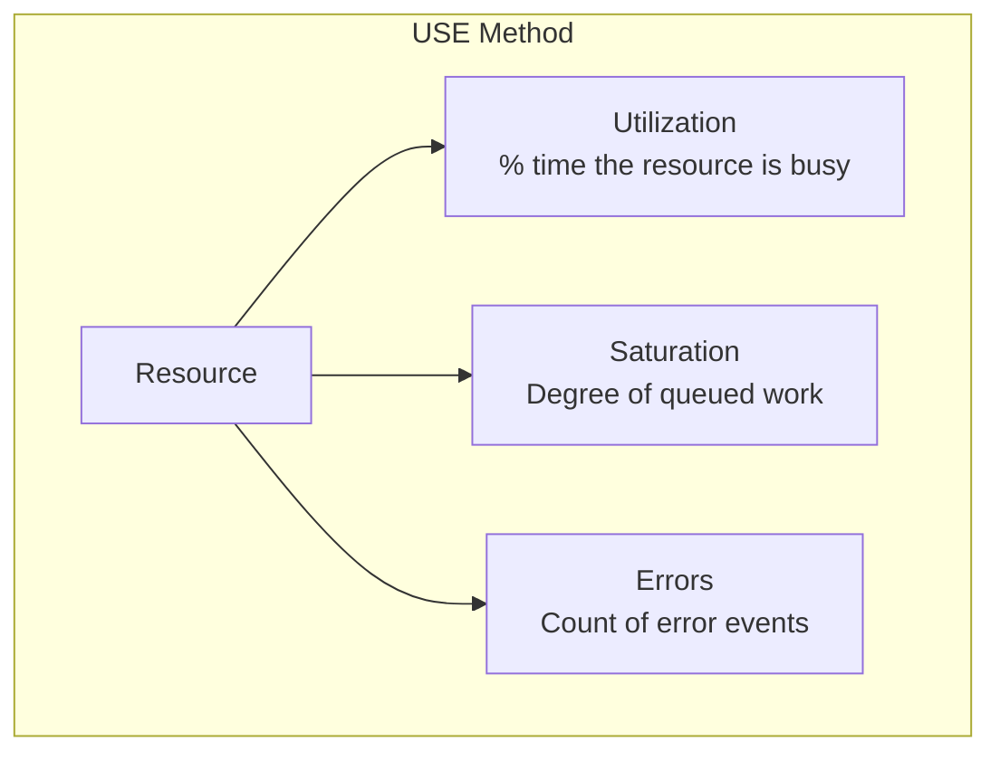
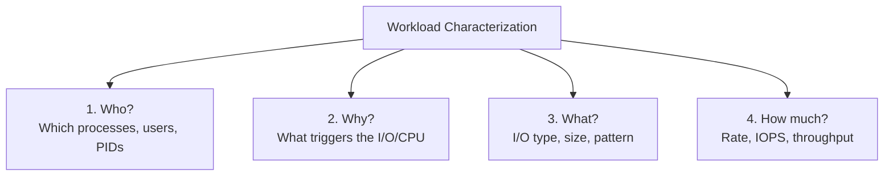
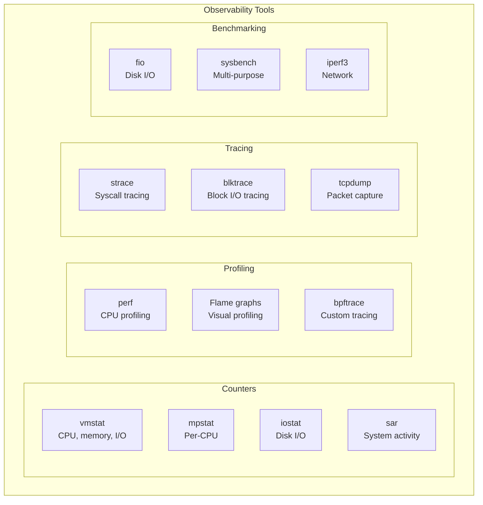

# Performance Overview

## Introduction

Performance analysis in Linux is both an art and a science. It requires a systematic methodology, the right tools, and a deep understanding of how hardware and software interact. This chapter provides the foundational framework for Linux performance analysis: the USE method, workload characterization, and an overview of the tools available.

Performance problems are rarely where you think they are. Without a methodology, you'll waste hours chasing symptoms while the root cause sits elsewhere. The approaches described here are battle-tested by performance engineers at scale.

## The USE Method

Brendan Gregg's **USE method** (Utilization, Saturation, Errors) provides a systematic checklist for identifying resource bottlenecks:



### USE Checklist

| Resource | Utilization | Saturation | Errors |
|----------|-------------|------------|--------|
| **CPU** | `mpstat -P ALL 1` | `vmstat 1` (r column) | `perf stat` |
| **Memory** | `free -m` | `vmstat 1` (si/so) | `dmesg` (OOM) |
| **Network** | `sar -n DEV 1` | `netstat -s` (overflows) | `ip -s link` |
| **Disk I/O** | `iostat -xz 1` | `iostat -xz 1` (avgqu-sz) | `smartctl` |
| **Filesystem** | `df -h` | N/A (covered by disk) | `dmesg` |

### CPU Example

```bash
# Utilization: CPU busy percentage
mpstat -P ALL 1
# CPU    %usr   %nice   %sys   %iowait   %irq   %soft   %steal   %idle
# all    25.00    0.00   5.00      2.00   0.50    0.25     0.00   67.25
#   0    30.00    0.00   6.00      1.00   0.00    0.00     0.00   63.00
#   1    20.00    0.00   4.00      3.00   1.00    0.50     0.00   71.50

# Saturation: run queue length
vmstat 1 5
# procs -----------memory---------- ---swap-- -----io---- -system-- ------cpu-----
#  r  b   swpd   free   buff  cache   si   so    bi    bo   in   cs us sy id wa st
#  3  0      0 123456  65432 987654    0    0     0     0  500 1000 25  5 67  2  0
#  5  0      0 123456  65432 987654    0    0     0     0  600 1200 30  6 60  3  0
#  8  0      0 123456  65432 987654    0    0     0     0  700 1400 35  7 55  2  0
# r=8 > 2*CPUs(4) → CPU saturation!

# Errors
perf stat -e cpu-cycles,instructions,cache-misses,branch-misses -- sleep 5
#  Performance counter stats for 'sleep 5':
#      12,345,678,901      cpu-cycles
#      10,234,567,890      instructions     # 0.83 insn per cycle
#          12,345,678      cache-misses     # 0.10% of all cache refs
#           2,345,678      branch-misses    # 0.02% of all branches
```

### Memory Example

```bash
# Utilization
free -m
#               total        used        free      shared  buff/cache   available
# Mem:          32000       12000        2000         500       18000       19500
# Swap:          8000           0        8000

# Saturation: swap activity
vmstat 1 5
# si=0, so=0 → no swap activity (good)

# Errors: OOM kills
dmesg | grep -i oom
# [12345.678901] Out of memory: Kill process 1234 (java) score 850 or sacrifice child
```

## Workload Characterization

Before optimizing, you must understand the workload. Characterize it using these four questions:



### Who: Top Processes

```bash
# CPU consumers
top -bn1 -o %CPU | head -20
#   PID USER      PR  NI    VIRT    RES    SHR S  %CPU  %MEM     TIME+ COMMAND
#  1234 mysql     20   0  12.5g   8.2g   1.2g S  85.0  25.6   1234:56 mysqld
#  5678 www-data  20   0   2.1g   1.5g   200m S  25.0   4.7    456:12  apache2

# Memory consumers
ps aux --sort=-%mem | head -20

# I/O consumers
iotop -oP -b -n 1 | head -20
# Total DISK READ:  123.45 M/s | Total DISK WRITE: 67.89 M/s
#   PID  PRIO  USER     DISK READ  DISK WRITE  SWAPIN    IO>    COMMAND
#  1234  be/4  mysql    100.00 M/s    0.00 B/s  0.00 %  99.99 % mysqld
```

### What: I/O Pattern

```bash
# I/O sizes and patterns
# Using blktrace to analyze I/O size distribution
blktrace -d /dev/sda -o - | blkparse -i - -f '%S + %n [%C]\n' | head -100
# 12345678 + 8 [dd]
# 12345686 + 8 [dd]
# 12345694 + 8 [dd]

# Using bpftrace
bpftrace -e '
tracepoint:block:block_rq_issue {
    @io_size = hist(args->bytes / 1024);
}'
# @io_size:
# [1]          1234 |@@@@@@@@@@@@@@@@@@@@@@@@@@@@@@@@@@@@@@@@|
# [2, 4)          0 |
# [4, 8)         12 |
# [8, 16)       567 |@@@@@
# [16, 32)     2345 |@@@@@@@@@@@@@@@@@@@
# [32, 64)      890 |@@@@@@@@
# [64, 128)      12 |
```

### How Much: Rates

```bash
# IOPS and throughput
iostat -xz 1 5
# Device  r/s     w/s     rkB/s    wkB/s   rrqm/s  wrqm/s  await  svctm  %util
# sda     1234.00 567.00  45678.00 23456.00  12.00    34.00   5.23   0.54   98.00
# nvme0n1 5678.00 2345.00 123456.0 98765.00   0.00     0.00   1.23   0.12   95.00

# Network throughput
sar -n DEV 1 5
# IFACE   rxpck/s   txpck/s    rxkB/s    txkB/s
# eth0    123456.00 234567.00  1234.56   2345.67
```

## Linux Performance Tools

### The 60-Second Checklist

Brendan Gregg's 60-second performance checklist:

```bash
# 1. System overview
uptime
# 10:00:00 up 42 days, 3:21,  2 users,  load average: 5.67, 4.32, 3.21

dmesg -T | tail -20
# Check for hardware errors, OOM kills, etc.

# 2. CPU
mpstat -P ALL 1 5
# Per-CPU utilization

# 3. Memory
vmstat 1 5
# Memory, swap, I/O, CPU summary

# 4. Disk I/O
iostat -xz 1 5
# Per-disk I/O statistics

# 5. Network
sar -n DEV 1 5
# Network interface throughput

# 6. Processes
pidstat 1 5
# Per-process CPU usage

# 7. Detailed
perf top
# Hot functions in real-time
```

### Tool Categories



### Counter-Based Tools

These read kernel counters with minimal overhead:

```bash
# vmstat: virtual memory statistics
vmstat -w 1
# procs -----------------------memory---------------------- ---swap-- -----io---- -system-- --------cpu--------
#   r   b         swpd         free         buff            cache   si   so       bi    bo   in   cs  us  sy  id  wa  st
#   4   0            0       234567        65432          987654    0    0        0     0  500 1000  25   5  67   2   0

# mpstat: multiprocessor statistics
mpstat -A 1 5
# CPU    %usr   %nice   %sys   %iowait   %irq   %soft   %steal   %guest   %idle
# all    25.00    0.00   5.00      2.00   0.50    0.25     0.00     0.00   67.25

# sar: system activity reporter
sar -u 1 5           # CPU
sar -r 1 5           # Memory
sar -b 1 5           # I/O
sar -n DEV 1 5       # Network
```

### Profiling Tools

```bash
# perf: Linux profiling
perf stat -a sleep 5
# Performance counter stats for 'system wide':
#      61,728,394,451      cpu-cycles
#      51,174,234,567      instructions     # 0.83 insn per cycle
#         123,456,789      cache-misses
#          23,456,789      branch-misses

# perf record and report
perf record -a -g sleep 10
perf report --stdio | head -30
# Overhead  Command      Shared Object      Symbol
#   12.34%  mysqld       mysqld             [.] row_search_mvcc
#    8.90%  mysqld       mysqld             [.] buf_page_get_gen
#    5.67%  kswapd0      [kernel]           [.] shrink_page_list
```

### Flame Graphs

```bash
# Generate flame graph
perf record -F 99 -a -g -- sleep 30
perf script | stackcollapse-perf.pl | flamegraph.pl > flamegraph.svg

# Or with bpftrace
bpftrace -e 'profile:hz:99 { @[kstack] = count(); }' | \
    stackcollapse-bpftrace.pl | flamegraph.pl > flamegraph.svg
```

## Performance Anti-Patterns

### Common Mistakes


### Better Approach

```bash
# 1. Measure first (USE method)
# 2. Characterize the workload
# 3. Identify the bottleneck (not the symptom)
# 4. Make one change at a time
# 5. Measure again to verify improvement
# 6. Document the change and its impact
```

## Performance Methodology

### Scientific Method


### Quantifying Gains

Always express performance improvements in terms the business cares about:

```bash
# Bad: "Reduced CPU usage by 15%"
# Good: "Reduced p99 latency from 500ms to 120ms, increasing throughput from 10K to 25K req/s"

# Key metrics:
# - Throughput (req/s, IOPS, MB/s)
# - Latency (p50, p95, p99, p999)
# - Resource utilization (CPU%, memory, I/O)
# - Error rate
# - Saturation (queue depth, wait time)
```

## References

- Gregg, B. *Systems Performance: Enterprise and the Cloud*, 2nd Edition. Addison-Wesley.
- Gregg, B. *BPF Performance Tools*. Addison-Wesley.
- [Linux Performance](https://www.brendangregg.com/linuxperf.html)
- [USE Method](https://www.brendangregg.com/usemethod.html)

## Further Reading

- [The Linux Kernel Documentation](https://docs.kernel.org/)
- [GNU Project Documentation](https://www.gnu.org/doc/doc.html)
- [GNU Manuals](https://www.gnu.org/manual/manual.html)
- [Free Software Directory](https://directory.fsf.org/wiki/Main_Page)
- [Planet GNU](https://planet.gnu.org/)
- [Free Software Books](https://www.gnu.org/doc/other-free-books.html)

- <https://www.brendangregg.com/perf.html> - Linux performance tools
- <https://www.brendangregg.com/FlameGraphs/cpuflamegraphs.html> - Flame graphs
- <https://lwn.net/Articles/608497/> - Performance analysis methodology
- <https://netflixtechblog.com/linux-performance-analysis-in-60-instants-11c2c2f3a27f> - Netflix 60-second checklist

## Related Topics

- [CPU Performance](cpu.md)
- [Memory Performance](memory.md)
- [I/O Performance](io.md)
- [Network Performance](network.md)
- [Benchmarking](benchmarking.md)
