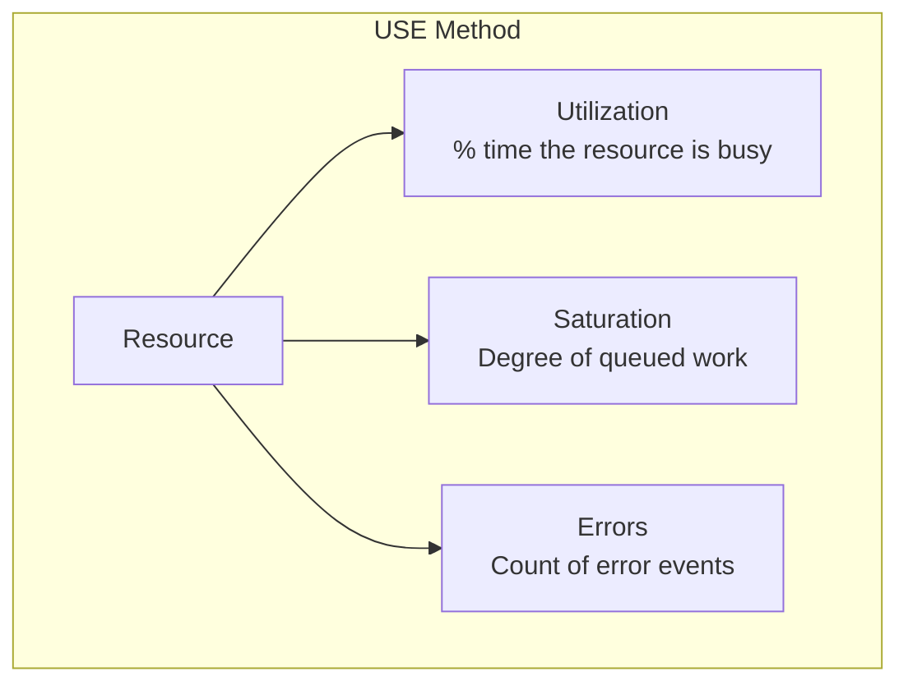
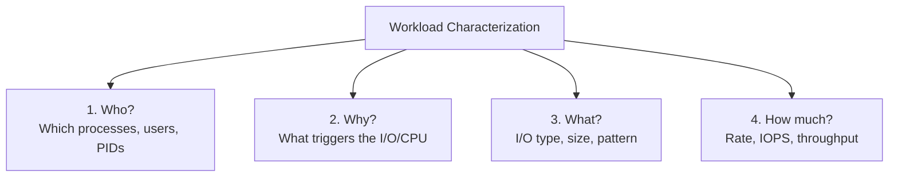
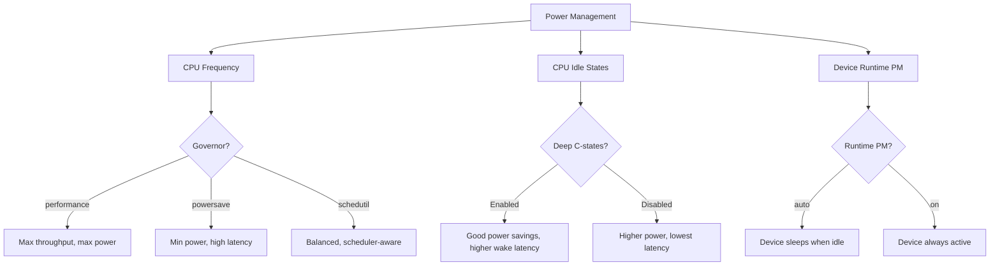
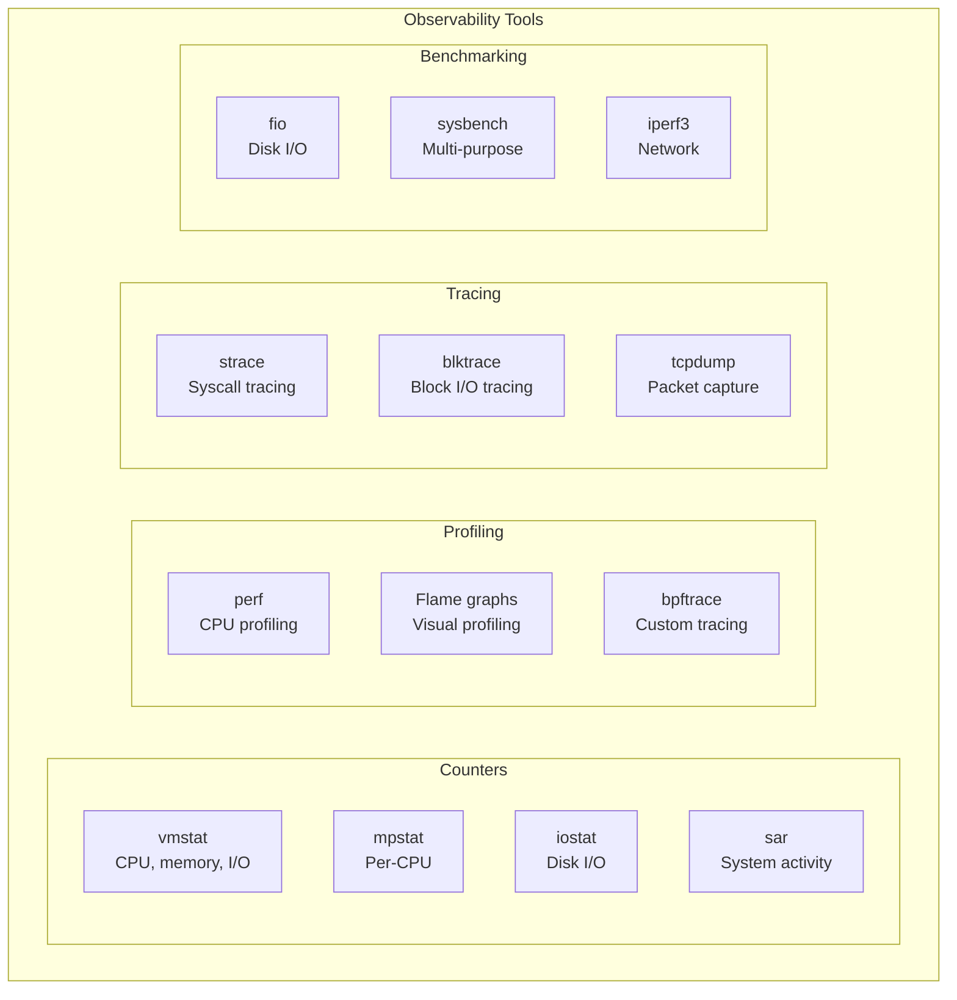

# Performance Overview

## Introduction

Performance analysis in Linux is both an art and a science. It requires a systematic methodology, the right tools, and a deep understanding of how hardware and software interact. This chapter provides the foundational framework for Linux performance analysis: the USE method, workload characterization, and an overview of the tools available.

Performance problems are rarely where you think they are. Without a methodology, you'll waste hours chasing symptoms while the root cause sits elsewhere. The approaches described here are battle-tested by performance engineers at scale.

## The USE Method

Brendan Gregg's **USE method** (Utilization, Saturation, Errors) provides a systematic checklist for identifying resource bottlenecks:



### USE Checklist

| Resource | Utilization | Saturation | Errors |
|----------|-------------|------------|--------|
| **CPU** | `mpstat -P ALL 1` | `vmstat 1` (r column) | `perf stat` |
| **Memory** | `free -m` | `vmstat 1` (si/so) | `dmesg` (OOM) |
| **Network** | `sar -n DEV 1` | `netstat -s` (overflows) | `ip -s link` |
| **Disk I/O** | `iostat -xz 1` | `iostat -xz 1` (avgqu-sz) | `smartctl` |
| **Filesystem** | `df -h` | N/A (covered by disk) | `dmesg` |

### CPU Example

```bash
# Utilization: CPU busy percentage
mpstat -P ALL 1
# CPU    %usr   %nice   %sys   %iowait   %irq   %soft   %steal   %idle
# all    25.00    0.00   5.00      2.00   0.50    0.25     0.00   67.25
#   0    30.00    0.00   6.00      1.00   0.00    0.00     0.00   63.00
#   1    20.00    0.00   4.00      3.00   1.00    0.50     0.00   71.50

# Saturation: run queue length
vmstat 1 5
# procs -----------memory---------- ---swap-- -----io---- -system-- ------cpu-----
#  r  b   swpd   free   buff  cache   si   so    bi    bo   in   cs us sy id wa st
#  3  0      0 123456  65432 987654    0    0     0     0  500 1000 25  5 67  2  0
#  5  0      0 123456  65432 987654    0    0     0     0  600 1200 30  6 60  3  0
#  8  0      0 123456  65432 987654    0    0     0     0  700 1400 35  7 55  2  0
# r=8 > 2*CPUs(4) → CPU saturation!

# Errors
perf stat -e cpu-cycles,instructions,cache-misses,branch-misses -- sleep 5
#  Performance counter stats for 'sleep 5':
#      12,345,678,901      cpu-cycles
#      10,234,567,890      instructions     # 0.83 insn per cycle
#          12,345,678      cache-misses     # 0.10% of all cache refs
#           2,345,678      branch-misses    # 0.02% of all branches
```

### Memory Example

```bash
# Utilization
free -m
#               total        used        free      shared  buff/cache   available
# Mem:          32000       12000        2000         500       18000       19500
# Swap:          8000           0        8000

# Saturation: swap activity
vmstat 1 5
# si=0, so=0 → no swap activity (good)

# Errors: OOM kills
dmesg | grep -i oom
# [12345.678901] Out of memory: Kill process 1234 (java) score 850 or sacrifice child
```

## Workload Characterization

Before optimizing, you must understand the workload. Characterize it using these four questions:



### Who: Top Processes

```bash
# CPU consumers
top -bn1 -o %CPU | head -20
#   PID USER      PR  NI    VIRT    RES    SHR S  %CPU  %MEM     TIME+ COMMAND
#  1234 mysql     20   0  12.5g   8.2g   1.2g S  85.0  25.6   1234:56 mysqld
#  5678 www-data  20   0   2.1g   1.5g   200m S  25.0   4.7    456:12  apache2

# Memory consumers
ps aux --sort=-%mem | head -20

# I/O consumers
iotop -oP -b -n 1 | head -20
# Total DISK READ:  123.45 M/s | Total DISK WRITE: 67.89 M/s
#   PID  PRIO  USER     DISK READ  DISK WRITE  SWAPIN    IO>    COMMAND
#  1234  be/4  mysql    100.00 M/s    0.00 B/s  0.00 %  99.99 % mysqld
```

### What: I/O Pattern

```bash
# I/O sizes and patterns
# Using blktrace to analyze I/O size distribution
blktrace -d /dev/sda -o - | blkparse -i - -f '%S + %n [%C]\n' | head -100
# 12345678 + 8 [dd]
# 12345686 + 8 [dd]
# 12345694 + 8 [dd]

# Using bpftrace
bpftrace -e '
tracepoint:block:block_rq_issue {
    @io_size = hist(args->bytes / 1024);
}'
# @io_size:
# [1]          1234 |@@@@@@@@@@@@@@@@@@@@@@@@@@@@@@@@@@@@@@@@|
# [2, 4)          0 |
# [4, 8)         12 |
# [8, 16)       567 |@@@@@
# [16, 32)     2345 |@@@@@@@@@@@@@@@@@@@
# [32, 64)      890 |@@@@@@@@
# [64, 128)      12 |
```

### How Much: Rates

```bash
# IOPS and throughput
iostat -xz 1 5
# Device  r/s     w/s     rkB/s    wkB/s   rrqm/s  wrqm/s  await  svctm  %util
# sda     1234.00 567.00  45678.00 23456.00  12.00    34.00   5.23   0.54   98.00
# nvme0n1 5678.00 2345.00 123456.0 98765.00   0.00     0.00   1.23   0.12   95.00

# Network throughput
sar -n DEV 1 5
# IFACE   rxpck/s   txpck/s    rxkB/s    txkB/s
# eth0    123456.00 234567.00  1234.56   2345.67
```

## Linux Performance Tools

### Power Management and Performance

From `docs.kernel.org/power/index.html`, the Linux kernel includes a comprehensive power management subsystem that directly impacts performance:

#### CPU Frequency Scaling (cpufreq)

The kernel can dynamically adjust CPU frequency to balance performance and power consumption:

```bash
# Check current governor
cat /sys/devices/system/cpu/cpu0/cpufreq/scaling_governor
# powersave | performance | schedutil | ondemand | conservative

# Set performance governor (max frequency always)
echo performance | sudo tee /sys/devices/system/cpu/cpu*/cpufreq/scaling_governor

# Set schedutil governor (scheduler-driven, recommended)
echo schedutil | sudo tee /sys/devices/system/cpu/cpu*/cpufreq/scaling_governor

# Check current frequency
cat /sys/devices/system/cpu/cpu0/cpufreq/scaling_cur_freq

# Check available frequencies
cat /sys/devices/system/cpu/cpu0/cpufreq/scaling_available_frequencies
```

| Governor | Behavior | Best For |
|----------|----------|----------|
| `performance` | Always max frequency | Latency-sensitive workloads |
| `powersave` | Always min frequency | Battery life |
| `schedutil` | Frequency based on scheduler utilization | General use (default) |
| `ondemand` | Frequency based on CPU idle time | Legacy systems |
| `conservative` | Gradual frequency changes | Smooth scaling |

#### CPU Idle States (cpuidle)

Modern CPUs support multiple idle states (C-states) with different power/resume-latency tradeoffs:

```bash
# Check available idle states
cat /sys/devices/system/cpu/cpu0/cpuidle/state0/name
# POLL | C1 | C6 | C10

# Disable deep idle states (for ultra-low latency)
echo 1 > /sys/devices/system/cpu/cpu0/cpuidle/state3/disable  # Disable C10
```

| C-State | Description | Wake Latency | Power Savings |
|---------|-------------|-------------|---------------|
| POLL | Busy-wait (no idle) | 0 µs | None |
| C1 | Halt | ~1 µs | Low |
| C6 | Deep sleep | ~100 µs | High |
| C10 | Deepest sleep | ~1 ms | Maximum |

For latency-sensitive workloads (trading, HFT), disabling deep C-states can reduce tail latency significantly.

#### Suspend and Hibernation

The kernel supports system-wide power states:

```bash
# Suspend to RAM (S3)
systemctl suspend

# Hibernate (S4)
systemctl hibernate

# Hybrid sleep (suspend + hibernate backup)
systemctl hybrid-sleep

# Debug suspend issues
# Add to kernel cmdline: no_console_suspend initcall_debug
```

#### Runtime PM for Devices

Individual devices support runtime power management:

```bash
# Check device runtime PM status
cat /sys/bus/pci/devices/0000:00:1f.2/power/runtime_status
# active | suspended | suspending | resuming

# Enable runtime PM for a device
echo auto > /sys/bus/pci/devices/0000:00:1f.2/power/control

# Disable runtime PM (always active)
echo on > /sys/bus/pci/devices/0000:00:1f.2/power/control
```

#### Energy Model

The kernel's Energy Model (EM) framework provides power cost information for scheduling decisions. The scheduler uses EM data to make energy-aware task placement decisions (EAS — Energy Aware Scheduling):

```bash
# View energy model for CPU domains
cat /sys/devices/system/cpu/cpu0/cpufreq/energy_model/*/frequency
```

#### PM QoS (Quality of Service)

Kernel subsystems and userspace can request PM QoS constraints:

```bash
# CPU latency constraint (prevent deep C-states)
echo 100 > /dev/cpu_dma_latency  # Max 100µs resume latency

# View current PM QoS constraints
cat /sys/devices/system/cpu/cpu0/cpuidle/latency
```

#### Performance Impact of Power Management



For performance-critical workloads:
1. Set `performance` governor or pin frequencies
2. Disable deep C-states if tail latency matters
3. Set `/dev/cpu_dma_latency` to prevent deep idle
4. Disable runtime PM for critical I/O devices

---

### The 60-Second Checklist

Brendan Gregg's 60-second performance checklist:

```bash
# 1. System overview
uptime
# 10:00:00 up 42 days, 3:21,  2 users,  load average: 5.67, 4.32, 3.21

dmesg -T | tail -20
# Check for hardware errors, OOM kills, etc.

# 2. CPU
mpstat -P ALL 1 5
# Per-CPU utilization

# 3. Memory
vmstat 1 5
# Memory, swap, I/O, CPU summary

# 4. Disk I/O
iostat -xz 1 5
# Per-disk I/O statistics

# 5. Network
sar -n DEV 1 5
# Network interface throughput

# 6. Processes
pidstat 1 5
# Per-process CPU usage

# 7. Detailed
perf top
# Hot functions in real-time
```

### Tool Categories



### Counter-Based Tools

These read kernel counters with minimal overhead:

```bash
# vmstat: virtual memory statistics
vmstat -w 1
# procs -----------------------memory---------------------- ---swap-- -----io---- -system-- --------cpu--------
#   r   b         swpd         free         buff            cache   si   so       bi    bo   in   cs  us  sy  id  wa  st
#   4   0            0       234567        65432          987654    0    0        0     0  500 1000  25   5  67   2   0

# mpstat: multiprocessor statistics
mpstat -A 1 5
# CPU    %usr   %nice   %sys   %iowait   %irq   %soft   %steal   %guest   %idle
# all    25.00    0.00   5.00      2.00   0.50    0.25     0.00     0.00   67.25

# sar: system activity reporter
sar -u 1 5           # CPU
sar -r 1 5           # Memory
sar -b 1 5           # I/O
sar -n DEV 1 5       # Network
```

### Profiling Tools

```bash
# perf: Linux profiling
perf stat -a sleep 5
# Performance counter stats for 'system wide':
#      61,728,394,451      cpu-cycles
#      51,174,234,567      instructions     # 0.83 insn per cycle
#         123,456,789      cache-misses
#          23,456,789      branch-misses

# perf record and report
perf record -a -g sleep 10
perf report --stdio | head -30
# Overhead  Command      Shared Object      Symbol
#   12.34%  mysqld       mysqld             [.] row_search_mvcc
#    8.90%  mysqld       mysqld             [.] buf_page_get_gen
#    5.67%  kswapd0      [kernel]           [.] shrink_page_list
```

### Flame Graphs

```bash
# Generate flame graph
perf record -F 99 -a -g -- sleep 30
perf script | stackcollapse-perf.pl | flamegraph.pl > flamegraph.svg

# Or with bpftrace
bpftrace -e 'profile:hz:99 { @[kstack] = count(); }' | \
    stackcollapse-bpftrace.pl | flamegraph.pl > flamegraph.svg
```

## Performance Anti-Patterns

### Common Mistakes


### Better Approach

```bash
# 1. Measure first (USE method)
# 2. Characterize the workload
# 3. Identify the bottleneck (not the symptom)
# 4. Make one change at a time
# 5. Measure again to verify improvement
# 6. Document the change and its impact
```

## Performance Methodology

### Scientific Method


### Quantifying Gains

Always express performance improvements in terms the business cares about:

```bash
# Bad: "Reduced CPU usage by 15%"
# Good: "Reduced p99 latency from 500ms to 120ms, increasing throughput from 10K to 25K req/s"

# Key metrics:
# - Throughput (req/s, IOPS, MB/s)
# - Latency (p50, p95, p99, p999)
# - Resource utilization (CPU%, memory, I/O)
# - Error rate
# - Saturation (queue depth, wait time)
```

## References

- Gregg, B. *Systems Performance: Enterprise and the Cloud*, 2nd Edition. Addison-Wesley.
- Gregg, B. *BPF Performance Tools*. Addison-Wesley.
- [Linux Performance](https://www.brendangregg.com/linuxperf.html)
- [USE Method](https://www.brendangregg.com/usemethod.html)

## Further Reading

- [The Linux Kernel Documentation](https://docs.kernel.org/)
- [GNU Project Documentation](https://www.gnu.org/doc/doc.html)
- [GNU Manuals](https://www.gnu.org/manual/manual.html)
- [Free Software Directory](https://directory.fsf.org/wiki/Main_Page)
- [Planet GNU](https://planet.gnu.org/)
- [Free Software Books](https://www.gnu.org/doc/other-free-books.html)

- <https://www.brendangregg.com/perf.html> - Linux performance tools
- <https://www.brendangregg.com/FlameGraphs/cpuflamegraphs.html> - Flame graphs
- <https://lwn.net/Articles/608497/> - Performance analysis methodology
- <https://netflixtechblog.com/linux-performance-analysis-in-60-instants-11c2c2f3a27f> - Netflix 60-second checklist
- [Power Management — docs.kernel.org](https://docs.kernel.org/power/index.html)
- [Laptop Drivers — docs.kernel.org](https://docs.kernel.org/admin-guide/laptops/index.html)
- [Energy Model documentation](https://docs.kernel.org/power/energy-model.html)

## Performance Analysis Deep Dive

### CPU Profiling with perf

```bash
# Record CPU profile with call graphs
perf record -F 99 -a -g -- sleep 30

# Generate flame graph
perf script | stackcollapse-perf.pl | flamegraph.pl > cpu.svg

# Top functions by CPU usage
perf report --stdio --sort comm,dso,symbol | head -30
# Overhead  Command      Shared Object         Symbol
#   15.23%  mysqld       mysqld                [.] row_search_mvcc
#   10.45%  mysqld       mysqld                [.] buf_page_get_gen
#    5.67%  kswapd0      [kernel.kallsyms]     [.] shrink_page_list

# Cache miss analysis
perf stat -e cache-misses,cache-references,L1-dcache-load-misses \
    -- sleep 5
# 12,345,678  cache-misses     ( 2.34% of cache references)

# Branch prediction analysis
perf stat -e branch-misses,branch-loads -- sleep 5
# 2,345,678  branch-misses    ( 1.23% of branch loads)
```

### Memory Analysis

```bash
# Memory allocation profiling with perf
perf record -e kmem:kmalloc -a -- sleep 10
perf report --stdio | head -20

# Page fault analysis
perf stat -e page-faults,minor-faults,major-faults -- sleep 5
# 1,234  page-faults
# 1,200  minor-faults
#     34  major-faults  ← Check I/O subsystem!

# NUMA analysis
numastat -p <pid>
# Per-node memory allocation

# Memory bandwidth with Intel MLC
mlc --bandwidth_matrix
```

### I/O Analysis

```bash
# Block I/O tracing
bpftrace -e 'tracepoint:block:block_rq_issue {
    @io_size = hist(args->bytes / 1024);
    @io_latency = hist(args->sector);
}'

# Filesystem latency
bpftrace -e 'kprobe:vfs_read { @start[tid] = nsecs; }
    kretprobe:vfs_read /@start[tid]/ {
        @us = hist((nsecs - @start[tid]) / 1000);
        delete(@start[tid]);
    }'

# iowait analysis
mpstat -P ALL 1 | grep -v "^CPU"
# High iowait on specific CPU → check IRQ affinity
```

### Network Analysis

```bash
# TCP retransmission analysis
bpftrace -e 'kprobe:tcp_retransmit_skb { @[kstack] = count(); }'

# Socket buffer analysis
ss -mtnp
# Mem: (r0, w0, f0, t0) — receive/send buffer usage

# Network latency
bpftrace -e 'kprobe:tcp_rcv_established {
    @start[tid] = nsecs;
}
kretprobe:tcp_rcv_established /@start[tid]/ {
    @us = hist((nsecs - @start[tid]) / 1000);
    delete(@start[tid]);
}'
```

## Performance Methodology

### The BCC/bpftrace Toolkit

```bash
# Install BCC tools
apt install bpfcc-tools

# Or use bpftrace for custom analysis
apt install bpftrace

# Essential BCC tools:
# execsnoop    — Trace new processes
# opensnoop    — Trace file opens
# ext4slower   — Slow ext4 operations
# biolatency   — Block I/O latency histogram
# tcplife      — TCP session lifetimes
# cachestat    — Page cache hit/miss ratio
# profile      — CPU profiling (like perf)
# funccount    — Function call counting
```

### Automated Performance Regression Testing

```bash
#!/bin/bash
# perf-regression.sh — Run benchmarks and compare with baseline

BASELINE="baseline.json"
RESULTS="results.json"

# Run benchmark suite
sysbench cpu --cpu-max-prime=20000 run > /tmp/cpu.txt
sysbench memory --memory-block-size=1K run > /tmp/mem.txt
fio --name=test --rw=randread --bs=4k --size=1G \
    --numjobs=4 --runtime=30 --output=/tmp/io.txt

# Extract metrics
CPU_SCORE=$(grep "events per second" /tmp/cpu.txt | awk '{print $NF}')
MEM_SCORE=$(grep "transferred" /tmp/mem.txt | awk '{print $4}')
IO_IOPS=$(grep "iops" /tmp/io.txt | head -1 | awk -F'[=,]' '{print $2}')

# Compare with baseline
if [ -f "$BASELINE" ]; then
    BASELINE_CPU=$(jq -r '.cpu_score' $BASELINE)
    REGRESSION=$(echo "$CPU_SCORE $BASELINE_CPU" | \
        awk '{if ($1 < $2 * 0.9) print "REGRESSION"; else print "OK"}')
    echo "CPU: $REGRESSION ($CPU_SCORE vs $BASELINE_CPU)"
fi

# Save results
jq -n --arg cpu "$CPU_SCORE" --arg mem "$MEM_SCORE" \
    --arg io "$IO_IOPS" \
    '{cpu_score: $cpu, mem_score: $mem, io_iops: $io}' > $RESULTS
```

## Performance Optimization Checklist

When optimizing a system, follow this systematic approach:

```mermaid
flowchart TD
    START[Performance Problem] --> USE[Run USE Method
(Utilization, Saturation, Errors)]
    USE --> BOTTLENECK{Bottleneck identified?}
    BOTTLENECK -->|Yes| FIX[Apply targeted fix]
    BOTTLENECK -->|No| PROFILE[Profile with perf/bpftrace]
    FIX --> MEASURE[Measure again]
    MEASURE --> IMPROVED{Improved?}
    IMPROVED -->|Yes| DONE[Document change]
    IMPROVED -->|No| TRY[Revert, try different approach]
    TRY --> USE
    PROFILE --> USE
```

### Common Optimization Targets

| Area | Tool | What to Look For |
|------|------|------------------|
| CPU | `perf top` | Hot functions, cache misses |
| Memory | `vmstat 1` | Swap activity (si/so), high page faults |
| Disk | `iostat -xz 1` | High await, high %util |
| Network | `sar -n DEV 1` | Packet drops, retransmissions |
| Scheduler | `pidstat -w 1` | High context switches |
| Locks | `perf lock` | Lock contention, long hold times |

## Kernel Performance Features

### Transparent Huge Pages (THP)

```bash
# Check THP status
cat /sys/kernel/mm/transparent_hugepage/enabled
# [always] madvise never

# Enable for specific application (madvise mode)
echo madvise > /sys/kernel/mm/transparent_hugepage/enabled

# Check THP usage
grep AnonHugePages /proc/meminfo
# AnonHugePages:   2097152 kB

# THP can improve performance for large memory workloads
# but may cause latency spikes during compaction
# For RT workloads: echo never > .../enabled
```

### NUMA (Non-Uniform Memory Access)

```bash
# Show NUMA topology
numactl --hardware
# available: 2 nodes (0-1)
# node 0 cpus: 0 1 2 3
# node 0 size: 16384 MB
# node 1 cpus: 4 5 6 7
# node 1 size: 16384 MB

# Bind process to NUMA node
numactl --cpunodebind=0 --membind=0 ./my_app

# Check NUMA statistics
numastat -p <pid>

# NUMA balancing
echo 1 > /proc/sys/kernel/numa_balancing
```

### Control Groups (cgroups) for Resource Control

```bash
# CPU cgroup (limit CPU usage)
mkdir /sys/fs/cgroup/cpu/mygroup
echo 50000 > /sys/fs/cgroup/cpu/mygroup/cpu.cfs_quota_us  # 50% of one CPU
echo 100000 > /sys/fs/cgroup/cpu/mygroup/cpu.cfs_period_us
echo $PID > /sys/fs/cgroup/cpu/mygroup/cgroup.procs

# Memory cgroup (limit memory)
mkdir /sys/fs/cgroup/memory/mygroup
echo 4G > /sys/fs/cgroup/memory/mygroup/memory.limit_in_bytes

# I/O cgroup (limit I/O bandwidth)
mkdir /sys/fs/cgroup/blkio/mygroup
echo "8:0 1048576" > /sys/fs/cgroup/blkio/mygroup/blkio.throttle.read_bps_device
# Limit to 1MB/s on device 8:0
```

## Performance Anti-Patterns (Expanded)

| Anti-Pattern | Problem | Solution |
|-------------|---------|----------|
| Premature optimization | Wasted effort on non-bottlenecks | Measure first, optimize second |
| Averaging percentiles | Hides tail latency | Track p99, p999 separately |
| Ignoring NUMA | Cross-node memory access penalty | Use `numactl`, bind to local node |
| Over-provisioning threads | Context switch overhead | Use thread pool, match to CPU count |
| Synchronous I/O in hot path | Blocks execution | Use async I/O (io_uring, epoll) |
| Lock contention | Serialized execution | Per-CPU data, RCU, lock-free structures |
| Memory leaks | OOM kills, degraded performance | Use valgrind, ASAN, kmemleak |
| Ignoring cache effects | Cache misses dominate | Data-oriented design, cache-friendly access |

## Related Topics

- [CPU Performance](cpu.md)
- [Memory Performance](memory.md)
- [I/O Performance](io.md)
- [Network Performance](network.md)
- [Benchmarking](benchmarking.md)
- [Flame Graphs](flame-graphs.md) — Visual performance profiling
- [BCC Tools](bcc-tools.md) — BPF-based performance analysis
