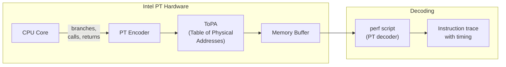
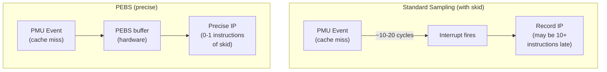
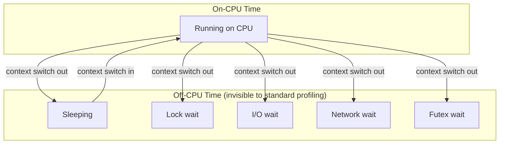

# Advanced perf Profiling

## Introduction

The basic `perf` page covers sampling, counting, and basic profiling. This page
explores advanced perf capabilities: Intel Processor Trace (Intel PT) for instruction-
level tracing, Precise Event-Based Sampling (PEBS) for accurate attribution, off-CPU
profiling for scheduler latency analysis, and flame graph integration for visualization.

These techniques are essential for deep performance analysis where standard sampling
doesn't provide sufficient precision or coverage.

## Intel Processor Trace (Intel PT)

### Overview

Intel PT is a hardware feature (available since Broadwell, 2014) that records the
complete control flow of a program — every branch, call, return, and interrupt —
with minimal overhead. Unlike sampling, Intel PT captures **every** instruction
execution path, enabling precise reconstruction of program behavior.



### Capabilities

- **Complete control flow**: Every branch taken/not-taken is recorded
- **Near-zero overhead**: Hardware-based, ~1-3% overhead
- **Timing information**: TSC timestamps for precise latency measurement
- **Kernel and userspace**: Traces both ring 0 and ring 3
- **Multi-process**: Can trace across process boundaries

### Checking Intel PT Support

```bash
# Check if Intel PT is available
dmesg | grep -i "intel.*pt"
# Intel PT support detected

# Check CPUID
cpuid -1 | grep -i pt
# Intel Processor Trace (Intel PT): enabled

# Check perf support
perf list | grep intel_pt
# intel_pt//                                         [Kernel PMU event]

# Check availability
ls /sys/devices/intel_pt/
# format  nr_addr_filters  type
```

### Recording with Intel PT

```bash
# Basic Intel PT recording
perf record -e intel_pt// -C 0 sleep 5

# Record specific workload
perf record -e intel_pt// -- ./my_program

# Record with TSC (timestamp counter) for precise timing
perf record -e intel_pt/tsc=1/ -- ./my_program

# Record with kernel and user space
perf record -e intel_pt// --filter 'filter main @ ./my_program' ./my_program

# Record with address filtering (only trace specific code region)
perf record -e intel_pt// --filter 'filter 0x401000/0x100@./my_program' ./my_program

# Multi-thread recording
perf record -e intel_pt// --per-thread -- ./my_program
```

### Decoding Intel PT Data

```bash
# Decode to instruction trace
perf script --itrace=i10us --ns -F time,pid,tid,comm,ip,sym,symoff,dso

# Decode to branches only
perf script --itrace=b -F time,comm,ip,sym

# Decode to instructions with call chain
perf script --itrace=il64 --call-graph=graph

# Decode with instruction-level timing
perf script --itrace=i1i -F time,comm,ip,sym,symoff

# Generate instruction histogram
perf script --itrace=I --ns -F time,ip | head -20
```

### Intel PT Output Formats

```bash
# --itrace options:
#   i<ns>    — instructions with minimum interval
#   b        — branches only
#   c        — calls only
#   r        — returns only
#   g        — call chains (for flame graphs)
#   l<ns>    — instruction-level with latency
#   d        — data transfers (requires additional hardware)
#   e        — errors/events

# Branch-only trace
perf script --itrace=b -F comm,ip,sym,addr,symoff

# Call/return trace
perf script --itrace=cr -F time,comm,ip,sym

# Instruction trace with latency
perf script --itrace=i100ns,il -F time,comm,ip,sym,symoff,insn,insnlen
```

### Intel PT Analysis

```bash
# Generate branch statistics
perf report --itrace=b --stdio

# Instruction heatmap (per-function)
perf report --itrace=i --stdio --sort=symbol

# Trace specific function
perf script --itrace=i10us --ns -F ip,sym | grep -A5 'my_function'

# Time-based analysis
perf script --itrace=i10us -F time,ip,sym | \
    awk '{print $1}' | uniq -c | sort -rn | head -20
```

### Intel PT for Cache Analysis

```bash
# Combine Intel PT with cache events
perf record -e intel_pt// -e cache-misses -C 0 sleep 5

# Correlate branches with cache behavior
perf script --itrace=b -F time,ip,sym,addr | head -50
```

## PEBS (Precise Event-Based Sampling)

### How PEBS Works

Standard PMU (Performance Monitoring Unit) sampling has skid — the recorded IP
(instruction pointer) may be several instructions past the actual event. PEBS
eliminates skid by recording the precise IP at the time of the event using a
hardware buffer.



### PEBS vs Standard Sampling

| Feature | Standard Sampling | PEBS |
|---------|-------------------|------|
| IP accuracy | ±10-20 instructions | ±0-1 instructions |
| Overhead | Lower | Slightly higher |
| Data recorded | IP only | IP + additional regs |
| Latency info | No | Yes (PEBS-LL) |
| Availability | All CPUs | Intel Nehalem+, AMD Zen+ |
| Events | All PMU events | Subset of events |

### Basic PEBS Usage

```bash
# Record with precise modifier (:p)
perf record -e cache-misses:pp -- ./my_program

# PEBS levels: :p, :pp, :ppp
# :p   — precise (PEBS)
# :pp  — more precise (may drop events)
# :ppp — most precise (best accuracy, highest overhead)

# Check which events support PEBS
perf list | grep -i precise

# Record with PEBS and call graphs
perf record -e cache-misses:pp --call-graph dwarf -- ./my_program
perf record -e cache-misses:pp --call-graph lbr -- ./my_program  # Intel only

# Report with precise attribution
perf report --sort=symbol,dso
```

### PEBS Data Sources

PEBS can record the data source (which level of cache or memory served the access):

```bash
# Record with data source (memory access info)
perf record -e cpu/mem-loads,ldlat=30/pp -- ./my_program

# Check data source field
perf script -F ip,addr,data_src,sym | head -20

# Data source encoding:
# L1 hit, L2 hit, L3 hit, Local RAM, Remote RAM, etc.

# Filter by data source
perf record -e cpu/mem-loads,ldlat=100/pp -- ./my_program  # Only slow loads (>100 cycles)
```

### PEBS Data Source Table

| Data Source | Description | Latency |
|-------------|-------------|---------|
| L1 | L1 data cache hit | ~4 cycles |
| L2 | L2 cache hit | ~12 cycles |
| L3 | L3/LLC hit | ~40 cycles |
| Local DRAM | Local memory | ~100-200 cycles |
| Remote DRAM | NUMA-remote memory | ~200-400 cycles |
| Remote cache | Remote L3 hit | ~60-100 cycles |
| I/O | MMIO access | Variable |

### PEBS Load Latency (PEBS-LL)

PEBS-LL measures the latency of each memory load in cycles:

```bash
# Record load latency distribution
perf record -e cpu/mem-loads,ldlat=1/pp -- ./my_program

# Analyze latency
perf script -F ip,addr,weight,sym | head -20
# weight field = load latency in cycles

# Generate latency histogram
perf script -F weight | sort -n | uniq -c | sort -rn

# Report with data source
perf mem report --sort=mem,sym,dso

# Detailed memory access analysis
perf mem report --sort=symbol --stdio
```

### PEBS on AMD (IBS)

AMD uses Instruction-Based Sampling (IBS) which provides similar capabilities:

```bash
# AMD IBS — no precise modifier needed
perf record -e ibs_op// -- ./my_program
perf record -e ibs_op/cnt_ctl=1/ -- ./my_program

# IBS fetch sampling
perf record -e ibs_fetch// -- ./my_program

# Report
perf report --sort=symbol,dso
```

## Off-CPU Profiling

### The Problem

Traditional profiling (perf record, `perf stat`) only sees what happens **on** the
CPU — it misses time spent sleeping, waiting on locks, blocking on I/O, or waiting
on network. Off-CPU profiling captures the time a task spends **not** running.



### Off-CPU Profiling with BCC

```bash
# Install BCC tools
sudo apt install bpfcc-tools  # Debian/Ubuntu
sudo dnf install bcc-tools    # Fedora

# Basic off-CPU profiling (shows time spent off-CPU with stack traces)
sudo offcputime-bpfcc -df -p 1234 30 > offcpu.stacks

# Convert to flame graph
# Clone FlameGraph if not present
git clone https://github.com/brendangregg/FlameGraph.git

# Generate flame graph
./FlameGraph/flamegraph.pl --color=io --title="Off-CPU" offcpu.stacks > offcpu.svg

# Off-CPU with frequency (how often each stack is seen off-CPU)
sudo offcputime-bpfcc -df -p 1234 30 --count > offcpu-count.stacks
```

### Off-CPU Profiling with bpftrace

```bash
# Simple off-CPU time measurement
sudo bpftrace -e '
tracepoint:sched:sched_switch {
    if (args->prev_pid == 1234) {
        @offcpu_start[args->prev_pid] = nsecs;
    }
    if (args->next_pid == 1234) {
        if (@offcpu_start[1234]) {
            @offcpu_ns = hist(nsecs - @offcpu_start[1234]);
        }
    }
}
'

# Off-CPU with stack traces
sudo bpftrace -e '
tracepoint:sched:sched_switch {
    if (args->prev_pid == 1234) {
        @start[args->prev_pid] = nsecs;
        @saved_stack[args->prev_pid] = kstack;
    }
    if (args->next_pid == 1234 && @start[1234]) {
        $dur = nsecs - @start[1234];
        @offcpu_time[@saved_stack[1234]] = sum($dur);
        @offcpu_count[@saved_stack[1234]] = count();
    }
}
'
```

### Off-CPU with perf sched

```bash
# Record scheduler events
perf sched record -- sleep 10

# Analyze scheduler latency
perf sched latency

# Show per-task scheduler statistics
perf sched timehist

# Per-CPU scheduling analysis
perf sched map

# Detailed per-task analysis
perf sched timehist --summary

# Export scheduler data
perf sched script > sched_events.txt
```

### Waker Analysis

Understanding **why** a task wakes up (and who woke it) is critical for off-CPU
analysis:

```bash
# Trace wakeup events with waker info
sudo bpftrace -e '
tracepoint:sched:sched_wakeup /args->pid == 1234/ {
    printf("PID %d woken by PID %d (%s)\n",
           args->pid, pid, comm);
    print(kstack);
}
'

# BCC tool: wakesnoop (who wakes up a task)
sudo wakesnoop-bpfcc -p 1234

# Off-CPU with waker stacks
sudo offcputime-bpfcc -df -p 1234 --waker 30 > offcpu-waker.stacks
```

### Blocked Function Analysis

```bash
# Trace what function a task is blocked in
sudo bpftrace -e '
kprobe:__schedule {
    $task = (struct task_struct *)bpf_get_current_task();
    if ($task->pid == 1234) {
        @blocked_at[kstack(5)] = count();
    }
}
'

# Combined on-CPU + off-CPU view
# Use perf with both cycles and scheduler events
perf record -e cycles,sched:sched_switch -p 1234 -- sleep 10
perf script -F comm,pid,tid,event,ip,sym | head -50
```

## Flame Graph Integration

### Standard Flame Graphs with perf

```bash
# Record with call graphs (dwarf-based, most portable)
perf record -g --call-graph dwarf -- ./my_program

# Record with LBR (Last Branch Record, Intel only, lower overhead)
perf record -g --call-graph lbr -- ./my_program

# Generate folded stacks
perf script | ./FlameGraph/stackcollapse-perf.pl > perf.stacks

# Generate flame graph
./FlameGraph/flamegraph.pl perf.stacks > perf.svg

# One-liner
perf script | stackcollapse-perf.pl | flamegraph.pl > perf.svg
```

### Differential Flame Graphs

Compare two profiles to find regressions:

```bash
# Record before and after
perf record -g --call-graph dwarf -- ./my_program_before
perf script | stackcollapse-perf.pl > before.stacks

perf record -g --call-graph dwarf -- ./my_program_after
perf script | stackcollapse-perf.pl > after.stacks

# Generate differential flame graph
./FlameGraph/difffolded.pl before.stacks after.stacks | \
    ./FlameGraph/flamegraph.pl > diff.svg
```

### Off-CPU Flame Graphs

```bash
# Record off-CPU time
sudo offcputime-bpfcc -df -p $(pgrep my_program) 30 > offcpu.stacks

# Generate off-CPU flame graph
./FlameGraph/flamegraph.pl --color=io \
    --title="Off-CPU Time" offcpu.stacks > offcpu.svg

# Color scheme options:
# --color=hot    — warm colors (default, for on-CPU)
# --color=io     — blue-green (for off-CPU)
# --color=mem    — memory-related colors
# --color=wakeup — wakeup chain colors
```

### Memory Flame Graphs

```bash
# Record memory allocations
perf record -e 'kmem:kmalloc' -g -- ./my_program
perf script | stackcollapse-perf.pl | flamegraph.pl --color=mem > mem.svg

# Record page faults
perf record -e page-faults -g -- ./my_program
perf script | stackcollapse-perf.pl | flamegraph.pl > pagefaults.svg

# Heap profiling with perf
perf record -e 'syscalls:sys_enter_mmap' -g -p $(pgrep my_program) -- sleep 10
perf script | stackcollapse-perf.pl | flamegraph.pl --color=mem > heap.svg
```

### Intel PT Flame Graphs

```bash
# Record with Intel PT
perf record -e intel_pt// -- ./my_program

# Generate folded stacks from PT data
perf script --itrace=il64 --call-graph=graph -F comm,ip,sym | \
    stackcollapse-perf.pl > pt.stacks

# Generate flame graph
./FlameGraph/flamegraph.pl pt.stacks > pt.svg
```

### Flame Graph Options

```bash
# Customize flame graph appearance
./FlameGraph/flamegraph.pl \
    --title "My Application Profile" \
    --subtitle "CPU samples, 2024-01-15" \
    --width 1200 \
    --height 16 \
    --minwidth 0.5 \
    --color java \
    --hash \
    --cp \
    perf.stacks > profile.svg

# Color schemes:
#   hot     — warm palette (red/orange/yellow)
#   io      — blue-green palette
#   mem     — memory palette
#   java    — Java color scheme
#   js      — JavaScript color scheme
#   wakeup  — green for wakeup chains
#   chain   — chain coloring
```

### FlameScope

FlameScope divides the timeline into sub-second ranges and shows a heatmap +
flame graph for each range — useful for identifying patterns:

```bash
# Generate time-based folded stacks (with timestamps)
perf script -F time,event,comm,pid,tid,ip,sym | \
    stackcollapse-perf.pl --tid > timed.stacks

# Import into FlameScope (web-based tool)
# https://github.com/Netflix/flamescope
```

## Advanced perf Events

### Hardware Events with Qualifiers

```bash
# Event modifiers
perf stat -e cycles:u -- ./my_program      # User space only
perf stat -e cycles:k -- ./my_program      # Kernel only
perf stat -e cycles:G -- ./my_program      # Guest (VM)
perf stat -e cycles:H -- ./my_program      # Host (not guest)

# Precise events
perf stat -e instructions:pp -- ./my_program  # Precise

# Event filtering
perf stat -e 'cycles,filter=cpu==0' -- ./my_program

# Period-based sampling (sample every N events)
perf record -e cycles:pp --freq 999 -- ./my_program  # 999 Hz
perf record -e cycles:pp --period 10000 -- ./my_program  # every 10000 cycles
```

### Software Events

```bash
# Context switch counting
perf stat -e context-switches -- ./my_program

# Page fault analysis
perf stat -e page-faults,minor-faults,major-faults -- ./my_program

# CPU migration analysis
perf stat -e cpu-migrations -- ./my_program

# Task clock vs wall clock
perf stat -e task-clock -- ./my_program
```

### Tracepoint Events with Advanced Filtering

```bash
# Record specific tracepoint with filter
perf record -e 'sched:sched_switch/prev_comm=="my_process"/' -- sleep 5

# Multiple tracepoints
perf record -e 'block:block_rq_complete' \
             -e 'block:block_rq_issue' \
             -e 'sched:sched_switch' \
             -- sleep 5

# Filter by duration
perf record -e 'sched:sched_switch/prev_state==1/' -- sleep 5
# prev_state: 0=Running, 1=S, 2=D, 4=T, 8=Z, ...
```

## perf with BPF

### BPF Scripts

```bash
# Run BPF program via perf
perf record -e 'bpf-output' -e 'dummy_pmu' -- sleep 5

# Use perf with BPF scripts
perf script record -e 'bpf-output' -- ./my_bpf_script.py

# BPF-based perf counting
perf stat -e 'bpf-output/count=1/' -- sleep 5
```

### perf + BPF Custom Events

```c
// Custom BPF program for perf integration
SEC("perf_event")
int BPF_PROG(my_perf_prog, struct bpf_perf_event_context *ctx) {
    __u32 pid = bpf_get_current_pid_tgid() >> 32;
    __u64 ts = bpf_ktime_get_ns();
    
    // Output to perf ring buffer
    bpf_perf_event_output(ctx, &events, BPF_F_CURRENT_CPU,
                          &ts, sizeof(ts));
    return 0;
}
```

## perf stat Advanced Features

### Multiplexing and Scaling

```bash
# When too many events, perf multiplexes (time-slices)
# Enable scaling output to see if events were multiplexed
perf stat -v -- ./my_program

# Group events to count simultaneously
perf stat -e '{cycles,instructions}' -- ./my_program
perf stat -e '{cache-misses,cache-references}' -- ./my_program

# Multiplexing warning in output:
# (50.12% scaling factor for cycles)
# means the event was only counted ~50% of the time
```

### Topdown Analysis (Intel)

```bash
# Topdown Level 1 (frontend vs backend bound)
perf stat --topdown -a sleep 5

# Topdown Level 2
perf stat --topdown --td-level 2 -a sleep 5

# Topdown Level 3
perf stat --topdown --td-level 3 -a sleep 5

# Topdown for specific workload
perf stat --topdown -- ./my_program
```

### Cache and Memory Events

```bash
# Cache hit rates
perf stat -e L1-dcache-loads,L1-dcache-load-misses,L1-dcache-stores -- ./my_program

# LLC (Last Level Cache)
perf stat -e LLC-loads,LLC-load-misses,LLC-stores -- ./my_program

# TLB events
perf stat -e dTLB-loads,dTLB-load-misses,iTLB-loads,iTLB-load-misses -- ./my_program

# Branch prediction
perf stat -e branches,branch-misses -- ./my_program

# Memory bandwidth (Intel specific)
perf stat -e uncore_imc/cas_count_read/ -- ./my_program
perf stat -e uncore_imc/cas_count_write/ -- ./my_program
```

## perf lock

### Lock Contention Analysis

```bash
# Record lock events
perf lock record -- sleep 5

# Report lock contention
perf lock report

# Detailed report with call stacks
perf lock report -k caller

# Sort by contention time
perf lock report --sort acquired,contended

# Report with thread info
perf lock report -t
```

### Lock Latency Distribution

```bash
# Record with lock tracepoints
perf record -e lock:lock_acquire -e lock:lock_acquired -e lock:lock_contended -- sleep 5

# Analyze contention
perf script -F comm,pid,event,ip | head -50
```

## perf mem

### Memory Access Profiling

```bash
# Record memory access patterns (PEBS-based)
perf mem record -- ./my_program

# Report memory access distribution
perf mem report

# Sort by data source
perf mem report --sort=mem

# Sort by symbol
perf mem report --sort=symbol

# Detailed report with data source
perf mem report --stdio --sort=mem,symbol,dso

# Raw data source analysis
perf mem report --stdio --data-source
```

### NUMA Memory Analysis

```bash
# Record with NUMA node info
perf mem record -- ./my_program

# Report with NUMA info
perf mem report --sort=local,remote

# NUMA access pattern
perf mem report --stdio --sort=symbol --data-source
```

## perf bench

### Built-in Benchmarks

```bash
# Scheduler benchmarks
perf bench sched messaging -g 4 -l 1000
perf bench sched pipe

# Memory benchmarks
perf bench mem memcpy -n 1000
perf bench mem memset -n 1000

# NUMA benchmarks
perf bench numa mem -a -b 1G

# futex benchmarks
perf bench futex hash
perf bench futex wakeup
perf bench futex requeue
```

## Practical Recipes

### Recipe: CPU Bottleneck Identification

```bash
# Step 1: Topdown analysis
perf stat --topdown -- ./my_program

# Step 2: If backend-bound, check cache
perf stat -e LLC-load-misses,LLC-loads,dTLB-load-misses -- ./my_program

# Step 3: Profile with PEBS for precise attribution
perf record -e cache-misses:pp --call-graph dwarf -- ./my_program
perf report --sort=symbol,dso

# Step 4: Generate flame graph
perf script | stackcollapse-perf.pl | flamegraph.pl > cpu.svg
```

### Recipe: Memory Latency Investigation

```bash
# Step 1: PEBS load latency
perf record -e cpu/mem-loads,ldlat=50/pp -- ./my_program

# Step 2: Analyze data sources
perf mem report --sort=mem,symbol

# Step 3: Identify hot memory access paths
perf script -F ip,sym,weight,data_src | sort -k3 -rn | head -20

# Step 4: Generate memory flame graph
perf script | stackcollapse-perf.pl | flamegraph.pl --color=mem > memlat.svg
```

### Recipe: Scheduler Latency Investigation

```bash
# Step 1: Off-CPU profiling
sudo offcputime-bpfcc -df -p $(pgrep my_program) 30 > offcpu.stacks

# Step 2: Off-CPU flame graph
./FlameGraph/flamegraph.pl --color=io offcpu.stacks > offcpu.svg

# Step 3: Waker analysis
sudo wakesnoop-bpfcc -p $(pgrep my_program)

# Step 4: Scheduler event analysis
perf sched record -- ./my_program
perf sched latency
perf sched timehist --summary
```

### Recipe: Full Application Profile

```bash
# On-CPU profile
perf record -F 999 -g --call-graph dwarf -- ./my_program
perf script | stackcollapse-perf.pl > oncpu.stacks
./FlameGraph/flamegraph.pl --color=hot oncpu.stacks > oncpu.svg

# Off-CPU profile (run separately)
sudo offcputime-bpfcc -df -p $(pgrep my_program) 30 > offcpu.stacks
./FlameGraph/flamegraph.pl --color=io offcpu.stacks > offcpu.svg

# Memory profile
perf record -e page-faults -g --call-graph dwarf -- ./my_program
perf script | stackcollapse-perf.pl > mem.stacks
./FlameGraph/flamegraph.pl --color=mem mem.stacks > mem.svg

# Combine for holistic view
# Each SVG can be viewed independently in a browser
```

## Performance Overhead Reference

| Technique | Overhead | Data Quality | Best For |
|-----------|----------|-------------|----------|
| Standard sampling | ~0.1-1% | Good (with skid) | General profiling |
| PEBS | ~1-3% | Excellent (precise) | Cache/memory analysis |
| Intel PT | ~1-5% | Perfect (complete) | Control flow analysis |
| Off-CPU (BPF) | ~2-5% | Good | Scheduler/I/O latency |
| LBR call graph | ~0.5% | Good | Call chain analysis |
| DWARF call graph | ~1-3% | Good | Deep stacks |
| perf sched | ~1-2% | Good | Scheduler analysis |

## Summary

| Feature | Description | Key Command |
|---------|-------------|-------------|
| Intel PT | Complete control flow trace | `perf record -e intel_pt//` |
| PEBS | Precise event sampling | `perf record -e event:pp` |
| PEBS-LL | Load latency measurement | `perf record -e cpu/mem-loads,ldlat=30/pp` |
| Off-CPU | Time not on CPU | `offcputime-bpfcc` |
| Flame Graphs | Visual profiling | `flamegraph.pl` |
| Topdown | Architecture-level analysis | `perf stat --topdown` |
| perf mem | Memory access patterns | `perf mem record` |
| perf lock | Lock contention | `perf lock record` |

Advanced perf techniques provide the precision needed to diagnose complex performance
issues. Intel PT captures complete execution paths, PEBS provides precise attribution
for hardware events, off-CPU profiling reveals scheduler and I/O bottlenecks, and
flame graphs make the data actionable.
