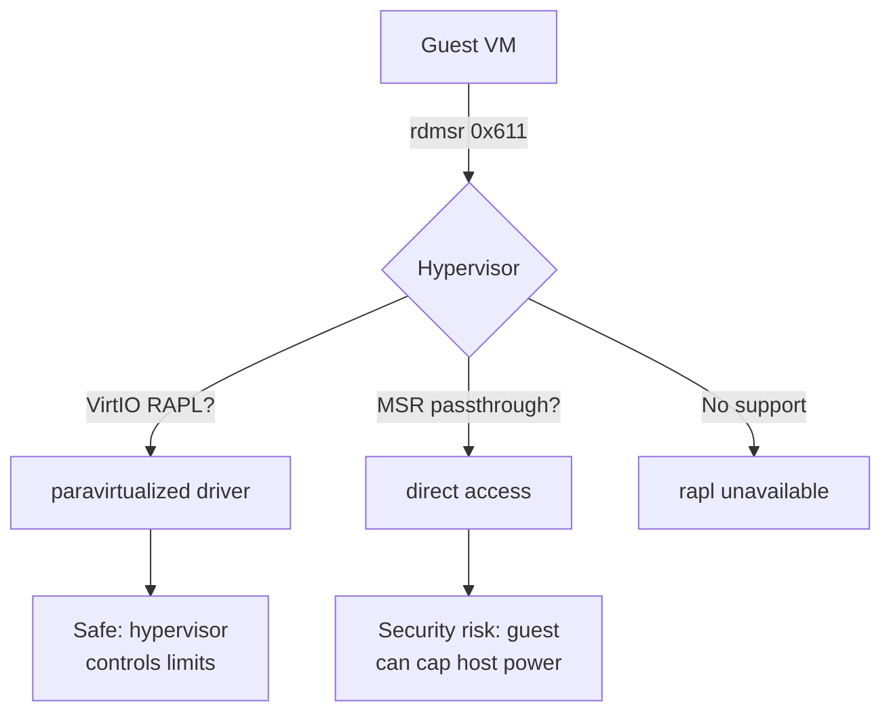
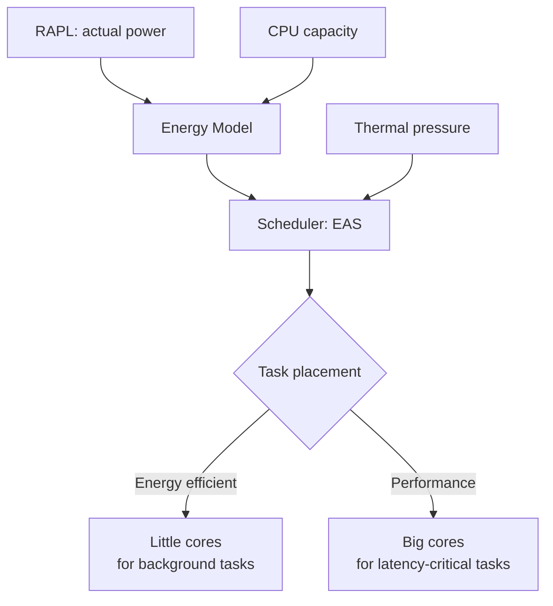
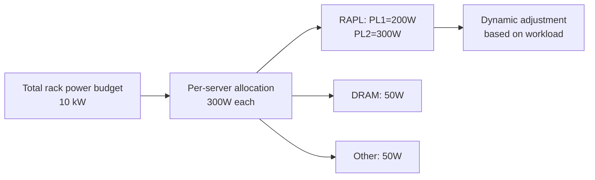

# RAPL — Running Average Power Limit

## Overview

RAPL (Running Average Power Limit) is an Intel processor feature (also adopted by AMD) that provides software-based power monitoring and control. Introduced with Intel Sandy Bridge (2011), RAPL allows the operating system and applications to measure energy consumption and enforce power limits on various processor domains. RAPL operates through Model-Specific Registers (MSRs) and provides both cumulative energy counters and configurable power caps.

RAPL is critical for power-aware scheduling, data center power management, thermal control, and energy efficiency optimization. It operates at hardware level with minimal overhead and does not require external power measurement equipment.

## RAPL Domains

RAPL divides the processor into several power domains, each independently controllable:

### Domain Hierarchy

```
Package (PKG)
├── Core (PP0) — CPU cores
│   ├── Core 0
│   ├── Core 1
│   └── ...
├── Uncore/LLC (PP1) — Last-level cache, memory controller, integrated GPU
└── DRAM — Memory subsystem
```

### Domain Details

| Domain | MSR Prefix | Description | Available Since |
|---|---|---|---|
| **PKG** | `MSR_RAPL_POWER_UNIT`, `MSR_PKG_*` | Entire processor package | Sandy Bridge |
| **PP0** | `MSR_PP0_*` | All CPU cores | Sandy Bridge |
| **PP1** | `MSR_PP1_*` | Uncore (GPU, LLC, IMC) | Sandy Bridge |
| **DRAM** | `MSR_DRAM_*` | Memory subsystem | Haswell |
| **PSys** | `MSR_PLATFORM_*` | Entire SoC (mobile) | Skylake |

### Platform-Specific Domains

Not all domains are available on all platforms:

- **Desktop/Server**: PKG, PP0, PP1 (if iGPU present), DRAM (server only on some SKUs)
- **Mobile**: PKG, PP0, PP1, DRAM, PSys
- **Server (Xeon)**: PKG, DRAM (PP0/PP1 may be restricted)

## MSR Registers

### Power Unit Register

```c
#define MSR_RAPL_POWER_UNIT    0x606

/* Bits 3:0  — Power units (2^(-x) watts) */
/* Bits 12:8 — Energy status units (2^(-x) joules) */
/* Bits 19:16 — Time units (2^(-x) seconds) */
```

### Per-Domain Registers

Each domain has up to four register types:

| Register | Purpose | Example (PKG) |
|---|---|---|
| **Power Limit** | Set power caps | `MSR_PKG_POWER_LIMIT` (0x610) |
| **Energy Status** | Cumulative energy counter | `MSR_PKG_ENERGY_STATUS` (0x611) |
| **Perf Status** | Performance throttling info | `MSR_PKG_PERF_STATUS` (0x613) |
| **Policy** | Power balance priority | `MSR_PKG_POLICY` (0x614) |
| **Info** | Max/min power, max time window | `MSR_PKG_POWER_INFO` (0x614) |

### Reading Energy Status

The energy counter is a 32-bit unsigned integer that wraps around:

```c
#define MSR_PKG_ENERGY_STATUS   0x611

uint64_t msr_val;
/* Read MSR via /dev/cpu/N/msr or rdmsr */
pread(msr_fd, &msr_val, sizeof(msr_val), MSR_PKG_ENERGY_STATUS);

uint32_t energy_raw = msr_val & 0xFFFFFFFF;
/* Convert to Joules using energy unit from MSR_RAPL_POWER_UNIT */
double energy_joules = energy_raw * energy_unit;
```

### Power Limit Register

```c
#define MSR_PKG_POWER_LIMIT    0x610

/* 64-bit register layout:
 * Bits 14:0   — Power limit 1 (15 bits, in power units)
 * Bit  15     — Power limit 1 enable
 * Bits 17:16  — Power limit 1 clamp (clamp to limit, time window)
 * Bits 23:17  — Power limit 1 time window
 * Bits 46:32  — Power limit 2 (15 bits, in power units)
 * Bit  47     — Power limit 2 enable
 * Bits 49:48  — Power limit 2 clamp
 * Bits 55:49  — Power limit 2 time window
 */
```

## Kernel Interface

### powercap sysfs

The Linux kernel exposes RAPL through the powercap framework:

```bash
ls /sys/class/powercap/
# intel-rapl:0/          — Package 0
# intel-rapl:0:0/        — Package 0, Core domain (PP0)
# intel-rapl:0:1/        — Package 0, Uncore domain (PP1)
# intel-rapl:0:2/        — Package 0, DRAM domain
# intel-rapl:1/          — Package 1 (multi-socket)
```

### Reading Energy

```bash
# Read package energy (microjoules)
cat /sys/class/powercap/intel-rapl:0/energy_uj
# 28456789012

# Read energy unit
cat /sys/class/powercap/intel-rapl:0/energy_uj
# Calculate: delta_energy / delta_time = power_watts

# Read core energy
cat /sys/class/powercap/intel-rapl:0:0/energy_uj

# Read DRAM energy (if available)
cat /sys/class/powercap/intel-rapl:0:2/energy_uj
```

### Setting Power Limits

```bash
# Read current power limit (microwatts)
cat /sys/class/powercap/intel-rapl:0/constraint_0_power_limit_uw
# 65000000  (65W)

# Set power limit to 45W
echo 45000000 > /sys/class/powercap/intel-rapl:0/constraint_0_power_limit_uw

# Read time window
cat /sys/class/powercap/intel-rapl:0/constraint_0_time_window_us

# Set time window to 1 second
echo 1000000 > /sys/class/powercap/intel-rapl:0/constraint_0_time_window_us

# Enable/disable constraint
cat /sys/class/powercap/intel-rapl:0/constraint_0_enable
echo 1 > /sys/class/powercap/intel-rapl:0/constraint_0_enable
```

### Domain Names

```bash
cat /sys/class/powercap/intel-rapl:0/name
# package-0

cat /sys/class/powercap/intel-rapl:0:0/name
# core

cat /sys/class/powercap/intel-rapl:0:1/name
# uncore

cat /sys/class/powercap/intel-rapl:0:2/name
# dram
```

### Max Power Information

```bash
# Maximum power for the domain
cat /sys/class/powercap/intel-rapl:0/max_power_range_uw
# 135000000  (135W max)

# Minimum power
cat /sys/class/powercap/intel-rapl:0/min_power_range_uw
# 25000000  (25W min)

# Maximum time window
cat /sys/class/powercap/intel-rapl:0/constraint_0_max_time_window_us
```

## Turbostat

`turbostat` is the primary tool for monitoring RAPL data alongside CPU frequency and C-state information:

### Basic Usage

```bash
sudo turbostat
# Displays per-CPU:
# - Frequency (MHz)
# - C-state residency
# - Package power (Watts)
# - Core power (Watts)
# - DRAM power (Watts)
# - Temperature (°C)
```

### Output Example

```
Core  CPU Avg_MHz Busy% Bzy_MHz TSC_MHz IRQ   C1   C6   C8  PkgWatt CorWatt DRAMWatt
-     -   1200    45.2  2650    2600    1500  20.1 30.5 4.2  35.2    22.1    8.5
0     0   2400    92.1  2600    2600    800   2.1  5.2  0.6  -       -       -
0     1   200     7.5   2600    2600    700   38.2 55.1 8.2  -       -       -
1     2   1800    68.3  2600    2600    600   15.3 16.2 0.2  -       -       -
1     3   400     15.2  2600    2600    500   25.4 59.3 5.1  -       -       -
```

### Turbostat Options

```bash
# Show RAPL power only
sudo turbostat --show PkgWatt,CorWatt,DRAMWatt

# Interval (seconds)
sudo turbostat --interval 5

# Show specific columns
sudo turbostat --show Core,CPU,Avg_MHz,PkgWatt

# Output to file
sudo turbostat --out turbostat.log

# Show package info only
sudo turbostat --show PkgWatt,PkgTmp

# NUMA-aware output
sudo turbostat --numa
```

### Common Columns

| Column | Description |
|---|---|
| `PkgWatt` | Package power in watts |
| `CorWatt` | Core power in watts |
| `DRAMWatt` | DRAM power in watts |
| `PkgTmp` | Package temperature in °C |
| `Avg_MHz` | Average frequency in MHz |
| `Busy%` | Percentage of time not in C1 |
| `Bzy_MHz` | Base frequency when not idle |
| `C1, C6, C8` | C-state residency percentages |

## Power Capping

### Single Limit

```bash
#!/bin/bash
# Cap package power at 45W

RAPL_DIR=/sys/class/powercap/intel-rapl:0

# Enable constraint 0
echo 1 > $RAPL_DIR/constraint_0_enable

# Set limit
echo 45000000 > $RAPL_DIR/constraint_0_power_limit_uw

echo "Package 0 capped at 45W"
```

### Dual Limits (PL1 and PL2)

Intel processors typically support two power limits:

- **PL1 (Power Limit 1)**: Sustained power limit
- **PL2 (Power Limit 2)**: Short-term burst power limit

```bash
RAPL_DIR=/sys/class/powercap/intel-rapl:0

# PL1: Sustained at 65W
echo 65000000 > $RAPL_DIR/constraint_0_power_limit_uw
echo 28000000 > $RAPL_DIR/constraint_0_time_window_us  # 28 seconds

# PL2: Burst up to 135W for 10ms
echo 135000000 > $RAPL_DIR/constraint_1_power_limit_uw
echo 10000 > $RAPL_DIR/constraint_1_time_window_us  # 10ms
```

### Dynamic Power Capping

```bash
#!/bin/bash
# Dynamic power capping based on temperature

RAPL_DIR=/sys/class/powercap/intel-rapl:0
THERMAL_DIR=/sys/class/thermal/thermal_zone0

while true; do
    TEMP=$(cat $THERMAL_DIR/temp)  # millidegrees
    TEMP_C=$((TEMP / 1000))

    if [ $TEMP_C -gt 90 ]; then
        # Emergency: reduce to 25W
        echo 25000000 > $RAPL_DIR/constraint_0_power_limit_uw
    elif [ $TEMP_C -gt 80 ]; then
        # High: reduce to 45W
        echo 45000000 > $RAPL_DIR/constraint_0_power_limit_uw
    else
        # Normal: allow full power
        echo 65000000 > $RAPL_DIR/constraint_0_power_limit_uw
    fi

    sleep 1
done
```

## Per-Process Energy Monitoring

### perf stat

```bash
# Measure energy for a specific command
sudo perf stat -e power/energy-pkg/ -e power/energy-cores/ -e power/energy-ram/ \
    ./my_program

# Output:
#  5.23 Joules power/energy-pkg/
#  3.45 Joules power/energy-cores/
#  1.12 Joules power/energy-ram/
```

### Running Average Calculation

```bash
#!/bin/bash
# Calculate average power over an interval

RAPL=/sys/class/powercap/intel-rapl:0/energy_uj
INTERVAL=5  # seconds

E1=$(cat $RAPL)
T1=$(date +%s%N)

sleep $INTERVAL

E2=$(cat $RAPL)
T2=$(date +%s%N)

# Handle counter wraparound
if [ $E2 -lt $E1 ]; then
    E2=$((E2 + 2**32))
fi

DELTA_E=$((E2 - E1))
DELTA_T=$((T2 - T1))

# Power in watts = energy (µJ) / time (µs)
POWER=$(echo "scale=2; $DELTA_E / $DELTA_T" | bc)
echo "Average power: ${POWER}W"
```

## AMD RAPL

AMD processors also support RAPL-compatible interfaces:

### AMD Family 17h+ (Zen)

```bash
# AMD uses the same powercap interface
ls /sys/class/powercap/
# amd_rapl:0/  — Package
# amd_rapl:0:0/ — Core (CCD)

# Same sysfs interface
cat /sys/class/powercap/amd_rapl:0/energy_uj
cat /sys/class/powercap/amd_rapl:0/name
# package-0
```

### AMD-Specific Features

- Per-CCD (Core Complex Die) power monitoring
- Per-core power monitoring (on some SKUs)
- Fabric power domain

## Power Management Libraries

### Powercap (libpowercap)

```c
#include <powercap.h>

int main(void) {
    uint64_t energy;
    /* Read package energy */
    powercap_read_energy("intel-rapl:0", &energy);
    printf("Energy: %lu µJ\n", energy);
    return 0;
}
```

### Intel Power Gadget (Deprecated)

Intel Power Gadget was a GUI tool for RAPL monitoring. It has been deprecated in favor of turbostat and powercap interfaces.

### perf_event_open()

```c
#include <linux/perf_event.h>
#include <sys/syscall.h>

struct perf_event_attr attr = {
    .type = PERF_TYPE_HARDWARE,
    .config = PERF_COUNT_HW_REF_CPU_CYCLES,
    .size = sizeof(attr),
    .disabled = 1,
    .exclude_kernel = 0,
};

/* For energy events: */
/* .type = perf_type_id for power events */
/* .config = power/energy-pkg/ etc. */
```

## RAPL in Data Centers

### Power Budgeting

```bash
#!/bin/bash
# Set power limits across a fleet
HOSTS="server1 server2 server3"
TOTAL_BUDGET=1000  # watts across fleet
PER_HOST=$(($TOTAL_BUDGET / $(echo $HOSTS | wc -w)))

for host in $HOSTS; do
    ssh $host "echo $(($PER_HOST * 1000000)) > \
        /sys/class/powercap/intel-rapl:0/constraint_0_power_limit_uw"
    echo "Set $host to ${PER_HOST}W"
done
```

### Energy Monitoring Daemon

```bash
#!/bin/bash
# Log energy consumption periodically

RAPL=/sys/class/powercap/intel-rapl:0/energy_uj
LOG=/var/log/rapl-energy.log

PREV=$(cat $RAPL)
PREV_TIME=$(date +%s)

while true; do
    sleep 60
    CURR=$(cat $RAPL)
    CURR_TIME=$(date +%s)

    DELTA_E=$((CURR - PREV))
    [ $DELTA_E -lt 0 ] && DELTA_E=$((DELTA_E + 2**32))
    DELTA_T=$((CURR_TIME - PREV_TIME))
    POWER=$((DELTA_E / DELTA_T / 1000000))

    echo "$(date -Iseconds) energy_uj=$DELTA_E power_w=$POWER" >> $LOG
    PREV=$CURR
    PREV_TIME=$CURR_TIME
done
```

## Limitations and Accuracy

- **RAPL accuracy varies** by platform: typically ±5% for PKG, ±10% for DRAM
- **Counters wrap around** at 32 bits; polling must be frequent enough to avoid missing wraps
- **Not all SKUs** expose all domains; some have PP0/PP1 locked
- **RAPL is an estimate** based on hardware models, not direct current measurement
- **RAPL limits may be overridden** by BIOS/firmware power management
- **Some cloud VMs** do not expose RAPL MSRs to guests

## Debugging RAPL

### Check RAPL Availability

```bash
# Check if RAPL is supported
ls /sys/class/powercap/intel-rapl*
# If empty, RAPL may not be available or the module isn't loaded

# Load the module
sudo modprobe intel_rapl_common
sudo modprobe intel_rapl_msr

# Check MSR access
sudo rdmsr 0x606  # MSR_RAPL_POWER_UNIT
# Should return a non-zero value
```

### Verify Energy Counters

```bash
# Read twice with interval
E1=$(cat /sys/class/powercap/intel-rapl:0/energy_uj)
sleep 1
E2=$(cat /sys/class/powercap/intel-rapl:0/energy_uj)
echo "Energy consumed: $((E2 - E1)) µJ in 1 second"
```

### Common Issues

| Issue | Cause | Solution |
|---|---|---|
| No `/sys/class/powercap/` | Module not loaded | `modprobe intel_rapl_msr` |
| Permission denied | Need root | Use `sudo` or set capabilities |
| Energy always 0 | BIOS disabled RAPL | Check BIOS settings |
| Counter doesn't change | CPU idle | Run a workload |
| Power cap ignored | BIOS lock | Check BIOS power management settings |

## RAPL in Cloud and Container Environments

### Virtualization Challenges

RAPL access from virtual machines is problematic because MSRs are privileged:



- **KVM**: RAPL MSRs are not typically exposed to guests. The `intel_rapl_msr`
  module is not loaded in guest kernels by default.
- **Bare-metal containers**: RAPL works normally (shared kernel). Use cgroups
  to attribute energy to specific containers.
- **AWS/GCP/Azure**: RAPL is generally not available in cloud VMs. Use cloud-
  specific power monitoring APIs instead.

### Container Energy Attribution

```bash
#!/bin/bash
# Attribute energy consumption to cgroups (cgroup v2)
# This requires per-cgroup energy accounting (experimental)

# Read package energy
E1=$(cat /sys/class/powercap/intel-rapl:0/energy_uj)
sleep 10
E2=$(cat /sys/class/powercap/intel-rapl:0/energy_uj)

DELTA=$((E2 - E1))
[ $DELTA -lt 0 ] && DELTA=$((DELTA + 2**32))

# Get CPU usage per cgroup
for cg in /sys/fs/cgroup/*/; do
    CGROUP=$(basename $cg)
    CPU_USEC=$(cat $cg/cpu.stat 2>/dev/null | grep 'usage_usec' | awk '{print $2}')
    if [ -n "$CPU_USEC" ]; then
        echo "$CGROUP: cpu_usec=$CPU_USEC"
    fi
done
```

## RAPL and Energy-Aware Scheduling

The Linux kernel's energy-aware scheduling (EAS) framework can use RAPL data
to make smarter placement decisions:

### Integration with the Scheduler



### Per-Core Energy Estimation

```bash
#!/bin/bash
# Estimate per-core energy from RAPL + CPU utilization
# This is an approximation — RAPL reports package-level, not per-core

CORES=$(nproc)
for cpu in /sys/devices/system/cpu/cpu[0-9]*; do
    CPU_NUM=$(basename $cpu | sed 's/cpu//')
    FREQ=$(cat $cpu/cpufreq/scaling_cur_freq 2>/dev/null)
    IDLE=$(cat $cpu/cpuidle/state*/usage 2>/dev/null | \
           awk '{s+=$1} END {print s}')
    echo "CPU $CPU_NUM: freq=${FREQ}kHz idle_ops=$IDLE"
done
```

## Power Measurement Accuracy

### RAPL vs External Measurement

RAPL provides estimates based on hardware power models, not direct current
measurement. Accuracy varies:

| Domain | Typical Accuracy | Notes |
|--------|-----------------|-------|
| Package (PKG) | ±5% | Best accuracy |
| Core (PP0) | ±5-10% | Good for comparisons |
| Uncore (PP1) | ±10-15% | Less accurate |
| DRAM | ±10-20% | Depends on DIMM type |
| PSys | ±15% | Platform-level estimate |

**Validation methodology**: Compare RAPL readings against a hardware power meter
(such as a Yokogawa WT310 or a simple Kill-A-Watt) to determine the correction
factor for your specific hardware.

```bash
#!/bin/bash
# Simple RAPL validation against external meter
# Start this script, then apply a known load, and compare

METER_READING=$1  # Enter the external meter reading in watts

RAPL=/sys/class/powercap/intel-rapl:0/energy_uj
E1=$(cat $RAPL)
T1=$(date +%s%N)
sleep 10
E2=$(cat $RAPL)
T2=$(date +%s%N)

DELTA_E=$((E2 - E1))
[ $DELTA_E -lt 0 ] && DELTA_E=$((DELTA_E + 2**32))
DELTA_T=$((T2 - T1))
RAPL_W=$(echo "scale=2; $DELTA_E / $DELTA_T" | bc)

ERROR=$(echo "scale=1; ($RAPL_W - $METER_READING) / $METER_READING * 100" | bc)
echo "RAPL reports: ${RAPL_W}W"
echo "External meter: ${METER_READING}W"
echo "Error: ${ERROR}%"
```

## RAPL for Energy Profiling Tools

### PowerTOP

PowerTOP uses RAPL for its power estimates:

```bash
# Install
sudo apt install powertop

# Run with RAPL-based power estimation
sudo powertop --html=power-report.html

# Auto-tune for power savings
sudo powertop --auto-tune
```

### Intel Performance Counter Monitor (PCM)

```bash
# Install PCM
git clone https://github.com/intel/pcm.git
cd pcm && mkdir build && cd build && cmake .. && make

# Monitor power with PCM
sudo ./pcm
# Shows per-socket: Joules, Watts, memory bandwidth

# CSV output for scripting
sudo ./pcm.csv 1 > pcm-power.csv

# Per-core power estimation
sudo ./pcm-core
```

### perf-based Energy Profiling

```bash
# Record energy events alongside CPU profiling
sudo perf stat -e power/energy-pkg/,power/energy-cores/,power/energy-ram/ \
    -a -- sleep 60

# Combine with CPU profiling for energy per function
sudo perf record -e power/energy-pkg/ -a -g -- sleep 30
sudo perf report --stdio

# Energy flame graph (requires FlameGraph tools)
sudo perf script | stackcollapse-perf.pl | \
    flamegraph.pl --color=energy --title="Energy Flame Graph" > energy.svg
```

## RAPL Security Considerations

### Power Limit as a Denial-of-Service Vector

Setting RAPL power limits too low can severely degrade system performance:

```bash
# DANGEROUS: Setting 1W limit effectively DoSes the system
# echo 1000000 > /sys/class/powercap/intel-rapl:0/constraint_0_power_limit_uw
```

### MSR Access Control

```bash
# Who can access MSRs?
# /dev/cpu/N/msr requires root or CAP_SYS_RAWIO

# Check permissions
ls -la /dev/cpu/0/msr
# crw------- 1 root root 202, 0 ... /dev/cpu/0/msr

# Restrict MSR access further (SELinux example)
# type=AVC msg=audit(...): avc: denied { read } for pid=1234 comm="turbostat"
# scontext=system_u:system_r:turbostat_t:s0
```

### Mitigation

- Use `sysctl` or `cgroup` to limit who can modify RAPL limits
- Monitor RAPL limit changes via auditd
- On multi-tenant systems, consider locking RAPL limits via BIOS

## RAPL on Non-x86 Platforms

### Apple Silicon (M1/M2/M3)

Apple's M-series chips have power management but do not expose RAPL interfaces.
Power monitoring is available through:
- `powermetrics` (macOS built-in tool)
- Apple's `IOReport` framework

### ARM

ARM servers (Ampere Altra, AWS Graviton) do not have RAPL. Alternatives:
- IPMI-based power monitoring
- BMC (Baseboard Management Controller) power sensors
- RAPL-like interfaces via ACPI (experimental)

## Common RAPL Use Cases

### Data Center Power Budgeting



### Green Computing: Energy-Per-Request

```bash
#!/bin/bash
# Measure energy per HTTP request for a web server

# Start RAPL measurement
RAPL=/sys/class/powercap/intel-rapl:0/energy_uj
E_START=$(cat $RAPL)

# Run load test (e.g., wrk, ab, hey)
hey -n 10000 -c 50 http://localhost:8080/api

E_END=$(cat $RAPL)
DELTA=$((E_END - E_START))
[ $DELTA -lt 0 ] && DELTA=$((DELTA + 2**32))

REQUESTS=10000
ENERGY_PER_REQ=$(echo "scale=2; $DELTA / $REQUESTS" | bc)
echo "Energy per request: ${ENERGY_PER_REQ} µJ"
echo "Total energy: $((DELTA / 1000000)) mJ"
```

## Further Reading

- **Intel SDM**: Volume 3, Chapter 14 — Platform Power Management
- **Kernel documentation**: `Documentation/power/powercap/powercap.rst`
- **turbostat man page**: `man turbostat`
- **LWN article**: ["Per-CPU energy metering"](https://lwn.net/Articles/573328/)
- **Intel white paper**: "Intel 64 and IA-32 Architectures Software Developer's Manual — RAPL"
- **Source**: `drivers/powercap/intel_rapl_common.c` — RAPL kernel driver
- **Source**: `tools/power/x86/turbostat/turbostat.c` — turbostat tool
- **Related**: [CPU Frequency Scaling](../kernel/cpufreq.md) — frequency management
- **Related**: [Thermal Management](../kernel/thermal.md) — temperature control
- **Related**: [perf](./perf.md) — performance monitoring with RAPL events
