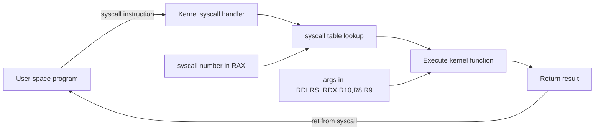

# Syscall Table

System calls (syscalls) are the fundamental interface between user-space programs and the Linux kernel.
Every operation that requires kernel privilege — file I/O, process creation, network communication,
memory management — goes through a system call. This chapter documents the x86_64 syscall table,
common syscall signatures, and how to find and use syscall numbers.

---

## Introduction

A system call is a controlled entry point into the kernel. When a user-space program needs to perform
a privileged operation, it invokes a syscall using a specific instruction (`syscall` on x86_64),
which switches the CPU from user mode to kernel mode.



### Calling Convention (x86_64)

| Register | Purpose |
|----------|---------|
| `RAX` | Syscall number (input) / Return value (output) |
| `RDI` | Argument 1 |
| `RSI` | Argument 2 |
| `RDX` | Argument 3 |
| `R10` | Argument 4 |
| `R8` | Argument 5 |
| `R9` | Argument 6 |
| `RCX` | Clobbered (saved RIP by syscall) |
| `R11` | Clobbered (saved RFLAGS by syscall) |

On error, the return value in RAX is a negative errno (e.g., -ENOENT = -2).

---

## Finding Syscall Numbers

### From Header Files

```bash
# The authoritative source
cat /usr/include/asm/unistd_64.h
# or
cat /usr/include/x86_64-linux-gnu/asm/unistd_64.h

# Example output:
# #define __NR_read 0
# #define __NR_write 1
# #define __NR_open 2
# #define __NR_close 3
# ...
```

### Using ausyscall (audit tools)

```bash
# Install audit tools
sudo apt install auditd

# Look up a syscall number
ausyscall x86_64 read
# Output: read      0

# Look up by number
ausyscall x86_64 0
# Output: read      0

# List all syscalls
ausyscall x86_64 --dump | head -20
```

### Using the Source

```bash
# The syscall table in kernel source
# arch/x86/entry/syscalls/syscall_64.tbl

# Download kernel source
wget https://cdn.kernel.org/pub/linux/kernel/v6.x/linux-6.1.tar.xz
tar xf linux-6.1.tar.xz
cat linux-6.1/arch/x86/entry/syscalls/syscall_64.tbl | head -30
```

### Using strace

```bash
# Trace syscalls of a program
strace ls
# Output includes syscall names and arguments:
# openat(AT_FDCWD, ".", O_RDONLY|O_NONBLOCK|O_CLOEXEC|O_DIRECTORY) = 3
# getdents64(3, /* 25 entries */, 32768)    = 1080
# write(1, "file1.txt  file2.txt\n", 20)    = 20

# Show syscall numbers
strace -e raw=all ls 2>&1 | head -10

# Trace specific syscalls
strace -e trace=open,read,write ls

# Count syscalls
strace -c ls
# % time     seconds  usecs/call     calls    errors syscall
# ------ ----------- ----------- --------- --------- --------
#  45.00    0.000090           9        10           write
#  25.00    0.000050          12         4           mmap
#  ...
```

### Using the Man Page

```bash
# Section 2 man pages document syscalls
man 2 syscall
man 2 syscalls    # Lists all syscalls

# Find the syscall number for a specific call
grep -r "__NR_open " /usr/include/asm/
```

---

## x86_64 Syscall Table

### File I/O (0–19)

| Number | Name | Signature | Description |
|--------|------|-----------|-------------|
| 0 | `read` | `ssize_t read(int fd, void *buf, size_t count)` | Read from file descriptor |
| 1 | `write` | `ssize_t write(int fd, const void *buf, size_t count)` | Write to file descriptor |
| 2 | `open` | `int open(const char *pathname, int flags, mode_t mode)` | Open a file (deprecated, use openat) |
| 3 | `close` | `int close(int fd)` | Close a file descriptor |
| 4 | `stat` | `int stat(const char *pathname, struct stat *statbuf)` | Get file status |
| 5 | `fstat` | `int fstat(int fd, struct stat *statbuf)` | Get file status by fd |
| 6 | `lstat` | `int lstat(const char *pathname, struct stat *statbuf)` | stat without following symlinks |
| 7 | `poll` | `int poll(struct pollfd *fds, nfds_t nfds, int timeout)` | Wait for events on fds |
| 8 | `lseek` | `off_t lseek(int fd, off_t offset, int whence)` | Reposition read/write offset |
| 9 | `mmap` | `void *mmap(void *addr, size_t len, int prot, int flags, int fd, off_t off)` | Map memory |
| 10 | `mprotect` | `int mprotect(void *addr, size_t len, int prot)` | Set memory protection |
| 11 | `munmap` | `int munmap(void *addr, size_t len)` | Unmap memory |
| 12 | `brk` | `int brk(void *addr)` | Change data segment size |
| 13 | `rt_sigaction` | `int rt_sigaction(int signum, const struct sigaction *act, struct sigaction *oldact)` | Signal handling |
| 14 | `rt_sigprocmask` | `int rt_sigprocmask(int how, const sigset_t *set, sigset_t *oldset)` | Signal mask manipulation |
| 16 | `ioctl` | `int ioctl(int fd, unsigned long request, ...)` | Control device |
| 17 | `pread64` | `ssize_t pread64(int fd, void *buf, size_t count, off_t offset)` | Read at offset |
| 18 | `pwrite64` | `ssize_t pwrite64(int fd, const void *buf, size_t count, off_t offset)` | Write at offset |

### Filesystem (76–94)

| Number | Name | Signature | Description |
|--------|------|-----------|-------------|
| 76 | `truncate` | `int truncate(const char *path, off_t length)` | Truncate file to length |
| 77 | `ftruncate` | `int ftruncate(int fd, off_t length)` | Truncate by fd |
| 78 | `getdents` | `int getdents(unsigned int fd, struct linux_dirent *dirp, unsigned int count)` | Read directory entries |
| 79 | `getcwd` | `char *getcwd(char *buf, size_t size)` | Get current working directory |
| 80 | `chdir` | `int chdir(const char *path)` | Change working directory |
| 81 | `fchdir` | `int fchdir(int fd)` | Change directory by fd |
| 82 | `rename` | `int rename(const char *oldpath, const char *newpath)` | Rename a file |
| 83 | `mkdir` | `int mkdir(const char *pathname, mode_t mode)` | Create a directory |
| 84 | `rmdir` | `int rmdir(const char *pathname)` | Remove a directory |
| 85 | `creat` | `int creat(const char *pathname, mode_t mode)` | Create a file |
| 86 | `link` | `int link(const char *oldpath, const char *newpath)` | Create a hard link |
| 87 | `unlink` | `int unlink(const char *pathname)` | Delete a name |
| 88 | `symlink` | `int symlink(const char *target, const char *linkpath)` | Create a symbolic link |
| 89 | `readlink` | `ssize_t readlink(const char *pathname, char *buf, size_t bufsiz)` | Read symlink value |
| 90 | `chmod` | `int chmod(const char *pathname, mode_t mode)` | Change permissions |
| 91 | `fchmod` | `int fchmod(int fd, mode_t mode)` | Change permissions by fd |
| 92 | `chown` | `int chown(const char *pathname, uid_t owner, gid_t group)` | Change ownership |
| 93 | `fchown` | `int fchown(int fd, uid_t owner, gid_t group)` | Change ownership by fd |
| 94 | `lchown` | `int lchown(const char *pathname, uid_t owner, gid_t group)` | lchown without following symlinks |

### Process Management (56–62, 231)

| Number | Name | Signature | Description |
|--------|------|-----------|-------------|
| 56 | `clone` | `int clone(int (*fn)(void *), void *stack, int flags, void *arg, ...)` | Create child process (low-level) |
| 57 | `fork` | `pid_t fork(void)` | Create a child process |
| 58 | `vfork` | `pid_t vfork(void)` | Create process (shared memory) |
| 59 | `execve` | `int execve(const char *pathname, char *const argv[], char *const envp[])` | Execute a program |
| 60 | `exit` | `void exit(int status)` | Terminate the calling process |
| 61 | `wait4` | `pid_t wait4(pid_t pid, int *wstatus, int options, struct rusage *rusage)` | Wait for process to change state |
| 62 | `kill` | `int kill(pid_t pid, int sig)` | Send signal to a process |
| 231 | `exit_group` | `void exit_group(int status)` | Exit all threads in a process |

### Memory (9–12, 25–28)

| Number | Name | Signature | Description |
|--------|------|-----------|-------------|
| 9 | `mmap` | `void *mmap(void *addr, size_t len, int prot, int flags, int fd, off_t off)` | Map files/devices into memory |
| 10 | `mprotect` | `int mprotect(void *addr, size_t len, int prot)` | Set memory protection |
| 11 | `munmap` | `int munmap(void *addr, size_t len)` | Unmap memory |
| 12 | `brk` | `int brk(void *addr)` | Change data segment size |
| 25 | `mremap` | `void *mremap(void *old_address, size_t old_size, size_t new_size, int flags, ...)` | Remap a virtual memory address |
| 26 | `msync` | `int msync(void *addr, size_t length, int flags)` | Synchronize memory with disk |
| 27 | `mincore` | `int mincore(void *addr, size_t length, unsigned char *vec)` | Determine resident pages |
| 28 | `madvise` | `int madvise(void *addr, size_t length, int advice)` | Advise kernel about memory use |

### Socket / Network (41–53)

| Number | Name | Signature | Description |
|--------|------|-----------|-------------|
| 41 | `socket` | `int socket(int domain, int type, int protocol)` | Create a socket |
| 42 | `connect` | `int connect(int sockfd, const struct sockaddr *addr, socklen_t addrlen)` | Initiate connection |
| 43 | `accept` | `int accept(int sockfd, struct sockaddr *addr, socklen_t *addrlen)` | Accept a connection |
| 44 | `sendto` | `ssize_t sendto(int sockfd, const void *buf, size_t len, int flags, const struct sockaddr *dest_addr, socklen_t addrlen)` | Send a message |
| 45 | `recvfrom` | `ssize_t recvfrom(int sockfd, void *buf, size_t len, int flags, struct sockaddr *src_addr, socklen_t *addrlen)` | Receive a message |
| 46 | `sendmsg` | `ssize_t sendmsg(int sockfd, const struct msghdr *msg, int flags)` | Send message with ancillary data |
| 47 | `recvmsg` | `ssize_t recvmsg(int sockfd, struct msghdr *msg, int flags)` | Receive message with ancillary data |
| 48 | `shutdown` | `int shutdown(int sockfd, int how)` | Shut down socket |
| 49 | `bind` | `int bind(int sockfd, const struct sockaddr *addr, socklen_t addrlen)` | Bind socket to address |
| 50 | `listen` | `int listen(int sockfd, int backlog)` | Listen for connections |
| 51 | `accept4` | `int accept4(int sockfd, struct sockaddr *addr, socklen_t *addrlen, int flags)` | Accept with flags |
| 54 | `setsockopt` | `int setsockopt(int sockfd, int level, int optname, const void *optval, socklen_t optlen)` | Set socket option |
| 55 | `getsockopt` | `int getsockopt(int sockfd, int level, int optname, void *optval, socklen_t *optlen)` | Get socket option |

### Modern / Advanced

| Number | Name | Signature | Description |
|--------|------|-----------|-------------|
| 281 | `epoll_create1` | `int epoll_create1(int flags)` | Create epoll instance |
| 282 | `epoll_ctl` | `int epoll_ctl(int epfd, int op, int fd, struct epoll_event *event)` | Control epoll interest list |
| 283 | `epoll_wait` | `int epoll_wait(int epfd, struct epoll_event *events, int maxevents, int timeout)` | Wait for epoll events |
| 288 | `accept4` | `int accept4(int sockfd, struct sockaddr *addr, socklen_t *addrlen, int flags)` | Accept with SOCK_NONBLOCK/CLOEXEC |
| 290 | `eventfd2` | `int eventfd2(unsigned int initval, int flags)` | Create eventfd |
| 291 | `epoll_create1` | — | (duplicate entry, see 281) |
| 292 | `dup3` | `int dup3(int oldfd, int newfd, int flags)` | Duplicate fd with flags |
| 293 | `pipe2` | `int pipe2(int pipefd[2], int flags)` | Create pipe with flags |
| 302 | `prlimit64` | `int prlimit64(pid_t pid, int resource, const struct rlimit64 *new_limit, struct rlimit64 *old_limit)` | Get/set resource limits |
| 318 | `getrandom` | `ssize_t getrandom(void *buf, size_t buflen, unsigned int flags)` | Obtain random bytes |
| 319 | `memfd_create` | `int memfd_create(const char *name, unsigned int flags)` | Create anonymous file in memory |
| 322 | `execveat` | `int execveat(int dirfd, const char *pathname, char *const argv[], char *const envp[], int flags)` | Execute relative to dirfd |
| 424 | `pidfd_send_signal` | `int pidfd_send_signal(int pidfd, int sig, siginfo_t *info, unsigned int flags)` | Send signal via pidfd |
| 425 | `io_uring_setup` | `int io_uring_setup(unsigned int entries, struct io_uring_params *p)` | Setup io_uring |
| 426 | `io_uring_enter` | `int io_uring_enter(int fd, unsigned int to_submit, unsigned int min_complete, unsigned int flags, sigset_t *sig)` | io_uring: submit and wait |
| 427 | `io_uring_register` | `int io_uring_register(int fd, unsigned int opcode, void *arg, unsigned int nr_args)` | io_uring: register buffers/files |
| 435 | `clone3` | `int clone3(struct clone_args *cl_args, size_t size)` | Extended clone with more options |
| 439 | `faccessat2` | `int faccessat2(int dirfd, const char *pathname, int mode, int flags)` | Check access with flags |
| 441 | `epoll_pwait2` | `int epoll_pwait2(int epfd, struct epoll_event *events, int maxevents, const struct timespec *timeout, const sigset_t *sigmask)` | epoll with nanosecond timeout |

---

## Common Syscall Examples

### File I/O Example

```c
#include <fcntl.h>
#include <unistd.h>
#include <stdio.h>

int main() {
    // Equivalent syscalls: open, write, read, close
    int fd = open("/tmp/test.txt", O_WRONLY | O_CREAT | O_TRUNC, 0644);
    // Syscall: openat(AT_FDCWD, "/tmp/test.txt", O_WRONLY|O_CREAT|O_TRUNC, 0644) = 3

    write(fd, "Hello, World!\n", 14);
    // Syscall: write(3, "Hello, World!\n", 14) = 14

    close(fd);
    // Syscall: close(3) = 0

    // Reopen for reading
    fd = open("/tmp/test.txt", O_RDONLY);
    char buf[64];
    ssize_t n = read(fd, buf, sizeof(buf));
    // Syscall: read(3, "Hello, World!\n\0\0\0"..., 64) = 14

    close(fd);
    return 0;
}
```

### Process Creation Example

```c
#include <unistd.h>
#include <sys/wait.h>
#include <stdio.h>

int main() {
    // Syscall: clone(child_stack=NULL, flags=CLONE_CHILD_CLEARTID|...) = <pid>
    pid_t pid = fork();

    if (pid == 0) {
        // Child process
        // Syscall: execve("/bin/ls", ["ls", "-l"], [env]) = 0
        execlp("ls", "ls", "-l", NULL);
    } else {
        // Parent process
        int status;
        // Syscall: wait4(<pid>, [{WIFEXITED(s) && WEXITSTATUS(s) == 0}], 0, NULL) = <pid>
        waitpid(pid, &status, 0);
        printf("Child exited with status %d\n", WEXITSTATUS(status));
    }
    return 0;
}
```

### Socket Example

```c
#include <sys/socket.h>
#include <netinet/in.h>
#include <unistd.h>
#include <string.h>

int main() {
    // Syscall: socket(AF_INET, SOCK_STREAM, IPPROTO_TCP) = 3
    int sockfd = socket(AF_INET, SOCK_STREAM, 0);

    struct sockaddr_in addr = {
        .sin_family = AF_INET,
        .sin_port = htons(8080),
        .sin_addr.s_addr = INADDR_ANY
    };

    // Syscall: bind(3, {sa_family=AF_INET, sin_port=htons(8080), ...}, 16) = 0
    bind(sockfd, (struct sockaddr*)&addr, sizeof(addr));

    // Syscall: listen(3, 128) = 0
    listen(sockfd, 128);

    // Syscall: accept4(3, ...) = 4
    int client = accept(sockfd, NULL, NULL);

    // Syscall: write(4, "Hello\n", 6) = 6
    write(client, "Hello\n", 6);

    // Syscall: close(4) = 0
    close(client);
    // Syscall: close(3) = 0
    close(sockfd);

    return 0;
}
```

### Memory Mapping Example

```c
#include <sys/mman.h>
#include <fcntl.h>
#include <unistd.h>
#include <stdio.h>
#include <string.h>

int main() {
    int fd = open("/tmp/mmap_test", O_RDWR | O_CREAT | O_TRUNC, 0644);
    ftruncate(fd, 4096);

    // Syscall: mmap(NULL, 4096, PROT_READ|PROT_WRITE, MAP_SHARED, 3, 0) = 0x7f...
    void *addr = mmap(NULL, 4096, PROT_READ | PROT_WRITE, MAP_SHARED, fd, 0);

    strcpy(addr, "Written via mmap!");

    // Syscall: msync(addr, 4096, MS_SYNC) = 0
    msync(addr, 4096, MS_SYNC);

    // Syscall: munmap(addr, 4096) = 0
    munmap(addr, 4096);

    close(fd);
    return 0;
}
```

---

## Syscall Error Handling

Syscalls return -1 on error and set `errno`:

```bash
# Common errno values
EPERM (1)       — Operation not permitted
ENOENT (2)      — No such file or directory
EINTR (4)       — Interrupted system call
EIO (5)         — I/O error
EBADF (9)       — Bad file descriptor
ENOMEM (12)     — Out of memory
EACCES (13)     — Permission denied
EBUSY (16)      — Device or resource busy
EEXIST (17)     — File exists
ENOTDIR (20)    — Not a directory
EISDIR (21)     — Is a directory
EINVAL (22)     — Invalid argument
EMFILE (24)     — Too many open files
ENOSPC (28)     — No space left on device
EPIPE (32)      — Broken pipe
EAGAIN (11)     — Resource temporarily unavailable
ECONNREFUSED (111) — Connection refused
ETIMEDOUT (110) — Connection timed out
```

```bash
# View errno definitions
grep -r "define E" /usr/include/asm-generic/errno*.h | head -20

# strace shows errno on failure
strace cat /nonexistent 2>&1 | tail -5
# openat(AT_FDCWD, "/nonexistent", O_RDONLY) = -1 ENOENT (No such file or directory)
# ...
# +++ exited with 1 +++
```

---

## Invoking Syscalls Directly

### Inline Assembly (x86_64)

```c
#include <stdio.h>

static inline long syscall_write(int fd, const void *buf, size_t count) {
    long ret;
    asm volatile (
        "syscall"
        : "=a"(ret)                    // Output: RAX → ret
        : "a"(1),                      // Input: syscall number (write = 1)
          "D"(fd),                     // RDI = fd
          "S"(buf),                    // RSI = buf
          "d"(count)                   // RDX = count
        : "rcx", "r11", "memory"       // Clobbered registers
    );
    return ret;
}

int main() {
    syscall_write(1, "Direct syscall!\n", 16);
    return 0;
}
```

### Using the `syscall()` Wrapper

```c
#include <sys/syscall.h>
#include <unistd.h>
#include <stdio.h>

int main() {
    // Write "Hello" to stdout using syscall(2)
    syscall(SYS_write, 1, "Hello\n", 6);

    // Get PID
    pid_t pid = syscall(SYS_getpid);
    printf("PID: %d\n", pid);

    // Allocate memory
    void *p = syscall(SYS_mmap, NULL, 4096,
                      PROT_READ | PROT_WRITE,
                      MAP_PRIVATE | MAP_ANONYMOUS,
                      -1, 0);
    printf("Mapped at: %p\n", p);

    return 0;
}
```

---

## Seccomp and Syscall Filtering

Seccomp allows restricting which syscalls a process can use:

```c
#include <linux/seccomp.h>
#include <linux/filter.h>
#include <linux/audit.h>
#include <sys/prctl.h>
#include <stddef.h>

// BPF filter: allow only read, write, exit, exit_group
struct sock_filter filter[] = {
    // Load syscall number
    BPF_STMT(BPF_LD | BPF_W | BPF_ABS, offsetof(struct seccomp_data, nr)),
    // Allow read (0)
    BPF_JUMP(BPF_JMP | BPF_JEQ | BPF_K, __NR_read, 0, 1),
    BPF_STMT(BPF_RET | BPF_K, SECCOMP_RET_ALLOW),
    // Allow write (1)
    BPF_JUMP(BPF_JMP | BPF_JEQ | BPF_K, __NR_write, 0, 1),
    BPF_STMT(BPF_RET | BPF_K, SECCOMP_RET_ALLOW),
    // Allow exit_group (231)
    BPF_JUMP(BPF_JMP | BPF_JEQ | BPF_K, __NR_exit_group, 0, 1),
    BPF_STMT(BPF_RET | BPF_K, SECCOMP_RET_ALLOW),
    // Deny everything else
    BPF_STMT(BPF_RET | BPF_K, SECCOMP_RET_KILL),
};
```

```bash
# Check seccomp status of a process
grep Seccomp /proc/self/status
# Seccomp:        0
# Seccomp_filters: 0

# Docker uses seccomp profiles
docker run --security-opt seccomp=profile.json alpine
```

---

## io_uring — Modern Async I/O

io_uring (kernel 5.1+) provides high-performance asynchronous I/O:

```bash
# Check kernel support
grep io_uring /proc/kallsyms | head -5

# io_uring syscalls:
# io_uring_setup(2)  — Create ring
# io_uring_enter(2)  — Submit/wait
# io_uring_register(2) — Register buffers/files

# System requirements: kernel 5.1+
uname -r
```

---

## Cross-References

- [Glossary](glossary.md) — Definitions of terms used here
- [Man Pages](man-pages.md) — Section 2 (system calls) documentation
- [Kernel Config](kernel-config.md) — CONFIG_* options enabling syscalls
- [Commands Reference](commands.md) — `strace`, `ltrace`, and debugging tools
- [Further Reading](further-reading.md) — Kernel internals resources

---

## Further Reading

- [The Linux Kernel Documentation](https://docs.kernel.org/)
- [LWN.net - Linux and free software news](https://lwn.net/)
- [GNU Project Documentation](https://www.gnu.org/doc/doc.html)
- [GNU Manuals](https://www.gnu.org/manual/manual.html)
- [Free Software Directory](https://directory.fsf.org/wiki/Main_Page)
- [Planet GNU](https://planet.gnu.org/)
- [Free Software Books](https://www.gnu.org/doc/other-free-books.html)

- [syscalls(2) — Linux man page listing all system calls](https://man7.org/linux/man-pages/man2/syscalls.2.html)
- [Linux Syscall Reference](https://filippo.io/linux-syscall-table/)
- [Chromium Linux Syscall Reference](https://chromium.googlesource.com/chromiumos/docs/+/master/constants/syscalls.md)
- [Linux Kernel Source — syscall_64.tbl](https://github.com/torvalds/linux/blob/master/arch/x86/entry/syscalls/syscall_64.tbl)
- [io_uring documentation](https://kernel.dk/io_uring.pdf)
- [strace(1) — trace system calls](https://man7.org/linux/man-pages/man1/strace.1.html)
