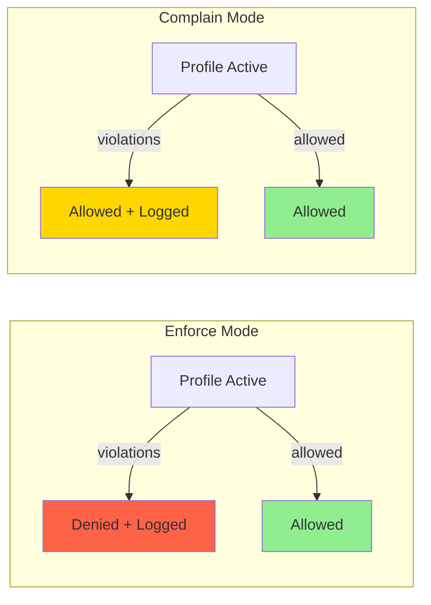
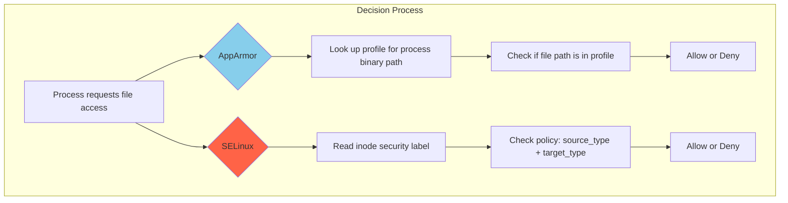

# AppArmor

## Introduction

AppArmor (Application Armor) is a **Linux Security Module (LSM)** implementation that provides Mandatory Access Control (MAC) using a **path-based** security model. Unlike SELinux's label-based approach, AppArmor confines programs by restricting their access to files, network resources, and Linux capabilities through human-readable **profiles**.

Originally developed by Immunix (acquired by Novell in 2005), AppArmor was adopted by Ubuntu as its default MAC system starting with Ubuntu 7.10 (2007). It is also the default on SUSE Linux Enterprise, openSUSE, and is available on Debian. AppArmor was merged into the Linux kernel mainline in version 2.6.36 (October 2010).

AppArmor's philosophy is to be **practical and easy to use**, making security accessible to administrators who may not have deep SELinux expertise. The learning curve is significantly gentler, and the path-based model is more intuitive for many use cases.

## Path-Based vs. Label-Based

The fundamental architectural difference between AppArmor and SELinux:

```mermaid
graph LR
    subgraph "AppArmor (Path-Based)"
        AP[/etc/apparmor.d/usr.sbin.httpd] -->|restricts access to| AFP["/var/www/** r<br/>/var/log/** rw<br/>/etc/passwd r"]
    end

    subgraph "SELinux (Label-Based)"
        SEL[Policy Rules] -->|"allow httpd_t httpd_sys_content_t:file { read }"| SELF[Inode xattr label]
    end

    style AP fill:#87CEEB
    style SEL fill:#FF6347
```

| Aspect | AppArmor | SELinux |
|--------|----------|---------|
| Identification | By **file path** | By **inode label (xattr)** |
| File moved | Restriction follows path | Restriction follows label |
| Symlinks | Profile must handle explicitly | Label inherited from target |
| Hard links | Requires explicit rules | Same label = same access |
| Intuitive? | More (you see paths) | Less (you see types) |

### Practical Implications

```bash
# AppArmor: a profile restricting /usr/sbin/myapp
#   /etc/myapp.conf r,
#   /var/lib/myapp/** rw,
#
# If you MOVE /etc/myapp.conf to /etc/myapp.conf.bak,
# AppArmor still controls /etc/myapp.conf (path-based)
# The new path /etc/myapp.conf.bak is NOT covered by the profile

# SELinux: the label is on the inode
# If you MOVE a file, the label follows it
# If you COPY a file, it gets the destination directory's default label
```

## AppArmor Profiles

### Profile Structure

Profiles are plain text files stored in `/etc/apparmor.d/`. Each profile defines what a program is allowed to do.

```bash
# View a profile
cat /etc/apparmor.d/usr.sbin.httpd
```

A typical profile:

```
# Profile for Apache httpd
#include <tunables/global>

/usr/sbin/httpd {
  #include <abstractions/apache2>
  #include <abstractions/base>
  #include <abstractions/nameservice>

  # Capabilities
  capability net_bind_service,
  capability setuid,
  capability setgid,

  # Network access
  network inet tcp,
  network inet6 tcp,

  # File access
  /etc/apache2/** r,
  /etc/apache2/sites-available/** r,
  /var/www/** r,
  /var/www/html/** rw,
  /var/log/apache2/** rw,
  /var/run/apache2.pid rw,
  /run/apache2/** rw,

  # Deny access to sensitive files
  deny /etc/shadow r,
  deny /etc/gshadow r,

  # Shared libraries
  /lib/x86_64-linux-gnu/** mr,
  /usr/lib/apache2/** mr,

  # Temporary files
  /tmp/** rw,
  owner /tmp/** rw,
}
```

### Profile Syntax Elements

```
# Comments start with #

#include <path/to/file>    — Include another file
#include <abstractions/X>  — Include shared abstractions

/path/to/file r,           — Read access
/path/to/file w,           — Write access
/path/to/file a,           — Append access
/path/to/file l,           — Link access
/path/to/file k,           — Lock access
/path/to/file m,           — Memory-map execute
/path/to/file ix,          — Execute and inherit this profile
/path/to/file px,          — Execute in a new profile (profile transition)
/path/to/file ux,          — Execute unconfined (DANGEROUS)
/path/to/file Pux,         — Execute in profile if available, else unconfined
/path/to/file pix,         — Execute in new profile if available, else inherit

/path/to/dir/ r,           — Read directory listing
/path/to/dir/** r,         — Recursively read
/path/to/dir/* r,          — Read immediate children only

capability X,              — Allow Linux capability X
network inet tcp,          — Allow IPv4 TCP connections
network inet6 dgram udp,   — Allow IPv6 UDP datagrams

signal send,               — Allow sending signals
ptrace,                    — Allow ptrace

owner /path/file r,        — Only allow if the process owns the file

deny /path/file r,         — Explicitly deny (overrides includes)
```

### Abstractions

Abstractions are reusable fragments included by multiple profiles:

```bash
# List available abstractions
ls /etc/apparmor.d/abstractions/
# apache2        cups-client    gnome          nameservice    ssl_certs
# authentication dbus          kde            nis            web-data
# base           dns_resolver  ldap           openssl        X

# View an abstraction
cat /etc/apparmor.d/abstractions/base
# /lib/** mr,
# /usr/lib/** mr,
# /proc/sys/net/** r,
# /etc/ld.so.preload r,
# /etc/ld.so.cache r,
# /etc/ld.so.conf r,
# /run/resolvconf/** r,
# ...
```

## AppArmor Modes

AppArmor profiles operate in two modes:



```bash
# Check profile status
sudo aa-status
# apparmor module is loaded.
# 53 profiles are loaded.
# 53 profiles are in enforce mode.
#    /usr/sbin/cups-browsed
#    /usr/sbin/cupsd
#    /usr/sbin/ntpd
#    /usr/sbin/sshd
#    /usr/sbin/tcpdump
#    ...
# 0 profiles are in complain mode.
# 3 processes have profiles defined.
# 3 processes are in enforce mode.
#    /usr/sbin/cupsd (1234)
#    /usr/sbin/ntpd (5678)
#    /usr/sbin/sshd (9012)
# 0 processes are in complain mode.
# 0 processes are unconfined but have a profile defined.

# Switch a profile to complain mode
sudo aa-complain /usr/sbin/httpd
# Setting /usr/sbin/httpd to complain mode.

# Switch back to enforce mode
sudo aa-enforce /usr/sbin/httpd
# Setting /usr/sbin/httpd to enforce mode.

# Switch ALL profiles to complain mode (for debugging)
sudo aa-complain /etc/apparmor.d/*

# Switch ALL profiles to enforce mode
sudo aa-enforce /etc/apparmor.d/*
```

## Creating Profiles

### Method 1: aa-genprof (Recommended for Beginners)

`aa-genprof` is an interactive tool that creates profiles by watching a program's behavior:

```bash
# Step 1: Start the profiling wizard
sudo aa-genprof /usr/sbin/myapp
# Profiling: /usr/sbin/myapp

# Step 2: In another terminal, exercise the application thoroughly
# - Start/stop it
# - Access all features
# - Try all normal operations

# Step 3: Back in the genprof terminal, it will show detected accesses:
# [S]can system log for AppArmor events
# [F]inish

# Press S to scan
# It will show each access and ask:
#   (A)llow, (D)eny, (I)gnore, (G)lob, (N)ew:
#
# /etc/myapp/config r           → Allow (A)
# /var/lib/myapp/data/** rw     → Allow (A)
# /etc/shadow r                 → Deny (D)
# /tmp/myapp-* rw               → Allow with glob (G) → /tmp/myapp-*

# Step 4: Press F to finish and save the profile
# The profile is saved in /etc/apparmor.d/usr.sbin.myapp
```

### Method 2: aa-logprof (Learning from Logs)

`aa-logprof` creates or updates profiles based on logged AppArmor denials:

```bash
# Run with the application in complain mode for a while
sudo aa-complain /usr/sbin/myapp
# ... use the application ...
# ... AppArmor logs all access in syslog ...

# Now use aa-logprof to review and build the profile
sudo aa-logprof
# Reading log entries from /var/log/syslog.
# Updating AppArmor profiles in /etc/apparmor.d/.
#
# Profile:  /usr/sbin/myapp
# Path:     /var/lib/myapp/data.db
# Mode:     owner rw
# Severity: unknown
#
#  (A)llow / [(D)enied] / (G)lob / Glob with (E)xt / (N)ew / (I)gnore
```

### Method 3: Manual Profile Writing

```bash
# Create a profile manually
sudo tee /etc/apparmor.d/usr.local.bin.myapp << 'EOF'
#include <tunables/global>

/usr/local/bin/myapp {
  #include <abstractions/base>
  #include <abstractions/nameservice>

  # Capabilities
  capability net_bind_service,

  # Network
  network inet tcp,

  # Application files
  /etc/myapp/ r,
  /etc/myapp/** r,
  /var/lib/myapp/ r,
  /var/lib/myapp/** rw,
  /var/log/myapp/** rw,
  /var/run/myapp.pid rw,

  # Shared libraries
  /usr/local/lib/myapp/** mr,

  # Temporary files
  owner /tmp/myapp-* rw,

  # Deny sensitive access
  deny /etc/shadow rw,
  deny /etc/gshadow rw,
  deny /proc/*/mem rw,
}
EOF

# Load the profile
sudo apparmor_parser -r /etc/apparmor.d/usr.local.bin.myapp
```

### Method 4: aa-easyprof (Template-Based)

```bash
# Available on some distros
sudo aa-easyprof --template=unconfined \
  --profile-name=myapp \
  /usr/local/bin/myapp > /etc/apparmor.d/usr.local.bin.myapp

# Templates available:
# default, opensuse, ubuntu
```

## AppArmor Utilities

```bash
# Profile management
sudo aa-enforce /etc/apparmor.d/usr.sbin.httpd    # Set to enforce
sudo aa-complain /etc/apparmor.d/usr.sbin.httpd   # Set to complain
sudo aa-disable /etc/apparmor.d/usr.sbin.httpd    # Unload profile

# Status
sudo aa-status                                      # Full status report

# Parsing
sudo apparmor_parser -r /etc/apparmor.d/usr.sbin.httpd  # Reload profile
sudo apparmor_parser -R /etc/apparmor.d/usr.sbin.httpd  # Remove profile
sudo apparmor_parser -C                                # Check syntax

# Log analysis
sudo aa-logprof                                     # Interactive log analysis
sudo aa-notify -s 1 -v                              # Desktop notifications

# Profile utilities
sudo aa-autodep /usr/local/bin/myapp                # Auto-generate skeleton
sudo aa-cleanprof /etc/apparmor.d/usr.local.bin.myapp  # Clean unused rules

# Debugging
sudo aa-exec -p /usr/sbin/httpd -- /bin/bash        # Run shell in a profile
```

## AppArmor and Containers

AppArmor provides container isolation profiles:

```bash
# Docker's default AppArmor profile
cat /etc/apparmor.d/docker-default
# #include <tunables/global>
# profile docker-default flags=(attach_disconnected,mediate_deleted) {
#   #include <abstractions/base>
#   network,
#   capability,
#   file,
#   umount,
#   deny @{PROC}/* w,   # deny write for all files in /proc
#   deny @{PROC}/{[^1-9],[^1-9][^0-9],[^1-9s][^0-9y][^0-9s],[^1-9s][^0-9][^0-9][^0-9]*}/** w,
#   deny @{PROC}/sysrq-trigger rwklx,
#   deny @{PROC}/mem rwklx,
#   ...
# }

# Use a custom profile with Docker
docker run --security-opt apparmor=my-custom-profile myimage

# Use unconfined (NOT recommended for production)
docker run --security-opt apparmor=unconfined myimage

# Check which profile a container is using
docker inspect --format='{{.AppArmorProfile}}' container_name
```

### Podman and AppArmor

```bash
# Podman also supports AppArmor
podman run --security-opt apparmor=my-profile myimage

# Check the profile
podman inspect --format='{{.AppArmorProfile}}' container_name
```

## Denial Analysis

### Reading AppArmor Log Entries

```bash
# AppArmor logs to syslog/journal
sudo journalctl -k | grep apparmor | tail -20
# Jul 21 10:00:00 server kernel: audit: type=1400 audit(1690000000.000:123):
#   apparmor="DENIED" operation="open" profile="/usr/sbin/myapp"
#   name="/etc/shadow" pid=1234 comm="myapp"
#   requested_mask="r" denied_mask="r" fsuid=1000 ouid=0

# Breakdown:
# apparmor="DENIED"    — The access was denied
# operation="open"     — The system call
# profile="/usr/sbin/myapp" — The confined program
# name="/etc/shadow"   — The target file
# pid=1234             — Process ID
# comm="myapp"         — Process name
# requested_mask="r"   — What was requested
# denied_mask="r"      — What was denied
# fsuid=1000           — Filesystem UID
# ouid=0               — Owner UID of the file

# Using aa-logprof to process denials interactively
sudo aa-logprof

# Using aa-notify for desktop notifications
sudo apt install apparmor-notify
sudo aa-notify -s 1 -v
```

### Common Denial Patterns

```bash
# File access denied — add to profile:
# /path/to/file r,       # Read
# /path/to/file rw,      # Read + write
# /path/to/dir/** rw,    # Recursive

# Capability denied — add:
# capability net_bind_service,   # Bind to ports < 1024
# capability chown,              # Change file ownership

# Network denied — add:
# network inet tcp,              # IPv4 TCP
# network inet6 dgram udp,       # IPv6 UDP

# Signal denied — add:
# signal (send) set=(term, kill),

# Ptrace denied — add:
# ptrace (read, trace) peer=/usr/sbin/myapp,
```

## AppArmor and File System Interactions

### Bind Mounts and AppArmor

```bash
# AppArmor profiles are path-based, so bind mounts can affect policy
# If you bind-mount /host/config to /container/config:
#   - The profile must allow access to /container/config
#   - NOT /host/config (that's a different path)

# Example Docker scenario:
# docker run -v /host/data:/app/data myimage
# AppArmor profile needs: /app/data/** rw,
# NOT: /host/data/** rw,
```

### Network File Systems

```bash
# NFS and CIFS mounts may not have xattr support
# AppArmor handles this by being path-based (no xattrs needed)
# This is an advantage over SELinux for NFS-mounted filesystems

# However, special care is needed for:
# - NFS root squash (nobody user)
# - CIFS user mapping
```

## Advanced AppArmor Features

### Hat (Profile Transitions)

Profiles can define "hats" — sub-profiles for privilege separation:

```
/usr/sbin/myapp {
  #include <abstractions/base>

  # Default: limited access
  /etc/myapp/config r,
  /var/lib/myapp/** rw,

  # Hat for privileged operations
  ^privileged_ops {
    capability chown,
    capability fowner,
    /etc/myapp/admin/** rw,
    /var/lib/myapp/admin/** rw,
  }
}
```

```bash
# The application transitions to a hat programmatically:
# aa_change_hat("myapp//privileged_ops", magic_token);

# After the privileged operation, transition back:
# aa_change_hat(NULL, magic_token);  // back to main profile
```

### Profile Namespacing

```bash
# Profiles can be namespaced for multi-tenancy
# namespace=tenant1 /usr/sbin/myapp { ... }
# namespace=tenant2 /usr/sbin/myapp { ... }
```

### Conditional Profiles

```
# Using tunables for conditional behavior
# /etc/apparmor.d/tunables/myapp

@{myapp_datadir}=/var/lib/myapp
@{myapp_logdir}=/var/log/myapp

# In the profile:
#include <tunables/myapp>

/usr/sbin/myapp {
  @{myapp_datadir}/** rw,
  @{myapp_logdir}/** rw,
}
```

## AppArmor vs. SELinux: Deep Comparison



| Feature | AppArmor | SELinux |
|---------|----------|---------|
| **Model** | Path-based | Label-based (xattr) |
| **Profile language** | Simple, readable | Complex TE/RBAC/MLS |
| **Learning curve** | Moderate | Steep |
| **Default distros** | Ubuntu, SUSE, Debian | RHEL, Fedora, Android |
| **File renames** | New path = new rules | Label follows inode |
| **Hard links** | Must be explicit | Same label = same rules |
| **Symlinks** | Must be explicit | Follows target label |
| **NFS/CIFS** | Works well (path-based) | Needs xattr support |
| **Container support** | Good (docker-default profile) | Excellent (MCS categories) |
| **MLS/MCS** | No native support | Full MLS/MCS support |
| **RBAC** | Basic | Full RBAC framework |
| **Policy generation** | Easy (aa-genprof) | Harder (audit2allow) |
| **Runtime updates** | Easy (apparmor_parser) | More involved |
| **Unconfined processes** | Must be explicitly set | Default for targeted policy |

### When to Choose AppArmor

- Your team is new to MAC and needs quick results
- You're running Ubuntu or SUSE
- Your application uses many symlinks or bind mounts
- You need path-specific restrictions (not type-based)
- Simplicity and maintainability are priorities

### When to Choose SELinux

- You need Multi-Level Security (MLS/MCS)
- You need fine-grained type separation
- Container isolation with unique category labels
- Government/compliance requirements (STIG, Common Criteria)
- You have the expertise to manage complex policies

## References

- [The Linux Kernel Documentation](https://docs.kernel.org/)
- [LWN.net - Linux and free software news](https://lwn.net/)
- [GNU Project Documentation](https://www.gnu.org/doc/doc.html)
- [GNU Manuals](https://www.gnu.org/manual/manual.html)
- [Free Software Directory](https://directory.fsf.org/wiki/Main_Page)
- [Planet GNU](https://planet.gnu.org/)
- [Free Software Books](https://www.gnu.org/doc/other-free-books.html)

- AppArmor Project: https://apparmor.net/
- AppArmor Wiki: https://gitlab.com/apparmor/apparmor/-/wikis/home
- Ubuntu AppArmor Documentation: https://ubuntu.com/server/docs/security-apparmor
- openSUSE AppArmor Guide: https://doc.opensuse.org/documentation/leap/security/html/book-security/cha-apparmor.html
- AppArmor Kernel Documentation: https://www.kernel.org/doc/html/latest/admin-guide/LSM/apparmor.html
- `man 5 apparmor.d` — AppArmor profile syntax
- `man 7 apparmor` — AppArmor security module
- `man 8 aa-genprof` — Profile generation tool
- `man 8 aa-logprof` — Log-based profile learning
- `man 8 apparmor_parser` — Profile loading and management
- AppArmor abstractions: https://gitlab.com/apparmor/apparmor/-/tree/master/profiles/apparmor.d/abstractions

## Related Topics

- [Linux Security Overview](./overview.md) — Where AppArmor fits in the security architecture
- [SELinux](./selinux.md) — Alternative label-based MAC implementation
- [Security Model](./security-model.md) — Traditional Unix DAC that AppArmor augments
- [Seccomp](./seccomp.md) — Syscall filtering used alongside AppArmor
- [Capabilities](./capabilities.md) — Fine-grained privileges referenced in profiles
- [Hardening](./hardening.md) — General hardening including AppArmor configuration
