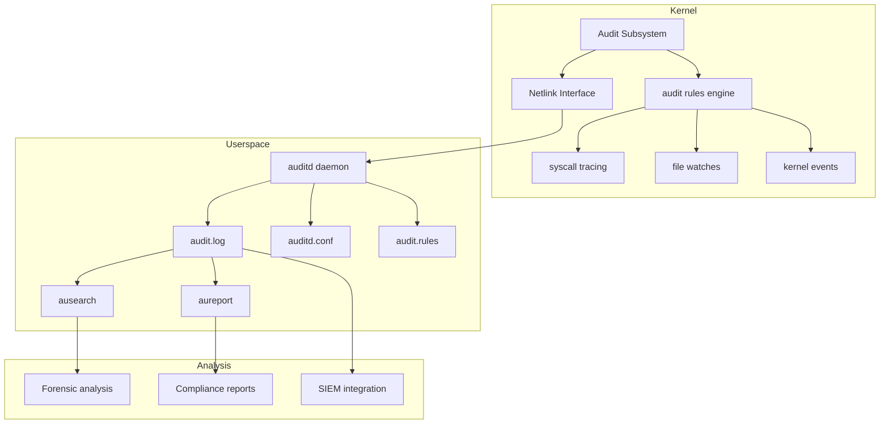
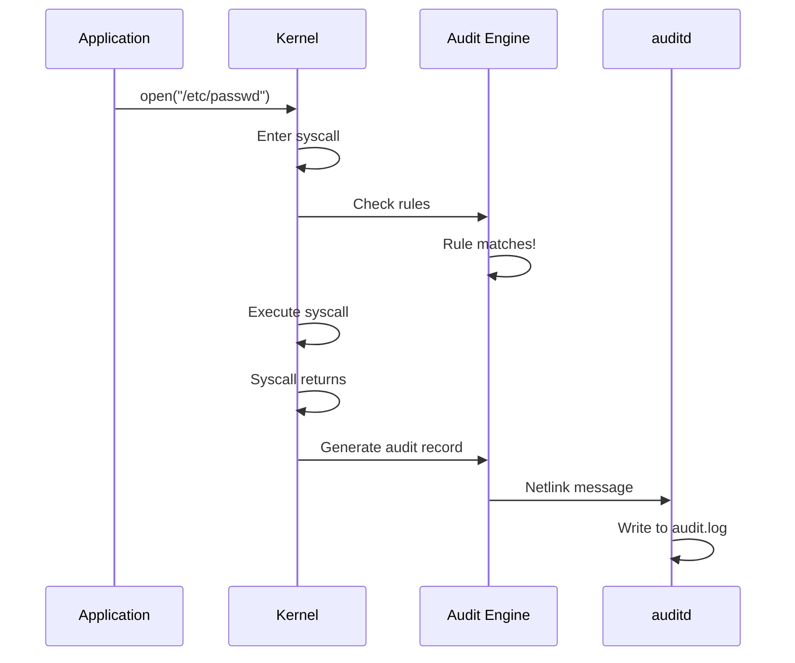

# Linux Audit Framework

## Introduction

The Linux Audit Framework provides a comprehensive system for tracking security-relevant events on a Linux system. It records who did what, when, and how—creating an audit trail that can be used for compliance (PCI-DSS, HIPAA, SOX), security forensics, intrusion detection, and accountability.

The audit subsystem is built into the kernel and controlled by the **auditd** daemon in userspace. It can monitor file access, system calls, user authentication, network connections, and virtually any kernel event.

## Architecture



## Components

### Kernel Audit Subsystem

The kernel audit code:
- Intercepts system calls based on configured rules.
- Generates audit records and sends them via **netlink** to userspace.
- Monitors file system events (file watches).
- Tracks kernel-level events (module loading, network changes).

### auditd: The Audit Daemon

`auditd` is the userspace daemon that:
- Receives audit records from the kernel via netlink.
- Writes records to `/var/log/audit/audit.log`.
- Manages log rotation and size limits.
- Executes dispatcher programs for real-time processing.

```bash
# Start/stop auditd
systemctl start auditd
systemctl stop auditd
systemctl status auditd

# Check if auditd is running
auditctl -s
```

### Configuration: auditd.conf

```ini
# /etc/audit/auditd.conf

# Log file location
log_file = /var/log/audit/audit.log

# Log format: RAW or NOLOG
log_format = RAW

# Flush policy: incremental, incremental_async, data, sync
flush = INCREMENTAL_ASYNC

# Max log file size (MB) before rotation
max_log_file = 50

# Number of rotated log files to keep
num_logs = 10

# Action when disk is full
disk_full_action = SUSPEND
disk_error_action = SUSPEND

# Priority boost for auditd
priority_boost = 4

# Dispatcher program
dispatcher = /sbin/audispd
```

## Audit Rules

Rules define what the audit system monitors. There are three types:

### Control Rules

Control rules configure the audit system itself:

```bash
# Enable/disable auditing
auditctl -e 1          # Enable
auditctl -e 0          # Disable

# Set backlog limit
auditctl -b 8192       # Max 8192 pending events

# Set failure mode
auditctl -f 1          # 1=printk, 2=panic

# Set rate limit
auditctl -r 100        # Max 100 audit records per second

# Set backlog wait time
auditctl -c            # Continue on backlog
```

### File Watch Rules

Monitor specific files and directories:

```bash
# Watch a file for any access
auditctl -w /etc/passwd -p rwxa -k passwd_changes

# Watch a directory recursively
auditctl -w /etc/ssh/ -p wa -k ssh_config

# -p flags: r=read, w=write, x=execute, a=attribute change
# -k key: tag for searching with ausearch

# Watch for specific operations
auditctl -w /etc/shadow -p wa -k shadow_mod
auditctl -w /var/log/ -p wa -k log_access
```

### System Call Rules

Monitor specific system calls:

```bash
# Monitor all calls to open() for a specific UID
auditctl -a always,exit -F arch=b64 -S open -S openat -F uid=1000 -k user_files

# Monitor file deletion
auditctl -a always,exit -F arch=b64 -S unlink -S unlinkat -S rename -S renameat -k file_delete

# Monitor network connections
auditctl -a always,exit -F arch=b64 -S connect -k network_connect

# Monitor process execution
auditctl -a always,exit -F arch=b64 -S execve -k exec_log

# Monitor privilege changes
auditctl -a always,exit -F arch=b64 -S setuid -S setgid -S setreuid -S setregid -k priv_escalation

# Monitor module loading
auditctl -a always,exit -F arch=b64 -S init_module -S finit_module -S delete_module -k modules
```

### Rule Syntax

```
auditctl -a <action>,<list> -S <syscall> -F <field=value> -k <key>

Action: always (always create record), never (never create)
List:   exit (syscall exit), entry (syscall entry), task (task creation), user (user-space)
Arch:   b64 (64-bit), b32 (32-bit)
Syscall: syscall name or number
Field:  uid, gid, pid, subj_type, path, etc.
Key:    Tag for searching
```

### Persistent Rules

For rules to survive reboots, add them to `/etc/audit/rules.d/audit.rules`:

```bash
# /etc/audit/rules.d/audit.rules

# Delete all existing rules
-D

# Set buffer size
-b 8192

# Monitor authentication files
-w /etc/passwd -p wa -k identity
-w /etc/shadow -p wa -k identity
-w /etc/group -p wa -k identity
-w /etc/gshadow -p wa -k identity
-w /etc/sudoers -p wa -k sudoers

# Monitor network configuration
-w /etc/hosts -p wa -k network
-w /etc/sysconfig/network -p wa -k network

# Monitor SSH configuration
-w /etc/ssh/sshd_config -p wa -k sshd

# Monitor cron
-w /etc/crontab -p wa -k cron
-w /etc/cron.d/ -p wa -k cron
-w /var/spool/cron/ -p wa -k cron

# Monitor user/group management
-a always,exit -F arch=b64 -S open -F path=/etc/passwd -F a!=40000000 -k passwd_mod
-a always,exit -F arch=b64 -S open -F path=/etc/shadow -k shadow_mod

# Monitor process execution
-a always,exit -F arch=b64 -S execve -k exec

# Monitor privilege changes
-a always,exit -F arch=b64 -S setuid -S setgid -S setreuid -S setregid -k priv_mod

# Monitor kernel module loading
-a always,exit -F arch=b64 -S init_module -S finit_module -S delete_module -k modules

# Monitor time changes
-a always,exit -F arch=b64 -S adjtimex -S settimeofday -S clock_settime -k time

# Monitor file access (critical files)
-a always,exit -F arch=b64 -S truncate -S ftruncate -F exit=-EACCES -k access
-a always,exit -F arch=b64 -S truncate -S ftruncate -F exit=-EPERM -k access
```

```bash
# Load rules from file
augenrules --load

# Verify rules
auditctl -l
```

## ausearch: Querying Audit Logs

`ausearch` queries the audit log for specific events:

### Basic Searches

```bash
# Search by key
ausearch -k passwd_changes

# Search by syscall
ausearch -sc open

# Search by UID
ausearch -ui 1000

# Search by time range
ausearch --start today
ausearch --start 01/01/2024 --end 01/31/2024

# Search by event type
ausearch -m USER_AUTH      # Authentication events
ausearch -m USER_CMD       # User commands
ausearch -m AVC            # SELinux AVC denials
ausearch -m SYSCALL        # System call events
ausearch -m EXECVE         # Process executions

# Search by PID
ausearch -pid 1234

# Combine filters
ausearch -k exec -ui 1000 --start today

# Output format
ausearch -k passwd_changes -i  # Interpret UIDs, etc.
```

### Practical Examples

```bash
# Who modified /etc/passwd?
ausearch -k passwd_changes -i

# What commands did user 1000 run?
ausearch -m USER_CMD -ui 1000 -i

# All failed system calls
ausearch -m SYSCALL -sv no -i

# All file deletions
ausearch -k file_delete -i

# All SSH logins
ausearch -m USER_LOGIN -sv yes -i

# All sudo usage
ausearch -m USER_CMD -k sudoers -i

# Processes that failed to open files
ausearch -m SYSCALL -sc openat -sv ENOENT -i
```

### Audit Record Format

```
type=SYSCALL msg=audit(1704067200.123:456): arch=c000003e syscall=2 
  success=yes exit=3 a0=7ffc1234 a1=0 a2=1b6 a3=0 items=1 ppid=1000 
  pid=1234 auid=1000 uid=0 gid=0 euid=0 suid=0 fsuid=0 egid=0 
  sgid=0 fsgid=0 tty=pts0 ses=1 comm="cat" exe="/usr/bin/cat" 
  key="passwd_changes"

type=PATH msg=audit(1704067200.123:456): item=0 name="/etc/passwd" 
  inode=12345 dev=08:01 mode=0100644 ouid=0 ogid=0 rdev=00:00 
  nametype=NORMAL cap_fp=0 cap_fi=0 cap_fe=0 cap_fver=0

type=PROCTITLE msg=audit(1704067200.123:456): 
  proctitle="cat /etc/passwd"
```

## aureport: Audit Reporting

`aureport` generates summary reports from audit logs:

```bash
# Overall summary
aureport

# Authentication report
aureport -au

# Login report
aureport -l

# Failed login attempts
aureport -l --failed

# File access report
aureport -f

# System call report
aureport -s

# Executable report
aureport -x

# Account modifications
aureport -m

# Anomaly report (errors, anomalies)
aureport --anomaly

# AVC (SELinux) report
aureport --avc

# Key-based report
aureport -k

# Specific time range
aureport --start today
aureport --start 01/01/2024 --end 01/31/2024

# Summary only
aureport --summary
```

### Example Reports

```bash
$ aureport -l --failed --summary

Failed Login Summary Report
============================
total  file
======
    42  /var/log/wtmp

$ aureport -x --summary

Executable Summary Report
=========================
total  file
======
  1234  /usr/bin/sudo
   567  /usr/bin/su
   890  /usr/bin/ssh

$ aureport --failed

Failed Events Summary Report
============================
Number of failed events: 156
```

## Syscall Auditing Deep Dive

### How Syscall Auditing Works



### Key Syscalls to Audit

| Syscall | Why Audit |
|---------|-----------|
| `execve` | Track all process execution |
| `open/openat` | File access monitoring |
| `unlink/unlinkat/rename` | File deletion/modification |
| `connect` | Network connection tracking |
| `accept` | Incoming network connections |
| `mount/umount` | Filesystem changes |
| `init_module/finit_module` | Kernel module loading |
| `ptrace` | Process debugging (anti-debug) |
| `kill/tgkill` | Signal sending |
| `setuid/setgid` | Privilege changes |
| `capset` | Capability changes |
| `adjtimex/settimeofday` | Time modification |

### SELinux Integration

The audit framework integrates with SELinux for **AVC (Access Vector Cache)** denials:

```bash
# Search for SELinux denials
ausearch -m AVC

# Example AVC denial record
# type=AVC msg=audit(1704067200.456:789): avc: denied { read } for 
#   pid=1234 comm="httpd" name="shadow" dev="sda1" ino=12345 
#   scontext=system_u:system_r:httpd_t:s0 
#   tcontext=system_u:object_r:shadow_t:s0 tclass=file

# Generate allow rules from denials
audit2allow -M mymodule < /var/log/audit/audit.log
```

## Integration with Modern Tooling

### SIEM Integration

```bash
# Forward audit logs to a SIEM (e.g., via audisp)
# /etc/audit/plugins.d/syslog.conf
active = yes
direction = out
type = always
args = LOG_INFO
format = string
```

### Real-time Processing with audisp

```bash
# /etc/audit/audispd.conf
q_depth = 4096
overflow_action = syslog

# Create a dispatcher plugin
# /etc/audit/plugins.d/custom.conf
active = yes
direction = out
type = always
path = /usr/local/bin/audit-dispatcher
args = /var/log/audit/custom.log
format = string
```

### Log Analysis with Modern Tools

```bash
# Convert audit log to JSON
ausearch -i -if /var/log/audit/audit.log | python3 -c "
import sys, json
# Parse and convert to JSON format
"

# Analyze with jq
cat audit.json | jq '.[] | select(.type == "SYSCALL") | {pid, uid, comm, exe}'

# Aggregate by user
cat audit.json | jq 'group_by(.uid) | map({uid: .[0].uid, count: length})'
```

## Compliance and Best Practices

### PCI-DSS Requirements

```bash
# PCI-DSS requires monitoring of:
# - All access to cardholder data
# - All actions by administrators
# - All access to audit logs
# - All invalid access attempts

# Rules for PCI-DSS compliance
-a always,exit -F arch=b64 -S open -S openat -F path=/var/data/cards -k cardholder_access
-w /var/log/audit/ -p wa -k audit_log_mod
-a always,exit -F arch=b64 -S execve -F auid=0 -k root_commands
-a always,exit -F arch=b64 -S open -S openat -F success=0 -k failed_access
```

### Performance Considerations

```bash
# Audit has overhead. Minimize it:
# 1. Be specific with rules (don't audit everything)
# 2. Use keys to filter efficiently
# 3. Set appropriate rate limits
auditctl -r 1000  # Max 1000 records/second

# 4. Use incremental async flush
# auditd.conf: flush = INCREMENTAL_ASYNC

# 5. Monitor audit backlog
auditctl -s | grep backlog
```

## Immutable Rules

For high-security environments, rules can be made immutable — once set, they cannot be changed without a reboot:

```bash
# Make rules immutable (must be last rule loaded)
auditctl -e 2

# After this, any attempt to change rules fails:
auditctl -w /tmp -p rwxa -k tmpwatch
# Error - rule exists

# Check immutable status
auditctl -s
# enabled 2 (immutable)

# To change immutable rules, you must:
# 1. Edit /etc/audit/rules.d/audit.rules
# 2. Reboot the system
# (There is no way to make rules mutable again without reboot)
```

### When to Use Immutable Rules

- PCI-DSS environments requiring tamper-proof audit configuration
- Systems where the audit configuration must not be modified at runtime
- Compliance environments where audit rule changes should require physical access

## Pre-Built Rule Sets

### auditctl sample rules

The `auditctl` package ships example rules for common compliance frameworks:

```bash
# Find shipped rule examples
ls /usr/share/audit/sample-rules/
# 10-base-config.rules    30-stig.rules
# 11-loginuid.rules       31-privileged.rules
# 12-fail.rules           32-power-abuse.rules
# 13-containers.rules     40-local.rules
# 14-initramfs.rules      41-containers.rules
# 20-dont-audit.rules     42-injection.rules
# 21-no32bit.rules        43-module-load.rules
# 22-ignore-ansible.rules  70-einval.rules
# 23-ignore-remote.rules  99-finalize.rules
# 30-nispom.rules

# Use them:
sudo cp /usr/share/audit/sample-rules/30-stig.rules /etc/audit/rules.d/
sudo augenrules --load
```

### STIG (Security Technical Implementation Guide) Rules

```bash
# 30-stig.rules covers DISA STIG requirements:
# - Monitor all use of setuid/setgid programs
# - Monitor all admin actions
# - Monitor file system mounts
# - Monitor time changes
# - Monitor kernel module loading

# Example STIG rules:
-w /var/run/utmp -p wa -k session
-w /var/log/wtmp -p wa -k session
-w /var/log/btmp -p wa -k session
-a always,exit -F arch=b64 -S execve -C uid!=euid -F euid=0 -k priv_cmd
-a always,exit -F arch=b64 -S open -F dir=/etc -F success=0 -k access
```

### OSPP (Protection Profile for General Purpose OS)

```bash
# 30-ospp-v42.rules — Common Criteria OSPP rules
# More granular than STIG, used for Common Criteria certification

# Key OSPP requirements:
# - Audit all file access failures
# - Audit all privileged command execution
# - Audit all identity changes
# - Audit all network connections
# - Audit all MAC policy decisions
```

## ausearch Output Formats

### Default (Raw) Format

```
type=SYSCALL msg=audit(1704067200.123:456): arch=c000003e syscall=2 
  success=yes exit=3 a0=7ffc1234 a1=0 a2=1b6 a3=0 items=1 ppid=1000 
  pid=1234 auid=1000 uid=0 gid=0 euid=0 suid=0 fsuid=0 egid=0 
  sgid=0 fsgid=0 tty=pts0 ses=1 comm="cat" exe="/usr/bin/cat" 
  key="passwd_changes"
```

### Interpreted Format (-i)

```bash
ausearch -k passwd_changes -i
# Converts numeric UIDs to names, timestamps to dates, architectures to names
```

### JSON-like Export

```bash
# Convert to CSV for analysis
ausearch -k passwd_changes -i --format csv > audit_events.csv

# Use ausearch with ausearch-parse for structured extraction
ausearch -k exec -i | awk '/type=EXECVE/ {for(i=1;i<=NF;i++) if($i~/^argc=/) print $i}'
```

### Real-time Log Monitoring

```bash
# Tail the audit log in real-time
tail -f /var/log/audit/audit.log | ausearch -i --interpret

# Use audispd for real-time dispatching
# /etc/audit/plugins.d/syslog.conf
active = yes
direction = out
type = always
args = LOG_INFO
format = string
```

## OpenSCAP Integration

The audit framework integrates with OpenSCAP for automated compliance scanning:

```bash
# Install OpenSCAP
sudo dnf install openscap-scanner scap-security-guide

# Run an audit-based compliance scan
oscap xccdf eval --profile xccdf_org.ssgproject.content_profile_stig \
    --results results.xml \
    --report report.html \
    /usr/share/xml/scap/ssg/content/ssg-rhel9-ds.xml

# The scanner checks audit rules among other security settings
# Generates a report showing pass/fail for each requirement
```

## Audit Dispatcher (audispd)

The audit dispatcher processes audit events in real-time:

```bash
# /etc/audit/audispd.conf
q_depth = 4096          # Queue depth for pending events
overflow_action = SYSLOG  # What to do when queue is full
max_restarts = 10       # Max plugin restarts
name_format = HOSTNAME  # How to name audit events

# Create a custom dispatcher plugin
# /etc/audit/plugins.d/custom-alerts.conf
active = yes
direction = out
type = always
path = /usr/local/bin/audit-alert
args = /var/log/audit/alerts.log
format = string

# Example: /usr/local/bin/audit-alert
#!/bin/bash
# Read audit events from stdin and alert on specific patterns
while read -r line; do
    if echo "$line" | grep -q "exe=\"/usr/bin/su\""; then
        logger -p auth.warning "AUDIT ALERT: su command detected"
    fi
done
```

## Kernel Audit Internals

### Netlink Protocol

The kernel communicates with auditd via the NETLINK_AUDIT protocol:

```c
/* Creating a netlink audit socket */
int fd = socket(AF_NETLINK, SOCK_RAW, NETLINK_AUDIT);

struct sockaddr_nl addr = {
    .nl_family = AF_NETLINK,
    .nl_pid = getpid(),
    .nl_groups = AUDIT_NLGRP_READLOG  /* Subscribe to audit events */
};

bind(fd, (struct sockaddr *)&addr, sizeof(addr));

/* Receiving audit messages */
char buf[65536];
int len = recv(fd, buf, sizeof(buf), 0);
```

### Audit Backlog

```bash
# Check current backlog
auditctl -s
# backlog 0  backlog_limit 8192  enabled 1  failure 1  pid 1234

# If backlog is growing, either:
# 1. Increase the limit: auditctl -b 16384
# 2. Reduce audit volume (fewer rules)
# 3. Increase auditd processing speed

# Backlog wait time (added in kernel 5.x)
auditctl --backlog_wait_time 5000  # Wait 5 seconds before dropping events
auditctl --backlog_wait_time 0     # Disable wait (default)
```

## Troubleshooting

```bash
# auditd not starting
journalctl -u auditd -n 50

# Rules not loading
auditctl -R /etc/audit/rules.d/audit.rules 2>&1

# Check for rule syntax errors
augenrules --load 2>&1 | grep -i error

# Audit log growing too fast
du -sh /var/log/audit/
# Configure rotation in auditd.conf
# max_log_file = 50
# num_logs = 10

# Lost events (backlog overflow)
grep "audit: backlog" /var/log/audit/audit.log
# Increase backlog: auditctl -b 32768

# SELinux blocking auditd
ausearch -m AVC -ts recent
```

## Further Reading

- [Linux Audit Documentation](https://access.redhat.com/documentation/en-us/red_hat_enterprise_linux/9/html/security_hardening/assembly_overview-of-audit-security-hardening) — Red Hat audit guide
- [auditd.conf man page](https://man7.org/linux/man-pages/man5/auditd.conf.5.html) — Configuration reference
- [auditctl man page](https://man7.org/linux/man-pages/man8/auditctl.8.html) — Rule management
- [ausearch man page](https://man7.org/linux/man-pages/man8/ausearch.8.html) — Log querying
- [aureport man page](https://man7.org/linux/man-pages/man8/aureport.8.html) — Report generation
- [LWN: Audit](https://lwn.net/Articles/292282/) — Audit framework overview
- [Kernel docs: Audit](https://docs.kernel.org/admin-guide/audit.html) — Kernel audit documentation
- [PCI-DSS Audit Requirements](https://www.pcisecuritystandards.org/) — PCI-DSS compliance
- [OpenSCAP](https://www.open-scap.org/) — Automated compliance scanning
- [auditd sample rules](https://github.com/linux-audit/audit-userspace/tree/master/rules) — Upstream rule templates

