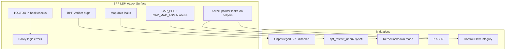

# BPF LSM (Linux Security Module)

## Overview

BPF LSM is a programmable Linux Security Module that allows eBPF programs to implement security policies by attaching to LSM hooks. Introduced in Linux 5.7, BPF LSM enables dynamic, fine-grained security decisions without requiring kernel module development or kernel recompilation. It leverages the eBPF virtual machine to run security programs that can inspect and control kernel operations through the LSM framework.

BPF LSM bridges the gap between static security modules (SELinux, AppArmor) and the flexibility of eBPF. While traditional LSMs require policy files loaded at boot or predefined access control patterns, BPF LSM programs can implement arbitrary logic, access kernel data structures, and be loaded/unloaded at runtime.

## Architecture

### LSM Hook Framework

The LSM framework provides hooks at security-critical points in the kernel:

```c
/* include/linux/lsm_hooks.h */
struct security_hook_heads {
    struct hlist_head binder_set_context_mgr;
    struct hlist_head binder_transaction;
    struct hlist_head ptrace_access_check;
    struct hlist_head cred_prepare;
    struct hlist_head inode_permission;
    struct hlist_head file_open;
    struct hlist_head task_alloc;
    struct hlist_head task_kill;
    /* ... hundreds more hooks ... */
};
```

Each hook is called when the corresponding kernel operation occurs. LSM modules register callbacks for hooks they want to control.

### BPF_PROG_TYPE_LSM

BPF LSM programs use a dedicated program type:

```c
enum bpf_prog_type {
    /* ... */
    BPF_PROG_TYPE_LSM = 23,
    /* ... */
};
```

These programs:
- Attach to LSM hooks via BPF link
- Receive the same arguments as the LSM hook
- Return `0` (allow) or non-zero (deny)
- Can access BPF helpers, maps, and kfuncs
- Run in the context of the calling process

### Attachment Mechanism

BPF LSM programs are attached using BPF links:

```c
/* Pseudocode for attachment */
union bpf_attr attr = {
    .attach_type = BPF_LSM_MAC,
    .target_btf_id = hook_btf_id,  /* BTF ID of the LSM hook */
    .prog_fd = prog_fd,
};
int link_fd = bpf(BPF_LINK_CREATE, &attr, sizeof(attr));
```

The `target_btf_id` specifies which LSM hook to attach to, using BTF (BPF Type Format) type information.

## Writing BPF LSM Programs

### Basic Structure

```c
// lsm_example.bpf.c
#include <vmlinux.h>
#include <bpf/bpf_helpers.h>
#include <bpf/bpf_tracing.h>

SEC("lsm/file_open")
int BPF_PROG(restrict_open, struct file *file, int ret)
{
    /* ret is the return value from previous LSM modules */
    if (ret != 0)
        return ret;  /* Already denied */

    /* Get the file's inode */
    struct inode *inode = file->f_inode;

    /* Check inode properties */
    umode_t mode = inode->i_mode;

    /* Deny opening setuid files */
    if (mode & S_ISUID)
        return -EACCES;

    return 0;  /* Allow */
}

char LICENSE[] SEC("license") = "GPL";
```

### LSM Hook Signatures

Each LSM hook has a specific signature. BPF LSM programs must match:

```c
// inode_permission hook
SEC("lsm/inode_permission")
int BPF_PROG(check_permission, struct inode *inode, int mask, int ret)
{
    // inode: the inode being accessed
    // mask: permission mask (MAY_READ, MAY_WRITE, MAY_EXEC)
    // ret: return from previous LSM
    return ret;  // 0 = allow
}

// task_kill hook
SEC("lsm/task_kill")
int BPF_PROG(restrict_kill, struct task_struct *p,
             struct kernel_siginfo *info, int sig, int ret)
{
    // p: target process
    // sig: signal number
    return ret;  // 0 = allow
}

// bprm_check_security hook (execve)
SEC("lsm/bprm_check_security")
int BPF_PROG(check_exec, struct linux_binprm *bprm, int ret)
{
    // bprm: binary being executed
    return ret;
}
```

### Accessing Task Information

```c
SEC("lsm/file_open")
int BPF_PROG(check_file_open, struct file *file, int ret)
{
    if (ret != 0)
        return ret;

    /* Get current task's PID and UID */
    u64 pid = bpf_get_current_pid_tgid() >> 32;
    u64 uid_gid = bpf_get_current_uid_gid();
    u32 uid = uid_gid & 0xFFFFFFFF;

    /* Get process name */
    char comm[16];
    bpf_get_current_comm(comm, sizeof(comm));

    /* Apply policy based on process */
    if (uid == 1000) {
        /* Special rules for UID 1000 */
    }

    return 0;
}
```

### Using BPF Maps for Policy

```c
#include <vmlinux.h>
#include <bpf/bpf_helpers.h>

/* Map of denied paths */
struct {
    __uint(type, BPF_MAP_TYPE_HASH);
    __uint(max_entries, 256);
    __type(key, u32);      /* Inode number */
    __type(value, u8);     /* Denied flag */
} denied_inodes SEC(".maps");

SEC("lsm/inode_permission")
int BPF_PROG(deny_access, struct inode *inode, int mask, int ret)
{
    if (ret != 0)
        return ret;

    u32 ino = inode->i_ino;
    u8 *denied = bpf_map_lookup_elem(&denied_inodes, &ino);

    if (denied && *denied)
        return -EACCES;

    return 0;
}
```

### BPF LSM with CO-RE (Compile Once, Run Everywhere)

```c
SEC("lsm/file_open")
int BPF_PROG(check_open, struct file *file, int ret)
{
    if (ret != 0)
        return ret;

    /* Use CO-RE to access file path */
    struct path f_path = BPF_CORE_READ(file, f_path);
    struct dentry *dentry = BPF_CORE_READ(&f_path, dentry);
    struct qstr d_name = BPF_CORE_READ(dentry, d_name);

    char name[64];
    bpf_probe_read_kernel_str(name, sizeof(name), d_name.name);

    /* Compare filename */
    char secret[] = "secret.txt";
    if (bpf_strncmp(name, sizeof(secret), secret) == 0)
        return -EPERM;

    return 0;
}
```

## Loading BPF LSM Programs

### Using libbpf

```c
#include "lsm_example.skel.h"

int main(void)
{
    struct lsm_example *skel;

    /* Open and load */
    skel = lsm_example__open_and_load();
    if (!skel) {
        fprintf(stderr, "Failed to open/load BPF program\n");
        return 1;
    }

    /* Attach */
    int err = lsm_example__attach(skel);
    if (err) {
        fprintf(stderr, "Failed to attach BPF program\n");
        lsm_example__destroy(skel);
        return 1;
    }

    printf("BPF LSM program loaded and attached\n");

    /* Keep running */
    while (1) sleep(1);

    lsm_example__destroy(skel);
    return 0;
}
```

### Using bpftool

```bash
# Load a BPF LSM program
bpftool prog load lsm_example.bpf.o /sys/fs/bpf/lsm_example \
    type lsm

# Attach to a hook
bpftool link create /sys/fs/bpf/lsm_link \
    prog /sys/fs/bpf/lsm_example \
    target lsm/file_open

# List loaded LSM programs
bpftool prog list type lsm

# Show attached links
bpftool link list

# Detach/remove
bpftool link detach id <link_id>
bpftool prog detach id <prog_id> type lsm
```

### Using BPF Skeleton

The `bpftool gen skeleton` command generates a C skeleton that simplifies loading:

```bash
# Generate skeleton
bpftool gen skeleton lsm_example.bpf.o > lsm_example.skel.h

# Use in C code (see libbpf example above)
```

## Available LSM Hooks for BPF

BPF LSM can attach to any LSM hook defined in the kernel. Common hooks include:

### File System Hooks

| Hook | Description | Arguments |
|---|---|---|
| `file_open` | File open | `struct file *file` |
| `file_permission` | File access check | `struct file *file, int mask` |
| `inode_permission` | Inode access check | `struct inode *inode, int mask` |
| `inode_create` | File creation | `struct inode *dir, struct dentry *dentry, umode_t mode` |
| `inode_unlink` | File deletion | `struct inode *dir, struct dentry *dentry` |
| `file_ioctl` | ioctl call | `struct file *file, unsigned int cmd, unsigned long arg` |

### Process Hooks

| Hook | Description | Arguments |
|---|---|---|
| `task_alloc` | Task creation | `struct task_struct *task, unsigned long clone_flags` |
| `task_kill` | Signal delivery | `struct task_struct *p, struct kernel_siginfo *info, int sig` |
| `task_prctl` | prctl call | `int option, unsigned long arg2, ...` |
| `bprm_check_security` | Exec check | `struct linux_binprm *bprm` |
| `cred_prepare` | Credential copy | `struct cred *new, const struct cred *old, gfp_t gfp` |

### Network Hooks

| Hook | Description |
|---|---|
| `socket_create` | Socket creation |
| `socket_connect` | Socket connect |
| `socket_bind` | Socket bind |
| `socket_sendmsg` | Send message |
| `socket_recvmsg` | Receive message |

### Capability Hooks

| Hook | Description |
|---|---|
| `capable` | Capability check |
| `bpf` | BPF syscall access |

## Security Decision Patterns

### Path-Based Access Control

```c
SEC("lsm/file_open")
int BPF_PROG(path_policy, struct file *file, int ret)
{
    if (ret != 0) return ret;

    /* Read the file path */
    char path[256];
    struct path f_path = BPF_CORE_READ(file, f_path);
    bpf_d_path(&f_path, path, sizeof(path));

    /* Block access to /etc/shadow for non-root */
    char shadow[] = "/etc/shadow";
    if (bpf_strncmp(path, sizeof(shadow), shadow) == 0) {
        u32 uid = bpf_get_current_uid_gid();
        if (uid != 0)
            return -EACCES;
    }

    return 0;
}
```

### Rate Limiting Syscalls

```c
struct {
    __uint(type, BPF_MAP_TYPE_HASH);
    __uint(max_entries, 1024);
    __type(key, u32);    /* PID */
    __type(value, u64);  /* Last kill timestamp */
} kill_rate SEC(".maps");

SEC("lsm/task_kill")
int BPF_PROG(rate_limit_kill, struct task_struct *p,
             struct kernel_siginfo *info, int sig, int ret)
{
    if (ret != 0) return ret;

    u32 pid = bpf_get_current_pid_tgid() >> 32;
    u64 now = bpf_ktime_get_ns();
    u64 *last = bpf_map_lookup_elem(&kill_rate, &pid);

    if (last) {
        /* Rate limit: max 1 kill per 100ms */
        if (now - *last < 100000000ULL)
            return -EPERM;
    }

    bpf_map_update_elem(&kill_rate, &pid, &now, BPF_ANY);
    return 0;
}
```

### Capability-Based Restrictions

```c
SEC("lsm/capable")
int BPF_PROG(restrict_cap, const struct cred *cred,
             struct user_namespace *targ_ns,
             int cap, int audit, int ret)
{
    if (ret != 0) return ret;

    /* Deny CAP_SYS_ADMIN for specific processes */
    if (cap == CAP_SYS_ADMIN) {
        char comm[16];
        bpf_get_current_comm(comm, sizeof(comm));
        char target[] = "untrusted_app";
        if (bpf_strncmp(comm, sizeof(target), target) == 0)
            return -EPERM;
    }

    return 0;
}
```

## Interaction with Other LSMs

BPF LSM can coexist with other LSMs (SELinux, AppArmor, etc.). The LSM framework calls hooks in registration order:

1. All registered LSM callbacks are invoked
2. A deny (non-zero return) from any LSM prevents the operation
3. BPF LSM hooks can check the `ret` parameter (result from previous LSMs)

```c
SEC("lsm/file_open")
int BPF_PROG(extra_check, struct file *file, int ret)
{
    /* If SELinux already denied, respect that */
    if (ret != 0)
        return ret;

    /* Additional BPF-based check */
    return my_custom_check(file);
}
```

### Loading Order

```bash
# Check active LSMs
cat /sys/kernel/security/lsm
# Example output: lockdown,capability,yama,apparmor,bpf

# BPF LSM must be in the list for BPF_PROG_TYPE_LSM to work
# Add via boot parameter:
# lsm=lockdown,capability,yama,apparmor,bpf
```

## Privileges and Security

### Required Capabilities

Loading BPF LSM programs requires:
- `CAP_BPF` — to load BPF programs
- `CAP_MAC_ADMIN` — to attach to LSM hooks (MAC = Mandatory Access Control)

```bash
# Run with sufficient privileges
sudo ./lsm_program

# Or use capabilities
sudo setcap cap_bpf,cap_mac_admin+ep ./lsm_program
```

### Unprivileged BPF LSM

BPF LSM requires privileges and cannot be used by unprivileged users. This is by design — security policy enforcement must be trustworthy.

### Security of BPF LSM Programs

- BPF verifier ensures programs cannot crash the kernel
- BPF LSM programs cannot leak kernel memory
- Programs are attached by privileged users only
- Maps can be pinned to `/sys/fs/bpf/` for persistence
- BPF LSM programs are removed when the loading process exits (unless pinned)

## Debugging BPF LSM

### Verifier Logs

```bash
# Load with verbose verifier output
bpftool prog load lsm_example.bpf.o /sys/fs/bpf/test type lsm -d

# Or programmatically
# libbpf_set_print(libbpf_print_fn);
# attr.log_level = 1;
```

### Tracing BPF LSM Execution

```bash
# Enable BPF LSM tracepoints
echo 1 > /sys/kernel/debug/tracing/events/bpf/bpf_prog/enable

# Watch LSM hook calls
bpftrace -e 'lsm:file_open { printf("%s opened file\n", comm); }'
```

### Common Errors

| Error | Cause | Solution |
|---|---|---|
| `EINVAL` on attach | Invalid target BTF ID | Check BTF data; ensure kernel has BTF |
| `EPERM` on load | Insufficient capabilities | Use `CAP_BPF` + `CAP_MAC_ADMIN` |
| Verifier rejection | Unsafe program | Fix verifier errors in output |
| Hook not found | BPF LSM not in LSM list | Add `bpf` to `lsm=` boot parameter |

## Performance

BPF LSM has minimal overhead:
- Hook invocation: ~10-50ns per call (BPF program execution)
- No context switch (runs in caller's context)
- Map lookups: O(1) for hash maps
- Compared to SELinux: similar or lower overhead for simple policies

## Threat Model

### What BPF LSM Protects Against

| Threat | Mitigation |
|--------|------------|
| Unauthorized file access | Path-based allow/deny lists |
| Container escape | Cgroup-scoped policies on task/exec hooks |
| Privilege escalation | Capability restrictions via `capable` hook |
| Network exfiltration | `socket_connect` filtering by destination |
| Malicious binary execution | Exec allowlists via `bprm_check_security` |
| Signal abuse | Rate-limiting via `task_kill` |

### What BPF LSM Does NOT Protect Against

| Limitation | Explanation |
|------------|-------------|
| Kernel exploits | BPF LSM runs inside the kernel; kernel bugs can bypass it |
| BPF verifier bypass | If the verifier has bugs, malicious programs can be loaded |
| Denial of service | A buggy BPF LSM program can block legitimate operations |
| Hardware attacks | No protection against cold-boot, DMA, or physical access |
| Policy bypass via CAP_BPF | Users with CAP_BPF + CAP_MAC_ADMIN can load/replace policies |

### Attack Surface of BPF LSM



**Key mitigations in the kernel:**
- **BPF verifier** (`kernel/bpf/verifier.c`): Ensures programs terminate, don't access arbitrary memory, and don't leak pointers.
- **Unprivileged BPF restriction**: `kernel.unprivileged_bpf_disabled=1` prevents unprivileged BPF usage.
- **Kernel lockdown mode**: Prevents BPF programs from accessing kernel memory even with `CAP_BPF`.
- **KASLR**: Makes kernel address guessing harder for BPF-based exploits.

## Production Use: Tetragon and Falco

### Tetragon (Cilium)

Tetragon uses BPF LSM for real-time enforcement in Kubernetes:

```yaml
# Tetragon TracingPolicy for file access enforcement
apiVersion: cilium.io/v1alpha1
kind: TracingPolicy
metadata:
  name: restrict-sensitive-files
spec:
  kprobes:
  - call: "fd_install"
    syscall: false
    args:
    - index: 0
      type: int
    - index: 1
      type: "file"
  lsmhooks:
  - hook: "file_open"
    args:
    - index: 0
      type: "file"
    selectors:
    - matchBinaries:
      - operator: NotIn
        values:
        - "/usr/bin/kubectl"
        - "/usr/bin/systemctl"
      matchActions:
      - action: Sigkill
```

### Falco with BPF LSM

Falco can use BPF LSM for syscall interception:

```yaml
# Falco rule using BPF LSM
- rule: Detect Shell in Container
  desc: Detect shell spawning in container
  condition: >
    spawned_process and container and
    proc.name in (bash, sh, zsh)
  output: >
    Shell spawned in container
    (user=%user.name container=%container.name
     shell=%proc.name parent=%proc.pname)
  priority: WARNING
  tags: [container, shell]
```

## Kernel Configuration

```
# Required for BPF LSM
CONFIG_BPF_LSM=y              # BPF LSM support
CONFIG_BPF_SYSCALL=y          # BPF syscall
CONFIG_DEBUG_INFO_BTF=y       # BTF for CO-RE
CONFIG_BPF_JIT=y              # BPF JIT compiler
CONFIG_CGROUP_BPF=y           # BPF cgroup support
CONFIG_NET=y                  # For network hooks
CONFIG_BPF_EVENTS=y           # For tracing integration

# For LSM framework
CONFIG_SECURITY=y             # Security framework
CONFIG_SECURITYFS=y           # /sys/kernel/security
```

## BPF Maps for Policy State

BPF maps provide persistent state for BPF LSM programs:

| Map Type | Use Case | Example |
|----------|----------|---------|
| `BPF_MAP_TYPE_HASH` | Allow/deny lists | Blocked inodes, UIDs |
| `BPF_MAP_TYPE_RINGBUF` | Event logging | Audit trail of denials |
| `BPF_MAP_TYPE_ARRAY` | Counters | Denial counts per UID |
| `BPF_MAP_TYPE_LRU_HASH` | Bounded state | Rate-limiting timestamps |
| `BPF_MAP_TYPE_PERCPU_ARRAY` | Per-CPU counters | Lock-free statistics |

## Hardening BPF LSM Deployments

```bash
# 1. Disable unprivileged BPF
sysctl -w kernel.unprivileged_bpf_disabled=1

# 2. Enable kernel lockdown
echo integrity > /sys/kernel/security/lockdown

# 3. Pin BPF programs to prevent removal
bpftool prog load policy.bpf.o /sys/fs/bpf/policy type lsm

# 4. Use BPF token for delegated loading (Linux 6.9+)
mount -t bpf bpffs /sys/fs/bpf -o delegate_cmds=PROG_LOAD

# 5. Audit BPF program loads
auditctl -a always,exit -F arch=b64 -S bpf -k bpf_load
```

## Further Reading

- **Kernel documentation**: `Documentation/bpf/prog_lsm.rst`
- **BPF LSM patches**: [LWN: BPF LSM](https://lwn.net/Articles/808048/)
- **libbpf documentation**: `https://libbpf.readthedocs.io/`
- **BPF CO-RE**: `Documentation/bpf/btf.rst`
- **Source**: `security/bpf/hooks.c` — BPF LSM hook registration
- **Source**: `kernel/bpf/bpf_lsm.c` — BPF LSM program type
- **Source**: `security/security.c` — LSM framework
- **Related**: [eBPF Overview](../bpf/ebpf.md) — eBPF fundamentals
- **Related**: [SELinux](./selinux.md) — alternative LSM
- **Related**: [AppArmor](./apparmor.md) — alternative LSM
- **Related**: [BPF Verifier](../bpf/verifier.md) — program verification
