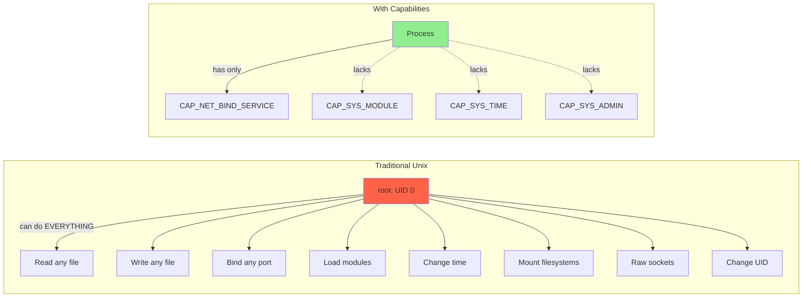
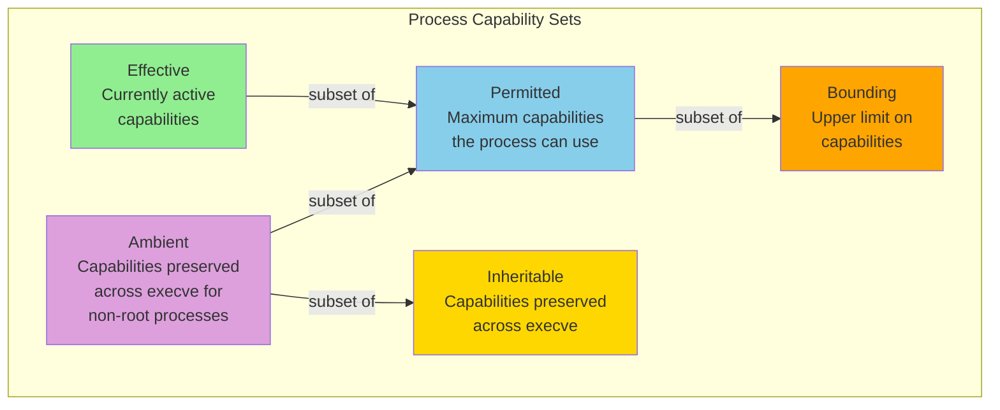
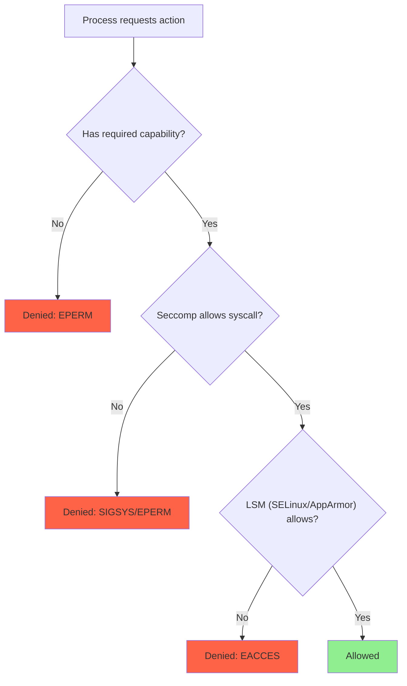

# Linux Capabilities

## Introduction

Traditional Unix security has a binary privilege model: a process either runs as root (UID 0) with full system access, or as an unprivileged user with restricted access. This all-or-nothing approach violates the principle of least privilege — a web server that needs to bind to port 80 shouldn't also be able to load kernel modules or change system time.

Linux **capabilities** solve this by dividing the monolithic root privilege into approximately 40 distinct, fine-grained permissions. A process can have specific capabilities without being fully root. This is a fundamental building block for container security, service hardening, and privilege separation.

The capabilities system was designed by Andrew Morgan and integrated into Linux 2.2 (1999). It has been extended significantly since then, and is now used extensively by container runtimes, systemd services, and security-conscious applications.

## The Problem with Root



## Capability Sets

Each process has **five** capability sets, each serving a different purpose:


### Capability Set Details

| Set | Symbol | Description |
|-----|--------|-------------|
| **Effective** | `e` | The capabilities currently used by the kernel for permission checks. Think of this as "capabilities in effect right now." |
| **Permitted** | `p` | The maximum capabilities this process can ever have in the effective set. A process can raise effective from permitted, or lower it. |
| **Inheritable** | `i` | Capabilities that can be inherited across `execve()`. Combined with the file's inheritable set. |
| **Bounding** | `B` | An upper limit on all capabilities. Once a capability is removed from the bounding set, it can never be regained (even by root). |
| **Ambient** | `a` | Capabilities that are automatically added to the permitted and effective sets of a non-root process after `execve()`. Added in Linux 4.3. |

### How Capabilities Are Determined on execve()

When a process executes a new program, the new capability sets are calculated:

```P'(permitted)   = (P(inheritable) & F(inheritable)) |
                  (F(permitted) & P(bounding)) |
                  P'(ambient)

P'(effective)   = F(effective) ? P'(permitted) : P'(ambient)

P'(inheritable) = P(inheritable)

P'(bounding)    = P(bounding)

P'(ambient)     = P(ambient) & P(permitted) & P(inheritable) & F(inheritable)
                  (cleared if any of: setpcap, uid change, or !F(effective))
```

Where:
- `P` = old process capabilities
- `F` = file capabilities
- `P'` = new process capabilities

## Available Capabilities

```bash
# List all capabilities
man capabilities
# Or from the kernel source:
# include/uapi/linux/capability.h

# Common capabilities:
```

| Capability | Description | Typical Use |
|-----------|-------------|-------------|
| `CAP_CHOWN` | Change file ownership | File management services |
| `CAP_DAC_OVERRIDE` | Bypass DAC read/write checks | Backup utilities |
| `CAP_DAC_READ_SEARCH` | Bypass DAC read checks | Search services |
| `CAP_FOWNER` | Bypass owner permission checks | File servers |
| `CAP_FSETID` | Set SGID/SUID bits | Build systems |
| `CAP_KILL` | Send signals to any process | Process managers |
| `CAP_SETGID` | Set GID arbitrarily | Login processes |
| `CAP_SETUID` | Set UID arbitrarily | Login processes, suid helpers |
| `CAP_SETPCAP` | Modify capability sets | Capability-aware services |
| `CAP_NET_BIND_SERVICE` | Bind to ports < 1024 | Web servers, DNS servers |
| `CAP_NET_BROADCAST` | Broadcast to network | (Rarely used) |
| `CAP_NET_ADMIN` | Network administration | Firewall tools, VPNs |
| `CAP_NET_RAW` | Raw sockets, packet crafting | ping, tcpdump |
| `CAP_IPC_LOCK` | Lock shared memory | Databases (PostgreSQL, MySQL) |
| `CAP_IPC_OWNER` | Bypass IPC ownership checks | (Rarely used directly) |
| `CAP_SYS_MODULE` | Load/unload kernel modules | modprobe, insmod |
| `CAP_SYS_RAWIO` | Raw I/O port access | Hardware drivers |
| `CAP_SYS_CHROOT` | Use chroot() | Chroot jails |
| `CAP_SYS_PTRACE` | Trace any process | Debuggers, strace |
| `CAP_SYS_ADMIN` | Catch-all privileged ops | Mount, namespaces, etc. |
| `CAP_SYS_BOOT` | Reboot the system | init, systemd |
| `CAP_SYS_NICE` | Change process priorities | Scheduler, real-time apps |
| `CAP_SYS_RESOURCE` | Override resource limits | Resource managers |
| `CAP_SYS_TIME` | Set system clock | ntpd, chronyd |
| `CAP_SYS_TTY_CONFIG` | Configure TTY devices | getty, login |
| `CAP_MKNOD` | Create device files | udev |
| `CAP_LEASE` | Establish file leases | NFS server |
| `CAP_AUDIT_WRITE` | Write to audit log | auditd |
| `CAP_AUDIT_CONTROL` | Configure audit system | auditd |
| `CAP_SETFCAP` | Set file capabilities | setcap utility |
| `CAP_MAC_OVERRIDE` | Bypass MAC checks | SELinux policy management |
| `CAP_MAC_ADMIN` | Configure MAC | SELinux/AppArmor admin |
| `CAP_SYSLOG` | Access kernel syslog | dmesg, syslog |
| `CAP_WAKE_ALARM` | Set wake alarms | suspend/hibernate |
| `CAP_BLOCK_SUSPEND` | Block system suspend | Power management |
| `CAP_PERFMON` | Performance monitoring | perf, tracepoints (Linux 5.8+) |
| `CAP_BPF` | BPF operations | bpftool, BPF programs (Linux 5.8+) |
| `CAP_CHECKPOINT_RESTORE` | Checkpoint/restore | CRIU (Linux 5.9+) |

## Working with Capabilities

### Viewing Process Capabilities

```bash
# View capabilities of the current process
cat /proc/self/status | grep -i cap
# CapInh: 0000000000000000
# CapPrm: 00000000a80425fb
# CapEff: 00000000a80425fb
# CapBnd: 00000000a80425fb
# CapAmb: 0000000000000000

# Decode the hex values
capsh --decode=00000000a80425fb
# 0x00000000a80425fb=cap_chown,cap_dac_override,cap_fowner,cap_fsetid,
# cap_kill,cap_setgid,cap_setuid,cap_setpcap,cap_net_bind_service,
# cap_net_raw,cap_sys_chroot,cap_sys_ptrace,cap_audit_write,cap_setfcap

# View capabilities of a specific process
cat /proc/$(pgrep sshd)/status | grep -i cap

# The capsh utility decodes capabilities
capsh --print
# Current: cap_chown,cap_dac_override,...=ep
# Bounding set = cap_chown,cap_dac_override,...
# Securebits: 00/0x0/1'b0
#  secure-noroot: no (unlocked)
#  no-setuid-fixup: no (unlocked)
#  no-uid-fixup: no (unlocked)
#  locked: no
# AmbientCapabilities=
```

### Setting File Capabilities

```bash
# Grant specific capabilities to a binary
sudo setcap cap_net_bind_service+ep /usr/bin/myapp
#                                         ^^^
#                                         e = effective, p = permitted

# Verify
getcap /usr/bin/myapp
# /usr/bin/myapp cap_net_bind_service=ep

# Grant multiple capabilities
sudo setcap cap_net_bind_service,cap_net_raw+ep /usr/bin/myapp

# Set with inheritance
sudo setcap cap_net_bind_service+ei /usr/bin/myapp
#                                      ^^
#                                      e = effective, i = inheritable

# Remove all capabilities
sudo setcap -r /usr/bin/myapp

# Find all files with capabilities
getcap -r / 2>/dev/null
# /usr/bin/ping cap_net_raw=ep
# /usr/bin/traceroute.iputils cap_net_raw=ep
# /usr/lib/openssh/ssh-keysign cap_dac_read_search=ep

# Set capabilities on a script (NOT directly supported)
# Capabilities only work on ELF binaries, not scripts
# Use a wrapper C program or use systemd capabilities instead
```

### Capability Syntax

```
cap_name+flags    — Add capabilities
cap_name-flags    — Remove capabilities
cap_name=flags    — Set exact capabilities

flags:
  e = effective
  p = permitted
  i = inheritable

Special names:
  all+ep            — All capabilities
  cap_net_bind_service,cap_net_raw+ep  — Multiple specific
```

### The Bounding Set

The bounding set is the **upper limit** on capabilities. Once removed from the bounding set, a capability cannot be regained:

```bash
# View current bounding set
cat /proc/self/status | grep CapBnd
# CapBnd: 0000003fffffffff

# Decode it
capsh --decode=0000003fffffffff
# Shows all 40 capabilities

# Drop a capability from the bounding set (irreversible!)
capsh --drop=cap_sys_module -- -c "cat /proc/self/status | grep CapBnd"
# CapBnd: 0000003fffffefff
#                  ^^^^^^^^
#                  cap_sys_module removed

# Common: drop dangerous capabilities for a service
capsh \
  --drop=cap_sys_module,cap_sys_rawio,cap_sys_admin,cap_sys_ptrace \
  -- -c "/usr/sbin/myapp"
```

### Ambient Capabilities

Ambient capabilities (Linux 4.3+) allow non-root processes to retain capabilities across `execve()`:

```bash
# Problem: setcap on a binary works, but ambient caps are useful for
# programs that need to exec() other programs while keeping capabilities

# Example: run a program with ambient capabilities
capsh --addamb=cap_net_bind_service -- -c "/usr/local/bin/myserver"
# myserver (and its children) will have cap_net_bind_service

# In a systemd unit:
# [Service]
# AmbientCapabilities=CAP_NET_BIND_SERVICE
# CapabilityBoundingSet=CAP_NET_BIND_SERVICE
```

## systemd and Capabilities

systemd has extensive capability integration:

```ini
# /etc/systemd/system/hardened-web.service
[Unit]
Description=Hardened Web Server

[Service]
Type=simple
ExecStart=/usr/local/bin/mywebserver
User=webserver

# Grant only the capabilities needed
CapabilityBoundingSet=CAP_NET_BIND_SERVICE CAP_CHOWN CAP_SETUID CAP_SETGID
AmbientCapabilities=CAP_NET_BIND_SERVICE

# Drop all other privileges
NoNewPrivileges=true
ProtectSystem=strict
ProtectHome=true
PrivateTmp=true
PrivateDevices=true

# Seccomp complement
SystemCallFilter=@system-service @network-io
SystemCallFilter=~@privileged
```

```bash
# Verify the service's capabilities
systemctl start hardened-web
cat /proc/$(systemctl show hardened-web -p MainPID --value)/status | grep Cap
# CapInh: 0000000000000400
# CapPrm: 0000000000000400
# CapEff: 0000000000000400
# CapBnd: 0000000000000400
# CapAmb: 0000000000000400

capsh --decode=0000000000000400
# 0x0000000000000400=cap_net_bind_service
```

## Capabilities in Containers

Container runtimes use capabilities to limit what containers can do:

```bash
# Docker drops many capabilities by default
# A container gets these by default:
# CAP_CHOWN, CAP_DAC_OVERRIDE, CAP_FSETID, CAP_FOWNER,
# CAP_MKNOD, CAP_NET_RAW, CAP_SETGID, CAP_SETUID,
# CAP_SETFCAP, CAP_SETPCAP, CAP_NET_BIND_SERVICE,
# CAP_SYS_CHROOT, CAP_KILL, CAP_AUDIT_WRITE

# Add a capability
docker run --cap-add NET_ADMIN myimage ip link set eth0 up

# Drop a capability
docker run --cap-drop ALL --cap-add NET_BIND_SERVICE myimage

# Run with all capabilities (UNSAFE — like running as root)
docker run --privileged myimage

# Podman: same interface
podman run --cap-add SYS_TIME myimage date -s "2026-07-21"

# Kubernetes pod security context
# spec:
#   containers:
#   - name: myapp
#     securityContext:
#       capabilities:
#         add: ["NET_BIND_SERVICE"]
#         drop: ["ALL"]
```

### Default Container Capabilities

```bash
# Check what capabilities a running container has
docker exec mycontainer cat /proc/1/status | grep Cap
# CapInh: 00000000a80425fb
# CapPrm: 00000000a80425fb
# CapEff: 00000000a80425fb
# CapBnd: 00000000a80425fb

capsh --decode=00000000a80425fb
# cap_chown,cap_dac_override,cap_fowner,cap_fsetid,
# cap_kill,cap_setgid,cap_setuid,cap_setpcap,
# cap_net_bind_service,cap_net_raw,
# cap_sys_chroot,cap_setfcap,cap_audit_write
```

## Securebits

The **securebits** control how capabilities behave during UID changes:

```bash
# View securebits
capsh --print | grep secure
# Securebits: 00/0x0/1'b0
#  secure-noroot: no (unlocked)
#  no-setuid-fixup: no (unlocked)
#  no-uid-fixup: no (unlocked)
#  locked: no

# Key securebits:
# SECBIT_NOROOT (bit 0):
#   When set, execve() from UID 0 does NOT grant full capabilities
#   This means setuid-root binaries won't get full caps
#
# SECBIT_NOROOT_LOCKED (bit 1):
#   Locks SECBIT_NOROOT — cannot be unset
#
# SECBIT_NO_SETUID_FIXUP (bit 2):
#   Normally, changing UID from non-zero to zero grants all caps
#   Setting this bit prevents that
#
# SECBIT_NO_SETUID_FIXUP_LOCKED (bit 3):
#   Locks the above
#
# SECBIT_KEEP_CAPS (bit 4):
#   Normally, changing from root to non-root drops all caps
#   Setting this bit preserves permitted caps through the transition
#   (Deprecated in favor of ambient capabilities)
```

```bash
# Example: program that drops root but keeps capabilities
capsh --keep=1 --uid=1000 -- -c "cat /proc/self/status | grep Cap"
# CapEff: 0000000000000000   ← effective is cleared (need to raise from permitted)
# CapPrm: 0000003fffffffff   ← permitted is preserved!
```

## Capability-Aware Applications

Well-designed applications drop capabilities they don't need:

```c
/* Example: a network service that binds to port 80 then drops privileges */
#include <stdio.h>
#include <stdlib.h>
#include <unistd.h>
#include <sys/types.h>
#include <sys/socket.h>
#include <netinet/in.h>
#include <sys/prctl.h>
#include <linux/capability.h>
#include <linux/prctl.h>

int main(void) {
    int sock;
    struct sockaddr_in addr;

    /* Phase 1: Bind to privileged port (needs CAP_NET_BIND_SERVICE) */
    sock = socket(AF_INET, SOCK_STREAM, 0);
    addr.sin_family = AF_INET;
    addr.sin_port = htons(80);
    addr.sin_addr.s_addr = INADDR_ANY;
    bind(sock, (struct sockaddr *)&addr, sizeof(addr));

    /* Phase 2: Drop all capabilities except what we need */
    /* Clear effective capabilities */
    prctl(PR_CAP_AMBIENT, PR_CAP_AMBIENT_CLEAR_ALL, 0, 0, 0);

    /* Drop capabilities from bounding set */
    /* This is irreversible — even for child processes */
    /* In practice, use capset() or systemd for fine-grained control */

    /* Phase 3: Optionally drop privileges entirely */
    setgid(65534);   /* nobody */
    setuid(65534);

    /* Phase 4: Listen for connections */
    listen(sock, 128);
    /* Accept connections... */

    return 0;
}
```

### nginx Capability Example

```bash
# Instead of running nginx as root, use capabilities:
sudo setcap cap_net_bind_service+ep /usr/sbin/nginx

# Now nginx can bind to port 80 without root
# But it can't do anything else that root can

# Verify
getcap /usr/sbin/nginx
# /usr/sbin/nginx cap_net_bind_service=ep

# Check it works
sudo -u nginx /usr/sbin/nginx
# Successfully bound to port 80 as non-root!
```

## The Danger of CAP_SYS_ADMIN

`CAP_SYS_ADMIN` is often called "the new root" because it grants an enormous range of privileges:

```bash
# Things CAP_SYS_ADMIN allows:
# - mount() filesystems
# - Create namespaces (mount, UTS, IPC, user, network, PID, cgroup)
# - Use unshare()
# - ioctl() on many devices
# - Perform privileged operations on various subsystems
# - Set hostname/domainname
# - And much more...

# It's often the only capability a container needs to break out
# NEVER give CAP_SYS_ADMIN to a container unless absolutely necessary

# In Kubernetes, it's restricted by PodSecurityPolicy/PSA:
# spec:
#   containers:
#   - name: myapp
#     securityContext:
#       capabilities:
#         drop: ["ALL"]
#         add: ["NET_BIND_SERVICE"]  # Specific, not SYS_ADMIN
```

## Capabilities and seccomp Interaction

Capabilities and seccomp work together:


```bash
# Example: a process has CAP_SYS_MODULE but seccomp blocks init_module()
# → The capability check passes, but seccomp denies it
# Defense in depth: both must allow the action

# systemd combines both:
# [Service]
# CapabilityBoundingSet=           # Drop all capabilities
# SystemCallFilter=@system-service # Seccomp: allow only service syscalls
# NoNewPrivileges=true             # Prevent gaining caps/uid
```

## Debugging Capability Issues

```bash
# "Operation not permitted" (EPERM) often means a missing capability

# Check what capability a program needs
strace -f /usr/bin/myprogram 2>&1 | grep EPERM
# bind(3, {sa_family=AF_INET, sin_port= htons(80), ...}, 16) = -1 EPERM

# → Needs CAP_NET_BIND_SERVICE
sudo setcap cap_net_bind_service+ep /usr/bin/myprogram

# Common error → capability mapping:
# bind() to port < 1024 fails     → CAP_NET_BIND_SERVICE
# mount() fails                    → CAP_SYS_ADMIN
# sethostname() fails              → CAP_SYS_ADMIN
# kill() to other user's process   → CAP_KILL
# changing UID fails               → CAP_SETUID
# changing GID fails               → CAP_SETGID
# opening /dev/mem                 → CAP_SYS_RAWIO
# loading kernel module            → CAP_SYS_MODULE
# setting system time              → CAP_SYS_TIME
# raw socket creation fails        → CAP_NET_RAW
# ptrace() fails                   → CAP_SYS_PTRACE

# Using capsh to test capabilities
sudo capsh --caps="cap_net_bind_service+eip" -- -c "nc -l 80"
# Works! The nc process can bind to port 80

# Using getpcaps to view a process's capabilities
getpcaps $(pgrep sshd)
# 1234: cap_chown,cap_dac_override,cap_fowner,cap_kill,cap_setuid,...
```

## References

- [The Linux Kernel Documentation](https://docs.kernel.org/)
- [GNU Project Documentation](https://www.gnu.org/doc/doc.html)
- [GNU Manuals](https://www.gnu.org/manual/manual.html)
- [Free Software Directory](https://directory.fsf.org/wiki/Main_Page)
- [Planet GNU](https://planet.gnu.org/)
- [Free Software Books](https://www.gnu.org/doc/other-free-books.html)

- `man 7 capabilities` — Linux capabilities overview
- `man 2 capget` / `man 2 capset` — System calls for capabilities
- `man 8 setcap` / `man 8 getcap` — File capability utilities
- `man 1 capsh` — Capability shell wrapper
- Linux kernel capability source: https://git.kernel.org/pub/scm/linux/kernel/git/torvalds/linux.git/tree/include/uapi/linux/capability.h
- Linux man-pages capabilities: https://man7.org/linux/man-pages/man7/capabilities.7.html
- LWN article on ambient capabilities: https://lwn.net/Articles/632518/
- Docker default capabilities: https://docs.docker.com/engine/reference/run/#runtime-privilege-and-linux-capabilities
- Kubernetes security context: https://kubernetes.io/docs/tasks/configure-pod-container/security-context/

## Related Topics

- [Linux Security Overview](./overview.md) — Where capabilities fit in the security architecture
- [Security Model](./security-model.md) — Traditional Unix model that capabilities extend
- [Seccomp](./seccomp.md) — Syscall filtering that complements capabilities
- [SELinux](./selinux.md) — MAC that restricts even capable processes
- [AppArmor](./apparmor.md) — Alternative MAC with capability references in profiles
- [PAM](./pam.md) — Authentication that may grant capabilities
- [Hardening](./hardening.md) — Using capabilities in service hardening
