# Confidential Computing

## Introduction

Confidential computing protects data **in use** by executing computations inside a hardware-isolated trusted execution environment (TEE). While encryption at rest (disk) and in transit (TLS) are well-established, data in use has historically been exposed to the host operating system, hypervisor, and even physical attackers with access to the memory bus. Confidential computing closes this gap.

The three major implementations in the Linux ecosystem are:

- **Intel TDX** (Trust Domain Extensions) — VM-level isolation with hardware memory encryption
- **AMD SEV** (Secure Encrypted Virtualization) — VM memory encryption with per-VM keys
- **ARM CCA** (Confidential Compute Architecture) — Realm-based isolation for ARM servers

All three share a common architectural pattern: the CPU creates an encrypted, isolated execution environment that the hypervisor cannot access. The Linux kernel supports all three through the KVM hypervisor and a common confidential computing framework.

> **Kernel support:** Linux 6.0+ (TDX), Linux 4.15+ (SEV), Linux 6.2+ (CCA)  
> **Source:** `arch/x86/coco/`, `arch/arm64/kvm/`, `drivers/virt/coco/`  
> **Kconfig:** `CONFIG_INTEL_TDX_GUEST`, `CONFIG_AMD_MEM_ENCRYPT`, `CONFIG_ARM_CCA_GUEST`

---

## Threat Model

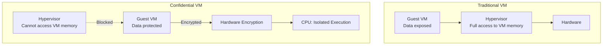

### What Confidential Computing Protects Against

| Threat | Protected? | Mechanism |
|--------|-----------|-----------|
| Malicious hypervisor | ✅ Yes | Hardware memory encryption |
| Physical memory dump | ✅ Yes | AES-128 encryption per VM |
| DMA attacks | ✅ Yes | IOMMU integration |
| Side-channel (Spectre) | ⚠️ Partial | Mitigations in firmware |
| Supply chain attacks | ⚠️ Partial | Attestation verification |
| Denial of service | ❌ No | Hypervisor still controls scheduling |
| Software bugs in guest | ❌ No | Standard software security applies |

---

## Intel TDX (Trust Domain Extensions)

### Architecture

TDX introduces a new VM type called a **Trust Domain (TD)**. TDs run in a hardware-isolated environment where the CPU enforces memory encryption and access control, preventing the hypervisor from reading or modifying TD memory.

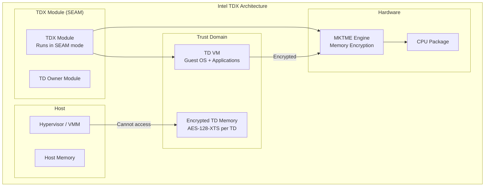

### Key Concepts

| Concept | Description |
|---------|-------------|
| **Trust Domain (TD)** | An isolated VM with encrypted memory |
| **TDX Module** | Firmware running in SEAM (Secure Arbitration Mode) |
| **SEAM** | CPU mode where only TDX module runs |
| **TD Private Memory** | Encrypted memory accessible only by the TD |
| **TD Private Pages** | Memory pages encrypted with per-TD key |
| **Shared Pages** | Decrypted pages accessible by host (for I/O) |
| **TD Report** | Cryptographic attestation of TD identity |

### TDX Kernel Support

```c
/* arch/x86/coco/tdx/ — TDX guest support */
/* Key source files:
 *   arch/x86/coco/tdx/tdx.c         — TDX guest initialization
 *   arch/x86/coco/tdx/tdcall.S       — TDCALL instruction wrapper
 *   arch/x86/coco/tdx/shared_bit.c   — Shared/private bit handling
 *   arch/x86/kernel/cpu/common.c     — TDX detection
 */

/* TDCALL: Guest-to-TDX-module hypercall */
static inline u64 _tdx_module_call(u64 fn, u64 rcx, u64 rdx,
                                    u64 r8, u64 r9, struct tdx_module_output *out);
```

### TDX Attestation

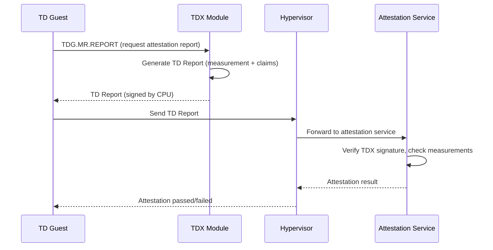

### TDX Guest Kernel Configuration

```
CONFIG_INTEL_TDX_GUEST=y       # TDX guest support
CONFIG_CC_GUEST=y              # Confidential computing guest
CONFIG_X86_MEM_ENCRYPT=y       # Memory encryption support
CONFIG_TDX_GUEST_DRIVER=m      # /dev/tdx_guest device
CONFIG_TDX_GUEST_ATTESTATION=y # Attestation support
```

```bash
# Check if running as TDX guest
$ dmesg | grep -i tdx
[    0.000000] tdx: TDX guest detected

# Or check cc_platform
$ cat /sys/firmware/tdx/tdx_seam
```

---

## AMD SEV (Secure Encrypted Virtualization)

### SEV Family Overview

AMD SEV has evolved through multiple generations:

| Technology | Generation | Key Features |
|-----------|------------|--------------|
| **SEV** | 1st | VM memory encryption with per-VM AES keys |
| **SEV-ES** | 2nd | Encrypted State — CPU register state encrypted on VMEXIT |
| **SEV-SNP** | 3rd | Secure Nested Paging — integrity protection, reverse map table |

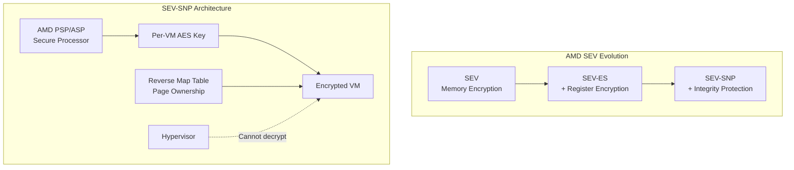

### SEV Memory Encryption

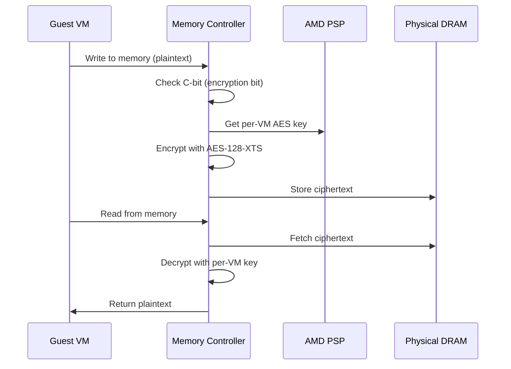

### SEV-SNP Protection Model

```c
/* SEV-SNP adds integrity protection via the Reverse Map Table (RMP).
 * Each page has an RMP entry tracking:
 *   - Owning VM (ASID)
 *   - Page state (private, shared, hypervisor)
 *   - GPA (Guest Physical Address)
 *   - Integrity MAC
 *
 * Key source files:
 *   arch/x86/kvm/svm/sev.c        — KVM SEV management
 *   arch/x86/mm/mem_encrypt.c     — Memory encryption support
 *   drivers/virt/coco/sev-guest.c  — SEV-SNP guest driver
 *   arch/x86/kernel/sev.c         — SEV guest kernel code
 */

/* SNP page states */
enum snp_page_state {
    SNP_PAGE_STATE_PRIVATE,     /* Guest-private, encrypted */
    SNP_PAGE_STATE_SHARED,      /* Shared with hypervisor */
    SNP_PAGE_STATE_HV,          /* Hypervisor-owned */
};
```

### SEV Attestation

```bash
# SEV-SNP attestation report
$ cat /dev/sev-guest
# The guest requests an attestation report via the GHCB protocol

# Kernel driver for attestation
$ modprobe sev-guest

# Request attestation via SNP guest request
$ python3 -c "
import fcntl
import struct

SEV_GET_ATTESTATION_REPORT = 0xc0105304  # ioctl number
fd = open('/dev/sev-guest', 'rb')
# ... ioctl to request report
"
```

### SEV Kernel Configuration

```
# Guest
CONFIG_AMD_MEM_ENCRYPT=y           # SEV guest support
CONFIG_SEV_GUEST=y                 # SEV-SNP guest driver
CONFIG_CC_GUEST=y                  # Confidential computing guest

# Host (KVM)
CONFIG_KVM_AMD_SEV=y               # KVM SEV support
CONFIG_KVM_AMD_SEV_ES=y            # SEV-ES support
CONFIG_KVM_AMD_SEV_SNP=y           # SEV-SNP support
```

### SEV-SNP Guest/Host Communication

```bash
# Launch a SEV-SNP encrypted VM (QEMU)
qemu-system-x86_64 \
  -machine q35,confidential-guest-support=sev0 \
  -object sev-guest,id=sev0,cbitpos=47,reduced-phys-bits=1,policy=0x03 \
  -cpu EPYC \
  -m 4G \
  -drive file=vm-disk.qcow2,format=qcow2 \
  -bios /usr/share/ovmf/OVMF.fd

# Check SEV status in guest
$ dmesg | grep -i sev
[    0.000000] sev: SEV-SNP active
```

---

## ARM CCA (Confidential Compute Architecture)

### Architecture

ARM CCA introduces **Realms** — a new security state alongside the existing Secure World, Normal World, and Root World.

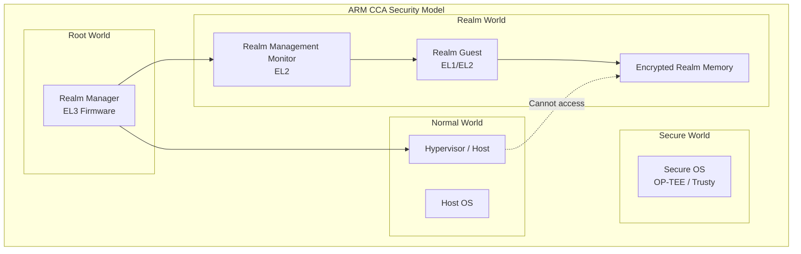

### CCA Components

| Component | EL Level | Role |
|-----------|----------|------|
| **Realm Management Monitor (RMM)** | EL2 | Manages Realm lifecycle, memory encryption |
| **Realm Manager** | EL3 | Firmware managing all security states |
| **Realm Guest** | EL1 | Isolated VM with encrypted memory |
| **Confidential Compute Host (CCHost)** | EL2 | Hypervisor with CCA support |

### CCA Memory Protection

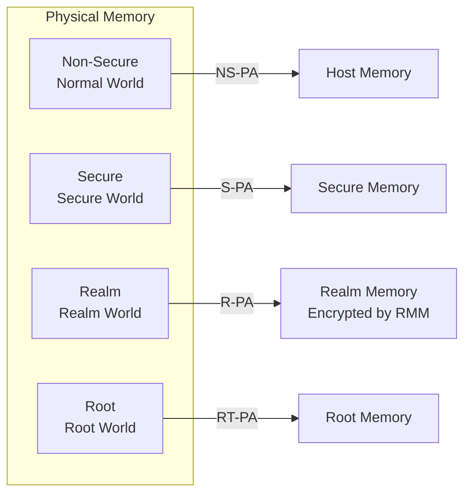

### CCA Kernel Support

```c
/* arch/arm64/kvm/realm.c — Realm guest support */
/* Key source files:
 *   arch/arm64/kvm/realm.c          — Realm management
 *   arch/arm64/include/asm/realm.h   — Realm definitions
 *   arch/arm64/kvm/hyp/realm.c       — Hyp-stage Realm code
 *   drivers/virt/coco/arm-cca-guest.c — CCA guest driver
 */

/* Realm memory attributes */
#define RMI_MEM_ATTR_PRIVATE    0   /* Realm-private, encrypted */
#define RMI_MEM_ATTR_SHARED     1   /* Shared with Normal World */
```

### CCA Configuration

```
# Guest (Realm)
CONFIG_ARM_CCA_GUEST=y              # CCA Realm guest support
CONFIG_CC_GUEST=y                    # Confidential computing guest

# Host (KVM)
CONFIG_KVM_ARM_CCA=y                 # KVM CCA support
```

---

## Linux Confidential Computing Framework

### Common Architecture

Linux provides a unified framework for confidential computing across architectures:

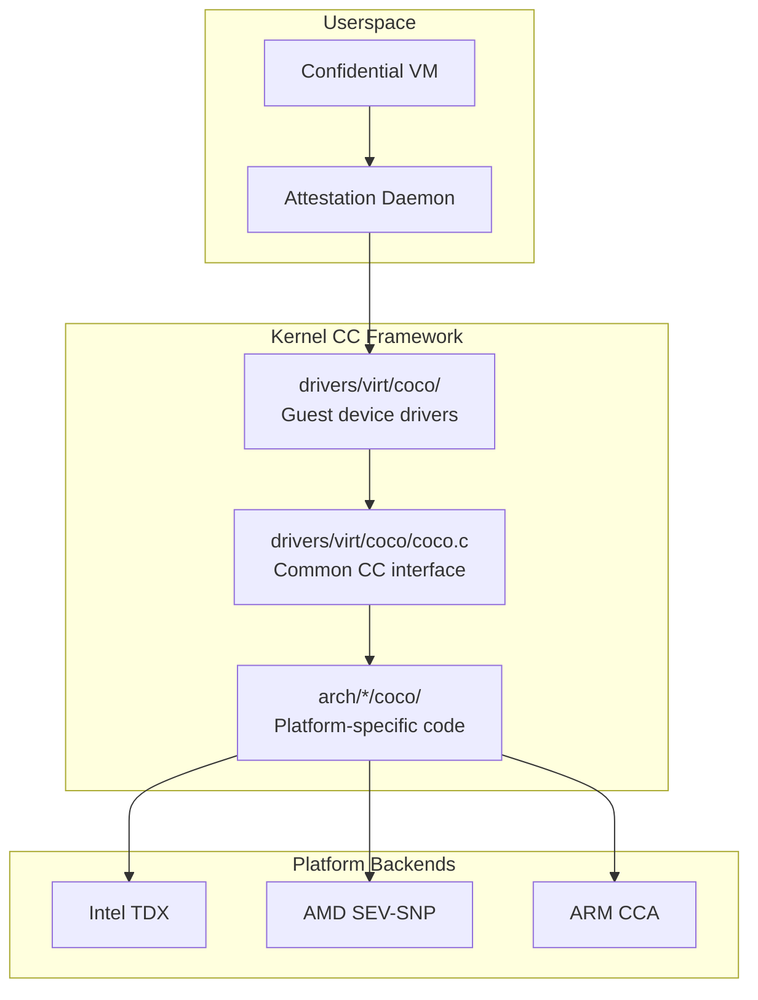

### cc_platform API

```c
/* include/linux/cc_platform.h */
enum cc_type {
    CC_TYPE_NONE = 0,
    CC_TYPE_TDX,
    CC_TYPE_SEV,
    CC_TYPE_CCA,
};

/* Check if running in a confidential VM */
bool cc_platform_has(enum cc_attr attr);

/* Attributes */
enum cc_attr {
    CC_ATTR_GUEST_MEM_ENCRYPT,      /* Memory encryption active */
    CC_ATTR_GUEST_MEM_ENCRYPT_INPLACE, /* In-place encryption supported */
    CC_ATTR_HOST_MEM_ENCRYPT,       /* Host memory encryption */
    CC_ATTR_GUEST_SEV_SNP,          /* SEV-SNP active */
    CC_ATTR_GUEST_TDX,              /* TDX active */
    CC_ATTR_GUEST_CCA,              /* ARM CCA active */
};

/* Usage in drivers */
if (cc_platform_has(CC_ATTR_GUEST_MEM_ENCRYPT)) {
    /* This is a confidential VM — handle shared/private memory */
}
```

### Shared vs Private Memory

In confidential VMs, memory is divided into private (encrypted, guest-only) and shared (accessible by host, used for I/O):

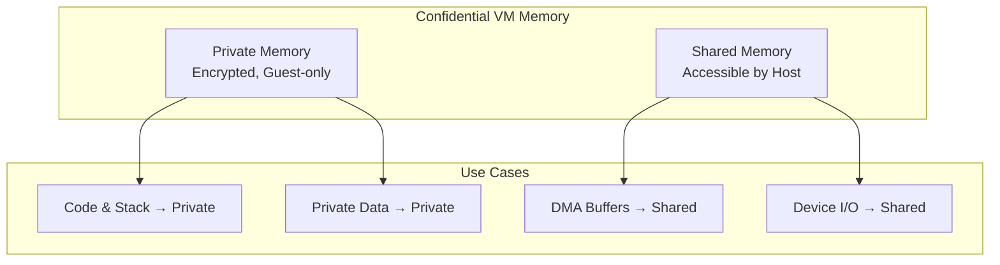

### Converting Memory Attributes

```c
/* The kernel manages page conversion between private and shared.
 * This is critical for I/O: DMA buffers must be in shared memory
 * so devices (and the hypervisor) can access them.
 */

/* Convert page to shared (for DMA) */
void set_memory_decrypted(unsigned long addr, int numpages);

/* Convert page to private (for normal use) */
void set_memory_encrypted(unsigned long addr, int numpages);

/* In TDX, this involves the MapGPA/UnmapGPA hypercall */
/* In SEV-SNP, this changes the RMP entry state */
```

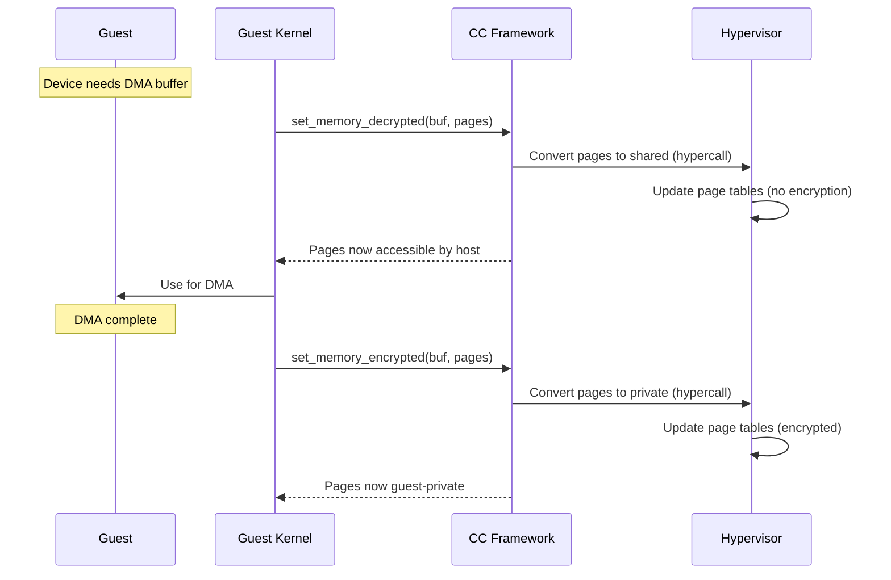

---

## Attestation

Attestation is the process by which a confidential VM proves its identity and integrity to a remote party.

### Attestation Flow

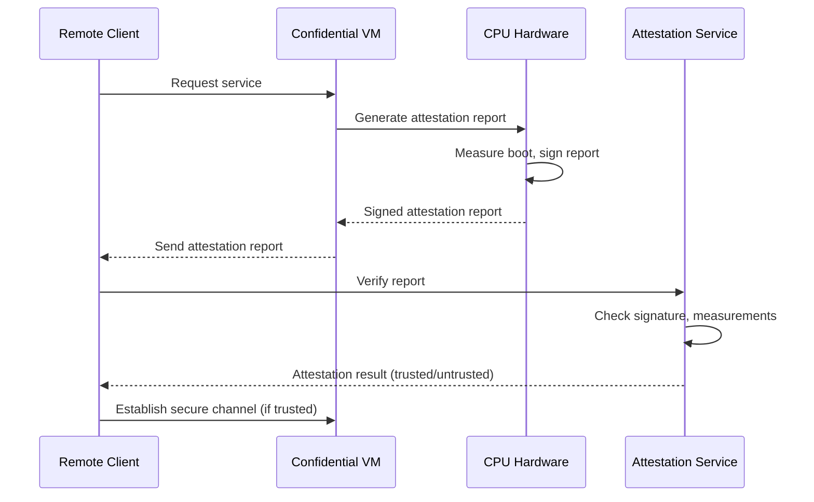

### Intel TDX Attestation

```c
/* TDX attestation via TDG.MR.REPORT */
struct tdx_report {
    u8 report_type;          /* 0 = SGX, 81 = TDX */
    u8 reserved1[3];
    u32 cpu_svn[4];          /* CPU security version */
    u8 report_data[64];      /* User-provided data (e.g., nonce) */
    u8 mr_enclave[32];       /* Measurement of TD */
    u8 mr_signer[32];        /* Measurement of TD signer */
    /* ... more fields ... */
    u8 signature[64];        /* CPU signature */
};

/* Request report via TDCALL */
int tdx_get_report(u8 *report_data, u8 *report);
```

### AMD SEV-SNP Attestation

```c
/* SEV-SNP attestation via Guest Request */
struct snp_report_req {
    u8 report_data[64];      /* User-provided data */
    u32 vmpl;                /* VMPL level */
    u8 reserved[28];
};

struct snp_report_resp {
    struct snp_attestation_report {
        u32 version;
        u32 guest_svn;
        u64 policy;
        u8 family_id[16];
        u8 image_id[16];
        u32 vmpl;
        u32 signature_algo;
        u8 report_data[64];
        /* ... measurement fields ... */
        u8 chip_id[64];
        /* ... signature ... */
    } report;
};

/* Request via /dev/sev-guest ioctl */
#define SNP_GET_REPORT _IOWR('S', 0x01, struct snp_report_req)
```

---

## Guest Kernel Code Path

### Early Boot (TDX Example)

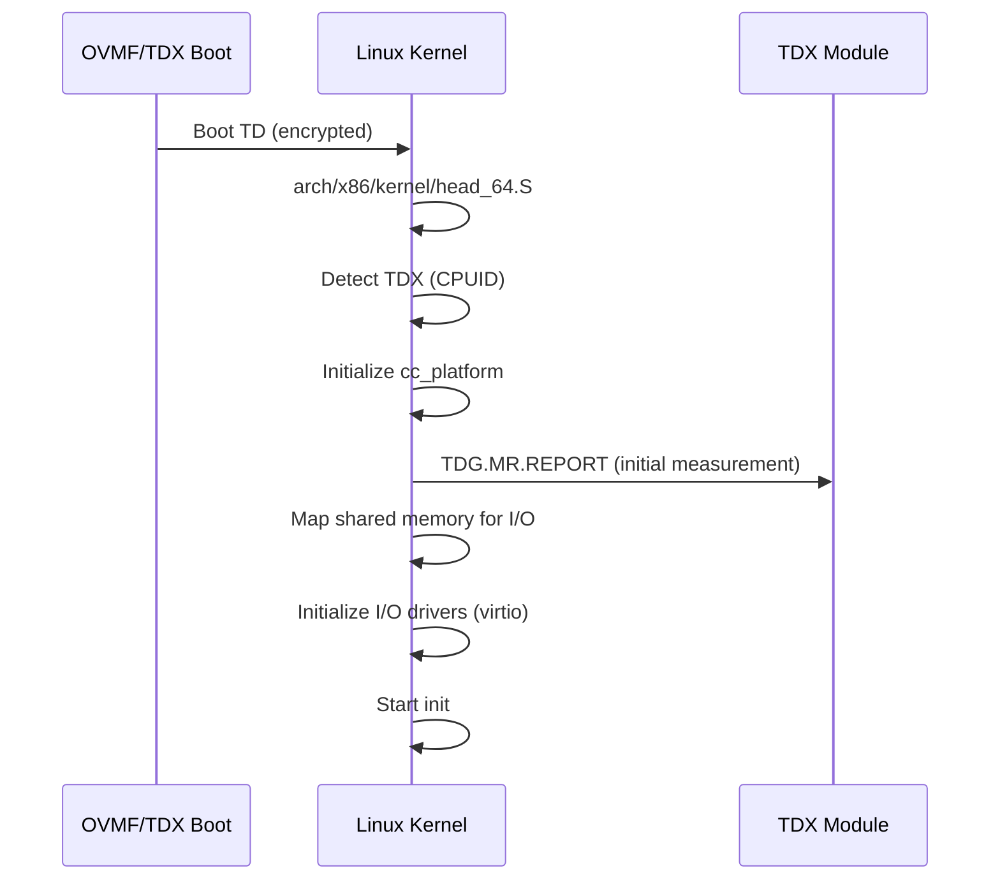

### Key Kernel Initialization

```c
/* arch/x86/coco/tdx/tdx.c */
void __init tdx_early_init(void)
{
    /* Detect TDX */
    if (!cpu_feature_enabled(X86_FEATURE_TDX_GUEST))
        return;

    /* Set platform attributes */
    cc_set_vendor(CC_VENDOR_INTEL);
    cc_set_type(CC_TYPE_TDX);

    /* Mark shared bit */
    cc_set_mask(cc_mkenc(0));

    pr_info("TDX: Active\n");
}
```

---

## Performance Considerations

### Memory Encryption Overhead

| Operation | Overhead | Notes |
|-----------|----------|-------|
| Sequential read | 2-5% | AES-NI hardware acceleration |
| Random read | 3-8% | Cache line encryption/decryption |
| Sequential write | 2-5% | Write-back encryption |
| DMA (shared pages) | 5-15% | Page conversion overhead |
| Attestation | ~100ms | One-time per connection |

### Minimizing Overhead

```bash
# Use virtio devices that support shared memory
# This avoids full page conversion for every I/O operation

# QEMU: Use virtio with shared memory
qemu-system-x86_64 \
  -machine q35,confidential-guest-support=sev0 \
  -object sev-guest,id=sev0,cbitpos=47,reduced-phys-bits=1 \
  -device virtio-blk-pci,drive=drv0,shared-memory=on \
  -device virtio-net-pci,netdev=net0,shared-memory=on

# The kernel's bounce buffer mechanism handles DMA:
# 1. Copy data to shared buffer
# 2. Perform DMA from shared buffer
# 3. Copy data back to private buffer
```

---

## Real-World Deployments

### Cloud Confidential VMs

| Provider | Technology | Offering |
|----------|-----------|----------|
| Azure | AMD SEV-SNP | DCasv5/ECasv5 instances |
| GCP | AMD SEV | Confidential VMs |
| AWS | AWS Nitro Enclaves | NitroTPM + attestation |
| IBM Cloud | AMD SEV-SNP | Secure execution |
| Alibaba Cloud | Intel TDX | TDX instances |

### Confidential Containers

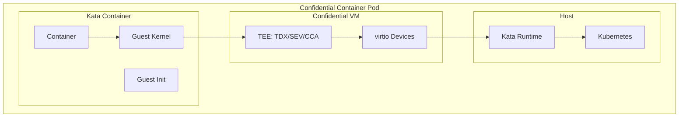

```bash
# Kata Containers with confidential computing
$ kata-runtime run --annotation "io.katacontainers.config.hypervisor.kernel_params=cc_platform=sev" my-container

# Attestation with CoCo (Confidential Containers) project
$ kubectl apply -f coco-attestation.yaml
```

---

## Development and Testing

### Kernel Configuration Summary

```
# Common
CONFIG_CC_GUEST=y

# Intel TDX
CONFIG_INTEL_TDX_GUEST=y
CONFIG_TDX_GUEST_DRIVER=m

# AMD SEV
CONFIG_AMD_MEM_ENCRYPT=y
CONFIG_SEV_GUEST=y

# ARM CCA
CONFIG_ARM_CCA_GUEST=y

# KVM (host)
CONFIG_KVM=y
CONFIG_KVM_INTEL_TDX=y
CONFIG_KVM_AMD_SEV=y
CONFIG_KVM_AMD_SEV_ES=y
CONFIG_KVM_AMD_SEV_SNP=y
CONFIG_KVM_ARM_CCA=y
```

### Testing with QEMU

```bash
# AMD SEV-SNP guest
qemu-system-x86_64 \
  -machine q35,confidential-guest-support=sev0 \
  -object sev-guest,id=sev0,cbitpos=47,reduced-phys-bits=1,policy=0x30000 \
  -cpu EPYC-v4 \
  -m 8G \
  -smp 4 \
  -drive file=ubuntu-sev.qcow2,format=qcow2,if=virtio \
  -bios /usr/share/ovmf/OVMF.fd \
  -nographic

# Intel TDX guest
qemu-system-x86_64 \
  -machine q35,confidential-guest-support=tdx0 \
  -object tdx-guest,id=tdx0 \
  -cpu host \
  -m 8G \
  -smp 4 \
  -drive file=ubuntu-tdx.qcow2,format=qcow2,if=virtio \
  -bios /usr/share/ovmf/OVMF.fd \
  -nographic
```

### Debugging

```bash
# Check CC platform status
$ dmesg | grep -iE "tdx|sev|cca|confidential"

# Memory encryption status
$ cat /proc/cpuinfo | grep -i "encrypt"

# Attestation test (TDX)
$ modprobe tdx_guest
$ cat /dev/tdx_guest

# SEV-SNP attestation test
$ modprobe sev_guest
$ python3 -c "
import fcntl
fd = open('/dev/sev-guest', 'rb')
# ... issue SNP_GET_REPORT ioctl
"
```

---

## References

- **Intel TDX specification** — [intel.com/content/www/us/en/developer/tools/trust-domain-extensions/overview.html](https://www.intel.com/content/www/us/en/developer/tools/trust-domain-extensions/overview.html)
- **AMD SEV-SNP whitepaper** — [amd.com/system/files/TechDocs/SEV-SNP-strengthening-vm-isolation.pdf](https://www.amd.com/system/files/TechDocs/SEV-SNP-strengthening-vm-isolation.pdf)
- **ARM CCA** — [arm.com/architecture/security-features/arm-cca](https://www.arm.com/architecture/security-features/arm-cca)
- **Linux kernel CC code** — `arch/x86/coco/`, `arch/arm64/kvm/realm.c`, `drivers/virt/coco/`
- **LWN: Confidential computing** — [lwn.net/Articles/854831/](https://lwn.net/Articles/854831/)
- **LWN: TDX guest support** — [lwn.net/Articles/890027/](https://lwn.net/Articles/890027/)
- **Confidential Containers** — [confidentialcontainers.org](https://confidentialcontainers.org/)
- **KVM Forum talks** — various presentations on SEV/TDX/CCA

## Related Topics

- [KVM](../virtualization/kvm.md) — Kernel-based Virtual Machine
- [Secure Boot](./secure-boot.md) — Boot chain verification
- [Cryptography](./cryptography.md) — Kernel crypto subsystem
- [Lockdown](./lockdown.md) — Kernel lockdown mode
- [SELinux](./selinux.md) — Mandatory access control
