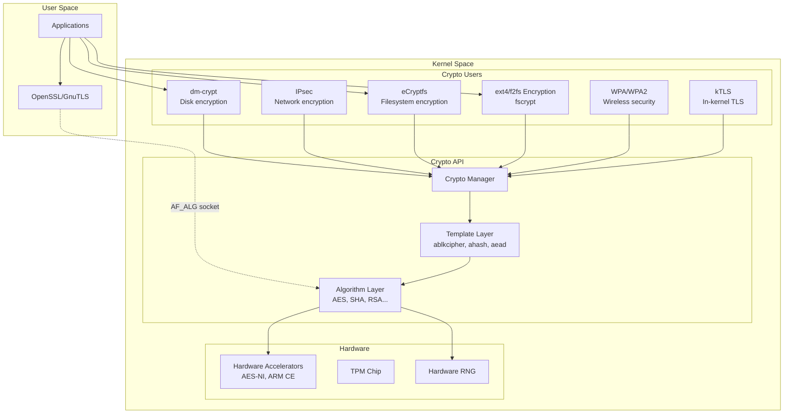
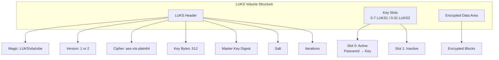
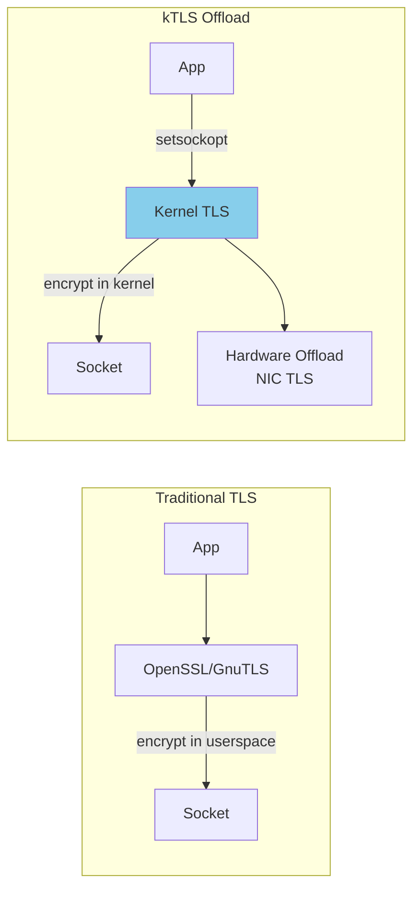

# Linux Cryptographic Subsystem

## Introduction

The Linux kernel includes a comprehensive cryptographic subsystem that provides the foundation for disk encryption, network security, digital signatures, and secure communications. Unlike userspace crypto libraries (OpenSSL, GnuTLS), the kernel crypto API operates in kernel space and is used by kernel subsystems like dm-crypt (disk encryption), IPsec (network encryption), and eCryptfs (filesystem encryption).

Understanding Linux cryptography is essential for administrators who need to encrypt storage, secure network communications, verify system integrity, and comply with regulatory requirements like PCI-DSS, HIPAA, and FIPS 140-2/3.

## Kernel Crypto API

### Architecture



### Listing Available Algorithms

```bash
# View all registered crypto algorithms
cat /proc/crypto | head -40
# name         : __aes-ni-avx2
# driver       : aes-aesni-gfni-avx2
# module       : aesni_intel
# priority     : 400
# refcnt       : 1
# selftest     : passed
# internal     : no
# type         : cipher
# blocksize    : 16
# min key size : 16
# max key size : 32

# Search for specific algorithms
grep -A5 "name.*aes" /proc/crypto
# name         : aes
# driver       : aes-aesni
# module       : aesni_intel
# priority     : 300
# refcnt       : 3
# type         : cipher

# Count available algorithms
cat /proc/crypto | grep "^name" | wc -l
# 142

# Using the cryptsetup benchmark
cryptsetup benchmark
#     Algorithm |    Key |  Encryption |  Decryption
#         aes-xts | 256b |  3012.4 MiB/s |  2987.6 MiB/s
#         aes-xts | 512b |  2156.7 MiB/s |  2134.2 MiB/s
#     serpent-xts | 256b |   456.3 MiB/s |   461.2 MiB/s
#     twofish-xts | 256b |   312.8 MiB/s |   318.4 MiB/s
```

### Hardware Acceleration

```bash
# Check if AES-NI is available (Intel/AMD)
grep -o aes /proc/cpuinfo | head -1
# aes

# Check for ARM Cryptographic Extensions
grep -o aes /proc/cpuinfo | head -1  # ARM: also shows "aes"

# Check loaded crypto modules
lsmod | grep -E "aes|sha|crypto"
# aesni_intel           462848  4
# crypto_simd            16384  1 aesni_intel
# cryptd                 28672  2 crypto_simd,aesni_intel
# gf128mul               16384  1 aesni_intel
# sha256_ssse3           16384  0
# sha512_ssse3           16384  0

# Check which driver is used for AES
grep -A3 "^name.*: aes$" /proc/crypto
# name         : aes
# driver       : aes-aesni
# module       : aesni_intel
# priority     : 300
# ← Using hardware-accelerated AES-NI!
```

## dm-crypt and LUKS

### dm-crypt

dm-crypt is a kernel device-mapper target that provides transparent disk encryption. It encrypts data at the block device level.

```bash
# Create an encrypted volume with dm-crypt (plain mode — no LUKS header)
sudo cryptsetup open --type plain /dev/sdb1 encrypted_vol
# Enter passphrase: ****

# Format and mount
sudo mkfs.ext4 /dev/mapper/encrypted_vol
sudo mount /dev/mapper/encrypted_vol /mnt/encrypted

# Close (unmount first)
sudo umount /mnt/encrypted
sudo cryptsetup close encrypted_vol
```

### LUKS (Linux Unified Key Setup)

LUKS is the standard for Linux disk encryption. It provides:
- A standardized header format
- Multiple key slots (up to 32 in LUKS2)
- Key derivation functions (PBKDF2, Argon2)
- Anti-forensic features



### LUKS2 Operations

```bash
# Create a LUKS2 encrypted partition
sudo cryptsetup luksFormat --type luks2 \
  --cipher aes-xts-plain64 \
  --key-size 512 \
  --hash sha256 \
  --iter-time 5000 \
  --pbkdf argon2id \
  /dev/sdb1
# WARNING!
# ========
# This will overwrite data on /dev/sdb1 irrevocably.
# Are you sure? (Type 'yes' in capital letters): YES
# Enter passphrase for /dev/sdb1: ****
# Verify passphrase: ****

# Open the LUKS volume
sudo cryptsetup luksOpen /dev/sdb1 encrypted_vol
# Enter passphrase for /dev/sdb1: ****

# Create filesystem and mount
sudo mkfs.ext4 /dev/mapper/encrypted_vol
sudo mount /dev/mapper/encrypted_vol /mnt/secure

# View LUKS header information
sudo cryptsetup luksDump /dev/sdb1
# LUKS header information
# Version:        2
# Epoch:          5
# Metadata area:  16384 [bytes]
# Keyslots area:  258048 [bytes]
# UUID:           a1b2c3d4-e5f6-7890-abcd-ef1234567890
# Label:          (no label)
# Cipher:         aes-xts-plain64
# Cipher key:     512 bits
# PBKDF:          argon2id
# Time cost:      4
# Memory:         1048576
# Threads:        4
# Salt:           ...
# AF stripes:     4000
# AF hash:        sha256
#
# Keyslots:
#   0: luks2
#       Key:        512 bits
#       Priority:   normal
#       PBKDF:      argon2id
#       ...
```

### Key Management

```bash
# Add a second passphrase (key slot 1)
sudo cryptsetup luksAddKey /dev/sdb1
# Enter any existing passphrase: ****
# Enter new passphrase for key slot: ****
# Verify passphrase: ****

# Add a key from a keyfile (for automated mounting)
sudo dd if=/dev/urandom of=/root/.luks-key bs=4096 count=1
sudo chmod 400 /root/.luks-key
sudo cryptsetup luksAddKey /dev/sdb1 /root/.luks-key

# Remove a passphrase
sudo cryptsetup luksRemoveKey /dev/sdb1
# Enter passphrase to be deleted: ****

# Remove a specific key slot
sudo cryptsetup luksKillSlot /dev/sdb1 1

# Backup LUKS header (CRITICAL — loss = permanent data loss)
sudo cryptsetup luksHeaderBackup /dev/sdb1 \
  --header-backup-file /root/luks-header-backup.img

# Restore LUKS header
sudo cryptsetup luksHeaderRestore /dev/sdb1 \
  --header-backup-file /root/luks-header-backup.img

# Dump volume keys (DANGEROUS — handle with extreme care)
sudo cryptsetup luksDump --dump-volume-key --dump-volume-key-file /dev/stdout /dev/sdb1
```

### Automounting with /etc/crypttab

```bash
# /etc/crypttab
# <name>    <device>                 <keyfile>         <options>
encrypted_vol  UUID=a1b2c3d4-...     /root/.luks-key   luks,nofail
swap_encrypted UUID=e5f6g7h8-...     /dev/urandom      swap,cipher=aes-xts-plain64,size=256

# After editing, update initramfs:
sudo update-initramfs -u     # Debian/Ubuntu
sudo dracut --force           # RHEL/Fedora
```

### Full Disk Encryption (FDE) Setup

```bash
# Typical Ubuntu installation with full disk encryption:
# 1. /dev/sda1 → /boot (unencrypted, needed for GRUB)
# 2. /dev/sda2 → LUKS → LVM → vgubuntu-root (/) + vgubuntu-swap

# Check if your system uses LUKS
lsblk -f
# NAME                   FSTYPE      LABEL    MOUNTPOINT
# sda
# ├─sda1                 ext4                 /boot
# └─sda2                 crypto_LUKS
#   └─sda2_crypt         LVM2_member
#     ├─vgubuntu-root    ext4                 /
#     └─vgubuntu-swap_1  swap                 [SWAP]

# The kernel command line includes:
# GRUB_CMDLINE_LINUX="cryptdevice=UUID=...:sda2_crypt"
```

## eCryptfs

eCryptfs (Enterprise Cryptographic Filesystem) is a POSIX-compliant stacked filesystem that provides per-file encryption. It's used by Ubuntu's "Encrypt my home folder" feature.

```bash
# Install eCryptfs
sudo apt install ecryptfs-utils

# Create an encrypted directory
mkdir ~/encrypted_private
mount -t ecryptfs ~/encrypted_private ~/encrypted_private
# Select cipher: aes
# Select key bytes: 32
# Enable plaintext passthrough: n
# Enable filename encryption: yes
# Enter passphrase: ****

# Files written to ~/encrypted_private are transparently encrypted
echo "Secret data" > ~/encrypted_private/secret.txt
cat ~/encrypted_private/secret.txt
# Secret data

# Unmount (data is inaccessible)
umount ~/encrypted_private
ls ~/encrypted_private/
# (empty or shows encrypted filenames)

# Automount setup
# Add to ~/.ecryptfs/auto-mount or configure PAM
```

### eCryptfs vs. LUKS

| Feature | eCryptfs | LUKS/dm-crypt |
|---------|----------|---------------|
| Granularity | Per-file | Per-block device |
| Filename encryption | Yes (optional) | N/A (full disk) |
| POSIX compliance | Full | N/A (block level) |
| Performance | Slower (stacked) | Faster (direct) |
| Use case | Home directory | Full disk, partitions |
| Header overhead | None per file | LUKS header (16KB+) |
| Swap encryption | No | Yes |

## fscrypt (ext4/f2fs Native Encryption)

fscrypt is the modern Linux filesystem encryption framework, used by ext4 and fscrypt:

```bash
# Check if filesystem supports fscrypt
tune2fs -l /dev/sda1 | grep "Encryption"
# Or:
cat /proc/fs/fscrypt/policies

# Create an encrypted directory (requires kernel 4.8+)
mkdir /encrypted
e4crypt add_key /encrypted
# Enter passphrase: ****
# Added key with descriptor [abcdef1234567890]

# Set the encryption policy
e4crypt set_policy abcdef1234567890 /encrypted

# Now files in /encrypted are encrypted at the filesystem level
echo "Secret" > /encrypted/test.txt

# Check encryption status
e4crypt get_policy /encrypted
# /encrypted: abcdef1234567890

# fscrypt is used by Android for file-based encryption (FBE)
```

## Linux Kernel TLS (kTLS)

Linux 4.13+ supports TLS in the kernel, allowing userspace applications to offload TLS encryption:



```bash
# Check if kTLS is available
modprobe tls
lsmod | grep tls
# tls                    81920  0

# kTLS is used by:
# - Nginx (with ssl_engine directive)
# - HAProxy
# - io_uring for zero-copy TLS

# Check if hardware TLS offload is supported
ethtool -k eth0 | grep tls
# tls-hw-tx-offload: on
# tls-hw-rx-offload: on
```

## TLS Certificate Management

### Generating Certificates

```bash
# Generate a self-signed certificate (for testing)
openssl req -x509 -newkey rsa:4096 -keyout key.pem -out cert.pem \
  -days 365 -nodes -subj "/CN=example.com"

# Generate a private key
openssl genrsa -out server.key 4096

# Generate a Certificate Signing Request (CSR)
openssl req -new -key server.key -out server.csr \
  -subj "/C=US/ST=California/L=SanFrancisco/O=MyOrg/CN=example.com"

# Generate a certificate with Subject Alternative Names (SAN)
cat > san.cnf << 'EOF'
[req]
default_bits = 4096
prompt = no
default_md = sha256
distinguished_name = dn
req_extensions = req_ext

[dn]
C = US
ST = California
O = MyOrg
CN = example.com

[req_ext]
subjectAltName = @alt_names

[alt_names]
DNS.1 = example.com
DNS.2 = www.example.com
DNS.3 = api.example.com
IP.1 = 192.168.1.100
EOF

openssl req -new -key server.key -out server.csr -config san.cnf
openssl x509 -req -in server.csr -signkey server.key -out server.pem \
  -days 365 -extensions req_ext -extfile san.cnf
```

### Certificate Verification

```bash
# View certificate details
openssl x509 -in cert.pem -text -noout
# Certificate:
#     Data:
#         Version: 3 (0x2)
#         Serial Number: ...
#     Signature Algorithm: sha256WithRSAEncryption
#         Issuer: CN=example.com
#         Validity
#             Not Before: Jul 21 00:00:00 2026 GMT
#             Not After : Jul 21 00:00:00 2027 GMT
#         Subject: CN=example.com
#         Subject Public Key Info:
#             Public Key Algorithm: rsaEncryption
#                 Public-Key: (4096 bit)
# ...
#         X509v3 Subject Alternative Name:
#             DNS:example.com, DNS:www.example.com, IP Address:192.168.1.100

# Verify a certificate chain
openssl verify -CAfile ca-bundle.crt server.pem
# server.pem: OK

# Check a remote server's certificate
openssl s_client -connect example.com:443 -servername example.com </dev/null 2>/dev/null | \
  openssl x509 -text -noout | grep -A2 "Validity"

# Check certificate expiration
openssl x509 -enddate -noout -in cert.pem
# notAfter=Jul 21 00:00:00 2027 GMT

# Test TLS connection
openssl s_client -connect example.com:443 -tls1_3
```

## Cryptographic Hash Functions

```bash
# SHA-256 hash
echo -n "Hello, World!" | sha256sum
# dffd6021bb2bd5b0af676290809ec3a53191dd81c7f70a4b28688a362182986f  -

# SHA-512 hash
echo -n "Hello, World!" | sha512sum

# BLAKE2 hash (modern, faster than SHA-3)
echo -n "Hello, World!" | b2sum

# Verify file integrity
sha256sum -c checksums.sha256
# file1.txt: OK
# file2.txt: OK

# Generate a hash for password storage (like /etc/shadow)
# SHA-512 with salt
openssl passwd -6 -salt $(openssl rand -base64 12) "mypassword"
# $6$R4nd0mS4lt$xxxxxxxxxxxxxxxxxxxxxxxxxxxxxxxxxxxxxxxxxxxxxxxxxxxxxxx

# HMAC (Hash-based Message Authentication Code)
echo -n "message" | openssl dgst -sha256 -hmac "secret_key"
# HMAC-SHA256=xxxxxxxxxxxxxxxxxxxxxxxxxxxxxxxxxxxxxxxxxxxxxxxxxxxxxxxxxxxxxxxx
```

## Random Number Generation

```bash
# The kernel maintains an entropy pool
cat /proc/sys/kernel/random/entropy_avail
# 3840

# Check entropy pool size
cat /proc/sys/kernel/random/poolsize
# 4096

# Hardware RNG (if available)
cat /sys/devices/virtual/misc/hw_random/rng_available
# intel-rng  (Intel RDRAND)

# /dev/random — blocks when entropy is low (more secure)
dd if=/dev/random bs=16 count=1 2>/dev/null | xxd

# /dev/urandom — never blocks (sufficient for most uses)
dd if=/dev/urandom bs=16 count=1 2>/dev/null | xxd

# Modern Linux: /dev/random and /dev/urandom are equivalent
# after initial seeding (Linux 5.6+)

# Generate random passwords
openssl rand -base64 32
# xXxXxXxXxXxXxXxXxXxXxXxXxXxXxXxXxXxXxXxXxXxX

# Generate random bytes
openssl rand -hex 32
# a1b2c3d4e5f6a1b2c3d4e5f6a1b2c3d4e5f6a1b2c3d4e5f6a1b2c3d4e5f6a1b2

# Check if jitterentropy or CPU RNG is being used
dmesg | grep -i "random"
# random: crng init done        ← CSPRNG initialized
# random: 7 urandom warning(s) missed due to ratelimiting
```

## IPsec with Libreswan / strongSwan

```bash
# Install Libreswan (IPsec VPN)
sudo apt install libreswan        # Debian/Ubuntu
sudo dnf install libreswan        # RHEL/Fedora

# Example: site-to-site IPsec connection
# /etc/ipsec.d/site-to-site.conf
# conn site-to-site
#     left=203.0.113.1
#     leftsubnet=10.0.1.0/24
#     right=198.51.100.1
#     rightsubnet=10.0.2.0/24
#     ike=aes256-sha256-modp2048
#     esp=aes256-sha256
#     authby=secret
#     auto=start

# Check IPsec status
sudo ipsec status
# 000 #1: "site-to-site":500 STATE_V2_ESTABLISHED_IKE_SA
# 000 #2: "site-to-site":500 STATE_V2_ESTABLISHED_CHILD_SA
```

## FIPS Compliance

```bash
# RHEL/Fedora: Enable FIPS mode
sudo fips-mode-setup --enable
# Setting system policy to FIPS
# Note: System restart is required

# Check FIPS status
fips-mode-setup --check
# FIPS mode is enabled.

# Or check the kernel:
cat /proc/sys/crypto/fips_enabled
# 1

# In FIPS mode:
# - Only FIPS-approved algorithms are available
# - Self-tests are run on crypto modules
# - Kernel crypto module is validated
# - Random number generation uses approved sources
```

## SSH Cryptography

```bash
# Generate SSH keys with modern algorithms
ssh-keygen -t ed25519 -C "user@host"
# Ed25519: fastest, most secure SSH key type

ssh-keygen -t ecdsa -b 521 -C "user@host"
# ECDSA with P-521 curve

ssh-keygen -t rsa -b 4096 -C "user@host"
# RSA 4096 (legacy compatibility)

# View SSH host key fingerprints
ssh-keygen -lf /etc/ssh/ssh_host_ed25519_key.pub
# 256 SHA256:xxxxxxxxxxxxxxxxxxxxxxxxxxxxxxxxxxxxxxxxxxx root@host (ED25519)

# Configure strong SSH crypto
# /etc/ssh/sshd_config
# KexAlgorithms curve25519-sha256,curve25519-sha256@libssh.org
# Ciphers chacha20-poly1305@openssh.com,aes256-gcm@openssh.com,aes128-gcm@openssh.com
# MACs hmac-sha2-512-etm@openssh.com,hmac-sha2-256-etm@openssh.com
# HostKeyAlgorithms ssh-ed25519,rsa-sha2-512,rsa-sha2-256

# Test SSH server configuration
ssh -vv user@host 2>&1 | grep "kex:"
# debug1: kex: algorithm: curve25519-sha256
# debug1: kex: host key algorithm: ssh-ed25519
```

## References

- [The Linux Kernel Documentation](https://docs.kernel.org/)
- [LWN.net - Linux and free software news](https://lwn.net/)
- [GNU Project Documentation](https://www.gnu.org/doc/doc.html)
- [GNU Manuals](https://www.gnu.org/manual/manual.html)
- [Free Software Directory](https://directory.fsf.org/wiki/Main_Page)
- [Planet GNU](https://planet.gnu.org/)
- [Free Software Books](https://www.gnu.org/doc/other-free-books.html)

- Linux Kernel Crypto API Documentation: https://www.kernel.org/doc/html/latest/crypto/
- dm-crypt: https://gitlab.com/cryptsetup/cryptsetup
- LUKS Specification: https://gitlab.com/cryptsetup/cryptsetup/-/wikis/LUKS-standard-on-disk-format
- fscrypt Documentation: https://www.kernel.org/doc/html/latest/filesystems/fscrypt.html
- OpenSSL Documentation: https://www.openssl.org/docs/
- NIST FIPS 140-3: https://csrc.nist.gov/publications/detail/fips/140/3/final
- `man 8 cryptsetup` — LUKS/dm-crypt management
- `man 5 crypttab` — Encrypted volume table
- `man 1 openssl` — OpenSSL command-line tool
- `man 8 e4crypt` — ext4 encryption management
- ArchWiki dm-crypt: https://wiki.archlinux.org/title/Dm-crypt
- ArchWiki Fscrypt: https://wiki.archlinux.org/title/Fscrypt
- Libreswan IPsec: https://libreswan.org/

## Related Topics

- [Linux Security Overview](./overview.md) — Where cryptography fits in the security architecture
- [Hardening](./hardening.md) — Compiler hardening, kernel parameters
- [Secure Boot](./secure-boot.md) — UEFI Secure Boot uses cryptographic verification
- [PAM](./pam.md) — Password hashing algorithms
- [SELinux](./selinux.md) — MAC labels on encrypted volumes
