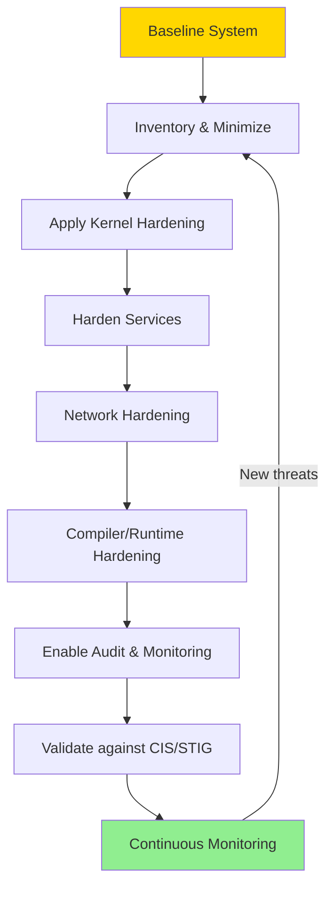

# System Hardening Guide

## Introduction

System hardening is the process of reducing the attack surface of a Linux system by applying security configurations, removing unnecessary software, restricting access, and enabling protective mechanisms. While each security tool (SELinux, seccomp, capabilities) addresses specific threats, hardening is the holistic practice of combining them all into a cohesive security posture.

This chapter covers practical hardening techniques organized into categories: kernel parameters, compiler-level protections, service hardening, network hardening, and compliance frameworks. Each technique is presented with the rationale, implementation steps, and verification commands.

## Hardening Workflow



## Kernel Parameter Hardening (sysctl)

The kernel exposes hundreds of tunable parameters via `/proc/sys/`. These can be hardened by creating files in `/etc/sysctl.d/`.

### Network Hardening Parameters

```bash
# /etc/sysctl.d/99-hardening.conf

# --- Network Hardening ---

# Enable SYN flood protection
net.ipv4.tcp_syncookies = 1

# Disable source routing (prevents attackers from specifying packet routes)
net.ipv4.conf.all.accept_source_route = 0
net.ipv6.conf.all.accept_source_route = 0

# Disable ICMP redirects (prevents MITM attacks)
net.ipv4.conf.all.accept_redirects = 0
net.ipv6.conf.all.accept_redirects = 0
net.ipv4.conf.all.send_redirects = 0

# Enable reverse path filtering (anti-spoofing)
net.ipv4.conf.all.rp_filter = 1
net.ipv4.conf.default.rp_filter = 1

# Log Martian packets (impossible source addresses)
net.ipv4.conf.all.log_martians = 1

# Ignore ICMP broadcast requests (Smurf attack prevention)
net.ipv4.icmp_echo_ignore_broadcasts = 1

# Ignore bogus ICMP error responses
net.ipv4.icmp_ignore_bogus_error_responses = 1

# Disable IP forwarding (unless this is a router)
net.ipv4.ip_forward = 0
net.ipv6.conf.all.forwarding = 0

# Disable IPv6 if not needed
# net.ipv6.conf.all.disable_ipv6 = 1
# net.ipv6.conf.default.disable_ipv6 = 1

# Enable TCP hardening
net.ipv4.tcp_timestamps = 0           # Disable TCP timestamps (information leak)
net.ipv4.tcp_max_syn_backlog = 2048   # SYN backlog queue size
net.ipv4.tcp_synack_retries = 2       # Reduce SYN-ACK retries
net.ipv4.tcp_syn_retries = 5          # Reduce SYN retries
```

### Kernel Hardening Parameters

```bash
# --- Kernel Hardening ---

# Restrict access to kernel logs
kernel.dmesg_restrict = 1

# Restrict access to kernel pointers (KASLR support)
kernel.kptr_restrict = 2

# Restrict ptrace to parent processes only
kernel.yama.ptrace_scope = 1
# 0 = no restriction
# 1 = only parent can ptrace child (default on Ubuntu)
# 2 = only admin can ptrace
# 3 = no ptrace at all

# Restrict unprivileged access to BPF
kernel.unprivileged_bpf_disabled = 1

# Restrict userfaultfd to privileged users
vm.unprivileged_userfaultfd = 0

# Disable SysRq key (emergency keyboard shortcuts)
kernel.sysrq = 0
# Or allow only sync+remount+reboot: kernel.sysrq = 176

# Restrict access to perf events
kernel.perf_event_paranoid = 3
# 0 = allow all
# 1 = restrict CPU events
# 2 = restrict kernel profiling
# 3 = no access (most restrictive)

# Restrict unprivileged user namespaces
kernel.unprivileged_userns_clone = 0

# Disable core dumps for SUID programs
fs.suid_dumpable = 0

# Restrict hardlinks and symlinks to owned files
fs.protected_hardlinks = 1
fs.protected_symlinks = 1
fs.protected_fifos = 2
fs.protected_regular = 2

# Restrict inotify watches
fs.inotify.max_user_watches = 1048576
fs.inotify.max_user_instances = 1024
```

### Memory Hardening

```bash
# --- Memory Hardening ---

# Address Space Layout Randomization (ASLR)
kernel.randomize_va_space = 2
# 0 = disabled
# 1 = partial (stack, mmap, VDSO)
# 2 = full (heap also randomized) — default and recommended

# Virtual memory hardening
vm.mmap_min_addr = 65536         # Prevent mmap at low addresses
vm.mmap_rnd_bits = 32            # ASLR mmap randomization bits
vm.mmap_rnd_compat_bits = 16     # 32-bit compatibility

# Disable kernel profiling by unprivileged users
kernel.perf_event_paranoid = 3
```

### Applying sysctl Parameters

```bash
# Apply all parameters immediately
sudo sysctl --system

# Apply a specific file
sudo sysctl -p /etc/sysctl.d/99-hardening.conf

# Verify a specific parameter
sysctl kernel.randomize_va_space
# kernel.randomize_va_space = 2

# List all parameters
sysctl -a | wc -l
# ~1200 parameters on a typical system
```

## Compiler and Runtime Hardening

Modern C compilers provide security features that are enabled at compile time. These protect against memory corruption attacks.

### ASLR (Address Space Layout Randomization)

```bash
# ASLR randomizes memory addresses on every program execution
# Makes ROP/JOP attacks harder

# Check ASLR status
cat /proc/sys/kernel/randomize_va_space
# 2 (full ASLR)

# View ASLR for a process
cat /proc/$(pgrep sshd)/maps | head -5
# 55a1b2c3d000-55a1b2c3e000 r--p 00000000 08:01 12345 /usr/sbin/sshd
# 55a1b2c3e000-55a1b2c4f000 r-xp 00001000 08:01 12345 /usr/sbin/sshd
# 55a1b2c4f000-55a1b2c58000 r--p 00012000 08:01 12345 /usr/sbin/sshd
# Notice: base addresses change between runs
```

### Position Independent Executables (PIE)

```bash
# PIE enables ASLR for the main executable (not just libraries)
# Without PIE, the executable is loaded at a fixed address

# Check if a binary is PIE
file /usr/bin/ssh
# /usr/bin/ssh: ELF 64-bit LSB pie executable, x86-64, version 1 (SYSV), ...
#                        ^^^
#                        PIE: good!

file /usr/bin/old-binary
# /usr/bin/old-binary: ELF 64-bit LSB executable, x86-64, ...
#                              ^^^^^^^^
#                              NOT PIE: vulnerable to fixed-address attacks

# Compile with PIE
gcc -fPIE -pie -o myprogram myprogram.c

# On Debian/Ubuntu, PIE is enabled by default since GCC 6
# On RHEL/Fedora, PIE is enabled by default since GCC 7
```

### Stack Protections

```bash
# Stack canaries detect buffer overflow on the stack
# A random value (canary) is placed before the return address
# If the canary is modified, the program aborts

# Compile with stack protection (default in most distros)
gcc -fstack-protector-strong -o myprogram myprogram.c

# Levels:
# -fstack-protector       — Protect functions with buffers > 8 bytes
# -fstack-protector-all   — Protect ALL functions
# -fstack-protector-strong — Protect functions with buffers, arrays, or address-taken variables (recommended)
# -fstack-protector-explicit — Only functions with #pragma

# Check if a binary has stack protection
readelf -s /usr/bin/ssh | grep __stack_chk_fail
#    123: 0000000000000000     0 FUNC    GLOBAL DEFAULT  UND __stack_chk_fail@GLIBC_2.4
# ← Symbol present means stack protection is active

# Demonstrate stack canary
cat << 'EOF' > /tmp/stacktest.c
#include <stdio.h>
#include <string.h>

void vulnerable(char *input) {
    char buffer[16];
    strcpy(buffer, input);  // Buffer overflow!
    printf("Input: %s\n", buffer);
}

int main(int argc, char **argv) {
    if (argc > 1) vulnerable(argv[1]);
    return 0;
}
EOF

gcc -fstack-protector-strong -o /tmp/stacktest /tmp/stacktest.c
/tmp/stacktest AAAAAAAAAAAAAAAAAAAAAAAAAAAAAAAAAAAAAAAAAAAA
# *** stack smashing detected ***: terminated
# Aborted (core dumped)
# ← Stack canary caught the overflow!
```

### FORTIFY_SOURCE

```bash
# FORTIFY_SOURCE replaces unsafe libc functions with checked versions
# - memcpy, strcpy, sprintf, gets, etc. are replaced with bounds-checking versions

# Compile with FORTIFY_SOURCE
gcc -D_FORTIFY_SOURCE=2 -O2 -o myprogram myprogram.c

# Levels:
# _FORTIFY_SOURCE=1 — Compile-time checks only
# _FORTIFY_SOURCE=2 — Compile-time + runtime checks (recommended)

# Check if a binary uses FORTIFY_SOURCE
objdump -t /usr/bin/ssh | grep _chk
# 0000000000000000       *UND*  0000000000000000 __memcpy_chk
# 0000000000000000       *UND*  0000000000000000 __sprintf_chk
# ← Functions ending in _chk are the fortified versions

# Demonstrate FORTIFY_SOURCE catching an overflow
cat << 'EOF' > /tmp/fortifytest.c
#include <string.h>
#include <stdio.h>

int main() {
    char small[4];
    // This will be caught by FORTIFY_SOURCE
    sprintf(small, "This string is way too long for the buffer");
    return 0;
}
EOF

gcc -D_FORTIFY_SOURCE=2 -O2 -o /tmp/fortifytest /tmp/fortifytest.c
/tmp/fortifytest
# *** buffer overflow detected ***: terminated
# Aborted (core dumped)
```

### RELRO (Relocation Read-Only)

```bash
# RELRO protects the GOT (Global Offset Table) from being overwritten
# Partial RELRO: GOT is read-only after initialization
# Full RELRO: GOT is completely read-only (slight startup overhead)

# Compile with full RELRO
gcc -Wl,-z,relro,-z,now -o myprogram myprogram.c

# Check RELRO status
checksec --file=/usr/bin/ssh
# RELRO           STACK CANARY      NX            PIE
# Full RELRO      Canary found      NX enabled    PIE enabled

# Or manually:
readelf -l /usr/bin/ssh | grep GNU_RELRO
#   GNU_RELRO      0x000000000001fd00 0x000000000021fd00 ...

readelf -d /usr/bin/ssh | grep BIND_NOW
# 0x0000000000000018 (BIND_NOW)
# ← Full RELRO (BIND_NOW present)
```

### NX (No-Execute) / DEP

```bash
# NX marks data areas (stack, heap) as non-executable
# Prevents shellcode injection attacks

# Modern CPUs support NX bit (called XD on Intel, EVP on AMD)
# Enabled by default in the kernel

# Check if NX is enabled
dmesg | grep -i "NX.*protection"
# NX (Execute Disable) protection: active

# Check a binary
readelf -l /usr/bin/ssh | grep GNU_STACK
# GNU_STACK  0x000000 0x0000000000000000 0x0000000000000000 0x000000 0x000000 RWE 0x10
#                                                                                 ^
# RWE = Read, Write, Execute (BAD — stack is executable)
# RW  = Read, Write (GOOD — stack is not executable)
```

### Complete GCC Hardening Flags

```bash
# Recommended compilation flags for security-sensitive code:
gcc \
  -fPIE -pie                          `# PIE for full ASLR` \
  -fstack-protector-strong            `# Stack canaries` \
  -D_FORTIFY_SOURCE=2                 `# Buffer overflow detection` \
  -Wl,-z,relro,-z,now                 `# Full RELRO` \
  -Wl,-z,noexecstack                  `# Non-executable stack` \
  -Wl,-z,noexecheap                   `# Non-executable heap` \
  -Wformat -Wformat-security          `# Format string checks` \
  -fno-delete-null-pointer-checks     `# Keep null pointer checks` \
  -fno-strict-overflow                `# Prevent overflow optimizations` \
  -fwrapv                             `# Signed integer wrap is defined` \
  -O2                                 `# Required for FORTIFY_SOURCE` \
  -o myprogram myprogram.c
```

### Kernel Self-Protection

```bash
# Kconfig options for kernel hardening
# (Set during kernel compilation)

# CONFIG_STACKPROTECTOR_STRONG=y     — Stack canaries in kernel
# CONFIG_FORTIFY_SOURCE=y            — Buffer overflow checks in kernel
# CONFIG_RANDOMIZE_BASE=y            — KASLR (Kernel ASLR)
# CONFIG_RANDOMIZE_MEMORY=y          — Randomize kernel memory layout
# CONFIG_HARDENED_USERCOPY=y         — Validate user/kernel memory copies
# CONFIG_INIT_ON_ALLOC_DEFAULT_ON=y  — Zero memory on allocation
# CONFIG_INIT_ON_FREE_DEFAULT_ON=y   — Zero memory on free
# CONFIG_SLAB_FREELIST_HARDENED=y    — Harden SLAB/SLUB allocator
# CONFIG_SHUFFLE_PAGE_ALLOCATOR=y    — Shuffle page allocator
# CONFIG_SECURITY_LOCKDOWN_LSM=y     — Lockdown LSM
# CONFIG_SECURITY_LOCKDOWN_LSM_EARLY=y
# CONFIG_EFI_DISABLE_PCI_DMA=y       — Disable PCI DMA in EFI stub
```

## Service Hardening with systemd

systemd provides extensive security directives for service units:

```ini
# /etc/systemd/system/hardened-web.service
[Unit]
Description=Hardened Web Server
After=network.target

[Service]
Type=simple
User=webserver
Group=webserver
ExecStart=/usr/local/bin/mywebserver --config /etc/mywebserver/config.yaml

# === Filesystem Protection ===
ProtectSystem=strict              # Mount / and /usr read-only
ProtectHome=true                  # Make /home, /root, /run/user inaccessible
PrivateTmp=true                   # Private /tmp namespace
PrivateDevices=true               # Private /dev namespace
ProtectKernelTunables=true        # Prevent writes to /proc and /sys
ProtectKernelModules=true         # Prevent module loading
ProtectKernelLogs=true            # Prevent access to kernel log buffer
ProtectControlGroups=true         # Prevent cgroup modifications
ProtectClock=true                 # Prevent clock changes
ProtectHostname=true              # Prevent hostname changes

# === Privilege Restriction ===
NoNewPrivileges=true              # Prevent gaining privileges via execve
CapabilityBoundingSet=            # Drop ALL capabilities
AmbientCapabilities=              # Drop all ambient capabilities
RestrictSUIDSGID=true             # Prevent creating SUID/SGID files

# === Network Restriction ===
RestrictAddressFamilies=AF_INET AF_INET6 AF_UNIX  # Only allow IPv4/IPv6/Unix sockets

# === Syscall Filtering ===
SystemCallFilter=@system-service  # Allow only common service syscalls
SystemCallFilter=~@privileged     # Deny privileged syscalls
SystemCallArchitectures=native    # Only native architecture
MemoryDenyWriteExecute=true       # Deny W+X memory mappings

# === Resource Limits ===
LimitNOFILE=65536                 # Max open files
LimitNPROC=4096                   # Max processes
LimitCORE=0                       # Disable core dumps

# === Additional Hardening ===
LockPersonality=true              # Prevent personality(2) changes
RestrictRealtime=true             # Prevent realtime scheduling
RestrictNamespaces=true           # Prevent namespace creation
RemoveIPC=true                    # Remove IPC objects on logout
PrivateUsers=true                 # Private user namespace
```

```bash
# Apply and verify
sudo systemctl daemon-reload
sudo systemctl start hardened-web

# Check security properties
systemctl show hardened-web -p NoNewPrivileges,ProtectSystem,PrivateTmp
# NoNewPrivileges=yes
# ProtectSystem=strict
# PrivateTmp=yes

# Check applied seccomp filters
systemctl show hardened-web -p SystemCallFilter
# SystemCallFilter=@system-service ~@privileged
```

## CIS Benchmarks

The Center for Internet Security (CIS) publishes detailed hardening benchmarks:

```bash
# Install CIS benchmark tool
# Using OpenSCAP for automated CIS scanning
sudo apt install libopenscap8 scap-security-guide  # Debian/Ubuntu
sudo dnf install openscap-scanner scap-security-guide  # RHEL/Fedora

# List available profiles
oscap info /usr/share/xml/scap/ssg/content/ssg-ubuntu2204-ds.xml | grep "Profile"
# Profile: standard
# Profile: Level 1 - Server
# Profile: Level 2 - Server
# Profile: Level 1 - Workstation
# Profile: Level 2 - Workstation

# Run a CIS Level 1 Server scan
sudo oscap xccdf eval \
  --profile xccdf_org.ssgproject.content_profile_cis_level1_server \
  --results /tmp/cis-results.xml \
  --report /tmp/cis-report.html \
  /usr/share/xml/scap/ssg/content/ssg-ubuntu2204-ds.xml

# Example output:
# Title   Ensure /tmp is mounted with noexec
# Result  pass
# Title   Ensure AIDE is installed
# Result  fail
# ...

# Fix mode (automated remediation — USE WITH CAUTION)
sudo oscap xccdf eval \
  --profile xccdf_org.ssgproject.content_profile_cis_level1_server \
  --remediate \
  /usr/share/xml/scap/ssg/content/ssg-ubuntu2204-ds.xml
```

### Key CIS Benchmark Areas

```mermaid
graph TB
    subgraph "CIS Benchmark Categories"
        A[Initial Setup]
        B[Services]
        C[Network]
        D[Logging]
        E[Access Control]
        F[System Maintenance]
    end

    A --> A1[Filesystem Configuration]
    A --> A2[Software Updates]
    A --> A3[Secure Boot]

    B --> B1[Remove Unnecessary Services]
    B --> B2[Time Synchronization]
    B --> B3[Mail Transfer Agent]

    C --> C1[Network Parameters]
    C --> C2[Firewall]
    C --> C3[SSH Configuration]

    D --> D1[rsyslog/syslog-ng]
    D --> D2[Audit Framework]
    D --> D3[Log File Permissions]

    E --> E1[User Accounts]
    E --> E2[PAM Configuration]
    E --> E3[SSH Access]

    F --> F1[File Permissions]
    F --> F2[System Integrity]
```



## Network Hardening

### Firewall (iptables/nftables)

```bash
# Modern approach: nftables (replacement for iptables)
# /etc/nftables.conf
sudo tee /etc/nftables.conf << 'EOF'
#!/usr/sbin/nft -f

flush ruleset

table inet filter {
    chain input {
        type filter hook input priority 0; policy drop;

        # Allow established connections
        ct state established,related accept

        # Allow loopback
        iif "lo" accept

        # Allow ICMP (ping)
        ip protocol icmp accept
        ip6 nexthdr icmpv6 accept

        # Allow SSH (rate-limited)
        tcp dport 22 ct state new limit rate 5/minute accept

        # Allow HTTP/HTTPS
        tcp dport { 80, 443 } accept

        # Log and drop everything else
        log prefix "nftables-drop: " drop
    }

    chain forward {
        type filter hook forward priority 0; policy drop;
    }

    chain output {
        type filter hook output priority 0; policy accept;
    }
}
EOF

# Load the ruleset
sudo nft -f /etc/nftables.conf

# Verify
sudo nft list ruleset

# Enable at boot
sudo systemctl enable nftables
```

### SSH Hardening

```bash
# /etc/ssh/sshd_config — Hardened configuration
# Change default port
Port 2222

# Disable root login
PermitRootLogin no

# Disable password authentication (key-only)
PasswordAuthentication no
PubkeyAuthentication yes

# Limit authentication attempts
MaxAuthTries 3
LoginGraceTime 30

# Disable X11 forwarding
X11Forwarding no

# Disable unused authentication methods
ChallengeResponseAuthentication no
KerberosAuthentication no
GSSAPIAuthentication no

# Idle timeout
ClientAliveInterval 300
ClientAliveCountMax 2

# Restrict users/groups
AllowUsers user1 user2
# AllowGroups ssh-users

# Use strong crypto
KexAlgorithms curve25519-sha256,curve25519-sha256@libssh.org
Ciphers chacha20-poly1305@openssh.com,aes256-gcm@openssh.com,aes128-gcm@openssh.com
MACs hmac-sha2-512-etm@openssh.com,hmac-sha2-256-etm@openssh.com
HostKeyAlgorithms ssh-ed25519,rsa-sha2-512,rsa-sha2-256

# Restrict SFTP to chroot
Subsystem sftp internal-sftp
Match Group sftponly
    ChrootDirectory /home/%u
    ForceCommand internal-sftp
    AllowTcpForwarding no
```

```bash
# Validate configuration before restarting
sudo sshd -t
# No errors = safe to restart

sudo systemctl restart sshd
```

## File Permission Hardening

```bash
# Find world-writable files
find / -xdev -type f -perm -0002 -exec ls -la {} \; 2>/dev/null

# Find world-writable directories without sticky bit
find / -xdev -type d -perm -0002 ! -perm -1000 -exec ls -ld {} \; 2>/dev/null

# Find SUID/SGID files
find / -xdev -type f \( -perm -4000 -o -perm -2000 \) -exec ls -la {} \; 2>/dev/null

# Find files with no owner
find / -xdev -nouser -o -nogroup 2>/dev/null

# Check critical file permissions
stat -c '%a %U:%G %n' /etc/passwd /etc/shadow /etc/group /etc/gshadow
# 644 root:root /etc/passwd
# 640 root:shadow /etc/shadow
# 644 root:root /etc/group
# 640 root:shadow /etc/gshadow

# Harden critical files
sudo chmod 644 /etc/passwd
sudo chmod 640 /etc/shadow
sudo chown root:shadow /etc/shadow
sudo chmod 644 /etc/group
sudo chmod 640 /etc/gshadow
sudo chown root:shadow /etc/gshadow
```

## Audit and Monitoring

```bash
# Install auditd
sudo apt install auditd audispd-plugins

# Key audit rules (/etc/audit/rules.d/hardening.rules)
sudo tee /etc/audit/rules.d/hardening.rules << 'EOF'
# Monitor changes to user/group files
-w /etc/passwd -p wa -k identity
-w /etc/group -p wa -k identity
-w /etc/shadow -p wa -k identity
-w /etc/gshadow -p wa -k identity

# Monitor sudo usage
-w /etc/sudoers -p wa -k sudoers
-w /etc/sudoers.d/ -p wa -k sudoers

# Monitor SSH configuration
-w /etc/ssh/sshd_config -p wa -k sshd_config

# Monitor cron
-w /etc/crontab -p wa -k cron
-w /etc/cron.d/ -p wa -k cron
-w /var/spool/cron/ -p wa -k cron

# Monitor kernel module loading
-w /sbin/insmod -p x -k modules
-w /sbin/rmmod -p x -k modules
-w /sbin/modprobe -p x -k modules

# Monitor login/logout
-w /var/log/lastlog -p wa -k logins
-w /var/run/faillock/ -p wa -k logins

# Make audit configuration immutable (requires reboot to change)
-e 2
EOF

# Load rules
sudo augenrules --load

# Verify
sudo auditctl -l
```

## Automated Hardening with Ansible

```yaml
# playbook.yml — Basic hardening playbook
---
- name: Harden Linux Systems
  hosts: all
  become: yes
  tasks:
    - name: Apply sysctl hardening
      sysctl:
        name: "{{ item.name }}"
        value: "{{ item.value }}"
        sysctl_file: /etc/sysctl.d/99-hardening.conf
        reload: yes
      loop:
        - { name: 'kernel.randomize_va_space', value: '2' }
        - { name: 'kernel.dmesg_restrict', value: '1' }
        - { name: 'kernel.kptr_restrict', value: '2' }
        - { name: 'net.ipv4.conf.all.rp_filter', value: '1' }
        - { name: 'net.ipv4.conf.all.accept_redirects', value: '0' }

    - name: Ensure SSH is hardened
      lineinfile:
        path: /etc/ssh/sshd_config
        regexp: "{{ item.regexp }}"
        line: "{{ item.line }}"
      loop:
        - { regexp: '^#?PermitRootLogin', line: 'PermitRootLogin no' }
        - { regexp: '^#?PasswordAuthentication', line: 'PasswordAuthentication no' }
        - { regexp: '^#?X11Forwarding', line: 'X11Forwarding no' }
      notify: Restart sshd

    - name: Remove unnecessary packages
      apt:
        name: "{{ item }}"
        state: absent
      loop:
        - telnet
        - rsh-client
        - rsh-server
        - tftp
        - xinetd
```

## Hardware Vulnerability Mitigations

Modern CPUs are affected by speculative execution and microarchitectural side-channel attacks. The Linux kernel provides mitigations for each known vulnerability class. These are documented in the kernel's hardware vulnerabilities guide.

### Spectre Family

| Variant | CVE | Attack | Mitigation |
|---------|-----|--------|------------|
| **Spectre v1** (Bounds Check Bypass) | CVE-2017-5753 | Speculative out-of-bounds read | `array_index_nospec()` barrier |
| **Spectre v2** (Branch Target Injection) | CVE-2017-5715 | Indirect branch misdirection | Retpolines, IBRS, IBPB, eIBRS |
| **Spectre-RSB** | — | Return Stack Buffer underfill | RSB stuffing on context switch |
| **Spectre v2 (BTB)** | — | Branch Target Buffer poisoning | STIBP (cross-HT protection) |

```bash
# Check Spectre mitigations
grep . /sys/devices/system/cpu/vulnerabilities/spectre_v*
# spectre_v1: Mitigation: usercopy/swapgs barriers and __user pointer sanitization
# spectre_v2: Mitigation: Retpolines; IBPB: conditional; IBRS_FW; STIBP: conditional; RSB filling
```

### Meltdown (Variant 3)

| CVE | Attack | Mitigation |
|-----|--------|------------|
| CVE-2017-5754 | Rogue Data Cache Load (user reads kernel memory) | KPTI (Kernel Page Table Isolation) |

KPTI separates user-space and kernel-space page tables so that kernel memory is not mapped during user-mode execution.

```bash
# Check Meltdown mitigation
cat /sys/devices/system/cpu/vulnerabilities/meltdown
# Mitigation: PTI  (or "Not affected" on newer CPUs)

# Disable KPTI (NOT recommended, for benchmarking only)
# Add to kernel cmdline: nopti
```

### L1TF (L1 Terminal Fault)

| CVE | Attack | Mitigation |
|-----|--------|------------|
| CVE-2018-3620 | L1 data cache speculative read across privilege boundaries | Flush L1D on VM entry, disable SMT |

```bash
cat /sys/devices/system/cpu/vulnerabilities/l1tf
# Mitigation: PTE Inversion; VMX: conditional cache flushes, SMT vulnerable
```

### MDS (Microarchitectural Data Sampling)

| Variant | CVE | Attack | Mitigation |
|---------|-----|--------|------------|
| **MFBDS** (Fallout) | CVE-2018-12130 | Fill buffer data sampling | Microcode + `VERW` flush |
| **MLPDS** | CVE-2018-12127 | Load port data sampling | Same |
| **MSBDS** | CVE-2018-12126 | Store buffer data sampling | Same |
| **MDSUM** | CVE-2019-11091 | Uncacheable memory data sampling | Same |

```bash
cat /sys/devices/system/cpu/vulnerabilities/mds
# Mitigation: Clear CPU buffers; SMT vulnerable
```

### TAA (TSX Asynchronous Abort)

CVE-2019-11135: Aborted TSX transaction leaks data. Mitigated by disabling TSX or using the same MDS mitigation (`VERW` buffer clearing).

### MMIO Stale Data

CVE-2022-21123, CVE-2022-21125, CVE-2022-21166: Stale data in CPU buffers after MMIO reads. Mitigated by buffer overwriting on transitions.

### SRSO (Speculative Return Stack Overflow)

CVE-2023-20569: Speculative return address stack overflow allows branch target injection. Mitigated by IBPB on kernel entry and return stack address sanitization.

### GDS (Gather Data Sampling)

CVE-2022-40982: Gather instructions may leak stale vector register data. Mitigated by disabling AVX gather or using microcode-based data clearing.

### RFDS (Register File Data Sampling)

CVE-2023-28748: Stale register file data from previous security domains. Mitigated by `VERW` after VM exit.

### Checking All Vulnerabilities

```bash
# List all vulnerability mitigations
grep . /sys/devices/system/cpu/vulnerabilities/*
# /sys/devices/system/cpu/vulnerabilities/gather_data_sampling: Not affected
# /sys/devices/system/cpu/vulnerabilities/itlb_multihit: Not affected
# /sys/devices/system/cpu/vulnerabilities/l1tf: Not affected
# /sys/devices/system/cpu/vulnerabilities/mds: Not affected
# /sys/devices/system/cpu/vulnerabilities/meltdown: Not affected
# /sys/devices/system/cpu/vulnerabilities/mmio_stale_data: Not affected
# /sys/devices/system/cpu/vulnerabilities/reg_file_data_sampling: Not affected
# /sys/devices/system/cpu/vulnerabilities/retbleed: Mitigation: ...
# /sys/devices/system/cpu/vulnerabilities/spec_rstack_overflow: Not affected
# /sys/devices/system/cpu/vulnerabilities/spec_store_bypass: Mitigation: ...
# /sys/devices/system/cpu/vulnerabilities/spectre_v1: Mitigation: ...
# /sys/devices/system/cpu/vulnerabilities/spectre_v2: Mitigation: ...
# /sys/devices/system/cpu/vulnerabilities/srbds: Not affected
# /sys/devices/system/cpu/vulnerabilities/tsx_async_abort: Not affected

# Disable all mitigations (MAXIMUM PERFORMANCE, MINIMUM SECURITY)
# Kernel cmdline: mitigations=off

# Enable all mitigations (default)
# Kernel cmdline: mitigations=auto
```

### Attack Vector Controls

The kernel provides sysfs controls to fine-tune which attack vectors are mitigated:

```bash
# Disable specific mitigations (not recommended for production)
echo 0 > /proc/sys/kernel/spectre_v2_user  # Disable STIBP/IBPB for user space

# Core scheduling (mitigate SMT-based attacks without disabling HT)
echo 1 > /sys/kernel/debug/sched/domains/cpu0/domain1/core_ctl/enable
```

## References

- [The Linux Kernel Documentation](https://docs.kernel.org/)
- [LWN.net - Linux and free software news](https://lwn.net/)
- [GNU Project Documentation](https://www.gnu.org/doc/doc.html)
- [GNU Manuals](https://www.gnu.org/manual/manual.html)
- [Free Software Directory](https://directory.fsf.org/wiki/Main_Page)
- [Planet GNU](https://planet.gnu.org/)
- [Free Software Books](https://www.gnu.org/doc/other-free-books.html)

- CIS Benchmarks: https://www.cisecurity.org/cis-benchmarks
- DISA STIGs: https://public.cyber.mil/stigs/
- NIST SP 800-123: Server Security Guide: https://csrc.nist.gov/publications/detail/sp/800-123/final
- Ubuntu Hardening Guide: https://ubuntu.com/security
- RHEL Security Hardening: https://docs.redhat.com/en/documentation/red_hat_enterprise_linux/9/html/security_hardening/
- Arch Linux Security: https://wiki.archlinux.org/title/Security
- `man 5 sysctl.conf` — Kernel parameter configuration
- `man 5 systemd.exec` — Service security directives
- `man 8 auditd` — Audit daemon
- `man 8 oscap` — OpenSCAP scanner
- systemd Security Features: https://systemd.io/EXEC/
- GCC Hardening Options: https://wiki.debian.org/Hardening
- Kernel Self Protection Project: https://kernsec.org/wiki/index.php/Kernel_Self_Protection_Project
- Kernel Hardware Vulnerabilities Guide: https://docs.kernel.org/admin-guide/hw-vuln/index.html
- Spectre mitigations: https://docs.kernel.org/admin-guide/hw-vuln/spectre.html
- L1TF mitigations: https://docs.kernel.org/admin-guide/hw-vuln/l1tf.html
- MDS mitigations: https://docs.kernel.org/admin-guide/hw-vuln/mds.html

## Related Topics

- [Linux Security Overview](./overview.md) — Broader context for hardening
- [Security Model](./security-model.md) — File permissions and umask
- [SELinux](./selinux.md) — MAC as a hardening layer
- [AppArmor](./apparmor.md) — MAC profiles for service hardening
- [Seccomp](./seccomp.md) — Syscall filtering for service hardening
- [Capabilities](./capabilities.md) — Dropping unnecessary privileges
- [PAM](./pam.md) — Authentication hardening
- [Cryptography](./cryptography.md) — Crypto hardening (TLS, disk encryption)
- [Secure Boot](./secure-boot.md) — Boot chain integrity
