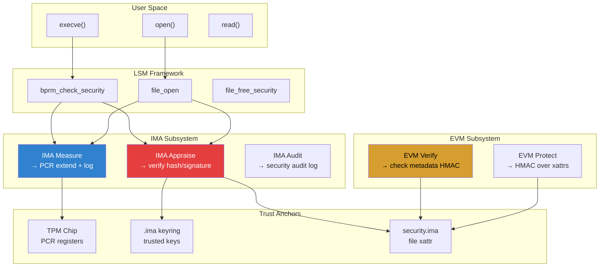
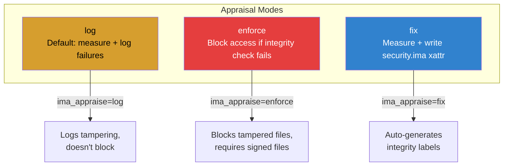
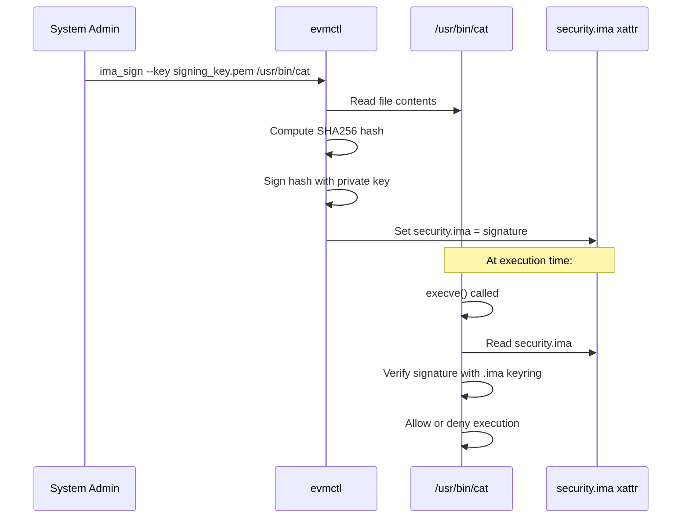
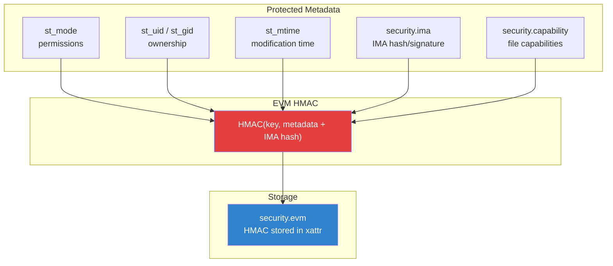
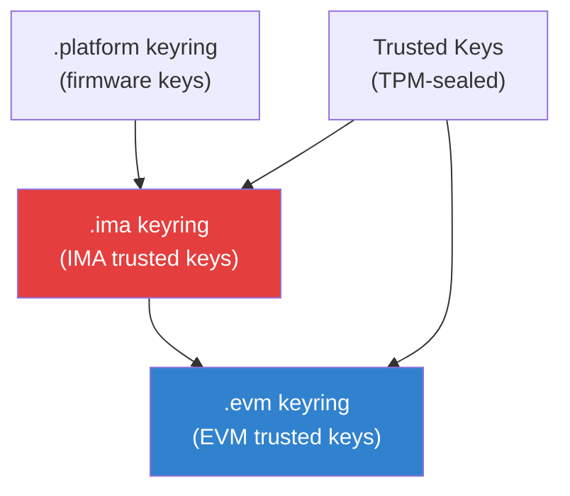
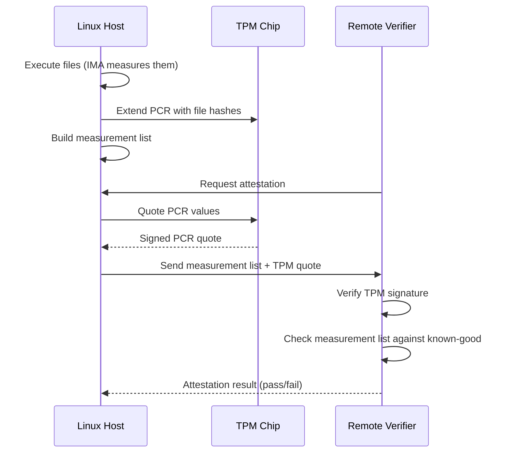
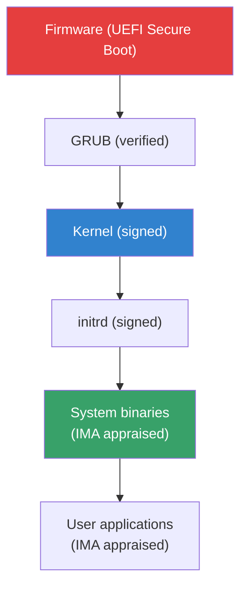

# IMA/EVM: Linux Integrity Measurement and Appraisal

## Introduction

IMA (Integrity Measurement Architecture) and EVM (Extended Verification Module) are Linux kernel security subsystems that provide **file integrity measurement** and **appraisal**. Together, they form the Linux integrity subsystem, ensuring that files haven't been tampered with and that only trusted code executes.

IMA measures file contents by computing cryptographic hashes when files are executed, opened, or read. EVM extends this by protecting file metadata (permissions, ownership, extended attributes) from tampering. Both rely on the kernel keyring and TPM (Trusted Platform Module) hardware for cryptographic operations and trust anchoring.

Key capabilities:
- **Measurement** — log hashes of executed/loaded files (IMA)
- **Appraisal** — enforce integrity checks before file access (IMA-appraisal)
- **Metadata protection** — prevent tampering with file attributes (EVM)
- **Digital signatures** — verify file authenticity using PKI (IMA-sig)
- **Remote attestation** — prove system integrity to remote parties

## Architecture Overview



## IMA: Integrity Measurement Architecture

### What IMA Does

IMA maintains a **measurement list** — a running log of every file that has been executed or opened for reading. Each entry contains:
- File path
- SHA256/SHA1 hash of file contents
- Who triggered the measurement

The measurement list is analogous to a bank's transaction log — it records what happened, not whether it was allowed.

### IMA Policy

IMA uses a policy to determine which files are measured and/or appraised. The policy is loaded via `/sys/kernel/security/ima/policy`.

```bash
# Basic IMA policy
# Measure all executed files
measure func=BPRM_CHECK

# Measure all files opened for reading by UID 0
measure func=FILE_CHECK mask=MAY_READ uid=0

# Appraise all executed files (enforce integrity)
appraise func=BPRM_CHECK

# Appraise all files opened for writing
appraise fowner=0 func=FILE_CHECK mask=MAY_WRITE
```

### IMA Policy Syntax

```
[action] [condition...]
```

**Actions:**
| Action | Description |
|--------|-------------|
| `measure` | Hash the file and extend TPM PCR + add to measurement log |
| `appraise` | Verify file integrity (hash or signature) before access |
| `dont_appraise` | Skip appraisal for matching files |
| `audit` | Log file access with hash information |

**Conditions:**
| Condition | Description |
|-----------|-------------|
| `func=` | Hook: `BPRM_CHECK`, `FILE_CHECK`, `MMAP_CHECK`, `MODULE_CHECK`, `FIRMWARE_CHECK` |
| `mask=` | Access mode: `MAY_EXEC`, `MAY_READ`, `MAY_WRITE`, `MAY_APPEND` |
| `uid=` | Match file owner UID |
| `fowner=` | Match file owner |
| `fsmagic=` | Match filesystem magic number |
| `fsuuid=` | Match filesystem UUID |
| `fsname=` | Match filesystem name |
| `appraise_type=` | Appraisal method: `imasig`, `imasig|modsig` |

### Loading IMA Policy

```bash
# Load policy at boot (kernel command line)
# ima_policy=tcb  (default: measure executed files)

# Load custom policy
echo 'measure func=BPRM_CHECK' > /sys/kernel/security/ima/policy

# Read current policy
cat /sys/kernel/security/ima/policy

# View measurement log
cat /sys/kernel/security/ima/ascii_runtime_measurements

# View binary measurement log (for TPM attestation)
cat /sys/kernel/security/ima/binary_runtime_measurements
```

### IMA Measurement Log Format

```
10 <PCR> <hash> <template> <path>
```

Example:
```
10 0 92b3ed25c1781d0f31f23b4c1e4e6a8c1b3d7f8a ima-ng sha256:abc123... /usr/bin/cat
10 0 a7c4e91f2b3d5e6f8a9b0c1d2e3f4a5b6c7d8e9f ima-sig sha256:def456... /usr/bin/ls
```

## IMA Appraisal

IMA appraisal enforces integrity by verifying file hashes or digital signatures before allowing access.

### Appraisal Modes



### Setting Up IMA Appraisal

```bash
# Enable IMA appraisal at boot (kernel command line)
# ima_appraise=enforce ima_policy=tcb

# Generate IMA signatures for files
evmctl ima_sign --hashalgo sha256 --key /path/to/signing_key.pem /usr/bin/cat

# Verify a signature
evmctl ima_verify --key /path_to/x509_cert.der /usr/bin/cat

# Set simple hash (for fix mode)
evmctl ima_hash /usr/bin/cat
```

### File Signature Workflow



## EVM: Extended Verification Module

### What EVM Protects

While IMA protects file **contents**, EVM protects file **metadata**:

- File permissions (`st_mode`)
- File ownership (`st_uid`, `st_gid`)
- File modification time (`st_mtime`)
- Extended attributes (`security.*`, `system.*`, `user.*`)

EVM computes an HMAC over these metadata fields and stores it in the `security.evm` extended attribute.

### EVM Architecture



### EVM Keys

EVM uses a symmetric HMAC key:

```bash
# Generate EVM HMAC key
openssl rand -out /etc/keys/evm-key 32

# Load key into kernel keyring (requires TPM-sealed key in production)
keyctl add user evm-key "$(cat /etc/keys/evm-key)" @u

# Enable EVM
echo 1 > /sys/kernel/security/evm
```

### EVM Modes

```bash
# EVM mode (set at boot via kernel command line)
# evm=fix    — compute and store HMAC (development)
# evm= HMAC  — verify HMAC on every access (enforcement)
# (default)   — no EVM unless enabled at runtime

# Check current EVM status
cat /sys/kernel/security/evm
# 0: disabled
# 1: HMAC verification enabled
# 2: digital signature verification enabled

# Enable EVM at runtime
echo 1 > /sys/kernel/security/evm
```

### EVM Key Types

| Key | Source | Use |
|-----|--------|-----|
| `evm-key` (HMAC) | Symmetric key file | Compute/verify HMAC over metadata |
| `evm-key` (RSA) | TPM-sealed RSA key | Digital signature over metadata |
| TPM key | TPM hardware | Seal/unseal HMAC key |

## Digital Signatures in IMA/EVM

### IMA Signature Format

IMA supports X.509-based digital signatures stored in the `security.ima` extended attribute:

```
security.ima = 0x04 | signature
```

The first byte indicates the type:
- `0x04` — IMA signature (v2 format)
- `0x03` — IMA hash (legacy)
- `0x05` — IMA signature with modsig (module signature)

### Signing Files

```bash
# Install evmctl
sudo apt install evm-utils    # Debian/Ubuntu
sudo dnf install evm-utils    # Fedora

# Generate signing key pair
openssl req -new -x509 -newkey rsa:2048 -keyout signing_key.pem \
    -outform DER -out signing_cert.der -days 365 \
    -subj "/CN=IMA Signing Key" -nodes

# Sign a file
evmctl ima_sign --hashalgo sha256 --key signing_key.pem /usr/bin/cat

# Verify signature
evmctl ima_verify --key signing_cert.der /usr/bin/cat

# Load public key into kernel .ima keyring
evmctl import signing_cert.der
```

### Keyring Hierarchy



## Configuring IMA/EVM on a Real System

### Kernel Configuration

```bash
CONFIG_IMA=y                    # Enable IMA
CONFIG_IMA_APPRAISE=y           # Enable IMA appraisal
CONFIG_IMA_APPRAISE_SIGNED_POLICY=y  # Signed policy support
CONFIG_IMA_TRUSTED_KEYRING=y    # Use trusted keyring
CONFIG_EVM=y                    # Enable EVM
CONFIG_EVM_ATTR_FSUUID=y        # Include filesystem UUID in HMAC
CONFIG_INTEGRITY=y              # Integrity subsystem base
CONFIG_TCG_TPM=y                # TPM driver
CONFIG_TCG_TIS=y                # TPM Interface Specification
```

### Boot Configuration (GRUB)

```bash
# /etc/default/grub
GRUB_CMDLINE_LINUX="... ima_policy=tcb ima_appraise=enforce evm=fix"
```

### Complete Setup Script

```bash
#!/bin/bash
# setup-ima-evm.sh — Configure IMA/EVM on a running system

set -e

echo "=== IMA/EVM Setup ==="

# Step 1: Load EVM HMAC key
if [ -f /etc/keys/evm-key ]; then
    keyctl add user evm-key "$(cat /etc/keys/evm-key)" @u
    echo "[+] EVM key loaded"
fi

# Step 2: Enable EVM (fix mode first to generate HMACs)
echo 1 > /sys/kernel/security/evm
echo "[+] EVM enabled"

# Step 3: Load IMA policy
cat > /tmp/ima-policy << 'EOF'
# Measure all executables
measure func=BPRM_CHECK

# Measure all libraries
measure func=FILE_CHECK mask=MAY_READ fowner=0

# Appraise all executables
appraise func=BPRM_CHECK

# Appraise all kernel modules
appraise func=MODULE_CHECK

# Don't appraise pseudo-filesystems
dont_appraise fsmagic=0x9fa0
dont_appraise fsmagic=0x62656572
dont_appraise fsmagic=0x64626720
dont_appraise fsmagic=0x01021994
dont_appraise fsmagic=0x858458f6
dont_appraise fsmagic=0x73636673
EOF

echo 'measure func=BPRM_CHECK' > /sys/kernel/security/ima/policy
echo "[+] IMA policy loaded"

# Step 4: Generate EVM HMACs for system files
find /usr -type f -executable | while read f; do
    evmctl ima_hash "$f" 2>/dev/null
done
echo "[+] EVM HMACs generated"

echo "=== Setup complete ==="
```

## Remote Attestation

IMA measurement lists can be sent to a remote verifier to prove system integrity:



### Using keyctl for TPM Operations

```bash
# List keys in .ima keyring
keyctl list %:.ima

# Show key details
keyctl show

# Read IMA measurement log
head -20 /sys/kernel/security/ima/ascii_runtime_measurements

# Count measurement entries
wc -l /sys/kernel/security/ima/ascii_runtime_measurements
```

## Troubleshooting

### Common Issues

| Symptom | Cause | Solution |
|---------|-------|----------|
| `Permission denied` on exec | IMA appraisal in enforce mode without signature | Sign files with `evmctl ima_sign` |
| `security.ima` not set | IMA fix mode not generating hashes | Run `evmctl ima_hash` on files |
| EVM HMAC mismatch | File metadata changed | Re-generate HMAC with `evmctl ima_hash` |
| Policy load fails | Syntax error in policy | Check `dmesg` for parse errors |
| TPM not available | TPM driver not loaded | `modprobe tpm_tis` |
| Keyring empty | Keys not loaded | Load keys with `keyctl` or `evmctl import` |

### Debugging

```bash
# Check IMA/EVM kernel support
grep -E 'IMA|EVM|INTEGRITY' /boot/config-$(uname -r)

# View IMA audit messages
ausearch -m INTEGRITY_DATA -i

# Check IMA policy
cat /sys/kernel/security/ima/policy

# Check EVM status
cat /sys/kernel/security/evm

# View kernel integrity messages
dmesg | grep -i 'ima\|evm\|integrity'

# List xattrs on a file
getfattr -n security.ima -n security.evm /usr/bin/cat

# Verify IMA signature manually
evmctl ima_verify --key /path/to/cert.der /usr/bin/ls
```

### Audit Events

```bash
# IMA generates audit records for:
# - INTEGRITY_DATA: hash mismatches
# - INTEGRITY_STATUS: appraisal results
# - INTEGRITY_HASH: computed hashes
# - INTEGRITY_PCR: TPM PCR events

# Search for integrity violations
ausearch -m INTEGRITY_DATA --interpret

# Watch integrity events in real-time
tail -f /var/log/audit/audit.log | grep INTEGRITY
```

## Use Cases

### Secure Boot Chain



### Container Image Verification

```bash
# IMA can verify container image contents
# At image build time: sign all files
find /rootfs -type f | xargs -I{} evmctl ima_sign --key key.pem {}

# At container runtime: IMA appraises files
# Container runtime sets IMA policy for container mounts
```

## Further Reading

- [Linux IMA documentation](https://www.kernel.org/doc/html/latest/security/IMA.html)
- [IMA/EVM Wiki](https://sourceforge.net/p/linux-ima/wiki/)
- [LWN: IMA and EVM](https://lwn.net/Articles/461026/)
- [evmctl man page](https://man7.org/linux/man-pages/man1/evmctl.1.html)
- [LWN: Digital signatures for IMA](https://lwn.net/Articles/621953/)
- [TPM 2.0 and Linux](https://tpm2-software.github.io/)

## See Also

- [Secure Boot](./secure-boot.md) — UEFI secure boot chain
- [SELinux](./selinux.md) — mandatory access control
- [Keyring](./keyring.md) — kernel key management
- [Audit](./audit.md) — security audit framework
- [Cryptography](./cryptography.md) — kernel crypto API
