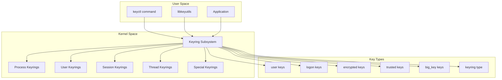
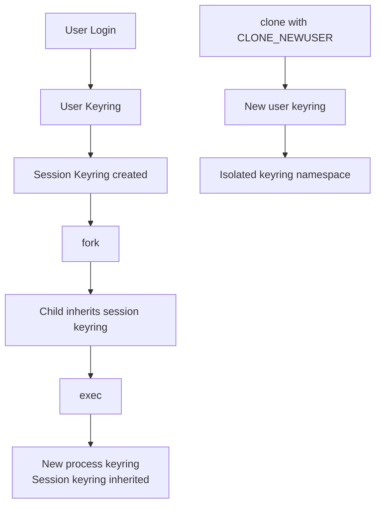
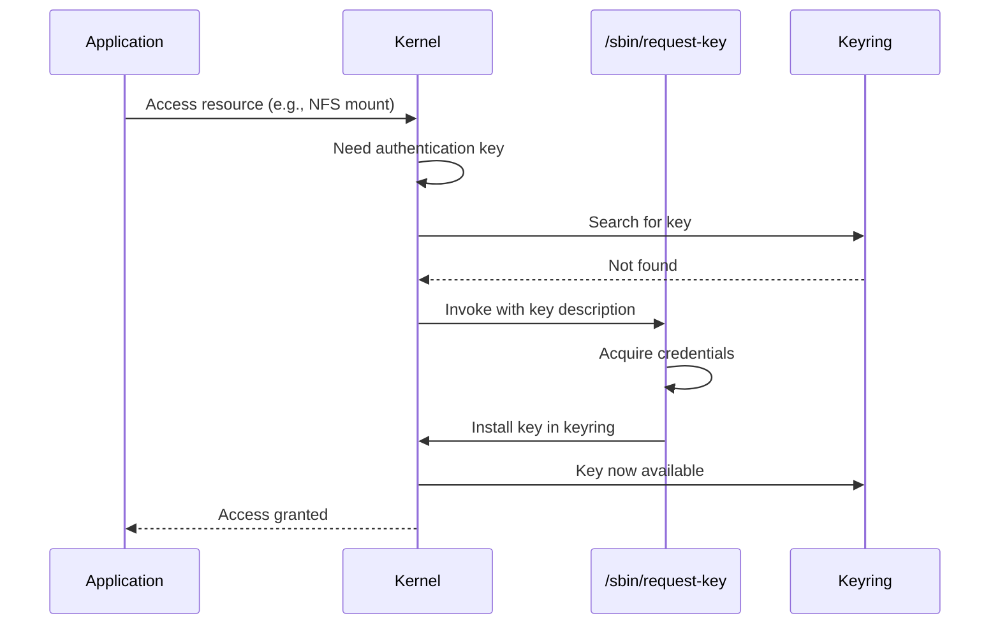

# Linux Keyring: Kernel Key Management

## Introduction

The Linux kernel keyring subsystem provides a secure mechanism for storing, managing, and retrieving cryptographic keys, authentication tokens, and other sensitive data. It operates entirely in kernel space, preventing user-space processes from directly accessing key material. The keyring is used by dm-crypt, EVM (Extended Verification Module), DNS resolution, file system encryption, and many other subsystems.

Understanding the keyring is essential for system security, disk encryption, and building secure applications that need to manage secrets without exposing them in process memory.

## Architecture



## Key Types

The kernel supports several key types, each with specific security properties:

### user Keys

The simplest key type—stores arbitrary data in kernel memory:

```bash
# Add a user key
keyctl add user mykey "secret_data" @u

# Add with specific keyring
keyctl add user mykey "secret_data" @s  # session keyring

# Read the key
keyctl print $(keyctl search @u user mykey)
```

```c
#include <keyutils.h>

/* Add a user key */
key_serial_t key = add_key("user", "mykey", 
                            "secret_data", 11, 
                            KEY_SPEC_SESSION_KEYRING);

/* Read the key */
char buffer[256];
keyctl_read(key, buffer, sizeof(buffer));
```

### logon Keys

Used for authentication—cannot be read by user space, only used by the kernel:

```bash
# Add a logon key (for kernel authentication)
keyctl add logon "cifs:myserver" "username:password" @s

# Cannot read logon keys from userspace
keyctl print <key_id>  # ERROR: Operation not permitted

# But kernel subsystems can use them
```

Logon keys are used by:
- **CIFS/SMB**: Store server credentials.
- **AF_RXRPC**: Store authentication tokens.
- **DNS**: Store DNS resolution keys.
- **dm-crypt**: Store disk encryption keys.

### encrypted Keys

Keys that are encrypted at rest using a **master key** (either a trusted key or a user-provided key). The key material is never stored in plaintext on disk:

```bash
# Create an encrypted key (uses kernel RNG for key data)
keyctl add encrypted mykey "new 32" @u

# The format is: "new <keylen>" or "load <hex_data>"
# Keylen is in bytes (32 = 256-bit key)

# Create encrypted key with specific master key
keyctl add encrypted mykey "new 32 master_key_name" @u

# Load from hex (persistent)
keyctl add encrypted mykey "load <hex_blob>" @u
```

### trusted Keys

Keys that are sealed to the **TPM (Trusted Platform Module)** chip. The key material is encrypted by the TPM and can only be decrypted by the same TPM:

```bash
# Create a trusted key (requires TPM)
keyctl add trusted mykey "new 32" @u

# Create with specific TPM options
keyctl add trusted mykey "new 32 keyhandle=0x81000001" @u

# Trusted keys are sealed to the TPM
# Cannot be extracted without the TPM
```

Trusted keys use the TPM's **seal** operation:
1. Generate random key data in the kernel.
2. Encrypt the key data using the TPM's **Storage Root Key (SRK)**.
3. Store the encrypted blob in the keyring.
4. To use: decrypt via TPM **unseal** operation.


### big_key Keys

For keys larger than what the standard key payload can hold:

```bash
# big_key stores data in tmpfs or encrypted
keyctl add big_key largedata "very_large_secret_data..." @u
```

big_key keys are stored in tmpfs by default. With `CONFIG_BIG_KEYS` enabled, they are encrypted at rest.

### keyring Type

A keyring itself is a key—it contains references to other keys:

```bash
# Create a named keyring
keyctl newring myring @u

# Link keys into it
keyctl link <key_id> <keyring_id>

# Unlink
keyctl unlink <key_id> <keyring_id>

# List contents
keyctl list <keyring_id>
```

### Key Type Security Properties

| Key Type | Storage | Extractable | TPM-bound | Max Size |
|----------|---------|-------------|-----------|----------|
| user | Kernel memory | Yes (readable) | No | 32 KiB |
| logon | Kernel memory | No (kernel only) | No | 32 KiB |
| encrypted | Encrypted blob | Encrypted only | Optional | 32 KiB |
| trusted | TPM-sealed blob | No (TPM required) | Yes | 32 KiB |
| big_key | tmpfs (encrypted) | Depends | No | 1 MiB+ |
| keyring | N/A | N/A | N/A | N/A |

## Process Keyrings

Every process has five keyrings:

| Keyring | Lifetime | Inherited | Purpose |
|---------|----------|-----------|---------|
| **Thread** | Thread | Not inherited | Thread-specific keys |
| **Process** | Process | Across exec | Process-specific keys |
| **Session** | Login session | Across fork | Session-wide keys |
| **User** | User login | Across sessions | Per-user keys |
| **User default** | User | Linked from user keyring | Default for new sessions |

```bash
# Show current keyrings
keyctl show

# Output example:
# Session Keyring
#  87654321 --alswrv  1000  1000  keyring: _ses
#  12345678 --alswrv  1000  1000   \_ user: mykey

# Show specific keyring
keyctl show @s  # session
keyctl show @p  # process
keyctl show @t  # thread
keyctl show @u  # user

# Add to specific keyring
keyctl add user mykey "data" @p   # process keyring
keyctl add user mykey "data" @t   # thread keyring
keyctl add user mykey "data" @s   # session keyring
keyctl add user mykey "data" @u   # user keyring
```

### Keyring Inheritance



### Persistent Keyring

```bash
# Persistent keyring survives logout
keyctl add user persistent-key "data" @p

# Access persistent keyring
keyctl show @p

# Persistent keyring is created on first access
# Lives until explicitly cleared or system reboot
```

## keyctl: The Command-Line Interface

### Basic Operations

```bash
# List all keys
keyctl list @s
keyctl show

# Add a key
keyctl add <type> <desc> <data> <keyring>

# Read a key
keyctl print <key_id>

# Pipe a key (to stdin of a program)
keyctl pipe <key_id> <command>

# Search for a key
keyctl search <keyring> <type> <description>

# Update a key
keyctl update <key_id> <new_data>

# Revoke a key (permanent)
keyctl revoke <key_id>

# Invalidate a key (immediate removal)
keyctl invalidate <key_id>

# Set timeout
keyctl timeout <key_id> <seconds>

# Link/unlink keys
keyctl link <key_id> <keyring>
keyctl unlink <key_id> <keyring>

# Clear a keyring
keyctl clear @s

# Get key ID by description
keyctl request <type> <description>
```

### Advanced Operations

```bash
# Set permissions
keyctl setperm <key_id> <mask>
# mask: 0x3f3f3f3f = all permissions for all users

# Example: owner can read, others can't
keyctl setperm <key_id> 0x3f000000

# Permissions bits:
# 0x01 - view
# 0x02 - read
# 0x04 - write
# 0x08 - search
# 0x10 - link
# 0x20 - set attribute

# Join a session keyring
keyctl join <keyring>
keyctl session  # Start new session with new keyring

# Negative keys (cache negative lookups)
keyctl negate <key_id> <timeout> <keyring>

# Get security context
keyctl describe <key_id>
# Output: key_id;type;uid;gid;perm;description
```

### keyctl Session Management

```bash
# Start a new session with a fresh keyring
keyctl session
# Runs a shell with a new session keyring

# Start session with specific name
keyctl session mysession

# Run command in new session
keyctl session mysession -- /bin/bash

# Join an existing keyring
keyctl join myring
```

## Kernel API (keyutils Library)

```c
#include <keyutils.h>

/* Search for a key */
key_serial_t key = keyctl_search(KEY_SPEC_SESSION_KEYRING, 
                                  "user", "mykey", 0);

/* Read key data */
char buffer[4096];
long len = keyctl_read(key, buffer, sizeof(buffer));

/* Update a key */
keyctl_update(key, "new_data", 8);

/* Revoke a key */
keyctl_revoke(key);

/* Set timeout */
keyctl_set_timeout(key, 300);  /* 5 minutes */

/* Clear a keyring */
keyctl_clear(KEY_SPEC_SESSION_KEYRING);

/* Link/unlink */
keyctl_link(key, KEY_SPEC_USER_KEYRING);
keyctl_unlink(key, KEY_SPEC_USER_KEYRING);

/* Create a keyring */
key_serial_t ring = keyctl_join_keyring("myring", 
                                          KEY_SPEC_SESSION_KEYRING,
                                          KEYRING_JOIN_JOIN);

/* Get keyring ID */
key_serial_t session_id = keyctl_get_keyring_id(
    KEY_SPEC_SESSION_KEYRING, 0);
```

### Request-Key Mechanism

When the kernel needs a key it doesn't have, it invokes `/sbin/request-key`:

```bash
# /etc/request-key.conf
# OP  TYPE    DESCRIPTION  CALLER_INFO  PROGRAM  ARG1  ARG2  ...
create  user    *        *    /usr/bin/keyctl negate %k 3600
create  cifs    *        *    /usr/sbin/cifs.upcall %k
create  dns_resolver *   *    /usr/sbin/key.dns_resolver %k
```



## Use in dm-crypt / LUKS

The keyring is used to securely manage disk encryption keys:

```bash
# dm-crypt can use a key from the kernel keyring
cryptsetup open --type=plain /dev/sdb1 encrypted_vol \
    --key-file=/dev/stdin <<< "my_secret_key"

# Or use a keyring key (more secure)
# Step 1: Add key to keyring
keyctl add logon "cryptsetup:myvolume" "my_key_data" @u

# Step 2: Use the keyring key
cryptsetup open /dev/sdb1 encrypted_vol \
    --keyring-keyring=@u --keyring-key=cryptsetup:myvolume
```

### LUKS2 and Keyring Integration

```bash
# LUKS2 supports storing keys in the kernel keyring
# This prevents the key from being in process memory

# Add a key to the keyring
keyctl add encrypted "luks:mydisk" "new 32" @s

# Use it with LUKS
cryptsetup luksOpen /dev/sdb1 mydisk \
    --keyring-slot=0 --key-file=/dev/stdin

# The key is stored encrypted in the keyring
# and only decrypted in kernel space when needed
```

### systemd and Keyring

```bash
# systemd-ask-password uses the keyring
systemd-ask-password "Enter passphrase:" | \
    keyctl add user "systemd:mydisk" - @u

# systemd-cryptsetup can use keyring
# /etc/crypttab
# mydisk /dev/sdb1 none luks,keyring
```

## Use in DNS Resolution

The kernel's DNS resolver uses the keyring to cache DNS results:

```bash
# DNS resolver keys are stored in the keyring
keyctl search @u dns_resolver "example.com"

# View DNS cache
keyctl list @u | grep dns_resolver

# DNS keys are automatically managed by the kernel
# They expire based on TTL
```

## Security Properties

### Key Material Protection

| Key Type | Storage | Extractable | TPM-bound |
|----------|---------|-------------|-----------|
| user | Kernel memory | Yes (readable) | No |
| logon | Kernel memory | No (kernel only) | No |
| encrypted | Encrypted blob | Encrypted only | Optional |
| trusted | TPM-sealed blob | No (TPM required) | Yes |
| big_key | tmpfs (encrypted) | Depends | No |

### Key Access Control

```c
/* Key permissions (POSIX-like) */
#define KEY_POS_VIEW    0x01000000  /* Owner: view */
#define KEY_POS_READ    0x02000000  /* Owner: read */
#define KEY_POS_WRITE   0x04000000  /* Owner: write */
#define KEY_POS_SEARCH  0x08000000  /* Owner: search */
#define KEY_POS_LINK    0x10000000  /* Owner: link */
#define KEY_POS_SETATTR 0x20000000  /* Owner: set attributes */

/* Same for group and other */
#define KEY_GRP_READ    0x00020000
#define KEY_OTH_READ    0x00000200
```

### Negative Keys

Cache the absence of a key to avoid repeated lookups:

```bash
# Create a negative key (expires after 5 minutes)
keyctl negate <request_key_id> 300 @s
```

Negative keys prevent repeated failed lookups for non-existent keys, improving performance.

## Namespaces and Containers

Keyrings are namespace-aware:

```bash
# In a container, the keyring namespace is isolated
# Keys added inside the container are not visible outside

# Unsharing creates a new keyring namespace
unshare --user --key myapp

# Container keyring isolation
# Docker containers get their own keyring namespace
docker run --rm alpine keyctl show
# Shows container's own keyring, not host's
```

### Keyring in Containers

```bash
# Container keyrings are isolated by default
# Keys in container don't leak to host

# Check container keyring
docker run --rm alpine sh -c 'keyctl show'
# Session Keyring
#  12345678 --alswrv     0     0  keyring: _ses

# Add key in container
docker run --rm alpine sh -c 'keyctl add user test "data" @s; keyctl show'
# Session Keyring
#  12345678 --alswrv     0     0  keyring: _ses
#  87654321 --alswrv     0     0   \_ user: test
```

## Troubleshooting

```bash
# Check keyring state
keyctl show @s

# View keyring contents (requires permission)
keyctl list @s

# Check /proc/keys (all visible keys)
cat /proc/keys

# Check /proc/key-users (key usage statistics)
cat /proc/key-users

# Debug key operations
echo 1 > /proc/sys/kernel/keys/debug  # (if available)

# Common issues:
# - "Key has expired" — key timeout reached
# - "Permission denied" — key permissions don't allow access
# - "Key has been revoked" — keyctl revoke was called
# - "Required key not available" — key not in keyring, request-key failed
# - "Key has been invalidated" — keyctl invalidate was called
```

### Debug Commands

```bash
# List all keys in all keyrings
cat /proc/keys

# Show key usage statistics
cat /proc/key-users
# uid: __key_jumlah_perms

# Check specific key
keyctl describe <key_id>
# Output: <key_id>;<type>;<uid>;<gid>;<perm>;<description>

# Check keyring links
keyctl list @s

# Monitor key operations
# Use auditd to track key operations
ausearch -k keyring
```

### Common Error Messages

```bash
# "Key has expired"
# Cause: keyctl timeout was reached
# Fix: Recreate key or increase timeout

# "Permission denied"
# Cause: Key permissions don't allow access
# Fix: Check keyctl describe, adjust with keyctl setperm

# "Required key not available"
# Cause: Key not in keyring, request-key failed
# Fix: Add key to keyring or fix request-key.conf

# "Key has been revoked"
# Cause: keyctl revoke was called
# Fix: Cannot unrevoke, must create new key

# "Operation not permitted"
# Cause: Trying to read logon/encrypted key from userspace
# Fix: Use kernel API instead of keyctl print
```

## Kernel Configuration

```
CONFIG_KEYS=y                    # Kernel keyring support
CONFIG_ENCRYPTED_KEYS=y          # Encrypted key type
CONFIG_TRUSTED_KEYS=y            # Trusted key type (TPM)
CONFIG_ASYMMETRIC_KEY_TYPE=y     # Asymmetric key support
CONFIG_BIG_KEYS=y                # Big key support (>32 KiB)
CONFIG_KEY_DH_OPERATIONS=y       # Diffie-Hellman operations
CONFIG_KEY_NOTIFICATIONS=y       # Key change notifications
```

## Further Reading

- [Linux kernel docs: Keys](https://docs.kernel.org/security/keys/index.html) — Kernel keyring documentation
- [keyctl(1) man page](https://man7.org/linux/man-pages/man1/keyctl.1.html) — keyctl command reference
- [keyutils(7) man page](https://man7.org/linux/man-pages/man7/keyutils.7.html) — Kernel key management
- [LWN: Kernel keyring](https://lwn.net/Articles/646362/) — Keyring subsystem overview
- [dm-crypt documentation](https://gitlab.com/cryptsetup/cryptsetup/-/wikis/Documentation) — Disk encryption docs
- [TPM and trusted keys](https://man7.org/linux/man-pages/man5/key.dns_resolver.5.html) — Trusted key documentation
- [Kernel docs: encrypted keys](https://www.kernel.org/doc/html/latest/security/keys/trusted-encrypted.html) — Encrypted and trusted keys
