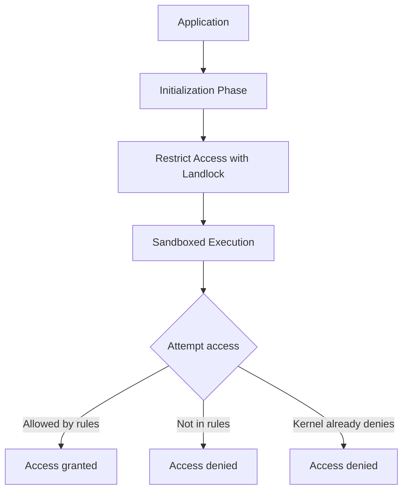
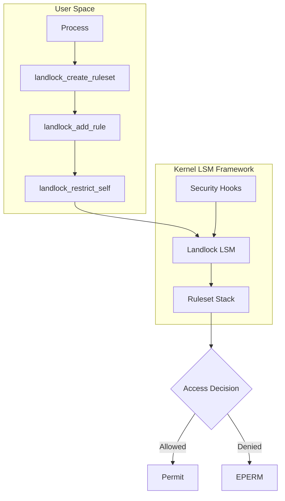
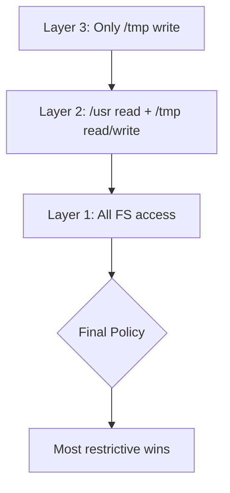

# Landlock: Unprivileged Sandboxing

## Introduction

Landlock is a Linux security module (LSM) that enables **unprivileged process sandboxing**.
Introduced in Linux 5.13, Landlock allows any process to restrict its own access rights
(and those of its children) without requiring root privileges or any specific capabilities.
Unlike SELinux or AppArmor, which are managed by system administrators, Landlock is
designed to be used by applications themselves to reduce their attack surface after
they have performed necessary initialization.

## Design Principles



Key principles:
1. **Unprivileged**: No root or capabilities required
2. **Composable**: Multiple layers can stack
3. **Progressive**: Rules can only restrict, never expand access
4. **Filesystem-centric**: Primarily controls file access
5. **ABI-versioned**: Forward-compatible through versioned rule types

## Architecture



## System Calls

Landlock provides three system calls:

### landlock_create_ruleset()

Creates a new ruleset for collecting access control rules:

```c
#include <linux/landlock.h>
#include <sys/syscall.h>

int landlock_create_ruleset(const struct landlock_ruleset_attr *attr,
                             size_t size, __u32 flags)
{
    return syscall(__NR_landlock_create_ruleset, attr, size, flags);
}
```

```c
struct landlock_ruleset_attr {
    __u64 handled_access_fs;    /* Filesystem access rights to control */
    __u64 handled_access_net;   /* Network access rights (Linux 6.7+) */
};
```

### landlock_add_rule()

Adds a rule (e.g., filesystem path access) to a ruleset:

```c
int landlock_add_rule(int ruleset_fd, enum landlock_rule_type rule_type,
                       const void *rule_attr, __u32 flags)
{
    return syscall(__NR_landlock_add_rule, ruleset_fd, rule_type,
                    rule_attr, flags);
}
```

### landlock_restrict_self()

Applies the ruleset to the calling process:

```c
int landlock_restrict_self(int ruleset_fd, __u32 flags)
{
    return syscall(__NR_landlock_restrict_self, ruleset_fd, flags);
}
```

## Filesystem Access Rights

```c
/* Filesystem access rights (bitmask) */
#define LANDLOCK_ACCESS_FS_EXECUTE         (1ULL << 0)
#define LANDLOCK_ACCESS_FS_WRITE_FILE      (1ULL << 1)
#define LANDLOCK_ACCESS_FS_READ_FILE       (1ULL << 2)
#define LANDLOCK_ACCESS_FS_READ_DIR        (1ULL << 3)
#define LANDLOCK_ACCESS_FS_REMOVE_DIR      (1ULL << 4)
#define LANDLOCK_ACCESS_FS_REMOVE_FILE     (1ULL << 5)
#define LANDLOCK_ACCESS_FS_MAKE_CHAR       (1ULL << 6)
#define LANDLOCK_ACCESS_FS_MAKE_DIR        (1ULL << 7)
#define LANDLOCK_ACCESS_FS_MAKE_REG        (1ULL << 8)
#define LANDLOCK_ACCESS_FS_MAKE_SOCK       (1ULL << 9)
#define LANDLOCK_ACCESS_FS_MAKE_FIFO       (1ULL << 10)
#define LANDLOCK_ACCESS_FS_MAKE_BLOCK      (1ULL << 11)
#define LANDLOCK_ACCESS_FS_MAKE_SYM        (1ULL << 12)
#define LANDLOCK_ACCESS_FS_REFER           (1ULL << 13)
#define LANDLOCK_ACCESS_FS_TRUNCATE        (1ULL << 14)
```

## Network Access Rights (Linux 6.7+)

```c
#define LANDLOCK_ACCESS_NET_BIND_TCP      (1ULL << 0)
#define LANDLOCK_ACCESS_NET_CONNECT_TCP   (1ULL << 1)
```

## ABI Versioning

Landlock uses versioned ABI to maintain forward compatibility:

```c
/* ABI versions and their capabilities */
#define LANDLOCK_RULE_PATH_BENEATH  1  /* v1: Basic path restrictions */
#define LANDLOCK_RULE_NET_PORT      2  /* v2: Network port restrictions */

/* Handled access rights per version */
/* v1 (5.13+): read_file, write_file, execute, read_dir, etc. */
/* v2 (6.2+):  + remove_file, remove_dir, refer, truncate */
/* v3 (6.7+):  + network access (bind_tcp, connect_tcp) */
```

### Checking ABI Version

```c
int get_landlock_abi_version(void)
{
    return landlock_create_ruleset(NULL, 0, LANDLOCK_CREATE_RULESET_VERSION);
}
```

## Complete Example: Filesystem Sandbox

```c
#define _GNU_SOURCE
#include <linux/landlock.h>
#include <sys/syscall.h>
#include <fcntl.h>
#include <stdio.h>
#include <string.h>
#include <unistd.h>

static inline int
landlock_create_ruleset(const struct landlock_ruleset_attr *const attr,
                        const size_t size, const __u32 flags)
{
    return syscall(__NR_landlock_create_ruleset, attr, size, flags);
}

static inline int
landlock_add_rule(const int ruleset_fd,
                  const enum landlock_rule_type rule_type,
                  const void *const rule_attr, const __u32 flags)
{
    return syscall(__NR_landlock_add_rule, ruleset_fd, rule_type,
                    rule_attr, flags);
}

static inline int
landlock_restrict_self(const int ruleset_fd, const __u32 flags)
{
    return syscall(__NR_landlock_restrict_self, ruleset_fd, flags);
}

int setup_sandbox(void)
{
    int ruleset_fd, abi;
    struct landlock_ruleset_attr ruleset_attr;
    struct landlock_path_beneath_attr path_beneath;
    int err;

    /* Check Landlock ABI version */
    abi = landlock_create_ruleset(NULL, 0, LANDLOCK_CREATE_RULESET_VERSION);
    if (abi < 0) {
        perror("Landlock not supported");
        return -1;
    }
    printf("Landlock ABI version: %d\n", abi);

    /* Define which access rights to restrict */
    ruleset_attr.handled_access_fs =
        LANDLOCK_ACCESS_FS_READ_FILE |
        LANDLOCK_ACCESS_FS_WRITE_FILE |
        LANDLOCK_ACCESS_FS_READ_DIR |
        LANDLOCK_ACCESS_FS_EXECUTE |
        LANDLOCK_ACCESS_FS_MAKE_REG |
        LANDLOCK_ACCESS_FS_MAKE_DIR |
        LANDLOCK_ACCESS_FS_REMOVE_FILE |
        LANDLOCK_ACCESS_FS_REMOVE_DIR;

    /* Create ruleset */
    ruleset_fd = landlock_create_ruleset(&ruleset_attr,
                                          sizeof(ruleset_attr), 0);
    if (ruleset_fd < 0) {
        perror("landlock_create_ruleset");
        return -1;
    }

    /* Allow reading from /usr */
    int usr_fd = open("/usr", O_PATH | O_CLOEXEC);
    if (usr_fd < 0) { perror("open /usr"); return -1; }

    path_beneath.parent_fd = usr_fd;
    path_beneath.allowed_access =
        LANDLOCK_ACCESS_FS_READ_FILE |
        LANDLOCK_ACCESS_FS_READ_DIR |
        LANDLOCK_ACCESS_FS_EXECUTE;

    err = landlock_add_rule(ruleset_fd, LANDLOCK_RULE_PATH_BENEATH,
                             &path_beneath, 0);
    if (err) { perror("landlock_add_rule /usr"); return -1; }
    close(usr_fd);

    /* Allow reading and writing to /tmp */
    int tmp_fd = open("/tmp", O_PATH | O_CLOEXEC);
    if (tmp_fd < 0) { perror("open /tmp"); return -1; }

    path_beneath.parent_fd = tmp_fd;
    path_beneath.allowed_access =
        LANDLOCK_ACCESS_FS_READ_FILE |
        LANDLOCK_ACCESS_FS_WRITE_FILE |
        LANDLOCK_ACCESS_FS_READ_DIR |
        LANDLOCK_ACCESS_FS_MAKE_REG |
        LANDLOCK_ACCESS_FS_REMOVE_FILE;

    err = landlock_add_rule(ruleset_fd, LANDLOCK_RULE_PATH_BENEATH,
                             &path_beneath, 0);
    if (err) { perror("landlock_add_rule /tmp"); return -1; }
    close(tmp_fd);

    /* Apply the sandbox (irreversible) */
    err = landlock_restrict_self(ruleset_fd, 0);
    if (err) { perror("landlock_restrict_self"); return -1; }

    close(ruleset_fd);
    printf("Sandbox applied!\n");
    return 0;
}

int main(void)
{
    if (setup_sandbox())
        return 1;

    /* Now restricted: can read /usr, read/write /tmp */
    /* Cannot access /etc, /home, /root, etc. */

    /* This works: */
    FILE *f = fopen("/tmp/test.txt", "w");
    if (f) {
        fprintf(f, "sandboxed write\n");
        fclose(f);
    }

    /* This fails with EPERM: */
    f = fopen("/etc/passwd", "r");
    if (!f) {
        perror("Access to /etc/passwd denied (expected)");
    }

    return 0;
}
```

## Network Sandbox Example (Linux 6.7+)

```c
int setup_network_sandbox(void)
{
    struct landlock_ruleset_attr ruleset_attr = {
        .handled_access_net =
            LANDLOCK_ACCESS_NET_BIND_TCP |
            LANDLOCK_ACCESS_NET_CONNECT_TCP,
    };

    int ruleset_fd = landlock_create_ruleset(&ruleset_attr,
                                              sizeof(ruleset_attr), 0);
    if (ruleset_fd < 0) return -1;

    /* Allow binding to port 8080 */
    struct landlock_net_port_attr port_attr = {
        .allowed_access = LANDLOCK_ACCESS_NET_BIND_TCP,
        .port = 8080,
    };

    landlock_add_rule(ruleset_fd, LANDLOCK_RULE_NET_PORT,
                       &port_attr, 0);

    /* Apply */
    landlock_restrict_self(ruleset_fd, 0);
    close(ruleset_fd);

    /* Now: can bind to port 8080 only */
    /* Cannot bind to any other port */
    /* Cannot connect to remote TCP */
    return 0;
}
```

## Rule Stacking

Landlock supports stacking multiple ruleset layers:



```c
/* Each restrict_self() call adds a new layer */
/* Layers can only restrict, never expand */

/* Layer 1: Full access (before any restrictions) */
/* Process starts with all normal permissions */

/* Layer 2: Restrict to /usr and /tmp */
landlock_restrict_self(ruleset_fd_2, 0);

/* Layer 3: Further restrict to only /tmp write */
landlock_restrict_self(ruleset_fd_3, 0);
/* Now only /tmp write is allowed */
```

## LSM Integration

Landlock hooks into the LSM framework at key security decision points:

```c
/* security/landlock/fs.c - simplified hook */
static int hook_file_open(const struct file *file)
{
    /* Check the Landlock ruleset stack */
    return check_access(file->f_path.dentry,
                         LANDLOCK_ACCESS_FS_READ_FILE);
}

static int hook_inode_create(struct inode *dir,
                              struct dentry *dentry, umode_t mode)
{
    return check_access(dir,
                         LANDLOCK_ACCESS_FS_MAKE_REG);
}
```

### Hook Points

| LSM Hook | Landlock Control |
|----------|-----------------|
| `file_open` | read_file, write_file, execute |
| `inode_create` | make_reg, make_dir, make_sock, etc. |
| `inode_unlink` | remove_file |
| `inode_rmdir` | remove_dir |
| `inode_rename` | refer (cross-directory moves) |
| `inode_mkdir` | make_dir |
| `file_truncate` | truncate |
| `socket_bind` | bind_tcp |
| `socket_connect` | connect_tcp |

## Comparison with Other Sandboxing

| Feature | Landlock | seccomp | SELinux | AppArmor |
|---------|----------|---------|---------|----------|
| Unprivileged | ✓ | ✓ | ✗ | ✗ |
| File path control | ✓ | ✗ | ✓ | ✓ |
| Network control | ✓ (v3) | ✗ | ✓ | ✓ |
| Syscall filtering | ✗ | ✓ | ✗ | ✗ |
| Stacking | ✓ | ✓ | ✗ | ✗ |
| Policy complexity | Low | Medium | High | Medium |
| Per-process | ✓ | ✓ | System-wide | System-wide |

### Combining Landlock with seccomp

```c
/* Use Landlock for filesystem + seccomp for syscalls */
int setup_full_sandbox(void)
{
    /* First: restrict filesystem with Landlock */
    setup_landlock_sandbox();

    /* Then: restrict syscalls with seccomp */
    setup_seccomp_filter();

    return 0;
}
```

## Tools and Libraries

### landlock-utils

```bash
# Install
apt install landlock-utils

# Create and apply a sandbox
landlock-sandbox --read /usr --read /lib --write /tmp -- /usr/bin/myapp
```

### Rust Binding

```rust
use landlock::*;

fn sandbox() -> Result<(), Error> {
    let ruleset = Ruleset::new()
        .handle_access(AccessFs::from_all(ABI::V2))?
        .create()?;

    ruleset.add_rule(PathBeneath::new(
        PathFd::new("/usr")?,
        AccessFs::from_read(ABI::V2),
    ))?;

    ruleset.restrict_self()?;
    Ok(())
}
```

## Kernel Configuration

```
CONFIG_SECURITY_LANDLOCK=y
```

## Detection in User Space

```c
int check_landlock_support(void)
{
    int abi = landlock_create_ruleset(NULL, 0,
                                       LANDLOCK_CREATE_RULESET_VERSION);
    if (abi < 0) {
        if (errno == ENOSYS)
            printf("Landlock not supported by kernel\n");
        else if (errno == EOPNOTSUPP)
            printf("Landlock disabled (CONFIG_SECURITY_LANDLOCK=n)\n");
        return 0;
    }
    printf("Landlock ABI version: %d\n", abi);
    return abi;
}
```

## Cross-References

- [seccomp](seccomp.md) - System call filtering (complementary)
- [SELinux](selinux.md) - Mandatory access control
- [AppArmor](apparmor.md) - Path-based mandatory access control
- [Capabilities](capabilities.md) - Fine-grained privileges
- [Security Model](security-model.md) - Linux security overview
- [Namespaces](../kernel/processes/namespaces.md) - Resource isolation
- [seccomp notify](../containers/seccomp-notify.md) - seccomp user notification

## Further Reading

- [Landlock documentation](https://www.kernel.org/doc/html/latest/userspace-api/landlock.html)
- [Landlock RFC (LWN.net)](https://lwn.net/Articles/703939/)
- [Landlock merged in 5.13 (LWN.net)](https://lwn.net/Articles/858234/)
- [Mickaël Salaün's Landlock talk](https://www.youtube.com/watch?v=UkIvREfS0qM)
- [landlock.io (project page)](https://landlock.io/)
- [landlock-lsm GitHub](https://github.com/landlock-lsm)
- [Landlock network support (LWN.net)](https://lwn.net/Articles/918106/)
