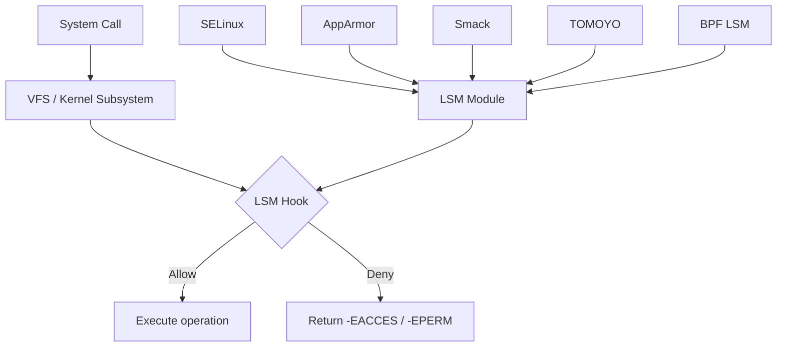
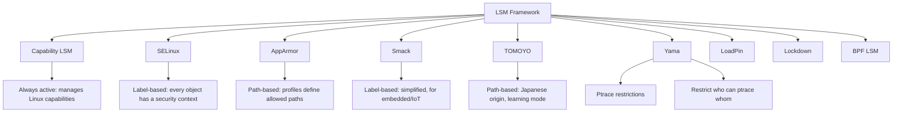
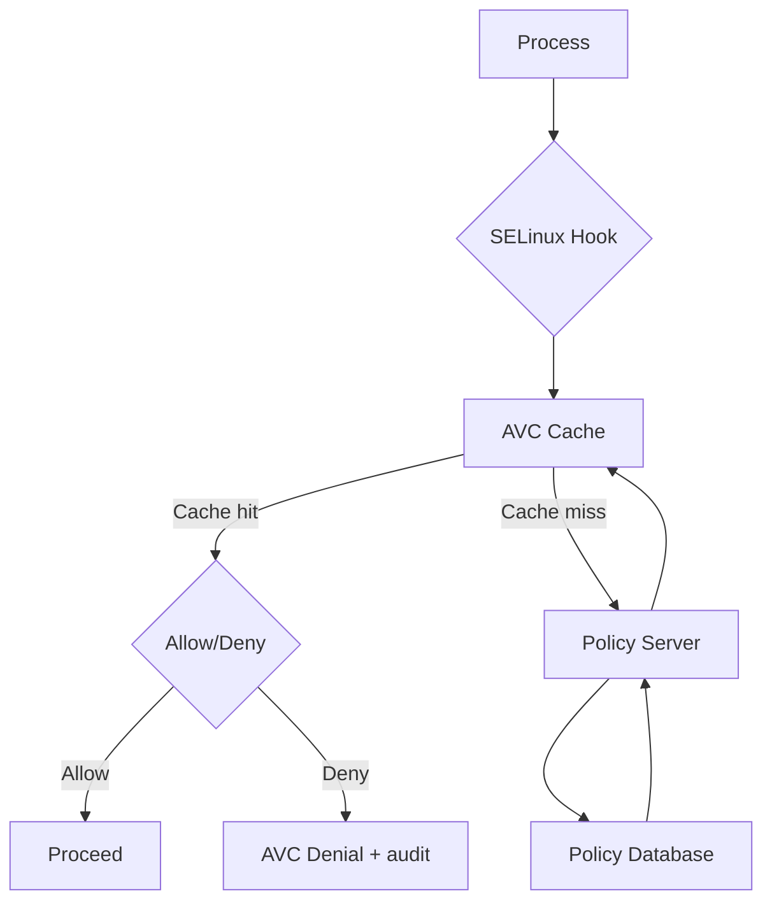
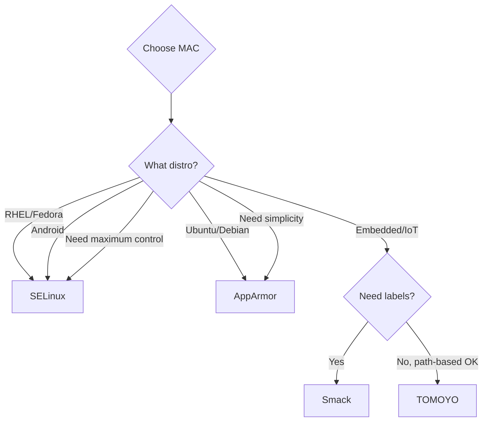
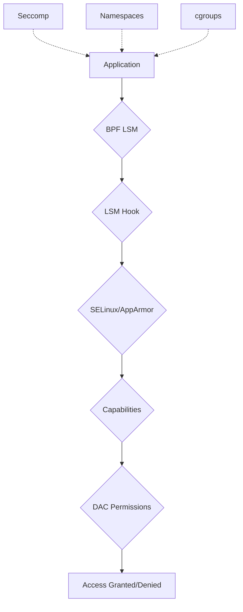

# Mandatory Access Control (MAC) on Linux

## Introduction

Traditional Linux security uses **Discretionary Access Control (DAC)**—file owners decide who can access their files via permissions and ownership. This is insufficient for many security requirements because:

- Root has unlimited power (a compromised root = total compromise).
- Users can set permissions on their own files (data leakage).
- No concept of least privilege for system services.
- No protection against malicious software running as a legitimate user.

**Mandatory Access Control (MAC)** adds a kernel-enforced policy layer that restricts what *every* process can do, regardless of its UID/GID. Even root is constrained by MAC policy. The Linux kernel implements MAC through the **Linux Security Module (LSM)** framework.

## The LSM Framework

LSM is the kernel's pluggable security architecture. It provides **hooks** at critical points in the kernel where security decisions are made:



### LSM Hooks

LSM hooks are called at key decision points:

```c
/* include/linux/lsm_hooks.h (examples) */

/* File operations */
security_file_open(file)          /* Before opening a file */
security_file_read(file)          /* Before reading */
security_file_write(file)         /* Before writing */

/* Process operations */
security_task_create(clone_flags) /* Before fork/clone */
security_task_kill(task, sig)     /* Before sending signal */
security_ptrace_access_check(task)/* Before ptrace */

/* Network operations */
security_socket_create(family)    /* Before creating socket */
security_socket_connect(sock)     /* Before connecting */
security_socket_bind(sock)       /* Before binding */

/* IPC operations */
security_shm_alloc(shp)          /* Before shared memory */
security_msg_queue_msgsnd(msg)   /* Before message send */

/* Kernel operations */
security_kernel_load_data(id)    /* Before loading kernel data */
security_bpf(cmd)                /* Before BPF operations */
security_locked_down(what)       /* Kernel lockdown check */
```

### Available LSM Modules

```bash
# Check which LSM is active
cat /sys/kernel/security/lsm

# Output example:
# lockdown,capability,yama,apparmor

# List available LSMs
ls /sys/kernel/security/

# Boot parameter to select LSM
# GRUB: security=selinux  or  security=apparmor
```



## SELinux (Security-Enhanced Linux)

SELinux is the most comprehensive MAC implementation for Linux, originally developed by the **NSA** and now maintained by Red Hat and the community.

### Core Concepts

**Type Enforcement (TE)**: Every process (subject) and every resource (object) has a **security context** (label). Policy rules define what types can access what.

```
Security Context Format:
  user:role:type:level

Example:
  system_u:system_r:httpd_t:s0
  system_u:object_r:httpd_sys_content_t:s0
```

```bash
# View security contexts
ls -Z /var/www/html/
# -rw-r--r--. root root system_u:object_r:httpd_sys_content_t:s0 index.html

ps -eZ | grep httpd
# system_u:system_r:httpd_t:s0    1234 ?  httpd
```

### SELinux Modes

```bash
# Check current mode
getenforce
# Enforcing

# Set mode
setenforce 0    # Permissive (log only, don't deny)
setenforce 1    # Enforcing (log and deny)

# Configuration
# /etc/selinux/config
SELINUX=enforcing
SELINUXTYPE=targeted
```

### Policy Types

| Policy | Description |
|--------|-------------|
| **targeted** | Confine specific services (default on RHEL/Fedora) |
| **minimum** | Subset of targeted |
| **mls** | Multi-Level Security (strictest) |

### SELinux Policy Rules

```
# Type Enforcement rule
# allow <subject_type> <object_type>:<class> { <permissions> };

allow httpd_t httpd_sys_content_t:file { read open getattr };
allow httpd_t httpd_sys_content_t:dir { search getattr open };

# Transition rule
# When httpd_t executes httpd_exec_t, transition to httpd_t
type_transition httpd_t httpd_exec_t:process httpd_t;

# Never allow (even if other rules permit)
neverallow httpd_t shadow_t:file { read write };
```

### Common SELinux Operations

```bash
# View denials (AVC messages)
ausearch -m AVC
# Or:
journalctl -t setroubleshoot

# Generate allow rules from denials
audit2allow -M mymodule < /var/log/audit/audit.log
semodule -i mymodule.pp

# Relabel files
restorecon -Rv /var/www/html/

# Set persistent labels
semanage fcontext -a -t httpd_sys_content_t "/data(/.*)?"
restorecon -Rv /data/

# Boolean toggles (quick policy adjustments)
getsebool -a | grep httpd
setsebool -P httpd_can_network_connect on

# Manage ports
semanage port -l | grep http
semanage port -a -t http_port_t -p tcp 8080
```

### SELinux Architecture



## AppArmor

AppArmor is the default MAC on **Ubuntu**, **SUSE**, and **Debian**. It uses **path-based** confinement rather than labels.

### Core Concepts

- **Profiles** define what a program can access.
- Profiles are path-based (easier to understand than SELinux labels).
- Two modes: **enforce** (deny) and **complain** (log only).
- Simpler than SELinux but less granular.

```bash
# Check AppArmor status
aa-status

# Profile modes
# enforce — actively restricts
# complain — logs violations but allows
# unconfined — no restrictions
```

### AppArmor Profile Example

```bash
# /etc/apparmor.d/usr.sbin.nginx
#include <tunables/global>

/usr/sbin/nginx {
  #include <abstractions/apache2-common>
  #include <abstractions/base>
  #include <abstractions/nis>

  capability net_bind_service,
  capability setgid,
  capability setuid,

  # Network access
  network inet stream,
  network inet dgram,
  network inet6 stream,

  # Configuration files
  /etc/nginx/** r,
  /etc/mime.types r,

  # Content directories
  /var/www/html/** r,
  /var/log/nginx/** rw,

  # PID file
  /run/nginx.pid rw,

  # Deny access to sensitive files
  deny /etc/shadow r,
  deny /etc/passwd w,
}
```

### AppArmor Operations

```bash
# Load a profile
apparmor_parser -r /etc/apparmor.d/usr.sbin.nginx

# Set to complain mode
aa-complain /usr/sbin/nginx

# Set to enforce mode
aa-enforce /usr/sbin/nginx

# Disable a profile
ln -s /etc/apparmor.d/usr.sbin.nginx /etc/apparmor.d/disable/
apparmor_parser -R /usr/sbin/nginx

# Generate profile (learning mode)
aa-genprof /usr/sbin/nginx
# Runs the program, monitors access, suggests rules

# Update existing profile
aa-logprof
# Analyzes logs and suggests rule changes

# Auto-profile
aa-autodep /usr/sbin/nginx
```

## Smack (Simplified Mandatory Access Control)

Smack is designed for **embedded systems** and **IoT devices**. It uses a simple label-based model:

```bash
# Smack labels are simple strings
# Access rules: Subject Label Object Label Access

# Set Smack label on a file
chsmack -a "MyLabel" /data/file.txt

# View Smack labels
ls -M /data/

# Set process label
smackcipso -l "MyLabel"

# Access rule format in /sys/fs/smackfs/load
# SubjectLabel ObjectLabel Access
# Access: r (read), w (write), x (execute), a (append)
```

Smack is used in **Tizen** (Samsung's mobile/IoT OS) and some automotive Linux distributions.

## TOMOYO

TOMOYO is a **path-based** MAC from Japan, focused on **learning mode**:

```bash
# TOMOYO learns from normal system behavior
# Then generates a policy based on observed patterns

# View policy
cat /sys/kernel/security/tomoyo/domain_policy

# Example policy:
# <kernel> /sbin/init
# allow_read /etc/passwd
# allow_read /etc/shadow
# allow_execute /bin/bash
# allow_network inet stream connect 0.0.0.0/0:80

# TOMOYO domains correspond to process execution chains
# /sbin/init -> /usr/sbin/nginx -> worker process
```

TOMOYO is included in the mainline kernel (since 2.6.30).

## Comparison

| Feature | SELinux | AppArmor | Smack | TOMOYO |
|---------|---------|----------|-------|--------|
| **Default distro** | RHEL, Fedora, Android | Ubuntu, SUSE, Debian | Tizen | Embedded |
| **Labeling** | Security contexts (user:role:type:level) | Path-based | Simple labels | Path-based |
| **Complexity** | High | Medium | Low | Medium |
| **Learning mode** | `audit2allow` | `aa-genprof` | Manual | Built-in |
| **Granularity** | Very fine | Fine | Moderate | Moderate |
| **Network control** | Yes (labeled networking) | Yes (socket rules) | Yes | Yes |
| **Container support** | Excellent (MCS) | Good (profile stacking) | Basic | Basic |
| **File system support** | Requires labeling (xattr) | Any | Any | Any |
| **Android** | Yes (main MAC) | No | No | No |

### When to Choose Which



## BPF LSM

Linux 5.7+ supports **BPF LSM**—using eBPF programs as LSM hooks:

```c
/* BPF LSM program (skeleton) */
SEC("lsm/file_open")
int BPF_PROG(restrict_open, struct file *file, int ret) {
    /* Check the file path */
    char path[256];
    bpf_d_path(&file->f_path, path, sizeof(path));
    
    /* Deny access to /etc/shadow */
    if (bpf_strncmp(path, 11, "/etc/shadow") == 0) {
        return -EACCES;
    }
    
    return ret;  /* Allow */
}
```

BPF LSM is programmable and safe, making it ideal for runtime security policies.

## Combining MAC with Other Security Layers



Modern container security uses multiple layers:
1. **Namespaces** (isolation)
2. **cgroups** (resource limits)
3. **Seccomp** (syscall filtering)
4. **MAC** (SELinux/AppArmor profiles)
5. **Capabilities** (fine-grained root powers)

## LSM Framework Internals (from docs.kernel.org)

### History

The LSM (Linux Security Modules) project was born out of a presentation by the NSA about SELinux at the 2.5 Linux Kernel Summit in March 2001. In response, Linus Torvalds described a general security framework with hooks at critical kernel operations and opaque security fields in kernel data structures. LSM was a joint development effort by WireX, Immunix, SELinux, SGI, Janus, and key kernel developers including Greg Kroah-Hartman and James Morris. It was incorporated into the mainline kernel in December 2003.

### LSM Security Fields (Blobs)

LSM adds `void *` security pointers ("blobs") to key kernel data structures:

| Data Structure | Security Field Purpose |
|---------------|----------------------|
| `struct task_struct` | Process security information |
| `struct cred` | Credential security (per-credential) |
| `struct super_block` | Filesystem-level security |
| `struct inode` | Inode/file security |
| `struct file` | Open file security |
| `struct sk_buff` | Network packet security (32-bit integer) |
| `struct kern_ipc_perm` | System V IPC security |
| `struct msg_msg` | Message queue message security |

The LSM framework does **not** provide a mechanism for removing registered hooks — once a security module registers its hooks, they remain for the lifetime of the kernel.

### LSM Hook Categories

LSM hooks fall into two major categories:

1. **Security field management hooks** — allocate and free security structures:
   - `security_inode_alloc()` / `security_inode_free()`
   - `security_task_alloc()` / `security_task_free()`
   - `security_cred_alloc()` / `security_cred_free()`

2. **Access control hooks** — make security decisions:
   - `security_inode_permission()` — check inode access
   - `security_file_open()` — check file open
   - `security_task_kill()` — check signal permission
   - `security_socket_connect()` — check socket connection
   - `security_bpf()` — check BPF operations
   - `security_locked_down()` — kernel lockdown checks

### LSM Stacking

The LSM framework provides a close approximation of security module stacking. Modules are called in the order specified by `CONFIG_LSM`. The `/sys/kernel/security/lsm` interface reports the comma-separated list of active security modules:

```bash
cat /sys/kernel/security/lsm
# lockdown,capability,yama,apparmor
```

### LSM Capabilities Module

The POSIX.1e capabilities logic is itself an LSM, stored in `security/commoncap.c`. It is always the first module registered (via its `order` field). Unlike other LSM modules, the capabilities module does not use the general security blobs — it manages its own data directly, for historical performance reasons.

## Further Reading

- [SELinux Documentation](https://selinuxproject.org/page/Main_Page) — SELinux project
- [AppArmor Wiki](https://gitlab.com/apparmor/apparmor/-/wikis/home) — AppArmor documentation
- [Linux Security Modules: General Security Hooks — docs.kernel.org](https://docs.kernel.org/security/lsm.html) — Official LSM framework documentation with hook descriptions
- [Kernel LSM docs](https://docs.kernel.org/security/lsm.html) — LSM framework
- [LWN: LSM](https://lwn.net/Articles/635771/) — LSM overview
- [SELinux Coloring Book](https://people.redhat.com/duffy/selinux/selinux-coloring-book_A4-Stapled.pdf) — Visual SELinux guide
- [man7.org: selinux](https://man7.org/linux/man-pages/man8/selinux.8.html) — SELinux man pages
- [Kernel docs: Smack](https://docs.kernel.org/security/smack.html) — Smack documentation
- [Kernel docs: TOMOYO](https://docs.kernel.org/security/tomoyo.html) — TOMOYO documentation
- [BPF LSM](https://docs.kernel.org/bpf/progs/lsm.html) — BPF LSM documentation
