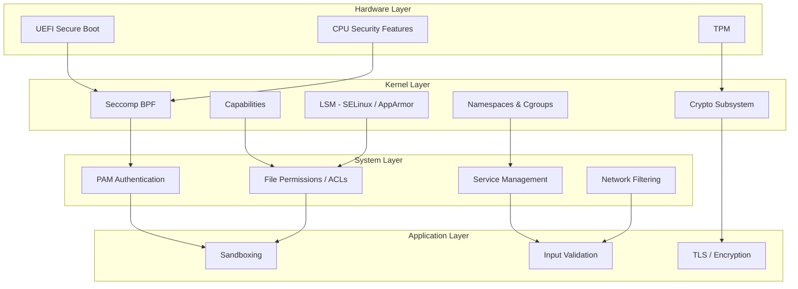
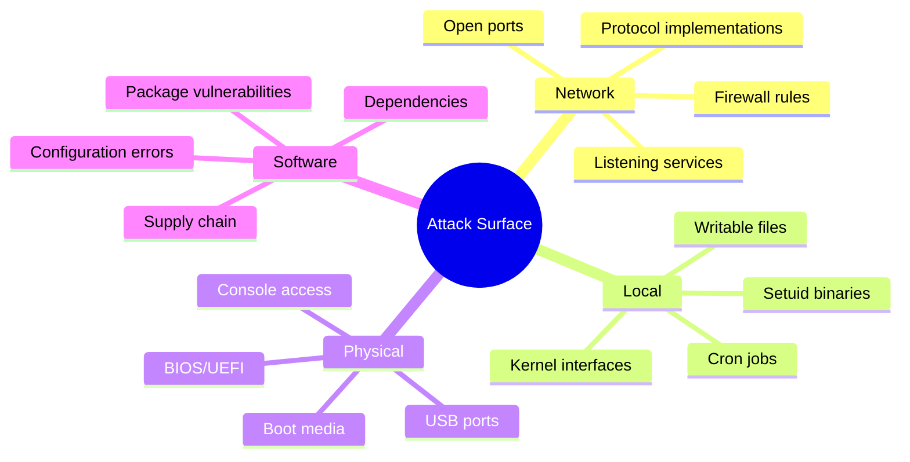
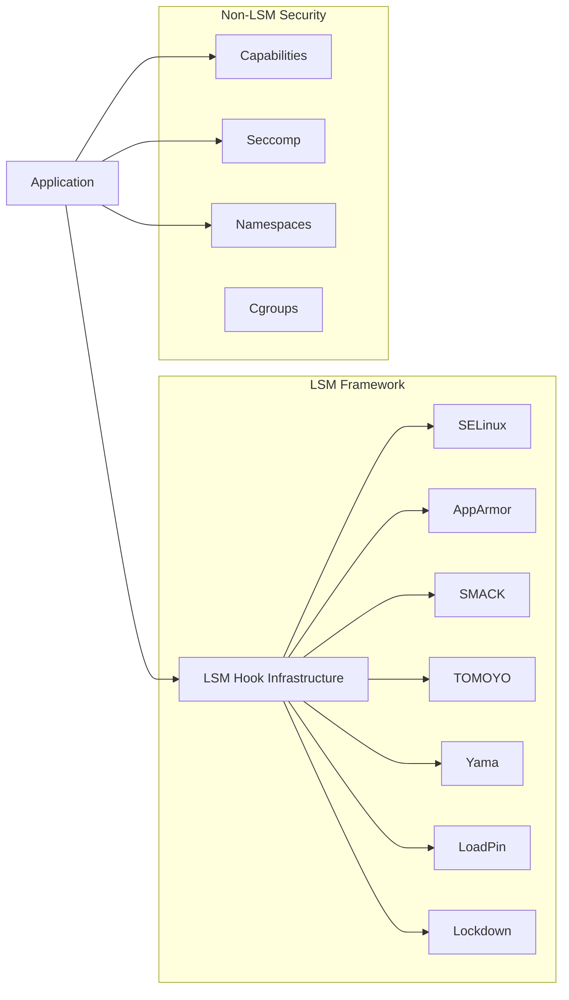
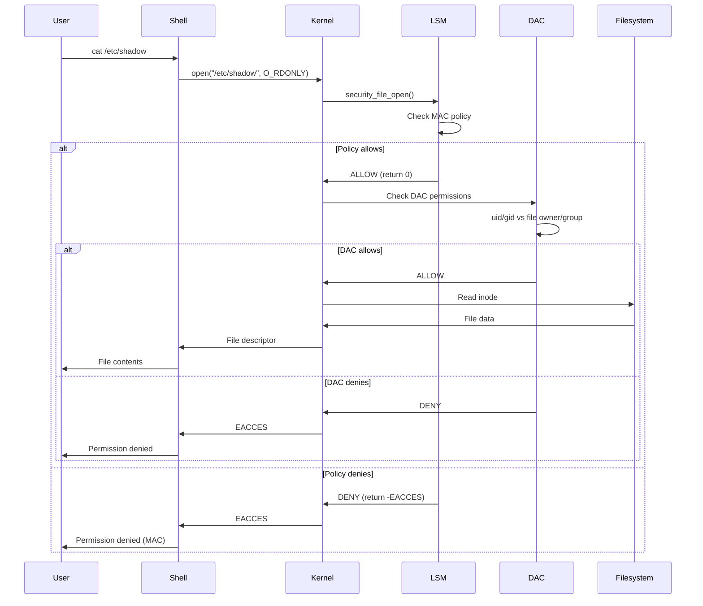
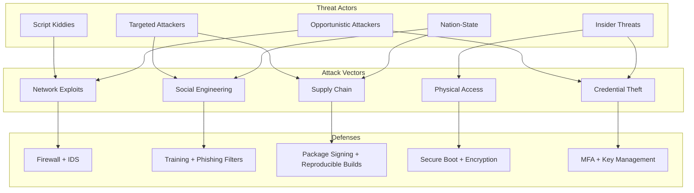
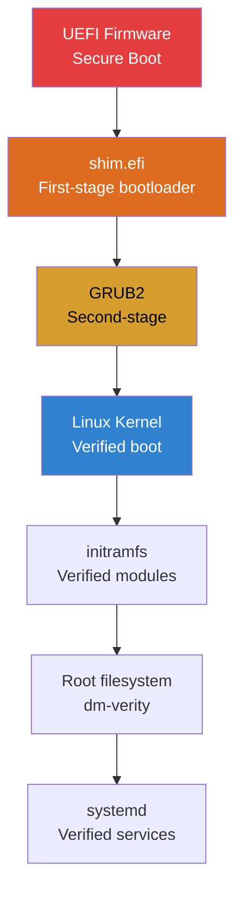

# Linux Security Overview

## Introduction

Linux security is a multi-layered discipline that encompasses kernel-level protections, discretionary and mandatory access controls, cryptographic subsystems, and user-space hardening mechanisms. Unlike monolithic security models found in some operating systems, Linux provides a composable security architecture where administrators can layer defenses to match their threat model. This chapter provides a comprehensive overview of the Linux security landscape, establishing the conceptual foundation for the detailed chapters that follow.

Understanding Linux security requires thinking in terms of **defense in depth** — no single mechanism is sufficient. A properly secured Linux system combines kernel hardening, access control, process isolation, network filtering, cryptographic verification, and monitoring into a cohesive whole.

## Defense in Depth

Defense in depth is a military strategy adapted for information security: if one layer fails, the next layer continues to protect the asset. On a Linux system, these layers form a hierarchy from hardware to application.

### The Layered Security Model



Each layer assumes the layer above it (closer to the user) may fail:

| Layer | Protects Against | Example Mechanisms |
|-------|------------------|--------------------|
| Hardware | Physical attacks, bootkits | Secure Boot, TPM, IOMMU |
| Kernel | Privilege escalation, code execution | seccomp, capabilities, LSM |
| System | Unauthorized access, lateral movement | PAM, file permissions, iptables |
| Application | Data breaches, injection attacks | Sandboxing, input validation |

### Principle of Least Privilege

Every layer should operate with the minimum privileges required:

```bash
# Running a web server as a dedicated user, not root
sudo -u www-data /usr/sbin/apache2

# Dropping capabilities after binding to port 80
# (see capabilities.md for details)

# Using seccomp to restrict syscalls for a process
# (see seccomp.md for details)
```

## Attack Surface Analysis

The attack surface of a Linux system consists of all points where an unauthorized user can attempt to enter or extract data. Understanding and minimizing attack surface is fundamental to security.

### Categories of Attack Surface



### Measuring Attack Surface

```bash
# List all listening network services
ss -tlnp
# Expected output:
# State   Recv-Q  Send-Q  Local Address:Port  Peer Address:Port  Process
# LISTEN  0       128     0.0.0.0:22          0.0.0.0:*          users:(("sshd",pid=1234,fd=3))
# LISTEN  0       511     0.0.0.0:80          0.0.0.0:*          users:(("nginx",pid=5678,fd=6))

# Find all SUID binaries on the system
find / -perm -4000 -type f 2>/dev/null
# Expected output:
# /usr/bin/passwd
# /usr/bin/sudo
# /usr/bin/su
# /usr/bin/newgrp
# /usr/bin/chsh
# /usr/bin/chfn
# /usr/bin/gpasswd
# /usr/bin/mount
# /usr/bin/umount
# /usr/lib/openssh/ssh-keysign

# Count installed packages (each is potential attack surface)
dpkg --list 2>/dev/null | wc -l    # Debian/Ubuntu
rpm -qa 2>/dev/null | wc -l        # RHEL/Fedora

# List all kernel modules
lsmod | wc -l

# Check for world-writable files
find / -xdev -type f -perm -0002 2>/dev/null
```

### Reducing Attack Surface

```bash
# Disable unnecessary services
sudo systemctl disable --now cups
sudo systemctl disable --now avahi-daemon

# Remove unnecessary packages
sudo apt purge telnet rsh-client     # Debian/Ubuntu

# Disable unused kernel modules
echo "install dccp /bin/true" | sudo tee /etc/modprobe.d/dccp.conf
echo "install sctp /bin/true" | sudo tee /etc/modprobe.d/sctp.conf

# Restrict kernel module loading
echo "kernel.modules_disabled = 1" | sudo tee /etc/sysctl.d/99-modules.conf
# WARNING: This is irreversible until reboot — load all needed modules first
```

## Linux Security Architecture

### Kernel Security Subsystems

The Linux kernel provides several security subsystems, many of which are implemented through the **Linux Security Module (LSM)** framework.



### LSM Framework

The LSM framework was introduced in Linux 2.6 to provide a general mechanism for mandatory access controls. LSM places **hooks** at critical points in the kernel — before access is granted to files, processes, sockets, and other kernel objects. Each LSM implementation can approve or deny the request.

```c
/* Simplified example of an LSM hook in the kernel */
/* From security/security.c */

int security_file_open(struct file *file)
{
    int rc = 0;

    /* Each registered LSM gets to inspect and potentially deny */
    rc = call_int_hook(file_open, 0, file);
    return rc;
}
```

Only one **major LSM** can be active at a time (SELinux, AppArmor, SMACK, or TOMOYO), but **minor LSMs** (Yama, LoadPin, Lockdown) can stack with a major LSM starting with Linux 5.4+.

```bash
# Check which LSM is active
cat /sys/kernel/security/lsm
# Example output: lockdown,capability,yama,apparmor

# The order matters — the first major LSM listed is the primary one
```

### Security Context Flow



## Core Security Components

### 1. Discretionary Access Control (DAC)

The traditional Unix permission model — the file owner *discretionarily* decides who can access their files. This is the baseline, covered in detail in [Security Model](./security-model.md).

```bash
# Basic DAC example
ls -l /etc/passwd
# -rw-r--r-- 1 root root 2847 Jul 15 10:00 /etc/passwd
#  ^^^        ^^^^ ^^^^
#  |          |    |
#  |          |    Group (root): read
#  |          Owner (root): read, write
#  Others: read
```

### 2. Mandatory Access Control (MAC)

MAC policies are set by the system administrator and cannot be overridden by users. Two major implementations:

- **SELinux** — Label-based, used by RHEL, Fedora, CentOS, Android. See [SELinux](./selinux.md).
- **AppArmor** — Path-based, used by Ubuntu, SUSE, Debian. See [AppArmor](./apparmor.md).

### 3. Capabilities

Instead of the all-or-nothing root model, Linux capabilities divide root's power into discrete units. See [Capabilities](./capabilities.md).

```bash
# Example: granting only network capabilities to a process
sudo setcap cap_net_bind_service,cap_net_raw+ep /usr/bin/myapp

# Verify
getcap /usr/bin/myapp
# /usr/bin/myapp cap_net_bind_service,cap_net_raw=ep
```

### 4. Seccomp

Seccomp (Secure Computing Mode) restricts the system calls a process can make. See [Seccomp](./seccomp.md).

### 5. Namespaces and Cgroups

While primarily used for containerization, namespaces and cgroups are security mechanisms:

```bash
# Create a minimal isolated environment
unshare --mount --uts --ipc --net --pid --fork /bin/bash

# The process now has its own:
# - Mount namespace (isolated filesystem view)
# - UTS namespace (hostname)
# - IPC namespace (shared memory, semaphores)
# - Network namespace (independent network stack)
# - PID namespace (process ID space)
```

### 6. Cryptographic Subsystem

The kernel provides cryptographic primitives used by filesystem encryption, network security, and more. See [Cryptography](./cryptography.md).

### 7. Authentication (PAM)

Pluggable Authentication Modules provide a flexible framework for user authentication. See [PAM](./pam.md).

## Security by Distro

Different distributions make different security trade-offs:

| Distribution | Default MAC | Init System | Crypto Default | Notable Security Features |
|-------------|-------------|-------------|----------------|--------------------------|
| RHEL / CentOS Stream | SELinux (enforcing) | systemd | LUKS2 | FIPS certification, CIS profiles |
| Fedora | SELinux (enforcing) | systemd | LUKS2 | Early adoption of security features |
| Ubuntu | AppArmor | systemd | LUKS2 | Unattended-upgrades by default |
| Debian | AppArmor | systemd | LUKS2 | Conservative, stable security |
| Arch Linux | None | systemd | User choice | Minimal defaults, user responsibility |
| Alpine | None | OpenRC | User choice | musl libc (smaller attack surface) |
| Android | SELinux (enforcing) | init | FBE | Strong app sandboxing via SELinux + seccomp |

## Security Auditing Framework

Linux provides the **audit** subsystem for tracking security-relevant events:

```bash
# Check if auditd is running
sudo systemctl status auditd

# Add a watch rule to monitor /etc/passwd for changes
sudo auditctl -w /etc/passwd -p wa -k passwd_changes

# Search audit logs for the key
sudo ausearch -k passwd_changes
# ----
# time->Tue Jul 21 10:30:45 2026
# type=PROCTITLE msg=audit(1690000245.123:456): proctitle="useradd newuser"
# type=PATH msg=audit(1690000245.123:456): item=1 name="/etc/passwd" ...
# type=SYSCALL msg=audit(1690000245.123:456): arch=c000003e syscall=264 ...

# List all audit rules
sudo auditctl -l
```

See [Auditing and Monitoring](../observability/audit.md) for comprehensive coverage.

## Security Compliance Standards

Linux security is often measured against formal standards:

- **CIS Benchmarks** — Center for Internet Security provides detailed hardening guides. See [Hardening](./hardening.md).
- **STIG** — Security Technical Implementation Guide (DoD). Automated via OpenSCAP.
- **PCI-DSS** — Payment card industry requirements.
- **HIPAA** — Healthcare data protection.
- **FIPS 140-2/3** — Cryptographic module validation.

```bash
# Using OpenSCAP to evaluate CIS compliance
sudo oscap xccdf eval \
  --profile xccdf_org.ssgproject.content_profile_cis_level2_server \
  --results results.xml \
  --report report.html \
  /usr/share/xml/scap/ssg/content/ssg-ubuntu2204-ds.xml
```

## Threat Model

Understanding what you're defending against shapes your security choices:



## Quick Security Checklist

```bash
# 1. System updates
sudo apt update && sudo apt upgrade -y          # Debian/Ubuntu
sudo dnf update -y                               # Fedora/RHEL

# 2. Firewall enabled
sudo ufw enable                                  # Ubuntu
sudo firewall-cmd --state                         # RHEL

# 3. SSH hardened
grep -E "^(PermitRootLogin|PasswordAuthentication|Port)" /etc/ssh/sshd_config
# Should see:
# PermitRootLogin no
# PasswordAuthentication no
# Port 2222  (or similar non-standard port)

# 4. SELinux/AppArmor active
getenforce                                       # SELinux: should return "Enforcing"
sudo aa-status                                   # AppArmor: profiles loaded

# 5. Automatic security updates
sudo dpkg-reconfigure -plow unattended-upgrades  # Debian/Ubuntu

# 6. Fail2ban or similar
sudo systemctl status fail2ban

# 7. Audit logging
sudo systemctl status auditd

# 8. Kernel parameters hardened
sysctl net.ipv4.conf.all.rp_filter               # Should be 1
sysctl net.ipv4.conf.all.accept_redirects         # Should be 0
sysctl kernel.randomize_va_space                   # Should be 2
```

## Kernel Lockdown Mode

The **Lockdown LSM** (merged in Linux 5.4) restricts the kernel itself from being modified by user space, even by root. It protects against kernel compromise by blocking dangerous operations.

### Lockdown Modes

```bash
# Check current lockdown status
cat /sys/kernel/security/lockdown
# [none] integrity confidentiality

# Set lockdown mode via boot parameter
# lockdown=integrity  — blocks kernel modification
# lockdown=confidentiality — blocks kernel memory reading too

# Runtime change (requires secure boot)
echo integrity > /sys/kernel/security/lockdown
```

### What Lockdown Blocks

| Mode | Blocks | Example |
|------|--------|---------|
| `none` | Nothing | Default without secure boot |
| `integrity` | Kernel modification | Loading unsigned modules, kprobes, /dev/mem |
| `confidentiality` | + kernel memory reading | /proc/kcore, eBPF map reading, kexec |

```bash
# In integrity mode, these are blocked:
# - Loading unsigned kernel modules
# - Writing to /dev/mem, /dev/kmem
# - kexec_load() with unsigned kernel
# - bpf() with certain program types
# - Changing IMA policy
```

## Integrity Measurement Architecture (IMA)

IMA measures and appraises file integrity at the kernel level:

```bash
# IMA measures file hashes into the TPM's Platform Configuration Registers (PCRs)
# IMA appraisal can deny access to files that fail integrity checks

# Check IMA status
cat /sys/kernel/security/ima/policy
# dont_appraise fsmagic=0x9fa0  # tmpfs
# dont_appraise fsmagic=0x62656572  # sysfs
# appraise fowner=0  # appraise files owned by root

# IMA policy example (/etc/ima/ima-policy)
# measure func=BPRM_CHECK
# measure func=FILE_MMAP mask=MAY_EXEC
# appraise func=BPRM_CHECK
# appraise func=FILE_MMAP

# View IMA measurements (TPM PCR values)
cat /sys/kernel/security/ima/ascii_runtime_measurements
# 10 <sha256-hash> ima-ng sha256:abc123... /usr/bin/sudo
# 10 <sha256-hash> ima-ng sha256:def456... /usr/sbin/sshd
```

## Confidential Computing

Linux supports hardware-based confidential computing to protect data in use:

### AMD SEV (Secure Encrypted Virtualization)

```bash
# SEV encrypts VM memory with per-VM keys
# The host kernel cannot read guest memory

# Check SEV support
grep -i sev /proc/cpuinfo
# flags : ... sev sev_es sev_snp

# QEMU with SEV
qemu-system-x86_64 \
  -object sev-guest,id=sev0,cbitpos=47,reduced-phys-bits=1 \
  -machine memory-encryption=sev0 ...

# KVM SEV configuration
# /dev/sev — SEV device interface
```

### Intel TDX (Trust Domain Extensions)

```bash
# TDX provides hardware-isolated VMs (trust domains)
# Similar to SEV but with different architecture

# Check TDX support
grep tdx /proc/cpuinfo
# flags : ... tdx_guest

# KVM TDX support requires kernel 6.2+
```

### AMD SEV-SNP and Intel TDX are the current generation:
- Memory encryption per-VM
- Attestation (prove what code is running)
- Integrity protection (prevent host tampering)

## Secure Boot Chain

The full boot security chain from firmware to userspace:



### dm-verity

`dm-verity` provides integrity verification for read-only block devices:

```bash
# dm-verity uses a Merkle tree of block hashes
# Stored in the verity superblock at the end of the partition

# Setup dm-verity
veritysetup format /dev/sda2 /dev/sda2
# Hash: sha256
# Root hash: abc123def456...

# Activate dm-verity
dmsetup create rootfs \
  --table '0 1234567 verity 1 /dev/sda2 /dev/sda2 4096 4096 123456 1 sha256 abc123def456...'

# Check current dm-verity status
dmsetup table rootfs

# Used by: Android, ChromeOS, Fedora IoT, Ubuntu Core
```

## Supply Chain Security

### Reproducible Builds

```bash
# Reproducible builds: same source produces identical binaries
# Allows independent verification that binaries match source

# Debian reproducible build status
# https://tests.reproducible-builds.org/debian/reproducible.html

# Verify a package
# Install the 'reprotest' tool
apt install reprotest
reprotest --vary=-all build 'dpkg-buildpackage -b'
```

### Package Signing

```bash
# APT package signing
apt-key list  # List trusted keys (deprecated)
# Modern: /etc/apt/trusted.gpg.d/ and /usr/share/keyrings/

# RPM package signing
rpm --import /etc/pki/rpm-gpg/RPM-GPG-KEY-fedora
rpm -K package.rpm  # Verify signature

# Container image signing (cosign)
cosign verify --key cosign.pub myregistry.local/myapp:v1.0
```

### SBOM (Software Bill of Materials)

```bash
# Generate SBOM for containers
syft myapp:latest -o spdx-json > sbom.json

# Scan SBOM for vulnerabilities
grype sbom:sbom.json

# Docker/Podman SBOM support
docker sbom myapp:latest
```

## CVE Handling Process

### Linux Kernel CVE Process

```bash
# Monitor kernel CVEs
# https://www.kernel.org/category/cves.html
# https://cve.org/ (official CVE database)

# Check kernel version for known vulnerabilities
curl -s 'https://www.kernel.org/releases.json' | jq '.releases[0]'

# Ubuntu CVE tracking
https://ubuntu.com/security/cves

# Red Hat CVE tracking
https://access.redhat.com/security/cve/

# Rapid7 vulnerability database
https://www.rapid7.com/db/
```

### Responding to a Kernel CVE

```bash
# 1. Identify affected kernels
# Check CVE description for affected versions

# 2. Check if your kernel is affected
uname -r
# 5.15.0-78-generic

# 3. Apply patches or update
sudo apt update && sudo apt upgrade linux-image-$(uname -r)
# Or: apply specific kernel patch

# 4. Verify mitigation
cat /sys/devices/system/cpu/vulnerabilities/*

# 5. Reboot if kernel was updated
sudo reboot
```

## Security Monitoring and Incident Response

### Runtime Security Monitoring

```bash
# Falco — runtime security for containers and Linux
# Detects anomalous behavior at runtime
falco --rule /etc/falco/falco_rules.yaml

# Example Falco rules:
# - Shell spawned in container
# - Read sensitive file (/etc/shadow)
# - Outbound connection to unexpected IP
# - Unexpected syscall

# Auditd real-time monitoring
sudo auditctl -a always,exit -F arch=b64 -S execve -k exec_log
sudo ausearch -k exec_log --interpret

# sysdig — system-level exploration
sysdig -c topprocs_cpu
sysdig -c spy_users
sysdig 'fd.name=/etc/passwd and evt.type=open'
```

### Incident Response Checklist

```bash
# 1. Preserve evidence
sudo dd if=/dev/sda of=/mnt/evidence/disk.img bs=4M status=progress
sudo journalctl --since '2026-07-22 00:00:00' > /mnt/evidence/journal.log
sudo ss -tlnp > /mnt/evidence/network.log
sudo ps auxf > /mnt/evidence/processes.log

# 2. Check for persistence
crontab -l
sudo crontab -l
ls -la /etc/cron.d/
systemctl list-unit-files --state=enabled

# 3. Check for unauthorized access
last -i
sudo journalctl -u sshd | grep 'Failed\|Accepted'

# 4. Check for rootkits
sudo chkrootkit
sudo rkhunter --check
```

## References

- [The Linux Kernel Documentation](https://docs.kernel.org/)
- [LWN.net - Linux and free software news](https://lwn.net/)
- Linux Kernel Documentation — Security: https://www.kernel.org/doc/html/latest/security/
- Linux Security Module Framework: https://www.kernel.org/doc/html/latest/security/lsm.html
- NIST SP 800-123 — Guide to General Server Security: https://csrc.nist.gov/publications/detail/sp/800-123/final
- CIS Benchmarks: https://www.cisecurity.org/cis-benchmarks
- Red Hat Enterprise Linux Security Guide: https://docs.redhat.com/en/documentation/red_hat_enterprise_linux/9/html/security_hardening/
- Ubuntu Security Documentation: https://ubuntu.com/security
- Arch Linux Security Wiki: https://wiki.archlinux.org/title/Security
- Linux Audit Project: https://people.redhat.com/sgrubb/audit/
- [Confidential Computing Consortium](https://confidentialcomputing.io/)
- [Linux IMA documentation](https://sourceforge.net/p/linux-ima/wiki/Home/)
- [Falco runtime security](https://falco.org/)
- [GNU Project Documentation](https://www.gnu.org/doc/doc.html)

## Related Topics

- [Unix Security Model](./security-model.md) — DAC, permissions, users, groups
- [SELinux](./selinux.md) — Mandatory Access Control on RHEL/Fedora
- [AppArmor](./apparmor.md) — Path-based MAC on Ubuntu/SUSE
- [Seccomp](./seccomp.md) — Syscall filtering
- [Capabilities](./capabilities.md) — Fine-grained root privileges
- [PAM](./pam.md) — Authentication framework
- [Cryptography](./cryptography.md) — Kernel crypto, LUKS, dm-crypt
- [Hardening](./hardening.md) — Practical hardening guide
- [Secure Boot](./secure-boot.md) — UEFI Secure Boot chain
- [Audit](../observability/audit.md) — Security audit framework
