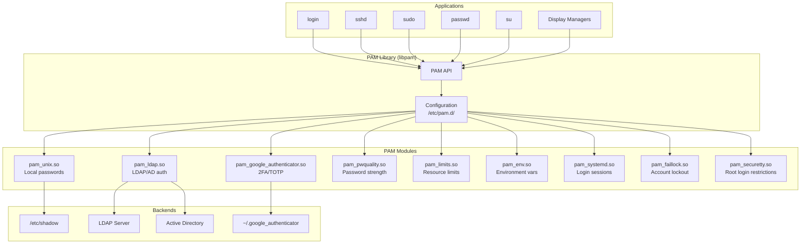
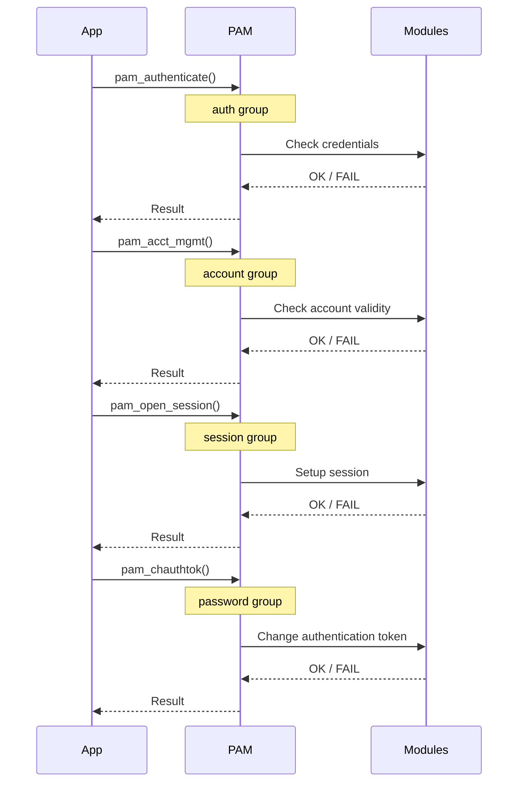
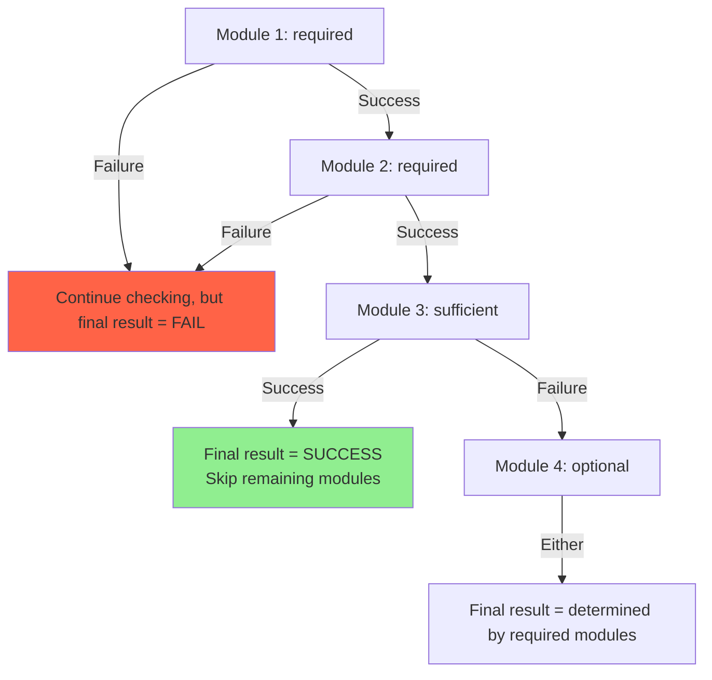

# PAM (Pluggable Authentication Modules)

## Introduction

PAM (Pluggable Authentication Modules) is a framework for system authentication and session management on Linux and other Unix-like operating systems. Originally developed by Sun Microsystems in 1995 and standardized by the Open Group, PAM decouples authentication logic from applications — programs like `login`, `sshd`, `sudo`, and `passwd` don't need to know *how* a user is authenticated. They just ask PAM, and PAM uses its configured modules to handle the details.

This separation is powerful: you can change authentication from local passwords to LDAP, add two-factor authentication, enforce password complexity, or integrate with Active Directory — all without recompiling a single application. You just change the PAM configuration.

## Architecture



## PAM Management Groups

PAM organizes its work into four **management groups**, each handling a different aspect of the authentication lifecycle:


| Group | Purpose | Typical Modules |
|-------|---------|-----------------|
| **auth** | Verify user identity | pam_unix, pam_ldap, pam_google_authenticator |
| **account** | Check account validity (expired, allowed hours) | pam_unix, pam_ldap, pam_time |
| **password** | Change authentication tokens | pam_unix, pam_pwquality, pam_ldap |
| **session** | Setup/teardown user sessions | pam_limits, pam_systemd, pam_env, pam_mkhomedir |

## Configuration Files

### File Locations

```mermaid
bash
# Main PAM configuration file (used as fallback)
/etc/pam.conf          # Rarely used on modern systems

# Per-application configuration (preferred)
/etc/pam.d/            # Directory with per-service files
/etc/pam.d/login       # Configuration for login
/etc/pam.d/sshd        # Configuration for sshd
/etc/pam.d/sudo        # Configuration for sudo
/etc/pam.d/common-*    # Shared include files (Debian/Ubuntu)
```

### Configuration File Format

Each line in a PAM configuration file follows this format:

```
type  control  module  [arguments...]
```

```
# Example: /etc/pam.d/login
# Type    Control     Module                    Arguments
auth      required    pam_securetty.so
auth      required    pam_unix.so               nullok
auth      required    pam_nologin.so
account   required    pam_unix.so
password  required    pam_unix.so               nullok obscure min=4 max=8
session   required    pam_unix.so
session   required    pam_loginuid.so
session   optional    pam_lastlog.so
```

### Control Flags

The **control** field determines how a module's result affects the overall outcome:

| Flag | Meaning |
|------|---------|
| `required` | Must succeed. Continues checking other modules before returning failure. |
| `requisite` | Must succeed. Returns failure **immediately** if this module fails. |
| `sufficient` | If this succeeds AND no prior `required` module failed, the group succeeds immediately. If it fails, the result is ignored. |
| `optional` | Only matters if it's the only module in the group. |
| `include` | Include the contents of another file. |
| `substack` | Like include, but module failures don't propagate to the parent. |


### Advanced Control Syntax

For fine-grained control, use the bracket syntax:

```mermaid
[default=value1 value2 ... action=value ...]
```

```
# Example: return success if module succeeds, ignore if it fails
auth [success=ok ignore=ignore default=bad] pam_unix.so

# Example: skip 1 module on success, 2 on ignore
auth [success=1 ignore=2 default=bad] pam_ldap.so
auth required pam_unix.so

# Common return values: ok, done, bad, die, ignore, reset
```

## Core PAM Modules

### pam_unix — Local Authentication

The fundamental module for traditional Unix authentication using `/etc/passwd` and `/etc/shadow`.

```
# /etc/pam.d/common-auth (Debian/Ubuntu)
auth    [success=1 default=ignore]      pam_unix.so nullok_secure
auth    requisite                       pam_deny.so
auth    required                        pam_permit.so

# /etc/pam.d/common-account
account [success=1 new_authtok_reqd=done default=ignore]  pam_unix.so
account requisite                       pam_deny.so
account required                        pam_permit.so

# /etc/pam.d/common-password
password [success=1 default=ignore]     pam_unix.so obscure use_authtok try_first_pass sha512
password requisite                      pam_deny.so
password required                       pam_permit.so

# /etc/pam.d/common-session
session [default=1]                     pam_unix.so
session requisite                       pam_deny.so
session required                        pam_permit.so
```

```bash
# Arguments for pam_unix:
# nullok         — Allow blank passwords
# nullok_secure  — Allow blank passwords only from secure ttys
# try_first_pass — Use password from previous module
# use_authtok    — Use password from previous module (don't prompt)
# shadow         — Use shadow passwords (default)
# md5/sha256/sha512 — Password hashing algorithm
# obscure        — Check for trivial passwords
# min=N          — Minimum password length
# max=N          — Maximum password length
# rounds=N       — Number of hash rounds
```

### pam_ldap — LDAP Authentication

```
# /etc/pam.d/common-auth
auth    sufficient    pam_ldap.so use_first_pass
auth    required      pam_unix.so nullok_secure try_first_pass

# /etc/pam.d/common-account
account sufficient    pam_ldap.so
account required      pam_unix.so

# /etc/pam.d/common-password
password sufficient   pam_ldap.so
password required     pam_unix.so nullok obscure min=8

# /etc/pam.d/common-session
session optional      pam_ldap.so
session required      pam_unix.so
```

```bash
# Install LDAP PAM module
sudo apt install libpam-ldap        # Debian/Ubuntu
sudo dnf install nss-pam-ldapd      # RHEL/Fedora

# Configure LDAP connection
sudo dpkg-reconfigure ldap-auth-config
# Or edit /etc/ldap.conf:
# uri ldap://ldap.example.com
# base dc=example,dc=com
# bind_policy soft
# pam_lookup_policy yes
# pam_password md5
```

### pam_google_authenticator — Two-Factor Authentication

```bash
# Install
sudo apt install libpam-google-authenticator

# Set up for a user
google-authenticator
# Do you want authentication tokens to be time-based? y
# ... (QR code displayed) ...
# Your new secret key is: JBSWY3DPEHPK3PXP
# Enter code from app: 123456
# Code confirmed
# Do you want me to update your file? y
# Do you want to disallow multiple uses? y
# Do you want to increase time window? n
# Do you want to enable rate-limiting? y

# This creates ~/.google_authenticator with the secret and settings
```

```
# /etc/pam.d/sshd — Add Google Authenticator
# Place BEFORE pam_unix.so for "password + TOTP" flow:
auth    required    pam_google_authenticator.so
auth    required    pam_unix.so

# Or for "password first, then TOTP" (two separate prompts):
auth    required    pam_unix.so
auth    required    pam_google_authenticator.so

# Arguments:
# secret=/path/to/file  — Custom secret file location
# window=N              — Number of time windows to check (default: 3)
# debug                 — Enable debug logging
# nullok                — Allow users without 2FA to log in
# echo_verification_code — Show the code as user types
```

```bash
# sshd must also be configured:
# /etc/ssh/sshd_config
# ChallengeResponseAuthentication yes
# UsePAM yes

sudo systemctl restart sshd
```

### pam_pwquality — Password Strength

```
# /etc/pam.d/common-password
password  requisite   pam_pwquality.so retry=3 minlen=12 difok=3
password  required    pam_unix.so use_authtok sha512

# /etc/security/pwquality.conf
# minlen = 12          # Minimum length
# dcredit = -1         # At least 1 digit
# ucredit = -1         # At least 1 uppercase
# lcredit = -1         # At least 1 lowercase
# ocredit = -1         # At least 1 special character
# difok = 3            # At least 3 chars different from old password
# maxrepeat = 3        # Max 3 consecutive identical chars
# reject_username      # Reject passwords containing username
# enforce_for_root     # Also enforce for root
# dictpath = /usr/share/dict/words  # Dictionary check
```

### pam_faillock / pam_tally2 — Account Lockout

```bash
# RHEL/Fedora: pam_faillock
# /etc/pam.d/system-auth
auth        required      pam_faillock.so preauth silent deny=5 unlock_time=900
auth        required      pam_unix.so
auth        [default=die] pam_faillock.so authfail deny=5 unlock_time=900
account     required      pam_faillock.so

# Arguments:
# deny=N       — Lock after N failed attempts
# unlock_time=N — Lock for N seconds (0 = permanent until admin unlock)
# fail_interval=N — Time window for counting failures
# even_deny_root — Also lock root account
# root_unlock_time=N — Root lockout duration

# Check lockout status
sudo faillock --user user1
# user1:
# When                Type  Source             Valid
# 2026-07-21 10:00:00 TTY   /dev/pts/0         V

# Unlock a user
sudo faillock --user user1 --reset
```

### pam_limits — Resource Limits

```
# /etc/pam.d/common-session
session required pam_limits.so

# /etc/security/limits.conf
# <domain>  <type>  <item>  <value>
# domain = username, @group, *, or %
# type = soft (default), hard
# item = nproc, nofile, memlock, cpu, etc.

*           soft    nproc     1024
*           hard    nproc     4096
root        soft    nproc     unlimited
@developers soft    nofile    65535
@developers hard    nofile    131072
@database   soft    memlock   unlimited
@database   hard    memlock   unlimited
```

### pam_systemd — Login Session Management

```bash
# Automatically included in modern systemd-based systems
# Creates a login session with:
# - A unique session ID
# - A cgroup for resource management
# - A D-Bus session bus
# - A seat assignment (for multi-seat)

# /etc/pam.d/common-session
session optional pam_systemd.so

# Check sessions
loginctl list-sessions
# SESSION  UID USER   SEAT  TTY   STATE  IDLE
#      2  1000 user1  seat0 pts/0 active no

loginctl show-session 2
# Id=2
# User=1000
# Name=user1
# State=active
# Type=tty
# Display=/dev/pts/0
# Remote=no
# Service=login
# Seat=seat0
# Leader=1234
# ...
```

### pam_env — Environment Variables

```
# /etc/pam.d/common-session
session required pam_env.so readenv=1

# /etc/environment (system-wide)
PATH="/usr/local/sbin:/usr/local/bin:/usr/bin"
LANG="en_US.UTF-8"

# /etc/security/pam_env.conf
# MY_VAR   DEFAULT="some_value"   OVERRIDE=${HOME}/.myenv
# TERM     DEFAULT="xterm"        OVERRIDE="${TERM}"
```

### pam_mkhomedir — Create Home Directory

```
# Automatically create home directory on first login
# /etc/pam.d/common-session
session required pam_mkhomedir.so skel=/etc/skel umask=0077

# Arguments:
# skel=/etc/skel  — Copy skeleton files from here
# umask=0077      — Set permissions on new home directory
```

## PAM Stacking: Practical Examples

### SSH with LDAP + 2FA + Password Policy

```
# /etc/pam.d/sshd
# Authentication stack:
auth    required    pam_env.so
auth    required    pam_faillock.so preauth silent deny=5 unlock_time=900
auth    sufficient  pam_ldap.so use_first_pass
auth    required    pam_unix.so try_first_pass
auth    required    pam_google_authenticator.so nullok
auth    required    pam_faillock.so authfail deny=5 unlock_time=900

# Account stack:
account required    pam_unix.so
account required    pam_ldap.so
account required    pam_time.so

# Password stack:
password requisite  pam_pwquality.so retry=3 minlen=12
password sufficient pam_ldap.so use_authtok
password required   pam_unix.so use_authtok sha512

# Session stack:
session required    pam_limits.so
session required    pam_unix.so
session required    pam_mkhomedir.so skel=/etc/skel umask=0077
session required    pam_loginuid.so
session optional    pam_systemd.so
```

### Sudo with 2FA

```
# /etc/pam.d/sudo
auth    required    pam_google_authenticator.so
auth    required    pam_unix.so try_first_pass
account required    pam_unix.so
session required    pam_unix.so
```

### Login with Restrictive Policies

```
# /etc/pam.d/login
auth      required   pam_securetty.so          # Restrict root to secure ttys
auth      required   pam_nologin.so             # Deny logins if /etc/nologin exists
auth      required   pam_env.so
auth      required   pam_faillock.so preauth silent deny=3
auth      required   pam_unix.so
auth      required   pam_faillock.so authfail deny=3
account   required   pam_unix.so
account   required   pam_time.so                 # Time-based access control
password  requisite  pam_pwquality.so minlen=12
password  required   pam_unix.so sha512 shadow
session   required   pam_limits.so
session   required   pam_unix.so
session   required   pam_loginuid.so
session   required   pam_lastlog.so showfailed
session   optional   pam_mail.so
```

## Custom PAM Module

You can write custom PAM modules in C:

```c
/* pam_hello.c — A trivial PAM module that prints a greeting */
#include <security/pam_modules.h>
#include <security/pam_ext.h>
#include <stdio.h>

PAM_EXTERN int pam_sm_authenticate(pam_handle_t *pamh, int flags,
                                    int argc, const char **argv) {
    const char *user;
    int ret;

    ret = pam_get_user(pamh, &user, NULL);
    if (ret != PAM_SUCCESS) {
        return ret;
    }

    pam_info(pamh, "Hello, %s! Custom PAM module says welcome.", user);

    /* Always succeed */
    return PAM_SUCCESS;
}

PAM_EXTERN int pam_sm_setcred(pam_handle_t *pamh, int flags,
                               int argc, const char **argv) {
    return PAM_SUCCESS;
}

PAM_EXTERN int pam_sm_acct_mgmt(pam_handle_t *pamh, int flags,
                                 int argc, const char **argv) {
    return PAM_SUCCESS;
}
```

```bash
# Compile
gcc -shared -fPIC -o pam_hello.so pam_hello.c -lpam

# Install
sudo cp pam_hello.so /lib/security/   # or /lib/x86_64-linux-gnu/security/

# Add to a service
echo "auth optional pam_hello.so" | sudo tee -a /etc/pam.d/login

# Test
login
# Hello, user1! Custom PAM module says welcome.
```

## Debugging PAM

```bash
# Enable PAM debugging (module-specific)
# Add 'debug' argument to any module:
# auth required pam_unix.so debug

# Check syslog for PAM messages
sudo journalctl -u sshd | grep PAM
# Jul 21 10:00:00 server sshd[1234]: PAM unable to dlopen(/lib/security/pam_ldap.so)
# Jul 21 10:00:00 server sshd[1234]: PAM adding faulty module: /lib/security/pam_ldap.so

# Test PAM configuration
sudo pamtester login user1 authenticate
# Password: ****
# pamtester: Successfully authenticated

# Test account validity
sudo pamtester login user1 acct_mgmt

# Test session
sudo pamtester login user1 open_session close_session

# Trace PAM calls (requires debug build)
# /etc/pam.d/sshd
# auth required pam_unix.so debug trace

# Common PAM errors:
# PAM_AUTH_ERR        — Authentication failure
# PAM_CRED_ERR        — Failed to set credentials
# PAM_ACCT_EXPIRED    — Account has expired
# PAM_PERM_DENIED     — Permission denied
# PAM_USER_UNKNOWN    — User not found
# PAM_SESSION_ERR     — Session setup failed
# PAM_AUTHTOK_ERR     — Password change failed
```

## Security Considerations

```bash
# 1. Configuration file permissions MUST be strict
sudo chmod 644 /etc/pam.d/*
sudo chown root:root /etc/pam.d/*
# PAM may refuse to operate if permissions are wrong

# 2. Never put 'sufficient' before 'required' for critical auth
# BAD:
#   auth sufficient pam_permit.so        ← Always succeeds, bypasses everything after
#   auth required   pam_unix.so          ← Never reached!
# GOOD:
#   auth required   pam_unix.so          ← Must succeed
#   auth sufficient pam_ldap.so          ← Additional check

# 3. Use 'required' over 'optional' for security-critical modules
# 'optional' means the module's failure is ignored

# 4. Be careful with 'pam_permit.so' — it ALWAYS allows
# Only use in testing or for modules where denial doesn't apply

# 5. Keep /etc/shadow permissions tight
ls -l /etc/shadow
# -rw-r----- 1 root shadow 1234 Jul 21 10:00 /etc/shadow

# 6. Use pam_faillock to prevent brute-force attacks

# 7. Ensure proper module ordering:
#    - pam_env.so first (set environment)
#    - pam_faillock.so preauth (check lockout before auth)
#    - Actual authentication (pam_unix, pam_ldap, pam_google_authenticator)
#    - pam_faillock.so authfail (record failures after auth)
#    - Account checks (pam_unix, pam_time)
#    - Session setup (pam_limits, pam_mkhomedir, pam_systemd)
```

## References

- [The Linux Kernel Documentation](https://docs.kernel.org/)
- [LWN.net - Linux and free software news](https://lwn.net/)
- [GNU Project Documentation](https://www.gnu.org/doc/doc.html)
- [GNU Manuals](https://www.gnu.org/manual/manual.html)
- [Free Software Directory](https://directory.fsf.org/wiki/Main_Page)
- [Planet GNU](https://planet.gnu.org/)
- [Free Software Books](https://www.gnu.org/doc/other-free-books.html)

- Linux-PAM System Administrators' Guide: https://linux-pam.org/Linux-PAM-html/Linux-PAM_SAG.html
- Linux-PAM Module Writers' Guide: https://linux-pam.org/Linux-PAM-html/Linux-PAM_MWG.html
- `man 5 pam.conf` — PAM configuration file format
- `man 8 pam_unix` — Unix PAM module
- `man 8 pam_ldap` — LDAP PAM module
- `man 8 pam_google_authenticator` — Google Authenticator PAM module
- `man 8 pam_pwquality` — Password quality PAM module
- `man 8 pam_faillock` — Account lockout PAM module
- `man 8 pam_limits` — Resource limits PAM module
- `man 8 pam_systemd` — systemd session PAM module
- `man 1 pamtester` — PAM testing utility
- The Linux-PAM project: https://linux-pam.org/
- Google Authenticator PAM module: https://github.com/google/google-authenticator-libpam

## Related Topics

- [Linux Security Overview](./overview.md) — Where PAM fits in the security architecture
- [Security Model](./security-model.md) — Users, groups, and the authentication PAM performs
- [SELinux](./selinux.md) — MAC that operates independently of PAM authentication
- [AppArmor](./apparmor.md) — MAC that complements PAM's authentication
- [Cryptography](./cryptography.md) — Password hashing algorithms used by PAM
- [Hardening](./hardening.md) — PAM configuration as part of system hardening
